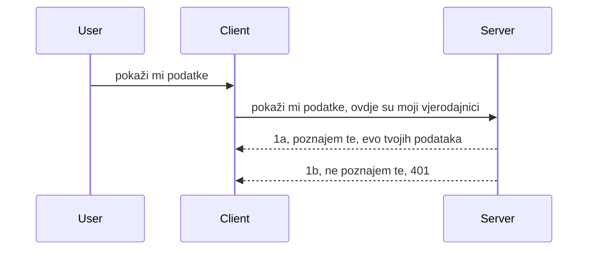

# Jednostavna autorizacija

MCP SDK-ovi podržavaju korištenje OAuth 2.1 koji je, iskreno rečeno, prilično složen proces koji uključuje koncepte poput auth servera, resource servera, slanja vjerodajnica, dobivanja koda, zamjene koda za bearer token dok konačno ne dobijete pristup podatcima resursa. Ako niste navikli na OAuth, što je sjajna stvar za implementirati, dobro je započeti s nekim osnovnim oblikom autorizacije i graditi prema boljoj i boljoj sigurnosti. Zato ovo poglavlje postoji, da vas uvede u napredniju autorizaciju.

## Autorizacija, što pod tim mislimo?

Autorizacija je skraćeno od autentikacije i autorizacije. Ideja je da trebamo napraviti dvije stvari:

- **Autentikacija**, proces utvrđivanja dopuštamo li osobi da uđe u naš dom, da imaju pravo biti "ovdje", odnosno da imaju pristup našem resource serveru gdje se nalaze značajke našeg MCP servera.
- **Autorizacija**, je proces utvrđivanja ima li korisnik pravo pristupiti određenim resursima koje traži, na primjer tim narudžbama ili tim proizvodima ili je li mu dozvoljeno samo čitanje sadržaja bez brisanja, kao primjer.

## Vjerodajnice: kako sustavu kažemo tko smo

Većina web programera kreće razmišljati u smislu pružanja vjerodajnice serveru, obično tajna koja govori je li im dopušteno ovdje biti "Autentikacija". Ta vjerodajnica je obično base64 kodirana verzija korisničkog imena i lozinke ili API ključ koji jedinstveno identificira određenog korisnika.

To uključuje slanje putem headera nazvanog "Authorization" ovako:

```json
{ "Authorization": "secret123" }
```

Ovo se obično naziva osnovnom autentikacijom. Kako ukupni tijek rada funkcionira je na sljedeći način:


Sada kada razumijemo kako to funkcionira iz perspektive tijeka, kako to implementirati? Većina web servera ima koncept nazvan middleware, dio koda koji se izvršava kao dio zahtjeva i može provjeriti vjerodajnice, te ako su vjerodajnice valjane, može pustiti zahtjev dalje. Ako zahtjev nema valjane vjerodajnice, dobijete grešku autorizacije. Pogledajmo kako se to može implementirati:

**Python**

```python
class AuthMiddleware(BaseHTTPMiddleware):
    async def dispatch(self, request, call_next):

        has_header = request.headers.get("Authorization")
        if not has_header:
            print("-> Missing Authorization header!")
            return Response(status_code=401, content="Unauthorized")

        if not valid_token(has_header):
            print("-> Invalid token!")
            return Response(status_code=403, content="Forbidden")

        print("Valid token, proceeding...")
       
        response = await call_next(request)
        # dodajte bilo koje prilagođene zaglavlja ili na neki način promijenite odgovor
        return response


starlette_app.add_middleware(CustomHeaderMiddleware)
```

Ovdje imamo:

- Napravili middleware nazvan `AuthMiddleware` gdje se njegova metoda `dispatch` poziva od strane web servera.
- Dodali middleware web serveru:

    ```python
    starlette_app.add_middleware(AuthMiddleware)
    ```

- Napisali validacijsku logiku koja provjerava je li Authorization header prisutan i je li poslana tajna valjana:

    ```python
    has_header = request.headers.get("Authorization")
    if not has_header:
        print("-> Missing Authorization header!")
        return Response(status_code=401, content="Unauthorized")

    if not valid_token(has_header):
        print("-> Invalid token!")
        return Response(status_code=403, content="Forbidden")
    ```

    Ako je tajna prisutna i valjana, pustimo zahtjev kroz pozivanjem `call_next` i vraćamo odgovor.

    ```python
    response = await call_next(request)
    # dodajte bilo koje prilagođene zaglavlja ili na neki način promijenite odgovor
    return response
    ```

Kako to funkcionira je da ako se napravi web zahtjev prema serveru, middleware će se pozvati i s obzirom na implementaciju ili će pustiti zahtjev dalje ili vratiti grešku koja pokazuje da klijent nema dozvolu nastaviti.

**TypeScript**

Ovdje stvaramo middleware s popularnim frameworkom Express i presrećemo zahtjev prije nego dođe do MCP Servera. Evo koda za to:

```typescript
function isValid(secret) {
    return secret === "secret123";
}

app.use((req, res, next) => {
    // 1. Je li zaglavlje autorizacije prisutno?
    if(!req.headers["Authorization"]) {
        res.status(401).send('Unauthorized');
    }
    
    let token = req.headers["Authorization"];

    // 2. Provjerite valjanost.
    if(!isValid(token)) {
        res.status(403).send('Forbidden');
    }

   
    console.log('Middleware executed');
    // 3. Prosljeđuje zahtjev na sljedeći korak u tijeku zahtjeva.
    next();
});
```

U ovom kodu:

1. Provjeravamo je li Authorization header uopće prisutan, ako nije, šaljemo grešku 401.
2. Osiguravamo da je vjerodajnica/token valjan, ako nije, šaljemo grešku 403.
3. Na kraju prosljeđujemo zahtjev kroz pipeline i vraćamo traženi resurs.

## Vježba: Implementirajte autentikaciju

Iskoristimo naše znanje i pokušajmo implementirati to. Evo plana:

Server

- Kreirati web server i MCP instancu.
- Implementirati middleware za server.

Klijent

- Slati web zahtjev s vjerodajnicom preko headera.

### -1- Kreirati web server i MCP instancu

U prvom koraku potrebno je kreirati web server instancu i MCP Server.

**Python**

Ovdje kreiramo MCP server instancu, kreiramo starlette web aplikaciju i hostamo ju s uvicorn.

```python
# stvaranje MCP poslužitelja

app = FastMCP(
    name="MCP Resource Server",
    instructions="Resource Server that validates tokens via Authorization Server introspection",
    host=settings["host"],
    port=settings["port"],
    debug=True
)

# stvaranje starlette web aplikacije
starlette_app = app.streamable_http_app()

# posluživanje aplikacije putem uvicorn-a
async def run(starlette_app):
    import uvicorn
    config = uvicorn.Config(
            starlette_app,
            host=app.settings.host,
            port=app.settings.port,
            log_level=app.settings.log_level.lower(),
        )
    server = uvicorn.Server(config)
    await server.serve()

run(starlette_app)
```

U ovom kodu:

- Kreiramo MCP Server.
- Konstruiramo starlette web aplikaciju iz MCP Servera, `app.streamable_http_app()`.
- Hostamo i služimo web aplikaciju koristeći uvicorn `server.serve()`.

**TypeScript**

Ovdje kreiramo MCP Server instancu.

```typescript
const server = new McpServer({
      name: "example-server",
      version: "1.0.0"
    });

    // ... postavi resurse servera, alate i upite ...
```

Kreiranje MCP Servera treba se dogoditi unutar definicije rute POST /mcp, pa ćemo gore navedeni kod premjestiti ovako:

```typescript
import express from "express";
import { randomUUID } from "node:crypto";
import { McpServer } from "@modelcontextprotocol/sdk/server/mcp.js";
import { StreamableHTTPServerTransport } from "@modelcontextprotocol/sdk/server/streamableHttp.js";
import { isInitializeRequest } from "@modelcontextprotocol/sdk/types.js"

const app = express();
app.use(express.json());

// Karta za spremanje transporta po ID-u sesije
const transports: { [sessionId: string]: StreamableHTTPServerTransport } = {};

// Obradi POST zahtjeve za komunikaciju od klijenta prema serveru
app.post('/mcp', async (req, res) => {
  // Provjeri postoji li ID sesije
  const sessionId = req.headers['mcp-session-id'] as string | undefined;
  let transport: StreamableHTTPServerTransport;

  if (sessionId && transports[sessionId]) {
    // Ponovno koristi postojeći transport
    transport = transports[sessionId];
  } else if (!sessionId && isInitializeRequest(req.body)) {
    // Novi zahtjev za inicijalizaciju
    transport = new StreamableHTTPServerTransport({
      sessionIdGenerator: () => randomUUID(),
      onsessioninitialized: (sessionId) => {
        // Spremi transport po ID-u sesije
        transports[sessionId] = transport;
      },
      // Zaštita od DNS rebindinga prema zadanim postavkama je onemogućena radi kompatibilnosti unatrag. Ako pokrećete ovaj server
      // lokalno, obavezno postavite:
      // enableDnsRebindingProtection: true,
      // allowedHosts: ['127.0.0.1'],
    });

    // Očisti transport kad se zatvori
    transport.onclose = () => {
      if (transport.sessionId) {
        delete transports[transport.sessionId];
      }
    };
    const server = new McpServer({
      name: "example-server",
      version: "1.0.0"
    });

    // ... postavi resurse servera, alate i upute ...

    // Poveži se na MCP server
    await server.connect(transport);
  } else {
    // Nevažeći zahtjev
    res.status(400).json({
      jsonrpc: '2.0',
      error: {
        code: -32000,
        message: 'Bad Request: No valid session ID provided',
      },
      id: null,
    });
    return;
  }

  // Obradi zahtjev
  await transport.handleRequest(req, res, req.body);
});

// Ponovno upotrebljivi rukovatelj za GET i DELETE zahtjeve
const handleSessionRequest = async (req: express.Request, res: express.Response) => {
  const sessionId = req.headers['mcp-session-id'] as string | undefined;
  if (!sessionId || !transports[sessionId]) {
    res.status(400).send('Invalid or missing session ID');
    return;
  }
  
  const transport = transports[sessionId];
  await transport.handleRequest(req, res);
};

// Obradi GET zahtjeve za obavijesti s servera prema klijentu putem SSE
app.get('/mcp', handleSessionRequest);

// Obradi DELETE zahtjeve za prekid sesije
app.delete('/mcp', handleSessionRequest);

app.listen(3000);
```

Sada vidite kako je kreiranje MCP Servera premješteno unutar `app.post("/mcp")`.

Prijeđimo na sljedeći korak - kreiranje middlewarea za validaciju dolaznih vjerodajnica.

### -2- Implementirati middleware za server

Sljedeće kreirajmo middleware koji traži vjerodajnicu u `Authorization` headeru i validira ju. Ako je prihvatljiva, zahtjev nastavlja sa svojim poslom (npr. listanje alata, čitanje resursa ili bilo koja MCP funkcionalnost koju klijent traži).

**Python**

Za kreiranje middleware-a, treba napraviti klasu koja nasljeđuje `BaseHTTPMiddleware`. Dva su zanimljiva dijela:

- Zahtjev `request`, iz kojeg čitamo informacije iz headera.
- `call_next`, callback koji trebamo pozvati ako klijent ima prihvatljivu vjerodajnicu.

Prvo, potrebno je obraditi slučaj ako `Authorization` header nedostaje:

```python
has_header = request.headers.get("Authorization")

# zaglavlje nije prisutno, ne uspijeva s 401, inače nastavi dalje.
if not has_header:
    print("-> Missing Authorization header!")
    return Response(status_code=401, content="Unauthorized")
```

Ovdje šaljemo poruku 401 unauthorized jer klijent ne uspijeva autentikaciju.

Zatim, ako je vjerodajnica dostavljena, potrebno je provjeriti njenu valjanost ovako:

```python
 if not valid_token(has_header):
    print("-> Invalid token!")
    return Response(status_code=403, content="Forbidden")
```

Primijetite kako gore šaljemo poruku 403 forbidden. Pogledajmo kompletnu implementaciju middleware-a ispod koja uključuje sve spomenuto:

```python
class AuthMiddleware(BaseHTTPMiddleware):
    async def dispatch(self, request, call_next):

        has_header = request.headers.get("Authorization")
        if not has_header:
            print("-> Missing Authorization header!")
            return Response(status_code=401, content="Unauthorized")

        if not valid_token(has_header):
            print("-> Invalid token!")
            return Response(status_code=403, content="Forbidden")

        print("Valid token, proceeding...")
        print(f"-> Received {request.method} {request.url}")
        response = await call_next(request)
        response.headers['Custom'] = 'Example'
        return response

```

Odlično, a što je s funkcijom `valid_token`? Evo ju ispod:

```python
# NE koristite za produkciju - poboljšajte to !!
def valid_token(token: str) -> bool:
    # uklonite prefiks "Bearer "
    if token.startswith("Bearer "):
        token = token[7:]
        return token == "secret-token"
    return False
```

Ovo se naravno može poboljšati.

VAŽNO: Nikada ne biste smjeli imati tajne ovako direktno u kodu. Idealno je vrijednost za usporedbu dohvatiti iz izvora podataka ili od IDP-a (provider identiteta) ili još bolje, dopustiti IDP-u da obavi validaciju.

**TypeScript**

Za implementaciju u Expressu, potrebno je pozvati metodu `use` koja prihvaća middleware funkcije.

Potrebno:

- Interakcija s varijablom zahtjeva kako bismo provjerili poslane vjerodajnice iz `Authorization` svojstva.
- Validirati vjerodajnice i ako su valjane, pustiti zahtjev da nastavi i da MCP zahtjev klijenta obavi svoj zadatak (npr. popis alata, čitanje resursa i slično).

Ovdje provjeravamo ima li `Authorization` header i ako nema, zaustavljamo zahtjev:

```typescript
if(!req.headers["authorization"]) {
    res.status(401).send('Unauthorized');
    return;
}
```

Ako header nije poslan uopće, dobivate 401.

Zatim provjeravamo je li vjerodajnica validna; ako nije, opet zaustavljamo zahtjev ali s drugačijom porukom:

```typescript
if(!isValid(token)) {
    res.status(403).send('Forbidden');
    return;
} 
```

Kao što vidite sada dobivate 403 grešku.

Evo kompletnog koda:

```typescript
app.use((req, res, next) => {
    console.log('Request received:', req.method, req.url, req.headers);
    console.log('Headers:', req.headers["authorization"]);
    if(!req.headers["authorization"]) {
        res.status(401).send('Unauthorized');
        return;
    }
    
    let token = req.headers["authorization"];

    if(!isValid(token)) {
        res.status(403).send('Forbidden');
        return;
    }  

    console.log('Middleware executed');
    next();
});
```

Postavili smo web server da prihvati middleware koji provjerava vjerodajnice koje nam klijent šalje. A što je s samim klijentom?

### -3- Slanje web zahtjeva s vjerodajnicom putem headera

Moramo osigurati da klijent prosljeđuje vjerodajnicu putem headera. Kako ćemo koristiti MCP klijenta za to, treba saznati kako se to radi.

**Python**

Za klijenta je potrebno proslijediti header s vjerodajnicom ovako:

```python
# NEMOJTE fiksirati vrijednost, imajte je barem u varijabli okoline ili nekom sigurnijem spremištu
token = "secret-token"

async with streamablehttp_client(
        url = f"http://localhost:{port}/mcp",
        headers = {"Authorization": f"Bearer {token}"}
    ) as (
        read_stream,
        write_stream,
        session_callback,
    ):
        async with ClientSession(
            read_stream,
            write_stream
        ) as session:
            await session.initialize()
      
            # TODO, što želite da se radi na klijentu, npr. popis alata, pozivanje alata itd.
```

Primijetite kako popunjavamo svojstvo `headers` ovako ` headers = {"Authorization": f"Bearer {token}"}`.

**TypeScript**

Možemo to riješiti u dva koraka:

1. Napraviti konfiguracijski objekt s našim vjerodajnicama.
2. Proslijediti taj konfiguracijski objekt transportu.

```typescript

// NEMOJTE tvrdo kodirati vrijednost kao što je prikazano ovdje. Najmanje neka bude kao varijabla okoline i koristite nešto poput dotenv (u razvojnom načinu).
let token = "secret123"

// definirajte objekt opcija za klijentski transport
let options: StreamableHTTPClientTransportOptions = {
  sessionId: sessionId,
  requestInit: {
    headers: {
      "Authorization": "secret123"
    }
  }
};

// proslijedite objekt opcija transportu
async function main() {
   const transport = new StreamableHTTPClientTransport(
      new URL(serverUrl),
      options
   );
```

Ovdje vidite da smo morali napraviti `options` objekt i staviti header pod `requestInit` svojstvo.

VAŽNO: Kako to još poboljšati? Trenutna implementacija ima problema. Prvo, prenošenje vjerodajnica na ovaj način je prilično rizično osim ako ne koristite barem HTTPS. Čak i tada, vjerodajnica može biti ukradena pa vam treba sustav u kojem lako možete opozvati token i dodati dodatne provjere kao odakle dolazi zahtjev u svijetu, da li se zahtjev ponavlja prečesto (ponašanje poput bota) i slično, postoji cijeli niz problema.

Ipak, za vrlo jednostavne API-je gdje ne želite da netko tko nije autentificiran poziva vaš API, ono što imamo ovdje je dobar početak.

S time rečeno, pokušajmo malo ojačati sigurnost korištenjem standardiziranog formata poput JSON Web Tokena, poznatog kao JWT ili "JOT" tokeni.

## JSON Web Tokeni, JWT

Dakle, pokušavamo poboljšati stvari u odnosu na slanje vrlo jednostavnih vjerodajnica. Koje su neposredne prednosti usvajanja JWT-a?

- **Poboljšanja sigurnosti**. U osnovnoj autentikaciji šaljete korisničko ime i lozinku kao base64 kodirani token (ili šaljete API ključ) iznova i iznova, što povećava rizik. Kod JWT-a šaljete korisničko ime i lozinku i dobijete token zauzvrat, koji je vremenski ograničen i ističe. JWT vam omogućava jednostavnu upotrebu detaljne kontrole pristupa koristeći uloge, opsege i dozvole.
- **Bezstanje i skalabilnost**. JWT su samostalni, nose sve korisničke informacije i eliminiraju potrebu za pohranom sesija na serveru. Token se može validirati lokalno.
- **Interoperabilnost i federacija**. JWT je centralni dio Open ID Connecta i koristi se s poznatim identitetskim providerima poput Entra ID, Google Identity i Auth0. Također omogućuje single sign-on i mnogo više, čineći ga enterprise razinom.
- **Modularnost i fleksibilnost**. JWT se mogu koristiti s API Gatewayima poput Azure API Management, NGINX i više. Također podržava scenarije korištenja autentikacije i komunikacije server-server uključujući impersonaciju i delegaciju.
- **Performanse i keširanje**. JWT se može keširati nakon dekodiranja što smanjuje potrebu za parsiranjem. Ovo pomaže posebno u aplikacijama s velikim prometom jer poboljšava propusnost i smanjuje opterećenje infrastrukture.
- **Napredne značajke**. Također podržava introspekciju (provjera valjanosti na serveru) i opoziv (činjenje tokena nevaljanim).

S svim ovim prednostima, pogledajmo kako možemo uzdići našu implementaciju na sljedeću razinu.

## Pretvaranje osnovne autorizacije u JWT

Dakle, izmjene koje na visokoj razini trebamo napraviti su:

- **Naučiti kako konstruirati JWT token** i pripremiti ga za slanje od klijenta prema serveru.
- **Validirati JWT token** i ako je valjan, pustiti klijenta da pristupi resursima.
- **Sigurno spremanje tokena**. Kako spremiti taj token.
- **Zaštita ruta**. Moramo zaštititi rute, u našem slučaju zaštititi rute i određene MCP značajke.
- **Dodati refresh tokene**. Osigurati da stvaramo tokene s kratkim rokom trajanja, ali i refresh tokene s dugim rokom koji se koriste za dobivanje novih tokena ako su istekli. Također osigurati endpoint za refresh i strategiju rotacije.

### -1- Konstruiranje JWT tokena

Prije svega, JWT token ima sljedeće dijelove:

- **header**, korišteni algoritam i tip tokena.
- **payload**, tvrdnje, poput sub (korisnik ili entitet koji token predstavlja, obično korisnički ID u auth scenariju), exp (vrijeme isteka), role (uloga).
- **signature**, potpisano tajnom ili privatnim ključem.

Za ovo moramo konstruirati header, payload i kodirani token.

**Python**

```python

import jwt
import jwt
from jwt.exceptions import ExpiredSignatureError, InvalidTokenError
import datetime

# Tajni ključ koji se koristi za potpisivanje JWT-a
secret_key = 'your-secret-key'

header = {
    "alg": "HS256",
    "typ": "JWT"
}

# korisničke informacije, njegove tvrdnje i vrijeme isteka
payload = {
    "sub": "1234567890",               # Subjekt (ID korisnika)
    "name": "User Userson",                # Prilagođena tvrdnja
    "admin": True,                     # Prilagođena tvrdnja
    "iat": datetime.datetime.utcnow(),# Izdan u
    "exp": datetime.datetime.utcnow() + datetime.timedelta(hours=1)  # Ističe
}

# kodiraj ga
encoded_jwt = jwt.encode(payload, secret_key, algorithm="HS256", headers=header)
```

U gornjem kodu:

- Definirali smo header koristeći HS256 kao algoritam i tip JWT.
- Konstruirali payload koji sadrži subject ili korisnički ID, korisničko ime, ulogu, vrijeme izdavanja i vrijeme isteka, čime implementiramo vremensko ograničenje koje smo ranije spomenuli.

**TypeScript**

Ovdje ćemo trebati neke ovisnosti koje će nam pomoći konstruirati JWT token.

Ovisnosti

```sh

npm install jsonwebtoken
npm install --save-dev @types/jsonwebtoken
```

Sada kada to imamo, kreirajmo header, payload i preko njih encodeajmo token.

```typescript
import jwt from 'jsonwebtoken';

const secretKey = 'your-secret-key'; // Koristite varijable okoline u produkciji

// Definirajte sadržaj
const payload = {
  sub: '1234567890',
  name: 'User usersson',
  admin: true,
  iat: Math.floor(Date.now() / 1000), // Izdan u
  exp: Math.floor(Date.now() / 1000) + 60 * 60 // Istječe za 1 sat
};

// Definirajte zaglavlje (nije obavezno, jsonwebtoken postavlja zadane vrijednosti)
const header = {
  alg: 'HS256',
  typ: 'JWT'
};

// Kreirajte token
const token = jwt.sign(payload, secretKey, {
  algorithm: 'HS256',
  header: header
});

console.log('JWT:', token);
```

Ovaj token je:

Potpisan HS256
Valjan je 1 sat
Uključuje tvrdnje poput sub, name, admin, iat i exp.

### -2- Validacija tokena

Također ćemo trebati validirati token, to je nešto što bi trebali napraviti na serveru da bismo osigurali da ono što klijent šalje jest doista valjano. Postoji mnogo provjera koje treba napraviti, od validacije strukture do valjanosti. Također se preporučuje dodati i druge provjere, poput postoji li korisnik u sustavu i slično.

Za validaciju tokena moramo ga dekodirati da ga možemo pročitati i zatim provjeriti njegovu valjanost:

**Python**

```python

# Dekodiraj i provjeri JWT
try:
    decoded = jwt.decode(token, secret_key, algorithms=["HS256"])
    print("✅ Token is valid.")
    print("Decoded claims:")
    for key, value in decoded.items():
        print(f"  {key}: {value}")
except ExpiredSignatureError:
    print("❌ Token has expired.")
except InvalidTokenError as e:
    print(f"❌ Invalid token: {e}")

```

U ovom kodu koristimo `jwt.decode` s tokenom, tajnim ključem i odabranim algoritmom. Primijetite da koristimo try-catch konstrukciju jer neuspješna validacija baca grešku.

**TypeScript**

Ovdje ćemo pozvati `jwt.verify` da dobijemo dekodiranu verziju tokena koju možemo dalje analizirati. Ako poziv ne uspije, to znači da je struktura tokena nepravilna ili više nije valjan.

```typescript

try {
  const decoded = jwt.verify(token, secretKey);
  console.log('Decoded Payload:', decoded);
} catch (err) {
  console.error('Token verification failed:', err);
}
```

NAPOMENA: kao što je ranije spomenuto, trebamo napraviti dodatne provjere da osiguramo da token označava korisnika iz našeg sustava i da korisnik ima prava koja tvrdi da ima.

Zatim, pogledajmo kontrolu pristupa baziranu na ulogama, poznatu kao RBAC.
## Dodavanje kontrole pristupa na temelju uloga

Ideja je da želimo izraziti da različite uloge imaju različite dozvole. Na primjer, pretpostavljamo da admin može raditi sve, obični korisnik može čitati/pisati, a gost može samo čitati. Stoga, evo nekih mogućih razina dozvola:

- Admin.Write 
- User.Read
- Guest.Read

Pogledajmo kako možemo implementirati takvu kontrolu pomoću middlewarea. Middleware se može dodati po ruti kao i za sve rute.

**Python**

```python
from starlette.middleware.base import BaseHTTPMiddleware
from starlette.responses import JSONResponse
import jwt

# NEMOJTE imati tajnu u kodu, ovo je samo za demonstracijske svrhe. Pročitajte je s sigurnog mjesta.
SECRET_KEY = "your-secret-key" # stavite ovo u env varijablu
REQUIRED_PERMISSION = "User.Read"

class JWTPermissionMiddleware(BaseHTTPMiddleware):
    async def dispatch(self, request, call_next):
        auth_header = request.headers.get("Authorization")
        if not auth_header or not auth_header.startswith("Bearer "):
            return JSONResponse({"error": "Missing or invalid Authorization header"}, status_code=401)

        token = auth_header.split(" ")[1]
        try:
            decoded = jwt.decode(token, SECRET_KEY, algorithms=["HS256"])
        except jwt.ExpiredSignatureError:
            return JSONResponse({"error": "Token expired"}, status_code=401)
        except jwt.InvalidTokenError:
            return JSONResponse({"error": "Invalid token"}, status_code=401)

        permissions = decoded.get("permissions", [])
        if REQUIRED_PERMISSION not in permissions:
            return JSONResponse({"error": "Permission denied"}, status_code=403)

        request.state.user = decoded
        return await call_next(request)


```

Postoji nekoliko različitih načina za dodavanje middlewarea kao dolje:

```python

# Alt 1: dodaj middleware tijekom konstrukcije starlette aplikacije
middleware = [
    Middleware(JWTPermissionMiddleware)
]

app = Starlette(routes=routes, middleware=middleware)

# Alt 2: dodaj middleware nakon što je starlette aplikacija već konstruirana
starlette_app.add_middleware(JWTPermissionMiddleware)

# Alt 3: dodaj middleware po ruti
routes = [
    Route(
        "/mcp",
        endpoint=..., # rukovatelj
        middleware=[Middleware(JWTPermissionMiddleware)]
    )
]
```

**TypeScript**

Možemo koristiti `app.use` i middleware koji će se izvršavati za sve zahtjeve.

```typescript
app.use((req, res, next) => {
    console.log('Request received:', req.method, req.url, req.headers);
    console.log('Headers:', req.headers["authorization"]);

    // 1. Provjerite je li zaglavlje autorizacije poslano

    if(!req.headers["authorization"]) {
        res.status(401).send('Unauthorized');
        return;
    }
    
    let token = req.headers["authorization"];

    // 2. Provjerite je li token valjan
    if(!isValid(token)) {
        res.status(403).send('Forbidden');
        return;
    }  

    // 3. Provjerite postoji li korisnik tokena u našem sustavu
    if(!isExistingUser(token)) {
        res.status(403).send('Forbidden');
        console.log("User does not exist");
        return;
    }
    console.log("User exists");

    // 4. Potvrdite ima li token odgovarajuće dozvole
    if(!hasScopes(token, ["User.Read"])){
        res.status(403).send('Forbidden - insufficient scopes');
    }

    console.log("User has required scopes");

    console.log('Middleware executed');
    next();
});

```

Postoji priličan broj stvari koje možemo dopustiti našem middlewareu i koje naš middleware TREBA raditi, odnosno:

1. Provjeriti postoji li zaglavlje autorizacije
2. Provjeriti je li token valjan, pozivamo `isValid` što je metoda koju smo napisali za provjeru integriteta i valjanosti JWT tokena.
3. Potvrditi da korisnik postoji u našem sustavu, to bi trebali provjeriti.

   ```typescript
    // korisnici u bazi podataka
   const users = [
     "user1",
     "User usersson",
   ]

   function isExistingUser(token) {
     let decodedToken = verifyToken(token);

     // TODO, provjeriti postoji li korisnik u bazi podataka
     return users.includes(decodedToken?.name || "");
   }
   ```

   Iznad smo kreirali vrlo jednostavnu listu `users`, koja bi naravno trebala biti u bazi podataka.

4. Osim toga, trebali bismo provjeriti ima li token odgovarajuće dozvole.

   ```typescript
   if(!hasScopes(token, ["User.Read"])){
        res.status(403).send('Forbidden - insufficient scopes');
   }
   ```

   U gornjem kodu middlewarea provjeravamo sadrži li token dozvolu User.Read, ako ne, šaljemo grešku 403. Ispod je pomoćna metoda `hasScopes`.

   ```typescript
   function hasScopes(scope: string, requiredScopes: string[]) {
     let decodedToken = verifyToken(scope);
    return requiredScopes.every(scope => decodedToken?.scopes.includes(scope));
  }
   ```

Have a think which additional checks you should be doing, but these are the absolute minimum of checks you should be doing.

Using Express as a web framework is a common choice. There are helpers library when you use JWT so you can write less code.

- `express-jwt`, helper library that provides a middleware that helps decode your token.
- `express-jwt-permissions`, this provides a middleware `guard` that helps check if a certain permission is on the token.

Here's what these libraries can look like when used:

```typescript
const express = require('express');
const jwt = require('express-jwt');
const guard = require('express-jwt-permissions')();

const app = express();
const secretKey = 'your-secret-key'; // put this in env variable

// Decode JWT and attach to req.user
app.use(jwt({ secret: secretKey, algorithms: ['HS256'] }));

// Check for User.Read permission
app.use(guard.check('User.Read'));

// multiple permissions
// app.use(guard.check(['User.Read', 'Admin.Access']));

app.get('/protected', (req, res) => {
  res.json({ message: `Welcome ${req.user.name}` });
});

// Error handler
app.use((err, req, res, next) => {
  if (err.code === 'permission_denied') {
    return res.status(403).send('Forbidden');
  }
  next(err);
});

```

Sada ste vidjeli kako se middleware može koristiti za autentifikaciju i autorizaciju, a što je s MCP-om, mijenja li nešto u načinu na koji radimo autentifikaciju? Saznajmo u sljedećem poglavlju.

### -3- Dodavanje RBAC u MCP

Do sada ste vidjeli kako dodati RBAC preko middlewarea, no za MCP nema lakog načina za dodavanje RBAC po značajci MCP-a, što onda napraviti? Pa, jednostavno moramo dodati kod poput ovog koji provjerava ima li klijent pravo pozvati određeni alat:

Imate nekoliko različitih izbora kako ostvariti RBAC po značajci, evo nekih:

- Dodati provjeru za svaki alat, resurs, prompt gdje trebate provjeriti razinu dozvole.

   **python**

   ```python
   @tool()
   def delete_product(id: int):
      try:
          check_permissions(role="Admin.Write", request)
      catch:
        pass # klijent nije uspio autorizaciju, podigni pogrešku autorizacije
   ```

   **typescript**

   ```typescript
   server.registerTool(
    "delete-product",
    {
      title: Delete a product",
      description: "Deletes a product",
      inputSchema: { id: z.number() }
    },
    async ({ id }) => {
      
      try {
        checkPermissions("Admin.Write", request);
        // todo, pošalji id u productService i udaljeni unos
      } catch(Exception e) {
        console.log("Authorization error, you're not allowed");  
      }

      return {
        content: [{ type: "text", text: `Deletected product with id ${id}` }]
      };
    }
   );
   ```


- Koristiti napredniji pristup servera i rukovatelje zahtjevima kako biste smanjili broj mjesta na kojima trebate napraviti provjeru.

   **Python**

   ```python
   
   tool_permission = {
      "create_product": ["User.Write", "Admin.Write"],
      "delete_product": ["Admin.Write"]
   }

   def has_permission(user_permissions, required_permissions) -> bool:
      # user_permissions: popis dopuštenja koja korisnik ima
      # required_permissions: popis dopuštenja potrebnih za alat
      return any(perm in user_permissions for perm in required_permissions)

   @server.call_tool()
   async def handle_call_tool(
     name: str, arguments: dict[str, str] | None
   ) -> list[types.TextContent]:
    # Pretpostavi da je request.user.permissions popis dopuštenja za korisnika
     user_permissions = request.user.permissions
     required_permissions = tool_permission.get(name, [])
     if not has_permission(user_permissions, required_permissions):
        # Podigni grešku "Nemate dopuštenje za korištenje alata {name}"
        raise Exception(f"You don't have permission to call tool {name}")
     # nastavi i pozovi alat
     # ...
   ```   
   

   **TypeScript**

   ```typescript
   function hasPermission(userPermissions: string[], requiredPermissions: string[]): boolean {
       if (!Array.isArray(userPermissions) || !Array.isArray(requiredPermissions)) return false;
       // Vratite true ako korisnik ima barem jednu potrebnu dozvolu
       
       return requiredPermissions.some(perm => userPermissions.includes(perm));
   }
  
   server.setRequestHandler(CallToolRequestSchema, async (request) => {
      const { params: { name } } = request;
  
      let permissions = request.user.permissions;
  
      if (!hasPermission(permissions, toolPermissions[name])) {
         return new Error(`You don't have permission to call ${name}`);
      }
  
      // nastavi..
   });
   ```

   Napomena, trebate osigurati da vaš middleware dodijeli dekodirani token u korisničko svojstvo zahtjeva kako bi gornji kod bio jednostavan.

### Sažetak

Sada kada smo razgovarali o tome kako dodati podršku za RBAC općenito i za MCP posebno, vrijeme je da pokušate sami implementirati sigurnost kako biste bili sigurni da ste razumjeli koncepte koji su vam predstavljeni.

## Zadatak 1: Izgradite mcp poslužitelj i mcp klijenta koristeći osnovnu autentifikaciju

Ovdje ćete iskoristiti ono što ste naučili o slanju vjerodajnica putem zaglavlja.

## Rješenje 1

[Rješenje 1](./code/basic/README.md)

## Zadatak 2: Nadogradite rješenje iz Zadatka 1 da koristi JWT

Uzmite prvo rješenje, ali ovaj put poboljšajmo ga.

Umjesto korištenja Basic Auth, koristimo JWT.

## Rješenje 2

[Rješenje 2](./solution/jwt-solution/README.md)

## Izazov

Dodajte RBAC po alatu koji opisujemo u odjeljku "Dodavanje RBAC u MCP".

## Sažetak

Nadamo se da ste puno naučili u ovom poglavlju, od potpune odsutnosti sigurnosti, preko osnovne sigurnosti, do JWT-a i kako ga se može dodati u MCP.

Izgradili smo čvrstu osnovu s prilagođenim JWT-ovima, ali kako skaliramo, prelazimo na model identiteta temeljen na standardima. Usvajanjem IdP-a poput Entre ili Keycloak-a omogućujemo delegiranje izdavanja, provjere i upravljanja životnim ciklusom tokena pouzdanoj platformi — oslobađajući nas da se fokusiramo na logiku aplikacije i korisničko iskustvo.

Za to imamo i naprednije [poglavlje o Entri](../../05-AdvancedTopics/mcp-security-entra/README.md)

## Što slijedi

- Sljedeće: [Postavljanje MCP Hostova](../12-mcp-hosts/README.md)

---

<!-- CO-OP TRANSLATOR DISCLAIMER START -->
**Odricanje od odgovornosti**:
Ovaj je dokument preveden pomoću AI prevoditeljske usluge [Co-op Translator](https://github.com/Azure/co-op-translator). Iako nastojimo postići točnost, imajte na umu da automatski prijevodi mogu sadržavati pogreške ili netočnosti. Izvorni dokument na izvornom jeziku treba smatrati važećim i konačnim izvorom. Za kritične informacije preporučuje se profesionalni ljudski prijevod. Nismo odgovorni za bilo kakva nesporazuma ili pogrešna tumačenja nastala korištenjem ovog prijevoda.
<!-- CO-OP TRANSLATOR DISCLAIMER END -->