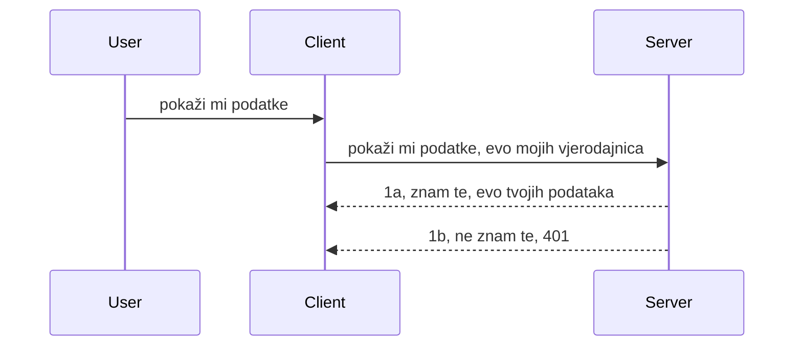

# Jednostavna autentifikacija

MCP SDK-i podržavaju korištenje OAuth 2.1 koji je, da budemo iskreni, prilično složen proces koji uključuje pojmove poput auth servera, resource servera, slanja vjerodajnica, dobivanja koda, zamjene koda za bearer token dok konačno ne dođete do podataka resursa. Ako niste navikli na OAuth što je sjajna stvar za implementaciju, dobra je ideja započeti s nekom osnovnom razinom autentifikacije i graditi prema sve boljoj i boljoj sigurnosti. Zato postoji ovo poglavlje, da vas izgradi do naprednije autentifikacije.

## Autentifikacija, što pod tim mislimo?

Autentifikacija je skraćeno od authentication i authorization. Ideja je da trebamo napraviti dvije stvari:

- **Autentifikacija**, proces utvrđivanja da li ćemo osobi dopustiti da uđe u naš dom, da li ima pravo biti "ovdje" odnosno imati pristup našem resource serveru gdje žive naše MCP Server funkcionalnosti.
- **Autorizacija**, je proces utvrđivanja da li korisnik smije imati pristup specifičnim resursima koje traži, na primjer ovim narudžbama ili proizvodima, ili smije samo čitati sadržaj ali ne i brisati kao drugi primjer.

## Vjerodajnice: kako sustavu kažemo tko smo

Pa, većina web developera obično razmišlja u smislu pružanja vjerodajnica serveru, obično tajne koja kaže ako smiju biti ovdje "Autentifikacija". Ova vjerodajnica je obično base64 kodirana verzija korisničkog imena i lozinke ili API ključ koji jedinstveno identificira određenog korisnika.

To podrazumijeva slanje putem headera nazvanog "Authorization" ovako:

```json
{ "Authorization": "secret123" }
```

Ovo se obično naziva osnovna autentifikacija. Kako cijeli tijek radi je na sljedeći način:


```mermaid
sequenceDiagram
   participant User
   participant Client
   participant Server

   User->>Client: pokaži mi podatke
   Client->>Server: pokaži mi podatke, evo mojih vjerodajnica
   Server-->>Client: 1a, znam te, evo tvojih podataka
   Server-->>Client: 1b, ne znam te, 401 
```

Sada kada razumijemo kako to funkcionira s aspekta tijeka, kako to implementirati? Većina web servera ima koncept zvan middleware, komad koda koji se izvršava kao dio zahtjeva i može provjeriti vjerodajnice, i ako su vjerodajnice valjane može dopustiti prolaz zahtjeva. Ako zahtjev nema valjane vjerodajnice, dobit ćete auth grešku. Pogledajmo kako se to može implementirati:

**Python**

```python
class AuthMiddleware(BaseHTTPMiddleware):
    async def dispatch(self, request, call_next):

        has_header = request.headers.get("Authorization")
        if not has_header:
            print("-> Missing Authorization header!")
            return Response(status_code=401, content="Unauthorized")

        if not valid_token(has_header):
            print("-> Invalid token!")
            return Response(status_code=403, content="Forbidden")

        print("Valid token, proceeding...")
       
        response = await call_next(request)
        # dodajte bilo koje korisničke zaglavlja ili na neki način promijenite odgovor
        return response


starlette_app.add_middleware(CustomHeaderMiddleware)
```

Ovdje imamo:

- Kreirali middleware nazvan `AuthMiddleware` gdje se njegov `dispatch` metod poziva od strane web servera.
- Dodali middleware web serveru:

    ```python
    starlette_app.add_middleware(AuthMiddleware)
    ```

- Napisali logiku validacije koja provjerava je li Authorization header prisutan i je li poslana tajna važeća:

    ```python
    has_header = request.headers.get("Authorization")
    if not has_header:
        print("-> Missing Authorization header!")
        return Response(status_code=401, content="Unauthorized")

    if not valid_token(has_header):
        print("-> Invalid token!")
        return Response(status_code=403, content="Forbidden")
    ```

    ako tajna postoji i važeća je, tada propuštamo zahtjev pozivanjem `call_next` i vraćamo odgovor.

    ```python
    response = await call_next(request)
    # dodajte bilo koje prilagođene zaglavlja ili na neki način promijenite odgovor
    return response
    ```

Radi se o tome da ako se izvrši web zahtjev prema serveru, middleware će biti pozvan i prema njegovoj implementaciji ili će dopustiti prolaz zahtjeva ili će vratiti grešku koja upućuje da klijent nema pravo nastaviti.

**TypeScript**

Ovdje stvaramo middleware s popularnim frameworkom Express i presrećemo zahtjev prije nego što dođe do MCP Servera. Evo koda za to:

```typescript
function isValid(secret) {
    return secret === "secret123";
}

app.use((req, res, next) => {
    // 1. Je li zaglavlje autorizacije prisutno?
    if(!req.headers["Authorization"]) {
        res.status(401).send('Unauthorized');
    }
    
    let token = req.headers["Authorization"];

    // 2. Provjeri valjanost.
    if(!isValid(token)) {
        res.status(403).send('Forbidden');
    }

   
    console.log('Middleware executed');
    // 3. Prosljeđuje zahtjev na sljedeći korak u lancu zahtjeva.
    next();
});
```

U ovom kodu:

1. Provjeravamo je li Authorization header uopće prisutan, ako nije, šaljemo 401 grešku.
2. Provjeravamo je li vjerodajnica/token važeći, ako nije, šaljemo 403 grešku.
3. Na kraju prosljeđujemo zahtjev kroz pipeline i vraćamo traženi resurs.

## Vježba: Implementirajte autentifikaciju

Iskoristimo svoje znanje i pokušajmo implementirati. Evo plana:

Server

- Kreirajte web server i MCP instancu.
- Implementirajte middleware za server.

Klijent

- Pošaljite web zahtjev s vjerodajnicama putem headera.

### -1- Kreirajte web server i MCP instancu

> [!WARNING]
> Primjer TypeScript ispod cilja MCP `2025-11-25`. Prati transport
> po `mcp-session-id` i nije trenutni `2026-07-28` primjer transporta. MCP
> `2026-07-28` uklanja `initialize` handshake i ID protokola sesije; nove
> implementacije koriste samostalne zahtjeve. Pogledajte
> [Što se promijenilo u MCP-u: Specifikacija 2026-07-28](../../01-CoreConcepts/mcp-2026-07-28.md).

U prvom koraku trebamo kreirati instancu web servera i MCP Servera.

**Python**

Ovdje stvaramo MCP server instancu, kreiramo starlette web aplikaciju i hostamo je s uvicornom.

```python
# kreiranje MCP poslužitelja

app = FastMCP(
    name="MCP Resource Server",
    instructions="Resource Server that validates tokens via Authorization Server introspection",
    host=settings["host"],
    port=settings["port"],
    debug=True
)

# kreiranje starlette web aplikacije
starlette_app = app.streamable_http_app()

# posluživanje aplikacije putem uvicorn
async def run(starlette_app):
    import uvicorn
    config = uvicorn.Config(
            starlette_app,
            host=app.settings.host,
            port=app.settings.port,
            log_level=app.settings.log_level.lower(),
        )
    server = uvicorn.Server(config)
    await server.serve()

run(starlette_app)
```

U ovom kodu:

- Kreirali smo MCP Server.
- Konstrukcija starlette web aplikacije iz MCP Servera, `app.streamable_http_app()`.
- Hostanje i serviranje web aplikacije pomoću uvicorna `server.serve()`.

**TypeScript**

Ovdje stvaramo MCP Server instancu.

```typescript
const server = new McpServer({
      name: "example-server",
      version: "1.0.0"
    });

    // ... postavite resurse poslužitelja, alate i upute ...
```

Ovo kreiranje MCP Servera treba se odvijati unutar definicije naše POST /mcp rute, stoga uzmimo gornji kod i premjestimo ga ovako:

```typescript
import express from "express";
import { randomUUID } from "node:crypto";
import { McpServer } from "@modelcontextprotocol/sdk/server/mcp.js";
import { StreamableHTTPServerTransport } from "@modelcontextprotocol/sdk/server/streamableHttp.js";
import { isInitializeRequest } from "@modelcontextprotocol/sdk/types.js"

const app = express();
app.use(express.json());

// Mapa za pohranu transporta po ID-u sesije
const transports: { [sessionId: string]: StreamableHTTPServerTransport } = {};

// Obrada POST zahtjeva za komunikaciju klijent-poslužitelj
app.post('/mcp', async (req, res) => {
  // Provjera postojećeg ID-a sesije
  const sessionId = req.headers['mcp-session-id'] as string | undefined;
  let transport: StreamableHTTPServerTransport;

  if (sessionId && transports[sessionId]) {
    // Ponovna uporaba postojećeg transporta
    transport = transports[sessionId];
  } else if (!sessionId && isInitializeRequest(req.body)) {
    // Novi zahtjev za inicijalizaciju
    transport = new StreamableHTTPServerTransport({
      sessionIdGenerator: () => randomUUID(),
      onsessioninitialized: (sessionId) => {
        // Pohrani transport prema ID-u sesije
        transports[sessionId] = transport;
      },
      // Zaštita od DNS rebindinga je isključena prema zadanim postavkama radi kompatibilnosti unatrag. Ako pokrećete ovaj poslužitelj
      // lokalno, pobrinite se da postavite:
      // enableDnsRebindingProtection: true,
      // allowedHosts: ['127.0.0.1'],
    });

    // Očisti transport kada se zatvori
    transport.onclose = () => {
      if (transport.sessionId) {
        delete transports[transport.sessionId];
      }
    };
    const server = new McpServer({
      name: "example-server",
      version: "1.0.0"
    });

    // ... postavljanje resursa poslužitelja, alata i upita ...

    // Poveži se na MCP poslužitelj
    await server.connect(transport);
  } else {
    // Nevažeći zahtjev
    res.status(400).json({
      jsonrpc: '2.0',
      error: {
        code: -32000,
        message: 'Bad Request: No valid session ID provided',
      },
      id: null,
    });
    return;
  }

  // Obradi zahtjev
  await transport.handleRequest(req, res, req.body);
});

// Ponovno upotrebljivi obrađivač za GET i DELETE zahtjeve
const handleSessionRequest = async (req: express.Request, res: express.Response) => {
  const sessionId = req.headers['mcp-session-id'] as string | undefined;
  if (!sessionId || !transports[sessionId]) {
    res.status(400).send('Invalid or missing session ID');
    return;
  }
  
  const transport = transports[sessionId];
  await transport.handleRequest(req, res);
};

// Obrada GET zahtjeva za obavijesti sa poslužitelja prema klijentu preko SSE
app.get('/mcp', handleSessionRequest);

// Obrada DELETE zahtjeva za završetak sesije
app.delete('/mcp', handleSessionRequest);

app.listen(3000);
```

Sad vidite kako je kreiranje MCP Servera premješteno unutar `app.post("/mcp")`.

Nastavimo na sljedeći korak kreiranja middlewarea da možemo validirati dolaznu vjerodajnicu.

### -2- Implementirajte middleware za server

Idemo na middleware dio sljedeće. Ovdje ćemo kreirati middleware koji traži vjerodajnicu u `Authorization` headeru i validira ju. Ako je prihvatljiva, zahtjev će se nastaviti dalje raditi što treba (npr. listati alate, čitati resurs ili bilo koju MCP funkciju koju klijent traži).

**Python**

Za kreiranje middlewarea, trebamo kreirati klasu koja nasljeđuje `BaseHTTPMiddleware`. Dva su zanimljiva dijela:

- Zahtjev `request`, iz kojeg čitamo informacije iz headera.
- `call_next`, callback koji moramo pozvati ako klijent donese vjerodajnicu koju prihvaćamo.

Prvo, moramo obraditi slučaj ako `Authorization` header nedostaje:

```python
has_header = request.headers.get("Authorization")

# nema zaglavlja, neuspjeh s 401, inače nastavi dalje.
if not has_header:
    print("-> Missing Authorization header!")
    return Response(status_code=401, content="Unauthorized")
```

Ovdje šaljemo 401 neautorizirano jer klijent ne uspijeva autentifikaciju.

Dalje, ako je vjerodajnica poslana, trebamo provjeriti njenu valjanost ovako:

```python
 if not valid_token(has_header):
    print("-> Invalid token!")
    return Response(status_code=403, content="Forbidden")
```

Primijetite kako šaljemo 403 zabranjeno. Pogledajmo puni middleware ispod koji implementira sve što smo spomenuli:

```python
class AuthMiddleware(BaseHTTPMiddleware):
    async def dispatch(self, request, call_next):

        has_header = request.headers.get("Authorization")
        if not has_header:
            print("-> Missing Authorization header!")
            return Response(status_code=401, content="Unauthorized")

        if not valid_token(has_header):
            print("-> Invalid token!")
            return Response(status_code=403, content="Forbidden")

        print("Valid token, proceeding...")
        print(f"-> Received {request.method} {request.url}")
        response = await call_next(request)
        response.headers['Custom'] = 'Example'
        return response

```

Super, ali što je s funkcijom `valid_token`? Evo je ispod:

```python
# NE koristite za produkciju - poboljšajte to !!
def valid_token(token: str) -> bool:
    # ukloni prefiks "Bearer "
    if token.startswith("Bearer "):
        token = token[7:]
        return token == "secret-token"
    return False
```

Ovo se naravno može poboljšati.

VAŽNO: Nikada ne biste smjeli imati tajne poput ovih u kodu. Idealno je da vrijednost za usporedbu dohvatite iz podatkovnog izvora ili IDP-a (providera identiteta) ili još bolje, da IDP obavlja validaciju.

**TypeScript**

Da ovo implementiramo s Expressom trebamo pozvati `use` metodu koja prima middleware funkcije.

Trebamo:

- Interakciju s varijablom zahtjeva kako bi provjerili proslijeđenu vjerodajnicu u svojstvu `Authorization`.
- Validirati vjerodajnicu i ako je validna dopustiti da zahtjev nastavi te dopustiti MCP zahtjevu klijenta da radi što treba (npr. listanje alata, čitanje resursa ili bilo što MCP povezano).

Ovdje provjeravamo je li `Authorization` header prisutan, a ako nije, zaustavljamo prolaz zahtjeva:

```typescript
if(!req.headers["authorization"]) {
    res.status(401).send('Unauthorized');
    return;
}
```

Ako header uopće nije poslan, dobijete 401.

Zatim provjeravamo je li vjerodajnica validna, ako nije, opet zaustavljamo zahtjev ali s drukčijom porukom:

```typescript
if(!isValid(token)) {
    res.status(403).send('Forbidden');
    return;
} 
```

Primijetite sada dobivate 403 grešku.

Evo punog koda:

```typescript
app.use((req, res, next) => {
    console.log('Request received:', req.method, req.url, req.headers);
    console.log('Headers:', req.headers["authorization"]);
    if(!req.headers["authorization"]) {
        res.status(401).send('Unauthorized');
        return;
    }
    
    let token = req.headers["authorization"];

    if(!isValid(token)) {
        res.status(403).send('Forbidden');
        return;
    }  

    console.log('Middleware executed');
    next();
});
```

Postavili smo web server da prihvati middleware koji provjerava vjerodajnicu koju nam klijent, nadamo se, šalje. A što s klijentom?

### -3- Pošaljite web zahtjev s vjerodajnicom putem headera

Moramo osigurati da klijent prosljeđuje vjerodajnicu putem headera. Kako ćemo koristiti MCP klijenta za to, trebamo shvatiti kako se to radi.

**Python**

Za klijenta trebamo poslati header s našom vjerodajnicom ovako:

```python
# NEMOJTE hardkodirati vrijednost, barem je držite u varijabli okoline ili nekom sigurnijem spremištu
token = "secret-token"

async with streamablehttp_client(
        url = f"http://localhost:{port}/mcp",
        headers = {"Authorization": f"Bearer {token}"}
    ) as (
        read_stream,
        write_stream,
        session_callback,
    ):
        async with ClientSession(
            read_stream,
            write_stream
        ) as session:
            await session.initialize()
      
            # TODO, što želite da se napravi na klijentu, npr. popis alata, pozivanje alata itd.
```

Primijetite kako popunjavamo `headers` svojstvo ovako ` headers = {"Authorization": f"Bearer {token}"}`.

**TypeScript**

Ovo možemo riješiti u dva koraka:

1. Napuniti objekt konfiguracije s našom vjerodajnicom.
2. Proslijediti konfiguracijski objekt transportu.

```typescript

// NEMOJte hardkodirati vrijednost kao što je prikazano ovdje. Najmanje neka bude kao varijabla okoline i koristi nešto poput dotenv (u razvojnom načinu).
let token = "secret123"

// definiraj objekt opcija transporta klijenta
let options: StreamableHTTPClientTransportOptions = {
  sessionId: sessionId,
  requestInit: {
    headers: {
      "Authorization": "secret123"
    }
  }
};

// proslijedi objekt opcija transportu
async function main() {
   const transport = new StreamableHTTPClientTransport(
      new URL(serverUrl),
      options
   );
```

Ovdje iznad vidite kako smo morali kreirati objekt `options` i staviti naše headere u `requestInit` property.

VAŽNO: Kako to poboljšati? Trenutna implementacija ima problema. Prvo, slanje vjerodajnice ovako je prilično rizično osim ako barem nemate HTTPS. Čak i tada, vjerodajnica može biti ukradena pa trebate sustav gdje lako možete opozvati token i dodati dodatne provjere poput odakle u svijetu dolazi, događa li se zahtjev prečesto (ponašanje poput bota), ukratko, ima dosta sigurnosnih pitanja.

No treba reći, za vrlo jednostavne API-je gdje ne želite da bilo tko poziva vaš API bez autentifikacije, ono što imamo ovdje je dobar početak.

S tim na umu, pokušajmo malo ojačati sigurnost korištenjem standardiziranog formata poput JSON Web Tokena, poznatog i kao JWT ili "JOT" tokena.

## JSON Web Tokeni, JWT

Dakle, pokušavamo poboljšati stvari s vrlo jednostavnim vjerodajnicama. Koje su neposredne prednosti usvajanja JWT?

- **Sigurnosna poboljšanja**. U osnovnoj autentifikaciji šaljete korisničko ime i lozinku kao base64 kodirani token (ili API ključ) iznova što povećava rizik. S JWT šaljete korisničko ime i lozinku i dobijete token koji je vremenski ograničen, znači istječe. JWT omogućuje fino granularnu kontrolu pristupa koristeći uloge, scopeove i dopuštenja.
- **Bezdržavnost i skalabilnost**. JWT su samostalni, nose sve informacije o korisniku i eliminišu potrebu za server-side session skladištenjem. Token se također može validirati lokalno.
- **Interoperabilnost i federacija**. JWT je ključan za Open ID Connect i koristi se s poznatim providerima identiteta poput Entra ID, Google Identity i Auth0. Također omogućuje single sign-on i još mnogo toga čineći ga enterprise razinom.
- **Modularnost i fleksibilnost**. JWT se može koristiti i s API Gatewayima poput Azure API Management, NGINX i drugim. Podržava korisničke scenarije autentifikacije i komunikaciju server-server uključujući scenarije impersonacije i delegacije.
- **Performanse i keširanje**. JWT se može keširati nakon dekodiranja što smanjuje potrebu za parsiranjem. Ovo posebno pomaže kod aplikacija velikog prometa jer poboljšava protok i smanjuje opterećenje infrastrukture.
- **Napredne mogućnosti**. Podržava introspekciju (provjere valjanosti na serveru) i opoziv (isključivanje tokena).

Sa svim ovim prednostima, pogledajmo kako možemo naše implementacije podići na sljedeću razinu.

## Pretvaranje osnovne autentifikacije u JWT

Pa, promjene koje trebamo napraviti na visokoj razini su:

- **Naučiti kako konstruirati JWT token** i spremiti ga za slanje od klijenta do servera.
- **Validirati JWT token**, i ako je valjan, dopustiti klijentu pristup resursima.
- **Sigurno pohranjivanje tokena**. Kako pohraniti token.
- **Zaštita ruta**. Trebamo zaštititi rute, u našem slučaju treba zaštititi rute i specifične MCP funkcije.
- **Dodavanje refresh tokena**. Osigurajte stvaranje tokena koji su kratkotrajni, ali i refresh tokena koji su dugotrajni i koji se koriste za dobivanje novih tokena ako istekne. Također osigurajte refresh endpoint i strategiju rotacije.

### -1- Konstruiranje JWT tokena

Prvo, JWT token ima sljedeće dijelove:

- **header**, algoritam koji se koristi i tip tokena.
- **payload**, tvrđenja (claims), poput sub (korisnik ili entitet kojeg token predstavlja. U auth scenariju tipično korisnički ID), exp (vrijeme isteka) role (uloga)
- **potpis**, potpisan s tajnom ili privatnim ključem.

Za to ćemo morati konstruirati header, payload i kodirani token.

**Python**

```python

import jwt
import jwt
from jwt.exceptions import ExpiredSignatureError, InvalidTokenError
import datetime

# Tajni ključ koji se koristi za potpisivanje JWT-a
secret_key = 'your-secret-key'

header = {
    "alg": "HS256",
    "typ": "JWT"
}

# korisničke informacije, njihove tvrdnje i vrijeme isteka
payload = {
    "sub": "1234567890",               # Predmet (ID korisnika)
    "name": "User Userson",                # Prilagođena tvrdnja
    "admin": True,                     # Prilagođena tvrdnja
    "iat": datetime.datetime.utcnow(),# Izdano u
    "exp": datetime.datetime.utcnow() + datetime.timedelta(hours=1)  # Istek
}

# kodiraj to
encoded_jwt = jwt.encode(payload, secret_key, algorithm="HS256", headers=header)
```

U gornjem kodu smo:

- Definirali header koristeći HS256 kao algoritam i tip JWT.
- Konstruirali payload koji sadrži subject ili korisnički ID, korisničko ime, ulogu, kada je izdan i kada ističe čime ostvarujemo vremenski ograničeni aspekt koji smo ranije spomenuli.

**TypeScript**

Ovdje ćemo trebati neke ovisnosti koje će nam pomoći u konstrukciji JWT tokena.

Ovisnosti

```sh

npm install jsonwebtoken
npm install --save-dev @types/jsonwebtoken
```

Sada kada imamo to postavljeno, kreirajmo header, payload i preko toga kodirani token.

```typescript
import jwt from 'jsonwebtoken';

const secretKey = 'your-secret-key'; // Koristite varijable okoline u produkciji

// Definirajte teret
const payload = {
  sub: '1234567890',
  name: 'User usersson',
  admin: true,
  iat: Math.floor(Date.now() / 1000), // Izdano u
  exp: Math.floor(Date.now() / 1000) + 60 * 60 // Istječe za 1 sat
};

// Definirajte zaglavlje (opcionalno, jsonwebtoken postavlja zadano)
const header = {
  alg: 'HS256',
  typ: 'JWT'
};

// Kreirajte token
const token = jwt.sign(payload, secretKey, {
  algorithm: 'HS256',
  header: header
});

console.log('JWT:', token);
```

Ovaj token je:

Potpisan korištenjem HS256
Valjan jedan sat
Sadrži tvrdnje poput sub, name, admin, iat i exp.

### -2- Validacija tokena

Također ćemo trebati validirati token, to je nešto što bi trebali raditi na serveru da bismo osigurali da ono što klijent šalje doista jest valjano. Postoji mnogo provjera koje trebamo obaviti, od validacije strukture do valjanosti tokena. Također je poželjno dodati dodatne provjere poput je li korisnik zaista u vašem sustavu i slično.

Da bismo validirali token, trebamo ga dekodirati da bismo mogli čitati njegove podatke a zatim započeti provjere valjanosti:

**Python**

```python

# Dekodiraj i provjeri JWT
try:
    decoded = jwt.decode(token, secret_key, algorithms=["HS256"])
    print("✅ Token is valid.")
    print("Decoded claims:")
    for key, value in decoded.items():
        print(f"  {key}: {value}")
except ExpiredSignatureError:
    print("❌ Token has expired.")
except InvalidTokenError as e:
    print(f"❌ Invalid token: {e}")

```


U ovom kodu pozivamo `jwt.decode` koristeći token, tajni ključ i odabrani algoritam kao ulaz. Obratite pažnju kako koristimo try-catch konstrukciju jer neuspjela validacija dovodi do podizanja greške.

**TypeScript**

Ovdje trebamo pozvati `jwt.verify` da bismo dobili dekodiranu verziju tokena koju možemo dodatno analizirati. Ako ovaj poziv ne uspije, to znači da je struktura tokena neispravna ili više nije valjan.

```typescript

try {
  const decoded = jwt.verify(token, secretKey);
  console.log('Decoded Payload:', decoded);
} catch (err) {
  console.error('Token verification failed:', err);
}
```

NAPOMENA: kako je prethodno spomenuto, trebali bismo izvršiti dodatne provjere kako bismo osigurali da ovaj token označava korisnika u našem sustavu i da korisnik ima prava koja tvrdi da ima.

Sljedeće, pogledajmo kontrolu pristupa temeljenu na ulogama, poznatu i kao RBAC.

## Dodavanje kontrole pristupa temeljenog na ulogama

Ideja je da želimo izraziti da različite uloge imaju različite dozvole. Na primjer, pretpostavljamo da administrator može sve, običan korisnik može čitati/pisati, a gost može samo čitati. Dakle, evo nekoliko mogućih razina dopuštenja:

- Admin.Write
- User.Read
- Guest.Read

Pogledajmo kako možemo takvu kontrolu implementirati pomoću middleware-a. Middleware se može dodati za pojedinačne rute kao i za sve rute.

**Python**

```python
from starlette.middleware.base import BaseHTTPMiddleware
from starlette.responses import JSONResponse
import jwt

# NEMOJTE imati tajnu u kodu kao ovdje, ovo je samo za demonstraciju. Pročitajte je s sigurnog mjesta.
SECRET_KEY = "your-secret-key" # stavite ovo u varijablu okoline
REQUIRED_PERMISSION = "User.Read"

class JWTPermissionMiddleware(BaseHTTPMiddleware):
    async def dispatch(self, request, call_next):
        auth_header = request.headers.get("Authorization")
        if not auth_header or not auth_header.startswith("Bearer "):
            return JSONResponse({"error": "Missing or invalid Authorization header"}, status_code=401)

        token = auth_header.split(" ")[1]
        try:
            decoded = jwt.decode(token, SECRET_KEY, algorithms=["HS256"])
        except jwt.ExpiredSignatureError:
            return JSONResponse({"error": "Token expired"}, status_code=401)
        except jwt.InvalidTokenError:
            return JSONResponse({"error": "Invalid token"}, status_code=401)

        permissions = decoded.get("permissions", [])
        if REQUIRED_PERMISSION not in permissions:
            return JSONResponse({"error": "Permission denied"}, status_code=403)

        request.state.user = decoded
        return await call_next(request)


```

Postoji nekoliko različitih načina za dodavanje middleware-a kao u nastavku:

```python

# Alt 1: dodajte middleware tijekom kreiranja starlette aplikacije
middleware = [
    Middleware(JWTPermissionMiddleware)
]

app = Starlette(routes=routes, middleware=middleware)

# Alt 2: dodajte middleware nakon što je starlette aplikacija već kreirana
starlette_app.add_middleware(JWTPermissionMiddleware)

# Alt 3: dodajte middleware po ruti
routes = [
    Route(
        "/mcp",
        endpoint=..., # obrađivač
        middleware=[Middleware(JWTPermissionMiddleware)]
    )
]
```

**TypeScript**

Možemo koristiti `app.use` i middleware koji će se izvršavati za sve zahtjeve.

```typescript
app.use((req, res, next) => {
    console.log('Request received:', req.method, req.url, req.headers);
    console.log('Headers:', req.headers["authorization"]);

    // 1. Provjerite je li zaglavlje autorizacije poslano

    if(!req.headers["authorization"]) {
        res.status(401).send('Unauthorized');
        return;
    }
    
    let token = req.headers["authorization"];

    // 2. Provjerite je li token valjan
    if(!isValid(token)) {
        res.status(403).send('Forbidden');
        return;
    }  

    // 3. Provjerite postoji li korisnik tokena u našem sustavu
    if(!isExistingUser(token)) {
        res.status(403).send('Forbidden');
        console.log("User does not exist");
        return;
    }
    console.log("User exists");

    // 4. Potvrdite ima li token prava ovlasti
    if(!hasScopes(token, ["User.Read"])){
        res.status(403).send('Forbidden - insufficient scopes');
    }

    console.log("User has required scopes");

    console.log('Middleware executed');
    next();
});

```

Postoje dosta stvari koje možemo dopustiti našim middleware-ima i koje NAŠ middleware TREBA raditi, naime:

1. Provjeriti je li prisutan authorization header
2. Provjeriti je li token valjan, pozivamo `isValid` koji je metoda koju smo napisali i koja provjerava integritet i valjanost JWT tokena.
3. Provjeriti postoji li korisnik u našem sustavu, to bismo trebali provjeriti.

   ```typescript
    // korisnici u bazi podataka
   const users = [
     "user1",
     "User usersson",
   ]

   function isExistingUser(token) {
     let decodedToken = verifyToken(token);

     // TODO, provjeri postoji li korisnik u bazi podataka
     return users.includes(decodedToken?.name || "");
   }
   ```

   Gore smo kreirali vrlo jednostavnu listu `users`, koja bi naravno trebala biti u bazi podataka.

4. Dodatno, trebali bismo također provjeriti da token ima ispravna dopuštenja.

   ```typescript
   if(!hasScopes(token, ["User.Read"])){
        res.status(403).send('Forbidden - insufficient scopes');
   }
   ```

   U ovom kodu iz middleware-a gore provjeravamo da token sadrži dopuštenje User.Read, u suprotnom šaljemo 403 grešku. Ispod je pomoćna metoda `hasScopes`.

   ```typescript
   function hasScopes(scope: string, requiredScopes: string[]) {
     let decodedToken = verifyToken(scope);
    return requiredScopes.every(scope => decodedToken?.scopes.includes(scope));
  }
   ```

Have a think which additional checks you should be doing, but these are the absolute minimum of checks you should be doing.

Using Express as a web framework is a common choice. There are helpers library when you use JWT so you can write less code.

- `express-jwt`, helper library that provides a middleware that helps decode your token.
- `express-jwt-permissions`, this provides a middleware `guard` that helps check if a certain permission is on the token.

Here's what these libraries can look like when used:

```typescript
const express = require('express');
const jwt = require('express-jwt');
const guard = require('express-jwt-permissions')();

const app = express();
const secretKey = 'your-secret-key'; // put this in env variable

// Decode JWT and attach to req.user
app.use(jwt({ secret: secretKey, algorithms: ['HS256'] }));

// Check for User.Read permission
app.use(guard.check('User.Read'));

// multiple permissions
// app.use(guard.check(['User.Read', 'Admin.Access']));

app.get('/protected', (req, res) => {
  res.json({ message: `Welcome ${req.user.name}` });
});

// Error handler
app.use((err, req, res, next) => {
  if (err.code === 'permission_denied') {
    return res.status(403).send('Forbidden');
  }
  next(err);
});

```

Sad ste vidjeli kako se middleware može koristiti za autentifikaciju i autorizaciju, ali što je s MCP-om, mijenja li MCP način na koji radimo autorizaciju? Saznajmo u sljedećem poglavlju.

### -3- Dodavanje RBAC-a u MCP

Do sada ste vidjeli kako možete dodati RBAC preko middleware-a, no za MCP ne postoji jednostavan način da se doda RBAC za svaku MCP značajku posebno, što onda radimo? Pa, jednostavno dodajemo kod poput ovog koji provjerava u ovom slučaju ima li klijent prava za pozivanje određenog alata:

Imate nekoliko različitih opcija kako postići RBAC po značajci, evo nekih:

- Dodajte provjeru za svaki alat, resurs, prompt gdje trebate provjeriti razinu dopuštenja.

   **python**

   ```python
   @tool()
   def delete_product(id: int):
      try:
          check_permissions(role="Admin.Write", request)
      catch:
        pass # klijent nije uspio u autorizaciji, podignite grešku autorizacije
   ```

   **typescript**

   ```typescript
   server.registerTool(
    "delete-product",
    {
      title: Delete a product",
      description: "Deletes a product",
      inputSchema: { id: z.number() }
    },
    async ({ id }) => {
      
      try {
        checkPermissions("Admin.Write", request);
        // za napraviti, pošaljite ID u productService i udaljeni unos
      } catch(Exception e) {
        console.log("Authorization error, you're not allowed");  
      }

      return {
        content: [{ type: "text", text: `Deletected product with id ${id}` }]
      };
    }
   );
   ```


- Koristite napredniji pristup serveru i request handlere kako biste minimizirali koliko mjesta morate napraviti provjeru.

   **Python**

   ```python
   
   tool_permission = {
      "create_product": ["User.Write", "Admin.Write"],
      "delete_product": ["Admin.Write"]
   }

   def has_permission(user_permissions, required_permissions) -> bool:
      # user_permissions: popis dozvola koje korisnik ima
      # required_permissions: popis dozvola potrebnih za alat
      return any(perm in user_permissions for perm in required_permissions)

   @server.call_tool()
   async def handle_call_tool(
     name: str, arguments: dict[str, str] | None
   ) -> list[types.TextContent]:
    # Pretpostavi da je request.user.permissions popis dozvola za korisnika
     user_permissions = request.user.permissions
     required_permissions = tool_permission.get(name, [])
     if not has_permission(user_permissions, required_permissions):
        # Podigni grešku "Nemate dozvolu za pozivanje alata {name}"
        raise Exception(f"You don't have permission to call tool {name}")
     # nastavi i pozovi alat
     # ...
   ```   
   

   **TypeScript**

   ```typescript
   function hasPermission(userPermissions: string[], requiredPermissions: string[]): boolean {
       if (!Array.isArray(userPermissions) || !Array.isArray(requiredPermissions)) return false;
       // Vrati true ako korisnik ima barem jednu potrebnu dozvolu
       
       return requiredPermissions.some(perm => userPermissions.includes(perm));
   }
  
   server.setRequestHandler(CallToolRequestSchema, async (request) => {
      const { params: { name } } = request;
  
      let permissions = request.user.permissions;
  
      if (!hasPermission(permissions, toolPermissions[name])) {
         return new Error(`You don't have permission to call ${name}`);
      }
  
      // nastavi..
   });
   ```

   Napomena, trebate osigurati da vaš middleware dodijeli dekodirani token svojstvu user u zahtjevu kako bi gornji kod bio jednostavan.

### Zaključak

Sad kad smo razgovarali kako dodati podršku za RBAC općenito i za MCP posebno, vrijeme je da pokušate sami implementirati sigurnost kako biste bili sigurni da ste razumjeli predstavljene koncepte.

## Zadatak 1: Izgradite MCP server i MCP klijent koristeći osnovnu autentifikaciju

Ovdje ćete primijeniti ono što ste naučili o slanju vjerodajnica kroz zaglavlja.

## Rješenje 1

[Solution 1](./code/basic/README.md)

## Zadatak 2: Nadogradite rješenje iz Zadatka 1 koristeći JWT

Uzmite prvo rješenje, ali ovaj put ga poboljšajte.

Umjesto korištenja Basic Auth-a, koristimo JWT.

## Rješenje 2

[Solution 2](./solution/jwt-solution/README.md)

## Izazov

Dodajte RBAC po alatima kako smo opisali u odjeljku "Dodavanje RBAC-a u MCP".

## Sažetak

Nadamo se da ste puno naučili u ovom poglavlju, od nikakve sigurnosti, do osnovne sigurnosti, do JWT i kako se može dodati u MCP.

Izgradili smo čvrstu osnovu s prilagođenim JWT-ima, ali kako rastemo, krećemo se prema identitetskom modelu temeljenom na standardima. Usvajanjem IdP-a poput Entra ili Keycloak omogućujemo prebacivanje izdavanja, validacije i upravljanja životnim ciklusom tokena na pouzdanu platformu — oslobađajući nas da se fokusiramo na logiku aplikacije i korisničko iskustvo.

Za to imamo detaljnije [napredno poglavlje o Entru](../../05-AdvancedTopics/mcp-security-entra/README.md)

## Što slijedi

- Sljedeće: [Postavljanje MCP hostova](../12-mcp-hosts/README.md)

---

<!-- CO-OP TRANSLATOR DISCLAIMER START -->
**Napomena**:
Ovaj dokument je preveden korištenjem AI prevoditeljskog servisa [Co-op Translator](https://github.com/Azure/co-op-translator). Iako težimo točnosti, imajte na umu da automatski prijevodi mogu sadržavati greške ili netočnosti. Izvorni dokument na izvornom jeziku treba smatrati autoritativnim izvorom. Za važne informacije preporuča se profesionalni ljudski prijevod. Nismo odgovorni za bilo kakva nesporazumevanja ili pogrešne interpretacije koje proizlaze iz korištenja ovog prijevoda.
<!-- CO-OP TRANSLATOR DISCLAIMER END -->