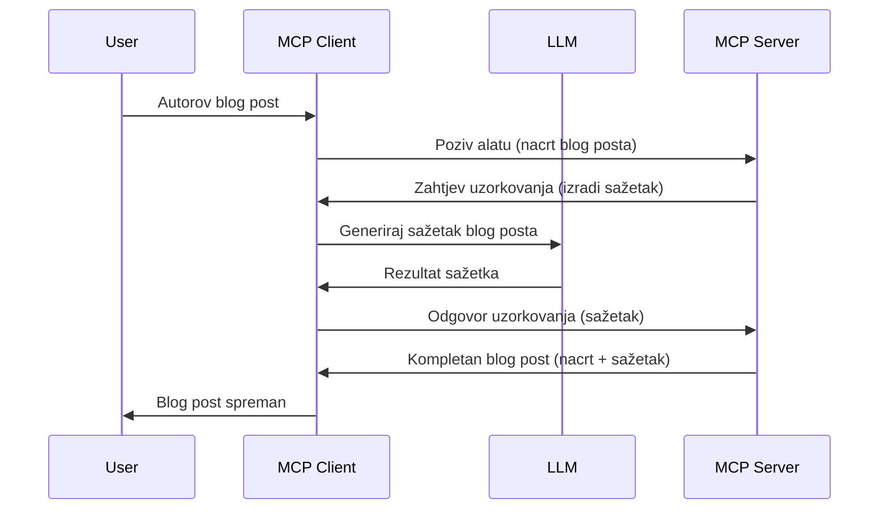

> [!WARNING]
> Uzorkovanje je zastarjelo u MCP `2026-07-28`. Ova lekcija se zadržava zbog
> naslijeđenih implementacija. Novi serveri trebaju se izravno integrirati s API-jem
> pružatelja LLM.

# Uzorkovanje - prepuštanje značajki Klijentu

> Uzorkovanje ostaje u specifikaciji `2026-07-28` radi kompatibilnosti i
> može biti uklonjeno u prvom revidiranom izdanju objavljenom 28. srpnja
> 2027. Primjeri u ovoj lekciji mogu koristiti SDK API-je koji implementiraju `2025-11-25`.
> Pogledajte [Što je promijenjeno u MCP-u: Specifikacija 2026-07-28](../../01-CoreConcepts/mcp-2026-07-28.md).

U naslijeđenim implementacijama, Uzorkovanje omogućuje MCP serveru da zatraži pomoć od LLM-a
kojeg upravlja klijent. Za nove implementacije pozovite odabranog pružatelja LLM-a
izravno.

Pogledajmo neke primjere upotrebe i kako izgraditi rješenje koje uključuje uzorkovanje.

## Pregled

U ovoj lekciji fokusiramo se na objašnjenje kada i gdje koristiti Uzorkovanje i kako ga konfigurirati.

## Ciljevi učenja

U ovom poglavlju ćemo:

- Objasniti što je Uzorkovanje i kada ga koristiti.
- Pokažite kako konfigurirati Uzorkovanje u MCP-u.
- Prikazati primjere Uzorkovanja u praksi.

## Što je Uzorkovanje i zašto ga koristiti?

Uzorkovanje je napredna značajka koja radi na sljedeći način:



### Zahtjev za uzorkovanje

OK, sada kada imamo općeniti pregled vjerodostojnog scenarija, razgovarajmo o zahtjevu za uzorkovanjem koji server šalje natrag klijentu. Evo kako takav zahtjev može izgledati u JSON-RPC formatu:

```json
{
  "jsonrpc": "2.0",
  "id": 1,
  "method": "sampling/createMessage",
  "params": {
    "messages": [
      {
        "role": "user",
        "content": {
          "type": "text",
          "text": "Create a blog post summary of the following blog post: <BLOG POST>"
        }
      }
    ],
    "modelPreferences": {
      "hints": [
        {
          "name": "claude-3-sonnet"
        }
      ],
      "intelligencePriority": 0.8,
      "speedPriority": 0.5
    },
    "systemPrompt": "You are a helpful assistant.",
    "maxTokens": 100
  }
}
```

Vrijedno je istaknuti nekoliko stvari:

- Upit, pod content -> text, je naš upit koji je uputa za LLM da sažme sadržaj blog posta.

- **modelPreferences**. Ovaj odjeljak je upravo to, preferenca, preporuka o kojoj konfiguraciji koristiti s LLM-om. Korisnik može odabrati hoće li prihvatiti ove preporuke ili ih promijeniti. U ovom slučaju postoje preporuke o modelu za korištenje te prioritetu brzine i inteligencije.
- **systemPrompt**, ovo je vaš uobičajeni sistemski upit koji daje vašem LLM-u osobnost i sadrži upute za vođenje.
- **maxTokens**, ovo je još jedno svojstvo koje kaže koliko tokena se preporučuje koristiti za ovaj zadatak.

### Odgovor na uzorkovanje

Ovaj odgovor je ono što MCP Klijent šalje natrag MCP Serveru i rezultat je poziva LLM-a od strane klijenta, čekanja na taj odgovor i zatim oblikovanja ove poruke. Evo kako to može izgledati u JSON-RPC formatu:

```json
{
  "jsonrpc": "2.0",
  "id": 1,
  "result": {
    "role": "assistant",
    "content": {
      "type": "text",
      "text": "Here's your abstract <ABSTRACT>"
    },
    "model": "gpt-5",
    "stopReason": "endTurn"
  }
}
```

Primijetite kako je odgovor sažetak blog posta baš kako smo tražili. Također primijetite kako korišteni `model` nije onaj koji smo tražili, nego "gpt-5" umjesto "claude-3-sonnet". Ovo ilustrira da korisnik može promijeniti mišljenje o tome što koristiti i da je vaš zahtjev za uzorkovanjem samo preporuka.

Dobro, sada kada razumijemo glavni tijek i koristan zadatak za koji ga koristiti "izrada blog posta + sažetak", pogledajmo što trebamo napraviti da bismo ga pokrenuli.

### Vrste poruka

Poruke uzorkovanja nisu ograničene samo na tekst već možete slati i slike i zvuk. Evo kako JSON-RPC izgleda drugačije:

**Tekst**

```json
{
  "type": "text",
  "text": "The message content"
}
```

**Sadržaj slike**

```json
{
  "type": "image",
  "data": "base64-encoded-image-data",
  "mimeType": "image/jpeg"
}
```

**Sadržaj zvuka**

```json
{
  "type": "audio",
  "data": "base64-encoded-audio-data",
  "mimeType": "audio/wav"
}
```

> NAPOMENA: Za trenutni status i smjernice za migraciju pogledajte
> [zastarjelu dokumentaciju o Uzorkovanju](https://modelcontextprotocol.io/specification/2026-07-28/client/sampling).

## Kako konfigurirati Uzorkovanje u Klijentu

> Napomena: ako gradite samo server, ovdje ne trebate puno raditi.

U klijentu trebate specificirati sljedeću značajku na ovaj način:

```json
{
  "capabilities": {
    "sampling": {}
  }
}
```

Ovo će se zatim uzeti u obzir kada se vaš odabrani klijent pokrene s serverom.

## Primjer Uzorkovanja u praksi - Izrada blog posta

Kodirajmo zajedno server za uzorkovanje, morat ćemo napraviti sljedeće:

1. Kreirati alat na Serveru.
1. Taj alat treba kreirati zahtjev za uzorkovanje
1. Alat treba čekati odgovor na zahtjev za uzorkovanje klijenta.
1. Zatim rezultat alata treba biti proizveden.

Pogledajmo kod korak po korak:

### -1- Kreiraj alat

**python**

```python
@mcp.tool()
async def create_blog(title: str, content: str, ctx: Context[ServerSession, None]) -> str:
    """Create a blog post and generate a summary"""

```

### -2- Kreiraj zahtjev za uzorkovanje

Proširite svoj alat sljedećim kodom:

**python**

```python
post = BlogPost(
        id=len(posts) + 1,
        title=title,
        content=content,
        abstract=""
    )

prompt = f"Create an abstract of the following blog post: title: {title} and draft: {content} "

result = await ctx.session.create_message(
        messages=[
            SamplingMessage(
                role="user",
                content=TextContent(type="text", text=prompt),
            )
        ],
        max_tokens=100,
)

```

### -3- Čekaj odgovor i vrati odgovor

**python**

```python
post.abstract = result.content.text

posts.append(post)

# vrati kompletan proizvod
return json.dumps({
    "id": post.title,
    "abstract": post.abstract
})
```

### -4- Cijeli kod

**python**

```python
from starlette.applications import Starlette
from starlette.routing import Mount, Host

from mcp.server.fastmcp import Context, FastMCP

from mcp.server.session import ServerSession
from mcp.types import SamplingMessage, TextContent

import json


from uuid import uuid4
from typing import List
from pydantic import BaseModel


mcp = FastMCP("Blog post generator")

# app = FastAPI()

posts = []

class BlogPost(BaseModel):
    id: int
    title: str
    content: str
    abstract: str

posts: List[BlogPost] = []

@mcp.tool()
async def create_blog(title: str, content: str, ctx: Context[ServerSession, None]) -> str:
    """Create a blog post and generate a summary"""

    post = BlogPost(
        id=len(posts) + 1,
        title=title,
        content=content,
        abstract=""
    )

    prompt = f"Create an abstract of the following blog post: title: {title} and draft: {content} "

    result = await ctx.session.create_message(
        messages=[
            SamplingMessage(
                role="user",
                content=TextContent(type="text", text=prompt),
            )
        ],
        max_tokens=100,
    )

    post.abstract = result.content.text

    posts.append(post)

    # vrati kompletan blog post
    return json.dumps({
        "id": post.title,
        "abstract": post.abstract
    })

if __name__ == "__main__":
    print("Starting server...")
    # mcp.run()
    mcp.run(transport="streamable-http")

# pokreni app s: python server.py
```

### -5- Testiranje u Visual Studio Code

Da biste testirali ovo u Visual Studio Code, napravite sljedeće:

1. Pokrenite server u terminalu
1. Dodajte ga u *mcp.json* (i osigurajte da je pokrenut) npr. ovako:

   ```json
   "servers": {
      "blog-server": {
        "type": "http",
        "url": "http://localhost:8000/mcp"
      }
   }
   ```

1. Upisati upit:

   ```text
   create a blog post named "Where Python comes from", the content is "Python is actually named after Monty Python Flying Circus"
   ```

1. Dopustite da uzorkovanje može započeti. Prvi put kada to testirate, bit će vam prikazan dodatni dijalog koji trebate prihvatiti, zatim ćete vidjeti uobičajeni dijalog za pokretanje alata.

1. Pregledajte rezultate. Vidjet ćete rezultate lijepo prikazane u GitHub Copilot Chat-u, ali možete i pregledati sirovi JSON odgovor.

**Bonus**. Visual Studio Code alati imaju izvrsnu podršku za uzorkovanje. Možete konfigurirati pristup Uzorkovanju na vašem instaliranom serveru tako što ćete otići ovako:

1. Otvorite odjeljak ekstenzija.
1. Odaberite ikonu zupčanika za vaš instalirani server u odjeljku "MCP SERVERS - INSTALLED".
1 Odaberite "Configure Model Access", ovdje možete odabrati koje modele GitHub Copilot smije koristiti prilikom uzorkovanja. Također možete vidjeti sve zahtjeve za uzorkovanje koji su se nedavno dogodili klikom na "Show Sampling requests".

## Zadatak

U ovom zadatku izgradit ćete malo drugačije Uzorkovanje, naime integraciju uzorkovanja koja podržava generiranje opisa proizvoda. Evo vašeg scenarija:

**Scenarij**: Radnik u back officeu e-trgovine treba pomoć jer generiranje opisa proizvoda oduzima previše vremena. Stoga trebate izgraditi rješenje gdje možete pozvati alat "create_product" s argumentima "title" i "keywords", a on bi trebao proizvesti kompletan proizvod uključujući polje "description" koje će popuniti LLM klijenta.

SAVJET: upotrijebite ono što ste ranije naučili za konstrukciju ovog servera i njegovog alata koristeći zahtjev za uzorkovanjem.

## Rješenje

[Rješenje](./solution/README.md)

## Ključni zaključci

Uzorkovanje je moćna značajka koja omogućuje serveru da prenese zadatke klijentu kada mu je potrebna pomoć LLM-a.

## Što dalje

- [Poglavlje 4 - Praktična implementacija](../../04-PracticalImplementation/README.md)

---

<!-- CO-OP TRANSLATOR DISCLAIMER START -->
**Napomena**:
Ovaj dokument je preveden korištenjem AI prevoditeljskog servisa [Co-op Translator](https://github.com/Azure/co-op-translator). Iako težimo točnosti, imajte na umu da automatski prijevodi mogu sadržavati greške ili netočnosti. Izvorni dokument na izvornom jeziku treba smatrati autoritativnim izvorom. Za važne informacije preporuča se profesionalni ljudski prijevod. Nismo odgovorni za bilo kakva nesporazumevanja ili pogrešne interpretacije koje proizlaze iz korištenja ovog prijevoda.
<!-- CO-OP TRANSLATOR DISCLAIMER END -->