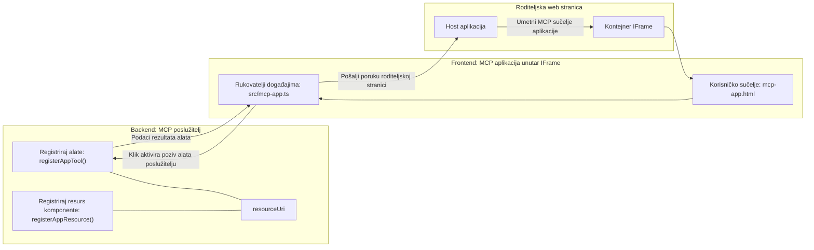
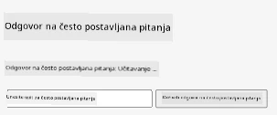
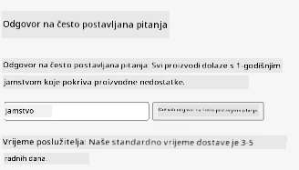
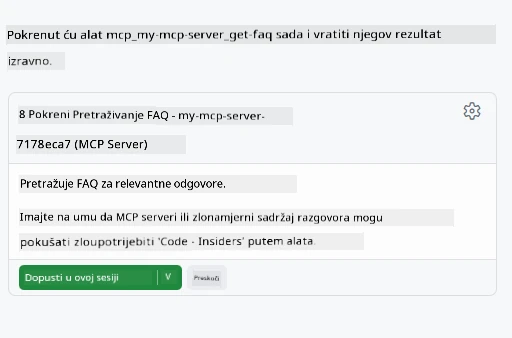

# MCP Aplikacije

MCP Aplikacije predstavljaju novi način rada u MCP-u. Ideja je da ne odgovarate samo s podacima dobivenim iz poziva alata, već također pružite informacije o tome kako se s tim podacima treba komunicirati. To znači da rezultati alata sada mogu sadržavati informacije o korisničkom sučelju. Zašto bismo to željeli? Pa, razmislite kako stvari radite danas. Vjerojatno koristite rezultate MCP Servera tako što ispred njega stavljate neki tip sučelja, taj kod trebate napisati i održavati. Ponekad je to ono što želite, ali ponekad bi bilo odlično samo unijeti isječak informacija koji je samodostatan i koji ima sve, od podataka do korisničkog sučelja.

## Pregled

Ova lekcija pruža praktične upute o MCP Aplikacijama, kako započeti s njima i kako ih integrirati u vaše postojeće Web aplikacije. MCP Aplikacije su vrlo novi dodatak MCP Standardu.

## Ciljevi učenja

Na kraju ove lekcije, moći ćete:

- Objasniti što su MCP Aplikacije.
- Kada koristiti MCP Aplikacije.
- Izgraditi i integrirati vlastite MCP Aplikacije.

## MCP Aplikacije - kako to funkcionira

Ideja MCP Aplikacija je pružiti odgovor koji je zapravo komponenta za prikaz. Takva komponenta može imati i vizualne elemente i interaktivnost, npr. klikove na gumbe, unos korisnika i drugo. Počnimo sa serverskom stranom i našim MCP Serverom. Za kreiranje MCP App komponente trebate napraviti alat, ali i aplikacijski resurs. Te dvije polovice povezane su preko resourceUri.

Evo primjera. Pokušajmo vizualizirati što je uključeno i koja se komponenta čime bavi:

```text
server.ts -- responsible for registering tools and the component as a UI component
src/
  mcp-app.ts -- wiring up event handlers
mcp-app.html -- the user interface
```

Ovaj vizual opisuje arhitekturu za izradu komponente i njezinu logiku.


Pokušajmo opisati odgovornosti za backend odnosno frontend.

### Backend

Treba obaviti dvije stvari:

- Registracija alata s kojima želimo raditi.
- Definiranje komponente.

**Registracija alata**

```typescript
registerAppTool(
    server,
    "get-time",
    {
      title: "Get Time",
      description: "Returns the current server time.",
      inputSchema: {},
      _meta: { ui: { resourceUri } }, // Povezuje ovaj alat s njegovim UI resursom
    },
    async () => {
      const time = new Date().toISOString();
      return { content: [{ type: "text", text: time }] };
    },
  );

```

Gornji kod opisuje ponašanje gdje se izlaže alat pod nazivom `get-time`. Ne prima ulazne podatke, ali na kraju proizvodi trenutno vrijeme. Imamo mogućnost definirati `inputSchema` za alate koji trebaju prihvatiti unos korisnika.

**Registracija komponente**

U istoj datoteci trebamo također registrirati komponentu:

```typescript
const resourceUri = "ui://get-time/mcp-app.html";

// Registrirajte resurs, koji vraća objedinjeni HTML/JavaScript za korisničko sučelje.
registerAppResource(
  server,
  resourceUri,
  resourceUri,
  { mimeType: RESOURCE_MIME_TYPE },
  async () => {
    const html = await fs.readFile(path.join(DIST_DIR, "mcp-app.html"), "utf-8");

    return {
    contents: [
        { uri: resourceUri, mimeType: RESOURCE_MIME_TYPE, text: html },
    ],
    };
  },
);
```

Primijetite kako spominjemo `resourceUri` da povežemo komponentu s njezinim alatima. Zanimljiv je i povratni poziv u kojem učitavamo UI datoteku i vraćamo komponentu.

### Frontend komponente

Kao i backend, postoje dva dijela:

- Frontend napisan čistim HTML-om.
- Kod koji obrađuje događaje i što se s njima radi, npr. pozivanje alata ili slanje poruka roditeljskom prozoru.

**Korisničko sučelje**

Pogledajmo korisničko sučelje.

```html
<!-- mcp-app.html -->
<!DOCTYPE html>
<html lang="en">
  <head>
    <meta charset="UTF-8" />
    <title>Get Time App</title>
  </head>
  <body>
    <p>
      <strong>Server Time:</strong> <code id="server-time">Loading...</code>
    </p>
    <button id="get-time-btn">Get Server Time</button>
    <script type="module" src="/src/mcp-app.ts"></script>
  </body>
</html>
```

**Povezivanje događaja**

Zadnji dio je povezivanje događaja. To znači da identificiramo koji dio našeg UI-ja treba rukovatelje događaja i što činiti kada se događaji dogode:

```typescript
// mcp-app.ts

import { App } from "@modelcontextprotocol/ext-apps";

// Dohvati reference elemenata
const serverTimeEl = document.getElementById("server-time")!;
const getTimeBtn = document.getElementById("get-time-btn")!;

// Kreiraj instancu aplikacije
const app = new App({ name: "Get Time App", version: "1.0.0" });

// Obradi rezultate alata sa servera. Postavi prije `app.connect()` kako bi se izbjeglo
// propuštanje početnog rezultata alata.
app.ontoolresult = (result) => {
  const time = result.content?.find((c) => c.type === "text")?.text;
  serverTimeEl.textContent = time ?? "[ERROR]";
};

// Poveži klik na gumb
getTimeBtn.addEventListener("click", async () => {
  // `app.callServerTool()` omogućava UI-u da zatraži svježe podatke sa servera
  const result = await app.callServerTool({ name: "get-time", arguments: {} });
  const time = result.content?.find((c) => c.type === "text")?.text;
  serverTimeEl.textContent = time ?? "[ERROR]";
});

// Poveži se na host
app.connect();
```

Kao što vidite iz gornjeg, ovo je uobičajeni kod za povezivanje DOM elemenata s događajima. Vrijedi istaknuti poziv `callServerTool` koji poziva alat na backendu.

## Rad s unosom korisnika

Dosad smo vidjeli komponentu koja ima gumb koji pri kliku poziva alat. Pogledajmo možemo li dodati više UI elemenata kao polje za unos i poslati argumente alatu. Implementirajmo FAQ funkcionalnost. Evo kako bi to trebalo raditi:

- Trebao bi postojati gumb i unosni element gdje korisnik upisuje ključnu riječ za pretraživanje, npr. "Shipping". To bi trebalo pozvati alat na backendu koji pretražuje FAQ podatke.
- Alat koji podržava navedenu FAQ pretragu.

Dodajmo prvo potrebnu podršku na backendu:

```typescript
const faq: { [key: string]: string } = {
    "shipping": "Our standard shipping time is 3-5 business days.",
    "return policy": "You can return any item within 30 days of purchase.",
    "warranty": "All products come with a 1-year warranty covering manufacturing defects.",
  }

registerAppTool(
    server,
    "get-faq",
    {
      title: "Search FAQ",
      description: "Searches the FAQ for relevant answers.",
      inputSchema: zod.object({
        query: zod.string().default("shipping"),
      }),
      _meta: { ui: { resourceUri: faqResourceUri } }, // Povezuje ovaj alat s njegovim UI resursom
    },
    async ({ query }) => {
      const answer: string = faq[query.toLowerCase()] || "Sorry, I don't have an answer for that.";
      return { content: [{ type: "text", text: answer }] };
    },
  );
```

Ono što ovdje vidimo je kako popunjavamo `inputSchema` i dajemo mu `zod` shemu ovako:

```typescript
inputSchema: zod.object({
  query: zod.string().default("shipping"),
})
```

U gornjoj shemi deklariramo da imamo ulazni parametar nazvan `query` i da je opcionalan s zadanim vrijednostima "shipping".

Ok, idemo dalje u *mcp-app.html* da vidimo koje UI elemente trebamo napraviti za ovo:

```html
<div class="faq">
    <h1>FAQ response</h1>
    <p>FAQ Response: <code id="faq-response">Loading...</code></p>
    <input type="text" id="faq-query" placeholder="Enter FAQ query" />
    <button id="get-faq-btn">Get FAQ Response</button>
  </div>
```

Super, sada imamo unosni element i gumb. Idemo dalje u *mcp-app.ts* za povezivanje ovih događaja:

```typescript
const getFaqBtn = document.getElementById("get-faq-btn")!;
const faqQueryInput = document.getElementById("faq-query") as HTMLInputElement;

getFaqBtn.addEventListener("click", async () => {
  const query = faqQueryInput.value;
  const result = await app.callServerTool({ name: "get-faq", arguments: { query } });
  const faq = result.content?.find((c) => c.type === "text")?.text;
  faqResponseEl.textContent = faq ?? "[ERROR]";
});
```

U kodu iznad mi:

- Kreiramo reference na zanimljive UI elemente.
- Rješavamo klik gumba, parsiramo vrijednost iz input elementa i pozivamo `app.callServerTool()` s `name` i `arguments` gdje argument prosljeđuje `query` kao vrijednost.

Što se zapravo događa kad pozovete `callServerTool` jest da šalje poruku roditeljskom prozoru, a taj prozor na kraju poziva MCP Server.

### Isprobajte

Kad ovo isprobamo, trebali bismo vidjeti sljedeće:



i evo primjera s unosom poput "warranty"



Da biste pokrenuli ovaj kod, pogledajte [Code section](./code/README.md)

## Testiranje u Visual Studio Codeu

Visual Studio Code ima izvrsnu podršku za MVP Apps i vjerojatno je jedan od najjednostavnijih načina testiranja MCP Aplikacija. Za korištenje Visual Studio Codea, dodajte unos servera u *mcp.json* ovako:

```json
"my-mcp-server-7178eca7": {
    "url": "http://localhost:3001/mcp",
    "type": "http"
  }
```

Zatim pokrenite server, trebali biste moći komunicirati s vašom MVP Aplikacijom kroz Chat prozor pod uvjetom da imate instaliran GitHub Copilot.

pokretanjem preko prompta, npr. "#get-faq":



Baš kao kada ste pokretali u web pregledniku, prikazuje isto sučelje ovako:


## Zadatak

Napravite igru kamen, papir, škare. Trebala bi sadržavati sljedeće:

UI:

- padajući izbornik s opcijama
- gumb za slanje izbora
- oznaku koja pokazuje tko je što odabrao i tko je pobjednik

Server:

- trebao bi imati alat za igru kamen, papir, škare koji prima "choice" kao unos. Također treba generirati izbor računala i odrediti pobjednika

## Rješenje

[Rješenje](./assignment/README.md)

## Sažetak

Naučili smo o novom načinu rada MCP Aplikacija. To je novi pristup koji dopušta MCP Serverima da imaju mišljenje ne samo o podacima već i o načinu na koji se ti podaci trebaju prikazati.

Dodatno, naučili smo da se MCP Aplikacije hostaju u IFrame-u i da za komunikaciju s MCP Serverima trebaju slati poruke roditeljskoj web aplikaciji. Postoji nekoliko biblioteka za čisti JavaScript, React i druge koje olakšavaju ovu komunikaciju.

## Ključne lekcije

Evo što ste naučili:

- MCP Aplikacije su novi standard koji može biti koristan kada želite isporučiti i podatke i UI značajke.
- Ove vrste aplikacija rade u IFrame-u zbog sigurnosnih razloga.

## Što dalje

- [Poglavlje 4](../../04-PracticalImplementation/README.md)

---

<!-- CO-OP TRANSLATOR DISCLAIMER START -->
**Odricanje od odgovornosti**:
Ovaj dokument je preveden pomoću AI usluge prevođenja [Co-op Translator](https://github.com/Azure/co-op-translator). Iako težimo točnosti, imajte na umu da automatizirani prijevodi mogu sadržavati pogreške ili netočnosti. Izvorni dokument na njegovom izvornom jeziku smatra se službenim i autoritativnim izvorom. Za kritične informacije preporučuje se profesionalni ljudski prijevod. Ne snosimo odgovornost za bilo kakva nesporazuma ili pogrešna tumačenja proizašla iz korištenja ovog prijevoda.
<!-- CO-OP TRANSLATOR DISCLAIMER END -->