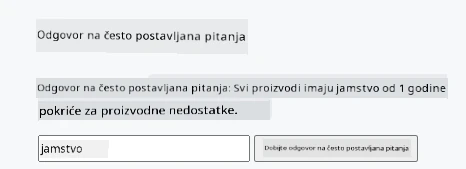
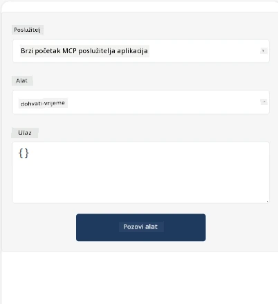
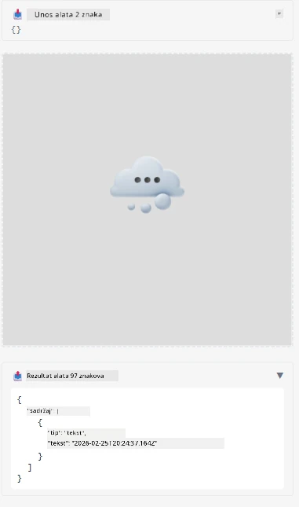

Evo primjera koji prikazuje MCP App

## Instalacija

1. Idite u mapu *mcp-app*
1. Pokrenite `npm install`, to bi trebalo instalirati frontend i backend ovisnosti

Provjerite kompajlira li backend pokretanjem:

```sh
npx tsc --noEmit
```

Ne bi trebalo biti izlaza ako je sve u redu.

## Pokrenite backend

> To zahtijeva malo dodatnog posla ako ste na Windows računalu jer MCP Apps rješenje koristi biblioteku `concurrently` za pokretanje za koju trebate pronaći zamjenu. Evo sporne linije u *package.json* u MCP App:

    ```json
    "start": "concurrently \"cross-env NODE_ENV=development INPUT=mcp-app.html vite build --watch\" \"tsx watch main.ts\""
    ```

Ova aplikacija ima dva dijela, backend dio i host dio.

Pokrenite backend pozivom:

```sh
npm start
```

Ovo bi trebalo pokrenuti backend na `http://localhost:3001/mcp`.

> Napomena, ako ste u Codespace, možda ćete morati postaviti vidljivost porta na javnu. Provjerite možete li pristupiti endpointu u pregledniku preko https://<ime Codespace>.app.github.dev/mcp

## Izbor -1 Testirajte aplikaciju u Visual Studio Codeu

Za testiranje rješenja u Visual Studio Codeu, učinite sljedeće:

- Dodajte unos za server u `mcp.json` ovako:

    ```json
    {
        "servers": {
            "my-mcp-server-7178eca7": {
                "url": "http://localhost:3001/mcp",
                "type": "http"
            }
        },
        "inputs": []
    }
    ```

1. Kliknite na "start" tipku u *mcp.json*
1. Provjerite da je prozor za chat otvoren i upišite `get-faq`, trebali biste vidjeti rezultat ovako:

    

## Izbor -2- Testirajte aplikaciju s hostom

Repozitorij <https://github.com/modelcontextprotocol/ext-apps> sadrži nekoliko različitih hostova koje možete koristiti za testiranje vaših MVP aplikacija.

Ovdje ćemo vam predstaviti dvije različite opcije:

### Lokalno računalo

- Idite u *ext-apps* nakon što ste klonirali repozitorij.

- Instalirajte ovisnosti

   ```sh
   npm install
   ```

- U drugom terminal prozoru idite u *ext-apps/examples/basic-host*

    > ako ste u Codespace, morate otići do serve.ts i na liniji 27 zamijeniti http://localhost:3001/mcp sa URL-om vašeg Codespace-a za backend, na primjer https://psychic-xylophone-657rpjgvxpc5g64-3001.app.github.dev/mcp

- Pokrenite host:

    ```sh
    npm start
    ```

    Ovo bi trebalo povezati host s backendom i trebali biste vidjeti aplikaciju u radu ovako:

    

### Codespace

Potrebno je malo dodatnog posla da bi Codespace okruženje radilo. Za korištenje hosta kroz Codespace:

- Pogledajte direktorij *ext-apps* i idite u *examples/basic-host*.
- Pokrenite `npm install` za instalaciju ovisnosti
- Pokrenite `npm start` za pokretanje hosta.

## Isprobajte aplikaciju

Isprobajte aplikaciju na sljedeći način:

- Odaberite gumb "Call Tool" i trebali biste vidjeti rezultate ovako:

    

Super, sve radi.

---

<!-- CO-OP TRANSLATOR DISCLAIMER START -->
**Odricanje od odgovornosti**:  
Ovaj dokument je preveden pomoću AI usluge prevođenja [Co-op Translator](https://github.com/Azure/co-op-translator). Iako nastojimo osigurati točnost, molimo imajte na umu da automatski prijevodi mogu sadržavati pogreške ili netočnosti. Izvorni dokument na izvornom jeziku treba smatrati autoritativnim izvorom. Za važne informacije preporučuje se profesionalni ljudski prijevod. Nismo odgovorni za bilo kakve nesporazume ili pogrešna tumačenja nastala korištenjem ovog prijevoda.
<!-- CO-OP TRANSLATOR DISCLAIMER END -->