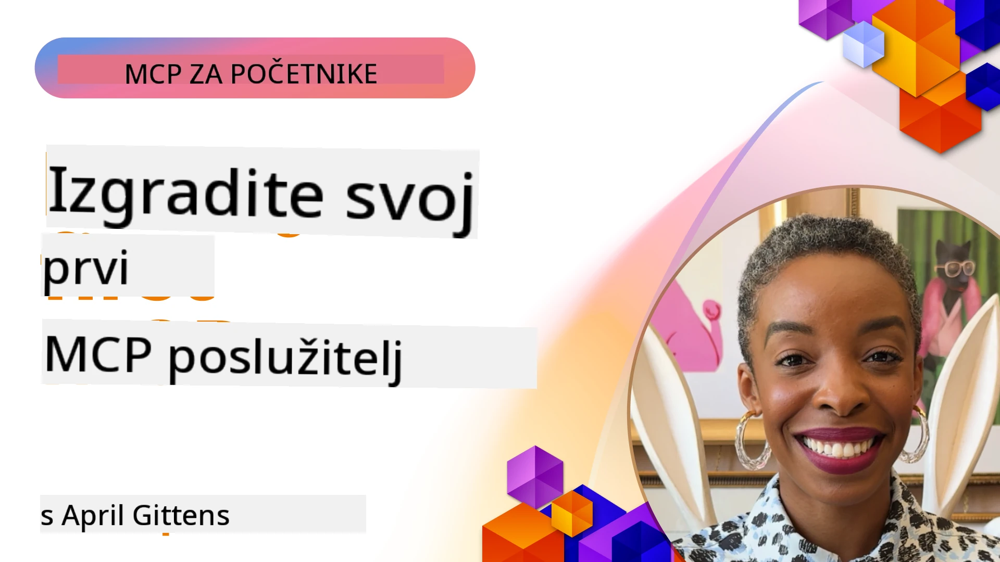

## Početak  

_(Kliknite na sliku iznad za pregled videozapisa ove lekcije)_

Ovaj odjeljak sastoji se od nekoliko lekcija:

- **1 Vaš prvi server**, u ovoj prvoj lekciji naučit ćete kako stvoriti svoj prvi server i pregledati ga pomoću inspektorskog alata, vrijednog za testiranje i otklanjanje pogrešaka vašeg servera, [do lekcije](01-first-server/README.md)

- **2 Klijent**, u ovoj lekciji naučit ćete kako napisati klijenta koji se može povezati s vašim serverom, [do lekcije](02-client/README.md)

- **3 Klijent s LLM-om**, još bolji način pisanja klijenta je dodavanjem LLM-a tako da može "pregovarati" s vašim serverom o tome što treba učiniti, [do lekcije](03-llm-client/README.md)

- **4 Korištenje servera GitHub Copilot Agent načina rada u Visual Studio Code**. Ovdje ćemo pogledati izvođenje našeg MCP servera unutar Visual Studio Code, [do lekcije](04-vscode/README.md)

- **5 stdio Transport Server** stdio transport je preporučeni standard za lokalnu komunikaciju MCP server-klijent, osiguravajući sigurnu komunikaciju temeljenu na podprocesima s ugrađenom izolacijom procesa [do lekcije](05-stdio-server/README.md)

- **6 HTTP Streaming s MCP (Streamable HTTP)**. Saznajte o modernom HTTP streaming transportu (preporučeni pristup za udaljene MCP servere prema [MCP specifikaciji 2025-11-25](https://spec.modelcontextprotocol.io/specification/2025-11-25/basic/transports/#streamable-http)), obavijestima o napretku i kako implementirati skalabilne, real-time MCP servere i klijente koristeći Streamable HTTP. [do lekcije](06-http-streaming/README.md)

- **7 Korištenje AI Toolkit za VSCode** za korištenje i testiranje vaših MCP klijenata i servera [do lekcije](07-aitk/README.md)

- **8 Testiranje**. Ovdje ćemo se posebno usredotočiti na različite načine testiranja našeg servera i klijenta, [do lekcije](08-testing/README.md)

- **9 Implementacija**. Ovo poglavlje će razmotriti različite načine implementacije vaših MCP rješenja, [do lekcije](09-deployment/README.md)

- **10 Napredna upotreba servera**. Ovo poglavlje pokriva naprednu upotrebu servera, [do lekcije](./10-advanced/README.md)

- **11 Autentifikacija**. Ovo poglavlje pokriva kako dodati jednostavnu autentifikaciju, od Basic Auth do korištenja JWT i RBAC. Preporučuje se da započnete ovdje pa zatim pogledate Napredne teme u Poglavlju 5 i provedete dodatno jačanje sigurnosti prema preporukama u Poglavlju 2, [do lekcije](./11-simple-auth/README.md)

- **12 MCP domaćini**. Konfigurirajte i koristite popularne MCP klijente domaćine uključujući Claude Desktop, Cursor, Cline i Windsurf. Naučite vrste transporta i rješavanje problema, [do lekcije](./12-mcp-hosts/README.md)

- **13 MCP Inspektor**. Otklanjajte pogreške i testirajte svoje MCP servere interaktivno koristeći MCP Inspector alat. Naučite alate za rješavanje problema, resurse i protokolske poruke, [do lekcije](./13-mcp-inspector/README.md)

- **14 Uzorkovanje**. Izradite MCP servere koji surađuju s MCP klijentima na zadacima vezanim uz LLM. [do lekcije](./14-sampling/README.md)

- **15 MCP aplikacije**. Izgradite MCP servere koji također odgovaraju s uputama za korisničko sučelje, [do lekcije](./15-mcp-apps/README.md)

Model Context Protocol (MCP) je otvoreni protokol koji standardizira način na koji aplikacije pružaju kontekst LLM-ovima. Zamislite MCP kao USB-C priključak za AI aplikacije - pruža standardizirani način povezivanja AI modela s različitim izvorima podataka i alatima.

## Ciljevi učenja

Na kraju ove lekcije moći ćete:

- Postaviti razvojna okruženja za MCP u C#, Java, Python, TypeScript i JavaScript
- Izraditi i implementirati osnovne MCP servere s prilagođenim značajkama (resursi, upiti i alati)
- Kreirati aplikacije domaćine koje se povezuju s MCP serverima
- Testirati i otklanjati pogreške u MCP implementacijama
- Razumjeti uobičajene izazove postavljanja i njihova rješenja
- Povezati svoje MCP implementacije s popularnim LLM uslugama

## Postavljanje vašeg MCP okruženja

Prije nego što počnete raditi s MCP, važno je pripremiti razvojno okruženje i razumjeti osnovni tijek rada. Ovaj odjeljak će vas voditi kroz početne korake postavljanja za glatki početak s MCP.

### Preduvjeti

Prije nego što započnete razvoj s MCP, osigurajte da imate:

- **Razvojno okruženje** za vaš odabrani jezik (C#, Java, Python, TypeScript ili JavaScript)
- **IDE/Uređivač**: Visual Studio, Visual Studio Code, IntelliJ, Eclipse, PyCharm ili bilo koji moderni uređivač koda
- **Upravitelji paketa**: NuGet, Maven/Gradle, pip ili npm/yarn
- **API ključeve** za bilo koje AI usluge koje planirate koristiti u svojim aplikacijama domaćinima

### Službeni SDK-ovi

U nadolazećim poglavljima vidjet ćete rješenja izrađena pomoću Pythona, TypeScripta, Jave i .NET-a. Ovdje su svi službeno podržani SDK-ovi.

MCP pruža službene SDK-ove za više jezika (usklađene s [MCP specifikacijom 2025-11-25](https://spec.modelcontextprotocol.io/specification/2025-11-25/)):
- [C# SDK](https://github.com/modelcontextprotocol/csharp-sdk) - Održava se u suradnji s Microsoftom
- [Java SDK](https://github.com/modelcontextprotocol/java-sdk) - Održava se u suradnji sa Spring AI
- [TypeScript SDK](https://github.com/modelcontextprotocol/typescript-sdk) - Službena TypeScript implementacija
- [Python SDK](https://github.com/modelcontextprotocol/python-sdk) - Službena Python implementacija (FastMCP)
- [Kotlin SDK](https://github.com/modelcontextprotocol/kotlin-sdk) - Službena Kotlin implementacija
- [Swift SDK](https://github.com/modelcontextprotocol/swift-sdk) - Održava se u suradnji s Loopwork AI
- [Rust SDK](https://github.com/modelcontextprotocol/rust-sdk) - Službena Rust implementacija
- [Go SDK](https://github.com/modelcontextprotocol/go-sdk) - Službena Go implementacija

## Ključni zaključci

- Postavljanje MCP razvojnog okruženja jednostavno je uz SDK-ove specifične za jezik
- Izrada MCP servera uključuje kreiranje i registriranje alata s jasnim shemama
- MCP klijenti se povezuju sa serverima i modelima da bi iskoristili proširene mogućnosti
- Testiranje i otklanjanje pogrešaka su ključni za pouzdane MCP implementacije
- Opcije implementacije kreću se od lokalnog razvoja do rješenja u oblaku

## Vježbanje

Imamo skup primjera koji nadopunjuju vježbe koje ćete vidjeti u svim poglavljima ovog odjeljka. Osim toga, svako poglavlje ima svoje vlastite vježbe i zadatke.

- [Java kalkulator](./samples/java/calculator/README.md)
- [.Net kalkulator](../../../03-GettingStarted/samples/csharp)
- [JavaScript kalkulator](./samples/javascript/README.md)
- [TypeScript kalkulator](./samples/typescript/README.md)
- [Python kalkulator](../../../03-GettingStarted/samples/python)

## Dodatni resursi

- [Izrada agenata koristeći Model Context Protocol na Azureu](https://learn.microsoft.com/azure/developer/ai/intro-agents-mcp)
- [Udaljeni MCP s Azure Container Apps (Node.js/TypeScript/JavaScript)](https://learn.microsoft.com/samples/azure-samples/mcp-container-ts/mcp-container-ts/)
- [.NET OpenAI MCP Agent](https://learn.microsoft.com/samples/azure-samples/openai-mcp-agent-dotnet/openai-mcp-agent-dotnet/)

## Što slijedi

Započnite s prvom lekcijom: [Kreiranje vašeg prvog MCP servera](01-first-server/README.md)

Nakon što završite ovaj modul, nastavite na: [Modul 4: Praktična implementacija](../04-PracticalImplementation/README.md)

---

<!-- CO-OP TRANSLATOR DISCLAIMER START -->
**Napomena**:  
Ovaj dokument je preveden korištenjem AI prevoditeljskog servisa [Co-op Translator](https://github.com/Azure/co-op-translator). Iako težimo točnosti, imajte na umu da automatski prijevodi mogu sadržavati pogreške ili netočnosti. Izvorni dokument na izvornom jeziku treba smatrati autoritativnim izvorom. Za važne informacije preporučuje se profesionalni ljudski prijevod. Ne snosimo odgovornost za bilo kakva nesporazumevanja ili pogrešna tumačenja koja proizlaze iz korištenja ovog prijevoda.
<!-- CO-OP TRANSLATOR DISCLAIMER END -->