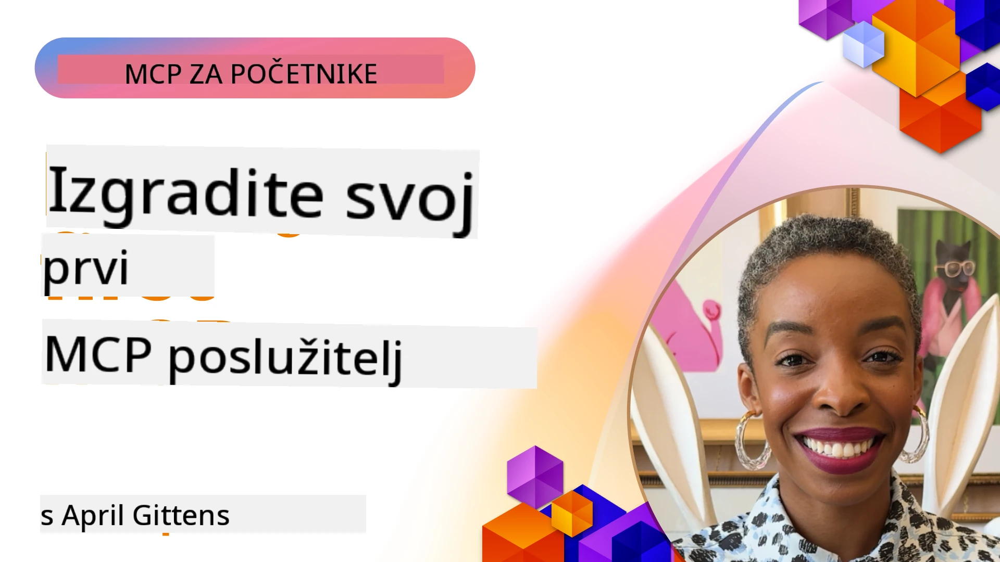

## Početak  

_(Kliknite na sliku iznad za prikaz videa ovog lekcija)_

Ovaj odjeljak se sastoji od nekoliko lekcija:

- **1 Vaš prvi poslužitelj**, u ovoj prvoj lekciji, naučit ćete kako stvoriti svoj prvi poslužitelj i pregledati ga s alatom za inspekciju, korisnim načinom testiranja i ispravljanja vašeg poslužitelja, [do lekcije](01-first-server/README.md)

- **2 Klijent**, u ovoj lekciji naučit ćete kako napisati klijenta koji se može povezati s vašim poslužiteljem, [do lekcije](02-client/README.md)

- **3 Klijent s LLM-om**, još bolji način pisanja klijenta je dodavanjem LLM-a kako bi mogao "pregovarati" sa vašim poslužiteljem o tome što treba raditi, [do lekcije](03-llm-client/README.md)

- **4 Korištenje GitHub Copilot načina rada MCP poslužitelja u Visual Studio Code-u**. Ovdje pogledamo kako pokrenuti naš MCP poslužitelj unutar Visual Studio Code-a, [do lekcije](04-vscode/README.md)

- **5 stdio transport poslužitelj** stdio transport je preporučeni standard za lokalnu komunikaciju između MCP poslužitelja i klijenata, pružajući sigurnu komunikaciju temeljenu na podprocesima s ugrađenom izolacijom procesa [do lekcije](05-stdio-server/README.md)

- **6 HTTP Streaming s MCP (Streamable HTTP)**. Naučite o standardnom
	udaljenom transportu u [MCP specifikaciji 2026-07-28](https://modelcontextprotocol.io/specification/2026-07-28/basic/transports/streamable-http),
	plus naslijeđenoj implementaciji temeljnoj na sesijama zadržanoj u lekciji.
	[do lekcije](06-http-streaming/README.md)

- **7 Korištenje AI alata za VSCode** za korištenje i testiranje vaših MCP klijenata i poslužitelja [do lekcije](07-aitk/README.md)

- **8 Testiranje**. Ovdje ćemo se posebno usredotočiti na različite načine testiranja našeg poslužitelja i klijenta, [do lekcije](08-testing/README.md)

- **9 Implementacija**. Ovaj će odjeljak razmotriti različite načine implementacije vaših MCP rješenja, [do lekcije](09-deployment/README.md)

- **10 Napredna uporaba poslužitelja**. Ovaj odjeljak pokriva naprednu uporabu poslužitelja, [do lekcije](./10-advanced/README.md)

- **11 Autentifikacija**. Ovaj odjeljak pokriva kako dodati jednostavnu autentifikaciju, od osnovne autentifikacije do korištenja JWT i RBAC. Preporučujemo da počnete ovdje, a zatim pogledate Napredne teme u poglavlju 5 te dodatno osigurate sigurnost prema preporukama u poglavlju 2, [do lekcije](./11-simple-auth/README.md)

- **12 MCP domaćini**. Konfigurirajte i koristite popularne MCP klijente poput Claude Desktop, Cursor, Cline i Windsurf. Naučite o vrstama transporta i rješavanju problema, [do lekcije](./12-mcp-hosts/README.md)

- **13 MCP Inspektor**. Interaktivno ispravljajte i testirajte svoje MCP poslužitelje koristeći alat MCP Inspektor. Naučite kako rješavati probleme s alatima, resursima i protokolskim porukama, [do lekcije](./13-mcp-inspector/README.md)

- **14 Vrijednosno uzorkovanje**. Naučite o naslijeđenom uzorku za `2025-11-25` i
	kako migrirati nove dizajne na izravnu integraciju LLM pružatelja. Uzorkovanje je
	odbačeno u MCP `2026-07-28`. [do lekcije](./14-sampling/README.md)

- **15 MCP aplikacije**. Izgradite MCP poslužitelje koji također odgovaraju uputama za korisničko sučelje, [do lekcije](./15-mcp-apps/README.md)

Model Context Protocol (MCP) je otvoreni protokol koji standardizira kako aplikacije pružaju kontekst LLM-ovima. Zamislite MCP kao USB-C priključak za AI aplikacije - pruža standardizirani način povezivanja AI modela s različitim izvorima podataka i alatima.

## Ciljevi učenja

Do kraja ove lekcije moći ćete:

- Postaviti razvojna okruženja za MCP u C#, Javi, Pythonu, TypeScriptu i JavaScriptu
- Izgraditi i implementirati osnovne MCP poslužitelje s prilagođenim značajkama (resursi, upiti i alati)
- Kreirati domaćinske aplikacije koje se povezuju s MCP poslužiteljima
- Testirati i ispravljati MCP implementacije
- Razumjeti uobičajene izazove postavljanja i njihova rješenja
- Povezati vaše MCP implementacije s popularnim LLM servisima

## Postavljanje vašeg MCP okruženja

Prije nego što počnete raditi s MCP-om, važno je pripremiti razvojno okruženje i razumjeti osnovni tijek rada. Ovaj odjeljak će vas voditi kroz početne korake postavljanja kako biste osigurali glatki početak s MCP-om.

### Preduvjeti

Prije nego što se upustite u razvoj MCP-a, provjerite imate li:

- **Razvojno okruženje**: Za odabrani jezik (C#, Java, Python, TypeScript ili JavaScript)
- **IDE/Uređivač**: Visual Studio, Visual Studio Code, IntelliJ, Eclipse, PyCharm ili bilo koji moderni uređivač koda
- **Upravitelji paketa**: NuGet, Maven/Gradle, pip ili npm/yarn
- **API ključeve**: Za bilo koje AI usluge koje planirate koristiti u svojim domaćinskim aplikacijama

### Službeni SDK-ovi

U nadolazećim poglavljima vidjet ćete rješenja izrađena korištenjem Pythona, TypeScripta,
Jave i .NET-a. Evo službenih SDK-ova.

Podrška SDK-a za MCP `2026-07-28` postupno je dostupna po jezicima.
Prije pokretanja primjera, provjerite verziju paketa i bilješke o izdanju SDK-a
za podržane revizije protokola. Pogledajte
[službeni popis SDK-ova](https://modelcontextprotocol.io/docs/sdk):
- [C# SDK](https://github.com/modelcontextprotocol/csharp-sdk) - Održava se u suradnji s Microsoftom
- [Java SDK](https://github.com/modelcontextprotocol/java-sdk) - Održava se u suradnji sa Spring AI
- [TypeScript SDK](https://github.com/modelcontextprotocol/typescript-sdk) - Službena TypeScript implementacija
- [Python SDK](https://github.com/modelcontextprotocol/python-sdk) - Službena Python implementacija (FastMCP)
- [Kotlin SDK](https://github.com/modelcontextprotocol/kotlin-sdk) - Službena Kotlin implementacija
- [Swift SDK](https://github.com/modelcontextprotocol/swift-sdk) - Održava se u suradnji s Loopwork AI
- [Rust SDK](https://github.com/modelcontextprotocol/rust-sdk) - Službena Rust implementacija
- [Go SDK](https://github.com/modelcontextprotocol/go-sdk) - Službena Go implementacija

## Ključne spoznaje

- Postavljanje MCP razvojnog okruženja je jednostavno uz SDK-ove specifične za jezik
- Izgradnja MCP poslužitelja uključuje kreiranje i registraciju alata s jasnim shemama
- MCP klijenti se povezuju s poslužiteljima i modelima kako bi iskoristili proširene mogućnosti
- Testiranje i ispravljanje su ključni za pouzdane MCP implementacije
- Opcije implementacije kreću se od lokalnog razvoja do rješenja baziranih na oblaku

## Vježbanje

Imamo skup uzoraka koji nadopunjuju zadatke koje ćete vidjeti u svim poglavljima ovog odjeljka. Osim toga, svako poglavlje ima svoje vježbe i zadatke

- [Java kalkulator](./samples/java/calculator/README.md)
- [.NET kalkulator](../../../03-GettingStarted/samples/csharp)
- [JavaScript kalkulator](./samples/javascript/README.md)
- [TypeScript kalkulator](./samples/typescript/README.md)
- [Python kalkulator](../../../03-GettingStarted/samples/python)

## Dodatni resursi

- [Izgradite agente koristeći Model Context Protocol na Azure-u](https://learn.microsoft.com/azure/developer/ai/intro-agents-mcp)
- [Remote MCP s Azure Container Apps (Node.js/TypeScript/JavaScript)](https://learn.microsoft.com/samples/azure-samples/mcp-container-ts/mcp-container-ts/)
- [.NET OpenAI MCP agent](https://learn.microsoft.com/samples/azure-samples/openai-mcp-agent-dotnet/openai-mcp-agent-dotnet/)

## Što slijedi

Počnite s prvom lekcijom: [Izrada vašeg prvog MCP poslužitelja](01-first-server/README.md)

Kad završite ovaj modul, nastavite s: [Modul 4: Praktična implementacija](../04-PracticalImplementation/README.md)

---

<!-- CO-OP TRANSLATOR DISCLAIMER START -->
**Napomena**:
Ovaj dokument je preveden korištenjem AI prevoditeljskog servisa [Co-op Translator](https://github.com/Azure/co-op-translator). Iako težimo točnosti, imajte na umu da automatski prijevodi mogu sadržavati greške ili netočnosti. Izvorni dokument na izvornom jeziku treba smatrati autoritativnim izvorom. Za važne informacije preporuča se profesionalni ljudski prijevod. Nismo odgovorni za bilo kakva nesporazumevanja ili pogrešne interpretacije koje proizlaze iz korištenja ovog prijevoda.
<!-- CO-OP TRANSLATOR DISCLAIMER END -->