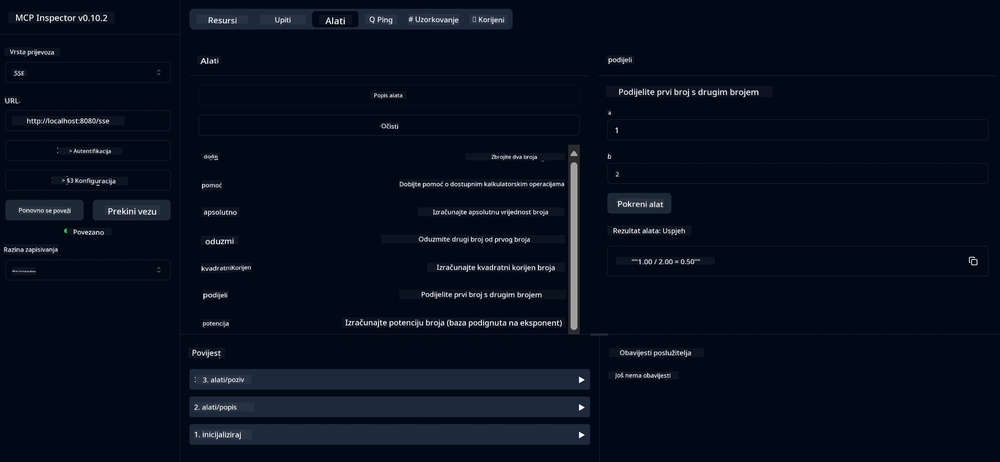

# Osnovna usluga kalkulatora MCP

> [!NOTE]
> Ovaj primjer koristi naslijeđeni HTTP+SSE prijenos i cilja SDK kompatibilan
> s MCP `2025-11-25`. Novi udaljeni poslužitelji trebaju koristiti `2026-07-28` Streamable
> HTTP podršku.

Ova usluga pruža osnovne kalkulatorske operacije putem Model Context Protocol (MCP) koristeći Spring Boot s WebFlux transportom. Dizajnirana je kao jednostavan primjer za početnike koji uče o MCP implementacijama.

Za više informacija, pogledajte referentnu dokumentaciju [MCP Server Boot Starter](https://docs.spring.io/spring-ai/reference/api/mcp/mcp-server-boot-starter-docs.html).

## Pregled

Usluga prikazuje:
- Podršku za SSE (Server-Sent Events)
- Automatsku registraciju alata pomoću Spring AI `@Tool` anotacije
- Osnovne kalkulatorske funkcije:
  - Zbrajanje, oduzimanje, množenje, dijeljenje
  - Izračun potencije i kvadratnog korijena
  - Modulo (ostatak) i apsolutna vrijednost
  - Funkcija pomoći za opis operacija

## Značajke

Ova usluga kalkulatora nudi sljedeće mogućnosti:

1. **Osnovne aritmetičke operacije**:
   - Zbrajanje dva broja
   - Oduzimanje jednog broja od drugog
   - Množenje dva broja
   - Dijeljenje jednog broja drugim (s provjerom dijeljenja s nulom)

2. **Napredne operacije**:
   - Izračun potencije (potenciranje baze na eksponent)
   - Izračun kvadratnog korijena (s provjerom negativnog broja)
   - Izračun modulusa (ostatka)
   - Izračun apsolutne vrijednosti

3. **Sustav pomoći**:
   - Ugrađena funkcija pomoći koja objašnjava sve dostupne operacije

## Korištenje usluge

Usluga izlaže sljedeće API krajnje točke putem MCP protokola:

- `add(a, b)`: Zbroji dva broja
- `subtract(a, b)`: Oduzmi drugi broj od prvog
- `multiply(a, b)`: Pomnoži dva broja
- `divide(a, b)`: Podijeli prvi broj s drugim (s provjerom na nulu)
- `power(base, exponent)`: Izračunaj potenciju broja
- `squareRoot(number)`: Izračunaj kvadratni korijen (s provjerom na negativan broj)
- `modulus(a, b)`: Izračunaj ostatak pri dijeljenju
- `absolute(number)`: Izračunaj apsolutnu vrijednost
- `help()`: Dobij informacije o dostupnim operacijama

## Testni klijent

Jednostavan testni klijent uključen je u paket `com.microsoft.mcp.sample.client`. Klasa `SampleCalculatorClient` demonstrira dostupne operacije kalkulatora.

## Korištenje LangChain4j klijenta

Projekt uključuje LangChain4j primjer klijenta u `com.microsoft.mcp.sample.client.LangChain4jClient` koji pokazuje kako integrirati uslugu kalkulatora s LangChain4j i GitHub modelima:

### Preduvjeti

1. **Postavljanje GitHub tokena**:
   
   Za korištenje GitHub AI modela (poput phi-4) potrebno je imati osobni pristupni token:

   a. Idite na postavke svog GitHub računa: https://github.com/settings/tokens
   
   b. Kliknite "Generate new token" → "Generate new token (classic)"
   
   c. Dajte tokenu opisno ime
   
   d. Odaberite sljedeće opsege ovlasti:
      - `repo` (Potpuna kontrola privatnih repozitorija)
      - `read:org` (Čitanje članstva organizacije i timova, čitanje organizacijskih projekata)
      - `gist` (Kreiranje gistova)
      - `user:email` (Pristup adresama e-pošte korisnika (samo za čitanje))
   
   e. Kliknite "Generate token" i kopirajte novi token
   
   f. Postavite ga kao varijablu okruženja:
      
      Na Windowsu:
      ```
      set GITHUB_TOKEN=your-github-token
      ```
      
      Na macOS/Linuxu:
      ```bash
      export GITHUB_TOKEN=your-github-token
      ```

   g. Za trajno postavljanje, dodajte ga u varijable okruženja kroz postavke sustava

2. Dodajte LangChain4j GitHub ovisnost u svoj projekt (već uključena u pom.xml):
   ```xml
   <dependency>
       <groupId>dev.langchain4j</groupId>
       <artifactId>langchain4j-github</artifactId>
       <version>${langchain4j.version}</version>
   </dependency>
   ```

3. Provjerite je li kalkulator poslužitelj pokrenut na `localhost:8080`

### Pokretanje LangChain4j klijenta

Ovaj primjer demonstrira:
- Povezivanje na kalkulator MCP poslužitelj putem SSE transporta
- Korištenje LangChain4j za stvaranje chat bota koji koristi kalkulatorske operacije
- Integraciju s GitHub AI modelima (sada koristeći phi-4 model)

Klijent šalje sljedeće primjere upita za demonstraciju funkcionalnosti:
1. Izračun zbroja dva broja
2. Pronalaženje kvadratnog korijena broja
3. Dobivanje pomoći o dostupnim kalkulatorskim operacijama

Pokrenite primjer i provjerite izlaz na konzoli da vidite kako AI model koristi kalkulatorske alate za odgovore na upite.

### Konfiguracija GitHub modela

LangChain4j klijent je konfiguriran za korištenje GitHub phi-4 modela sa sljedećim postavkama:

```java
ChatLanguageModel model = GitHubChatModel.builder()
    .apiKey(System.getenv("GITHUB_TOKEN"))
    .timeout(Duration.ofSeconds(60))
    .modelName("phi-4")
    .logRequests(true)
    .logResponses(true)
    .build();
```

Da biste koristili različite GitHub modele, jednostavno promijenite parametar `modelName` u neki drugi podržani model (npr. "claude-3-haiku-20240307", "llama-3-70b-8192" itd.).

## Ovisnosti

Projekt zahtijeva sljedeće ključne ovisnosti:

```xml
<!-- For MCP Server -->
<dependency>
    <groupId>org.springframework.ai</groupId>
    <artifactId>spring-ai-starter-mcp-server-webflux</artifactId>
</dependency>

<!-- For LangChain4j integration -->
<dependency>
    <groupId>dev.langchain4j</groupId>
    <artifactId>langchain4j-mcp</artifactId>
    <version>${langchain4j.version}</version>
</dependency>

<!-- For GitHub models support -->
<dependency>
    <groupId>dev.langchain4j</groupId>
    <artifactId>langchain4j-github</artifactId>
    <version>${langchain4j.version}</version>
</dependency>
```

## Izgradnja projekta

Izgradite projekt koristeći Maven:
```bash
./mvnw clean install -DskipTests
```

## Pokretanje poslužitelja

### Korištenje Jave

```bash
java -jar target/calculator-server-0.0.1-SNAPSHOT.jar
```

### Korištenje MCP Inspectora

MCP Inspector je koristan alat za interakciju s MCP uslugama. Za korištenje s ovom kalkulatorskom uslugom:

1. **Instalirajte i pokrenite MCP Inspector** u novom terminal prozoru:
   ```bash
   npx @modelcontextprotocol/inspector
   ```

2. **Pristupite web sučelju** klikom na URL prikazan u aplikaciji (obično http://localhost:6274)

3. **Konfigurirajte vezu**:
   - Postavite tip transporta na "SSE"
   - Postavite URL na SSE krajnju točku vašeg pokrenutog poslužitelja: `http://localhost:8080/sse`
   - Kliknite "Connect"

4. **Koristite alate**:
   - Kliknite "List Tools" da vidite dostupne kalkulatorske operacije
   - Odaberite alat i kliknite "Run Tool" da izvršite operaciju



### Korištenje Dockera

Projekt uključuje Dockerfile za kontejnersku distribuciju:

1. **Izgradite Docker sliku**:
   ```bash
   docker build -t calculator-mcp-service .
   ```

2. **Pokrenite Docker kontejner**:
   ```bash
   docker run -p 8080:8080 calculator-mcp-service
   ```

Ovo će:
- Izgraditi višestepenu Docker sliku s Mavendom 3.9.9 i Eclipse Temurin 24 JDK
- Stvoriti optimiziranu kontejnersku sliku
- Izložiti uslugu na portu 8080
- Pokrenuti MCP kalkulatorsku uslugu unutar kontejnera

Usluga će biti dostupna na `http://localhost:8080` nakon što kontejner pokrene.

## Rješavanje problema

### Uobičajeni problemi s GitHub tokenom

1. **Problemi s dozvolama tokena**: Ako dobijete 403 Forbidden grešku, provjerite da token ima potrebne dozvole definirane u preduvjetima.

2. **Token nije pronađen**: Ako dobijete grešku "No API key found", osigurajte da je varijabla okruženja GITHUB_TOKEN ispravno postavljena.

3. **Ograničenja brzine**: GitHub API ima ograničenja zahtjeva. Ako dobijete grešku ograničenja brzine (statusni kod 429), pričekajte nekoliko minuta prije ponovnog pokušaja.

4. **Istek tokena**: GitHub tokeni mogu isteći. Ako dobijete greške pri autentikaciji nakon nekog vremena, generirajte novi token i ažurirajte varijablu okruženja.

Ako trebate dodatnu pomoć, pogledajte [LangChain4j dokumentaciju](https://github.com/langchain4j/langchain4j) ili [GitHub API dokumentaciju](https://docs.github.com/en/rest).

---

<!-- CO-OP TRANSLATOR DISCLAIMER START -->
**Napomena**:
Ovaj dokument je preveden korištenjem AI prevoditeljskog servisa [Co-op Translator](https://github.com/Azure/co-op-translator). Iako težimo točnosti, imajte na umu da automatski prijevodi mogu sadržavati greške ili netočnosti. Izvorni dokument na izvornom jeziku treba smatrati autoritativnim izvorom. Za važne informacije preporuča se profesionalni ljudski prijevod. Nismo odgovorni za bilo kakva nesporazumevanja ili pogrešne interpretacije koje proizlaze iz korištenja ovog prijevoda.
<!-- CO-OP TRANSLATOR DISCLAIMER END -->