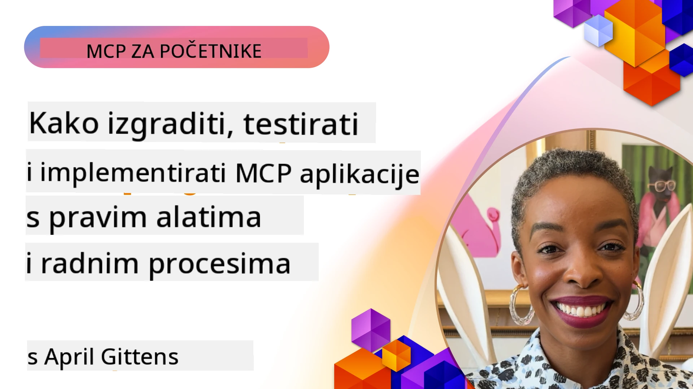
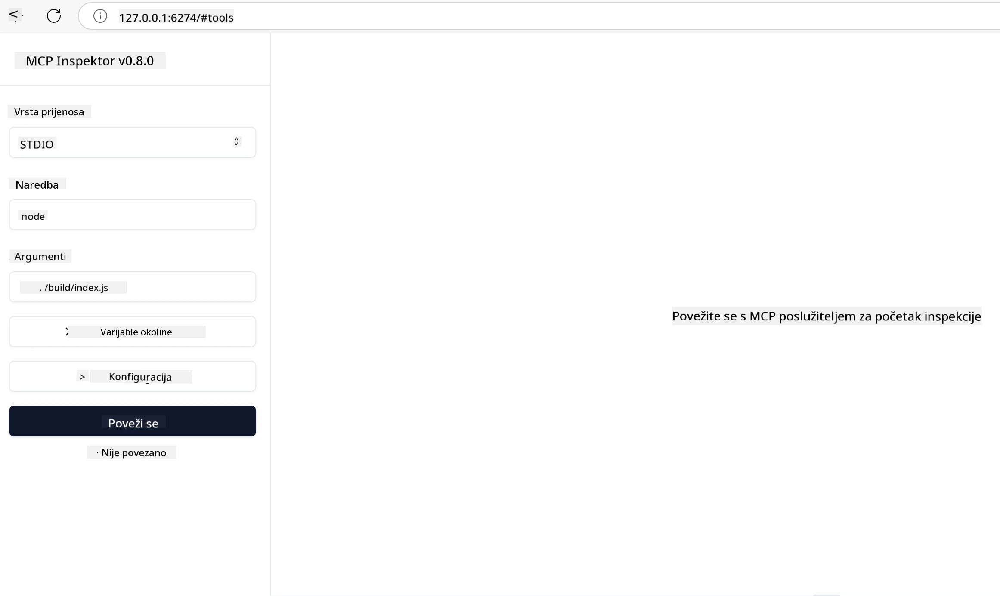

# Praktična implementacija

[](https://youtu.be/vCN9-mKBDfQ)

_(Kliknite na sliku iznad za pregled videozapisa ovog poglavlja)_

Praktična implementacija je mjesto gdje moć Model Context Protocola (MCP) postaje opipljiva. Iako je važno razumjeti teoriju i arhitekturu iza MCP-a, stvarna vrijednost se pojavljuje kada ove koncepte primijenite za izgradnju, testiranje i implementaciju rješenja koja rješavaju stvarne probleme. Ovo poglavlje premošćuje jaz između konceptualnog znanja i praktičnog razvoja, vodeći vas kroz proces oživljavanja aplikacija temeljenih na MCP-u.

Bilo da razvijate inteligentne asistente, integrirate umjetnu inteligenciju u poslovne radne tokove ili gradite prilagođene alate za obradu podataka, MCP pruža fleksibilnu osnovu. Njegov jezikovski neovisan dizajn i službeni SDK-ovi za popularne programske jezike čine ga pristupačnim širokom spektru programera. Korištenjem ovih SDK-ova možete brzo napraviti prototip, iterirati i skalirati svoja rješenja na različitim platformama i okruženjima.

U sljedećim odjeljcima pronaći ćete praktične primjere, uzorke koda i strategije implementacije koje pokazuju kako primijeniti MCP u C#, Javi sa Springom, TypeScriptu, JavaScriptu i Pythonu. Također ćete naučiti kako otklanjati pogreške i testirati MCP servere, upravljati API-jima i implementirati rješenja u oblak koristeći Azure. Ovi praktični resursi su osmišljeni da ubrzaju vaše učenje i pomognu vam samouvjereno graditi robusne, proizvodne MCP aplikacije.

## Pregled

Ovo poglavlje se fokusira na praktične aspekte implementacije MCP-a na više programskih jezika. Istražit ćemo kako koristiti MCP SDK-ove u C#, Javi sa Springom, TypeScriptu, JavaScriptu i Pythonu za izgradnju robusnih aplikacija, otklanjanje pogrešaka i testiranje MCP servera te stvaranje ponovno upotrebljivih resursa, upita i alata.

## Ciljevi učenja

Na kraju ovog poglavlja, moći ćete:

- Implementirati MCP rješenja koristeći službene SDK-ove u različitim programskim jezicima
- Sistematski otklanjati pogreške i testirati MCP servere
- Kreirati i koristiti značajke servera (Resurse, Upite i Alate)
- Dizajnirati učinkovite MCP radne tokove za složene zadatke
- Optimizirati MCP implementacije za performanse i pouzdanost

## Službeni SDK resursi

Model Context Protocol nudi službene SDK-ove za više jezika (usklađene s [MCP specifikacijom 2025-11-25](https://spec.modelcontextprotocol.io/specification/2025-11-25/)):

- [C# SDK](https://github.com/modelcontextprotocol/csharp-sdk)
- [Java sa Spring SDK](https://github.com/modelcontextprotocol/java-sdk) **Napomena:** zahtijeva ovisnost o [Project Reactor](https://projectreactor.io). (Pogledajte [raspravu broj 246](https://github.com/orgs/modelcontextprotocol/discussions/246).)
- [TypeScript SDK](https://github.com/modelcontextprotocol/typescript-sdk)
- [Python SDK](https://github.com/modelcontextprotocol/python-sdk)
- [Kotlin SDK](https://github.com/modelcontextprotocol/kotlin-sdk)
- [Go SDK](https://github.com/modelcontextprotocol/go-sdk)

## Rad s MCP SDK-ovima

Ovaj odjeljak pruža praktične primjere implementacije MCP-a na više programskih jezika. Uzorke koda možete pronaći u direktoriju `samples` organiziranim po jezicima.

### Dostupni primjeri

Repozitorij uključuje [primjere implementacije](../../../04-PracticalImplementation/samples) na sljedećim jezicima:

- [C#](./samples/csharp/README.md)
- [Java sa Spring](./samples/java/containerapp/README.md)
- [TypeScript](./samples/typescript/README.md)
- [JavaScript](./samples/javascript/README.md)
- [Python](./samples/python/README.md)

Svaki primjer demonstrira ključne MCP koncepte i obrasce implementacije za određeni jezik i ekosustav.

### Praktični vodiči

Dodatni vodiči za praktičnu implementaciju MCP-a:

- [Pagiranje i veliki skupovi rezultata](./pagination/README.md) – Obrada paginacije temeljem pokazivača za alate, resurse i velike skupove podataka

## Osnovne značajke servera

MCP serveri mogu implementirati bilo koju kombinaciju ovih značajki:

### Resursi

Resursi pružaju kontekst i podatke za korisnika ili AI model:

- Spremišta dokumenata
- Baze znanja
- Strukturirani izvori podataka
- Datotečni sustavi

### Upiti

Upiti su predlošci poruka i radnih tokova za korisnike:

- Preddefinirani šabloni razgovora
- Vođeni obrasci interakcije
- Specijalizirane dijaloške strukture

### Alati

Alati su funkcije koje AI model može izvršavati:

- Pomoćni programi za obradu podataka
- Integracije s vanjskim API-jima
- Izračunske mogućnosti
- Funkcionalnost pretraživanja

## Primjeri implementacija: C# implementacija

Službeni C# SDK repozitorij sadrži nekoliko primjera implementacije koji demonstriraju različite aspekte MCP-a:

- **Osnovni MCP klijent:** Jednostavan primjer kako stvoriti MCP klijenta i pozvati alate
- **Osnovni MCP server:** Minimalna implementacija servera s osnovnom registracijom alata
- **Napredni MCP server:** Server s punim značajkama s registracijom alata, autentikacijom i rukovanjem pogreškama
- **ASP.NET integracija:** Primjeri integracije s ASP.NET Core
- **Obrasci implementacije alata:** Različiti obrasci za implementaciju alata s različitim razinama složenosti

MCP C# SDK je u pregledu i API-ji se mogu mijenjati. Stalno ćemo ažurirati ovaj blog kako SDK bude napredovao.

### Ključne značajke

- [C# MCP Nuget ModelContextProtocol](https://www.nuget.org/packages/ModelContextProtocol)
- Izgradnja vašeg [prvog MCP servera](https://devblogs.microsoft.com/dotnet/build-a-model-context-protocol-mcp-server-in-csharp/).

Za potpune primjere implementacije u C#, posjetite [službeni C# SDK repozitorij uzoraka](https://github.com/modelcontextprotocol/csharp-sdk)

## Primjer implementacije: Java sa Springom

Java sa Spring SDK nudi robusne opcije implementacije MCP-a s enterprise značajkama.

### Ključne značajke

- Integracija sa Spring Frameworkom
- Snažna tipna sigurnost
- Podrška za reaktivno programiranje
- Sveobuhvatno rukovanje pogreškama

Za potpuni primjer implementacije Java sa Spring, pogledajte [Java sa Spring primjer](samples/java/containerapp/README.md) u direktoriju primjera.

## Primjer implementacije: JavaScript implementacija

JavaScript SDK pruža lagan i fleksibilan pristup implementaciji MCP-a.

### Ključne značajke

- Podrška za Node.js i preglednik
- API baziran na obećanjima (Promise)
- Jednostavna integracija s Express i drugim okvirima
- Podrška za WebSocket za streaming

Za potpuni JavaScript primjer implementacije, pogledajte [JavaScript primjer](samples/javascript/README.md) u direktoriju primjera.

## Primjer implementacije: Python implementacija

Python SDK nudi pitonski pristup implementaciji MCP-a s izvrsnim integracijama ML okvira.

### Ključne značajke

- Podrška za async/await s asyncio
- Integracija s FastAPI-jem
- Jednostavna registracija alata
- Izvorna integracija s popularnim ML bibliotekama

Za potpuni Python primjer implementacije, pogledajte [Python primjer](samples/python/README.md) u direktoriju primjera.

## Upravljanje API-jem

Azure API Management je izvrsno rješenje za osiguravanje MCP servera. Ideja je postaviti Azure API Management instancu ispred vašeg MCP servera i dopustiti mu da upravlja značajkama koje ćete vjerojatno htjeti kao što su:

- ograničenje brzine (rate limiting)
- upravljanje tokenima
- nadzor
- balansiranje opterećenja
- sigurnost

### Azure primjer

Evo Azure primjera koji radi upravo to, tj. [kreiranje MCP servera i njegovo osiguravanje s Azure API Managementom](https://github.com/Azure-Samples/remote-mcp-apim-functions-python).

Pogledajte kako se odvija autorizacijski tok na slici ispod:


Na prethodnoj slici događa se sljedeće:

- Autentifikacija/autorizacija se odvija korištenjem Microsoft Entra.
- Azure API Management djeluje kao prolaz (gateway) i koristi politike za usmjeravanje i upravljanje prometom.
- Azure Monitor bilježi sve zahtjeve za daljnju analizu.

#### Autorizacijski tok

Pogledajmo autorizacijski tok malo detaljnije:


#### MCP specifikacija autorizacije

Saznajte više o [MCP autorizacijskoj specifikaciji](https://spec.modelcontextprotocol.io/specification/2025-11-25/basic/authorization/)

## Implementacija udaljenog MCP servera na Azure

Pogledajmo možemo li implementirati ranije spomenuti primjer:

1. Klonirajte repozitorij

    ```bash
    git clone https://github.com/Azure-Samples/remote-mcp-apim-functions-python.git
    cd remote-mcp-apim-functions-python
    ```

1. Registrirajte `Microsoft.App` pružatelja resursa.

   - Ako koristite Azure CLI, pokrenite `az provider register --namespace Microsoft.App --wait`.
   - Ako koristite Azure PowerShell, pokrenite `Register-AzResourceProvider -ProviderNamespace Microsoft.App`. Nakon nekog vremena pokrenite `(Get-AzResourceProvider -ProviderNamespace Microsoft.App).RegistrationState` da provjerite je li registracija dovršena.

1. Pokrenite ovu [azd](https://aka.ms/azd) naredbu za provisioniranje servisa za upravljanje API-jem, funkcijske aplikacije (s kodom) i svih drugih potrebnih Azure resursa

    ```shell
    azd up
    ```

    Ova naredba bi trebala implementirati sve resurse u oblaku na Azuru.

### Testiranje vašeg servera s MCP Inspectorom

1. U **novom terminal prozoru**, instalirajte i pokrenite MCP Inspector

    ```shell
    npx @modelcontextprotocol/inspector
    ```

    Trebali biste vidjeti sučelje slično:

    

1. Ctrl klikom otvorite MCP Inspector web aplikaciju s URL-a koji aplikacija prikazuje (npr. [http://127.0.0.1:6274/#resources](http://127.0.0.1:6274/#resources))
1. Postavite tip prijenosa (transport) na `SSE`
1. Postavite URL na vašu aktivnu API Management SSE krajnju točku prikazanu nakon `azd up` i **Povežite se**:

    ```shell
    https://<apim-servicename-from-azd-output>.azure-api.net/mcp/sse
    ```

1. **Popis alata**. Kliknite na alat i izaberite **Pokreni alat**.

Ako su svi koraci uspjeli, sada ste povezani s MCP serverom i uspjeli ste pozvati alat.

## MCP serveri za Azure

[Remote-mcp-functions](https://github.com/Azure-Samples/remote-mcp-functions-dotnet): Ovaj set repozitorija je predložak brzog početka za izgradnju i implementaciju prilagođenih udaljenih MCP (Model Context Protocol) servera koristeći Azure Functions s Python, C# .NET ili Node/TypeScript.

Primjeri pružaju kompletno rješenje koje omogućuje programerima:

- Izgradnju i lokalno pokretanje: Razvoj i otklanjanje pogrešaka MCP servera na lokalnom računalu
- Implementaciju na Azure: Jednostavnu implementaciju u oblak s jednom naredbom azd up
- Povezivanje s klijentima: Povezivanje s MCP serverom s raznih klijenata uključujući VS Code Copilot agent način i MCP Inspector alat

### Ključne značajke

- Sigurnost dizajnirana: MCP server je zaštićen ključevima i HTTPS-om
- Opcije autentikacije: Podržava OAuth koristeći ugrađenu autentikaciju i/ili API Management
- Izolacija mreže: Omogućuje izolaciju mreže koristeći Azure Virtual Networks (VNET)
- Arhitektura bez servera: Korištenje Azure Functions za skalabilno, događajima vođeno izvršavanje
- Lokalni razvoj: Sveobuhvatna podrška za razvoj i otklanjanje pogrešaka lokalno
- Jednostavna implementacija: Pojednostavljen proces implementacije na Azure

Repozitorij uključuje sve potrebne konfiguracijske datoteke, izvorni kod i definicije infrastrukture za brzo započinjanje s proizvodnom MCP server implementacijom.

- [Azure Remote MCP Functions Python](https://github.com/Azure-Samples/remote-mcp-functions-python) - Primjer implementacije MCP koristeći Azure Functions s Python-om

- [Azure Remote MCP Functions .NET](https://github.com/Azure-Samples/remote-mcp-functions-dotnet) - Primjer implementacije MCP koristeći Azure Functions s C# .NET-om

- [Azure Remote MCP Functions Node/Typescript](https://github.com/Azure-Samples/remote-mcp-functions-typescript) - Primjer implementacije MCP koristeći Azure Functions s Node/TypeScript-om.

## Ključne točke

- MCP SDK-ovi pružaju jezično specifične alate za implementaciju robusnih MCP rješenja
- Proces otklanjanja pogrešaka i testiranja je ključan za pouzdane MCP aplikacije
- Ponovno upotrebljivi šabloni upita omogućuju konzistentne AI interakcije
- Dobro dizajnirani radni tokovi mogu orkestrirati složene zadatke koristeći više alata
- Implementacija MCP rješenja zahtijeva razmatranje sigurnosti, performansi i rukovanja pogreškama

## Vježba

Dizajnirajte praktični MCP radni tok koji rješava stvarni problem u vašem području:

1. Identificirajte 3-4 alata koji bi bili korisni za rješenje ovog problema
2. Izradite dijagram radnog toka koji prikazuje kako ti alati međusobno djeluju
3. Implementirajte osnovnu verziju jednog od alata koristeći željeni jezik
4. Kreirajte šablon upita koji će pomoći modelu da učinkovito koristi vaš alat

## Dodatni resursi

---

## Što slijedi

Sljedeće: [Napredne teme](../05-AdvancedTopics/README.md)

---

<!-- CO-OP TRANSLATOR DISCLAIMER START -->
**Odricanje od odgovornosti**:  
Ovaj dokument preveden je korištenjem AI usluge za prevođenje [Co-op Translator](https://github.com/Azure/co-op-translator). Iako težimo točnosti, imajte na umu da automatizirani prijevodi mogu sadržavati pogreške ili netočnosti. Izvorni dokument na izvornom jeziku treba smatrati službenim izvorom. Za važne informacije preporučuje se profesionalni ljudski prijevod. Nismo odgovorni za bilo kakve nesporazume ili pogrešna tumačenja koja proizlaze iz uporabe ovog prijevoda.
<!-- CO-OP TRANSLATOR DISCLAIMER END -->