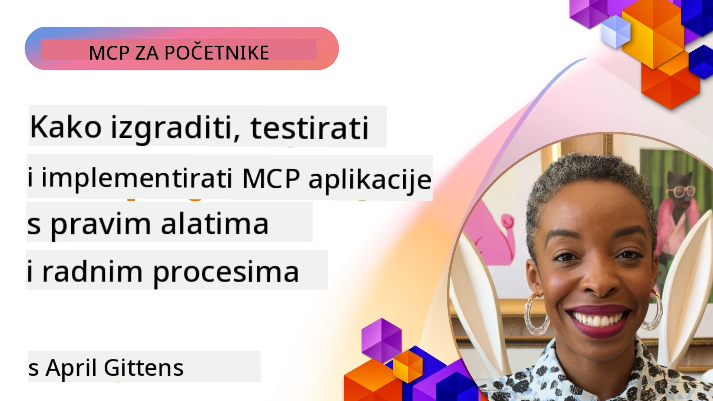

# Praktična Implementacija

[](https://youtu.be/vCN9-mKBDfQ)

_(Kliknite na gornju sliku za pregled videa ovog poglavlja)_

Praktična implementacija je mjesto gdje snaga Model Context Protocola (MCP) postaje opipljiva. Dok je razumijevanje teorije i arhitekture iza MCP-a važno, stvarna vrijednost se pojavljuje kada primijenite ove koncepte za izgradnju, testiranje i implementaciju rješenja koja rješavaju stvarne probleme. Ovo poglavlje premošćuje jaz između konceptualnog znanja i praktičnog razvoja, vodeći vas kroz proces oživljavanja aplikacija baziranih na MCP-u.

Bilo da razvijate inteligentne asistente, integrirate AI u poslovne radne tokove ili izrađujete prilagođene alate za obradu podataka, MCP pruža fleksibilnu osnovu. Njegov dizajn neovisnog jezika i službeni SDK-ovi za popularne programske jezike čine ga dostupnim širokom krugu programera. Korištenjem ovih SDK-ova možete brzo napraviti prototip, iterirati i skalirati svoja rješenja na različitim platformama i okruženjima.

U sljedećim odjeljcima pronaći ćete praktične primjere, uzorke koda i strategije implementacije koje pokazuju kako implementirati MCP u C#, Javi sa Springom, TypeScriptu, JavaScriptu i Pythonu. Također ćete naučiti kako otkloniti pogreške i testirati svoje MCP servere, upravljati API-jima i implementirati rješenja u oblaku koristeći Azure. Ovi praktični resursi dizajnirani su da ubrzaju vaše učenje i pomognu vam samouvjereno izgraditi robusne MCP aplikacije spremne za produkciju.

## Pregled

Ovo poglavlje se fokusira na praktične aspekte implementacije MCP-a u više programskih jezika. Istražit ćemo kako koristiti MCP SDK-ove u C#, Javi sa Springom, TypeScriptu, JavaScriptu i Pythonu za izgradnju robusnih aplikacija, otklanjanje pogrešaka i testiranje MCP servera te stvaranje ponovljivih resursa, promptova i alata.

## Ciljevi Učenja

Do kraja ovog poglavlja, moći ćete:

- Implementirati MCP rješenja koristeći službene SDK-ove u različitim programskim jezicima
- Sustavno otklanjati pogreške i testirati MCP servere
- Kreirati i koristiti značajke servera (Resurse, Prompte i Alate)
- Dizajnirati učinkovite MCP radne tokove za složene zadatke
- Optimizirati MCP implementacije za performanse i pouzdanost

## Službeni SDK Resursi

Model Context Protocol nudi službene SDK-ove za više jezika. SDK
podrška za MCP `2026-07-28` se uvodi neovisno, stoga provjerite svaki SDK u
bilješkama o izdanju i verziji paketa primjera prije nego što pretpostavite kompatibilnost protokola.
Pogledajte [službeni popis SDK-ova](https://modelcontextprotocol.io/docs/sdk):

- [C# SDK](https://github.com/modelcontextprotocol/csharp-sdk)
- [Java sa Spring SDK](https://github.com/modelcontextprotocol/java-sdk) **Napomena:** zahtijeva ovisnost o [Project Reactor](https://projectreactor.io). (Pogledajte [raspravu issue 246](https://github.com/orgs/modelcontextprotocol/discussions/246).)
- [TypeScript SDK](https://github.com/modelcontextprotocol/typescript-sdk)
- [Python SDK](https://github.com/modelcontextprotocol/python-sdk)
- [Kotlin SDK](https://github.com/modelcontextprotocol/kotlin-sdk)
- [Go SDK](https://github.com/modelcontextprotocol/go-sdk)

## Rad s MCP SDK-ovima

Ovaj odjeljak pruža praktične primjere implementacije MCP-a u više programskih jezika. Možete pronaći uzorke koda u direktoriju `samples` organizirane po jeziku.

### Dostupni primjeri

Repozitorij uključuje [primjere implementacije](../../../04-PracticalImplementation/samples) na sljedećim jezicima:

- [C#](./samples/csharp/README.md)
- [Java sa Spring](./samples/java/containerapp/README.md)
- [TypeScript](./samples/typescript/README.md)
- [JavaScript](./samples/javascript/README.md)
- [Python](./samples/python/README.md)

Svaki primjer demonstrira ključne MCP koncepte i obrasce implementacije za taj specifični jezik i ekosustav.

### Praktični vodiči

Dodatni vodiči za praktičnu MCP implementaciju:

- [Paginacija i Veliki Skupovi Rezultata](./pagination/README.md) - Rukovanje stranjenjem na temelju kursora za alate, resurse i velike skupove podataka

## Osnovne Značajke Servera

MCP serveri mogu implementirati bilo koju kombinaciju ovih značajki:

### Resursi

Resursi pružaju kontekst i podatke za korisnika ili AI model za korištenje:

- Spremišta dokumenata
- Baze znanja
- Strukturirani izvori podataka
- Datotečni sustavi

### Prompti

Prompti su predlošci poruka i radnih tokova za korisnike:

- Unaprijed definirani obrasci razgovora
- Vođeni obrasci interakcije
- Specijalizirane strukture dijaloga

### Alati

Alati su funkcije koje AI model može izvršavati:

- Alati za obradu podataka
- Integracije vanjskih API-ja
- Računalne mogućnosti
- Funkcionalnost pretraživanja

## Primjeri Implementacije: C# Implementacija

Službeni C# SDK repozitorij sadrži nekoliko primjera implementacije koji demonstriraju različite aspekte MCP:

- **Osnovni MCP Klijent**: Jednostavan primjer koji pokazuje kako kreirati MCP klijenta i pozivati alate
- **Osnovni MCP Server**: Minimalna implementacija servera s osnovnom registracijom alata
- **Napredni MCP Server**: Puni server s registracijom alata, autentikacijom i upravljanjem pogreškama
- **ASP.NET Integracija**: Primjeri koji prikazuju integraciju s ASP.NET Core
- **Obrasci Implementacije Alata**: Razni obrasci za implementaciju alata s različitim razinama složenosti

MCP C# SDK je u pretpregledu i API-jevi se mogu mijenjati. Kontinuirano ćemo ažurirati ovaj blog kako se SDK razvija.

### Ključne Značajke

- [C# MCP Nuget ModelContextProtocol](https://www.nuget.org/packages/ModelContextProtocol)
- Izgradnja vašeg [prvog MCP Servera](https://devblogs.microsoft.com/dotnet/build-a-model-context-protocol-mcp-server-in-csharp/).

Za potpune C# primjere implementacije, posjetite [službeni repozitorij C# SDK uzoraka](https://github.com/modelcontextprotocol/csharp-sdk)

## Primjer implementacije: Java sa Spring Implementacija

Java sa Spring SDK nudi robusne mogućnosti MCP implementacije sa značajkama razine poduzeća.

### Ključne Značajke

- Integracija Spring Frameworka
- Čvrsta tipna sigurnost
- Podrška za reaktivno programiranje
- Sveobuhvatno upravljanje pogreškama

Za potpuni primjer implementacije Java sa Spring, pogledajte [Java sa Spring primjer](samples/java/containerapp/README.md) u direktoriju uzoraka.

## Primjer implementacije: JavaScript Implementacija

JavaScript SDK pruža lagan i fleksibilan pristup implementaciji MCP-a.

### Ključne Značajke

- Podrška za Node.js i preglednike
- API zasnovan na Promise-ima
- Jednostavna integracija s Expressom i drugim okvirima
- Podrška za WebSocket za streaming

Za potpuni primjer implementacije JavaScript-a, pogledajte [JavaScript primjer](samples/javascript/README.md) u direktoriju uzoraka.

## Primjer implementacije: Python Implementacija

Python SDK nudi Python-pristup implementaciji MCP-a s izvrsnim integracijama ML okvira.

### Ključne Značajke

- Podrška za async/await s asyncio
- Integracija FastAPI-ja
- Jednostavna registracija alata
- Izvorna integracija s popularnim ML bibliotekama

Za potpuni primjer Python implementacije, pogledajte [Python primjer](samples/python/README.md) u direktoriju uzoraka.

## Upravljanje API-jem


Azure API upravljanje izvrstan je odgovor na to kako možemo osigurati MCP poslužitelje. Ideja je staviti instancu Azure API upravljanja ispred vašeg MCP poslužitelja i dopustiti mu da upravlja značajkama koje ćete vjerojatno željeti kao što su:

- ograničenje stope zahtjeva
- upravljanje tokenima
- nadzor
- ravnoteža opterećenja
- sigurnost

### Azure primjer

Evo Azure primjera koji radi upravo to, tj. [kreiranje MCP poslužitelja i njegovo osiguranje pomoću Azure API upravljanja](https://github.com/Azure-Samples/remote-mcp-apim-functions-python).

Pogledajte kako protok autorizacije funkcionira na slici ispod:


Na prethodnoj slici događa se sljedeće:

- Autentikacija/Autorizacija se događa pomoću Microsoft Entra.
- Azure API upravljanje djeluje kao ulazna točka i koristi politike za usmjeravanje i upravljanje prometom.
- Azure Monitor bilježi sve zahtjeve za daljnju analizu.

#### Tok autorizacije

Pogledajmo detaljnije tok autorizacije:


#### Specifikacija MCP autorizacije

Saznajte više o
[MCP specifikaciji autorizacije](https://modelcontextprotocol.io/specification/2026-07-28/basic/authorization/).

## Postavljanje udaljenog MCP poslužitelja na Azure

Pogledajmo možemo li postaviti spomenuti primjer:

1. Klonirajte repozitorij

    ```bash
    git clone https://github.com/Azure-Samples/remote-mcp-apim-functions-python.git
    cd remote-mcp-apim-functions-python
    ```

1. Registrirajte `Microsoft.App` pružatelja resursa.

   - Ako koristite Azure CLI, pokrenite `az provider register --namespace Microsoft.App --wait`.
   - Ako koristite Azure PowerShell, pokrenite `Register-AzResourceProvider -ProviderNamespace Microsoft.App`. Zatim pokrenite `(Get-AzResourceProvider -ProviderNamespace Microsoft.App).RegistrationState` nakon nekog vremena da provjerite je li registracija završena.

1. Pokrenite ovaj [azd](https://aka.ms/azd) naredbu za postavljanje api upravljanja, funkcijske aplikacije (s kodom) i svih ostalih potrebnih Azure resursa

    ```shell
    azd up
    ```

    Ova naredba bi trebala postaviti sve resurse u oblaku na Azureu

### Testiranje vašeg poslužitelja s MCP inspektorom

1. U **novom terminal prozoru**, instalirajte i pokrenite MCP Inspector

    ```shell
    npx @modelcontextprotocol/inspector
    ```

    Trebali biste vidjeti sučelje slično ovom:

    

1. Pritisnite CTRL i kliknite za učitavanje MCP Inspector web aplikacije s URL-a prikazanog u aplikaciji (npr. [http://127.0.0.1:6274/#resources](http://127.0.0.1:6274/#resources))
1. Postavite tip prijenosa na `SSE`
1. Postavite URL na vaš aktivni API upravljanje SSE krajnju točku prikazanu nakon `azd up` i **povežite se**:

    ```shell
    https://<apim-servicename-from-azd-output>.azure-api.net/mcp/sse
    ```

1. **Popis alata**. Kliknite na alat i **pokrenite alat**.  

Ako su svi koraci uspješno prošli, sada biste trebali biti povezani s MCP poslužiteljem i moći ste pozvati neki alat.

## MCP poslužitelji za Azure

[Remote-mcp-functions](https://github.com/Azure-Samples/remote-mcp-functions-dotnet): Ovaj skup repozitorija su predlošci za brzi početak za izgradnju i postavljanje prilagođenih udaljenih MCP (Model Context Protocol) poslužitelja koristeći Azure Functions s Pythonom, C# .NET ili Node/TypeScript.

Primjeri pružaju sveobuhvatno rješenje koje omogućuje programerima da:

- Izgrade i pokreću lokalno: Razvijaju i debuggaju MCP poslužitelj na lokalnom računalu
- Postave na Azure: Lako postavljanje u oblak jednostavnom azd up naredbom
- Povežu se s klijentima: Spoje se na MCP poslužitelj s različitih klijenata uključujući VS Code-ov Copilot agent način rada i MCP Inspector alat

### Ključne značajke

- Sigurnost ugrađena u dizajn: MCP poslužitelj je osiguran pomoću ključeva i HTTPS-a
- Opcije autentikacije: Podržava OAuth koristeći ugrađenu autentikaciju i/ili API upravljanje
- Izolacija mreže: Omogućava mrežnu izolaciju koristeći Azure Virtualne mreže (VNET)
- Bezposlužiteljska arhitektura: Koristi Azure Functions za skalabilno, na događajima bazirano izvršavanje
- Lokalni razvoj: Sveobuhvatna podrška za lokalni razvoj i otklanjanje pogrešaka
- Jednostavno postavljanje: Pojednostavljen proces postavljanja na Azure

Repozitorij uključuje sve potrebne konfiguracijske datoteke, izvornu šifru i infrastrukturalne definicije za brz početak s produkcijski spremnim MCP poslužiteljem.

- [Azure Remote MCP Functions Python](https://github.com/Azure-Samples/remote-mcp-functions-python) - Primjer implementacije MCP koristeći Azure Functions s Pythonom

- [Azure Remote MCP Functions .NET](https://github.com/Azure-Samples/remote-mcp-functions-dotnet) - Primjer implementacije MCP koristeći Azure Functions s C# .NET

- [Azure Remote MCP Functions Node/Typescript](https://github.com/Azure-Samples/remote-mcp-functions-typescript) - Primjer implementacije MCP koristeći Azure Functions s Node/TypeScript.

## Ključne spoznaje

- MCP SDK-ovi pružaju izvorno prilagođene alate za implementaciju robusnih MCP rješenja
- Proces otklanjanja pogrešaka i testiranja ključan je za pouzdane MCP aplikacije
- Ponovno upotrebljivi predlošci prompta omogućuju konzistentne AI interakcije
- Dobro dizajnirani tijekovi rada mogu orkestrirati složene zadatke koristeći više alata
- Implementacija MCP rješenja zahtijeva razmatranje sigurnosti, performansi i upravljanja pogreškama

## Vježba

Dizajnirajte praktičan MCP tijek rada koji rješava stvarni problem u vašem području:

1. Identificirajte 3-4 alata koji bi bili korisni za rješavanje ovog problema
2. Izradite dijagram tijeka rada koji prikazuje kako ti alati međusobno djeluju
3. Implementirajte osnovnu verziju jednog od alata koristeći jezik koji preferirate
4. Napravite predložak prompta koji bi modelu pomogao da učinkovito koristi vaš alat

## Dodatni resursi

---

## Što slijedi

Sljedeće: [Napredne teme](../05-AdvancedTopics/README.md)

---

<!-- CO-OP TRANSLATOR DISCLAIMER START -->
**Napomena**:
Ovaj dokument je preveden korištenjem AI prevoditeljskog servisa [Co-op Translator](https://github.com/Azure/co-op-translator). Iako težimo točnosti, imajte na umu da automatski prijevodi mogu sadržavati greške ili netočnosti. Izvorni dokument na izvornom jeziku treba smatrati autoritativnim izvorom. Za važne informacije preporuča se profesionalni ljudski prijevod. Nismo odgovorni za bilo kakva nesporazumevanja ili pogrešne interpretacije koje proizlaze iz korištenja ovog prijevoda.
<!-- CO-OP TRANSLATOR DISCLAIMER END -->