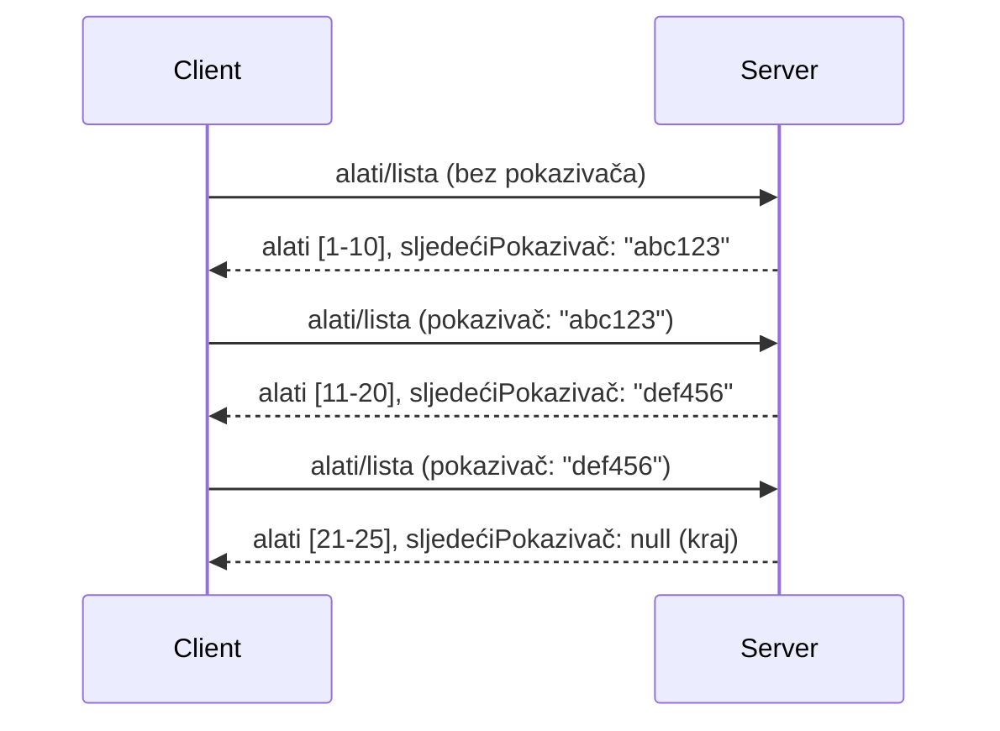

# Pagiranje i Veliki Skupovi Rezultata u MCP-u

Kada vaš MCP poslužitelj upravlja velikim skupovima podataka - bilo da se radi o popisivanju tisuća datoteka, zapisa u bazi podataka ili rezultata pretraživanja - trebate paginaciju kako biste učinkovito upravljali memorijom i osigurali brzo korisničko iskustvo. Ovaj vodič objašnjava kako implementirati i koristiti paginaciju u MCP-u.

## Zašto je paginacija važna

Bez paginacije, veliki odgovori mogu uzrokovati:

- **Iscrpljivanje memorije** - Učitavanje milijuna zapisa odjednom
- **Spori odgovori** - Korisnici čekaju dok se svi podaci učitaju
- **Greške zbog isteka vremena** - Zahtjevi premašuju vremenska ograničenja
- **Loše AI performanse** - LLM-ovi imaju poteškoće s ogromnim kontekstom

MCP koristi **paginaciju temeljenu na pokazivaču (cursor-based pagination)** za pouzdano i dosljedno listanje skupova rezultata.

---

## Kako radi MCP paginacija

### Koncept pokazivača (cursor)

**Pokazivač** je neproziran niz znakova koji označava vašu poziciju u skupu rezultata. Zamislite ga kao oznaku u dugoj knjizi.



### Paginacija u MCP metodama

Ove MCP metode podržavaju paginaciju:

| Metoda | Vraća | Podrška za pokazivač |
|--------|---------|----------------|
| `tools/list` | Definicije alata | ✅ |
| `resources/list` | Definicije resursa | ✅ |
| `prompts/list` | Definicije prompta | ✅ |
| `resources/templates/list` | Predlošci resursa | ✅ |

---

## Implementacija na poslužitelju

### Python (FastMCP)

```python
from mcp.server import Server
from mcp.types import Tool, ListToolsResult
import math

app = Server("paginated-server")

# Simulirani veliki skup podataka
ALL_TOOLS = [
    Tool(name=f"tool_{i}", description=f"Tool number {i}", inputSchema={})
    for i in range(100)
]

PAGE_SIZE = 10

@app.list_tools()
async def list_tools(cursor: str | None = None) -> ListToolsResult:
    """List tools with pagination support."""
    
    # Dekodiraj kursor za početni indeks
    start_index = 0
    if cursor:
        try:
            start_index = int(cursor)
        except ValueError:
            start_index = 0
    
    # Dohvati stranicu rezultata
    end_index = min(start_index + PAGE_SIZE, len(ALL_TOOLS))
    page_tools = ALL_TOOLS[start_index:end_index]
    
    # Izračunaj sljedeći kursor
    next_cursor = None
    if end_index < len(ALL_TOOLS):
        next_cursor = str(end_index)
    
    return ListToolsResult(
        tools=page_tools,
        nextCursor=next_cursor
    )
```

### TypeScript

```typescript
import { Server } from "@modelcontextprotocol/sdk/server/index.js";
import { ListToolsResultSchema } from "@modelcontextprotocol/sdk/types.js";

const server = new Server({
  name: "paginated-server",
  version: "1.0.0"
});

// Simulirani veliki skup podataka
const ALL_TOOLS = Array.from({ length: 100 }, (_, i) => ({
  name: `tool_${i}`,
  description: `Tool number ${i}`,
  inputSchema: { type: "object", properties: {} }
}));

const PAGE_SIZE = 10;

server.setRequestHandler(ListToolsResultSchema, async (request) => {
  // Dekodiraj kursor
  let startIndex = 0;
  if (request.params?.cursor) {
    startIndex = parseInt(request.params.cursor, 10) || 0;
  }
  
  // Dohvati stranicu rezultata
  const endIndex = Math.min(startIndex + PAGE_SIZE, ALL_TOOLS.length);
  const pageTools = ALL_TOOLS.slice(startIndex, endIndex);
  
  // Izračunaj sljedeći kursor
  const nextCursor = endIndex < ALL_TOOLS.length ? String(endIndex) : undefined;
  
  return {
    tools: pageTools,
    nextCursor
  };
});
```

### Java (Spring MCP)

```java
@Service
public class PaginatedToolService {
    
    private static final int PAGE_SIZE = 10;
    private final List<Tool> allTools;
    
    public PaginatedToolService() {
        // Inicijaliziraj veliki skup podataka
        this.allTools = IntStream.range(0, 100)
            .mapToObj(i -> new Tool("tool_" + i, "Tool number " + i, Map.of()))
            .collect(Collectors.toList());
    }
    
    @McpMethod("tools/list")
    public ListToolsResult listTools(@Param("cursor") String cursor) {
        // Dekodiraj pokazivač
        int startIndex = 0;
        if (cursor != null && !cursor.isEmpty()) {
            try {
                startIndex = Integer.parseInt(cursor);
            } catch (NumberFormatException e) {
                startIndex = 0;
            }
        }
        
        // Dohvati stranicu rezultata
        int endIndex = Math.min(startIndex + PAGE_SIZE, allTools.size());
        List<Tool> pageTools = allTools.subList(startIndex, endIndex);
        
        // Izračunaj sljedeći pokazivač
        String nextCursor = endIndex < allTools.size() ? String.valueOf(endIndex) : null;
        
        return new ListToolsResult(pageTools, nextCursor);
    }
}
```

---

## Implementacija na klijentu

### Python klijent

```python
from mcp import ClientSession

async def get_all_tools(session: ClientSession) -> list:
    """Fetch all tools using pagination."""
    all_tools = []
    cursor = None
    
    while True:
        result = await session.list_tools(cursor=cursor)
        all_tools.extend(result.tools)
        
        if result.nextCursor is None:
            break
        cursor = result.nextCursor
    
    return all_tools

# Upotreba
async with client_session as session:
    tools = await get_all_tools(session)
    print(f"Found {len(tools)} tools")
```

### TypeScript klijent

```typescript
import { Client } from "@modelcontextprotocol/sdk/client/index.js";

async function getAllTools(client: Client): Promise<Tool[]> {
  const allTools: Tool[] = [];
  let cursor: string | undefined = undefined;
  
  do {
    const result = await client.listTools({ cursor });
    allTools.push(...result.tools);
    cursor = result.nextCursor;
  } while (cursor);
  
  return allTools;
}

// Uporaba
const tools = await getAllTools(client);
console.log(`Found ${tools.length} tools`);
```

### obrazac lijenog učitavanja (Lazy Loading Pattern)

Za vrlo velike skupove podataka, učitajte stranice po potrebi:

```python
class PaginatedToolIterator:
    """Lazily iterate through paginated tools."""
    
    def __init__(self, session: ClientSession):
        self.session = session
        self.cursor = None
        self.buffer = []
        self.exhausted = False
    
    async def __anext__(self):
        # Vrati iz međuspremnika ako je dostupan
        if self.buffer:
            return self.buffer.pop(0)
        
        # Provjeri jesmo li iscrpili sve stranice
        if self.exhausted:
            raise StopAsyncIteration
        
        # Dohvati sljedeću stranicu
        result = await self.session.list_tools(cursor=self.cursor)
        self.buffer = list(result.tools)
        self.cursor = result.nextCursor
        
        if self.cursor is None:
            self.exhausted = True
        
        if not self.buffer:
            raise StopAsyncIteration
        
        return self.buffer.pop(0)
    
    def __aiter__(self):
        return self

# Korištenje - memorijski učinkovito za velike skupove podataka
async for tool in PaginatedToolIterator(session):
    process_tool(tool)
```

---

## Paginacija za resurse

Resursi često trebaju paginaciju za direktorije ili velike skupove podataka:

```python
from mcp.server import Server
from mcp.types import Resource, ListResourcesResult
import os

app = Server("file-server")

@app.list_resources()
async def list_resources(cursor: str | None = None) -> ListResourcesResult:
    """List files in directory with pagination."""
    
    directory = "/data/files"
    all_files = sorted(os.listdir(directory))
    
    # Dekodiraj kursor (indeks datoteke)
    start_index = int(cursor) if cursor else 0
    page_size = 20
    end_index = min(start_index + page_size, len(all_files))
    
    # Napravi popis resursa za ovu stranicu
    resources = []
    for filename in all_files[start_index:end_index]:
        filepath = os.path.join(directory, filename)
        resources.append(Resource(
            uri=f"file://{filepath}",
            name=filename,
            mimeType="application/octet-stream"
        ))
    
    # Izračunaj sljedeći kursor
    next_cursor = str(end_index) if end_index < len(all_files) else None
    
    return ListResourcesResult(
        resources=resources,
        nextCursor=next_cursor
    )
```

---

## Strategije dizajna pokazivača

### Strategija 1: Na osnovi indeksa (jednostavna)

```python
# Kursor je samo indeks
cursor = "50"  # Počni na stavci 50
```

**Prednosti:** Jednostavna, bez stanja
**Nedostaci:** Rezultati se mogu pomaknuti ako se stavke dodaju/uklanjaju

### Strategija 2: Na osnovi ID-a (stabilna)

```python
# Kursor je zadnji viđeni ID
cursor = "item_abc123"  # Počni nakon ove stavke
```

**Prednosti:** Stabilna čak i ako se stavke mijenjaju
**Nedostaci:** Zahtijeva uređene ID-eve

### Strategija 3: Kodirano stanje (kompleksna)

```python
import base64
import json

def encode_cursor(state: dict) -> str:
    return base64.b64encode(json.dumps(state).encode()).decode()

def decode_cursor(cursor: str) -> dict:
    return json.loads(base64.b64decode(cursor).decode())

# Kursor sadrži više polja stanja
cursor = encode_cursor({
    "offset": 50,
    "filter": "active",
    "sort": "name"
})
```

**Prednosti:** Može kodirati složeno stanje
**Nedostaci:** Složenija, veći nizovi pokazivača

---

## Najbolje prakse

### 1. Odaberite odgovarajuće veličine stranica

```python
# Razmotrite veličinu podataka
PAGE_SIZE_SMALL_ITEMS = 100   # Jednostavni metapodaci
PAGE_SIZE_MEDIUM_ITEMS = 20   # Bogatiji objekti
PAGE_SIZE_LARGE_ITEMS = 5     # Složeni sadržaj
```

### 2. Obradite nevažeće pokazivače na prikladan način

```python
@app.list_tools()
async def list_tools(cursor: str | None = None) -> ListToolsResult:
    try:
        start_index = int(cursor) if cursor else 0
        if start_index < 0 or start_index >= len(ALL_TOOLS):
            start_index = 0  # Resetiraj na početak
    except (ValueError, TypeError):
        start_index = 0  # Nevažeći pokazivač, kreni ispočetka
    # ...
```

### 3. Uključite ukupan broj (opcionalno)

```python
return ListToolsResult(
    tools=page_tools,
    nextCursor=next_cursor,
    # Neke implementacije uključuju ukupno za napredak korisničkog sučelja
    _meta={"total": len(ALL_TOOLS)}
)
```

### 4. Testirajte rubne slučajeve

```python
async def test_pagination():
    # Prazan skup rezultata
    result = await session.list_tools()
    assert result.tools == []
    assert result.nextCursor is None
    
    # Jedna stranica
    result = await session.list_tools()
    assert len(result.tools) <= PAGE_SIZE
    
    # Nevažeći pokazivač
    result = await session.list_tools(cursor="invalid")
    assert result.tools  # Trebalo bi vratiti prvu stranicu
```

---

## Česte zamke

### ❌ Vraćanje svih rezultata pa paginacija na strani klijenta

```python
# LOŠE: Učitava sve u memoriju
@app.list_tools()
async def list_tools() -> ListToolsResult:
    all_tools = load_all_tools()  # 1 milijun alata!
    return ListToolsResult(tools=all_tools)
```

### ✅ Paginacija na izvoru podataka

```python
# DOBRO: Učitava samo ono što je potrebno
@app.list_tools()
async def list_tools(cursor: str | None = None) -> ListToolsResult:
    offset = int(cursor) if cursor else 0
    tools = await db.query_tools(offset=offset, limit=PAGE_SIZE)
    return ListToolsResult(tools=tools, nextCursor=...)
```

---

## Što slijedi

- [Modul 5.14 - Inženjerstvo konteksta](../../05-AdvancedTopics/mcp-contextengineering/README.md)
- [Modul 8 - Najbolje prakse](../../08-BestPractices/README.md)
- [3.8 - Testiranje vašeg MCP poslužitelja](../../03-GettingStarted/08-testing/README.md)

---

## Dodatni resursi

- [MCP specifikacija - Paginacija](https://modelcontextprotocol.io/specification/2026-07-28/)
- [Objašnjenje paginacije temeljene na pokazivaču](https://slack.engineering/evolving-api-pagination-at-slack/)
- [Python SDK testovi paginacije](https://github.com/modelcontextprotocol/python-sdk/blob/main/tests/client/test_list_methods_cursor.py)

---

<!-- CO-OP TRANSLATOR DISCLAIMER START -->
**Napomena**:
Ovaj dokument je preveden korištenjem AI prevoditeljskog servisa [Co-op Translator](https://github.com/Azure/co-op-translator). Iako težimo točnosti, imajte na umu da automatski prijevodi mogu sadržavati greške ili netočnosti. Izvorni dokument na izvornom jeziku treba smatrati autoritativnim izvorom. Za važne informacije preporuča se profesionalni ljudski prijevod. Nismo odgovorni za bilo kakva nesporazumevanja ili pogrešne interpretacije koje proizlaze iz korištenja ovog prijevoda.
<!-- CO-OP TRANSLATOR DISCLAIMER END -->