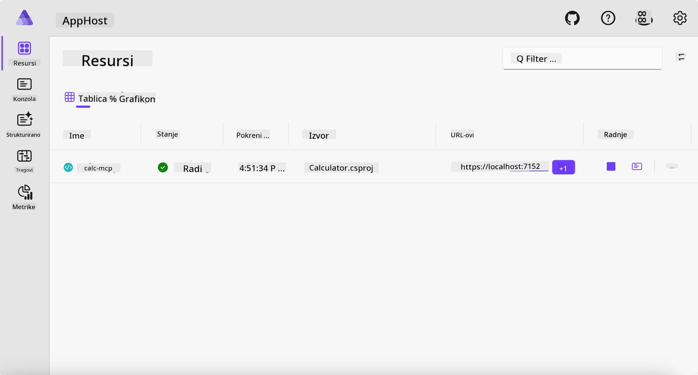
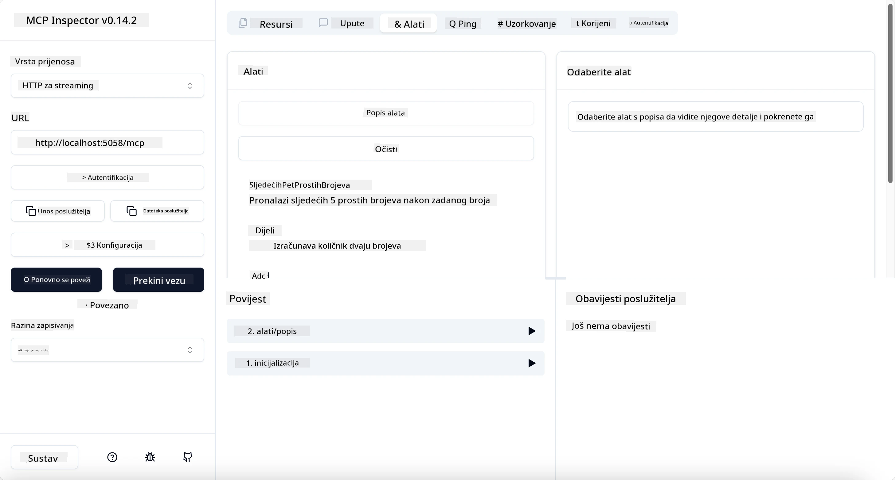
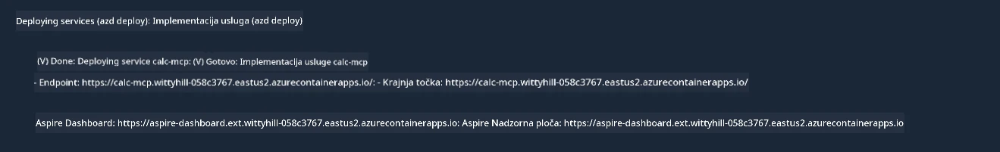

# Primjer

Prethodni primjer pokazuje kako koristiti lokalni .NET projekt s tipom `stdio`. I kako pokrenuti poslužitelj lokalno u kontejneru. Ovo je dobro rješenje u mnogim situacijama. Međutim, može biti korisno imati poslužitelj koji radi udaljeno, poput u oblaku. Tu nastupa tip `http`.

Gledajući rješenje u mapi `04-PracticalImplementation`, može se činiti mnogo složenije nego prethodno. Ali u stvarnosti nije. Ako pogledate pažljivo u projekt `src/Calculator`, vidjet ćete da je uglavnom isti kod kao u prethodnom primjeru. Jedina razlika je ta što koristimo drugu biblioteku `ModelContextProtocol.AspNetCore` za rukovanje HTTP zahtjevima. I mijenjamo metodu `IsPrime` da bude privatna, samo da pokažemo da možete imati privatne metode u vašem kodu. Ostatak koda je isti kao prije.

Ostali projekti su iz [Aspire](https://aspire.dev/get-started/what-is-aspire/). Imati Aspire u rješenju će poboljšati iskustvo programera tijekom razvoja i testiranja te pomoći pri vidljivosti (observability). Nije obavezno za pokretanje poslužitelja, ali je dobra praksa imati ga u vašem rješenju.

## Pokrenite poslužitelj lokalno

1. Iz VS Code (s C# DevKit ekstenzijom) navigirajte do direktorija `04-PracticalImplementation/samples/csharp`.
1. Pokrenite sljedeću naredbu za pokretanje poslužitelja:

   ```bash
    dotnet watch run --project ./src/AppHost
   ```

1. Kada se u web pregledniku otvori Aspire nadzorna ploča, zabilježite `http` URL. Trebalo bi biti nešto poput `http://localhost:5058/`.

   

## Testirajte Streamable HTTP s MCP Inspektorom

Ako imate Node.js 22.7.5 ili noviji, možete koristiti MCP Inspektor za testiranje vašeg poslužitelja.

Pokrenite poslužitelj i u terminalu izvedite sljedeću naredbu:

```bash
npx @modelcontextprotocol/inspector http://localhost:5058
```



- Odaberite `Streamable HTTP` kao tip Transporta.
- U polje Url unesite URL poslužitelja koji ste ranije zabilježili i dodajte `/mcp`. Trebalo bi biti `http` (ne `https`) nešto poput `http://localhost:5058/mcp`.
- odaberite gumb Connect.

Prednost Inspektora je što pruža dobru vidljivost u ono što se događa.

- Pokušajte prikazati dostupne alate
- Isprobajte neke od njih, trebali bi raditi isto kao prije.

## Testirajte MCP poslužitelj s GitHub Copilot Chat u VS Code

Za korištenje Streamable HTTP transporta s GitHub Copilot Chatom, promijenite konfiguraciju `calc-mcp` poslužitelja stvorenog ranije da izgleda ovako:

```jsonc
// .vscode/mcp.json
{
  "servers": {
    "calc-mcp": {
      "type": "http",
      "url": "http://localhost:5058/mcp"
    }
  }
}
```

Napravite neke testove:

- Zamolite za "3 prosta broja nakon 6780". Primijetite kako će Copilot koristiti nove alate `NextFivePrimeNumbers` i vratiti samo prva 3 prosta broja.
- Zamolite za "7 prostih brojeva nakon 111", da vidite što će se dogoditi.
- Zamolite za "John ima 24 lizalice i želi ih podijeliti svojoj 3 djece. Koliko lizalica ima svako dijete?", da vidite što će se dogoditi.

## Postavite poslužitelj na Azure

Postavimo poslužitelj na Azure kako bi ga više ljudi moglo koristiti.

Iz terminala, navigirajte do mape `04-PracticalImplementation/samples/csharp` i pokrenite sljedeću naredbu:

```bash
azd up
```

Kada se implementacija završi, trebali biste vidjeti poruku poput ove:



Preuzmite URL i koristite ga u MCP Inspektoru i u GitHub Copilot Chatu.

```jsonc
// .vscode/mcp.json
{
  "servers": {
    "calc-mcp": {
      "type": "http",
      "url": "https://calc-mcp.gentleriver-3977fbcf.australiaeast.azurecontainerapps.io/mcp"
    }
  }
}
```

## Što je sljedeće?

Isprobavamo različite vrste transporta i alate za testiranje. Također smo postavili vaš MCP poslužitelj na Azure. Ali što ako naš poslužitelj treba pristupiti privatnim resursima? Na primjer, bazi podataka ili privatnom API-ju? U sljedećem poglavlju vidjet ćemo kako možemo poboljšati sigurnost našeg poslužitelja.

---

<!-- CO-OP TRANSLATOR DISCLAIMER START -->
**Napomena**:
Ovaj dokument je preveden korištenjem AI prevoditeljskog servisa [Co-op Translator](https://github.com/Azure/co-op-translator). Iako težimo točnosti, imajte na umu da automatski prijevodi mogu sadržavati greške ili netočnosti. Izvorni dokument na izvornom jeziku treba smatrati autoritativnim izvorom. Za važne informacije preporuča se profesionalni ljudski prijevod. Nismo odgovorni za bilo kakva nesporazumevanja ili pogrešne interpretacije koje proizlaze iz korištenja ovog prijevoda.
<!-- CO-OP TRANSLATOR DISCLAIMER END -->