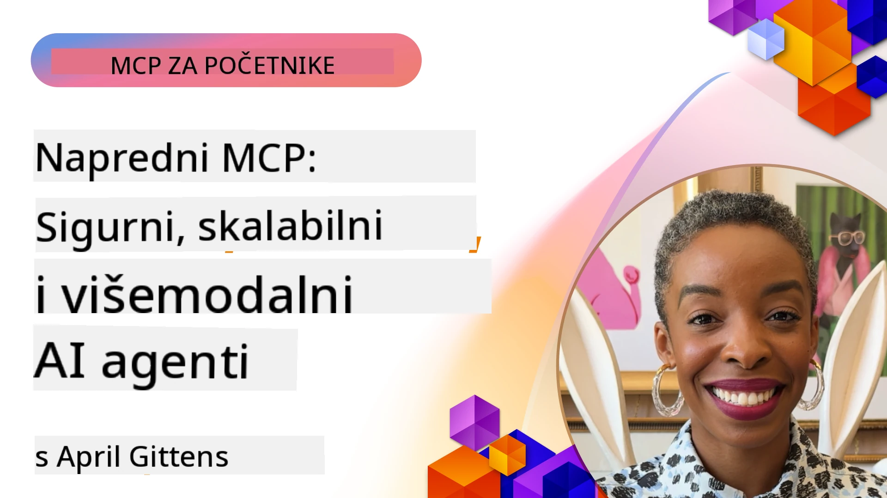

# Napredne teme u MCP-u

_(Kliknite na sliku iznad za pregled videozapisa ove lekcije)_

Ovo poglavlje pokriva niz naprednih tema u implementaciji Model Context Protokola (MCP), uključujući multimodalnu integraciju, skalabilnost, najbolje sigurnosne prakse i integraciju u poduzećima. Ove teme su ključne za izgradnju robusnih i spremnih za proizvodnju MCP aplikacija koje mogu zadovoljiti zahtjeve suvremenih AI sustava.

## Pregled

Ova lekcija istražuje napredne koncepte u implementaciji Model Context Protokola, fokusirajući se na multimodalnu integraciju, skalabilnost, najbolje sigurnosne prakse i integraciju u poduzećima. Ove teme su bitne za izgradnju MCP aplikacija razine proizvodnje koje mogu nositi složene zahtjeve u poslovnim okruženjima.

> **Napomena o trenutnoj specifikaciji:** MCP `2026-07-28` ukida Roots i
> Sampling primitivne elemente obrađene u lekcijama 5.4 i 5.6. Također prenosi
> eksperimentalnu funkciju Tasks spomenutu u Protocol Features (5.16) u
> zasebno proširenje Tasks. Te su lekcije zadržane za nasljeđe
> implementacije `2025-11-25` sa smjernicama za migraciju. Pogledajte
> [Što se promijenilo u MCP-u: Specifikacija 2026-07-28](../01-CoreConcepts/mcp-2026-07-28.md).

## Ciljevi učenja

Do kraja ove lekcije moći ćete:

- Implementirati multimodalne mogućnosti unutar MCP okvira
- Dizajnirati skalabilne MCP arhitekture za scenarije visokih zahtjeva
- Primijeniti najbolje sigurnosne prakse usklađene s MCP sigurnosnim principima
- Integrirati MCP sa sustavima i okvirima poduzeća za AI
- Optimizirati izvedbu i pouzdanost u proizvodnim okruženjima

## Lekcije i primjer projekata

| Veza | Naslov | Opis |
|------|-------|-------------|
| [5.1 Integracija s Azure](./mcp-integration/README.md) | Integracija s Azure | Naučite kako integrirati svoj MCP Server na Azureu |
| [5.2 Multifazni primjer](./mcp-multi-modality/README.md) | MCP multimodalni primjeri  | Primjeri za audio, slike i multimodalne odgovore |
| [5.3 MCP OAuth2 primjer](../../../05-AdvancedTopics/mcp-oauth2-demo) | MCP OAuth2 Demo | Minimalna Spring Boot aplikacija koja pokazuje OAuth2 s MCP-om, i kao Authorization i Resource Server. Demonstrira sigurnu izdaju tokena, zaštićene krajnje točke, Azure Container Apps implementaciju i integraciju upravljanja API-jem. |
| [5.4 Root Contexts](./mcp-root-contexts/README.md) | Root konteksti  | Naučite o naslijeđenom `2025-11-25` Roots primitivu i trenutnim opcijama migracije (zastarjelo u `2026-07-28`) |
| [5.5 Usmjeravanje](./mcp-routing/README.md) | Usmjeravanje | Naučite različite vrste usmjeravanja |
| [5.6 Uzorkovanje](./mcp-sampling/README.md) | Uzorkovanje | Naučite o naslijeđenom `2025-11-25` Sampling primitivu i trenutnim opcijama migracije (zastarjelo u `2026-07-28`) |
| [5.7 Skaliranje](./mcp-scaling/README.md) | Skaliranje  | Naučite o skaliranju |
| [5.8 Sigurnost](./mcp-security/README.md) | Sigurnost  | Osigurajte svoj MCP Server |
| [5.9 Primjer web pretraživanja](./web-search-mcp/README.md) | Web pretraživanje MCP | Python MCP server i klijent integrirani sa SerpAPI za pretraživanje weba, vijesti, proizvoda i Q&A u stvarnom vremenu. Pokazuje multi-alatnu orkestraciju, integraciju vanjskih API-ja i robusno rukovanje greškama. |
| [5.10 Streaming u stvarnom vremenu](./mcp-realtimestreaming/README.md) | Streaming  | Streaming podataka u stvarnom vremenu postao je ključan u današnjem svijetu vođenom podacima gdje poduzeća i aplikacije zahtijevaju trenutni pristup informacijama za pravovremeno donošenje odluka.|
| [5.11 Realtime Web Search](./mcp-realtimesearch/README.md) | Web pretraživanje | Kako MCP transformira pretraživanje weba u stvarnom vremenu pružajući standardizirani pristup upravljanju kontekstom preko AI modela, tražilica i aplikacija.| 
| [5.12 Entra ID autentikacija za Model Context Protocol Servere](./mcp-security-entra/README.md) | Entra ID autentikacija | Microsoft Entra ID pruža robusno rješenje za identitet i upravljanje pristupom bazirano na oblaku, pomažući osigurati da samo ovlašteni korisnici i aplikacije mogu koristiti vaš MCP server.|
| [5.13 Integracija Microsoft Foundry agenta](./mcp-foundry-agent-integration/README.md) | Microsoft Foundry integracija | Naučite kako integrirati Model Context Protocol servere s Microsoft Foundry agentima, omogućujući moćnu orkestraciju alata i AI kapacitete u poduzećima sa standardiziranim vezama na vanjske izvore podataka.|
| [5.14 Context Engineering](./mcp-contextengineering/README.md) | Context Engineering | Buduće prilike tehnikama inženjeringa konteksta za MCP servere, uključujući optimizaciju konteksta, dinamičko upravljanje kontekstom i strategije za učinkovito prompt inženjerstvo unutar MCP okvira.|
| [5.15 MCP prilagođeni transport](./mcp-transport/README.md) | Prilagođeni transport | Naučite kako implementirati prilagođene transportne mehanizme za specijalizirane MCP komunikacijske scenarije.|
| [5.16 Dubinski pregled protokolnih značajki](./mcp-protocol-features/README.md) | Protokolne značajke | Ovladavanje naprednim protokolnim značajkama uključujući obavijesti o napretku, otkazivanje zahtjeva, predloške resursa i obrasce za rukovanje greškama.|
| [5.17 Adversarijalno višestruko-agentno rezoniranje](./mcp-adversarial-agents/README.md) | Adversarijalni agenti | Korištenje dva agenta s suprotnim stavovima, dijeleći jedan MCP skup alata, za otkrivanje halucinacija, površinski prikaz rubnih slučajeva i proizvodnju bolje kalibriranih izlaza kroz strukturirani debatu.|

> **Povijesna napomena `2025-11-25`:** ta revizija uvela je eksperimentalne
> Tasks i proširila nekoliko protokolnih značajki. U `2026-07-28`, Tasks su premješteni u
> službeno proširenje, a Roots su postali zastarjeli. Nemojte koristiti
> status značajke `2025-11-25` kao trenutnu smjernicu; pogledajte
> [2026-07-28 changelog](https://modelcontextprotocol.io/specification/2026-07-28/changelog).

## Dodatne reference

Za najnovije informacije o naprednim MCP temama, obratite se:
- [MCP Dokumentacija](https://modelcontextprotocol.io/)
- [MCP specifikacija (2026-07-28)](https://modelcontextprotocol.io/specification/2026-07-28/)
- [GitHub Repozitorij](https://github.com/modelcontextprotocol)
- [OWASP MCP Top 10](https://microsoft.github.io/mcp-azure-security-guide/mcp/) - Sigurnosni rizici i mitigacije
- [MCP Security Summit radionica (Sherpa)](https://azure-samples.github.io/sherpa/) - Praktična sigurnosna obuka

## Ključni zaključci

- Implementacije multimodalnog MCP-a proširuju AI mogućnosti izvan obrade teksta
- Skalabilnost je ključna za implementacije u poduzećima i može se riješiti horizontalnim i vertikalnim skaliranjem
- Sveobuhvatne sigurnosne mjere štite podatke i osiguravaju pravilnu kontrolu pristupa
- Integracija u poduzećima s platformama poput Azure OpenAI i Microsoft AI Foundry unapređuje MCP mogućnosti
- Napredne MCP implementacije imaju koristi od optimiziranih arhitektura i pažljivog upravljanja resursima

## Vježba

Dizajnirajte implementaciju MCP-a razine poduzeća za specifičan slučaj upotrebe:

1. Identificirajte multimodalne zahtjeve za svoj slučaj upotrebe
2. Nacrtajte sigurnosne kontrole potrebne za zaštitu osjetljivih podataka
3. Dizajnirajte skalabilnu arhitekturu koja može podnijeti varijabilna opterećenja
4. Isplanirajte točke integracije sa sustavima AI u poduzeću
5. Dokumentirajte potencijalne uska grla u izvedbi i strategije mitigacije

## Dodatni resursi

- [Azure OpenAI dokumentacija](https://learn.microsoft.com/en-us/azure/ai-services/openai/)
- [Microsoft AI Foundry dokumentacija](https://learn.microsoft.com/en-us/ai-services/)

---

## Što slijedi

Istražite lekcije u ovom modulu počevši s: [5.1 MCP integracija](./mcp-integration/README.md)

Nakon što završite ovaj modul, nastavite na: [Modul 6: Doprinosi zajednice](../06-CommunityContributions/README.md)

---

<!-- CO-OP TRANSLATOR DISCLAIMER START -->
**Napomena**:
Ovaj dokument je preveden korištenjem AI prevoditeljskog servisa [Co-op Translator](https://github.com/Azure/co-op-translator). Iako težimo točnosti, imajte na umu da automatski prijevodi mogu sadržavati greške ili netočnosti. Izvorni dokument na izvornom jeziku treba smatrati autoritativnim izvorom. Za važne informacije preporuča se profesionalni ljudski prijevod. Nismo odgovorni za bilo kakva nesporazumevanja ili pogrešne interpretacije koje proizlaze iz korištenja ovog prijevoda.
<!-- CO-OP TRANSLATOR DISCLAIMER END -->