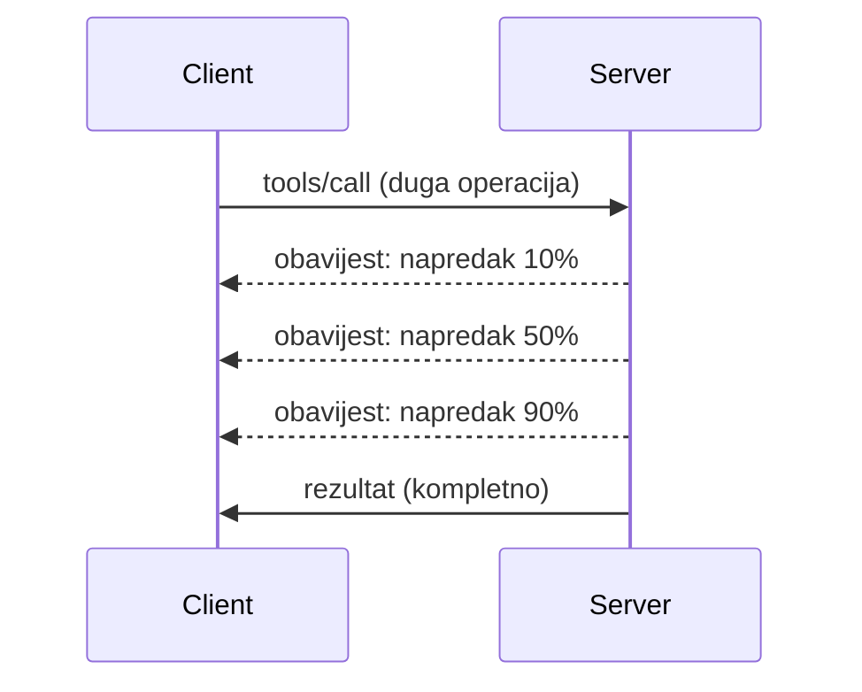

# Detaljno o značajkama MCP protokola

Ovaj vodič istražuje napredne značajke MCP protokola koje nadilaze osnovno rukovanje alatima i resursima. Razumijevanje ovih značajki pomaže vam u izgradnji robusnijih, korisnički prihvatljivih i proizvodno spremnih MCP poslužitelja.

> **Opseg MCP `2026-07-28`:** pokretanje i zaustavljanje procesa poslužitelja ostaju
> odgovornosti aplikacije, ali  MCP `initialize` rukovanje i sesije na razini protokola
> su uklonjeni. Odjeljak o zapisivanju (Logging) u nastavku zadržan je za naslijeđene
> implementacije; novi poslužitelji trebaju koristiti `stderr` ili OpenTelemetry. Zadatci su
> sada zasebno verzionirani dodatak. Pogledajte
> [Što je promijenjeno u MCP-u: specifikacija 2026-07-28](../../01-CoreConcepts/mcp-2026-07-28.md).

## Pokrivene značajke

1. **Obavijesti o napretku** – Prikaz napretka za dugotrajne operacije
2. **Otkazivanje zahtjeva** – Omogućavanje klijentima da otkažu zahtjeve u tijeku
3. **Predlošci resursa** – Dinamičke URI adrese resursa s parametrima
4. **Životni ciklus aplikacije** – Pokretanje i zaustavljanje procesa poslužitelja
5. **Kontrola zapisivanja (naslijeđeno)** – Zastarjela konfiguracija zapisivanja MCP-a
6. **Obrasci rukovanja pogreškama** – Dosljedni odgovori o pogreškama

---

## 1. Obavijesti o napretku

Za operacije koje zahtijevaju vrijeme (obrada podataka, preuzimanje datoteka, API pozivi), obavijesti o napretku informiraju korisnike o statusu.

### Kako funkcionira



### Implementacija u Pythonu

```python
from mcp.server import Server, NotificationOptions
from mcp.types import ProgressNotification
import asyncio

app = Server("progress-server")

@app.tool()
async def process_large_file(file_path: str, ctx) -> str:
    """Process a large file with progress updates."""
    
    # Dohvati veličinu datoteke za izračun napretka
    file_size = os.path.getsize(file_path)
    processed = 0
    
    with open(file_path, 'rb') as f:
        while chunk := f.read(8192):
            # Obradi dio
            await process_chunk(chunk)
            processed += len(chunk)
            
            # Pošalji obavijest o napretku
            progress = (processed / file_size) * 100
            await ctx.send_notification(
                ProgressNotification(
                    progressToken=ctx.request_id,
                    progress=progress,
                    total=100,
                    message=f"Processing: {progress:.1f}%"
                )
            )
    
    return f"Processed {file_size} bytes"

@app.tool()
async def batch_operation(items: list[str], ctx) -> str:
    """Process multiple items with progress."""
    
    results = []
    total = len(items)
    
    for i, item in enumerate(items):
        result = await process_item(item)
        results.append(result)
        
        # Prijavi napredak nakon svake stavke
        await ctx.send_notification(
            ProgressNotification(
                progressToken=ctx.request_id,
                progress=i + 1,
                total=total,
                message=f"Processed {i + 1}/{total}: {item}"
            )
        )
    
    return f"Completed {total} items"
```

### Implementacija u TypeScriptu

```typescript
import { Server } from "@modelcontextprotocol/sdk/server/index.js";

server.setRequestHandler(CallToolSchema, async (request, extra) => {
  const { name, arguments: args } = request.params;
  
  if (name === "process_data") {
    const items = args.items as string[];
    const results = [];
    
    for (let i = 0; i < items.length; i++) {
      const result = await processItem(items[i]);
      results.push(result);
      
      // Pošalji obavijest o napretku
      await extra.sendNotification({
        method: "notifications/progress",
        params: {
          progressToken: request.id,
          progress: i + 1,
          total: items.length,
          message: `Processing item ${i + 1}/${items.length}`
        }
      });
    }
    
    return { content: [{ type: "text", text: JSON.stringify(results) }] };
  }
});
```

### Rukovanje na strani klijenta (Python)

```python
async def handle_progress(notification):
    """Handle progress notifications from server."""
    params = notification.params
    print(f"Progress: {params.progress}/{params.total} - {params.message}")

# Registriraj rukovatelja
session.on_notification("notifications/progress", handle_progress)

# Pozovi alat (ažuriranja napretka će stizati putem rukovatelja)
result = await session.call_tool("process_large_file", {"file_path": "/data/large.csv"})
```

---

## 2. Otkazivanje zahtjeva

Omogućite klijentima da otkažu zahtjeve koji više nisu potrebni ili traju predugo.

### Implementacija u Pythonu

```python
from mcp.server import Server
from mcp.types import CancelledError
import asyncio

app = Server("cancellable-server")

@app.tool()
async def long_running_search(query: str, ctx) -> str:
    """Search that can be cancelled."""
    
    results = []
    
    try:
        for page in range(100):  # Pretraži kroz mnoge stranice
            # Provjeri je li zatraženo otkazivanje
            if ctx.is_cancelled:
                raise CancelledError("Search cancelled by user")
            
            # Simuliraj pretraživanje stranice
            page_results = await search_page(query, page)
            results.extend(page_results)
            
            # Mali zastoj omogućava provjeru otkazivanja
            await asyncio.sleep(0.1)
            
    except CancelledError:
        # Vrati djelomične rezultate
        return f"Cancelled. Found {len(results)} results before cancellation."
    
    return f"Found {len(results)} total results"

@app.tool()
async def download_file(url: str, ctx) -> str:
    """Download with cancellation support."""
    
    async with aiohttp.ClientSession() as session:
        async with session.get(url) as response:
            total_size = int(response.headers.get('content-length', 0))
            downloaded = 0
            chunks = []
            
            async for chunk in response.content.iter_chunked(8192):
                if ctx.is_cancelled:
                    return f"Download cancelled at {downloaded}/{total_size} bytes"
                
                chunks.append(chunk)
                downloaded += len(chunk)
            
            return f"Downloaded {downloaded} bytes"
```

### Implementacija konteksta za otkazivanje

```python
class CancellableContext:
    """Context object that tracks cancellation state."""
    
    def __init__(self, request_id: str):
        self.request_id = request_id
        self._cancelled = asyncio.Event()
        self._cancel_reason = None
    
    @property
    def is_cancelled(self) -> bool:
        return self._cancelled.is_set()
    
    def cancel(self, reason: str = "Cancelled"):
        self._cancel_reason = reason
        self._cancelled.set()
    
    async def check_cancelled(self):
        """Raise if cancelled, otherwise continue."""
        if self.is_cancelled:
            raise CancelledError(self._cancel_reason)
    
    async def sleep_or_cancel(self, seconds: float):
        """Sleep that can be interrupted by cancellation."""
        try:
            await asyncio.wait_for(
                self._cancelled.wait(),
                timeout=seconds
            )
            raise CancelledError(self._cancel_reason)
        except asyncio.TimeoutError:
            pass  # Normalno vrijeme isteka, nastavi
```

### Otkazivanje na strani klijenta

```python
import asyncio

async def search_with_timeout(session, query, timeout=30):
    """Search with automatic cancellation on timeout."""
    
    task = asyncio.create_task(
        session.call_tool("long_running_search", {"query": query})
    )
    
    try:
        result = await asyncio.wait_for(task, timeout=timeout)
        return result
    except asyncio.TimeoutError:
        # Zahtjev za otkazivanje
        await session.send_notification({
            "method": "notifications/cancelled",
            "params": {"requestId": task.request_id, "reason": "Timeout"}
        })
        return "Search timed out"
```

---

## 3. Predlošci resursa

Predlošci resursa omogućuju dinamičku konstrukciju URI-ja s parametrima, što je korisno za API-je i baze podataka.

### Definiranje predložaka

```python
from mcp.server import Server
from mcp.types import ResourceTemplate

app = Server("template-server")

@app.list_resource_templates()
async def list_templates() -> list[ResourceTemplate]:
    """Return available resource templates."""
    return [
        ResourceTemplate(
            uriTemplate="db://users/{user_id}",
            name="User Profile",
            description="Fetch user profile by ID",
            mimeType="application/json"
        ),
        ResourceTemplate(
            uriTemplate="api://weather/{city}/{date}",
            name="Weather Data",
            description="Historical weather for city and date",
            mimeType="application/json"
        ),
        ResourceTemplate(
            uriTemplate="file://{path}",
            name="File Content",
            description="Read file at given path",
            mimeType="text/plain"
        )
    ]

@app.read_resource()
async def read_resource(uri: str) -> str:
    """Read resource, expanding template parameters."""
    
    # Analizirajte URI kako biste izvukli parametre
    if uri.startswith("db://users/"):
        user_id = uri.split("/")[-1]
        return await fetch_user(user_id)
    
    elif uri.startswith("api://weather/"):
        parts = uri.replace("api://weather/", "").split("/")
        city, date = parts[0], parts[1]
        return await fetch_weather(city, date)
    
    elif uri.startswith("file://"):
        path = uri.replace("file://", "")
        return await read_file(path)
    
    raise ValueError(f"Unknown resource URI: {uri}")
```

### Implementacija u TypeScriptu

```typescript
server.setRequestHandler(ListResourceTemplatesSchema, async () => {
  return {
    resourceTemplates: [
      {
        uriTemplate: "github://repos/{owner}/{repo}/issues/{issue_number}",
        name: "GitHub Issue",
        description: "Fetch a specific GitHub issue",
        mimeType: "application/json"
      },
      {
        uriTemplate: "db://tables/{table}/rows/{id}",
        name: "Database Row",
        description: "Fetch a row from a database table",
        mimeType: "application/json"
      }
    ]
  };
});

server.setRequestHandler(ReadResourceSchema, async (request) => {
  const uri = request.params.uri;
  
  // Parsiraj GitHub URI problema
  const githubMatch = uri.match(/^github:\/\/repos\/([^/]+)\/([^/]+)\/issues\/(\d+)$/);
  if (githubMatch) {
    const [_, owner, repo, issueNumber] = githubMatch;
    const issue = await fetchGitHubIssue(owner, repo, parseInt(issueNumber));
    return {
      contents: [{
        uri,
        mimeType: "application/json",
        text: JSON.stringify(issue, null, 2)
      }]
    };
  }
  
  throw new Error(`Unknown resource URI: ${uri}`);
});
```

---

## 4. Životni ciklus aplikacije

Ovaj odjeljak pokriva pokretanje i zaustavljanje procesa aplikacije, ne uklonjeno
MCP `initialize` rukovanje. Ispravno rukovanje životnim ciklusom osigurava uredno
upravljanje resursima.

### Upravljanje životnim ciklusom u Pythonu

```python
from mcp.server import Server
from contextlib import asynccontextmanager

app = Server("lifecycle-server")

# Dijeljeno stanje
db_connection = None
cache = None

@asynccontextmanager
async def lifespan(server: Server):
    """Manage server lifecycle."""
    global db_connection, cache
    
    # Pokretanje
    print("🚀 Server starting...")
    db_connection = await create_database_connection()
    cache = await create_cache_client()
    print("✅ Resources initialized")
    
    yield  # Server radi ovdje
    
    # Gašenje
    print("🛑 Server shutting down...")
    await db_connection.close()
    await cache.close()
    print("✅ Resources cleaned up")

app = Server("lifecycle-server", lifespan=lifespan)

@app.tool()
async def query_database(sql: str) -> str:
    """Use the shared database connection."""
    result = await db_connection.execute(sql)
    return str(result)
```

### Životni ciklus u TypeScriptu

```typescript
import { Server } from "@modelcontextprotocol/sdk/server/index.js";

class ManagedServer {
  private server: Server;
  private dbConnection: DatabaseConnection | null = null;
  
  constructor() {
    this.server = new Server({
      name: "lifecycle-server",
      version: "1.0.0"
    });
    
    this.setupHandlers();
  }
  
  async start() {
    // Inicijaliziraj resurse
    console.log("🚀 Server starting...");
    this.dbConnection = await createDatabaseConnection();
    console.log("✅ Database connected");
    
    // Pokreni poslužitelj
    await this.server.connect(transport);
  }
  
  async stop() {
    // Očisti resurse
    console.log("🛑 Server shutting down...");
    if (this.dbConnection) {
      await this.dbConnection.close();
    }
    await this.server.close();
    console.log("✅ Cleanup complete");
  }
  
  private setupHandlers() {
    this.server.setRequestHandler(CallToolSchema, async (request) => {
      // Sigurno koristi this.dbConnection
      // ...
    });
  }
}

// Korištenje s urednim gašenjem
const server = new ManagedServer();

process.on('SIGINT', async () => {
  await server.stop();
  process.exit(0);
});

await server.start();
```

---

## 5. Kontrola zapisivanja (naslijeđeno)

> [!WARNING]
> MCP zapisivanje zastarjelo je u `2026-07-28` i podložno je uklanjanju u
> prvoj reviziji specifikacije koja bude objavljena nakon 28. srpnja 2027. Sljedeći
> primjeri služe za kompatibilnost sa starijim implementacijama. Za nove poslužitelje
> koristite `stderr` sa stdio i OpenTelemetry za strukturiranu promatranost.

Naslijeđene MCP verzije podržavaju razine zapisivanja na strani poslužitelja koje klijenti mogu kontrolirati.

### Implementacija razina zapisivanja

```python
from mcp.server import Server
from mcp.types import LoggingLevel
import logging

app = Server("logging-server")

# Preslikajte MCP razine u Python razine zapisivanja dnevnika
LEVEL_MAP = {
    LoggingLevel.DEBUG: logging.DEBUG,
    LoggingLevel.INFO: logging.INFO,
    LoggingLevel.WARNING: logging.WARNING,
    LoggingLevel.ERROR: logging.ERROR,
}

logger = logging.getLogger("mcp-server")

@app.set_logging_level()
async def set_logging_level(level: LoggingLevel) -> None:
    """Handle client request to change logging level."""
    python_level = LEVEL_MAP.get(level, logging.INFO)
    logger.setLevel(python_level)
    logger.info(f"Logging level set to {level}")

@app.tool()
async def debug_operation(data: str) -> str:
    """Tool with various logging levels."""
    logger.debug(f"Processing data: {data}")
    
    try:
        result = process(data)
        logger.info(f"Successfully processed: {result}")
        return result
    except Exception as e:
        logger.error(f"Processing failed: {e}")
        raise
```

### Slanje poruka zapisivanja klijentu

```python
@app.tool()
async def complex_operation(input: str, ctx) -> str:
    """Operation that logs to client."""
    
    # Pošalji obavijest o zapisniku klijentu
    await ctx.send_log(
        level="info",
        message=f"Starting complex operation with input: {input}"
    )
    
    # Obavljaj posao...
    result = await do_work(input)
    
    await ctx.send_log(
        level="debug",
        message=f"Operation complete, result size: {len(result)}"
    )
    
    return result
```

---

## 6. Obrasci rukovanja pogreškama

Dosljedno rukovanje pogreškama poboljšava otklanjanje pogrešaka i korisničko iskustvo.

### MCP kodovi pogrešaka

```python
from mcp.types import McpError, ErrorCode

class ToolError(McpError):
    """Base class for tool errors."""
    pass

class ValidationError(ToolError):
    """Invalid input parameters."""
    def __init__(self, message: str):
        super().__init__(ErrorCode.INVALID_PARAMS, message)

class NotFoundError(ToolError):
    """Requested resource not found."""
    def __init__(self, resource: str):
        super().__init__(ErrorCode.INVALID_REQUEST, f"Not found: {resource}")

class PermissionError(ToolError):
    """Access denied."""
    def __init__(self, action: str):
        super().__init__(ErrorCode.INVALID_REQUEST, f"Permission denied: {action}")

class InternalError(ToolError):
    """Internal server error."""
    def __init__(self, message: str):
        super().__init__(ErrorCode.INTERNAL_ERROR, message)
```

### Strukturirani odgovori o pogreškama

```python
@app.tool()
async def safe_operation(input: str) -> str:
    """Tool with comprehensive error handling."""
    
    # Validiraj unos
    if not input:
        raise ValidationError("Input cannot be empty")
    
    if len(input) > 10000:
        raise ValidationError(f"Input too large: {len(input)} chars (max 10000)")
    
    try:
        # Provjeri dozvole
        if not await check_permission(input):
            raise PermissionError(f"read {input}")
        
        # Izvrši operaciju
        result = await perform_operation(input)
        
        if result is None:
            raise NotFoundError(input)
        
        return result
        
    except ConnectionError as e:
        raise InternalError(f"Database connection failed: {e}")
    except TimeoutError as e:
        raise InternalError(f"Operation timed out: {e}")
    except Exception as e:
        # Zabilježi neočekivane pogreške
        logger.exception(f"Unexpected error in safe_operation")
        raise InternalError(f"Unexpected error: {type(e).__name__}")
```

### Rukovanje pogreškama u TypeScriptu

```typescript
import { McpError, ErrorCode } from "@modelcontextprotocol/sdk/types.js";

function validateInput(data: unknown): asserts data is ValidInput {
  if (typeof data !== "object" || data === null) {
    throw new McpError(
      ErrorCode.InvalidParams,
      "Input must be an object"
    );
  }
  // Više provjere valjanosti...
}

server.setRequestHandler(CallToolSchema, async (request) => {
  try {
    validateInput(request.params.arguments);
    
    const result = await performOperation(request.params.arguments);
    
    return {
      content: [{ type: "text", text: JSON.stringify(result) }]
    };
    
  } catch (error) {
    if (error instanceof McpError) {
      throw error;  // Već MCP greška
    }
    
    // Pretvori druge greške
    if (error instanceof NotFoundError) {
      throw new McpError(ErrorCode.InvalidRequest, error.message);
    }
    
    // Nepoznata greška
    console.error("Unexpected error:", error);
    throw new McpError(
      ErrorCode.InternalError,
      "An unexpected error occurred"
    );
  }
});
```

---

## Značajke osjetljive na verziju

### Dodatak za zadatke

Zadatci su službeni, zasebno verzionirani dodatak u MCP `2026-07-28`. Poslužitelj
može vratiti rukovatelj zadatkom iz poziva alata, a klijent upravlja zadatkom
pomoću `tasks/get`, `tasks/update` i `tasks/cancel`. Eksperimentalni
`2025-11-25` Tasks API nije unatrag kompatibilan, i `tasks/list` više ne postoji.


ili otvoreni svijet operacije. One su naznake i ne smiju se smatrati povjerenim
ovlastima ili jamstvima sigurnosti osim ako ne dolaze od pouzdanog poslužitelja.


---

## Što slijedi

- [Modul 8 - Najbolje prakse](../../08-BestPractices/README.md)
- [5.14 - Inženjerstvo konteksta](../mcp-contextengineering/README.md)
- [Dnevnik promjena MCP specifikacije](https://modelcontextprotocol.io/specification/2026-07-28/changelog)

---

## Dodatni izvori

- [MCP specifikacija 2026-07-28](https://modelcontextprotocol.io/specification/2026-07-28/)
- [JSON-RPC 2.0 kodovi pogrešaka](https://www.jsonrpc.org/specification#error_object)
- [Primjeri Python SDK-a](https://github.com/modelcontextprotocol/python-sdk/tree/main/examples)
- [Primjeri TypeScript SDK-a](https://github.com/modelcontextprotocol/typescript-sdk/tree/main/examples)

---

<!-- CO-OP TRANSLATOR DISCLAIMER START -->
**Napomena**:
Ovaj dokument je preveden korištenjem AI prevoditeljskog servisa [Co-op Translator](https://github.com/Azure/co-op-translator). Iako težimo točnosti, imajte na umu da automatski prijevodi mogu sadržavati greške ili netočnosti. Izvorni dokument na izvornom jeziku treba smatrati autoritativnim izvorom. Za važne informacije preporuča se profesionalni ljudski prijevod. Nismo odgovorni za bilo kakva nesporazumevanja ili pogrešne interpretacije koje proizlaze iz korištenja ovog prijevoda.
<!-- CO-OP TRANSLATOR DISCLAIMER END -->