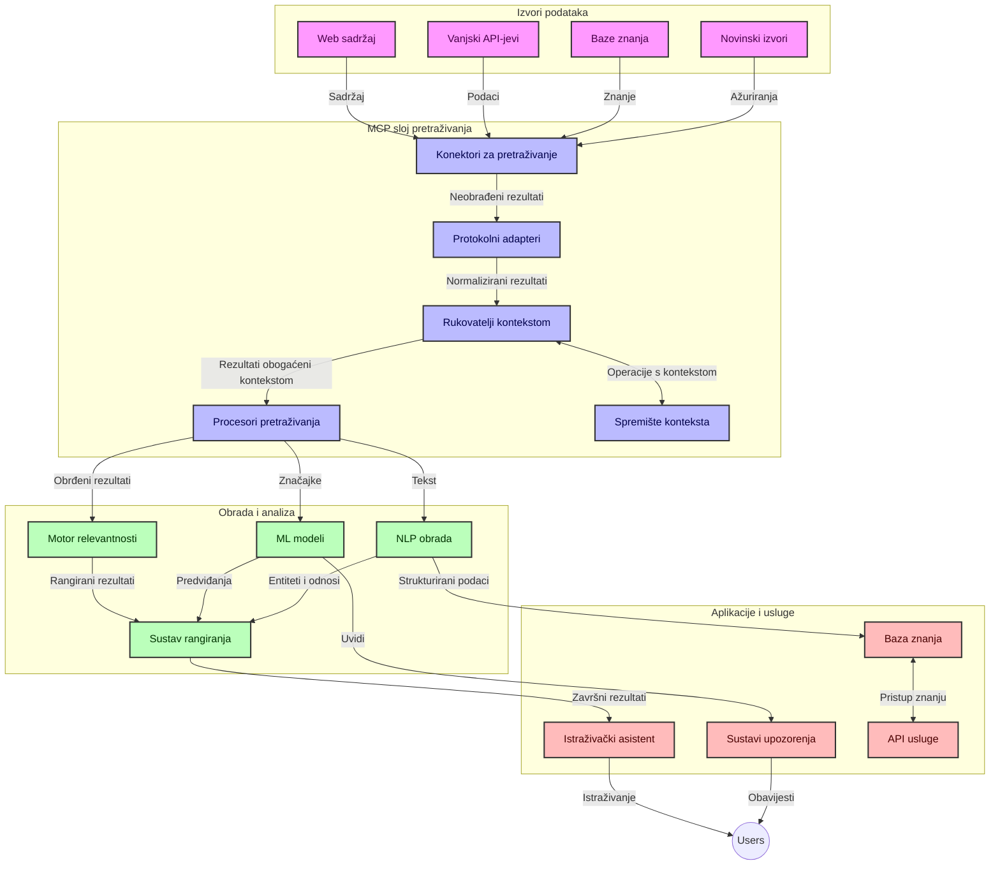
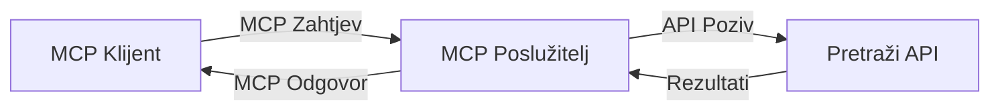
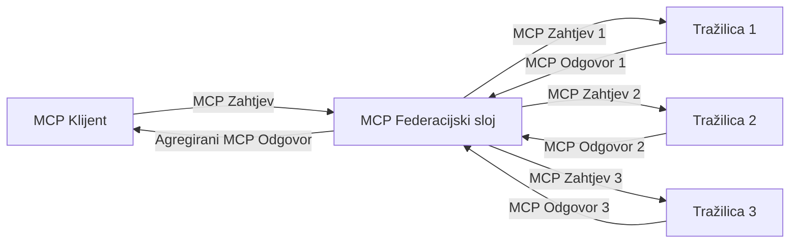
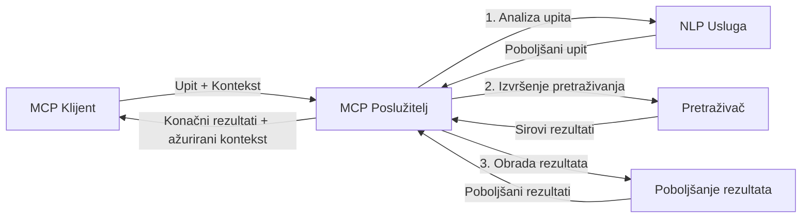

# Protokol konteksta modela za pretraživanje weba u stvarnom vremenu

## Pregled

Pretraživanje weba u stvarnom vremenu postalo je neophodno u današnjem svijetu usmjerenom na informacije, gdje aplikacije trebaju trenutni pristup ažuriranim informacijama s interneta kako bi pružile relevantne i pravodobne odgovore. Protokol konteksta modela (MCP) predstavlja značajan napredak u optimizaciji ovih procesa pretraživanja u stvarnom vremenu, povećavajući učinkovitost pretraživanja, održavajući kontekstualni integritet i poboljšavajući ukupne performanse sustava.

Ovaj modul istražuje kako MCP transformira pretraživanje weba u stvarnom vremenu pružajući standardizirani pristup upravljanju kontekstom između AI modela, tražilica i aplikacija.

### Što ćete naučiti

U ovom sveobuhvatnom vodiču otkrit ćete:

- Kako MCP stvara besprijekorni most između AI modela i mogućnosti pretraživanja weba u stvarnom vremenu
- Arhitektonske obrasce za implementaciju učinkovitih i skalabilnih rješenja za pretraživanje s MCP-om
- Tehnike očuvanja konteksta pretraživanja kroz višestruke upite i interakcije
- Praktične implementacije koda u Pythonu i JavaScriptu za različite scenarije pretraživanja
- Metode za balansiranje relevantnosti, ažurnosti i izvedbe u sustavima pretraživanja podržanim MCP-om

## Uvod u pretraživanje weba u stvarnom vremenu

Pretraživanje weba u stvarnom vremenu tehnološki je pristup koji omogućuje kontinuirano postavljanje upita, obradu i analizu web-informacija dok se objavljuju ili ažuriraju, dopuštajući sustavima da pružaju svježe i relevantne informacije uz minimalnu latenciju. Za razliku od tradicionalnih tražilica koje rade na indeksiranim podacima koji mogu biti stari satima ili danima, pretraživanje u stvarnom vremenu obrađuje žive podatke s weba, pružajući uvide i informacije koje odražavaju trenutačno stanje internetskog sadržaja.

### Temeljni pojmovi pretraživanja weba u stvarnom vremenu:

- **Kontinuirana obrada upita**: Upiti za pretraživanje obrađuju se prema stalno ažurirajućim izvorima podataka
- **Prioritet na ažurnosti**: Sustavi su dizajnirani da daju prednost svježim informacijama
- **Uravnoteženost relevantnosti**: Održavanje balansa između relevantnosti i ažurnosti
- **Skalabilna arhitektura**: Sustavi moraju podnijeti varijabilna opterećenja upita i volumen podataka
- **Kontekstualno razumijevanje**: Održavanje korisničkog konteksta kroz iteracije pretraživanja ključno je za smislene rezultate
- **Dinamička reformulacija upita**: Prilagodljivo mijenjanje upita na temelju konteksta i prethodnih rezultata
- **Integracija više izvora**: Kombiniranje rezultata s više pružatelja pretraživanja i web izvora
- **Semantičko razumijevanje**: Obrada upita i sadržaja temeljem značenja, a ne samo ključnih riječi
- **Rangiranje u stvarnom vremenu**: Kontinuirano prilagođavanje rangiranja rezultata kako nove informacije postaju dostupne

### Protokol konteksta modela i pretraživanje weba u stvarnom vremenu

Protokol konteksta modela (MCP) rješava nekoliko ključnih izazova u okruženjima pretraživanja weba u stvarnom vremenu:

1. **Očuvanje konteksta pretraživanja**: MCP standardizira način održavanja konteksta kroz distribuirane komponente pretraživanja, osiguravajući da AI modeli i obradbeni čvorovi imaju pristup relevantnoj povijesti upita i korisničkim preferencijama.

2. **Učinkovito upravljanje upitima**: Pružajući strukturirane mehanizme za prijenos konteksta, MCP smanjuje troškove ponavljanja konteksta u svakoj iteraciji pretraživanja.

3. **Interoperabilnost**: MCP stvara zajednički jezik za dijeljenje konteksta između različitih tehnologija pretraživanja i AI modela, omogućujući fleksibilnije i proširive arhitekture.

4. **Kontekst optimiziran za pretraživanje**: Implementacije MCP-a mogu prioritetno odabrati koji su elementi konteksta najvažniji za učinkovito pretraživanje, optimizirajući i performanse i točnost.

5. **Adaptivna obrada pretraživanja**: Uz pravilno upravljanje kontekstom putem MCP-a, sustavi pretraživanja mogu dinamički prilagođavati obradu prema promjenjivim potrebama korisnika i informacijskim pejzažima.

U modernim aplikacijama, od agregacije vijesti do istraživačkih asistenata, integracija MCP-a s tehnologijama za pretraživanje weba omogućuje inteligentnije, kontekstualno osviješteno pretraživanje koje može pružiti sve relevantnije rezultate kako interakcije korisnika traju.

## Ciljevi učenja

Do kraja ovog lekcije moći ćete:

- Razumjeti osnove pretraživanja weba u stvarnom vremenu i njegove izazove u suvremenim aplikacijama
- Objasniti kako Protokol konteksta modela (MCP) poboljšava mogućnosti pretraživanja weba u stvarnom vremenu
- Implementirati pretraživačka rješenja temeljena na MCP-u koristeći popularne okvire i API-je
- Dizajnirati i implementirati skalabilne, visokoučinkovite arhitekture pretraživanja s MCP-om
- Primijeniti koncepte MCP-a na različite slučajeve korištenja uključujući semantičko pretraživanje, istraživačku pomoć i pregledavanje uz podršku AI-a
- Procijeniti nove trendove i buduće inovacije u MCP-tehnologijama za pretraživanje
- Razviti sustave pretraživanja osjetljive na kontekst koji uče iz korisničkih interakcija
- Integrirati mogućnosti web pretraživanja u AI asistente koristeći standardizirane MCP protokole
- Kreirati višefazne pretraživačke cjevovode koji postupno usavršavaju rezultate na temelju konteksta
- Optimizirati izvedbu pretraživanja održavajući istovremeno sveobuhvatno osvješćivanje o kontekstu

### Definicija i značaj

Pretraživanje weba u stvarnom vremenu uključuje kontinuirano postavljanje upita, dohvat i isporuku web-baziranih informacija uz minimalnu latenciju. Za razliku od tradicionalnih tražilica koje povremeno pretražuju i indeksiraju web, pretraživanje u stvarnom vremenu cilj je prikazati informacije čim postanu dostupne, omogućujući trenutan pristup najnovijem sadržaju.

Ključne karakteristike pretraživanja weba u stvarnom vremenu uključuju:

- **Svježina**: Prioritet za nedavni sadržaj i nadopune
- **Kontinuirana obrada**: Neprestano praćenje novih informacija
- **Prilagodba upita**: Usavršavanje upita za pretraživanje na temelju konteksta i povratnih informacija
- **Neposredna isporuka**: Pružanje rezultata pretraživanja bez odgode
- **Očuvanje konteksta**: Nadograđivanje prethodnih upita za poboljšanu relevantnost

### Izazovi u tradicionalnom web pretraživanju

Tradicionalni pristupi web pretraživanju suočavaju se s nekoliko ograničenja kada se primjenjuju u situacijama stvarnog vremena:

1. **Fragmentacija konteksta**: Teškoće u održavanju konteksta pretraživanja kroz višestruke upite
2. **Svježina informacija**: Izazovi u pristupanju i davanju prioriteta najnovijim informacijama
3. **Kompleksnost integracije**: Problemi s interoperabilnošću između sustava pretraživanja i aplikacija
4. **Problemi s latencijom**: Balansiranje sveobuhvatnog pretraživanja s zahtjevima na vrijeme odgovora
5. **Podesivost relevantnosti**: Osiguranje točnosti i relevantnosti dok se daje prednost ažurnosti

## Razumijevanje protokola konteksta modela (MCP) za pretraživanje

### Što je MCP u kontekstu pretraživanja?

Protokol konteksta modela (MCP) je standardizirani komunikacijski protokol dizajniran za olakšavanje učinkovite interakcije između AI modela i aplikacija. U kontekstu pretraživanja weba u stvarnom vremenu, MCP pruža okvir za:

- Očuvanje konteksta pretraživanja tijekom nizova upita
- Standardizaciju formata upita za pretraživanje i rezultata
- Optimizaciju prijenosa parametara pretraživanja i rezultata
- Poboljšanje komunikacije između modela i tražilice

### Temeljne komponente i arhitektura

Arhitektura MCP-a za pretraživanje weba u stvarnom vremenu sastoji se od nekoliko ključnih komponenti:

1. **Upravitelji konteksta upita**: Upravljaju i održavaju kontekst pretraživanja kroz više upita
2. **Procesori pretraživanja**: Obrada dolaznih zahtjeva za pretraživanje koristeći tehnike osviještene o kontekstu
3. **Adaptatori protokola**: Pretvaraju između različitih API-ja za pretraživanje uz očuvanje konteksta
4. **Spremište konteksta**: Učinkovito pohranjuje i dohvaća povijest pretraživanja i preferencije
5. **Poveznice pretraživanja**: Povezuju se s različitim tražilicama i web API-jima



### Kako MCP poboljšava pretraživanje weba u stvarnom vremenu

MCP rješava tradicionalne izazove web pretraživanja putem:

- **Kontekstualna kontinuitet**: Održavanje veza između upita kroz cijelu sesiju pretraživanja
- **Optimizirani prijenos**: Smanjenje suvišnosti u parametrima pretraživanja kroz inteligentno upravljanje kontekstom
- **Standardizirani sučelja**: Pružanje dosljednih API-ja za komponente pretraživanja
- **Smanjena latencija**: Minimiziranje opterećenja obrade učinkovitom obradom konteksta
- **Povećana relevantnost**: Poboljšavanje relevantnosti pretraživanja očuvanjem korisničke namjere kroz više upita

## Integracija i implementacija

Sustavi za pretraživanje weba u stvarnom vremenu zahtijevaju pažljiv arhitektonski dizajn i implementaciju kako bi se održale i izvedba i kontekstualni integritet. Protokol konteksta modela nudi standardizirani pristup integraciji AI modela i tehnologija pretraživanja, dopuštajući sofisticiranije, kontekstualno osviještene cjevovode pretraživanja.

### Pregled integracije MCP-a u arhitekture pretraživanja

Implementacija MCP-a u okruženjima za pretraživanje weba u stvarnom vremenu uključuje nekoliko ključnih razmatranja:

1. **Serijalizacija konteksta pretraživanja**: MCP pruža učinkovite mehanizme za kodiranje kontekstualnih informacija unutar zahtjeva za pretraživanje, osiguravajući da bitan kontekst prati upit kroz cijeli obrambeni lanac. To uključuje standardizirane formate serijalizacije optimizirane za metapodatke vezane uz pretraživanje.

2. **Obrada pretraživanja sa stanjem**: MCP omogućuje inteligentniju obradu s održavanjem stanja kroz dosljednu reprezentaciju konteksta kroz iteracije pretraživanja. Ovo je osobito vrijedno u višefaznim cijevovodima pretraživanja gdje usavršavanje konteksta poboljšava rezultate.

3. **Proširenje i usavršavanje upita**: Implementacije MCP-a u sustavima pretraživanja mogu olakšati sofisticirano proširivanje i usavršavanje upita temeljem akumuliranog konteksta, dopuštajući sve relevantnije rezultate kako se sesija pretraživanja odvija.

4. **Keširanje i prioritetizacija rezultata**: Standardizacijom rukovanja kontekstom, MCP pomaže u upravljanju keširanjem i prioritetizacijom rezultata, dopuštajući komponentama prilagodbu na temelju razvijajućeg se konteksta pretraživanja.

5. **Federacija i agregacija pretraživanja**: MCP olakšava sofisticiraniju federaciju pretraživanja kroz više backendova pružajući strukturirane prikaze konteksta pretraživanja, čime se omogućuje smislenija agregacija rezultata iz raznolikih izvora.

Implementacija MCP-a u različitim tehnologijama pretraživanja stvara objedinjeni pristup upravljanju kontekstom, smanjujući potrebu za prilagođenim integracijskim kodom dok poboljšava sposobnost sustava da održava smislen kontekst dok se upiti za pretraživanje mijenjaju.

### MCP u različitim implementacijama web pretraživanja

Ovi primjeri slijede trenutnu MCP specifikaciju koja se fokusira na JSON-RPC bazirani protokol s različitim transportnim mehanizmima. Kod pokazuje kako možete implementirati prilagođene integracije pretraživanja uz održavanje pune kompatibilnosti s MCP protokolom.


<details>
<summary>Python implementacija s generičkim Search API-jem</summary>

```python
import asyncio
import json
import aiohttp
from typing import Dict, Any, Optional, List
from contextlib import asynccontextmanager
from collections.abc import AsyncIterator

# Uvezi standardne MCP biblioteke
from mcp.client.session import ClientSession
from mcp.client.streamable_http import streamablehttp_client
from mcp.types import TextContent, CreateMessageRequestParams, CreateMessageResult
from mcp.server.fastmcp import FastMCP

# Kreiraj FastMCP server za web pretraživanje
search_server = FastMCP("WebSearch")

# Klasa za rukovanje operacijama web pretraživanja
class WebSearchHandler:
    def __init__(self, api_endpoint: str, api_key: str):
        self.api_endpoint = api_endpoint
        self.api_key = api_key
        self.session = None
        
    async def initialize(self):
        """Initialize the HTTP session"""
        self.session = aiohttp.ClientSession(
            headers={"Authorization": f"Bearer {self.api_key}"}
        )
    
    async def close(self):
        """Close the HTTP session"""
        if self.session:
            await self.session.close()
            
    async def perform_search(self, query: str, max_results: int = 5, 
                           include_domains: List[str] = None, 
                           exclude_domains: List[str] = None,
                           time_period: str = "any") -> Dict[str, Any]:
        """Perform web search using the search API"""
        # Konstruiraj parametre pretraživanja
        search_params = {
            "q": query,
            "limit": max_results,
            "time": time_period
        }
        
        if include_domains:
            search_params["site"] = ",".join(include_domains)
            
        if exclude_domains:
            search_params["exclude_site"] = ",".join(exclude_domains)
        
        # Izvrši zahtjev za pretraživanje
        try:
            async with self.session.get(
                self.api_endpoint,
                params=search_params
            ) as response:
                if response.status != 200:
                    error_text = await response.text()
                    raise Exception(f"Search API error: {response.status} - {error_text}")
                
                search_data = await response.json()
                
                # Pretvori specifičan API odgovor u standardni format
                results = []
                for item in search_data.get("results", []):
                    results.append({
                        "title": item.get("title", ""),
                        "url": item.get("url", ""),
                        "snippet": item.get("snippet", ""),
                        "date": item.get("published_date", ""),
                        "source": item.get("source", "")
                    })
                
                return {
                    "query": query,
                    "totalResults": len(results),
                    "results": results
                }
        except Exception as e:
            print(f"Search API request error: {e}")
            raise

# Inicijaliziraj rukovatelja pretraživanja
search_handler = WebSearchHandler(
    api_endpoint="https://api.search-service.example/search",
    api_key="your-api-key-here"
)

# Postavi životni ciklus za upravljanje rukovateljem pretraživanja
@asyncio.asynccontextmanager
async def app_lifespan(server: FastMCP):
    """Manage application lifecycle"""
    await search_handler.initialize()
    try:
        yield {"search_handler": search_handler}
    finally:
        await search_handler.close()

# Postavi životni ciklus za server
search_server = FastMCP("WebSearch", lifespan=app_lifespan)

# Registriraj alat za web pretraživanje
@search_server.tool()
async def web_search(query: str, max_results: int = 5, 
                   include_domains: List[str] = None,
                   exclude_domains: List[str] = None,
                   time_period: str = "any") -> Dict[str, Any]:
    """
    Search the web for information
    
    Args:
        query: The search query
        max_results: Maximum number of results to return (default: 5)
        include_domains: List of domains to include in search results
        exclude_domains: List of domains to exclude from search results
        time_period: Time period for results ("day", "week", "month", "any")
        
    Returns:
        Dictionary containing search results
    """
    ctx = search_server.get_context()
    search_handler = ctx.request_context.lifespan_context["search_handler"]
    
    results = await search_handler.perform_search(
        query=query,
        max_results=max_results,
        include_domains=include_domains,
        exclude_domains=exclude_domains,
        time_period=time_period
    )
    
    return results

# Primjer korištenja klijenta
async def client_example():
    # Poveži se na server za pretraživanje koristeći Streamable HTTP transport
    async with streamablehttp_client("http://localhost:8000/mcp") as (read, write, _):
        async with ClientSession(read, write) as session:
            # Inicijaliziraj vezu
            await session.initialize()
            
            # Pozovi alat web_pretraživanja
            search_results = await session.call_tool(
                "web_search", 
                {
                    "query": "latest developments in AI and Model Context Protocol",
                    "max_results": 5,
                    "time_period": "day",
                    "include_domains": ["github.com", "microsoft.com"]
                }
            )
            
            print(f"Search results: {search_results}")

# Primjer izvođenja servera
if __name__ == "__main__":
    # Pokreni server sa Streamable HTTP transportom
    search_server.run(transport="streamable-http")
```
</details> 

<details>
<summary>JavaScript implementacija s pretraživanjem baziranim na pregledniku</summary>


```javascript
// Implementacija MCP poslužitelja za web pretraživanje
import { McpServer, ResourceTemplate } from '@modelcontextprotocol/sdk/server/mcp.js';
import { StreamableHTTPServerTransport } from '@modelcontextprotocol/sdk/server/streamableHttp.js';
import { z } from 'zod';

// Kreiraj MCP poslužitelj za web pretraživanje
const searchServer = new McpServer({
    name: "BrowserSearch",
    description: "A server that provides web search capabilities"
});

// Klasa usluge pretraživanja
class SearchService {
    constructor(searchApiUrl, apiKey) {
        this.searchApiUrl = searchApiUrl;
        this.apiKey = apiKey;
    }

    async performSearch(parameters) {
        const {
            query = '',
            maxResults = 5,
            includeDomains = [],
            excludeDomains = [],
            timePeriod = 'any'
        } = parameters;
        
        // Konstruiraj URL za pretraživanje s parametrima
        const url = new URL(this.searchApiUrl);
        url.searchParams.append('q', query);
        url.searchParams.append('limit', maxResults);
        url.searchParams.append('time', timePeriod);
        
        if (includeDomains.length > 0) {
            url.searchParams.append('site', includeDomains.join(','));
        }
        
        if (excludeDomains.length > 0) {
            url.searchParams.append('exclude_site', excludeDomains.join(','));
        }
        
        try {
            const response = await fetch(url.toString(), {
                method: 'GET',
                headers: {
                    'Authorization': `Bearer ${this.apiKey}`,
                    'Content-Type': 'application/json'
                }
            });
            
            if (!response.ok) {
                const errorText = await response.text();
                throw new Error(`Search API error: ${response.status} - ${errorText}`);
            }
            
            const searchData = await response.json();
            
            // Pretvori odgovor specifičan za API u standardni format
            const results = searchData.results?.map(item => ({
                title: item.title || '',
                url: item.url || '',
                snippet: item.snippet || '',
                date: item.published_date || '',
                source: item.source || ''
            })) || [];
            
            return {
                query,
                totalResults: results.length,
                results
            };
        } catch (error) {
            console.error('Search API request error:', error);
            throw error;
        }
    }
}

// Inicijaliziraj uslugu pretraživanja
const searchService = new SearchService(
    'https://api.search-service.example/search',
    'your-api-key-here'
);

// Postavi davatelja konteksta za poslužitelj
searchServer.setContextProvider(() => {
    return {
        searchService
    };
});

// Registriraj alat za web pretraživanje
searchServer.tool({
    name: 'web_search',
    description: 'Search the web for information',
    parameters: {
        type: 'object',
        properties: {
            query: {
                type: 'string',
                description: 'The search query'
            },
            maxResults: {
                type: 'integer',
                description: 'Maximum number of results to return',
                default: 5
            },
            includeDomains: {
                type: 'array',
                items: { type: 'string' },
                description: 'List of domains to include in search results'
            },
            excludeDomains: {
                type: 'array',
                items: { type: 'string' },
                description: 'List of domains to exclude from search results'
            },
            timePeriod: {
                type: 'string',
                description: 'Time period for results',
                enum: ['day', 'week', 'month', 'any'],
                default: 'any'
            }
        },
        required: ['query']
    },
    handler: async (params, context) => {
        const { searchService } = context;
        return await searchService.performSearch(params);
    }
});

// Primjer klijentskog koda za povezivanje s poslužiteljem za pretraživanje
import { Client } from '@modelcontextprotocol/sdk/client/index.js';
import { StreamableHTTPClientTransport } from '@modelcontextprotocol/sdk/client/streamableHttp.js';

async function connectToSearchServer() {
    // Poveži se na poslužitelj za pretraživanje
    const transport = new StreamableHTTPClientTransport(
        new URL('http://localhost:8000/mcp')
    );
    
    const client = new Client({
        name: 'search-client',
        version: '1.0.0'
    });
    
    await client.connect(transport);
    
    // Izvrši alat za pretraživanje
    const searchResults = await client.callTool({
        name: 'web_search',
        arguments: {
            query: 'Model Context Protocol implementation examples',
            maxResults: 10,
            timePeriod: 'week',
            includeDomains: ['github.com', 'docs.microsoft.com']
        }
    });
    
    console.log('Search results:', searchResults);
    
    // Očisti resurse
    await client.disconnect();
}

// Pokreni poslužitelj
const transport = new StreamableHTTPServerTransport();
await searchServer.connect(transport);
console.log('Search server running at http://localhost:8000/mcp');

// U zasebnom procesu ili nakon pokretanja poslužitelja
// connectToSearchServer().catch(console.error);
```
</details> 


## Odricanje od odgovornosti za primjere koda

> **Važna napomena**: Primjeri koda u nastavku pokazuju integraciju Protokola konteksta modela (MCP) s funkcionalnošću web pretraživanja. Iako slijede obrasce i strukture službenih MCP SDK-ova, pojednostavljeni su u obrazovne svrhe.
> 
> Ovi primjeri prikazuju:
> 
> 1. **Python implementaciju**: FastMCP poslužitelj koji pruža alat za pretraživanje weba i povezuje se s vanjskim pretraživačkim API-jem. Ovaj primjer pokazuje pravilno upravljanje životnim vijekom, rukovanje kontekstom i implementaciju alata prateći obrasce službenog [MCP Python SDK](https://github.com/modelcontextprotocol/python-sdk). Poslužitelj koristi preporučeni Streamable HTTP transport koji je zamijenio stariji SSE transport za produkcijske primjene.
> 
> 2. **JavaScript implementaciju**: TypeScript/JavaScript implementacija koristeći FastMCP obrazac iz službenog [MCP TypeScript SDK](https://github.com/modelcontextprotocol/typescript-sdk) za stvaranje pretraživačkog poslužitelja s pravilnim definicijama alata i klijentskim vezama. Slijedi najnovije preporučene obrasce za upravljanje sesijama i očuvanje konteksta.
> 
> Ovi primjeri zahtijevali bi dodatno rukovanje greškama, autentifikaciju i specifični kod integracije API-ja za produkcijsku upotrebu. API krajnje točke pretraživača prikazane (`https://api.search-service.example/search`) su rezervirana mjesta i trebale bi biti zamijenjene stvarnim krajnjim točkama usluge pretraživanja.
> 
> Za potpune detalje implementacije i najsvježije pristupe,
> pogledajte službenu [MCP specifikaciju](https://modelcontextprotocol.io/specification/2026-07-28/)
> i dokumentaciju SDK-a.

## Temeljni pojmovi

### Okvir Protokola konteksta modela (MCP)

U svojoj osnovi, Protokol konteksta modela pruža standardizirani način za razmjenu konteksta između AI modela, aplikacija i usluga. U pretraživanju weba u stvarnom vremenu, ovaj okvir je ključan za stvaranje koherentnih iskustava pretraživanja s višestrukim okretajima. Ključne komponente uključuju:

1. **Klijent-poslužitelj arhitektura**: MCP uspostavlja jasnu razdiobu između klijenata za pretraživanje (zahtjevača) i poslužitelja za pretraživanje (pružatelja), omogućujući fleksibilne modele implementacije.

2. **Komunikacija JSON-RPC**: Protokol koristi JSON-RPC za razmjenu poruka, čineći ga kompatibilnim s web tehnologijama i jednostavnim za implementiranje na različitim platformama.

3. **Upravljanje kontekstom**: MCP definira strukturirane metode za održavanje, ažuriranje i iskorištavanje konteksta pretraživanja kroz višestruke interakcije.

4. **Definicije alata**: Mogućnosti pretraživanja izložene su kao standardizirani alati s dobro definiranim parametrima i povratnim vrijednostima.

5. **Podrška za streaming**: Protokol podržava streaming rezultata, što je ključno za pretraživanje u stvarnom vremenu gdje rezultati mogu pristizati postupno.

### Obrasci integracije web pretraživanja

Pri integraciji MCP-a s web pretraživanjem pojavljuje se nekoliko obrazaca:

#### 1. Izravna integracija pružatelja pretraživanja



U ovom obrascu MCP poslužitelj izravno komunicira s jednim ili više API-ja za pretraživanje, prevodeći MCP zahtjeve u pozive specifične za API i formatirajući rezultate kao MCP odgovore.

#### 2. Federirano pretraživanje uz očuvanje konteksta



Ovaj obrazac distribuira upite za pretraživanje preko više MCP-kompatibilnih pružatelja pretraživanja, od kojih se svaki može specijalizirati za različite vrste sadržaja ili mogućnosti pretraživanja, istovremeno održavajući jedinstveni kontekst.

#### 3. Lanac pretraživanja sa obogaćenim kontekstom



U ovom obrascu proces pretraživanja podijeljen je u više faza, s obogaćivanjem konteksta u svakoj fazi, što rezultira postupno relevantnijim rezultatima.

### Komponente konteksta pretraživanja

U MCP-baziranom web pretraživanju, kontekst obično uključuje:

- **Povijest upita**: Prethodni upiti u sesiji
- **Korisničke preferencije**: Jezik, regija, postavke sigurnog pretraživanja
- **Povijest interakcija**: Koji su rezultati kliknuti, vrijeme provedeno na rezultatima
- **Parametri pretraživanja**: Filtri, redoslijedi sortiranja i drugi modifikatori pretraživanja
- **Znanje o domeni**: Kontekst specifičan za temu relevantnu za pretraživanje
- **Vremenski kontekst**: Faktori relevantnosti vezani uz vrijeme
- **Preferencije izvora**: Pouzdani ili preferirani izvori informacija

## Slučajevi i primjene

### Istraživanje i prikupljanje informacija

MCP poboljšava radne tokove istraživanja:

- Očuvanjem konteksta istraživanja kroz sesije pretraživanja
- Omogućavanjem sofisticiranijih i kontekstualno relevantnijih upita
- Podrškom za federaciju pretraživanja iz više izvora
- Olakšavanjem izvlačenja znanja iz rezultata pretraživanja

### Praćenje vijesti i trendova u stvarnom vremenu

Pretraživanje utemeljeno na MCP-u nudi prednosti za praćenje vijesti:

- Otkrivanje vijesti u gotovo stvarnom vremenu
- Kontekstualno filtriranje relevantnih informacija
- Praćenje tema i entiteta kroz više izvora
- Personalizirane obavijesti o vijestima temeljene na korisničkom kontekstu

### Pregledavanje i istraživanje uz AI potporu

MCP stvara nove mogućnosti za pregledavanje uz pomoć AI-a:

- Kontekstualni prijedlozi za pretraživanje na temelju trenutnih aktivnosti u pregledniku
- Besprijekorna integracija pretraživanja weba s pomoćnicima baziranim na velikim jezičnim modelima (LLM)
- Postupno usavršavanje pretraživanja s održavanjem konteksta kroz višestruke korake
- Poboljšano provjeravanje činjenica i verifikacija informacija

## Budući trendovi i inovacije

### Evolucija MCP-a u web pretraživanju

Gledajući unaprijed, predviđamo da će se MCP razvijati kako bi rješavao:


- **Multimodalno pretraživanje**: Integracija pretraživanja teksta, slike, zvuka i videa uz sačuvani kontekst
- **Decentralizirano pretraživanje**: Podrška za distribuirane i federirane pretraživačke ekosustave
- **Privatnost pretraživanja**: Mehanizmi pretraživanja koji čuvaju privatnost i uzimaju u obzir kontekst
- **Razumijevanje upita**: Dubinsko semantičko parsiranje prirodnih jezičnih upita za pretraživanje

### Potencijalni tehnološki napreci

Tehnologije u razvoju koje će oblikovati budućnost MCP pretraživanja:

1. **Neuralne arhitekture pretraživanja**: Sustavi pretraživanja temeljeni na ugradnjama optimizirani za MCP
2. **Personalizirani kontekst pretraživanja**: Učenje individualnih obrazaca pretraživanja korisnika kroz vrijeme
3. **Integracija grafova znanja**: Kontekstualno pretraživanje poboljšano grafovima znanja specifičnim za domenu
4. **Kros-modalni kontekst**: Održavanje konteksta preko različitih modaliteta pretraživanja

## Praktične vježbe

### Vježba 1: Postavljanje osnovne MCP pretraživačke cjevovode

U ovoj vježbi naučit ćete kako:
- Konfigurirati osnovno MCP pretraživačko okruženje
- Implementirati rukovatelje kontekstom za web pretraživanje
- Testirati i potvrditi očuvanje konteksta kroz različite iteracije pretraživanja

### Vježba 2: Izrada istraživačkog asistenta s MCP pretraživanjem

Izradite cjelovitu aplikaciju koja:
- Procesira istraživačka pitanja na prirodnom jeziku
- Izvodi kontekstualno svjesna web pretraživanja
- Sintetizira informacije iz više izvora
- Prikazuje organizirane istraživačke nalaze

### Vježba 3: Implementacija federacije pretraživanja s više izvora s MCP-om

Napredna vježba koja pokriva:
- Kontekstualno svjesno slanje upita višestrukim tražilicama
- Rangiranje rezultata i njihovo spajanje
- Kontekstualna deduplikacija rezultata pretraživanja
- Rukovanje metapodacima specifičnim za izvor

## Dodatni resursi

- [Model Context Protocol Specification](https://modelcontextprotocol.io/specification/2026-07-28/) - Službena MCP specifikacija i detaljna dokumentacija protokola
- [Model Context Protocol Documentation](https://modelcontextprotocol.io/) - Detaljni vodiči i upute za implementaciju
- [MCP Python SDK](https://github.com/modelcontextprotocol/python-sdk) - Službena Python implementacija MCP protokola
- [MCP TypeScript SDK](https://github.com/modelcontextprotocol/typescript-sdk) - Službena TypeScript implementacija MCP protokola
- [MCP Reference Servers](https://github.com/modelcontextprotocol/servers) - Referentne implementacije MCP servera
- [Bing Web Search API Documentation](https://learn.microsoft.com/en-us/bing/search-apis/bing-web-search/overview) - Microsoftov API za web pretraživanje
- [Google Custom Search JSON API](https://developers.google.com/custom-search/v1/overview) - Googleova programabilna tražilica
- [SerpAPI Documentation](https://serpapi.com/search-api) - API za rezultate pretraživačke stranice
- [Meilisearch Documentation](https://www.meilisearch.com/docs) - Open-source tražilica
- [Elasticsearch Documentation](https://www.elastic.co/guide/index.html) - Distribuirani sustav za pretraživanje i analitiku
- [LangChain Documentation](https://python.langchain.com/docs/get_started/introduction) - Izrada aplikacija s LLM-ovima

## Ishodi učenja

Završetkom ovog modula moći ćete:

- Razumjeti osnove web pretraživanja u stvarnom vremenu i njegove izazove
- Objasniti kako Model Context Protocol (MCP) poboljšava sposobnosti web pretraživanja u stvarnom vremenu
- Implementirati rješenja za pretraživanje temeljena na MCP-u koristeći popularne okvire i API-je
- Dizajnirati i implementirati skalabilne, visokoučinkovite arhitekture pretraživanja s MCP-om
- Primijeniti MCP koncepte na različite slučajeve upotrebe, uključujući semantičko pretraživanje, asistente za istraživanje i AI-poboljšano pregledavanje
- Procijeniti nove trendove i buduće inovacije u tehnologijama pretraživanja baziranima na MCP-u


### Razmatranja povjerenja i sigurnosti

Prilikom implementacije MCP temeljnih rješenja za web pretraživanje, imajte na umu ove važne principe iz MCP specifikacije:

1. **Slažem se i kontrola korisnika**: Korisnici moraju eksplicitno dati pristanak i razumjeti sve pristupe podacima i operacije. To je posebno važno za implementacije web pretraživanja koje mogu pristupati izvornim podacima s interneta.

2. **Privatnost podataka**: Osigurajte odgovarajuće rukovanje upitima i rezultatima pretraživanja, posebno kada mogu sadržavati osjetljive informacije. Implementirajte primjerenu kontrolu pristupa kako biste zaštitili korisničke podatke.

3. **Sigurnost alata**: Implementirajte pravilnu autorizaciju i validaciju alata za pretraživanje, jer oni predstavljaju potencijalne sigurnosne rizike kroz izvršavanje proizvoljnog koda. Opisi ponašanja alata trebaju se smatrati nepouzdanim osim ako nisu dobiveni s pouzdanog servera.

4. **Jasna dokumentacija**: Osigurajte jasnu dokumentaciju o mogućnostima, ograničenjima i sigurnosnim aspektima vaše MCP implementacije pretraživanja, prateći smjernice za implementaciju iz MCP specifikacije.

5. **Robusni protoci pristanka**: Izgradite pouzdane protoke pristanka i autorizacije koji jasno objašnjavaju funkcije svakog alata prije nego što se autorizira njihova upotreba, posebno za alate koji pristupaju vanjskim web izvorima.

Za potpune informacije o sigurnosti i povjerenju u MCP-u, pogledajte
[službenu dokumentaciju](https://modelcontextprotocol.io/specification/2026-07-28/basic/security_best_practices).

## Što slijedi

- [5.12 Entra ID autentifikacija za Model Context Protocol servere](../mcp-security-entra/README.md)

---

<!-- CO-OP TRANSLATOR DISCLAIMER START -->
**Napomena**:
Ovaj dokument je preveden korištenjem AI prevoditeljskog servisa [Co-op Translator](https://github.com/Azure/co-op-translator). Iako težimo točnosti, imajte na umu da automatski prijevodi mogu sadržavati greške ili netočnosti. Izvorni dokument na izvornom jeziku treba smatrati autoritativnim izvorom. Za važne informacije preporuča se profesionalni ljudski prijevod. Nismo odgovorni za bilo kakva nesporazumevanja ili pogrešne interpretacije koje proizlaze iz korištenja ovog prijevoda.
<!-- CO-OP TRANSLATOR DISCLAIMER END -->