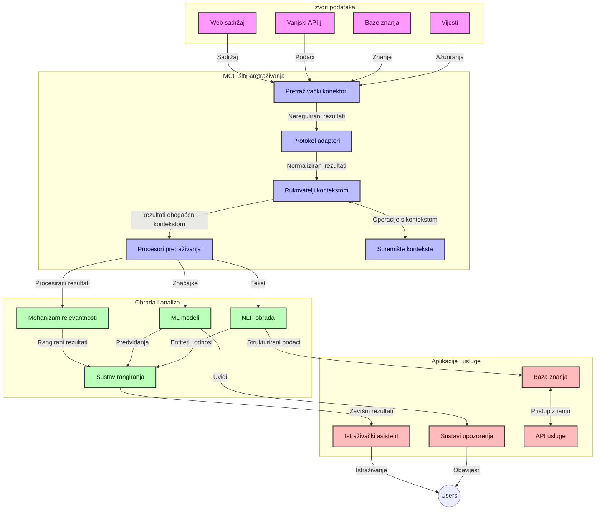
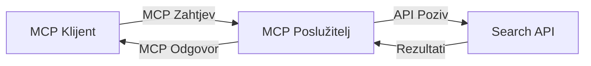
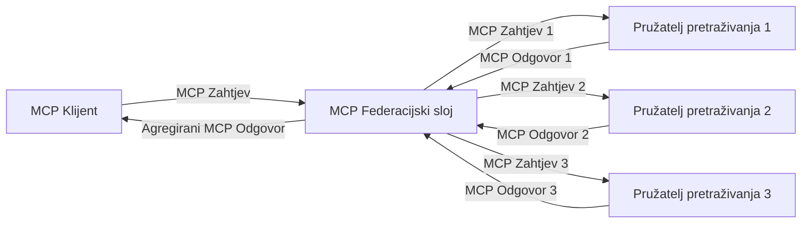
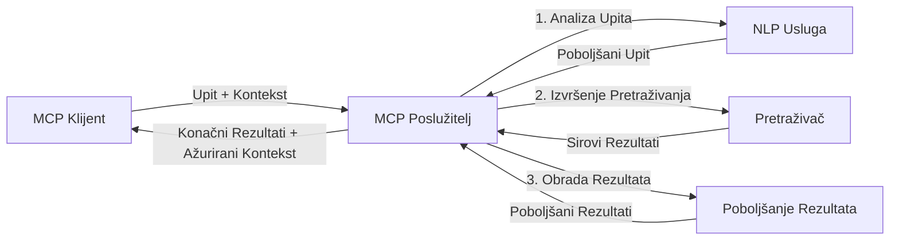

# Protokol konteksta modela za pretraživanje weba u stvarnom vremenu

## Pregled

Pretraživanje weba u stvarnom vremenu postalo je ključno u današnjem okruženju upravljanom informacijama, gdje aplikacije trebaju trenutni pristup ažuriranim informacijama s interneta kako bi pružile relevantne i pravovremene odgovore. Protokol konteksta modela (MCP) predstavlja značajan napredak u optimizaciji ovih procesa pretraživanja u stvarnom vremenu, poboljšavajući učinkovitost pretraživanja, održavajući kontekstualni integritet i poboljšavajući ukupne performanse sustava.

Ovaj modul istražuje kako MCP transformira pretraživanje weba u stvarnom vremenu pružajući standardiziran pristup upravljanju kontekstom kroz AI modele, tražilice i aplikacije.

### Što ćete naučiti

U ovom opširnom vodiču otkrit ćete:

- Kako MCP stvara neprimjetan most između AI modela i sposobnosti pretraživanja weba u stvarnom vremenu
- Arhitektonske obrasce za implementaciju učinkovitih i skalabilnih rješenja pretraživanja s MCP-om
- Tehnike za očuvanje konteksta pretraživanja kroz više upita i interakcija
- Praktične implementacije koda u Pythonu i JavaScriptu za različite scenarije pretraživanja
- Metode za balansiranje relevantnosti, novosti i performansi u sustavima pretraživanja pokretanim MCP-om

## Uvod u pretraživanje weba u stvarnom vremenu

Pretraživanje weba u stvarnom vremenu je tehnološki pristup koji omogućava kontinuirano upitovanje, obradu i analizu informacija s weba dok se objavljuju ili ažuriraju, dopuštajući sustavima da pružaju svježe i relevantne informacije s minimalnim zakašnjenjem. Za razliku od tradicionalnih sustava pretraživanja koji rade na indeksiranim podacima koji mogu biti stari satima ili danima, pretraživanje u stvarnom vremenu obrađuje žive podatke s weba, isporučujući uvide i informacije koje odražavaju trenutačno stanje online sadržaja.

### Osnovni pojmovi pretraživanja weba u stvarnom vremenu:

- **Kontinuirana obrada upita**: Upiti za pretraživanje obrađuju se na temelju stalno ažuriranih izvora podataka
- **Prioritet novosti**: Sustavi su dizajnirani da prioritiziraju svježe informacije
- **Balansiranje relevantnosti**: Održavanje ravnoteže između relevantnosti i novosti
- **Skalabilna arhitektura**: Sustavi moraju podnositi varijabilno opterećenje upitima i količine podataka
- **Kontekstualno razumijevanje**: Očuvanje korisničkog konteksta kroz iteracije pretraživanja ključno je za značajne rezultate
- **Dinamičko preformuliranje upita**: Prilagodljivo mijenjanje upita na temelju konteksta i prethodnih rezultata
- **Integracija iz više izvora**: Kombiniranje rezultata iz više pružatelja pretraživanja i web izvora
- **Semantičko razumijevanje**: Obrada upita i sadržaja na temelju značenja, a ne samo ključnih riječi
- **Rangiranje u stvarnom vremenu**: Kontinuirano prilagođavanje rangiranja rezultata kako nove informacije postaju dostupne

### Protokol konteksta modela i pretraživanje weba u stvarnom vremenu

Protokol konteksta modela (MCP) adresira nekoliko ključnih izazova u okruženjima pretraživanja weba u stvarnom vremenu:

1. **Očuvanje konteksta pretraživanja**: MCP standardizira način na koji se kontekst održava kroz distribuirane komponente pretraživanja, osiguravajući da modeli AI i čvorovi za obradu imaju pristup relevantnoj povijesti upita i korisničkim preferencijama.

2. **Učinkovito upravljanje upitima**: Pružajući strukturirane mehanizme za prijenos konteksta, MCP smanjuje troškove ponavljanja konteksta u svakoj iteraciji pretraživanja.

3. **Interoperabilnost**: MCP stvara zajednički jezik za dijeljenje konteksta između raznolikih tehnologija pretraživanja i AI modela, omogućujući fleksibilnije i proširive arhitekture.

4. **Kontekst optimiziran za pretraživanje**: Implementacije MCP-a mogu prioritizirati koji su elementi konteksta najrelevantniji za učinkovito pretraživanje te optimizirati i performanse i točnost.

5. **Prilagodljiva obrada pretraživanja**: Uz odgovarajuće upravljanje kontekstom putem MCP-a, sustavi pretraživanja mogu dinamički prilagođavati obradu na temelju razvijajućih potreba korisnika i informacijske okoline.

U modernim aplikacijama, od agregacije vijesti do istraživačkih asistenata, integracija MCP-a s tehnologijama pretraživanja weba omogućuje pametnije, kontekstualno svjesno pretraživanje koje može pružiti sve relevantnije rezultate kako se korisničke interakcije nastavljaju.

## Ciljevi učenja

Do kraja ove lekcije moći ćete:

- Razumjeti osnove pretraživanja weba u stvarnom vremenu i njegove izazove u suvremenim aplikacijama
- Objasniti kako Protokol konteksta modela (MCP) poboljšava mogućnosti pretraživanja weba u stvarnom vremenu
- Implementirati rješenja pretraživanja temeljena na MCP-u koristeći popularne okvire i API-je
- Dizajnirati i implementirati skalabilne arhitekture pretraživanja visokih performansi s MCP-om
- Primijeniti koncepte MCP-a u različitim slučajevima uporabe uključujući semantičko pretraživanje, asistenciju u istraživanju i AI-poboljšano pregledavanje
- Procijeniti nove trendove i buduće inovacije u tehnologijama pretraživanja temeljenima na MCP-u
- Razviti sustave pretraživanja svjesne konteksta koji uče iz korisničkih interakcija
- Integrirati mogućnosti pretraživanja weba u AI asistente koristeći standardizirane MCP protokole
- Kreirati višestupanjske cjevovode pretraživanja koji postupno poboljšavaju rezultate na temelju konteksta
- Optimizirati performanse pretraživanja uz održavanje sveobuhvatne svijesti o kontekstu

### Definicija i značaj

Pretraživanje weba u stvarnom vremenu uključuje kontinuirano upitovanje, dohvat i isporuku web-podataka s minimalnim kašnjenjem. Za razliku od tradicionalnih tražilica koje povremeno pretražuju i indeksiraju web, pretraživanje u stvarnom vremenu nastoji prikazati informacije čim postanu dostupne, omogućujući trenutni pristup najnovijem sadržaju.

Ključne karakteristike pretraživanja weba u stvarnom vremenu uključuju:

- **Svježina**: Prioritet najnovijem sadržaju i ažuriranjima
- **Kontinuirana obrada**: Stalni nadzor za nove informacije
- **Prilagodba upita**: Poboljšavanje upita za pretraživanje na temelju konteksta i povratnih informacija
- **Trenutna isporuka**: Pružanje rezultata pretraživanja s minimalnim zakašnjenjem
- **Očuvanje konteksta**: Nadogradnja prethodnih upita za bolju relevantnost

### Izazovi u tradicionalnom pretraživanju weba

Tradicionalni pristupi pretraživanju weba suočavaju se s nekoliko ograničenja kada se primjenjuju u scenarijima u stvarnom vremenu:

1. **Fragmentacija konteksta**: Teškoća u održavanju konteksta pretraživanja kroz više upita
2. **Svježina informacija**: Izazovi u pristupu i prioritetu najnovijih podataka
3. **Složena integracija**: Problemi s interoperabilnošću između sustava pretraživanja i aplikacija
4. **Problemi s latencijom**: Balansiranje sveobuhvatnog pretraživanja i zahtjeva za vremenom odgovora
5. **Podesivost relevantnosti**: Osiguravanje točnosti i relevantnosti pri prioritetu novosti

## Razumijevanje Protokola konteksta modela (MCP) za pretraživanje

### Što je MCP u kontekstu pretraživanja?

Protokol konteksta modela (MCP) je standardizirani komunikacijski protokol namijenjen olakšavanju učinkovitog sučeljavanja između AI modela i aplikacija. U kontekstu pretraživanja weba u stvarnom vremenu, MCP pruža okvir za:

- Očuvanje konteksta pretraživanja kroz niz upita
- Standardizaciju formata upita i rezultata pretraživanja
- Optimizaciju prijenosa parametara pretraživanja i rezultata
- Unapređenje komunikacije između modela i tražilice

### Osnovne komponente i arhitektura

Arhitektura MCP-a za pretraživanje weba u stvarnom vremenu sastoji se od nekoliko ključnih komponenti:

1. **Upravljači konteksta upita**: Upravljaju i održavaju kontekst pretraživanja kroz više upita
2. **Procesori pretraživanja**: Obrada dolaznih zahtjeva za pretraživanje koristeći tehnike svjesne konteksta
3. **Adapteri protokola**: Pretvaraju između različitih pretraživačkih API-ja održavajući kontekst
4. **Spremište konteksta**: Učinkovito pohranjuje i dohvaća povijest pretraživanja i korisničke preferencije
5. **Poveznice sa pretraživačima**: Povezivanje s raznim tražilicama i web API-jima



### Kako MCP poboljšava pretraživanje weba u stvarnom vremenu

MCP rješava tradicionalne probleme pretraživanja weba kroz:

- **Kontekstualnu kontinuitet**: Održavanje odnosa između upita kroz cijelu sesiju pretraživanja
- **Optimizirani prijenos**: Smanjenje redundancije u parametrima pretraživanja kroz inteligentno upravljanje kontekstom
- **Standardizirana sučelja**: Pružanje dosljednih API-ja za komponente pretraživanja
- **Smanjena latencija**: Minimiziranje troškova obrade efikasnim rukovanjem kontekstom
- **Poboljšana relevantnost**: Unapređenje relevantnosti pretraživanja očuvanjem korisničke namjere kroz više upita

## Integracija i implementacija

Sustavi pretraživanja weba u stvarnom vremenu zahtijevaju pažljiv arhitektonski dizajn i implementaciju da bi održali i performanse i kontekstualni integritet. Protokol konteksta modela nudi standardizirani pristup integraciji AI modela i tehnologija pretraživanja, dopuštajući sofisticiranije, kontekstualno svjesne stupce pretraživanja.

### Pregled integracije MCP-a u arhitekture pretraživanja

Implementacija MCP-a u okruženjima pretraživanja u stvarnom vremenu uključuje nekoliko ključnih razmatranja:

1. **Serializacija konteksta pretraživanja**: MCP pruža učinkovite mehanizme za kodiranje kontekstualnih informacija unutar zahtjeva za pretraživanje, osiguravajući da se bitan kontekst prenosi kroz cijeli procesni lanac. To uključuje standardizirane formate serializacije optimizirane za metapodatke vezane uz pretraživanje.

2. **Procesiranje pretraživanja s održavanjem stanja**: MCP omogućuje inteligentnije procesiranje sa stanjem održavajući dosljednu reprezentaciju konteksta kroz iteracije pretraživanja. Ovo je posebno vrijedno u višestupanjskim cjevovodima pretraživanja gdje poboljšanje konteksta rezultira boljim rezultatima.

3. **Proširenje i usavršavanje upita**: Implementacije MCP-a u sustavima pretraživanja mogu omogućiti sofisticirano proširenje i usavršavanje upita na temelju prikupljenog konteksta, što omogućava sve relevantnije rezultate kako sesija pretraživanja napreduje.

4. **Predmemoriranje i prioritizacija rezultata**: Standardiziranjem rukovanja kontekstom, MCP pomaže upravljati predmemoriranjem i prioritizacijom rezultata, dopuštajući komponentama da se prilagođavaju na temelju razvijajućeg konteksta pretraživanja.

5. **Federacija i agregacija pretraživanja**: MCP olakšava sofisticiraniju federaciju pretraživanja preko više pozadina pružajući strukturirane reprezentacije konteksta pretraživanja, omogućujući smisleniju agregaciju rezultata iz različitih izvora.

Implementacija MCP-a kroz različite tehnologije pretraživanja stvara jedinstveni pristup upravljanju kontekstom, smanjujući potrebu za prilagođenim kodiranjem integracije uz istovremeno poboljšanje sposobnosti sustava da održava smislen kontekst dok se upiti pretraživanja razvijaju.

### MCP u različitim implementacijama web pretraživanja

Ovi primjeri slijede trenutačnu MCP specifikaciju koja se fokusira na JSON-RPC bazirani protokol s različitim transportnim mehanizmima. Kod pokazuje kako možete implementirati prilagođene integracije pretraživanja dok održavate punu kompatibilnost s MCP protokolom.


<details>
<summary>Implementacija u Pythonu s generičkim Search API-jem</summary>

```python
import asyncio
import json
import aiohttp
from typing import Dict, Any, Optional, List
from contextlib import asynccontextmanager
from collections.abc import AsyncIterator

# Uvezi standardne MCP biblioteke
from mcp.client.session import ClientSession
from mcp.client.streamable_http import streamablehttp_client
from mcp.types import TextContent, CreateMessageRequestParams, CreateMessageResult
from mcp.server.fastmcp import FastMCP

# Kreiraj FastMCP server za pretraživanje weba
search_server = FastMCP("WebSearch")

# Klasa za rukovanje operacijama pretraživanja weba
class WebSearchHandler:
    def __init__(self, api_endpoint: str, api_key: str):
        self.api_endpoint = api_endpoint
        self.api_key = api_key
        self.session = None
        
    async def initialize(self):
        """Initialize the HTTP session"""
        self.session = aiohttp.ClientSession(
            headers={"Authorization": f"Bearer {self.api_key}"}
        )
    
    async def close(self):
        """Close the HTTP session"""
        if self.session:
            await self.session.close()
            
    async def perform_search(self, query: str, max_results: int = 5, 
                           include_domains: List[str] = None, 
                           exclude_domains: List[str] = None,
                           time_period: str = "any") -> Dict[str, Any]:
        """Perform web search using the search API"""
        # Konstruiraj parametre pretraživanja
        search_params = {
            "q": query,
            "limit": max_results,
            "time": time_period
        }
        
        if include_domains:
            search_params["site"] = ",".join(include_domains)
            
        if exclude_domains:
            search_params["exclude_site"] = ",".join(exclude_domains)
        
        # Izvrši zahtjev za pretraživanje
        try:
            async with self.session.get(
                self.api_endpoint,
                params=search_params
            ) as response:
                if response.status != 200:
                    error_text = await response.text()
                    raise Exception(f"Search API error: {response.status} - {error_text}")
                
                search_data = await response.json()
                
                # Pretvori odgovor specifičan za API u standardni format
                results = []
                for item in search_data.get("results", []):
                    results.append({
                        "title": item.get("title", ""),
                        "url": item.get("url", ""),
                        "snippet": item.get("snippet", ""),
                        "date": item.get("published_date", ""),
                        "source": item.get("source", "")
                    })
                
                return {
                    "query": query,
                    "totalResults": len(results),
                    "results": results
                }
        except Exception as e:
            print(f"Search API request error: {e}")
            raise

# Inicijaliziraj rukovatelja pretraživanja
search_handler = WebSearchHandler(
    api_endpoint="https://api.search-service.example/search",
    api_key="your-api-key-here"
)

# Postavi životni ciklus za upravljanje rukovateljem pretraživanja
@asyncio.asynccontextmanager
async def app_lifespan(server: FastMCP):
    """Manage application lifecycle"""
    await search_handler.initialize()
    try:
        yield {"search_handler": search_handler}
    finally:
        await search_handler.close()

# Postavi životni ciklus za server
search_server = FastMCP("WebSearch", lifespan=app_lifespan)

# Registriraj alat za pretraživanje weba
@search_server.tool()
async def web_search(query: str, max_results: int = 5, 
                   include_domains: List[str] = None,
                   exclude_domains: List[str] = None,
                   time_period: str = "any") -> Dict[str, Any]:
    """
    Search the web for information
    
    Args:
        query: The search query
        max_results: Maximum number of results to return (default: 5)
        include_domains: List of domains to include in search results
        exclude_domains: List of domains to exclude from search results
        time_period: Time period for results ("day", "week", "month", "any")
        
    Returns:
        Dictionary containing search results
    """
    ctx = search_server.get_context()
    search_handler = ctx.request_context.lifespan_context["search_handler"]
    
    results = await search_handler.perform_search(
        query=query,
        max_results=max_results,
        include_domains=include_domains,
        exclude_domains=exclude_domains,
        time_period=time_period
    )
    
    return results

# Primjer korištenja klijenta
async def client_example():
    # Poveži se na server za pretraživanje koristeći Streamable HTTP transport
    async with streamablehttp_client("http://localhost:8000/mcp") as (read, write, _):
        async with ClientSession(read, write) as session:
            # Inicijaliziraj vezu
            await session.initialize()
            
            # Pozovi alat web_search
            search_results = await session.call_tool(
                "web_search", 
                {
                    "query": "latest developments in AI and Model Context Protocol",
                    "max_results": 5,
                    "time_period": "day",
                    "include_domains": ["github.com", "microsoft.com"]
                }
            )
            
            print(f"Search results: {search_results}")

# Primjer izvršenja servera
if __name__ == "__main__":
    # Pokreni server sa Streamable HTTP transportom
    search_server.run(transport="streamable-http")
```
</details> 

<details>
<summary>Implementacija u JavaScriptu s pretraživanjem u pregledniku</summary>


```javascript
// Implementacija MCP poslužitelja za web pretraživanje
import { McpServer, ResourceTemplate } from '@modelcontextprotocol/sdk/server/mcp.js';
import { StreamableHTTPServerTransport } from '@modelcontextprotocol/sdk/server/streamableHttp.js';
import { z } from 'zod';

// Kreiraj MCP poslužitelj za web pretraživanje
const searchServer = new McpServer({
    name: "BrowserSearch",
    description: "A server that provides web search capabilities"
});

// Klasa usluge pretraživanja
class SearchService {
    constructor(searchApiUrl, apiKey) {
        this.searchApiUrl = searchApiUrl;
        this.apiKey = apiKey;
    }

    async performSearch(parameters) {
        const {
            query = '',
            maxResults = 5,
            includeDomains = [],
            excludeDomains = [],
            timePeriod = 'any'
        } = parameters;
        
        // Sastavi URL pretraživanja s parametrima
        const url = new URL(this.searchApiUrl);
        url.searchParams.append('q', query);
        url.searchParams.append('limit', maxResults);
        url.searchParams.append('time', timePeriod);
        
        if (includeDomains.length > 0) {
            url.searchParams.append('site', includeDomains.join(','));
        }
        
        if (excludeDomains.length > 0) {
            url.searchParams.append('exclude_site', excludeDomains.join(','));
        }
        
        try {
            const response = await fetch(url.toString(), {
                method: 'GET',
                headers: {
                    'Authorization': `Bearer ${this.apiKey}`,
                    'Content-Type': 'application/json'
                }
            });
            
            if (!response.ok) {
                const errorText = await response.text();
                throw new Error(`Search API error: ${response.status} - ${errorText}`);
            }
            
            const searchData = await response.json();
            
            // Pretvori API-specifični odgovor u standardni format
            const results = searchData.results?.map(item => ({
                title: item.title || '',
                url: item.url || '',
                snippet: item.snippet || '',
                date: item.published_date || '',
                source: item.source || ''
            })) || [];
            
            return {
                query,
                totalResults: results.length,
                results
            };
        } catch (error) {
            console.error('Search API request error:', error);
            throw error;
        }
    }
}

// Inicijaliziraj uslugu pretraživanja
const searchService = new SearchService(
    'https://api.search-service.example/search',
    'your-api-key-here'
);

// Postavi davatelja konteksta za poslužitelj
searchServer.setContextProvider(() => {
    return {
        searchService
    };
});

// Registriraj alat za web pretraživanje
searchServer.tool({
    name: 'web_search',
    description: 'Search the web for information',
    parameters: {
        type: 'object',
        properties: {
            query: {
                type: 'string',
                description: 'The search query'
            },
            maxResults: {
                type: 'integer',
                description: 'Maximum number of results to return',
                default: 5
            },
            includeDomains: {
                type: 'array',
                items: { type: 'string' },
                description: 'List of domains to include in search results'
            },
            excludeDomains: {
                type: 'array',
                items: { type: 'string' },
                description: 'List of domains to exclude from search results'
            },
            timePeriod: {
                type: 'string',
                description: 'Time period for results',
                enum: ['day', 'week', 'month', 'any'],
                default: 'any'
            }
        },
        required: ['query']
    },
    handler: async (params, context) => {
        const { searchService } = context;
        return await searchService.performSearch(params);
    }
});

// Primjer klijentskog koda za povezivanje na poslužitelj za pretraživanje
import { Client } from '@modelcontextprotocol/sdk/client/index.js';
import { StreamableHTTPClientTransport } from '@modelcontextprotocol/sdk/client/streamableHttp.js';

async function connectToSearchServer() {
    // Poveži se na poslužitelj za pretraživanje
    const transport = new StreamableHTTPClientTransport(
        new URL('http://localhost:8000/mcp')
    );
    
    const client = new Client({
        name: 'search-client',
        version: '1.0.0'
    });
    
    await client.connect(transport);
    
    // Izvrši alat za pretraživanje
    const searchResults = await client.callTool({
        name: 'web_search',
        arguments: {
            query: 'Model Context Protocol implementation examples',
            maxResults: 10,
            timePeriod: 'week',
            includeDomains: ['github.com', 'docs.microsoft.com']
        }
    });
    
    console.log('Search results:', searchResults);
    
    // Očisti
    await client.disconnect();
}

// Pokreni poslužitelj
const transport = new StreamableHTTPServerTransport();
await searchServer.connect(transport);
console.log('Search server running at http://localhost:8000/mcp');

// U zasebnom procesu ili nakon što je poslužitelj pokrenut
// connectToSearchServer().catch(console.error);
```
</details> 


## Odricanje od primjera koda

> **Važna napomena**: Primjeri koda u nastavku demonstriraju integraciju Protokola konteksta modela (MCP) s funkcionalnošću pretraživanja weba. Dok slijede obrasce i strukture službenih MCP SDK-ova, pojednostavljeni su za obrazovne svrhe.
> 
> Ovi primjeri prikazuju:
> 
> 1. **Implementaciju u Pythonu**: FastMCP serverska implementacija koja pruža alat za pretraživanje weba i povezuje se s vanjskim pretraživačkim API-jem. Ovaj primjer demonstrira pravilno upravljanje životnim vijekom, rukovanje kontekstom i implementaciju alata prateći obrasce [službenog MCP Python SDK-a](https://github.com/modelcontextprotocol/python-sdk). Server koristi preporučeni Streamable HTTP transport koji je zamijenio stariji SSE transport za produkcijske implementacije.
> 
> 2. **Implementaciju u JavaScriptu**: TypeScript/JavaScript implementacija koristeći FastMCP obrazac iz [službenog MCP TypeScript SDK-a](https://github.com/modelcontextprotocol/typescript-sdk) za stvaranje poslužitelja pretraživanja s pravilnim definicijama alata i povezivanjem klijenata. Slijedi najnovije preporučene obrasce za upravljanje sesijama i očuvanje konteksta.
> 
> Ovi primjeri zahtijevali bi dodatno rukovanje pogreškama, autentifikaciju i specifični kod integracije API-ja za produkcijsku upotrebu. Prikazani krajnji API-jevi pretraživanja (`https://api.search-service.example/search`) su rezervirani i trebali bi biti zamijenjeni stvarnim krajnjim točkama usluga pretraživanja.
> 
> Za potpunije detalje implementacije i najažurnije pristupe, molimo pogledajte [službenu MCP specifikaciju](https://spec.modelcontextprotocol.io/) i dokumentaciju SDK-a.

## Osnovni pojmovi

### Okvir Protokola konteksta modela (MCP)

Na svojoj osnovi, Protokol konteksta modela pruža standardizirani način za razmjenu konteksta između AI modela, aplikacija i usluga. U pretraživanju weba u stvarnom vremenu, ovaj okvir je ključan za stvaranje koherentnih, višekratnih iskustava pretraživanja. Ključne komponente uključuju:

1. **Klijent-poslužitelj arhitektura**: MCP uspostavlja jasnu razdvojenost između klijenata pretraživanja (zahtjevača) i poslužitelja pretraživanja (pružatelja), dopuštajući fleksibilne modele implementacije.

2. **JSON-RPC komunikacija**: Protokol koristi JSON-RPC za razmjenu poruka, što ga čini kompatibilnim s web tehnologijama i lako implementiranim na različitim platformama.

3. **Upravljanje kontekstom**: MCP definira strukturirane metode za održavanje, ažuriranje i iskorištavanje konteksta pretraživanja kroz više interakcija.

4. **Definicije alata**: Mogućnosti pretraživanja izlažu se kao standardizirani alati s jasno definiranim parametrima i povratnim vrijednostima.

5. **Podrška za streaming**: Protokol podržava streaming rezultata, što je ključno za pretraživanje u stvarnom vremenu gdje rezultati mogu pristizati postupno.

### Obrasci integracije web pretraživanja

Prilikom integracije MCP-a s web pretraživanjem, pojavljuje se nekoliko obrazaca:

#### 1. Izravna integracija s pružateljem pretraživanja



U ovom obrascu, MCP poslužitelj izravno se sučeljava s jednim ili više API-ja za pretraživanje, prevodeći MCP zahtjeve u API-specifične pozive i oblikujući rezultate kao MCP odgovore.

#### 2. Federirano pretraživanje s očuvanjem konteksta



Ovaj obrazac distribuira upite za pretraživanje preko više MCP-kompatibilnih pružatelja pretraživanja, od kojih se svaki može specijalizirati za različite vrste sadržaja ili mogućnosti pretraživanja, dok održava jedinstven kontekst.

#### 3. Lanac pretraživanja pojačan kontekstom



U ovom obrascu, proces pretraživanja podijeljen je u više faza, pri čemu se kontekst obogaćuje na svakom koraku, rezultirajući postupno relevantnijim rezultatima.

### Komponente konteksta pretraživanja

U MCP-baziranom pretraživanju weba, kontekst tipično uključuje:

- **Povijest upita**: Prethodni upiti za pretraživanje u sesiji
- **Korisničke preferencije**: Jezik, regija, postavke sigurnog pretraživanja
- **Povijest interakcija**: Koji su rezultati kliknuti, vrijeme provedeno na rezultatima
- **Parametri pretraživanja**: Filteri, redoslijed sortiranja i drugi modifikatori pretraživanja
- **Znanje o domeni**: Kontekst specifičan za temu relevantnu za pretraživanje
- **Vremenski kontekst**: Faktori relevantnosti vezani uz vrijeme
- **Preferencije izvora**: Pouzdani ili preferirani izvori informacija

## Slučajevi uporabe i primjene

### Istraživanje i prikupljanje informacija

MCP poboljšava radne tokove istraživanja kroz:

- Očuvanje konteksta istraživanja kroz sesije pretraživanja
- Omogućavanje sofisticiranijih i kontekstualno relevantnijih upita
- Podršku za federirano pretraživanje iz više izvora
- Olakšavanje ekstrakcije znanja iz rezultata pretraživanja

### Praćenje vijesti i trendova u stvarnom vremenu

Pretraživanje pokretano MCP-om nudi prednosti za praćenje vijesti:

- Otkrivanje vijesti u gotovo stvarnom vremenu
- Kontekstualno filtriranje relevantnih informacija
- Praćenje tema i entiteta preko više izvora
- Personalizirane obavijesti o vijestima temeljene na korisničkom kontekstu

### Pregledavanje i istraživanje uz podršku AI-a

MCP stvara nove mogućnosti za AI-poboljšano pregledavanje:

- Kontekstualni prijedlozi pretraživanja temeljeni na trenutačnoj aktivnosti u pregledniku
- Bešavna integracija pretraživanja weba s asistentima pokretanim velikim jezičnim modelima
- Ponavljajuće usavršavanje pretraživanja uz održavanje konteksta
- Poboljšano provjeravanje činjenica i verifikacija informacija

## Budući trendovi i inovacije

### Razvoj MCP-a u pretraživanju weba

Gledajući u budućnost, očekujemo da će se MCP razvijati kako bi odgovorio na:


- **Višemodalna pretraga**: Integracija pretrage teksta, slike, zvuka i videa uz očuvan kontekst
- **Decentralizirana pretraga**: Podrška distribuiranim i federiranim ekosustavima pretrage
- **Privatnost pretrage**: Mehanizmi pretrage koji štite privatnost uz svijest o kontekstu
- **Razumijevanje upita**: Dubinsko semantičko parsiranje prirodnih jezičnih upita za pretragu

### Potencijalni tehnološki napredci

Novonastale tehnologije koje će oblikovati budućnost MCP pretrage:

1. **Neuralne arhitekture pretrage**: Sustavi pretrage temeljeni na ugrađenim reprezentacijama optimizirani za MCP
2. **Personalizirani kontekst pretrage**: Učenje individualnih uzoraka pretrage korisnika tijekom vremena
3. **Integracija znanstvenih grafova**: Kontekstualna pretraga poboljšana domen-specifičnim znanstvenim grafovima
4. **Kros-modalni kontekst**: Očuvanje konteksta preko različitih modaliteta pretrage

## Praktične vježbe

### Vježba 1: Postavljanje osnovne MCP pretrage

U ovoj vježbi naučit ćete kako:
- Konfigurirati osnovno MCP pretraživačko okruženje
- Implementirati upravitelje konteksta za web pretragu
- Testirati i potvrditi očuvanje konteksta kroz iteracije pretrage

### Vježba 2: Izrada istraživačkog asistenta s MCP pretragom

Izradite kompletnu aplikaciju koja:
- Procesira istraživačka pitanja na prirodnom jeziku
- Izvršava pretrage na webu uz svijest o kontekstu
- Sintetizira informacije iz više izvora
- Prikazuje organizirane rezultate istraživanja

### Vježba 3: Implementacija federacije pretrage iz više izvora s MCP

Napredna vježba koja obuhvaća:
- Slanje upita prilagođenih kontekstu na više tražilica
- Rangiranje i agregaciju rezultata
- Kontekstualnu deduplikaciju rezultata pretrage
- Rukovanje meta-podacima specifičnim za izvor

## Dodatni resursi

- [Specifikacija Model Context Protocol](https://spec.modelcontextprotocol.io/) - Službena MCP specifikacija i detaljna dokumentacija protokola
- [Dokumentacija Model Context Protocol](https://modelcontextprotocol.io/) - Detaljni vodiči i tutorijali za implementaciju
- [MCP Python SDK](https://github.com/modelcontextprotocol/python-sdk) - Službena Python implementacija MCP protokola
- [MCP TypeScript SDK](https://github.com/modelcontextprotocol/typescript-sdk) - Službena TypeScript implementacija MCP protokola
- [MCP referentni serveri](https://github.com/modelcontextprotocol/servers) - Referentne implementacije MCP servera
- [Dokumentacija Bing Web Search API](https://learn.microsoft.com/en-us/bing/search-apis/bing-web-search/overview) - Microsoftov web-sučelje za pretragu
- [Google Custom Search JSON API](https://developers.google.com/custom-search/v1/overview) - Googleov programski tražilica za pretragu
- [SerpAPI dokumentacija](https://serpapi.com/search-api) - API za rezultate tražilica
- [Dokumentacija Meilisearch](https://www.meilisearch.com/docs) - Open-source tražilica
- [Dokumentacija Elasticsearch](https://www.elastic.co/guide/index.html) - Raspodijeljeni sustav pretrage i analitike
- [Dokumentacija LangChain](https://python.langchain.com/docs/get_started/introduction) - Izrada aplikacija s LLM-ovima

## Ishodi učenja

Završetkom ovog modula moći ćete:

- Razumjeti osnove pretrage u stvarnom vremenu na webu i njezine izazove
- Objasniti kako Model Context Protocol (MCP) poboljšava mogućnosti pretrage u stvarnom vremenu na webu
- Implementirati MCP-based rješenja za pretragu koristeći popularne okvire i API-je
- Dizajnirati i implementirati skalabilne, visokoučinkovite arhitekture pretrage s MCP-om
- Primijeniti koncepte MCP-a na različite slučajeve korištenja uključujući semantičku pretragu, istraživačku pomoć i pretraživanje uz AI podršku
- Procijeniti nove trendove i buduće inovacije u tehnologijama pretrage temeljenim na MCP-u


### Razmatranja o pouzdanosti i sigurnosti

Pri implementaciji MCP-based web pretraživačkih rješenja imajte na umu ove važne principe iz MCP specifikacije:

1. **Pristanak i kontrola korisnika**: Korisnici moraju izričito dati pristanak i razumjeti svu pristupnu i operativnu upotrebu podataka. To je posebno važno za web pretrage koje mogu pristupati vanjskim izvorima podataka.

2. **Privatnost podataka**: Osigurajte prikladno rukovanje upitima i rezultatima pretrage, osobito kada sadrže osjetljive informacije. Implementirajte odgovarajuće kontrole pristupa za zaštitu korisničkih podataka.

3. **Sigurnost alata**: Osigurajte ispravnu autorizaciju i validaciju alata za pretragu, jer oni mogu predstavljati sigurnosni rizik kroz izvršavanje proizvoljnog koda. Opisi ponašanja alata trebaju se smatrati nepouzdanim osim ako nisu dobiveni s pouzdanog servera.

4. **Jasna dokumentacija**: Pružite jasnu dokumentaciju o mogućnostima, ograničenjima i sigurnosnim razmatranjima vaše MCP-based implementacije prema smjernicama MCP specifikacije.

5. **Robusni tijekovi pristanka**: Izgradite robusne tijekove pristanka i autorizacije koji jasno objašnjavaju što svaki alat radi prije nego što se dopusti njegova upotreba, posebno za alate koji komuniciraju s vanjskim web resursima.

Za potpune detalje o sigurnosti i vjerodostojnosti MCP-a pogledajte [službenu dokumentaciju](https://modelcontextprotocol.io/specification/2025-11-25/basic/security_best_practices).

## Što dalje

- [5.12 Entra ID autentifikacija za Model Context Protocol servere](../mcp-security-entra/README.md)

---

<!-- CO-OP TRANSLATOR DISCLAIMER START -->
**Napomena**:
Ovaj dokument je preveden korištenjem AI prevoditeljskog servisa [Co-op Translator](https://github.com/Azure/co-op-translator). Iako težimo točnosti, imajte na umu da automatski prijevodi mogu sadržavati greške ili netočnosti. Izvorni dokument na izvornom jeziku treba smatrati autoritativnim izvorom. Za važne informacije preporuča se profesionalni ljudski prijevod. Nismo odgovorni za bilo kakva nesporazumevanja ili pogrešne interpretacije koje proizlaze iz korištenja ovog prijevoda.
<!-- CO-OP TRANSLATOR DISCLAIMER END -->