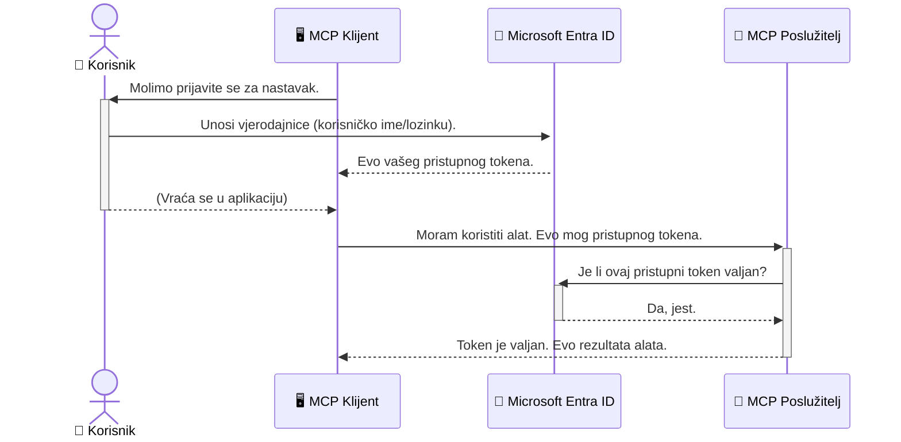

# Sigurnost AI Radnih Tijekova: Autentikacija Entra ID za Servere Model Context Protocola

> [!NOTE]
> Kod udaljenog servera u ovoj lekciji štiti naslijeđene `/sse` i `/message`
> krajnje točke i cilja MCP `2025-11-25`. Zadržite njegove prakse identiteta i provjere tokena,
> ali koristite `2026-07-28`-kompatibilni Streamable HTTP transport za nove
> implementacije.

## Uvod
Osiguravanje vašeg Model Context Protocol (MCP) servera jednako je važno kao zaključavanje glavnih vrata vašeg doma. Ostaviti MCP server otvorenim izlaže vaše alate i podatke neovlaštenom pristupu, što može dovesti do sigurnosnih proboja. Microsoft Entra ID pruža snažno, u oblaku bazirano rješenje za upravljanje identitetom i pristupom, pomažući da samo ovlašteni korisnici i aplikacije mogu komunicirati s vašim MCP serverom. U ovom dijelu naučit ćete kako zaštititi svoje AI radne tijekove koristeći Entra ID autentikaciju.

## Ciljevi učenja
Do kraja ovog dijela, moći ćete:

- Razumjeti važnost osiguravanja MCP servera.
- Objasniti osnove Microsoft Entra ID i OAuth 2.0 autentikacije.
- Prepoznati razliku između javnih i povjerljivih klijenata.
- Implementirati Entra ID autentikaciju u lokalnim (javni klijent) i udaljenim (povjerljivi klijent) MCP server scenarijima.
- Primijeniti najbolje sigurnosne prakse pri razvoju AI radnih tijekova.

## Sigurnost i MCP

Kao što ne biste ostavili vrata svog doma otključana, tako ne biste trebali ostaviti MCP server otvorenog za pristup bilo kome. Osiguravanje vaših AI radnih tijekova je ključno za izgradnju robusnih, pouzdanih i sigurnih aplikacija. Ovo poglavlje će vas upoznati s korištenjem Microsoft Entra ID za osiguranje vaših MCP servera, osiguravajući da samo ovlašteni korisnici i aplikacije mogu komunicirati s vašim alatima i podacima.

## Zašto je sigurnost važna za MCP servere

Zamislite da vaš MCP server ima alat koji može slati e-poštu ili pristupiti bazi podataka kupaca. Nesiguran server bi značio da bi bilo tko mogao potencijalno koristiti taj alat, što vodi do neovlaštenog pristupa podacima, neželjene pošte ili drugih zlonamjernih aktivnosti.

Implementiranjem autentikacije osiguravate da je svaki zahtjev prema vašem serveru provjeren, potvrđujući identitet korisnika ili aplikacije koja šalje zahtjev. Ovo je prvi i najvažniji korak u osiguravanju vaših AI radnih tijekova.

## Uvod u Microsoft Entra ID

[**Microsoft Entra ID**](https://adoption.microsoft.com/microsoft-security/entra/) je usluga upravljanja identitetom i pristupom bazirana na oblaku. Zamislite ga kao univerzalnog čuvara sigurnosti za vaše aplikacije. On se bavi složenim procesom provjere korisničkih identiteta (autentikacija) i određivanjem što im je dopušteno raditi (autorizacija).

Korištenjem Entra ID, možete:

- Omogućiti siguran prijavljivanje za korisnike.
- Zaštititi API-je i usluge.
- Upravljati politikama pristupa s jednog mjesta.

Za MCP servere, Entra ID pruža robusno i široko pouzdano rješenje za upravljanje tko može pristupiti mogućnostima vašeg servera.

---

## Razumijevanje Čarolije: Kako Entra ID Autentikacija Funkcionira

Entra ID koristi otvorene standarde kao što je **OAuth 2.0** za rukovanje autentikacijom. Iako su detalji kompleksni, osnovni koncept je jednostavan i može se razumjeti pomoću analogije.

### Blagi uvod u OAuth 2.0: Ključ za parkiranje

Zamislite OAuth 2.0 kao uslugu valet parkiranja za vaš auto. Kada stignete u restoran, ne dajete valet parkera vaš glavni ključ. Umjesto toga, dajete **valet ključ** koji ima ograničena dopuštenja — može upaliti auto i zaključati vrata, ali ne može otvoriti prtljažnik ili pretinac za rukavice.

U ovoj analogiji:

- **Vi** ste **Korisnik**.
- **Vaš auto** je **MCP Server** sa svojim vrijednim alatima i podacima.
- **Valet** je **Microsoft Entra ID**.
- **Parkirni sluga** je **MCP Klijent** (aplikacija koja pokušava pristupiti serveru).
- **Valet ključ** je **Pristupni token**.

Pristupni token je sigurnosni niz teksta koji MCP klijent prima od Entra ID nakon što se prijavite. Klijent zatim predaje taj token MCP serveru uz svaki zahtjev. Server može provjeriti token kako bi potvrdio da je zahtjev legitimni i da klijent ima potrebna dopuštenja, sve bez potrebe da server ikada rukuje vašim stvarnim vjerodajnicama (kao što je lozinka).

### Tijek Autentikacije

Evo kako taj proces funkcionira u praksi:



### Predstavljanje Microsoft Authentication Library (MSAL)

Prije nego zaronimo u kod, važno je predstaviti ključni komponentu koju ćete vidjeti u primjerima: **Microsoft Authentication Library (MSAL)**.

MSAL je knjižnica koju je razvio Microsoft i koja znatno olakšava programerima rukovanje autentikacijom. Umjesto da sami pišete sav složeni kod za upravljanje sigurnosnim tokenima, prijavama i osvježavanjem sesija, MSAL preuzima taj težak posao.

Korištenje knjižnice poput MSAL-a je jako preporučljivo jer:

- **Sigurna je:** Implementira industrijske standarde i najbolje sigurnosne prakse, smanjujući rizik od ranjivosti u vašem kodu.
- **Pojednostavljuje razvoj:** Apstrahira složenost OAuth 2.0 i OpenID Connect protokola, omogućujući vam da s nekoliko redaka koda dodate robusnu autentikaciju u vašu aplikaciju.
- **Održava se:** Microsoft aktivno održava i ažurira MSAL kako bi riješio nove sigurnosne prijetnje i promjene platformi.

MSAL podržava veliki broj jezika i razvojnih okvira, uključujući .NET, JavaScript/TypeScript, Python, Java, Go, kao i mobilne platforme poput iOS-a i Androida. To znači da možete koristiti iste konzistentne obrasce autentikacije kroz cijeli vaš tehnološki sloj.

Za više informacija o MSAL-u, možete pogledati službenu [MSAL dokumentaciju za pregled](https://learn.microsoft.com/entra/identity-platform/msal-overview).

---

## Osiguravanje vašeg MCP servera pomoću Entra ID: Vodič korak po korak

Sada, prođimo kroz proces osiguravanja lokalnog MCP servera (koji komunicira preko `stdio`) koristeći Entra ID. Ovaj primjer koristi **javni klijent**, prikladan za aplikacije koje se pokreću na korisnikovom računalu, poput desktop aplikacije ili lokalnog razvojog servera.

### Scenarij 1: Osiguravanje lokalnog MCP servera (s javnim klijentom)

U ovom scenariju, razmatramo MCP server koji radi lokalno, komunicira preko `stdio` i koristi Entra ID za autentikaciju korisnika prije nego što dopušta pristup svojim alatima. Server će imati jedan alat koji dohvaća informacije o korisnikovom profilu s Microsoft Graph API-ja.

#### 1. Postavljanje aplikacije u Entra ID

Prije pisanja bilo kakvog koda, potrebno je registrirati vašu aplikaciju u Microsoft Entra ID. Time obavještavate Entra ID o vašoj aplikaciji i dajete joj dopuštenje da koristi uslugu autentikacije.

1. Idite na **[Microsoft Entra portal](https://entra.microsoft.com/)**.
2. Idite na **Registracije aplikacija** i kliknite **Nova registracija**.
3. Dajte aplikaciji ime (npr. "Moj lokalni MCP server").
4. Za **Vrste podržanih računa** odaberite **Računi samo u ovom organizacijskom direktoriju**.
5. Za ovaj primjer možete ostaviti **URI preusmjeravanja** praznim.
6. Kliknite **Registriraj**.

Nakon registracije, zabilježite **ID aplikacije (klijenta)** i **ID direktorija (najmodavca)**. Trebat će vam u kodu.

#### 2. Kod: Pregled

Pogledajmo ključne dijelove koda koji upravljaju autentikacijom. Cijeli kod ovog primjera dostupan je u mapi [Entra ID - Local - WAM](https://github.com/Azure-Samples/mcp-auth-servers/tree/main/src/entra-id-local-wam) GitHub spremišta [mcp-auth-servers](https://github.com/Azure-Samples/mcp-auth-servers).

**`AuthenticationService.cs`**

Ova klasa je odgovorna za rukovanje interakcijom s Entra ID.

- **`CreateAsync`**: Ova metoda inicijalizira `PublicClientApplication` iz MSAL-a (Microsoft Authentication Library). Konfigurirana je s `clientId` i `tenantId` vaše aplikacije.
- **`WithBroker`**: Omogućava korištenje brokera (kao što je Windows Web Account Manager), što pruža sigurnije i besprijekorno jedinstveno prijavljivanje (SSO).
- **`AcquireTokenAsync`**: Ovo je osnovna metoda. Prvo pokušava tiho dohvatiti token (što znači da korisnik neće morati ponovno prijavljivati ako već postoji valjana sesija). Ako se tihim putem ne može dobiti token, od korisnika će se tražiti interaktivno prijavljivanje.

```csharp
// Simplified for clarity
public static async Task<AuthenticationService> CreateAsync(ILogger<AuthenticationService> logger)
{
    var msalClient = PublicClientApplicationBuilder
        .Create(_clientId) // Your Application (client) ID
        .WithAuthority(AadAuthorityAudience.AzureAdMyOrg)
        .WithTenantId(_tenantId) // Your Directory (tenant) ID
        .WithBroker(new BrokerOptions(BrokerOptions.OperatingSystems.Windows))
        .Build();

    // ... cache registration ...

    return new AuthenticationService(logger, msalClient);
}

public async Task<string> AcquireTokenAsync()
{
    try
    {
        // Try silent authentication first
        var accounts = await _msalClient.GetAccountsAsync();
        var account = accounts.FirstOrDefault();

        AuthenticationResult? result = null;

        if (account != null)
        {
            result = await _msalClient.AcquireTokenSilent(_scopes, account).ExecuteAsync();
        }
        else
        {
            // If no account, or silent fails, go interactive
            result = await _msalClient.AcquireTokenInteractive(_scopes).ExecuteAsync();
        }

        return result.AccessToken;
    }
    catch (Exception ex)
    {
        _logger.LogError(ex, "An error occurred while acquiring the token.");
        throw; // Optionally rethrow the exception for higher-level handling
    }
}
```

**`Program.cs`**

Ovdje se postavlja MCP server i integrira usluga autentikacije.

- **`AddSingleton<AuthenticationService>`**: Registrira `AuthenticationService` u kontejner za ovisnosti, tako da druge dijelove aplikacije (kao što je naš alat) mogu koristiti ovu uslugu.
- **Alat `GetUserDetailsFromGraph`**: Ovaj alat zahtijeva instancu `AuthenticationService`. Prije bilo kakvog rada poziva `authService.AcquireTokenAsync()` za dobivanje valjanog pristupnog tokena. Ako je autentikacija uspješna, koristi taj token za pozivanje Microsoft Graph API-ja i dohvaća podatke korisnika.

```csharp
// Simplified for clarity
[McpServerTool(Name = "GetUserDetailsFromGraph")]
public static async Task<string> GetUserDetailsFromGraph(
    AuthenticationService authService)
{
    try
    {
        // This will trigger the authentication flow
        var accessToken = await authService.AcquireTokenAsync();

        // Use the token to create a GraphServiceClient
        var graphClient = new GraphServiceClient(
            new BaseBearerTokenAuthenticationProvider(new TokenProvider(authService)));

        var user = await graphClient.Me.GetAsync();

        return System.Text.Json.JsonSerializer.Serialize(user);
    }
    catch (Exception ex)
    {
        return $"Error: {ex.Message}";
    }
}
```

#### 3. Kako sve funkcionira zajedno

1. Kada MCP klijent pokuša koristiti alat `GetUserDetailsFromGraph`, alat prvo poziva `AcquireTokenAsync`.
2. `AcquireTokenAsync` pokreće MSAL knjižnicu da provjeri postoji li valjani token.
3. Ako token nije pronađen, MSAL preko brokera traži od korisnika da se prijavi sa svojim Entra ID računom.
4. Nakon prijave, Entra ID izdaje pristupni token.
5. Alat prima token i koristi ga za siguran poziv Microsoft Graph API-ja.
6. Podaci o korisniku vraćaju se MCP klijentu.

Ovaj proces osigurava da samo autentificirani korisnici mogu koristiti alat, učinkovito osiguravajući vaš lokalni MCP server.

### Scenarij 2: Osiguravanje udaljenog MCP servera (s povjerljivim klijentom)

Kada vaš MCP server radi na udaljenom računalu (poput cloud servera) i komunicira preko protokola kao što je HTTP Streaming, sigurnosni zahtjevi su drugačiji. U tom slučaju trebate koristiti **povjerljivog klijenta** i **Authorization Code Flow**. Ovo je sigurnija metoda jer se tajne aplikacije nikad ne izlažu pregledniku.

Ovaj primjer koristi MCP server temeljen na TypeScriptu koji koristi Express.js za rukovanje HTTP zahtjevima.

#### 1. Postavljanje aplikacije u Entra ID

Postavljanje u Entra ID je slično kao za javnog klijenta, ali s jednom ključnom razlikom: potrebno je stvoriti **tajnu klijenta (client secret)**.

1. Idite na **[Microsoft Entra portal](https://entra.microsoft.com/)**.
2. U registraciji aplikacije idite na karticu **Sertifikati i tajne**.
3. Kliknite **Nova tajna klijenta**, dajte opis i kliknite **Dodaj**.
4. **Važno:** Odmah kopirajte vrijednost tajne. Nećete je moći više vidjeti.
5. Također, morate konfigurirati **URI preusmjeravanja**. Idite na karticu **Autentikacija**, kliknite **Dodaj platformu**, odaberite **Web** i unesite URI preusmjeravanja za vašu aplikaciju (npr. `http://localhost:3001/auth/callback`).

> **⚠️ Važna sigurnosna napomena:** Za produkcijske aplikacije Microsoft snažno preporučuje korištenje metoda autentikacije bez tajni kao što su **Managed Identity** ili **Workload Identity Federation** umjesto tajni klijenata. Tajne klijenata predstavljaju sigurnosni rizik jer se mogu izložiti ili kompromitirati. Managed identiteti nude sigurniji pristup eliminiranjem potrebe za pohranom vjerodajnica u kod ili konfiguraciju.
>
> Za više informacija o upravljanim identitetima i načinu implementacije, pogledajte [Pregled upravljanih identiteta za Azure resurse](https://learn.microsoft.com/entra/identity/managed-identities-azure-resources/overview).

#### 2. Kod: Pregled

Ovaj primjer koristi pristup temeljen na sesiji. Kada se korisnik autentificira, server pohranjuje pristupni token i osvježavajući token u sesiju te korisniku daje token sesije. Taj token sesije se onda koristi za sljedeće zahtjeve. Cijeli kod ovog primjera dostupan je u mapi [Entra ID - Povjerljivi klijent](https://github.com/Azure-Samples/mcp-auth-servers/tree/main/src/entra-id-cca-session) GitHub spremišta [mcp-auth-servers](https://github.com/Azure-Samples/mcp-auth-servers).

**`Server.ts`**

Ova datoteka postavlja Express server i MCP transport sloj.

- **`requireBearerAuth`**: Ovo je middleware koji štiti `/sse` i `/message` krajnje točke. Provjerava valjani bearer token u `Authorization` zaglavlju zahtjeva.
- **`EntraIdServerAuthProvider`**: Ovo je prilagođena klasa koja implementira interfejs `McpServerAuthorizationProvider`. Odgovorna je za rukovanje OAuth 2.0 tokom.
- **`/auth/callback`**: Ova krajnja točka rukuje preusmjeravanjem s Entra ID nakon što se korisnik autentificira. Razmjenjuje autorizacijski kod za pristupni i osvježavajući token.

```typescript
// Pojednostavljeno radi jasnoće
const app = express();
const { server } = createServer();
const provider = new EntraIdServerAuthProvider();

// Zaštitite SSE endpoint
app.get("/sse", requireBearerAuth({
  provider,
  requiredScopes: ["User.Read"]
}), async (req, res) => {
  // ... povežite se s transportom ...
});

// Zaštitite endpoint poruke
app.post("/message", requireBearerAuth({
  provider,
  requiredScopes: ["User.Read"]
}), async (req, res) => {
  // ... obradite poruku ...
});

// Obradite OAuth 2.0 povratni poziv
app.get("/auth/callback", (req, res) => {
  provider.handleCallback(req.query.code, req.query.state)
    .then(result => {
      // ... obradite uspjeh ili neuspjeh ...
    });
});
```

**`Tools.ts`**

Ova datoteka definira alate koje MCP server pruža. Alat `getUserDetails` je sličan onom iz prethodnog primjera, ali pristupni token dobiva iz sesije.

```typescript
// Pojednostavljeno radi jasnoće
server.setRequestHandler(CallToolRequestSchema, async (request) => {
  const { name } = request.params;
  const context = request.params?.context as { token?: string } | undefined;
  const sessionToken = context?.token;

  if (name === ToolName.GET_USER_DETAILS) {
    if (!sessionToken) {
      throw new AuthenticationError("Authentication token is missing or invalid. Ensure the token is provided in the request context.");
    }

    // Dohvati Entra ID token iz spremišta sesije
    const tokenData = tokenStore.getToken(sessionToken);
    const entraIdToken = tokenData.accessToken;

    const graphClient = Client.init({
      authProvider: (done) => {
        done(null, entraIdToken);
      }
    });

    const user = await graphClient.api('/me').get();

    // ... vrati podatke o korisniku ...
  }
});
```

**`auth/EntraIdServerAuthProvider.ts`**

Ova klasa upravlja logikom za:

- Preusmjeravanje korisnika na Entra ID stranicu za prijavu.
- Razmjenu autorizacijskog koda za pristupni token.
- Pohranu tokena u `tokenStore`.
- Osvježavanje pristupnog tokena kada istekne.


#### 3. Kako sve to funkcionira zajedno

1. Kada se korisnik prvi put pokuša povezati na MCP poslužitelj, middleware `requireBearerAuth` će uočiti da nema valjanu sesiju i preusmjerit će ga na stranicu za prijavu Entra ID-a.
2. Korisnik se prijavljuje svojim Entra ID računom.
3. Entra ID preusmjerava korisnika natrag na `/auth/callback` krajnju točku s autorizacijskim kodom.
4. Poslužitelj zamjenjuje kod za pristupni token i osvježavajući token, pohranjuje ih i stvara token sesije koji se šalje klijentu.
5. Klijent sada može koristiti taj token sesije u zaglavlju `Authorization` za sve buduće zahtjeve MCP poslužitelju.
6. Kada se pozove alat `getUserDetails`, on koristi token sesije da potraži pristupni token Entra ID-a, a zatim ga koristi za pozivanje Microsoft Graph API-ja.

Ovaj tijek je složeniji od tijeka javnog klijenta, ali je potreban za krajnje točke javnog interneta. Budući da su udaljeni MCP poslužitelji dostupni preko javnog interneta, potrebne su jače sigurnosne mjere za zaštitu od neautoriziranog pristupa i potencijalnih napada.


## Najbolje sigurnosne prakse

- **Uvijek koristite HTTPS**: Šifrirajte komunikaciju između klijenta i poslužitelja kako biste zaštitili tokene od presretanja.
- **Implementirajte kontrolu pristupa temeljenu na ulogama (RBAC)**: Nemojte samo provjeravati *je li* korisnik autentificiran; provjerite *što* mu je dopušteno raditi. U Entra ID-u možete definirati uloge i provjeravati ih na MCP poslužitelju.
- **Nadzor i revizija**: Zapisujte sve događaje autentifikacije kako biste mogli otkriti i reagirati na sumnjive aktivnosti.
- **Rukovanje ograničenjima i prekoračenjima brzine**: Microsoft Graph i ostali API-ji implementiraju ograničenja brzine da spriječe zloupotrebu. Implementirajte eksponencijalni povratak i logiku ponovnog pokušaja na vašem MCP poslužitelju kako biste elegantno rukovali odgovorima HTTP 429 (Previše zahtjeva). Razmotrite keširanje često pristupanih podataka za smanjenje poziva API-ju.
- **Sigurna pohrana tokena**: Sigurno pohranite pristupne i obnoviteljske tokene. Za lokalne aplikacije koristite sigurnosne mehanizme sustava. Za poslužiteljske aplikacije razmotrite korištenje šifrirane pohrane ili servisa za upravljanje ključevima poput Azure Key Vaulta.
- **Rukovanje istekom tokena**: Pristupni tokeni imaju ograničeno trajanje. Implementirajte automatsko osvježavanje tokena pomoću obnoviteljskih tokena kako biste održali neprimjetno korisničko iskustvo bez potrebe za ponovnom autentifikacijom.
- **Razmotrite korištenje Azure API Managementa**: Iako implementacija sigurnosti izravno u vašem MCP poslužitelju daje vam finu kontrolu, API Gatewayji poput Azure API Managementa mogu mnoge ove sigurnosne aspekte automatski preuzeti, uključujući autentifikaciju, autorizaciju, ograničavanje brzine i nadzor. Oni pružaju centralizirani sigurnosni sloj između vaših klijenata i MCP poslužitelja. Za više detalja o korištenju API Gatewayja s MCP-jem pogledajte naš [Azure API Management Your Auth Gateway For MCP Servers](https://techcommunity.microsoft.com/blog/integrationsonazureblog/azure-api-management-your-auth-gateway-for-mcp-servers/4402690).


## Ključni sažeci

- Sigurnost vašeg MCP poslužitelja od presudne je važnosti za zaštitu podataka i alata.
- Microsoft Entra ID nudi robusno i skalabilno rješenje za autentifikaciju i autorizaciju.
- Koristite **javni klijent** za lokalne aplikacije i **povjerljivi klijent** za udaljene poslužitelje.
- **Authorization Code Flow** je najsigurnija opcija za web aplikacije.


## Vježba

1. Razmislite o MCP poslužitelju koji biste mogli izraditi. Bi li to bio lokalni ili udaljeni poslužitelj?
2. Na temelju odgovora, biste li koristili javnog ili povjerljivog klijenta?
3. Koju bi dozvolu vaš MCP poslužitelj tražio za izvođenje radnji prema Microsoft Graphu?


## Praktične vježbe

### Vježba 1: Registrirajte aplikaciju u Entra ID-u
Idite na Microsoft Entra portal.
Registrirajte novu aplikaciju za svoj MCP poslužitelj.
Zabilježite Application (client) ID i Directory (tenant) ID.

### Vježba 2: Osigurajte lokalni MCP poslužitelj (javni klijent)
- Slijedite primjer koda za integraciju MSAL-a (Microsoft Authentication Library) za autentifikaciju korisnika.
- Testirajte tijek autentifikacije pozivom MCP alata koji dohvaća detalje korisnika iz Microsoft Grapha.

### Vježba 3: Osigurajte udaljeni MCP poslužitelj (povjerljivi klijent)
- Registrirajte povjerljivog klijenta u Entra ID-u i stvorite klijentsku tajnu.
- Konfigurirajte svoj Express.js MCP poslužitelj za korištenje Authorization Code Flow.
- Testirajte zaštićene krajnje točke i potvrdite pristup temeljen na tokenima.

### Vježba 4: Primijenite najbolje sigurnosne prakse
- Omogućite HTTPS za lokalni ili udaljeni poslužitelj.
- Implementirajte kontrolu pristupa temeljenu na ulogama (RBAC) u logiku poslužitelja.
- Dodajte rukovanje istekom tokena i sigurnu pohranu tokena.

## Resursi

1. **MSAL Pregled Dokumentacije**  
   Naučite kako Microsoft Authentication Library (MSAL) omogućuje sigurnu nabavu tokena na različitim platformama:  
   [MSAL Overview on Microsoft Learn](https://learn.microsoft.com/en-gb/entra/msal/overview)

2. **Azure-Samples/mcp-auth-servers GitHub repozitorij**  
   Referentne implementacije MCP poslužitelja koji demonstriraju tokove autentifikacije:  
   [Azure-Samples/mcp-auth-servers on GitHub](https://github.com/Azure-Samples/mcp-auth-servers)

3. **Pregled upravljanih identiteta za Azure resurse**  
   Razumite kako eliminirati tajne korištenjem sustavom ili korisnikom dodijeljenih upravljanih identiteta:  
   [Managed Identities Overview on Microsoft Learn](https://learn.microsoft.com/en-us/entra/identity/managed-identities-azure-resources/)

4. **Azure API Management: Vaš Auth Gateway za MCP poslužitelje**  
   Detaljan prikaz korištenja APIM-a kao sigurnog OAuth2 gatewayja za MCP poslužitelje:  
   [Azure API Management Your Auth Gateway For MCP Servers](https://techcommunity.microsoft.com/blog/integrationsonazureblog/azure-api-management-your-auth-gateway-for-mcp-servers/4402690)

5. **Referenca dozvola za Microsoft Graph**  
   Sveobuhvatan popis delegiranih i aplikacijskih dozvola za Microsoft Graph:  
   [Microsoft Graph Permissions Reference](https://learn.microsoft.com/zh-tw/graph/permissions-reference)


## Ishodi učenja
Nakon dovršetka ovog dijela moći ćete:

- Objasniti zašto je autentifikacija ključna za MCP poslužitelje i AI tijekove rada.
- Postaviti i konfigurirati Entra ID autentifikaciju za lokalne i udaljene scenarije MCP poslužitelja.
- Odabrati odgovarajući tip klijenta (javni ili povjerljivi) na temelju implementacije poslužitelja.
- Implementirati sigurne prakse kodiranja, uključujući pohranu tokena i autorizaciju temeljenu na ulogama.
- Pouzdano zaštititi svoj MCP poslužitelj i njegove alate od neautoriziranog pristupa.

## Što dalje 

- [5.13 Integracija protokola Model Context (MCP) s Microsoft Foundry](../mcp-foundry-agent-integration/README.md)

---

<!-- CO-OP TRANSLATOR DISCLAIMER START -->
**Napomena**:
Ovaj dokument je preveden korištenjem AI prevoditeljskog servisa [Co-op Translator](https://github.com/Azure/co-op-translator). Iako težimo točnosti, imajte na umu da automatski prijevodi mogu sadržavati greške ili netočnosti. Izvorni dokument na izvornom jeziku treba smatrati autoritativnim izvorom. Za važne informacije preporuča se profesionalni ljudski prijevod. Nismo odgovorni za bilo kakva nesporazumevanja ili pogrešne interpretacije koje proizlaze iz korištenja ovog prijevoda.
<!-- CO-OP TRANSLATOR DISCLAIMER END -->