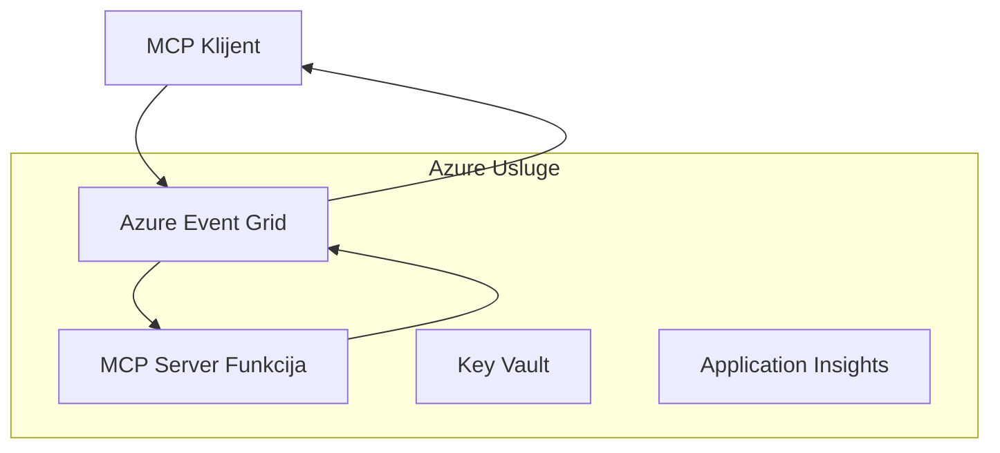
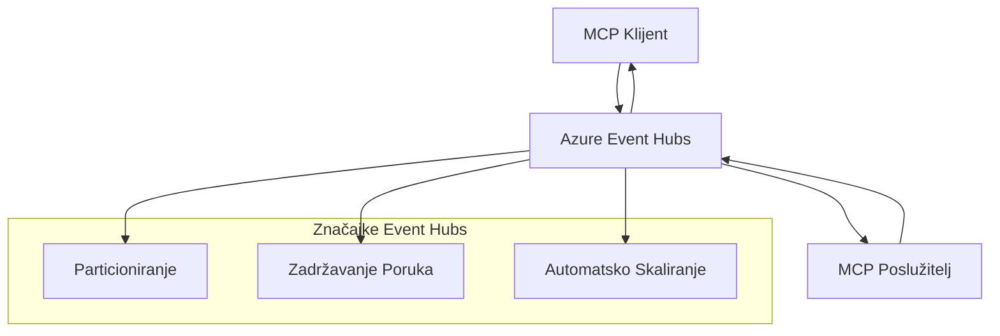

# MCP Prilagođeni Transporti - Vodič za Naprednu Implementaciju

Protokol konteksta modela (MCP) omogućava prilagođene implementacije transporta za
specijalizirana okruženja. Ovaj napredni vodič istražuje Azure Event Grid i
Azure Event Hubs kao arhitektonske uzorke. Oni nisu standardni MCP transporti
i zahtijevaju da se obje krajnje točke slažu s prilagođenim mapiranjem.

> **MCP `2026-07-28` obim:** trenutni protokol nema sesije na razini protokola,
> tako da se prilagođeni transporti ne smiju oslanjati na afinitet sesije ili
> redoslijed po sesiji. Zaglavlja `Mcp-Method` i uvjetno `Mcp-Name`
> zahtjevi su standardnog Streamable HTTP transporta; ne-HTTP transport
> treba ekvivalentno, izričito dogovoreno mapiranje ako posrednici moraju usmjeravati
> bez dekodiranja JSON-RPC tijela. Pogledajte
> [Što se promijenilo u MCP-u: Specifikacija 2026-07-28](../../01-CoreConcepts/mcp-2026-07-28.md).

## Uvod

Standardni MCP transporti su stdio i Streamable HTTP. Neka enterprise
okruženja koriste prilagođeno mapiranje za integraciju s postojećom infrastrukturom
za slanje poruka, no to može smanjiti interoperabilnost s MCP hostovima i
SDK-ovima koji implementiraju samo standardne transporte.

Ova lekcija primjenjuje bezdržavne zahtjeve MCP specifikacije
`2026-07-28` na Azure servise za razmjenu poruka i utvrđene enterprise integracijske
uzorke.

### **Arhitektura MCP Transporta**

**Iz MCP specifikacije `2026-07-28`:**

- **Standardni Transporti**: stdio i Streamable HTTP
- **Prilagođeni Transporti**: Opcionalna, implementacijski specifična mapiranja dogovorena od
    obje krajnje točke
- **Format Poruke**: JSON-RPC 2.0 s MCP-specifičnim proširenjima
- **Samostalni Zahtjevi**: Nema sesije protokola ili ručnog rukovanja za prijenos stanja između zahtjeva
    za prijenos stanja između zahtjeva

## Ciljevi Učenja

Do kraja ove napredne lekcije moći ćete:

- **Razumjeti Zahtjeve Prilagođenog Transporta**: Implementirati MCP protokol preko bilo kojeg transportnog sloja uz održavanje sukladnosti
- **Izgraditi Azure Event Grid Transport**: Kreirati MCP servere vođene događajima koristeći Azure Event Grid za skalabilnost bez servera
- **Implementirati Azure Event Hubs Transport**: Dizajnirati MCP rješenja velike propusnosti koristeći Azure Event Hubs za streaming u stvarnom vremenu
- **Primijeniti Enterprise Uzorke**: Integrirati prilagođene transporte s postojećom Azure infrastrukturom i sigurnosnim modelima
- **Rukovati Pouzdanošću Transporta**: Implementirati trajnost poruka, redoslijed i rukovanje pogreškama za enterprise scenarije
- **Optimizirati Performanse**: Dizajnirati transportna rješenja za skalabilnost, latenciju i zahtjeve propusnosti

## **Zahtjevi Transporta**

### **Osnovni Zahtjevi za MCP `2026-07-28`**

```yaml
Message Protocol:
  format: "JSON-RPC 2.0 with MCP extensions"
    correlation: "Match responses to requests by JSON-RPC id"
    state: "Each request must be self-contained"
  
Transport Layer:
  reliability: "Transport MUST handle connection failures gracefully"
  security: "Transport MUST support secure communication"
    identification: "Carry protocol version, capabilities, and identity per request"
  
Custom Transport:
    compliance: "Map the selected MCP revision without adding session assumptions"
  extensibility: "MAY add transport-specific features"
    interoperability: "Both endpoints MUST agree on the custom mapping"
```

## **Implementacija Azure Event Grid Transporta**

Azure Event Grid pruža uslugu usmjeravanja događaja bez poslužitelja idealnu za arhitekture MCP vođene događajima. Ova implementacija prikazuje kako izgraditi skalabilne, slabo povezane MCP sustave.

### **Pregled Arhitekture**



### **Implementacija u C# - Event Grid Transport**

```csharp
using Azure.Messaging.EventGrid;
using Microsoft.Extensions.Azure;
using System.Text.Json;

public class EventGridMcpTransport : IMcpTransport
{
    private readonly EventGridPublisherClient _publisher;
    private readonly string _topicEndpoint;
    private readonly string _clientId;
    
    public EventGridMcpTransport(string topicEndpoint, string accessKey, string clientId)
    {
        _publisher = new EventGridPublisherClient(
            new Uri(topicEndpoint), 
            new AzureKeyCredential(accessKey));
        _topicEndpoint = topicEndpoint;
        _clientId = clientId;
    }
    
    public async Task SendMessageAsync(McpMessage message)
    {
        var eventGridEvent = new EventGridEvent(
            subject: $"mcp/{_clientId}",
            eventType: "MCP.MessageReceived",
            dataVersion: "1.0",
            data: JsonSerializer.Serialize(message))
        {
            Id = Guid.NewGuid().ToString(),
            EventTime = DateTimeOffset.UtcNow
        };
        
        await _publisher.SendEventAsync(eventGridEvent);
    }
    
    public async Task<McpMessage> ReceiveMessageAsync(CancellationToken cancellationToken)
    {
        // Event Grid is push-based, so implement webhook receiver
        // This would typically be handled by Azure Functions trigger
        throw new NotImplementedException("Use EventGridTrigger in Azure Functions");
    }
}

// Azure Function for receiving Event Grid events
[FunctionName("McpEventGridReceiver")]
public async Task<IActionResult> HandleEventGridMessage(
    [EventGridTrigger] EventGridEvent eventGridEvent,
    ILogger log)
{
    try
    {
        var mcpMessage = JsonSerializer.Deserialize<McpMessage>(
            eventGridEvent.Data.ToString());
        
        // Process MCP message
        var response = await _mcpServer.ProcessMessageAsync(mcpMessage);
        
        // Send response back via Event Grid
        await _transport.SendMessageAsync(response);
        
        return new OkResult();
    }
    catch (Exception ex)
    {
        log.LogError(ex, "Error processing Event Grid MCP message");
        return new BadRequestResult();
    }
}
```

### **Implementacija u TypeScript - Event Grid Transport**

```typescript
import { EventGridPublisherClient, AzureKeyCredential } from "@azure/eventgrid";
import { McpTransport, McpMessage } from "./mcp-types";

export class EventGridMcpTransport implements McpTransport {
    private publisher: EventGridPublisherClient;
    private clientId: string;
    
    constructor(
        private topicEndpoint: string,
        private accessKey: string,
        clientId: string
    ) {
        this.publisher = new EventGridPublisherClient(
            topicEndpoint,
            new AzureKeyCredential(accessKey)
        );
        this.clientId = clientId;
    }
    
    async sendMessage(message: McpMessage): Promise<void> {
        const event = {
            id: crypto.randomUUID(),
            source: `mcp-client-${this.clientId}`,
            type: "MCP.MessageReceived",
            time: new Date(),
            data: message
        };
        
        await this.publisher.sendEvents([event]);
    }
    
    // Primanje pokrenuto događajem putem Azure Functions
    onMessage(handler: (message: McpMessage) => Promise<void>): void {
        // Implementacija bi koristila Azure Functions Event Grid okidač
        // Ovo je konceptualno sučelje za webhook primatelj
    }
}

// Implementacija u Azure Functions
import { app, InvocationContext, EventGridEvent } from "@azure/functions";

app.eventGrid("mcpEventGridHandler", {
    handler: async (event: EventGridEvent, context: InvocationContext) => {
        try {
            const mcpMessage = event.data as McpMessage;
            
            // Obradi MCP poruku
            const response = await mcpServer.processMessage(mcpMessage);
            
            // Pošalji odgovor putem Event Grid-a
            await transport.sendMessage(response);
            
        } catch (error) {
            context.error("Error processing MCP message:", error);
            throw error;
        }
    }
});
```

### **Implementacija u Python - Event Grid Transport**

```python
from azure.eventgrid import EventGridPublisherClient, EventGridEvent
from azure.core.credentials import AzureKeyCredential
import asyncio
import json
from typing import Callable, Optional
import uuid
from datetime import datetime

class EventGridMcpTransport:
    def __init__(self, topic_endpoint: str, access_key: str, client_id: str):
        self.client = EventGridPublisherClient(
            topic_endpoint, 
            AzureKeyCredential(access_key)
        )
        self.client_id = client_id
        self.message_handler: Optional[Callable] = None
    
    async def send_message(self, message: dict) -> None:
        """Send MCP message via Event Grid"""
        event = EventGridEvent(
            data=message,
            subject=f"mcp/{self.client_id}",
            event_type="MCP.MessageReceived",
            data_version="1.0"
        )
        
        await self.client.send(event)
    
    def on_message(self, handler: Callable[[dict], None]) -> None:
        """Register message handler for incoming events"""
        self.message_handler = handler

# Implementacija Azure funkcija
import azure.functions as func
import logging

def main(event: func.EventGridEvent) -> None:
    """Azure Functions Event Grid trigger for MCP messages"""
    try:
        # Parsiraj MCP poruku iz Event Grid događaja
        mcp_message = json.loads(event.get_body().decode('utf-8'))
        
        # Obradi MCP poruku
        response = process_mcp_message(mcp_message)
        
        # Pošalji odgovor nazad putem Event Grid-a
        # (Implementacija bi kreirala novog Event Grid klijenta)
        
    except Exception as e:
        logging.error(f"Error processing MCP Event Grid message: {e}")
        raise
```

## **Implementacija Azure Event Hubs Transporta**

Azure Event Hubs pruža mogućnosti streaminga u stvarnom vremenu velike propusnosti za MCP scenarije koji zahtijevaju nisku latenciju i velik volumen poruka.

### **Pregled Arhitekture**




### **C# implementacija - Event Hubs transport**

```csharp
using Azure.Messaging.EventHubs;
using Azure.Messaging.EventHubs.Producer;
using Azure.Messaging.EventHubs.Consumer;
using System.Text;

public class EventHubsMcpTransport : IMcpTransport, IDisposable
{
    private readonly EventHubProducerClient _producer;
    private readonly EventHubConsumerClient _consumer;
    private readonly string _consumerGroup;
    private readonly CancellationTokenSource _cancellationTokenSource;
    
    public EventHubsMcpTransport(
        string connectionString, 
        string eventHubName,
        string consumerGroup = "$Default")
    {
        _producer = new EventHubProducerClient(connectionString, eventHubName);
        _consumer = new EventHubConsumerClient(
            consumerGroup, 
            connectionString, 
            eventHubName);
        _consumerGroup = consumerGroup;
        _cancellationTokenSource = new CancellationTokenSource();
    }
    
    public async Task SendMessageAsync(McpMessage message)
    {
        var messageBody = JsonSerializer.Serialize(message);
        var eventData = new EventData(Encoding.UTF8.GetBytes(messageBody));
        
        // Add MCP-specific properties
        eventData.Properties.Add("MessageType", message.Method ?? "response");
        eventData.Properties.Add("MessageId", message.Id);
        eventData.Properties.Add("Timestamp", DateTimeOffset.UtcNow);
        
        await _producer.SendAsync(new[] { eventData });
    }
    
    public async Task StartReceivingAsync(
        Func<McpMessage, Task> messageHandler)
    {
        await foreach (PartitionEvent partitionEvent in _consumer.ReadEventsAsync(
            _cancellationTokenSource.Token))
        {
            try
            {
                var messageBody = Encoding.UTF8.GetString(
                    partitionEvent.Data.EventBody.ToArray());
                var mcpMessage = JsonSerializer.Deserialize<McpMessage>(messageBody);
                
                await messageHandler(mcpMessage);
            }
            catch (Exception ex)
            {
                // Handle deserialization or processing errors
                Console.WriteLine($"Error processing message: {ex.Message}");
            }
        }
    }
    
    public void Dispose()
    {
        _cancellationTokenSource?.Cancel();
        _producer?.DisposeAsync().AsTask().Wait();
        _consumer?.DisposeAsync().AsTask().Wait();
        _cancellationTokenSource?.Dispose();
    }
}
```

### **TypeScript implementacija - Event Hubs transport**

```typescript
import { 
    EventHubProducerClient, 
    EventHubConsumerClient, 
    EventData 
} from "@azure/event-hubs";

export class EventHubsMcpTransport implements McpTransport {
    private producer: EventHubProducerClient;
    private consumer: EventHubConsumerClient;
    private isReceiving = false;
    
    constructor(
        private connectionString: string,
        private eventHubName: string,
        private consumerGroup: string = "$Default"
    ) {
        this.producer = new EventHubProducerClient(
            connectionString, 
            eventHubName
        );
        this.consumer = new EventHubConsumerClient(
            consumerGroup,
            connectionString,
            eventHubName
        );
    }
    
    async sendMessage(message: McpMessage): Promise<void> {
        const eventData: EventData = {
            body: JSON.stringify(message),
            properties: {
                messageType: message.method || "response",
                messageId: message.id,
                timestamp: new Date().toISOString()
            }
        };
        
        await this.producer.sendBatch([eventData]);
    }
    
    async startReceiving(
        messageHandler: (message: McpMessage) => Promise<void>
    ): Promise<void> {
        if (this.isReceiving) return;
        
        this.isReceiving = true;
        
        const subscription = this.consumer.subscribe({
            processEvents: async (events, context) => {
                for (const event of events) {
                    try {
                        const messageBody = event.body as string;
                        const mcpMessage: McpMessage = JSON.parse(messageBody);
                        
                        await messageHandler(mcpMessage);
                        
                        // Ažuriraj kontrolnu točku za isporuku barem jednom
                        await context.updateCheckpoint(event);
                    } catch (error) {
                        console.error("Error processing Event Hubs message:", error);
                    }
                }
            },
            processError: async (err, context) => {
                console.error("Event Hubs error:", err);
            }
        });
    }
    
    async close(): Promise<void> {
        this.isReceiving = false;
        await this.producer.close();
        await this.consumer.close();
    }
}
```

### **Python implementacija - Event Hubs transport**

```python
from azure.eventhub import EventHubProducerClient, EventHubConsumerClient
from azure.eventhub import EventData
import json
import asyncio
from typing import Callable, Dict, Any
import logging

class EventHubsMcpTransport:
    def __init__(
        self, 
        connection_string: str, 
        eventhub_name: str,
        consumer_group: str = "$Default"
    ):
        self.producer = EventHubProducerClient.from_connection_string(
            connection_string, 
            eventhub_name=eventhub_name
        )
        self.consumer = EventHubConsumerClient.from_connection_string(
            connection_string,
            consumer_group=consumer_group,
            eventhub_name=eventhub_name
        )
        self.is_receiving = False
    
    async def send_message(self, message: Dict[str, Any]) -> None:
        """Send MCP message via Event Hubs"""
        event_data = EventData(json.dumps(message))
        
        # Dodajte svojstva specifična za MCP
        event_data.properties = {
            "messageType": message.get("method", "response"),
            "messageId": message.get("id"),
            "timestamp": "2025-01-14T10:30:00Z"  # Koristite stvarni vremenski žig
        }
        
        async with self.producer:
            event_data_batch = await self.producer.create_batch()
            event_data_batch.add(event_data)
            await self.producer.send_batch(event_data_batch)
    
    async def start_receiving(
        self, 
        message_handler: Callable[[Dict[str, Any]], None]
    ) -> None:
        """Start receiving MCP messages from Event Hubs"""
        if self.is_receiving:
            return
        
        self.is_receiving = True
        
        async with self.consumer:
            await self.consumer.receive(
                on_event=self._on_event_received(message_handler),
                starting_position="-1"  # Počnite od početka
            )
    
    def _on_event_received(self, handler: Callable):
        """Internal event handler wrapper"""
        async def handle_event(partition_context, event):
            try:
                # Parsirajte MCP poruku iz Event Hubs događaja
                message_body = event.body_as_str(encoding='UTF-8')
                mcp_message = json.loads(message_body)
                
                # Obradite MCP poruku
                await handler(mcp_message)
                
                # Ažurirajte kontrolnu točku za dostavu barem jednom
                await partition_context.update_checkpoint(event)
                
            except Exception as e:
                logging.error(f"Error processing Event Hubs message: {e}")
        
        return handle_event
    
    async def close(self) -> None:
        """Clean up transport resources"""
        self.is_receiving = False
        await self.producer.close()
        await self.consumer.close()
```

## **Napredni obrasci transporta**

### **Otpornost i pouzdanost poruka**

```csharp
// Implementing message durability with retry logic
public class ReliableTransportWrapper : IMcpTransport
{
    private readonly IMcpTransport _innerTransport;
    private readonly RetryPolicy _retryPolicy;
    
    public async Task SendMessageAsync(McpMessage message)
    {
        await _retryPolicy.ExecuteAsync(async () =>
        {
            try
            {
                await _innerTransport.SendMessageAsync(message);
            }
            catch (TransportException ex) when (ex.IsRetryable)
            {
                // Log and retry
                throw;
            }
        });
    }
}
```

### **Integracija sigurnosti transporta**

```csharp
// Integrating Azure Key Vault for transport security
public class SecureTransportFactory
{
    private readonly SecretClient _keyVaultClient;
    
    public async Task<IMcpTransport> CreateEventGridTransportAsync()
    {
        var accessKey = await _keyVaultClient.GetSecretAsync("EventGridAccessKey");
        var topicEndpoint = await _keyVaultClient.GetSecretAsync("EventGridTopic");
        
        return new EventGridMcpTransport(
            topicEndpoint.Value.Value,
            accessKey.Value.Value,
            Environment.MachineName
        );
    }
}
```

### **Praćenje i vidljivost transporta**

```csharp
// Adding telemetry to custom transports
public class ObservableTransport : IMcpTransport
{
    private readonly IMcpTransport _transport;
    private readonly ILogger _logger;
    private readonly TelemetryClient _telemetryClient;
    
    public async Task SendMessageAsync(McpMessage message)
    {
        using var activity = Activity.StartActivity("MCP.Transport.Send");
        activity?.SetTag("transport.type", "EventGrid");
        activity?.SetTag("message.method", message.Method);
        
        var stopwatch = Stopwatch.StartNew();
        
        try
        {
            await _transport.SendMessageAsync(message);
            
            _telemetryClient.TrackDependency(
                "EventGrid",
                "SendMessage",
                DateTime.UtcNow.Subtract(stopwatch.Elapsed),
                stopwatch.Elapsed,
                true
            );
        }
        catch (Exception ex)
        {
            _telemetryClient.TrackException(ex);
            throw;
        }
    }
}
```

## **Scenariji integracije u poduzeću**

### **Scenarij 1: Distribuirana MCP obrada**

Korištenje Azure Event Grid za raspodjelu MCP zahtjeva preko više čvorova za obradu:

```yaml
Architecture:
  - MCP Client sends requests to Event Grid topic
  - Multiple Azure Functions subscribe to process different tool types
  - Results aggregated and returned via separate response topic
  
Benefits:
  - Horizontal scaling based on message volume
  - Fault tolerance through redundant processors
  - Cost optimization with serverless compute
```

### **Scenarij 2: MCP streaming u stvarnom vremenu**

Korištenje Azure Event Hubs za visokofrekventne MCP interakcije:

```yaml
Architecture:
  - MCP Client streams continuous requests via Event Hubs
  - Stream Analytics processes and routes messages
  - Multiple consumers handle different aspect of processing
  
Benefits:
  - Low latency for real-time scenarios
  - High throughput for batch processing
  - Built-in partitioning for parallel processing
```

### **Scenarij 3: Hibridna transportna arhitektura**

Kombinacija više transporta za različite slučajeve uporabe:

```csharp
public class HybridMcpTransport : IMcpTransport
{
    private readonly IMcpTransport _realtimeTransport; // Event Hubs
    private readonly IMcpTransport _batchTransport;    // Event Grid
    private readonly IMcpTransport _fallbackTransport; // HTTP Streaming
    
    public async Task SendMessageAsync(McpMessage message)
    {
        // Route based on message characteristics
        var transport = message.Method switch
        {
            "tools/call" when IsRealtime(message) => _realtimeTransport,
            "resources/read" when IsBatch(message) => _batchTransport,
            _ => _fallbackTransport
        };
        
        await transport.SendMessageAsync(message);
    }
}
```

## **Optimizacija performansi**

### **Serijsko slanje poruka za Event Grid**

```csharp
public class BatchingEventGridTransport : IMcpTransport
{
    private readonly List<McpMessage> _messageBuffer = new();
    private readonly Timer _flushTimer;
    private const int MaxBatchSize = 100;
    
    public async Task SendMessageAsync(McpMessage message)
    {
        lock (_messageBuffer)
        {
            _messageBuffer.Add(message);
            
            if (_messageBuffer.Count >= MaxBatchSize)
            {
                _ = Task.Run(FlushMessages);
            }
        }
    }
    
    private async Task FlushMessages()
    {
        List<McpMessage> toSend;
        lock (_messageBuffer)
        {
            toSend = new List<McpMessage>(_messageBuffer);
            _messageBuffer.Clear();
        }
        
        if (toSend.Any())
        {
            var events = toSend.Select(CreateEventGridEvent);
            await _publisher.SendEventsAsync(events);
        }
    }
}
```

### **Strategija particioniranja za Event Hubs**

```csharp
public class PartitionedEventHubsTransport : IMcpTransport
{
    public async Task SendMessageAsync(McpMessage message)
    {
        // Partition by client ID for session affinity
        var partitionKey = ExtractClientId(message);
        
        var eventData = new EventData(JsonSerializer.SerializeToUtf8Bytes(message))
        {
            PartitionKey = partitionKey
        };
        
        await _producer.SendAsync(new[] { eventData });
    }
}
```

## **Testiranje prilagođenih transporta**

### **Jedinično testiranje s test duplikatima**

```csharp
[Test]
public async Task EventGridTransport_SendMessage_PublishesCorrectEvent()
{
    // Arrange
    var mockPublisher = new Mock<EventGridPublisherClient>();
    var transport = new EventGridMcpTransport(mockPublisher.Object);
    var message = new McpMessage { Method = "tools/list", Id = "test-123" };
    
    // Act
    await transport.SendMessageAsync(message);
    
    // Assert
    mockPublisher.Verify(
        x => x.SendEventAsync(
            It.Is<EventGridEvent>(e => 
                e.EventType == "MCP.MessageReceived" &&
                e.Subject == "mcp/test-client"
            )
        ),
        Times.Once
    );
}
```

### **Integracijsko testiranje s Azure test kontejnerima**

```csharp
[Test]
public async Task EventHubsTransport_IntegrationTest()
{
    // Using Testcontainers for integration testing
    var eventHubsContainer = new EventHubsContainer()
        .WithEventHub("test-hub");
    
    await eventHubsContainer.StartAsync();
    
    var transport = new EventHubsMcpTransport(
        eventHubsContainer.GetConnectionString(),
        "test-hub"
    );
    
    // Test message round-trip
    var sentMessage = new McpMessage { Method = "test", Id = "123" };
    McpMessage receivedMessage = null;
    
    await transport.StartReceivingAsync(msg => {
        receivedMessage = msg;
        return Task.CompletedTask;
    });
    
    await transport.SendMessageAsync(sentMessage);
    await Task.Delay(1000); // Allow for message processing
    
    Assert.That(receivedMessage?.Id, Is.EqualTo("123"));
}
```

## **Najbolje prakse i smjernice**

### **Načela dizajna transporta**

1. **Idempotentnost**: Osigurajte da je obrada poruka idempotentna za rukovanje duplikatima
2. **Rukovanje pogreškama**: Implementirajte sveobuhvatno rukovanje pogreškama i redove mrtvih poruka
3. **Praćenje**: Dodajte detaljnu telemetriju i provjere zdravlja
4. **Sigurnost**: Koristite upravljane identitete i pristup s najmanjim privilegijama
5. **Performanse**: Dizajnirajte prema vašim specifičnim zahtjevima za latenciju i propusnost

### **Preporuke specifične za Azure**

1. **Koristite upravljani identitet**: Izbjegavajte connection stringove u produkciji
2. **Implementirajte prekidače kruga**: Zaštitite se od prekida Azure usluga
3. **Pratite troškove**: Pratite volumen poruka i troškove obrade
4. **Planirajte skaliranje**: Rano dizajnirajte strategije particioniranja i skaliranja
5. **Temeljito testirajte**: Koristite Azure DevTest Labs za opsežno testiranje

## **Zaključak**

Prilagođeni MCP transporti omogućuju moćne enterprise scenarije koristeći Azure messaging servise. Implementacijom Event Grid ili Event Hubs transporta možete izgraditi skalabilna, pouzdana MCP rješenja koja se besprijekorno integriraju s postojećom Azure infrastrukturom.

Primjeri dane upute pokazuju proizvodno spremne obrasce za implementaciju prilagođenih transporta uz održavanje usklađenosti s MCP protokolom i Azure najboljim praksama.

## **Dodatni resursi**

- [MCP specifikacija 2026-07-28](https://modelcontextprotocol.io/specification/2026-07-28/)
- [Dokumentacija Azure Event Grid](https://docs.microsoft.com/azure/event-grid/)
- [Dokumentacija Azure Event Hubs](https://docs.microsoft.com/azure/event-hubs/)
- [Azure Functions Event Grid trigger](https://docs.microsoft.com/azure/azure-functions/functions-bindings-event-grid)
- [Azure SDK za .NET](https://github.com/Azure/azure-sdk-for-net)
- [Azure SDK za TypeScript](https://github.com/Azure/azure-sdk-for-js)
- [Azure SDK za Python](https://github.com/Azure/azure-sdk-for-python)

---

> *Ovaj vodič fokusira se na prilagođene arhitektonske obrasce. Validirajte protokol

> ponašanje u odnosu na [MCP Specification 2026-07-28](https://modelcontextprotocol.io/specification/2026-07-28/),
> i provjerite Azure uporabu u odnosu na vaše zahtjeve i ograničenja usluge.*


## Što slijedi
- [6. Doprinosi zajednice](../../06-CommunityContributions/README.md)

---

<!-- CO-OP TRANSLATOR DISCLAIMER START -->
**Napomena**:
Ovaj dokument je preveden korištenjem AI prevoditeljskog servisa [Co-op Translator](https://github.com/Azure/co-op-translator). Iako težimo točnosti, imajte na umu da automatski prijevodi mogu sadržavati greške ili netočnosti. Izvorni dokument na izvornom jeziku treba smatrati autoritativnim izvorom. Za važne informacije preporuča se profesionalni ljudski prijevod. Nismo odgovorni za bilo kakva nesporazumevanja ili pogrešne interpretacije koje proizlaze iz korištenja ovog prijevoda.
<!-- CO-OP TRANSLATOR DISCLAIMER END -->