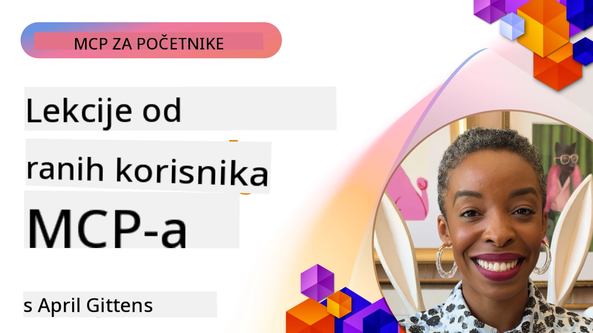

# 🌟 Lekcije od Prvih Korisnika

[](https://youtu.be/jds7dSmNptE)

_(Kliknite na gornju sliku za pregled videa ove lekcije)_

## 🎯 Što ovaj modul pokriva

Ovaj modul istražuje kako stvarne organizacije i programeri koriste Model Context Protocol (MCP) za rješavanje stvarnih izazova i pokretanje inovacija. Kroz detaljne studije slučaja, praktične projekte i primjere, otkrit ćete kako MCP omogućava sigurnu, skalabilnu integraciju AI-a koja povezuje jezične modele, alate i podatke poduzeća.

### 📚 Pogledajte MCP u akciji

Želite vidjeti ove principe primijenjene na alate spremne za proizvodnju? Pogledajte naš [**10 Microsoft MCP Servera Koji Transformiraju Produktivnost Programera**](microsoft-mcp-servers.md), koji prikazuje stvarne Microsoft MCP servere koje možete koristiti već danas.

## Pregled

Ova lekcija istražuje kako su prvi korisnici iskoristili Model Context Protocol (MCP) za rješavanje stvarnih izazova i pokretanje inovacija u različitim industrijama. Kroz detaljne studije slučaja i praktične projekte vidjet ćete kako MCP omogućava standardiziranu, sigurnu i skalabilnu integraciju AI-a—povezujući velike jezične modele, alate i podatke poduzeća u jedinstvenom okviru. Steći ćete praktično iskustvo u dizajniranju i izradi rješenja temeljenih na MCP-u, naučiti provjerene obrasce implementacije te otkriti najbolje prakse za postavljanje MCP-a u produkcijska okruženja. Lekcija također ističe nove trendove, buduće smjerove i otvorene izvore koji vam pomažu da ostanete na čelu MCP tehnologije i njezinog neprekidno razvijajućeg se ekosustava.

## Ciljevi učenja

- Analizirati stvarne implementacije MCP-a u različitim industrijama
- Dizajnirati i izgraditi kompletne aplikacije temeljene na MCP-u
- Istražiti nove trendove i buduće smjerove u MCP tehnologiji
- Primijeniti najbolje prakse u stvarnim razvojnim scenarijima

## Stvarne implementacije MCP-a

### Studija slučaja 1: Automatizacija korisničke podrške u poduzećima

Multinacionalna korporacija implementirala je rješenje temeljeno na MCP-u za standardizaciju AI interakcija unutar njihovih sustava korisničke podrške. To im je omogućilo:

- Kreiranje jedinstvenog sučelja za više dobavljača velikih jezičnih modela (LLM)
- Održavanje konzistentnog upravljanja promptovima unutar odjela
- Implementaciju snažnih sigurnosnih i usklađenih kontrola
- Lako prebacivanje između različitih AI modela prema specifičnim potrebama

**Tehnička implementacija:**

```python
# Implementacija Python MCP servera za korisničku podršku
import logging
import asyncio
from modelcontextprotocol import create_server, ServerConfig
from modelcontextprotocol.server import MCPServer
from modelcontextprotocol.transports import create_http_transport
from modelcontextprotocol.resources import ResourceDefinition
from modelcontextprotocol.prompts import PromptDefinition
from modelcontextprotocol.tool import ToolDefinition

# Konfiguriraj zapisivanje logova
logging.basicConfig(level=logging.INFO)

async def main():
    # Kreiraj konfiguraciju servera
    config = ServerConfig(
        name="Enterprise Customer Support Server",
        version="1.0.0",
        description="MCP server for handling customer support inquiries"
    )
    
    # Inicijaliziraj MCP server
    server = create_server(config)
    
    # Registriraj resurse baze znanja
    server.resources.register(
        ResourceDefinition(
            name="customer_kb",
            description="Customer knowledge base documentation"
        ),
        lambda params: get_customer_documentation(params)
    )
    
    # Registriraj predloške upita
    server.prompts.register(
        PromptDefinition(
            name="support_template",
            description="Templates for customer support responses"
        ),
        lambda params: get_support_templates(params)
    )
    
    # Registriraj alate za podršku
    server.tools.register(
        ToolDefinition(
            name="ticketing",
            description="Create and update support tickets"
        ),
        handle_ticketing_operations
    )
    
    # Pokreni server s HTTP transportom
    transport = create_http_transport(port=8080)
    await server.run(transport)

if __name__ == "__main__":
    asyncio.run(main())
```

**Rezultati:** 30% smanjenje troškova modela, 45% poboljšanje u dosljednosti odgovora, te poboljšana usklađenost u globalnim operacijama.

### Studija slučaja 2: Dijagnostički asistent u zdravstvu

Zdravstveni pružatelj usluga razvio je MCP infrastrukturu za integraciju više specijaliziranih medicinskih AI modela, pritom osiguravajući zaštitu osjetljivih podataka pacijenata:

- Neprimjetno prebacivanje između općih i specijalističkih medicinskih modela
- Stroge kontrole privatnosti i audita
- Integracija s postojećim sustavima Elektroničkih zdravstvenih kartona (EHR)
- Dosljedno upravljanje promptovima za medicinsku terminologiju

**Tehnička implementacija:**

```csharp
// C# MCP host application implementation in healthcare application
using Microsoft.Extensions.DependencyInjection;
using ModelContextProtocol.SDK.Client;
using ModelContextProtocol.SDK.Security;
using ModelContextProtocol.SDK.Resources;

public class DiagnosticAssistant
{
    private readonly MCPHostClient _mcpClient;
    private readonly PatientContext _patientContext;
    
    public DiagnosticAssistant(PatientContext patientContext)
    {
        _patientContext = patientContext;
        
        // Configure MCP client with healthcare-specific settings
        var clientOptions = new ClientOptions
        {
            Name = "Healthcare Diagnostic Assistant",
            Version = "1.0.0",
            Security = new SecurityOptions
            {
                Encryption = EncryptionLevel.Medical,
                AuditEnabled = true
            }
        };
        
        _mcpClient = new MCPHostClientBuilder()
            .WithOptions(clientOptions)
            .WithTransport(new HttpTransport("https://healthcare-mcp.example.org"))
            .WithAuthentication(new HIPAACompliantAuthProvider())
            .Build();
    }
    
    public async Task<DiagnosticSuggestion> GetDiagnosticAssistance(
        string symptoms, string patientHistory)
    {
        // Create request with appropriate resources and tool access
        var resourceRequest = new ResourceRequest
        {
            Name = "patient_records",
            Parameters = new Dictionary<string, object>
            {
                ["patientId"] = _patientContext.PatientId,
                ["requestingProvider"] = _patientContext.ProviderId
            }
        };
        
        // Request diagnostic assistance using appropriate prompt
        var response = await _mcpClient.SendPromptRequestAsync(
            promptName: "diagnostic_assistance",
            parameters: new Dictionary<string, object>
            {
                ["symptoms"] = symptoms,
                patientHistory = patientHistory,
                relevantGuidelines = _patientContext.GetRelevantGuidelines()
            });
            
        return DiagnosticSuggestion.FromMCPResponse(response);
    }
}
```

**Rezultati:** Poboljšani dijagnostički prijedlozi za liječnike uz potpuno poštivanje HIPAA propisa i značajno smanjenje prebacivanja konteksta između sustava.

### Studija slučaja 3: Analiza rizika u financijskim uslugama

Financijska institucija implementirala je MCP za standardizaciju procesa analize rizika u različitim odjelima:

- Kreiranje jedinstvenog sučelja za modele kreditnog rizika, otkrivanja prijevara i rizika investicija
- Implementacija strogih kontrola pristupa i verzioniranja modela
- Osiguravanje auditabilnosti svih AI preporuka
- Održavanje dosljednog formatiranja podataka u različitim sustavima

**Tehnička implementacija:**

```java
// Java MCP poslužitelj za procjenu financijskog rizika
import org.mcp.server.*;
import org.mcp.security.*;

public class FinancialRiskMCPServer {
    public static void main(String[] args) {
        // Kreiraj MCP poslužitelj s funkcijama financijske usklađenosti
        MCPServer server = new MCPServerBuilder()
            .withModelProviders(
                new ModelProvider("risk-assessment-primary", new AzureOpenAIProvider()),
                new ModelProvider("risk-assessment-audit", new LocalLlamaProvider())
            )
            .withPromptTemplateDirectory("./compliance/templates")
            .withAccessControls(new SOCCompliantAccessControl())
            .withDataEncryption(EncryptionStandard.FINANCIAL_GRADE)
            .withVersionControl(true)
            .withAuditLogging(new DatabaseAuditLogger())
            .build();
            
        server.addRequestValidator(new FinancialDataValidator());
        server.addResponseFilter(new PII_RedactionFilter());
        
        server.start(9000);
        
        System.out.println("Financial Risk MCP Server running on port 9000");
    }
}
```

**Rezultati:** Poboljšana usklađenost s propisima, 40% brži ciklusi implementacije modela, te poboljšana dosljednost procjene rizika u svim odjelima.

### Studija slučaja 4: Microsoft Playwright MCP Server za automatizaciju preglednika

Microsoft je razvio [Playwright MCP server](https://github.com/microsoft/playwright-mcp) koji omogućava sigurnu, standardiziranu automatizaciju preglednika putem Model Context Protocol-a. Ovaj server spreman za proizvodnju omogućava AI agentima i velikim jezičnim modelima da upravljaju web preglednicima na kontroliran, auditan i proširiv način—omogućavajući scenarije poput automatiziranog web testiranja, ekstrakcije podataka i end-to-end radnih tokova.

> **🎯 Alat spreman za proizvodnju**
> 
> Ova studija slučaja prikazuje pravi MCP server koji možete koristiti danas! Saznajte više o Playwright MCP Serveru i još 9 drugih Microsoft MCP servera spremnih za proizvodnju u našem [**Microsoft MCP Servers Guide**](microsoft-mcp-servers.md#8--playwright-mcp-server).

**Ključne značajke:**
- Izlaže mogućnosti automatizacije preglednika (navigacija, ispunjavanje obrazaca, snimanje zaslona itd.) kao MCP alate
- Implementira stroge kontrole pristupa i sandbox okruženje za sprječavanje neautoriziranih radnji
- Pruža detaljne zapise audita za sve interakcije s preglednikom
- Podržava integraciju s Azure OpenAI i drugim LLM dobavljačima za agentsku automatizaciju
- Pogoni GitHub Copilotov Coding Agent s mogućnostima pregledavanja weba

**Tehnička implementacija:**

```typescript
// TypeScript: Registracija Playwright alata za automatizaciju preglednika u MCP poslužitelju
import { createServer, ToolDefinition } from 'modelcontextprotocol';
import { launch } from 'playwright';

const server = createServer({
  name: 'Playwright MCP Server',
  version: '1.0.0',
  description: 'MCP server for browser automation using Playwright'
});

// Registrirajte alat za navigaciju do URL-a i hvatanje snimke zaslona
server.tools.register(
  new ToolDefinition({
    name: 'navigate_and_screenshot',
    description: 'Navigate to a URL and capture a screenshot',
    parameters: {
      url: { type: 'string', description: 'The URL to visit' }
    }
  }),
  async ({ url }) => {
    const browser = await launch();
    const page = await browser.newPage();
    await page.goto(url);
    const screenshot = await page.screenshot();
    await browser.close();
    return { screenshot };
  }
);

// Pokrenite MCP poslužitelj
server.listen(8080);
```

**Rezultati:**

- Omogućena sigurna, programabilna automatizacija preglednika za AI agente i LLM-ove
- Smanjen ručni trud u testiranju i poboljšani obuhvat testova za web aplikacije
- Pružena ponovno upotrebljiva, proširiva platforma za integraciju alata temeljenih na preglednicima u poduzećima
- Pokreće mogućnosti pregledavanja weba za GitHub Copilot

**Reference:**

- [Playwright MCP Server GitHub repozitorij](https://github.com/microsoft/playwright-mcp)
- [Microsoft AI i Rješenja za Automatizaciju](https://azure.microsoft.com/en-us/products/ai-services/)

### Studija slučaja 5: Azure MCP – Enterprise razina Model Context Protocola kao uslugom

Azure MCP Server ([https://aka.ms/azmcp](https://aka.ms/azmcp)) je Microsoftova upravljana, enterprise razina implementacija Model Context Protocol-a, dizajnirana za pružanje skalabilnih, sigurnih i usklađenih MCP serverskih funkcionalnosti kao cloud usluge. Azure MCP omogućuje organizacijama brzo postavljanje, upravljanje i integraciju MCP servera s Azure AI, podacima i sigurnosnim uslugama, smanjujući operativne troškove i ubrzavajući prihvaćanje AI tehnologija.

> **🎯 Alat spreman za proizvodnju**
> 
> Ovo je pravi MCP server koji možete koristiti danas! Saznajte više o Microsoft Foundry MCP Serveru u našem [**Microsoft MCP Servers Guide**](microsoft-mcp-servers.md).


- Potpuno upravljano hosting MCP servera s ugrađenim skaliranjem, nadzorom i sigurnošću
- Izvorna integracija s Azure OpenAI, Azure AI Search i drugim Azure uslugama
- Enterprise autentikacija i autorizacija putem Microsoft Entra ID
- Podrška za prilagođene alate, predloške promptova i konektore resursa
- Usklađenost s sigurnosnim i regulatornim zahtjevima za poduzeća

**Tehnička implementacija:**

```yaml
# Example: Azure MCP server deployment configuration (YAML)
apiVersion: mcp.microsoft.com/v1
kind: McpServer
metadata:
  name: enterprise-mcp-server
spec:
  modelProviders:
    - name: azure-openai
      type: AzureOpenAI
      endpoint: https://<your-openai-resource>.openai.azure.com/
      apiKeySecret: <your-azure-keyvault-secret>
  tools:
    - name: document_search
      type: AzureAISearch
      endpoint: https://<your-search-resource>.search.windows.net/
      apiKeySecret: <your-azure-keyvault-secret>
  authentication:
    type: EntraID
    tenantId: <your-tenant-id>
  monitoring:
    enabled: true
    logAnalyticsWorkspace: <your-log-analytics-id>
```

**Rezultati:**  
- Smanjeno vrijeme do vrijednosti u enterprise AI projektima pružanjem spremne, usklađene MCP serverske platforme
- Pojednostavljena integracija LLM-ova, alata i izvora podataka poduzeća
- Poboljšana sigurnost, promatranje i operativna učinkovitost za MCP opterećenja
- Poboljšana kvaliteta koda uz najbolje prakse Azure SDK-a i aktualne obrasce autentikacije

**Reference:**  
- [Azure MCP Dokumentacija](https://aka.ms/azmcp)
- [Azure MCP Server GitHub repozitorij](https://github.com/Azure/azure-mcp)
- [Azure AI usluge](https://azure.microsoft.com/en-us/products/ai-services/)
- [Microsoft MCP Centar](https://mcp.azure.com)

## Studija slučaja 6: NLWeb 
MCP (Model Context Protocol) je novi protokol za chatbote i AI asistente za interakciju s alatima. Svaka NLWeb instanca također je MCP server koji podržava jednu glavnu metodu, ask, koja se koristi za postavljanje pitanja web stranici na prirodnom jeziku. Vraćeni odgovor koristi schema.org, široko korištenu vokabularnu za opisivanje web podataka. Slobodno rečeno, MCP je za NLWeb kao što je Http za HTML. NLWeb kombinira protokole, formate Schema.org i primjere koda kako bi pomogao web mjestima brzo stvoriti ove krajnje točke, koristeći to i za ljude kroz razgovorna sučelja i za strojeve kroz prirodnu interakciju agent-agent.

Postoje dvije odvojene komponente NLWeb-a.
- Protokol, vrlo jednostavan za početak, za sučelje s web mjestom na prirodnom jeziku i format koji koristi json i schema.org za vraćeni odgovor. Pogledajte dokumentaciju o REST API-ju za više detalja.
- Jednostavna implementacija (1) koja koristi postojeću markup strukturu za web stranice koje se mogu apstrahirati kao liste predmeta (proizvoda, recepata, atrakcija, recenzija, itd.). Zajedno s nizom korisničkih sučeljnih widgeta, web mjesta lako pružaju razgovorna sučelja svom sadržaju. Pogledajte dokumentaciju o životnom ciklusu chat upita za više detalja o tome kako to funkcionira.
 
**Reference:**  
- [Azure MCP Dokumentacija](https://aka.ms/azmcp)
- [NLWeb](https://github.com/microsoft/NlWeb)

### Studija slučaja 7: Microsoft Foundry MCP Server – Integracija Enterprise AI Agenta

Microsoft Foundry MCP serveri pokazuju kako MCP može orkestrirati i upravljati AI agentima i radnim tokovima u enterprise okruženjima. Integracijom MCP-a s Microsoft Foundry, organizacije mogu standardizirati interakcije agenata, iskoristiti Foundry-jev sustav upravljanja radnim tokovima te osigurati sigurne i skalabilne implementacije.

> **🎯 Alat spreman za proizvodnju**
> 
> Ovo je pravi MCP server koji možete koristiti danas! Saznajte više o Microsoft Foundry MCP Serveru u našem [**Microsoft MCP Servers Guide**](microsoft-mcp-servers.md#9--microsoft-foundry-mcp-server).

**Ključne značajke:**
- Sveobuhvatan pristup Azure AI ekosustavu, uključujući kataloge modela i upravljanje implementacijama
- Indeksiranje znanja s Azure AI Search za RAG aplikacije
- Alati za evaluaciju performansi AI modela i osiguranje kvalitete
- Integracija s Microsoft Foundry Catalog i Labs za najnovije istraživačke modele
- Upravljanje agentima i evaluacijske mogućnosti za produkcijske scenarije

**Rezultati:**
- Brzo prototipiranje i robustan nadzor radnih tokova AI agenata
- Neprimjetna integracija s Azure AI uslugama za napredne scenarije
- Jedinstveno sučelje za izgradnju, implementaciju i nadzor agentnih cijevi
- Poboljšana sigurnost, usklađenost i operativna učinkovitost za poduzeća
- Ubrzano prihvaćanje AI-a uz održavanje kontrole složenih procesa vođenih agentima

**Reference:**
- [Microsoft Foundry MCP Server GitHub repozitorij](https://github.com/azure-ai-foundry/mcp-foundry)
- [Integracija Azure AI agenata s MCP-om (Microsoft Foundry Blog)](https://devblogs.microsoft.com/foundry/integrating-azure-ai-agents-mcp/)

### Studija slučaja 8: Foundry MCP Playground – Eksperimentiranje i prototipiranje

Foundry MCP Playground nudi spremno okruženje za eksperimentiranje s MCP serverima i Microsoft Foundry integracijama. Programeri mogu brzo prototipirati, testirati i evaluirati AI modele i radne tokove agenata koristeći resurse Microsoft Foundry Cataloga i Labs. Playground pojednostavljuje postavljanje, pruža primjere projekata i podržava suradnički razvoj, što olakšava istraživanje najboljih praksi i novih scenarija s minimalnim troškovima. Posebno je koristan timovima koji žele validirati ideje, dijeliti eksperimente i ubrzati učenje bez potrebe za složenom infrastrukturom. Smanjenjem prepreka za ulazak, playground potiče inovacije i doprinos zajednice u MCP i Microsoft Foundry ekosustavu.

**Reference:**

- [Foundry MCP Playground GitHub repozitorij](https://github.com/azure-ai-foundry/foundry-mcp-playground)

### Studija slučaja 9: Microsoft Learn Docs MCP Server – Dokumentacija s AI podrškom

Microsoft Learn Docs MCP Server je usluga u cloudu koja AI asistentima pruža pristup u stvarnom vremenu službenoj Microsoft dokumentaciji putem Model Context Protocol-a. Ovaj server spreman za proizvodnju povezan je s opsežnim Microsoft Learn ekosustavom i omogućuje semantičku pretragu kroz sve službene Microsoft izvore.

> **🎯 Alat spreman za proizvodnju**
> 
> Ovo je pravi MCP server koji možete koristiti danas! Saznajte više o Microsoft Learn Docs MCP Serveru u našem [**Microsoft MCP Servers Guide**](microsoft-mcp-servers.md#1--microsoft-learn-docs-mcp-server).

**Ključne značajke:**
- Pristup službenoj Microsoft dokumentaciji, Azure dokumentima i Microsoft 365 dokumentaciji u stvarnom vremenu
- Napredne semantičke pretraživačke mogućnosti koje razumiju kontekst i namjeru
- Uvijek ažurirane informacije jer je Microsoft Learn sadržaj objavljen
- Sveobuhvatno pokrivanje Microsoft Learn, Azure dokumentacije i Microsoft 365 izvora
- Vraća do 10 visokokvalitetnih sadržajnih segmenata s naslovima članaka i URL-ovima

**Zašto je ključno:**
- Rješava problem "zastarjelog AI znanja" za Microsoft tehnologije
- Osigurava pristup AI asistentima najnovijim značajkama .NET-a, C#-a, Azura i Microsoft 365
- Pruža autoritativne, pouzdane informacije za točnu generaciju koda
- Ključno za programere koji rade s brzo razvijajućim Microsoft tehnologijama

**Rezultati:**
- Znatno poboljšana preciznost AI-generiranog koda za Microsoft tehnologije
- Smanjeno vrijeme provedeno u traženju aktualne dokumentacije i najboljih praksi
- Poboljšana produktivnost programera s kontekstualnim dohvatom dokumentacije
- Bešavna integracija u razvojne radne tokove bez napuštanja IDE-a

**Reference:**
- [Microsoft Learn Docs MCP Server GitHub repozitorij](https://github.com/MicrosoftDocs/mcp)
- [Microsoft Learn Dokumentacija](https://learn.microsoft.com/)

## Praktični projekti

### Projekt 1: Izgradnja MCP servera s više pružatelja usluga

**Cilj:** Kreirati MCP server koji može usmjeravati zahtjeve prema više pružatelja AI modela na temelju specifičnih kriterija.

**Zahtjevi:**

- Podrška za najmanje tri različita pružatelja modela (npr. OpenAI, Anthropic, lokalni modeli)
- Implementacija mehanizma usmjeravanja baziranog na metapodacima zahtjeva
- Kreiranje sustava konfiguracije za upravljanje vjerodajnicama pružatelja
- Dodavanje keširanja za optimizaciju performansi i troškova
- Izgradnja jednostavnog nadzornog panela za praćenje korištenja

**Koraci implementacije:**

1. Postaviti osnovnu MCP server infrastrukturu
2. Implementirati adaptere pružatelja usluga za svaku AI model servis
3. Kreirati logiku usmjeravanja baziranu na atributima zahtjeva
4. Dodati mehanizme keširanja za česte zahtjeve
5. Razviti nadzorni panel
6. Testirati s različitim obrascima zahtjeva

**Tehnologije:** Odaberite između Python (.NET/Java/Python prema izboru), Redis za keširanje i jednostavan web framework za nadzorni panel.

### Projekt 2: Sustav upravljanja promptovima u poduzeću

**Cilj:** Razviti sustav temeljen na MCP-u za upravljanje, verzioniranje i postavljanje predložaka promptova unutar organizacije.

**Zahtjevi:**


- Kreirajte centralizirano spremište za predloške upita
- Implementirajte verzioniranje i tijekove odobravanja
- Izgradite mogućnosti testiranja predložaka s primjerima ulaza
- Razvijte kontrole pristupa temeljene na ulogama
- Kreirajte API za dohvat i implementaciju predložaka

**Koraci implementacije:**

1. Dizajnirajte shemu baze podataka za pohranu predložaka
2. Kreirajte osnovni API za CRUD operacije nad predlošcima
3. Implementirajte sustav verzioniranja
4. Izgradite tijek odobravanja
5. Razvijte okvir za testiranje
6. Kreirajte jednostavno mrežno sučelje za upravljanje
7. Integrirajte se s MCP poslužiteljem

**Tehnologije:** Vaš odabrani backend okvir, SQL ili NoSQL baza podataka i frontend okvir za upravljačko sučelje.

### Projekt 3: Platforma za generiranje sadržaja temeljena na MCP-u

**Cilj:** Izgraditi platformu za generiranje sadržaja koja koristi MCP kako bi pružila dosljedne rezultate za različite vrste sadržaja.

**Zahtjevi:**

- Podrška za više formata sadržaja (blog postovi, društvene mreže, marketinški tekstovi)
- Implementirati generiranje temeljeno na predlošcima s opcijama prilagodbe
- Kreirati sustav za pregled sadržaja i povratne informacije
- Pratiti metrike uspješnosti sadržaja
- Podrška za verzioniranje i iteraciju sadržaja

**Koraci implementacije:**

1. Postaviti infrastrukturu MCP klijenta
2. Kreirati predloške za različite vrste sadržaja
3. Izgraditi pipeline za generiranje sadržaja
4. Implementirati sustav pregleda
5. Razviti sustav praćenja metrika
6. Kreirati korisničko sučelje za upravljanje predlošcima i generiranje sadržaja

**Tehnologije:** Vaš odabrani programski jezik, web okvir i sustav baze podataka.

## Budući smjerovi MCP tehnologije

### Nova nastojeća kretanja

1. **Višestruko modalni MCP**
   - Proširenje MCP-a za standardizaciju interakcija s modelima slike, zvuka i videa
   - Razvoj sposobnosti rezoniranja preko modaliteta
   - Standardizirani formati upita za različite modalitete

2. **Federirana MCP infrastruktura**
   - Distribuirane MCP mreže koje mogu dijeliti resurse među organizacijama
   - Standardizirani protokoli za sigurno dijeljenje modela
   - Tehnike izračuna koje štite privatnost

3. **MCP tržišta**
   - Ekosustavi za dijeljenje i monetizaciju MCP predložaka i dodataka
   - Procesi osiguravanja kvalitete i certifikacije
   - Integracija s tržištima modela

4. **MCP za rubno računarstvo**
   - Prilagodba MCP standarda za uređaje na rubu s ograničenim resursima
   - Optimizirani protokoli za okruženja s malom propusnošću
   - Specijalizirane MCP implementacije za IoT ekosustave

5. **Regulatorni okviri**
   - Razvoj MCP proširenja za usklađenost s propisima
   - Standardizirani auditori tragovi i sučelja za objašnjivost
   - Integracija s novim okvirima upravljanja AI-jem

### Microsoftova MCP rješenja

Microsoft i Azure razvili su nekoliko open-source spremišta za pomoć programerima u implementaciji MCP-a u različitim scenarijima:

#### Organizacija Microsoft

1. [playwright-mcp](https://github.com/microsoft/playwright-mcp) - Playwright MCP poslužitelj za automatizaciju i testiranje preglednika
2. [files-mcp-server](https://github.com/microsoft/files-mcp-server) - Implementacija MCP poslužitelja za OneDrive za lokalno testiranje i doprinos zajednice
3. [NLWeb](https://github.com/microsoft/NlWeb) - NLWeb je zbirka otvorenih protokola i povezanih open-source alata. Glavni fokus je uspostavljanje temeljnog sloja za AI Web

#### Organizacija Azure-Samples

1. [mcp](https://github.com/Azure-Samples/mcp) - Poveznice na primjere, alate i resurse za izgradnju i integraciju MCP poslužitelja na Azureu koristeći različite jezike
2. [mcp-auth-servers](https://github.com/Azure-Samples/mcp-auth-servers) - Referentni MCP poslužitelji koji demonstriraju autentikaciju s trenutačnom specifikacijom Model Context Protocola
3. [remote-mcp-functions](https://github.com/Azure-Samples/remote-mcp-functions) - Početna stranica za implementacije Remote MCP poslužitelja u Azure Functions s poveznicama na repozitorije za pojedine jezike
4. [remote-mcp-functions-python](https://github.com/Azure-Samples/remote-mcp-functions-python) - Predložak za brzo pokretanje izgradnje i implementacije prilagođenih udaljenih MCP poslužitelja koristeći Azure Functions s Pythonom
5. [remote-mcp-functions-dotnet](https://github.com/Azure-Samples/remote-mcp-functions-dotnet) - Predložak za brzo pokretanje izgradnje i implementacije prilagođenih udaljenih MCP poslužitelja koristeći Azure Functions s .NET/C#
6. [remote-mcp-functions-typescript](https://github.com/Azure-Samples/remote-mcp-functions-typescript) - Predložak za brzo pokretanje izgradnje i implementacije prilagođenih udaljenih MCP poslužitelja koristeći Azure Functions s TypeScriptom
7. [remote-mcp-apim-functions-python](https://github.com/Azure-Samples/remote-mcp-apim-functions-python) - Azure API Management kao AI gateway prema udaljenim MCP poslužiteljima koristeći Python
8. [AI-Gateway](https://github.com/Azure-Samples/AI-Gateway) - APIM ❤️ AI eksperimenti uključujući MCP mogućnosti, integracija s Azure OpenAI i AI Foundry

Ova spremišta pružaju različite implementacije, predloške i resurse za rad s Model Context Protocolom na različitim programskim jezicima i Azure uslugama. Pokrivaju niz slučajeva uporabe od osnovnih implementacija poslužitelja do autentikacije, implementacije u oblaku i enterprise integracijskih scenarija.

#### MCP direktorij resursa

[MCP direktorij resursa](https://github.com/microsoft/mcp/tree/main/Resources) u službenom Microsoft MCP spremištu pruža kuriranu zbirku primjera resursa, predložaka upita, i definicija alata za korištenje s MCP poslužiteljima. Ovaj direktorij je dizajniran da pomogne programerima brzo započeti s MCP-om nudeći ponovno iskoristive građevne blokove i primjere najboljih praksi za:

- **Predlošci upita:** Spremni za korištenje predlošci upita za uobičajene AI zadatke i scenarije, koji se mogu prilagoditi za vašu vlastitu implementaciju MCP poslužitelja.
- **Definicije alata:** Primjeri shema alata i metapodataka za standardizaciju integracije i pozivanja alata kod različitih MCP poslužitelja.
- **Primjeri resursa:** Primjer definicija resursa za povezivanje s izvorima podataka, API-jima i vanjskim uslugama unutar MCP okvira.
- **Referentne implementacije:** Praktični primjeri koji pokazuju kako strukturirati i organizirati resurse, upite i alate u stvarnim MCP projektima.

Ovi resursi ubrzavaju razvoj, promoviraju standardizaciju i pomažu osigurati najbolje prakse pri izgradnji i implementaciji rješenja temeljenih na MCP-u.

#### MCP direktorij resursa

- [MCP resursi (primjeri upita, alati i definicije resursa)](https://github.com/microsoft/mcp/tree/main/Resources)

### Mogućnosti istraživanja

- Učinkovite tehnike optimizacije upita unutar MCP okvira
- Sigurnosni modeli za višekorisničke MCP implementacije
- Benchmarking performansi među različitim MCP implementacijama
- Formalne metode verifikacije MCP poslužitelja

## Zaključak

Model Context Protocol (MCP) brzo oblikuje budućnost standardizirane, sigurne i interoperabilne AI integracije u raznim industrijama. Kroz studije slučaja i praktične projekte u ovom lekciji vidjeli ste kako su rani korisnici—uključujući Microsoft i Azure—koristili MCP za rješavanje stvarnih izazova, ubrzavanje primjene AI-ja te osiguravanje usklađenosti, sigurnosti i skalabilnosti. Modularni pristup MCP-a omogućava organizacijama da povežu velike jezične modele, alate i enterprise podatke u jedinstven, revizijski okvir. Kako se MCP nastavlja razvijati, održavanje kontakta sa zajednicom, istraživanje open-source resursa i primjena najboljih praksi bit će ključni za izgradnju robusnih, budućnosti spremnih AI rješenja.

## Dodatni resursi

- [MCP Foundry GitHub spremište](https://github.com/azure-ai-foundry/mcp-foundry)
- [Foundry MCP Playground](https://github.com/azure-ai-foundry/foundry-mcp-playground)
- [Integracija Azure AI agenata s MCP-om (Microsoft Foundry Blog)](https://devblogs.microsoft.com/foundry/integrating-azure-ai-agents-mcp/)
- [MCP GitHub spremište (Microsoft)](https://github.com/microsoft/mcp)
- [MCP direktorij resursa (primjeri upita, alati i definicije resursa)](https://github.com/microsoft/mcp/tree/main/Resources)
- [Zajednica i dokumentacija MCP](https://modelcontextprotocol.io/introduction)
- [MCP specifikacija (2026-07-28)](https://modelcontextprotocol.io/specification/2026-07-28/)
- [Azure MCP dokumentacija](https://aka.ms/azmcp)
- [OWASP MCP Top 10](https://microsoft.github.io/mcp-azure-security-guide/mcp/) - Najbolje sigurnosne prakse
- [Playwright MCP Server GitHub spremište](https://github.com/microsoft/playwright-mcp)
- [Files MCP Server (OneDrive)](https://github.com/microsoft/files-mcp-server)
- [Azure-Samples MCP](https://github.com/Azure-Samples/mcp)
- [MCP Auth Servers (Azure-Samples)](https://github.com/Azure-Samples/mcp-auth-servers)
- [Remote MCP Functions (Azure-Samples)](https://github.com/Azure-Samples/remote-mcp-functions)
- [Remote MCP Functions Python (Azure-Samples)](https://github.com/Azure-Samples/remote-mcp-functions-python)
- [Remote MCP Functions .NET (Azure-Samples)](https://github.com/Azure-Samples/remote-mcp-functions-dotnet)
- [Remote MCP Functions TypeScript (Azure-Samples)](https://github.com/Azure-Samples/remote-mcp-functions-typescript)
- [Remote MCP APIM Functions Python (Azure-Samples)](https://github.com/Azure-Samples/remote-mcp-apim-functions-python)
- [AI-Gateway (Azure-Samples)](https://github.com/Azure-Samples/AI-Gateway)
- [Microsoft AI i automatizacijska rješenja](https://azure.microsoft.com/en-us/products/ai-services/)

## Vježbe

1. Analizirajte jednu od studija slučaja i predložite alternativni pristup implementaciji.
2. Odaberite jednu od ideja za projekt i izradite detaljnu tehničku specifikaciju.
3. Istražite jednu industriju koja nije obuhvaćena studijama slučaja i izložite kako MCP može riješiti njene specifične izazove.
4. Istražite jedan od budućih smjerova i kreirajte koncept novog MCP proširenja za njegovu podršku.

## Što je sljedeće

Saznajte više: [Microsoft MCP poslužitelji](./microsoft-mcp-servers.md)

Nastavite na: [Modul 8: Najbolje prakse](../08-BestPractices/README.md)

---

<!-- CO-OP TRANSLATOR DISCLAIMER START -->
**Napomena**:
Ovaj dokument je preveden korištenjem AI prevoditeljskog servisa [Co-op Translator](https://github.com/Azure/co-op-translator). Iako težimo točnosti, imajte na umu da automatski prijevodi mogu sadržavati greške ili netočnosti. Izvorni dokument na izvornom jeziku treba smatrati autoritativnim izvorom. Za važne informacije preporuča se profesionalni ljudski prijevod. Nismo odgovorni za bilo kakva nesporazumevanja ili pogrešne interpretacije koje proizlaze iz korištenja ovog prijevoda.
<!-- CO-OP TRANSLATOR DISCLAIMER END -->