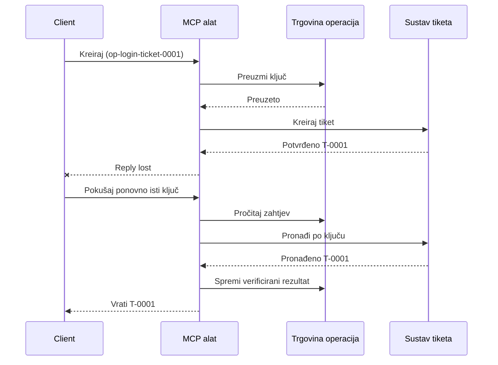
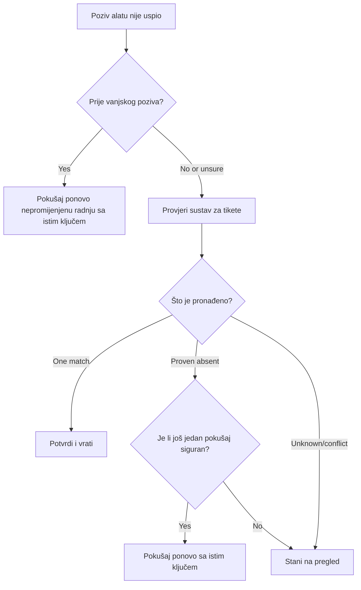

# Sigurna ponovna pokušaja za MCP alate: obrazac za pouzdanost pomoću pomoćnog modula

Nedostatak odgovora ne znači da je akcija izostala. Alat za podršku putem tiketa
može stvoriti tiket `T-0001` i zatim izgubiti vezu prije nego što klijent vidi
rezultat. Ako klijent slijepo pokuša ponovno, može napraviti `T-0002`.

Ova lekcija pokazuje kako prepoznati taj nesiguran ishod, zadržati jedan stabilan
identitet za predviđenu akciju i provjeriti sustav tiketa prije ponovnog pokušaja.
Priložena Python vježba pokreće se lokalno sa standardnom bibliotekom
i SQLite-om.

## Zašto vremensko ograničenje znači "ishod nepoznat"

Pretpostavimo da klijent pozove `create_support_ticket` s ključem operacije
`op-login-ticket-0001`:



Veza ne uspije nakon što je tiket potvrđen, ali prije nego što stigne rezultat.
Klijent zna samo da odgovor nedostaje. Ne zna je li tiket izostao.
Ponovno korištenje ključa operacije omogućuje alatu da pronađe i vrati
`T-0001` umjesto da stvori `T-0002`.

## Što radi pomoćni modul za pouzdanost

Pomoćni modul za pouzdanost je kod aplikacije koji održava stanje oporavka oko
alata. To može biti biblioteka, middleware, usluga s bazom podataka ili jednostavno
dio implementacije alata. Ne mora biti zaseban proces,
i nije dio MCP protokola.

Pomoćni modul ima četiri zadatka:

1. spremiti predviđenu akciju prije poziva vanjskog sustava;
2. dopustiti da samo jedan radnik preuzme tu akciju;
3. zapamtiti dovoljno stanja za oporavak nakon pada; i
4. provjeriti vanjski sustav kada je ishod neizvjestan.

Ova lekcija cilja na konačnu MCP specifikaciju `2026-07-28`. MCP nema
protokolsku sesiju, tako da je ključ operacije običan argument alata
podržan trajnim stanjem aplikacije. Isti obrazac radi i s ranijim
verzijama MCP-a.

## Četiri ID-a koja rješavaju različite probleme

Ovi identifikatori su povezani, ali nisu zamjenjivi:

| Identifikator | Što identificira | Preživi li ponovni pokušaj? |
| --- | --- | --- |
| JSON-RPC ID | Jedan zahtjev i odgovor | Ne; koristi novi ID zahtjeva |
| MCP Task ID | Jedan dugotrajni zadatak | Da; zadržati za anketiranje |
| Ključ operacije | Jedna predviđena akcija | Da; ponovno ga koristiti za tu akciju |
| Ticket ID | Pohranjeni rezultat | Da; vratiti nakon provjere |

Obavijesti o napretku i kontekst praćenja pomažu promatrati zahtjev.
Otkazivanje traži zaustavljanje rada. Nijedan od njih ne sprječava duplikat tiketa.

## Izgradite zaštitu

Kreirajte ključ operacije prije prvog poziva alata i spremite ga s
tijek rada. Svaki pokušaj stvaranja istog predviđenog tiketa koristi isti ključ:

```json
{
  "operation_key": "op-login-ticket-0001",
  "title": "Cannot sign in"
}
```

Drugi predviđeni tiket dobiva novi ključ. U produkciji generirajte neprozirnu,
nepredvidivu vrijednost umjesto unošenja korisničkih podataka u ključ.

Evo potpune sheme MCP alata korištene u ovoj lekciji:

```json
{
  "name": "create_support_ticket",
  "title": "Create support ticket",
  "description": "Creates or recovers one support ticket for an operation key.",
  "inputSchema": {
    "$schema": "https://json-schema.org/draft/2020-12/schema",
    "type": "object",
    "properties": {
      "operation_key": {
        "type": "string",
        "minLength": 16,
        "maxLength": 128,
        "description": "Stable key reused for the same intended action."
      },
      "title": {
        "type": "string",
        "minLength": 1,
        "maxLength": 200
      }
    },
    "required": ["operation_key", "title"],
    "additionalProperties": false
  },
  "outputSchema": {
    "$schema": "https://json-schema.org/draft/2020-12/schema",
    "type": "object",
    "properties": {
      "ticket_id": {
        "type": "string"
      },
      "operation_key": {
        "type": "string"
      },
      "status": {
        "type": "string",
        "const": "verified"
      }
    },
    "required": ["ticket_id", "operation_key", "status"],
    "additionalProperties": false
  }
}
```

Autentificirani identitet pozivatelja dolazi iz konteksta poslužitelja, ne iz
modelom dodanog alata. Ograničite svaku spremljenu operaciju na:

- tog pozivatelja, zakupca ili servisni račun;
- naziv alata i verziju; i
- hash normaliziranih ulaza koji definiraju vanjsku akciju.

Hash ulaza odgovara na jednostavno pitanje: "Zatražuje li ovaj ponovni pokušaj isti
tiket?" Ako ključ već pripada drugom naslovu, odbij poziv.
Vraćanje ranijeg rezultata za promijenjeni ulaz prikrivalo bi grešku u ugovoru.

Spremite zahtjev pomoću jedne atomične operacije baze podataka. "Atomsko" znači da dva radnika
ne mogu obojica vidjeti prazan zapis i postati vlasnici. Zaključavanje lokalno na
procesu nije dovoljno ako druga instanca poslužitelja može primiti ponovni pokušaj.

Tijek rada stvara ključ dok je akcija `planned` (planirana). Primjer zatim
sprema ova stanja:

- `claimed`: jedan radnik je rezervirao operaciju;
- `completed`: sustav tiketa je vratio rezultat; i
- `verified`: čitanje iz sustava tiketa potvrđuje rezultat.

Pad može ostaviti spremljeno stanje na `claimed` čak i nakon što je tiket
kreiran. Svaki nestalan zahtjev tretirajte kao neizvjestan dok ga vanjski dokazi
ne potvrde. Ne pretpostavljajte da `claimed` znači "ništa se nije dogodilo."

## Oporavite se prije nego što pokušate ponovno

Kad poziv alata ne uspije, odlučite što se zna prije slanja drugog vanjskog
zapisa:



Provjera koja ne uspije prije nego što se pozove API tiketa je poznati neuspjeh.
Ponovno pokušajte istu neizmijenjenu akciju s istim ključem operacije. Ako ispravak ulaza
mijenja predviđeni tiket, napravite novi ključ za tu novu akciju.

Ako je zahtjev možda stigao do sustava tiketa, prvo ga uskladite.
Usklađivanje znači usporediti spremljeni zahtjev s ovlaštenim zapisom tiketa.
Vratite postojeći tiket kad se pronađe točno jedan odgovarajući zapis.
Ponovite pokušaj samo kad je tiket nedvojbeno odsutan i ugovor s primateljem
dopušta drugi sigurni pokušaj.

"Nije pronađeno" nije uvijek odlučujuće. Pružatelj s na kraju konzistentnim
pretraživanjem može trebati ograničeno čekanje i dodatnu provjeru. Ako sustav ne može biti
pretražen, daje kontradiktorne rezultate ili ne može sigurno ukloniti duplikate drugog
pokušaja, zaustavite se i prijavite `ishod nepoznat`. Zaustavljanje ovdje se ponekad naziva
"propadanje na zatvoreno": tijek rada odbija nagađati.

## Dokazi, zadaci i otkazivanje

Odgovor alata kaže što je alat izvijestio. Pohranjena kontrolna točka kaže što je
tijek rada zabilježio. Najjači dokaz dolazi od sustava koji posjeduje
rezultat: u ovom primjeru, čitanje iz sustava tiketa koje nalazi točno jedan
odgovarajući tiket.

Uskladite dokaz s rizikom. ID poruke pružatelja može biti dovoljan za
obavijest niskog rizika. Plaćanja, implementacije i destruktivne radnje mogu
trebati status pružatelja, knjigu ili ručni pregled kao dokaz.

Proširenje MCP zadataka nadopunjava ovaj obrazac za dugotrajni rad. ID zadatka
dopušta klijentu da nastavi s anketiranjem nakon prekida veze, ali ne identificira
ili uklanja dupliciranje tiketa samog po sebi. Kada se koriste zadaci, identiteti su povezani
ovako:

```text
operation key -> Task ID -> ticket ID -> verification evidence
```

Otkazivanje je kooperativno, ne povratak. Tiket se još uvijek može kreirati
nakon potvrde otkazivanja, pa nesiguran rezultat još uvijek treba
usklađivanje.

## Pokrenite vježbu ubrizgavanja grešaka

Primjer koristi dvije SQLite datoteke: jedna predstavlja spremište operacija, a
druga predstavlja vanjski sustav tiketa. Ne postoji transakcija koja obuhvaća
obje datoteke. Greška se ubrizgava nakon što je tiket potvrđen, ali prije nego što
pomoćni modul zabilježi završetak.

Izravna Python metoda prihvaća `caller_id` kao zamjenu za autentificirani
kontekst poslužitelja. Nemojte dodavati `caller_id` u modelom upravljanu MCP
shemu ulaza.

Predvidite rezultat prije pokretanja testova:

| Putanja | Rezultat nakon ponovnog pokušaja | Broj tiketa |
| --- | --- | --- |
| Slijepi ponovni pokušaj | Stvara `T-0002` nakon gubitka odgovora za `T-0001` | 2 |

| Zaštićeni pokušaj ponovo | Pronalazi i vraća `T-0001` | 1 |

Pokreni:

```bash
cd 08-BestPractices/reliability-sidecars/python
python -m unittest discover -p "test_*.py" -v
```

Šest testova pokazuje da:

1. slijepi pokušaj ponovo stvara duplikat;
2. gubitak odgovora plus ponovno pokretanje vraća jednu kartu iz trajne tvrdnje;
3. verificirani pokušaj ponovo koristi spremljeni rezultat;
4. promijenjeni unos ili suprotni vanjski dokazi su odbijeni;
5. postojeća tvrdnja bez vanjskih dokaza zaustavlja se sigurno; i
6. istovremene tvrdnje dopuštaju jednog vlasnika bez regresije verificiranog rezultata.

Otvorite uzorak:

- [Python implementacija](../../../../08-BestPractices/reliability-sidecars/python/reliability_sidecar.py)
- [Deterministički testovi](../../../../08-BestPractices/reliability-sidecars/python/test_reliability_sidecar.py)

Uzorak namjerno izostavlja zakasnjele najmove za tvrdnje. Politika preuzimanja u produkciji
zahtijeva ograničen najam, atomski prijenos vlasništva i još jednu vanjsku
provjeru prije izvršavanja.

## Opcionalna zajednička implementacija

Agent Enhancer Utilities je jedna zajednička implementacija
ovog aplikacijskog obrasca na razini. Njegov planer odabire pristup oporavku, dok njegova
kontrolna točka bilježi stanja tvrdnji i nesigurnih rezultata. Alat domene ili MCP
poslužitelj i dalje izvodi i verificira stvarnu radnju. Ova usluga nije dio
MCP specifikacije i nije potrebna za ovu lekciju.

| Koncept lekcije | Dio Agent Enhancer | Važno ograničenje |
| --- | --- | --- |
| Plan oporavka | `workflow-guard-planner` | Ne poziva alat domene |
| Tvrdnja i oporavak | `workflow-checkpoint` | `external_proof` ostaje `false` |
| Točno ponavljanje sidecara | `lab.invoke_tool` | Koristi zaseban ključ idempotencije |
| Verificirajte stvarnu radnju | Pretraživanje/povratak odredišta | Posjeduje ga domena MCP |

Za točan pokušaj ponovo jednog poziva sidecara, `lab.invoke_tool` prihvaća vanjski
`idempotency_key`. Taj ključ identificira pozivanje sidecara; nije poslovni
`operation_key` koji se koristi za kartu.

Oznaka javnog ugovora i opcionalni primjer s mrežom dostupni su
ovdje:

- [Ugovor o pouzdanosti Sidecar v1](https://github.com/artiehinz/Agent-Enhancer-Utilities/blob/v1.6.0/docs/RELIABILITY_SIDECAR_CONTRACT_V1.md)
- [Planner i primjer lažne domene](https://github.com/artiehinz/Agent-Enhancer-Utilities/tree/v1.6.0/examples/reliability-sidecar)

Ove poveznice ilustriraju aplikacijski obrazac. Ne tvrde da
hostirana usluga udovoljava MCP `2026-07-28`, a stanje kontrolne točke nikada ne služi
kao vanjski dokaz karte.

## Kontrolni popis za produkciju

- [ ] Izradite i spremite ključ operacije prije prvog vanjskog pokušaja.
- [ ] Povežite ključ s pozivateljem, verzijom alata i normaliziranim hashom unosa.
- [ ] Odbacite promijenjeni unos pod postojećim ključem.
- [ ] Dopustite jednog vlasnika s atomskom operacijom zajedničke pohrane.
- [ ] Proslijedite ključ nižem pružatelju usluge kada on podržava idempotenciju.
- [ ] Pomirite nesigurne rezultate prije drugog zapisa.
- [ ] Čuvajte verificirane rezultate i dokaze tijekom cijelog vremenskog okvira ponovnog pokušaja.
- [ ] Zaustavite se na pregled kada se vanjski rezultat ne može sigurno utvrditi.

## Reference

- [MCP specifikacija `2026-07-28`](https://modelcontextprotocol.io/specification/2026-07-28)
- [MCP `2026-07-28` smjernice za alat](https://modelcontextprotocol.io/specification/2026-07-28/server/tools)
- [MCP Tasks proširenje](https://modelcontextprotocol.io/extensions/tasks/overview)
- [JSON-RPC 2.0 specifikacija](https://www.jsonrpc.org/specification)

---

<!-- CO-OP TRANSLATOR DISCLAIMER START -->
**Napomena**:
Ovaj dokument je preveden korištenjem AI prevoditeljskog servisa [Co-op Translator](https://github.com/Azure/co-op-translator). Iako težimo točnosti, imajte na umu da automatski prijevodi mogu sadržavati greške ili netočnosti. Izvorni dokument na izvornom jeziku treba smatrati autoritativnim izvorom. Za važne informacije preporuča se profesionalni ljudski prijevod. Nismo odgovorni za bilo kakva nesporazumevanja ili pogrešne interpretacije koje proizlaze iz korištenja ovog prijevoda.
<!-- CO-OP TRANSLATOR DISCLAIMER END -->