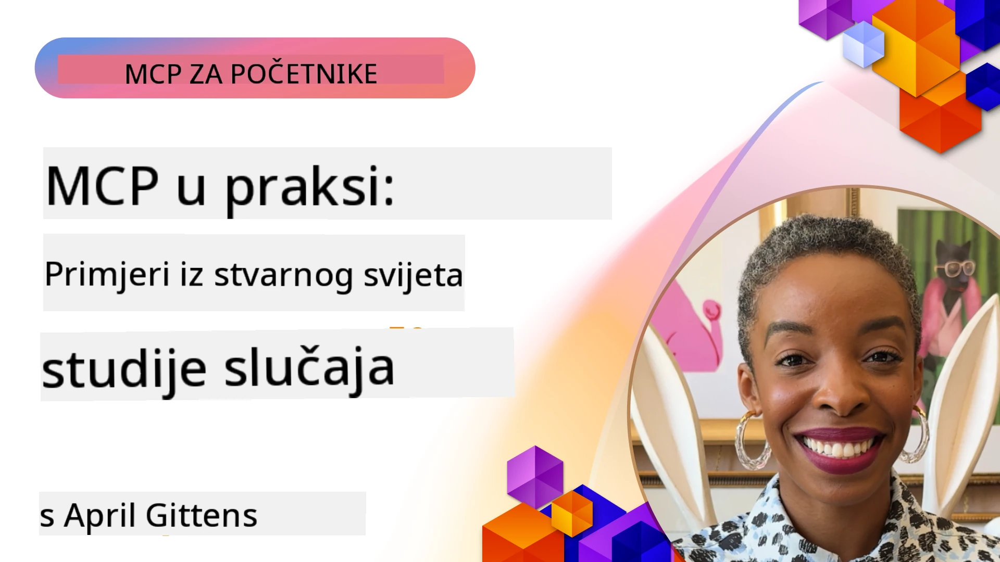

# MCP u praksi: Studije slučaja iz stvarnog svijeta

_(Kliknite na gornju sliku za pregled videa ove lekcije)_

Protokol modelnog konteksta (MCP) mijenja način na koji AI aplikacije komuniciraju s podacima, alatima i uslugama. Ovaj dio donosi studije slučaja iz stvarnog svijeta koje prikazuju praktične primjene MCP-a u različitim poslovnim scenarijima.

## Pregled

Ovaj dio prikazuje konkretne primjere implementacija MCP-a, ističući kako organizacije koriste ovaj protokol za rješavanje složenih poslovnih izazova. Pregledom ovih studija slučaja dobit ćete uvid u svestranost, skalabilnost i praktične prednosti MCP-a u stvarnim situacijama.

## Ključni ciljevi učenja

Istražujući ove studije slučaja, naučit ćete:

- Razumjeti kako se MCP može primijeniti za rješavanje specifičnih poslovnih problema
- Upoznati se s različitim obrascima integracije i arhitektonskim pristupima
- Prepoznati najbolje prakse za implementaciju MCP-a u poslovnim okruženjima
- Steći uvid u izazove i rješenja na koja se nailazi u stvarnim implementacijama
- Identificirati prilike za primjenu sličnih obrazaca u vlastitim projektima

## Istaknute studije slučaja

### 1. [Azure AI agents za putovanja – Referentna implementacija](./travelagentsample.md)

Ova studija slučaja proučava Microsoftovo sveobuhvatno referentno rješenje koje pokazuje kako izgraditi aplikaciju za planiranje putovanja s više agenata, pokretanih AI-jem, koristeći MCP, Azure OpenAI i Azure AI Search. Projekt prikazuje:

- Orkestraciju više agenata putem MCP-a
- Integraciju podataka tvrtke s Azure AI Search
- Sigurnu i skalabilnu arhitekturu koristeći Azure usluge
- Proširive alate s višekratno upotrebljivim MCP komponentama
- Konverzacijsko korisničko iskustvo pokretano Azure OpenAI-jem

Arhitektura i detalji implementacije pružaju vrijedne uvide u izgradnju složenih sustava s više agenata s MCP-om kao slojem koordinacije.

### 2. [Ažuriranje Azure DevOps stavki s podacima s YouTubea](./UpdateADOItemsFromYT.md)

Ova studija slučaja prikazuje praktičnu primjenu MCP-a za automatizaciju radnih procesa. Pokazuje kako se alati MCP-a mogu koristiti za:

- Ekstrakciju podataka s online platformi (YouTube)
- Ažuriranje radnih stavki u sustavima Azure DevOps
- Izgradnju ponovljivih tijekova automatizacije
- Integraciju podataka preko različitih sustava

Ovaj primjer ilustrira kako čak i relativno jednostavne implementacije MCP-a mogu donijeti značajne povećanja učinkovitosti automatizirajući rutinske zadatke i poboljšavajući konzistentnost podataka među sustavima.

### 3. [Dobivanje dokumentacije u stvarnom vremenu s MCP-om](./docs-mcp/README.md)

Ova studija slučaja vodi vas kroz povezivanje Python konzolnog klijenta s MCP serverom da biste dohvatili i zapisali Microsoftovu dokumentaciju u stvarnom vremenu, svjesnu konteksta. Naučit ćete kako:

- Povezati se na MCP server koristeći Python klijent i službeni MCP SDK
- Koristiti streaming HTTP klijente za učinkovito dohvaćanje podataka u stvarnom vremenu
- Pozivati alate za dokumentaciju na serveru i zapisivati odgovore izravno u konzolu
- Integrirati ažuriranu Microsoftovu dokumentaciju u svoj radni proces bez napuštanja terminala

Poglavlje uključuje praktični zadatak, minimalan radni primjer koda i poveznice na dodatne resurse za detaljnije učenje. Pogledajte cjeloviti vodič i kod u povezanom poglavlju kako biste razumjeli kako MCP može transformirati pristup dokumentaciji i produktivnost programera u konzolnim okruženjima.

### 4. [Interaktivna web aplikacija za generiranje plana učenja s MCP-om](./docs-mcp/README.md)

Ova studija slučaja pokazuje kako izgraditi interaktivnu web aplikaciju koristeći Chainlit i Model Context Protocol (MCP) za generiranje personaliziranih planova učenja za bilo koju temu. Korisnici mogu odabrati predmet (npr. "AI-900 certifikacija") i trajanje učenja (npr. 8 tjedana), a aplikacija pruža detaljan tjedni pregled preporučenog sadržaja. Chainlit omogućuje konverzacijski chat sučelje, čineći iskustvo zanimljivim i prilagodljivim.

- Konverzacijska web aplikacija pokretana Chainlit-om
- Korisnički definirani upiti za temu i trajanje
- Preporuke sadržaja po tjednima koristeći MCP
- Odgovori u stvarnom vremenu, prilagodljivi u chat sučelju

Projekt ilustrira kako se konverzacijski AI i MCP mogu kombinirati za stvaranje dinamičnih, korisnički vođenih edukativnih alata u modernom web okruženju.

### 5. [Dokumentacija u uređivaču s MCP serverom u VS Codeu](./docs-mcp/README.md)

Ova studija slučaja pokazuje kako možete donijeti Microsoft Learn dokumentaciju izravno u VS Code okruženje koristeći MCP server—više nema potrebe za mijenjanjem tabova preglednika! Vidjet ćete kako:

- Odmah pretraživati i čitati dokumentaciju unutar VS Codea koristeći MCP panel ili paletu naredbi
- Referencirati dokumentaciju i umetati poveznice izravno u README ili markdown datoteke tečaja
- Koristiti GitHub Copilot i MCP zajedno za besprijekorne, AI-pokretane tijekove rada s dokumentacijom i kodom
- Provjeravati i unapređivati dokumentaciju s povratnim informacijama u stvarnom vremenu i točnošću osiguranoj od Microsofta
- Integrirati MCP s GitHub tijekovima rada za kontinuirano provjeravanje dokumentacije

Implementacija uključuje:

- Primjer konfiguracije `.vscode/mcp.json` za jednostavno postavljanje
- Prikaze kroz snimke ekrana kako bi se pokazalo iskustvo u uređivaču
- Savjete za kombiniranje Copilota i MCP-a za maksimalnu produktivnost

Ovaj scenarij je idealan za autore tečajeva, pisce dokumentacije i programere koji žele ostati fokusirani u svom uređivaču tijekom rada s dokumentacijom, Copilotom i alatima za validaciju—sve pokretano MCP-om.

### 6. [Izrada APIM MCP servera](./apimsample.md)

Ova studija slučaja pruža korak-po-korak vodič kako izraditi MCP server koristeći Azure API Management (APIM). Pokriva:

- Postavljanje MCP servera u Azure API Management
- Izlaganje API operacija kao MCP alata
- Konfiguriranje politika za ograničenje brzine i sigurnost
- Testiranje MCP servera koristeći Visual Studio Code i GitHub Copilot

Ovaj primjer ilustrira kako iskoristiti Azureove mogućnosti za izgradnju robusnog MCP servera koji se može koristiti u raznim aplikacijama, poboljšavajući integraciju AI sustava s poslovnim API-jima.

### 7. [GitHub MCP Registry — ubrzavanje agentne integracije](https://github.com/mcp)

Ova studija slučaja analizira kako GitHub MCP Registry, lansiran u rujnu 2025., rješava kritični izazov u AI ekosustavu: fragmentirano pronalaženje i implementaciju Model Context Protocol (MCP) servera.

#### Pregled
**MCP Registry** rješava rastuću poteškoću raspršenih MCP servera po spremištima i registarima, što je prije usporavalo i činilo integraciju podložnom greškama. Ti serveri omogućuju AI agentima interakciju s vanjskim sustavima poput API-ja, baza podataka i izvora dokumentacije.

#### Izazovi
Programeri koji grade agentne tijekove rada suočavali su se s nekoliko izazova:
- **Loša otkrivanje** MCP servera na različitim platformama
- **Redundantna pitanja oko postavljanja** raspršena po forumima i dokumentaciji
- **Sigurnosni rizici** od neprovjerenih i nepouzdanih izvora
- **Nedostatak standardizacije** u kvaliteti i kompatibilnosti servera

#### Arhitektura rješenja
GitHub MCP Registry centralizira pouzdane MCP servere s ključnim značajkama:
- **Jednokratna instalacija** integrirana preko VS Codea za brz setup
- **Sortiranje signala preko buke** prema zvjezdicama, aktivnosti i validaciji zajednice
- **Izravna integracija** s GitHub Copilotom i drugim MCP kompatibilnim alatima
- **Otvoreni model doprinosa** koji omogućuje doprinos i zajednici i poslovnim partnerima

#### Poslovni utjecaj
Registar je doveo do mjerljivih poboljšanja:
- **Brže uključivanje** programera koristeći alate poput Microsoft Learn MCP Servera, koji struji službenu dokumentaciju izravno u agente
- **Povećanje produktivnosti** putem specijaliziranih servera poput `github-mcp-server`, omogućavajući automatizaciju GitHuba na prirodnom jeziku (kreiranje PR, ponovno pokretanje CI, skeniranje koda)
- **Jače povjerenje u ekosustav** kroz kurirane liste i transparentne standarde konfiguracije

#### Strateška vrijednost
Za praktičare koji se specijaliziraju za upravljanje životnim ciklusom agenata i reproducibilne tijekove rada, MCP Registry pruža:
- **Modularne mogućnosti implementacije agenata** sa standardiziranim komponentama
- **Pipeline-e evaluacije podržane registrima** za dosljedno testiranje i validaciju
- **Međualati interoperabilnost** koja omogućuje besprijekornu integraciju različitih AI platformi

Ova studija slučaja pokazuje da MCP Registry nije samo direktorij—već temeljna platforma za skalabilnu, stvarnu integraciju modela i implementaciju agentnih sustava.

### 8. [Objavljivanje na društvenim mrežama preko agenta](./publora-social-publishing.md)

Ova studija služi kao vodič kroz **remote MCP server sposoban za pisanje** — čiji alati preuzimaju nepovratne radnje u ime korisnika — koristeći društveno objavljivanje kao primjer. Agent sastavlja objavu, čovjek joj daje odobrenje, a server je planira po mrežama.

Zanimljiv dio su dizajnerska ograničenja koja objavljivanje nameće, a koja se odnose na bilo koji server koji piše, a ne samo čita:

- **Otkrivanjem usmjereno na otvoren pristup, a izvršenje autentificirano** — `tools/list` vraća odgovor bez vjerodajnica kako bi registri i klijenti mogli introspektirati, dok svaki `tools/call` zahtijeva token te inače vraća `401` s `WWW-Authenticate` headerom
- **OAuth registracija bez koraka izvan pojasa** — dinamična registracija klijenta danas, s dokumentima metapodataka klijenta kao smjerom na koji cilja specifikacija `2026-07-28`
- **Oznake alata** (`readOnlyHint`, `destructiveHint`, `idempotentHint`) koje klijenti koriste za odlučivanje što potvrditi — naznake, ne prisila, i nešto što spojna mjesta (connector directories) sada očekuju pri pregledu
- **Neizmišljivi identifikatori**, tako da halucinirana vrijednost glasno zakaže umjesto da djeluje na osnovu izgledajuće vjerodostojne
- **Idempotencijski ključevi na alatima za kreiranje objava**, tako da ponovni pokušaj izvršavanja od strane runtime okruženja agenta ne rezultira duplikatom objave
- **Nema-operativni cilj opisan u shemi alata** koji vježba cijeli put pisanja, ali ne objavljuje ništa, namijenjen recenzentima i CI-u

Poglavlje završava kratkim kontrolnim popisom koji možete primijeniti na server koji gradite.

## Zaključak

Ove osam sveobuhvatnih studija slučaja pokazuju izvanrednu svestranost i praktične primjene Model Context Protocola u različitim stvarnim scenarijima. Od složenih sustava za planiranje putovanja s više agenata i upravljanja poslovnim API-jima do optimiziranih tijekova rada s dokumentacijom i revolucionarnog GitHub MCP Registry-a, ovi primjeri demonstriraju kako MCP pruža standardiziran, skalabilan način povezivanja AI sustava s alatima, podacima i uslugama potrebnim za pružanje izvanredne vrijednosti.

Studije slučaja obuhvaćaju više dimenzija implementacije MCP-a:
- **Integracija u korporacijama**: Azure API Management i automatizacija Azure DevOps
- **Orkestracija više agenata**: planiranje putovanja s koordiniranim AI agentima
- **Produktivnost programera**: integracija s VS Codeom i pristup dokumentaciji u stvarnom vremenu
- **Razvoj ekosustava**: GitHub MCP Registry kao temeljna platforma
- **Edukativne primjene**: generatori interaktivnih planova učenja i konverzacijska sučelja

Istraživanjem ovih implementacija dobit ćete ključne uvide u:
- **Arhitektonske obrasce** za različite razine i slučajeve uporabe
- **Strategije implementacije** koje balansiraju funkcionalnost i održivost
- **Sigurnosne i skalabilne** aspekte za proizvodne implementacije
- **Najbolje prakse** za razvoj MCP servera i integraciju klijenata
- **Razmišljanje o ekosustavu** za izgradnju međusobno povezanih AI-rješenja

Ovi primjeri kolektivno dokazuju da MCP nije samo teoretski okvir nego zreo, spreman za proizvodnju protokol koji omogućuje praktična rješenja za složene poslovne izazove. Bilo da gradite jednostavne alate za automatizaciju ili sofisticirane sustave s više agenata, obrasci i pristupi ilustrirani ovdje pružaju čvrsti temelj za vaše vlastite MCP projekte.

## Dodatni resursi

- [Azure AI Travel Agents GitHub spremište](https://github.com/Azure-Samples/azure-ai-travel-agents)
- [Azure DevOps MCP alat](https://github.com/microsoft/azure-devops-mcp)
- [Playwright MCP alat](https://github.com/microsoft/playwright-mcp)
- [Microsoft Docs MCP Server](https://github.com/MicrosoftDocs/mcp)
- [GitHub MCP Registry — ubrzanje agentne integracije](https://github.com/mcp)
- [MCP Community Examples](https://github.com/microsoft/mcp)

## Što slijedi

- Prethodno: [Modul 8: Najbolje prakse](../08-BestPractices/README.md)
- Sljedeće: [Modul 10: Optimizacija AI tijekova rada: Izgradnja MCP servera s AI Toolkitom](../10-StreamliningAIWorkflowsBuildingAnMCPServerWithAIToolkit/README.md)

---

<!-- CO-OP TRANSLATOR DISCLAIMER START -->
**Napomena**:
Ovaj dokument je preveden korištenjem AI prevoditeljskog servisa [Co-op Translator](https://github.com/Azure/co-op-translator). Iako težimo točnosti, imajte na umu da automatski prijevodi mogu sadržavati greške ili netočnosti. Izvorni dokument na izvornom jeziku treba smatrati autoritativnim izvorom. Za važne informacije preporuča se profesionalni ljudski prijevod. Nismo odgovorni za bilo kakva nesporazumevanja ili pogrešne interpretacije koje proizlaze iz korištenja ovog prijevoda.
<!-- CO-OP TRANSLATOR DISCLAIMER END -->