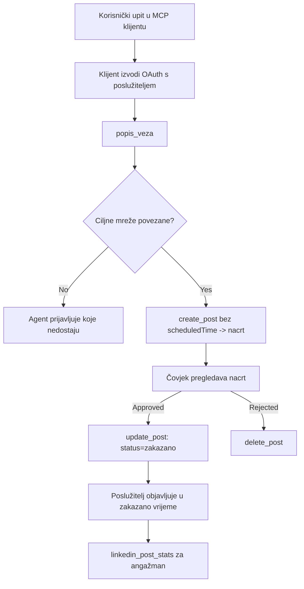

# Studija slučaja: Objavljivanje na društvenim mrežama iz agenta s udaljenim MCP poslužiteljem

> **Odricanje:** Nekoliko usluga i open-source projekata može objavljivati na društvenim mrežama, a tim također može izravno integrirati API svake mreže. Sljedeći scenarij prikazan je kao jedan izrađeni primjer kako se može dizajnirati i koristiti **remote MCP poslužitelj sposoban za pisanje**. Publora je komercijalna usluga s besplatnim slojem; obrasci opisani ovdje primjenjuju se na bilo koji MCP poslužitelj koji izvodi nepovratne radnje u ime korisnika.

## Pregled

Agenti su dobri u izradi sadržaja, ali slabi u njegovom dostavljanju. Model može napisati objavu o vijesti za nekoliko sekundi, a zatim se rad zaustavlja: objavljivanje znači API po mreži, OAuth aplikaciju po mreži i različit skup medijskih pravila za svaku. Većina timova to riješi tako da ručno kopira tekst u preglednik.

Ova studija slučaja proučava kako se taj posljednji korak zatvara pomoću jednog udaljenog MCP poslužitelja i — još korisnije za svakoga tko ga gradi — o odlukama u dizajnu koje mora ispravno donijeti **poslužitelj sposoban za pisanje**. Čitanje podataka je popustljivo. Objavljivanje nije: pogrešan poziv alata vidljiv je publici i ne može se opozvati.

## Scenarij

Mali tim za odnose s programerima izrađuje objave unutar agenta (Claude, VS Code, Cursor — klijent nije bitan). Žele da agent može:

- vidjeti koje su društvene račune tim povezao,
- izraditi objavu i zadržati je kao nacrt za ljudsku potvrdu,
- priložiti sliku,
- zakazati je na nekoliko mreža u odabrano vrijeme,
- i kasnije izvještavati o njenim rezultatima.

Ključno, žele da agent *ne može* slučajno objaviti dok još eksperimentiraju.

## Korišteni alati

- [Publora MCP Server](https://github.com/publora/mcp-server) — udaljeni MCP poslužitelj (`streamable-http`) koji nudi alate za objavljivanje, zakazivanje, medije i analitiku LinkedIna. Registriran u službenom MCP registru kao `com.publora/mcp-server`.

## Radni tok korak po korak

1. **Povežite poslužitelj.** Klijenti koji podržavaju OAuth dovršavaju autorizacijski proces pomoću autorizacijskog koda s PKCE prema zaslonu pristanka poslužitelja; klijenti koji ne podržavaju OAuth, poput headless CLI-ja, koriste Publora API ključ u zaglavlju. Oba pristupa su podržana i izbor ovisi o klijentu, a ne o poslužitelju.
2. **Popis veza.** Agent poziva `list_connections` i prima povezane račune sa njihovim identifikatorima.
3. **Nacrt.** Agent poziva `create_post` *bez* zakazanog vremena. Objavu sprema kao nacrt — ništa nije objavljeno.
4. **Priloži medij.** Javni URL-ovi slika se prosljeđuju u istom pozivu; poslužitelj ih preuzima i provjerava.
5. **Zakazivanje.** Nakon ljudske potvrde, `update_post` postavlja status na zakazano s vremenom u ISO 8601 formatu.
6. **Mjerenje.** Za LinkedIn, `linkedin_post_stats` vraća angažman kada je objava uživo.

## Primjer naredbe

```text
Which social accounts do I have connected?
Draft a post announcing our new changelog page, attach the screenshot at
https://example.com/changelog.png, and keep it as a draft — do not publish it.
Once I approve, schedule it to LinkedIn and Bluesky for tomorrow at 09:00 UTC.
```

## Dijagram toka Mermaid



## Tehnička implementacija

Lekcije u nastavku su prenosivi dio ove studije slučaja.

### Otkrivenje bez autentifikacije, izvršenje s autentifikacijom

`tools/list` se poslužuje bez vjerodajnica; svaki `tools/call` zahtijeva token i inače vraća `401` s `WWW-Authenticate` zaglavljem koje upućuje na meta podatke zaštićenog resursa. (Poslužitelj također odgovara na neautentificirani `initialize`, što je važno samo za klijente na protokolima prije `2026-07-28`; ta revizija je u potpunosti uklonila rukovanje vezom.)

Ova podjela je važna u praksi. Registri, katalozi i klijenti mogu pregledavati dostupne alate — nazive, sheme, bilješke — bez držanja tajne, dok se ništa *ne može izvršiti* anonimno. Poslužitelj koji zahtijeva token za `initialize` efektivno je nevidljiv alatima; poslužitelj koji dopušta anonimni `tools/call` predstavlja rizik.

### Registracija: dinamička registracija klijenata i što je zamjenjuje

Poslužitelj oglašava `/.well-known/oauth-protected-resource` i `/.well-known/oauth-authorization-server` te podržava autorizacijski tijek koda s PKCE (`S256`), osvježavajuće tokene i **dinamičku registraciju klijenata**.

Dinamička registracija uklanja ručni korak: bez nje svaki klijent treba prethodno dodijeljeni `client_id`, što znači izvanmrežni zahtjev prodavaču za svakog novog klijenta.

Ovo treba smatrati kompatibilnošću, a ne dizajnom za kopiranje. Revizija specifikacije `2026-07-28` ukida dinamičku registraciju u korist Client ID Metadata Documents, gdje klijent hosta dokument s meta podacima na stabilnom HTTPS URL-u i taj URL *je* `client_id`. DCR zasad radi, ali poslužitelj koji se danas gradi treba planirati za CIMD i očuvati DCR samo za starije klijente.

### Bilješke alata nisu ukras

Svaki alat nosi `title` i odgovarajuće naznake: `readOnlyHint`, `destructiveHint`, `idempotentHint`, `openWorldHint`.

Dva su razloga za ulaganje u njih. Prvo, klijenti koriste naznake da odluče što potvrditi s korisnikom — klijent može automatski pokrenuti upit za čitanje i zaustaviti se na potvrdu prije brisanja. Specifikacija izričito kaže da su bilješke nepouzdane naznake, a ne mehanizam autorizacije: oblikuju što klijent nudi za napraviti, ne sprječavaju ništa na poslužitelju, te poslužitelj i dalje mora provoditi svoja pravila. Drugo, glavni direktoriji konektora sada ih *zahtijevaju* za pregled; poslužitelj čiji alati nemaju naslove i naznake biti će vraćen bez obzira na rad.

### Napravite identifikatore neizmišljivima

Identifikatori platforme su neprozirni nizovi vraćeni iz `list_connections`, a opis sheme izričito kaže da ih treba doslovno kopirati i nikad ne pogađati. Poslužitelj odbacuje sve ostalo.

Modeli su vješti pogađači. Svaki poslužitelj sposoban za pisanje trebao bi pretpostaviti da će se identifikator prije ili kasnije halucinirati i učiniti da ta radnja zakaže glasno i rano, umjesto da postupa prema vrijednosti koja izgleda vjerodostojno.

### Neuspjeh prije objave, s porukom za djelovanje

Neke mreže odbijaju objave koje sadrže samo tekst i zahtijevaju sliku ili video. To se provjerava kad se objava zakazuje, a pogreška imenuje platformu i nedostajući zahtjev.

Agent se može oporaviti od "Instagram zahtijeva medij - priložite sliku ili video" bez novog kruga slanja. Ne može se oporaviti od generičkog `400`.

### Učinite ponovne pokušaje sigurnima

Dva alata koja stvaraju sadržaj, `create_post` i `update_post`, prihvaćaju ključ idempotentnosti: ponovno korištenje s istim zahtjevom ponavlja izvorni odgovor umjesto da kreira drugu objavu. Runtime okruženja agenta ponavljaju pokušaje na istek vremena; bez idempotentnosti, spori odgovor postaje dvostruka objava. Ostali alati za pisanje — brisanja, radnje s medijima, signali i komentari za LinkedIn — nemaju taj ključ, pa ponovni pokušaj tamo nije automatski siguran. Dobro je znati koje su vaši mutacijski zahtjevi zaštićeni, a koje nisu.

### Omogućite način testiranja bez objave

Poslužitelj prihvaća rezervirani cilj, `publora-playground`, koji se provjerava i potvrđuje kao stvarna destinacija te se zatim odbacuje — ništa ne dolazi do živog računa. To je opisano u samoj shemi alata, koju svaki klijent može pročitati bez vjerodajnica: polje `platforms` `create_post` dokumentira ga kao "cilj za testiranje veze koji ne zahtijeva stvarnu vezu — objava se potvrđuje i odbacuje, ništa se ne objavljuje". Pozovite ga tako da ga proslijedite kao jedini unos: `platforms: ["publora-playground"]`.

Ispostavilo se da je to jedan od najkorisnijih detalja cijele površine. Recenzenti direktorija konektora, suradnici i CI (kontinuirana integracija) mogu provjeriti cijeli put pisanja od početka do kraja bez rizika za stvarnu publiku. Svaki MCP poslužitelj s nepovratnim radnjama ima koristi od dokumentiranog cilja bez učinka.

## Rezultati i utjecaj

- Korak objavljivanja preselio se iz preglednika u isti razgovor u kojem se sadržaj piše, a navika prvo nacrta zadržava čovjeka u petlji. Budite precizni što to znači: nacrt je konvencija, a ne granica. Isti vjerodajnici mogu zakazati ili objaviti, pa svatko kome treba stvarni odobreni filter mora ga provoditi izvan alata — odvojeni vjerodajnici ili sloj pravila ispred poslužitelja.
- Razlike po mreži — zahtjevi za medije, tematska struktura, kontrole odgovora — obrađuju se jednom na poslužitelju, a ne u svakom agentu koji s njim komunicira.
- Isti poslužitelj podržava nekoliko MCP klijenata bez rada po klijentu, jer je otkrivanje otvoreno, a registracija dinamična.
- Ograničenja dizajna gore oblikovana su kako recenzijama direktorija konektora tako i korisnicima: bilješke, OAuth i sigurni testni cilj svaki su bili zahtjev barem jednog od njih.

## Reference

- [Publora MCP Server (izvor)](https://github.com/publora/mcp-server)
- [Publora API i MCP dokumentacija](https://docs.publora.com)
- [MCP Registry unos: `com.publora/mcp-server`](https://registry.modelcontextprotocol.io/v0/servers?search=com.publora/mcp-server)
- [MCP specifikacija — Autorizacija](https://modelcontextprotocol.io/specification/draft/basic/authorization)
- [MCP specifikacija — Bilješke alata](https://modelcontextprotocol.io/docs/concepts/tools)

## Što slijedi

- Uzmite MCP poslužitelj koji gradite i provjerite tri najjeftinije pobjede ovdje: bilješke na svakom alatu, ključ idempotentnosti na svakom pisanju i dokumentirani cilj bez učinka.
- Isprobajte podjelu otvorenog otkrivanja: pozovite `tools/list` prema javnom udaljenom poslužitelju bez vjerodajnica, zatim pozovite alat i pregledajte izazov `401`.
- Razmislite što "opoziv" znači za vaš domen. Objavljivanje ima nacrte i brisanje; ako vaše radnje nemaju ekvivalent, potvrda treba biti u dizajnu alata, a ne u naredbi.

---

<!-- CO-OP TRANSLATOR DISCLAIMER START -->
**Napomena**:
Ovaj dokument je preveden korištenjem AI prevoditeljskog servisa [Co-op Translator](https://github.com/Azure/co-op-translator). Iako težimo točnosti, imajte na umu da automatski prijevodi mogu sadržavati greške ili netočnosti. Izvorni dokument na izvornom jeziku treba smatrati autoritativnim izvorom. Za važne informacije preporuča se profesionalni ljudski prijevod. Nismo odgovorni za bilo kakva nesporazumevanja ili pogrešne interpretacije koje proizlaze iz korištenja ovog prijevoda.
<!-- CO-OP TRANSLATOR DISCLAIMER END -->