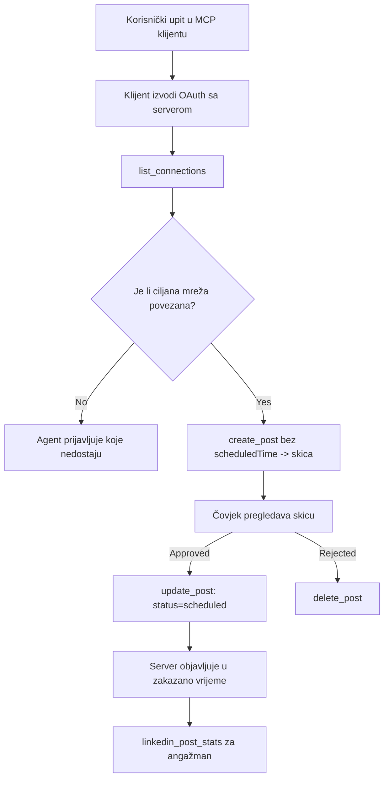

# Studija slučaja: Objavljivanje na društvenim mrežama iz agenta s udaljenim MCP serverom

> **Odricanje od odgovornosti:** Nekoliko usluga i open-source projekata može objavljivati na društvenim mrežama, a tim bi također mogao izravno integrirati API svake mreže. Scenarij u nastavku pruži jedan primijenjeni primjer kako se može dizajnirati i koristiti **udaljeni MCP server sposoban za pisanje**. Publora je komercijalna usluga s besplatnim slojem; obrasci opisani ovdje primjenjuju se na bilo koji MCP server koji izvodi nepovratne radnje u ime korisnika.

## Pregled

Agenti su dobri u izradi sadržaja, a slabi u njegovoj isporuci. Model može napisati najavu puštanja u rad u nekoliko sekundi, a zatim posao prestaje: objavljivanje znači jedan API po mreži, jednu OAuth aplikaciju po mreži i različit skup pravila za medije za svaku mrežu. Većina timova to rješava ručnim kopiranjem teksta u preglednik.

Ova studija slučaja prikazuje kako se taj zadnji korak zatvara s jednim udaljenim MCP serverom, i — što je korisnije za svakoga tko gradi takav server — o dizajnerskim odlukama koje **server sposoban za pisanje** mora ispravno donijeti. Čitanje podataka je oprostivo. Objavljivanje nije: pogrešan poziv alata vidljiv je publici i ne može se poništiti.

## Scenarij

Mali tim za odnose s developerima izrađuje postove u agentu (Claude, VS Code, Cursor — klijent nije bitan). Žele da agent:

- vidi koje su društvene račune tim povezao,
- izrađuje post i čuva ga kao nacrt za ljudsku odobrenje,
- prilaže sliku,
- zakazuje objavu na nekoliko mreža u odabrano vrijeme,
- i kasnije izvještava o učinku.

Ključno, žele da agent *ne može* slučajno objaviti dok još eksperimentiraju.

## Alati koji se koriste

- [Publora MCP Server](https://github.com/publora/mcp-server) — udaljeni MCP server (`streamable-http`) koji nudi alate za objavljivanje, zakazivanje, medije i LinkedIn analitiku. Registriran u službenom MCP registru kao `com.publora/mcp-server`.

## Korak-po-korak tijek rada

1. **Povežite server.** Klijenti koji koriste OAuth dovršavaju autorizacijski kodni tijek s PKCE preko serverovog vlastitog zaslona suglasnosti; klijenti koji ne koriste, poput bezglavih CLI alata, koriste Publora API ključ u zaglavlju. Oba puta su podržana, a koji ćete dobiti ovisi o klijentu, ne o serveru.
2. **Prikaži veze.** Agent poziva `list_connections` i prima povezane račune s njihovim identifikatorima.
3. **Nacrtaj.** Agent poziva `create_post` *bez* zakazanog vremena. Post se pohranjuje kao nacrt — ništa nije objavljeno.
4. **Priloži medije.** Javni URL-ovi za slike prolaze u istom pozivu; server ih preuzima i provjerava.
5. **Zakaži.** Nakon ljudskog odobrenja, `update_post` postavlja status na zakazano s ISO 8601 vremenom.
6. **Mjerenje.** Za LinkedIn, `linkedin_post_stats` vraća angažman nakon što post postane aktivan.

## Primjer upita

```text
Which social accounts do I have connected?
Draft a post announcing our new changelog page, attach the screenshot at
https://example.com/changelog.png, and keep it as a draft — do not publish it.
Once I approve, schedule it to LinkedIn and Bluesky for tomorrow at 09:00 UTC.
```

## Dijagram toka Mermaid



## Tehnička implementacija

Pouke u nastavku su prenosivi dio ove studije slučaja.

### Otvoreno otkrivanje, autentificirano izvršenje

`tools/list` se poslužuje bez vjerodajnica; svaki `tools/call` zahtijeva token
i inače vraća `401` s `WWW-Authenticate` zaglavljem koje upućuje na
meta-podatke zaštićenih resursa. Serverov naslijeđeni endpoint također odgovara na
neautentificirani `initialize` za klijente s protokolnim verzijama prije
`2026-07-28`; trenutni klijenti ne koriste taj postupak.

Ova specifična podjela servera omogućuje registrima, katalogima i klijentima pregled imena alata,
shema i bilješki bez tajne uz sprječavanje anonimnog
izvršenja. Otvoreno otkrivanje je izbor implementacije, a ne MCP zahtjev; zaštićena
implementacija može također zahtijevati autorizaciju za `tools/list`.

### Registracija: dinamička registracija klijenata i što je zamjenjuje

Server oglašava `/.well-known/oauth-protected-resource` i `/.well-known/oauth-authorization-server`, te podržava autorizacijski kodni tijek s PKCE (`S256`), osvježavajuće tokene i **dinamičku registraciju klijenata**.

Dinamička registracija uklonila je ručni korak za naslijeđene korisnike: bez nje,
svaki klijent je trebao unaprijed izdan `client_id` od dobavljača.

Ovo treba tretirati kao kompatibilnost, a ne kao dizajn koji se treba kopirati. Revizija specifikacije od `2026-07-28` ukida dinamičku registraciju klijenata u korist dokumenata Client ID metapodataka, gdje klijent postavlja dokument metapodataka na stabilni HTTPS URL i taj URL *je* `client_id`. DCR još radi, ali server danas u izgradnji treba planirati za CIMD i zadržati DCR samo za starije klijente.

### Bilješke alata nisu dekoracija

Svaki alat nosi `title` i primjenjive naznake: `readOnlyHint`, `destructiveHint`, `idempotentHint`, `openWorldHint`.

Dva su razloga za ulaganje u njih. Prvo, klijenti koriste naznake da odluče što potvrditi s korisnikom — klijent može automatski izvršiti samo čitanje i zaustaviti se za odobrenje prije brisanja. Specifikacija izričito kaže da su bilješke nepouzdane naznake, a ne autorizacijski mehanizam: oblikuju što klijent nudi, ali ništa ne zaustavljaju na serveru, koji mora i dalje provoditi svoja pravila. Drugi, glavni imenici konektora sada *zahtijevaju* ih za pregled; server čiji alati nemaju naslove i naznake bit će vraćen bez obzira na kvalitetu rada.

### Neka identifikatori budu neizmišljivi

Identifikatori platformi su neprozirni nizovi koje vraća `list_connections`, a opis sheme izričito kaže da se moraju preuzeti vjerno i nikad ne smiju pogađati. Server odbija sve ostalo.

Modeli su izvrsni u pogađanju. Svaki server sposoban za pisanje trebao bi pretpostaviti da će se identifikator na kraju halucinirati i učiniti da taj put neuspije glasno i rano, umjesto da djeluje na plauzibilnu vrijednost.

### Neuspjeh prije objave s porukom koju je moguće primijeniti

Neke mreže odbijaju postove samo s tekstom i zahtijevaju sliku ili video. To se provjerava pri zakazivanju, a greška imenuje platformu i nedostajuće zahtjeve.

Agent može oporaviti se od "Instagram zahtijeva medije — priložite sliku ili video" bez dodatnog kruga komunikacije. Ne može se oporaviti od generičkog `400`.

### Neka ponovne pokušaje budu sigurni

Dva alata koja kreiraju sadržaj, `create_post` i `update_post`, prihvaćaju ključ idempotencije: ponovno korištenje s istim zahtjevom ponavlja izvornu reakciju umjesto da stvori drugi post. Agent runtime-i ponovo pokušavaju kod vremenskog prekida; bez idempotencije spori odgovor dovodi do duplikatne objave. Ostali alati za pisanje — brisanja, koraci medija, LinkedIn reakcije i komentari — ne prihvaćaju taj ključ, pa ponovni pokušaj tamo nije automatski siguran. Vrijedno je znati koje vaše mutacije su zaštićene, a koje nisu.

### Omogućite način testiranja koji ne objavljuje ništa


Poslužitelj prihvaća rezerviranu metu, `publora-playground`, koja se provjerava i potvrđuje kao stvarna destinacija, a zatim odbacuje — ništa ne dolazi do stvarnog računa. Opisana je u samoj shemi alata, koju svaki klijent može pročitati bez vjerodajnica: polje `platforms` u `create_post` dokumentira je kao "meta za test veze koja ne zahtijeva stvarnu vezu — objava se potvrđuje i odbacuje, ništa nije objavljeno". Pozovite je tako da je proslijedite kao jedini unos: `platforms: ["publora-playground"]`.

Ovo se pokazalo kao jedan od najkorisnijih detalja cijelog sučelja. Recenzenti direktorija konektora, suradnici i CI mogu testirati cijeli postupak pisanja od početka do kraja bez rizika za stvarnu publiku. Bilo koji MCP poslužitelj s nepovratnim radnjama ima koristi od dokumentirane ciljne bez akcije.

## Rezultati i utjecaj

- Korak objavljivanja premješten je iz preglednika u isti razgovor u kojem se sadržaj piše, a navika započinjanja s nacrtom drži čovjeka uključenim. Budite precizni u vezi s time što to znači: nacrt je konvencija, ne granica. Iste vjerodajnice mogu zakazati ili objaviti, stoga svatko kome je potrebna stvarna provjera odobrenja mora je provoditi izvan sučelja alata — odvojene vjerodajnice ili sloj politike ispred poslužitelja.
- Razlike po mreži — zahtjevi za medijima, povezivanje tema, kontrole odgovora — obrađuju se jednom na poslužitelju, a ne na svakom agentu koji s njim komunicira.
- Isti poslužitelj podržava nekoliko MCP klijenata bez unaprijed izdanih vjerodajnica.
    Trenutni klijenti mogu koristiti Dokumente metapodataka klijenta; DCR ostaje rezervna opcija
    za starije klijente.
- Ograničenja dizajna gore oblikovana su recenzijama direktorija konektora jednako kao i korisnicima: bilješke, OAuth i sigurna meta za test bili su zahtjev barem jednog od njih.

## Reference

- [Publora MCP Server (izvor)](https://github.com/publora/mcp-server)
- [Publora API i MCP dokumentacija](https://docs.publora.com)
- [MCP zapisnik unosa: `com.publora/mcp-server`](https://registry.modelcontextprotocol.io/v0/servers?search=com.publora/mcp-server)
- [MCP specifikacija — Autorizacija](https://modelcontextprotocol.io/specification/2026-07-28/basic/authorization)
- [MCP specifikacija — Bilješke alata](https://modelcontextprotocol.io/docs/concepts/tools)

## Što slijedi

- Uzmi MCP poslužitelj koji gradiš i provjeri tri najjeftinija dobitka ovdje: bilješke na svakom alatu, ključ idempotencije na svakom zapisu i dokumentiranu meta bez akcije.
- Isprobaj podjelu otvorenog otkrivanja: pozovi `tools/list` prema javnom udaljenom poslužitelju bez vjerodajnica, zatim pozovi alat i pregledaj izazov `401`.
- Razmotri što "poništi" znači za tvoju domenu. Objavljivanje ima nacrte i brisanje; ako tvoje radnje nemaju ekvivalent, potvrda pripada dizajnu alata, a ne upitu.

---

<!-- CO-OP TRANSLATOR DISCLAIMER START -->
**Napomena**:
Ovaj dokument je preveden korištenjem AI prevoditeljskog servisa [Co-op Translator](https://github.com/Azure/co-op-translator). Iako težimo točnosti, imajte na umu da automatski prijevodi mogu sadržavati greške ili netočnosti. Izvorni dokument na izvornom jeziku treba smatrati autoritativnim izvorom. Za važne informacije preporuča se profesionalni ljudski prijevod. Nismo odgovorni za bilo kakva nesporazumevanja ili pogrešne interpretacije koje proizlaze iz korištenja ovog prijevoda.
<!-- CO-OP TRANSLATOR DISCLAIMER END -->