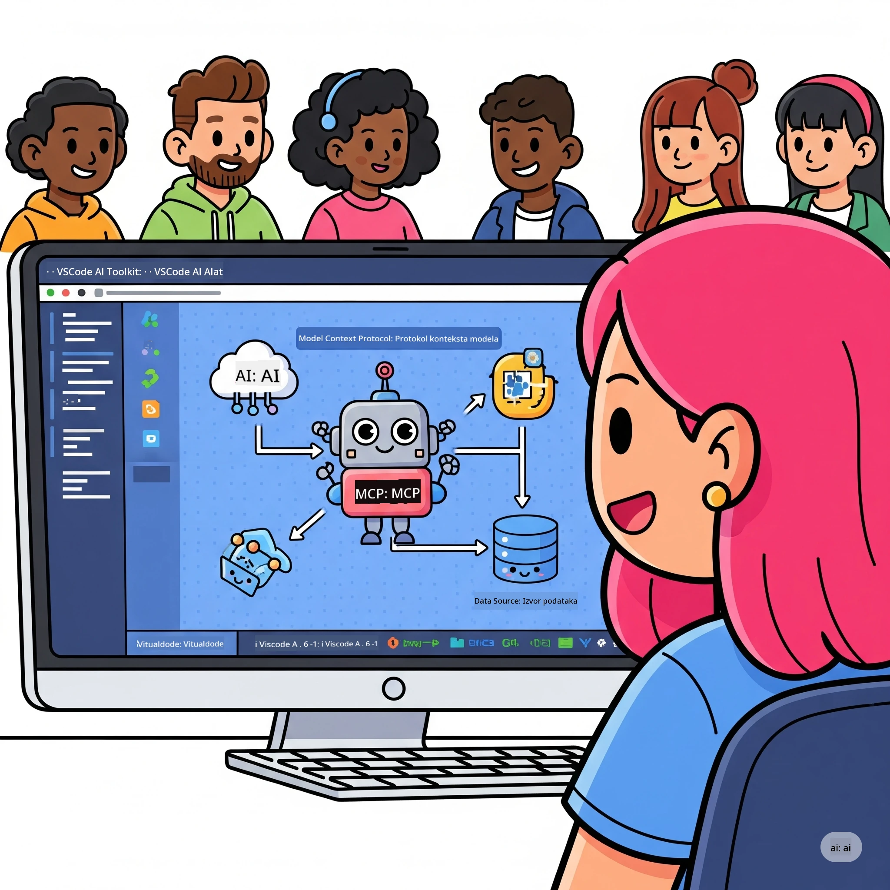
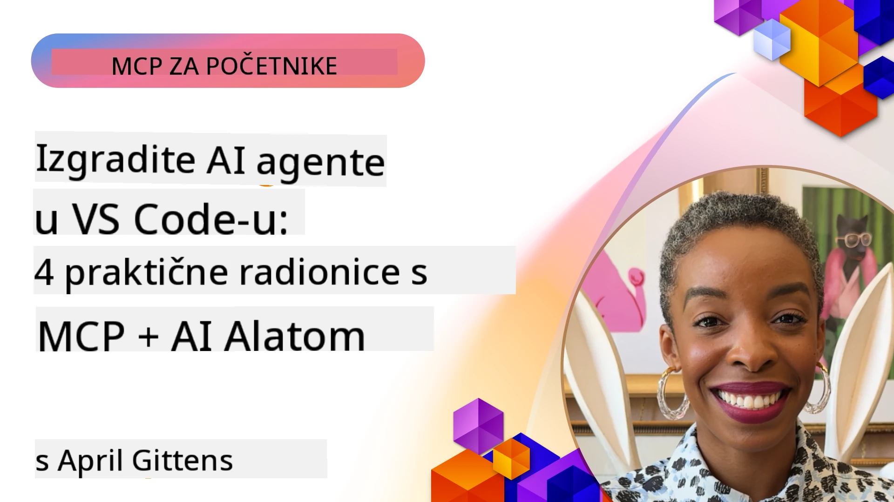

# Optimizacija AI Radnih Tokova: Izrada MCP Servera s Microsoft Foundry Toolkit

## 🎯 Pregled

_(Kliknite na sliku iznad za prikaz video lekcije)_

Dobrodošli na **Model Context Protocol (MCP) radionicu**! Ova sveobuhvatna praktična radionica kombinira dvije vrhunske tehnologije koje revolucioniraju razvoj AI aplikacija:

> **Napomena o kompatibilnosti:** kod radionice izgrađen je i testiran s MCP
> `2025-11-25`, kao što pokazuje oznaka gore. Koristite
> [trenutnu `2026-07-28` specifikaciju](https://modelcontextprotocol.io/specification/2026-07-28/)
> za nove implementacije protokola i pregledajte SDK napomene o izdanju prije
> migracije laboratorija.

- **🔗 Model Context Protocol (MCP)**: Otvoreni standard za besprijekornu integraciju AI alata
- **🛠️ Microsoft Foundry Toolkit proširenje za VS Code**: Microsoftovo snažno proširenje za razvoj AI-ja

### 🎓 Što ćete naučiti

Do kraja ove radionice usavršit ćete izradu inteligentnih aplikacija koje povezuju AI modele s alatima i uslugama iz stvarnog svijeta. Od automatiziranog testiranja do prilagođenih API integracija, steći ćete praktične vještine za rješavanje složenih poslovnih izazova.

## 🏗️ Tehnološki Skup

### 🔌 Model Context Protocol (MCP)

MCP je **"USB-C za AI"** – univerzalni standard koji povezuje AI modele s vanjskim alatima i izvorima podataka.

**✨ Ključne Značajke:**

- 🔄 **Standardizirana integracija**: Univerzalno sučelje za povezivanje AI alata
- 🏛️ **Fleksibilna arhitektura**: Lokalne i udaljene poslužiteljske veze preko stdio/SSE prijenosa
- 🧰 **Bogati ekosustav**: Alati, promptovi i resursi u jednom protokolu
- 🔒 **Spreman za poduzeća**: Ugrađena sigurnost i pouzdanost

**🎯 Zašto je MCP važan:**
Baš kao što je USB-C uklonio nered kabela, MCP uklanja kompleksnost AI integracija. Jedan protokol, beskonačne mogućnosti.

### 🤖 Microsoft Foundry Toolkit proširenje za VS Code

Microsoftovo vodeće proširenje za razvoj AI-ja koje pretvara VS Code u AI snagu.

**🚀 Osnovne funkcionalnosti:**

- 📦 **Katalog modela**: Pristup modelima s Azure AI, GitHub, Hugging Face, Ollama
- ⚡ **Lokalna inferencija**: ONNX optimizirano izvođenje na CPU/GPU/NPU
- 🏗️ **Agent Builder**: Vizualni razvoj AI agenta s MCP integracijom
- 🎭 **Višestruki modaliteti**: Podrška za tekst, vid i strukturirane izlaze

**💡 Prednosti razvoja:**

- Postavljanje modela bez konfiguracije
- Vizualno inženjerstvo promptova
- Okruženje za ispitivanje u stvarnom vremenu
- Besprijekorna integracija MCP servera

## 📚 Put učenja

### [🚀 Modul 1: Osnove Microsoft Foundry Toolkit](./lab1/README.md)

**Trajanje**: 15 minuta

- 🛠️ Instalirajte i konfigurirajte Microsoft Foundry Toolkit za VS Code
- 🗂️ Istražite Katalog Modela (100+ modela s GitHub, ONNX, OpenAI, Anthropic, Google)
- 🎮 Ovladavanje Interaktivnim Igralištem za testiranje modela u stvarnom vremenu
- 🤖 Izradite svog prvog AI agenta s Agent Builderom
- 📊 Ocijenite izvedbu modela s ugrađenim metrima (F1, relevantnost, sličnost, koherentnost)
- ⚡ Naučite funkcionalnosti batch obrade i višemodalne podrške

**🎯 Ishod učenja**: Izradite funkcionalnog AI agenta s potpunim razumijevanjem mogućnosti Microsoft Foundry Toolkit

### [🌐 Modul 2: MCP s osnovama Microsoft Foundry Toolkit](./lab2/README.md)

**Trajanje**: 20 minuta

- 🧠 Ovladavanje arhitekturom i konceptima Model Context Protocol (MCP)
- 🌐 Istraživanje Microsoftovog MCP server ekosustava
- 🤖 Izrada agenta za automatizaciju preglednika koristeći Playwright MCP server
- 🔧 Integracija MCP servera s Microsoft Foundry Toolkit Agent Builderom
- 📊 Konfiguriranje i testiranje MCP alata u vašim agentima
- 🚀 Izvoz i implementacija MCP ovlaštenih agenata za produkcijsku upotrebu

**🎯 Ishod učenja**: Implementirajte AI agenta s moćnim vanjskim alatima kroz MCP

### [🔧 Modul 3: Napredni MCP razvoj s Microsoft Foundry Toolkit](./lab3/README.md)

**Trajanje**: 20 minuta

- 💻 Izrada prilagođenih MCP servera korištenjem Microsoft Foundry Toolkit
- 🐍 Konfiguracija i korištenje najnovijeg MCP Python SDK (v1.9.3)
- 🔍 Postavljanje i korištenje MCP Inspektora za otklanjanje pogrešaka
- 🛠️ Izrada Weather MCP Servera s profesionalnim tokovima rada za otklanjanje pogrešaka
- 🧪 Otklanjanje pogrešaka MCP servera u Agent Builder i Inspektor okruženjima

**🎯 Ishod učenja**: Razvijajte i otklanjajte pogreške prilagođenih MCP servera s modernim alatima

### [🐙 Modul 4: Praktični MCP razvoj - Prilagođeni GitHub Clone Server](./lab4/README.md)

**Trajanje**: 30 minuta

- 🏗️ Izgradnja stvarnog GitHub Clone MCP Servera za razvojne tijekove rada
- 🔄 Implementacija pametnog kloniranja repozitorija s validacijom i obradom pogrešaka
- 📁 Izrada inteligentnog upravljanja direktorijem i integracija s VS Code
- 🤖 Korištenje GitHub Copilot Agent Moda s prilagođenim MCP alatima
- 🛡️ Primjena pouzdanosti spremne za proizvodnju i kompatibilnosti na više platformi

**🎯 Ishod učenja**: Implementirajte proizvodno spreman MCP server koji optimizira stvarne razvojne procese

## 💡 Primjene u stvarnom svijetu i utjecaj

### 🏢 Primjeri za poduzeća

#### 🔄 Automatizacija DevOps-a

Transformirajte svoj razvojni tijek rada inteligentnom automatizacijom:

- **Pametno upravljanje repozitorijima**: AI vođeni pregled koda i odluke o spajanju
- **Inteligentni CI/CD**: Automatizirana optimizacija cjevovoda prema promjenama koda
- **Triage problema**: Automatska klasifikacija i dodjela bugova

#### 🧪 Revolucija kontrole kvalitete

Poboljšajte testiranje AI potpomognutom automatizacijom:

- **Inteligentno generiranje testova**: Automatsko stvaranje sveobuhvatnih testnih skupina
- **Vizualno regresijsko testiranje**: Otkrivanje promjena UI-jem vođenim umjetnom inteligencijom
- **Praćenje performansi**: Proaktivno otkrivanje i rješavanje problema

#### 📊 Inteligencija podatkovnih tokova

Kreirajte pametnije tokove obrade podataka:

- **Adaptivni ETL procesi**: Samooptimizirajuće transformacije podataka
- **Otkrivanje anomalija**: Nadzor kvalitete podataka u stvarnom vremenu
- **Inteligentno usmjeravanje**: Pametno upravljanje protokom podataka

#### 🎧 Unapređenje korisničkog iskustva

Kreirajte izvanredne korisničke interakcije:

- **Podrška koja prepoznaje kontekst**: AI agenti s pristupom povijesti korisnika
- **Proaktivno rješavanje problema**: Prediktivna korisnička podrška
- **Integracija na više kanala**: Jedinstveno AI iskustvo na svim platformama

## 🛠️ Preduvjeti i postavljanje

### 💻 Sistemski zahtjevi

| Komponenta | Zahtjev | Napomene |
|-----------|-------------|-------|
| **Operativni sustav** | Windows 10+, macOS 10.15+, Linux | Bilo koji moderni OS |
| **Visual Studio Code** | Najnovija stabilna verzija | Potrebno za Microsoft Foundry Toolkit |
| **Node.js** | v18.0+ i npm | Za razvoj MCP servera |
| **Python** | 3.10+ | Opcionalno za Python MCP servere |
| **Memorija** | Minimum 8GB RAM-a | Preporučeno 16GB za lokalne modele |

### 🔧 Razvojno okruženje

#### Preporučena VS Code proširenja

- **Microsoft Foundry Toolkit** (ms-windows-ai-studio.windows-ai-studio)
- **Python** (ms-python.python)
- **Python Debugger** (ms-python.debugpy)
- **GitHub Copilot** (GitHub.copilot) - Opcionalno ali korisno

#### Opcionalni alati

- **uv**: Moderan Python upravitelj paketa
- **MCP Inspector**: Vizualni alat za otklanjanje pogrešaka MCP servera
- **Playwright**: Za primjere web automatizacije

## 🎖️ Ishodi učenja i put certifikacije

### 🏆 Popis ključnih vještina

Završetkom ove radionice steći ćete ovladavanje u:

#### 🎯 Osnovne kompetencije

- [ ] **Ovladavanje MCP protokolom**: Duboko razumijevanje arhitekture i obrazaca implementacije
- [ ] **Sposobnost rada s Microsoft Foundry Toolkit**: Ekspertna razina korištenja za brzi razvoj
- [ ] **Razvoj prilagođenih servera**: Izgradnja, implementacija i održavanje MCP servera za produkciju
- [ ] **Izvrsnost u integraciji alata**: Besprijekorna veza AI i postojećih razvojnih tijekova
- [ ] **Primjena rješavanja problema**: Primjena naučenih vještina na stvarne poslovne izazove

#### 🔧 Tehničke vještine

- [ ] Postavljanje i konfiguracija Microsoft Foundry Toolkit u VS Code
- [ ] Dizajniranje i implementacija prilagođenih MCP servera
- [ ] Integracija GitHub modela s MCP arhitekturom
- [ ] Izrada automatiziranih tijekova testiranja s Playwrightom
- [ ] Implementacija AI agenata za produkcijsku upotrebu
- [ ] Otklanjanje pogrešaka i optimizacija performansi MCP servera

#### 🚀 Napredne mogućnosti

- [ ] Arhitektura AI integracija na razini poduzeća
- [ ] Primjena najbolje prakse sigurnosti za AI aplikacije
- [ ] Dizajn skalabilnih MCP server arhitektura
- [ ] Izrada prilagođenih lanaca alata za specifične domene
- [ ] Mentorstvo u razvoju s AI-nativnim pristupom

## 📖 Dodatni resursi

- [MCP Specifikacija (2026-07-28)](https://modelcontextprotocol.io/specification/2026-07-28/)
- [Microsoft Foundry Toolkit GitHub Repo](https://github.com/microsoft/vscode-ai-toolkit)
- [Zbirka uzoraka MCP servera](https://github.com/modelcontextprotocol/servers)
- [Vodič za najbolje prakse](https://modelcontextprotocol.io/docs/best-practices)
- [OWASP MCP Top 10](https://microsoft.github.io/mcp-azure-security-guide/mcp/) - Najbolje prakse sigurnosti

---

**🚀 Spremni za revoluciju vašeg AI razvojog tijeka?**

Izgradimo zajedno budućnost inteligentnih aplikacija s MCP i Microsoft Foundry Toolkit!

## Što slijedi

Nastavite na: [Modul 11: MCP Server Praktični Laboratoriji](../11-MCPServerHandsOnLabs/README.md)

---

<!-- CO-OP TRANSLATOR DISCLAIMER START -->
**Napomena**:
Ovaj dokument je preveden korištenjem AI prevoditeljskog servisa [Co-op Translator](https://github.com/Azure/co-op-translator). Iako težimo točnosti, imajte na umu da automatski prijevodi mogu sadržavati greške ili netočnosti. Izvorni dokument na izvornom jeziku treba smatrati autoritativnim izvorom. Za važne informacije preporuča se profesionalni ljudski prijevod. Nismo odgovorni za bilo kakva nesporazumevanja ili pogrešne interpretacije koje proizlaze iz korištenja ovog prijevoda.
<!-- CO-OP TRANSLATOR DISCLAIMER END -->