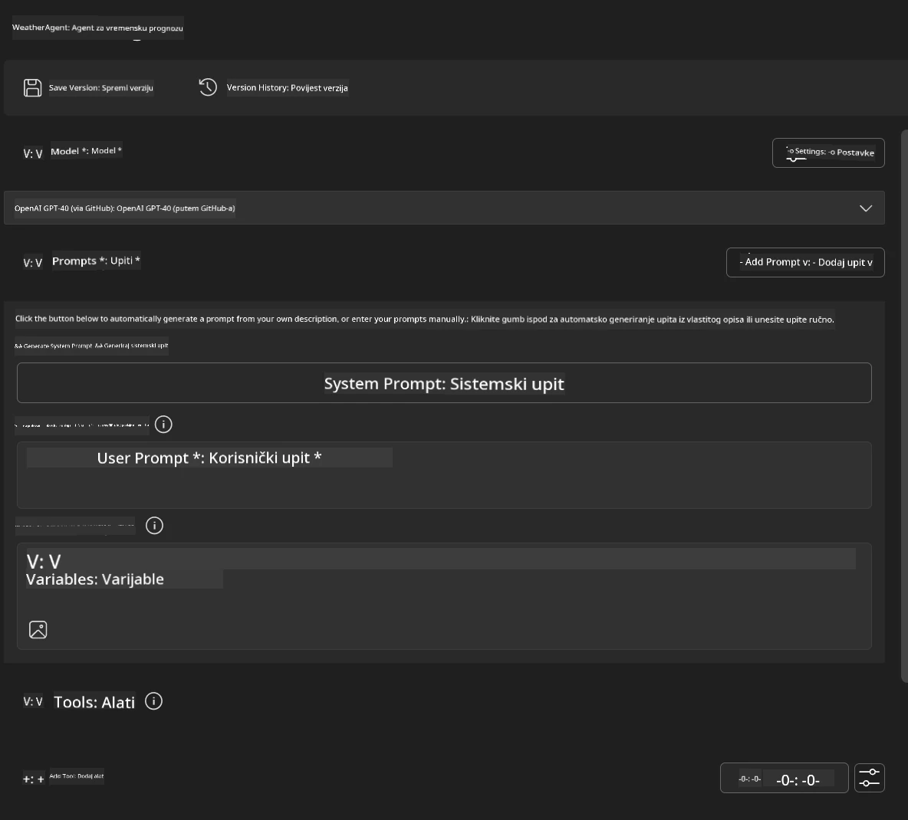
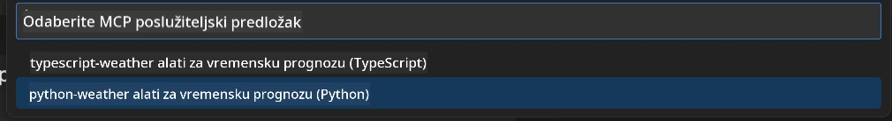
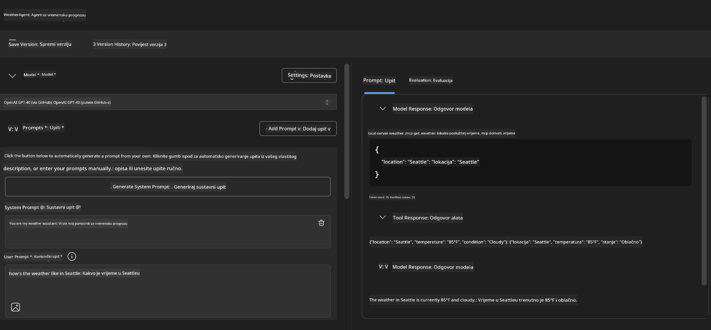
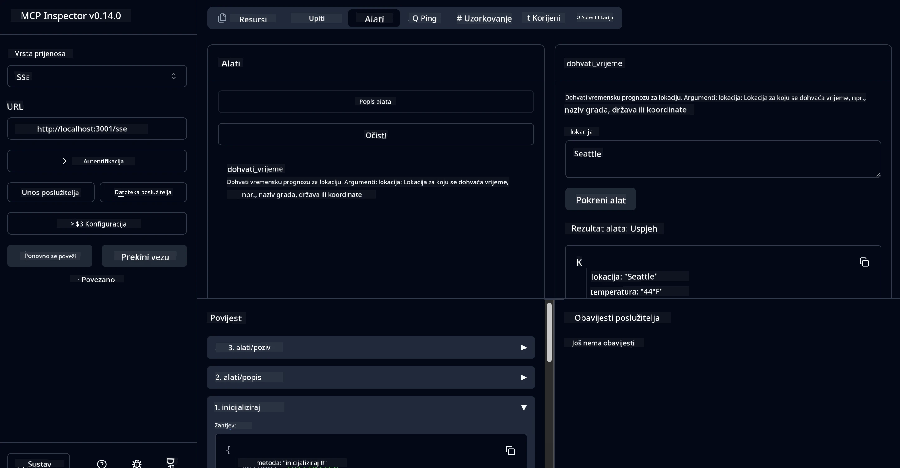

# 🔧 Modul 3: Napredni razvoj MCP-a s Microsoft Foundry Toolkitom

> [!NOTE]
> URL-ovi Inspektora u ovom laboratoriju koriste naslijeđenu `/sse` točku pristupa i ciljaju
> fiksirane ovisnosti MCP SDK-a `1.9.3` i Inspektora `0.14.0`. Nisu
> aktualni primjerci Streamable HTTP `2026-07-28`.


## 🎯 Ciljevi učenja

Do kraja ovog laboratorija moći ćete:

- ✅ Kreirati prilagođene MCP servere koristeći Microsoft Foundry Toolkit
- ✅ Konfigurirati i koristiti najnoviji MCP Python SDK (v1.9.3)
- ✅ Postaviti i koristiti MCP Inspektor za otklanjanje pogrešaka
- ✅ Otklanjati pogreške MCP servera u Agent Builderu i Inspektoru
- ✅ Razumjeti napredne tijekove rada u razvoju MCP servera

## 📋 Preduvjeti

- Završetak Laboratorija 2 (Osnove MCP-a)
- VS Code s instaliranim Microsoft Foundry Toolkit proširenjem
- Python okruženje 3.10 ili novije
- Node.js i npm za postavljanje Inspektora

## 🏗️ Što ćete izraditi

U ovom laboratoriju izradit ćete **Weather MCP Server** koji demonstrira:
- Prilagođenu implementaciju MCP servera
- Integraciju s Microsoft Foundry Toolkit Agent Builderom
- Profesionalne tijekove otklanjanja pogrešaka
- Moderne obrasce korištenja MCP SDK-a

---

## 🔧 Pregled osnovnih komponenti

### 🐍 MCP Python SDK
Model Context Protocol Python SDK pruža temelj za izgradnju prilagođenih MCP servera. Koristit ćete verziju 1.9.3 s poboljšanim mogućnostima otklanjanja pogrešaka.

### 🔍 MCP Inspektor
Moćan alat za otklanjanje pogrešaka koji pruža:
- Praćenje servera u stvarnom vremenu
- Vizualizaciju izvođenja alata
- Inspekciju mrežnih zahtjeva/odgovora
- Interaktivno testno okruženje

---

## 📖 Implementacija korak po korak

### Korak 1: Izradite WeatherAgent u Agent Builderu

1. **Pokrenite Agent Builder** u VS Codeu kroz Microsoft Foundry Toolkit ekstenziju
2. **Kreirajte novog agenta** s konfiguracijom:
   - Naziv agenta: `WeatherAgent`



### Korak 2: Inicijalizirajte MCP Server projekt

1. **Idite na Tools** → **Add Tool** u Agent Builderu
2. **Odaberite "MCP Server"** iz dostupnih opcija
3. **Izaberite "Create A new MCP Server"**
4. **Odaberite predložak `python-weather`**
5. **Nazovite svoj server:** `weather_mcp`



### Korak 3: Otvorite i pregledajte projekt

1. **Otvorite generirani projekt** u VS Codeu
2. **Pregledajte strukturu projekta:**
   ```
   weather_mcp/
   ├── src/
   │   ├── __init__.py
   │   └── server.py
   ├── inspector/
   │   ├── package.json
   │   └── package-lock.json
   ├── .vscode/
   │   ├── launch.json
   │   └── tasks.json
   ├── pyproject.toml
   └── README.md
   ```

### Korak 4: Nadogradite na najnoviji MCP SDK

> **🔍 Zašto nadograditi?** Želimo koristiti najnoviji MCP SDK (v1.9.3) i Inspektor uslugu (0.14.0) za poboljšane značajke i bolju mogućnost otklanjanja pogrešaka.

#### 4a. Ažurirajte Python ovisnosti

**Uredite `pyproject.toml`:** ažurirajte [./code/weather_mcp/pyproject.toml](../../../../10-StreamliningAIWorkflowsBuildingAnMCPServerWithAIToolkit/lab3/code/weather_mcp/pyproject.toml)


#### 4b. Ažurirajte konfiguraciju Inspektora

**Uredite `inspector/package.json`:** ažurirajte [./code/weather_mcp/inspector/package.json](../../../../10-StreamliningAIWorkflowsBuildingAnMCPServerWithAIToolkit/lab3/code/weather_mcp/inspector/package.json)

#### 4c. Ažurirajte ovisnosti Inspektora

**Uredite `inspector/package-lock.json`:** ažurirajte [./code/weather_mcp/inspector/package-lock.json](../../../../10-StreamliningAIWorkflowsBuildingAnMCPServerWithAIToolkit/lab3/code/weather_mcp/inspector/package-lock.json)

> **📝 Napomena:** Ova datoteka sadrži opsežne definicije ovisnosti. Ispod je osnovna struktura - cijeli sadržaj osigurava pravilno razrješenje ovisnosti.


> **⚡ Potpuni Package Lock:** Cjelokupna datoteka package-lock.json sadrži oko 3000 linija definicija ovisnosti. Iznad je prikazana ključna struktura - koristite danu datoteku za cjelovito razrješenje ovisnosti.

### Korak 5: Konfigurirajte otklanjanje pogrešaka u VS Codeu

*Napomena: Molimo kopirajte datoteku na naznačenoj lokaciji kako biste zamijenili odgovarajuću lokalnu datoteku*

#### 5a. Ažurirajte konfiguraciju za pokretanje

**Uredite `.vscode/launch.json`:**

```json
{
  "version": "0.2.0",
  "configurations": [
    {
      "name": "Attach to Local MCP",
      "type": "debugpy",
      "request": "attach",
      "connect": {
        "host": "localhost",
        "port": 5678
      },
      "presentation": {
        "hidden": true
      },
      "internalConsoleOptions": "neverOpen",
      "postDebugTask": "Terminate All Tasks"
    },
    {
      "name": "Launch Inspector (Edge)",
      "type": "msedge",
      "request": "launch",
      "url": "http://localhost:6274?timeout=60000&serverUrl=http://localhost:3001/sse#tools",
      "cascadeTerminateToConfigurations": [
        "Attach to Local MCP"
      ],
      "presentation": {
        "hidden": true
      },
      "internalConsoleOptions": "neverOpen"
    },
    {
      "name": "Launch Inspector (Chrome)",
      "type": "chrome",
      "request": "launch",
      "url": "http://localhost:6274?timeout=60000&serverUrl=http://localhost:3001/sse#tools",
      "cascadeTerminateToConfigurations": [
        "Attach to Local MCP"
      ],
      "presentation": {
        "hidden": true
      },
      "internalConsoleOptions": "neverOpen"
    }
  ],
  "compounds": [
    {
      "name": "Debug in Agent Builder",
      "configurations": [
        "Attach to Local MCP"
      ],
      "preLaunchTask": "Open Agent Builder",
    },
    {
      "name": "Debug in Inspector (Edge)",
      "configurations": [
        "Launch Inspector (Edge)",
        "Attach to Local MCP"
      ],
      "preLaunchTask": "Start MCP Inspector",
      "stopAll": true
    },
    {
      "name": "Debug in Inspector (Chrome)",
      "configurations": [
        "Launch Inspector (Chrome)",
        "Attach to Local MCP"
      ],
      "preLaunchTask": "Start MCP Inspector",
      "stopAll": true
    }
  ]
}
```

**Uredite `.vscode/tasks.json`:**

```
{
  "version": "2.0.0",
  "tasks": [
    {
      "label": "Start MCP Server",
      "type": "shell",
      "command": "python -m debugpy --listen 127.0.0.1:5678 src/__init__.py sse",
      "isBackground": true,
      "options": {
        "cwd": "${workspaceFolder}",
        "env": {
          "PORT": "3001"
        }
      },
      "problemMatcher": {
        "pattern": [
          {
            "regexp": "^.*$",
            "file": 0,
            "location": 1,
            "message": 2
          }
        ],
        "background": {
          "activeOnStart": true,
          "beginsPattern": ".*",
          "endsPattern": "Application startup complete|running"
        }
      }
    },
    {
      "label": "Start MCP Inspector",
      "type": "shell",
      "command": "npm run dev:inspector",
      "isBackground": true,
      "options": {
        "cwd": "${workspaceFolder}/inspector",
        "env": {
          "CLIENT_PORT": "6274",
          "SERVER_PORT": "6277",
        }
      },
      "problemMatcher": {
        "pattern": [
          {
            "regexp": "^.*$",
            "file": 0,
            "location": 1,
            "message": 2
          }
        ],
        "background": {
          "activeOnStart": true,
          "beginsPattern": "Starting MCP inspector",
          "endsPattern": "Proxy server listening on port"
        }
      },
      "dependsOn": [
        "Start MCP Server"
      ]
    },
    {
      "label": "Open Agent Builder",
      "type": "shell",
      "command": "echo ${input:openAgentBuilder}",
      "presentation": {
        "reveal": "never"
      },
      "dependsOn": [
        "Start MCP Server"
      ],
    },
    {
      "label": "Terminate All Tasks",
      "command": "echo ${input:terminate}",
      "type": "shell",
      "problemMatcher": []
    }
  ],
  "inputs": [
    {
      "id": "openAgentBuilder",
      "type": "command",
      "command": "ai-mlstudio.agentBuilder",
      "args": {
        "initialMCPs": [ "local-server-weather_mcp" ],
        "triggeredFrom": "vsc-tasks"
      }
    },
    {
      "id": "terminate",
      "type": "command",
      "command": "workbench.action.tasks.terminate",
      "args": "terminateAll"
    }
  ]
}
```


---

## 🚀 Pokretanje i testiranje vašeg MCP servera

### Korak 6: Instalirajte ovisnosti

Nakon što napravite promjene u konfiguraciji, izvršite sljedeće naredbe:

**Instalirajte Python ovisnosti:**
```bash
uv sync
```

**Instalirajte Inspektor ovisnosti:**
```bash
cd inspector
npm install
```

### Korak 7: Otklanjajte pogreške u Agent Builderu

1. **Pritisnite F5** ili koristite konfiguraciju **"Debug in Agent Builder"**
2. **Odaberite složenu konfiguraciju** iz debug panela
3. **Pričekajte da se server pokrene** i otvori Agent Builder
4. **Testirajte svoj weather MCP server** prirodnim jezičnim upitima

Unesite upit poput ovoga

SYSTEM_PROMPT

```
You are my weather assistant
```

USER_PROMPT

```
How's the weather like in Seattle
```



### Korak 8: Otklanjajte pogreške s MCP Inspektorom

1. **Koristite konfiguraciju "Debug in Inspector"** (Edge ili Chrome)
2. **Otvorite Inspektor sučelje** na `http://localhost:6274`
3. **Istražite interaktivno testno okruženje:**
   - Pregledajte dostupne alate
   - Testirajte izvođenje alata
   - Pratite mrežne zahtjeve
   - Otklanjajte pogreške odgovora servera



---

## 🎯 Ključni ishodi učenja

Završetkom ovog laboratorija ste:

- [x] **Kreirali prilagođeni MCP server** pomoću Microsoft Foundry Toolkit predložaka
- [x] **Nadogradili na najnoviji MCP SDK** (v1.9.3) za poboljšanu funkcionalnost
- [x] **Konfigurirali profesionalne tijekove otklanjanja pogrešaka** za Agent Builder i Inspektor
- [x] **Postavili MCP Inspektor** za interaktivno testiranje servera
- [x] **Ovladali VS Code konfiguracijama za otklanjanje pogrešaka** za razvoj MCP-a

## 🔧 Istražene napredne značajke

| Značajka | Opis | Primjena |
|---------|-------------|----------|
| **MCP Python SDK v1.9.3** | Najnovija implementacija protokola | Moderan razvoj servera |
| **MCP Inspektor 0.14.0** | Interaktivni alat za otklanjanje pogrešaka | Testiranje servera u stvarnom vremenu |
| **VS Code Debugging** | Integrirano razvojno okruženje | Profesionalni tijek rada otklanjanja pogrešaka |
| **Integracija s Agent Builderom** | Izravna veza Microsoft Foundry Toolkita | Testiranje agenata od kraja do kraja |

## 📚 Dodatni resursi

- [Dokumentacija MCP Python SDK-a](https://modelcontextprotocol.io/docs/sdk/python)
- [Vodič za Microsoft Foundry Toolkit ekstenziju](https://code.visualstudio.com/docs/ai/ai-toolkit)
- [Dokumentacija za otklanjanje pogrešaka u VS Codeu](https://code.visualstudio.com/docs/editor/debugging)
- [Specifikacija Model Context Protocola](https://modelcontextprotocol.io/docs/concepts/architecture)

---

**🎉 Čestitamo!** Uspješno ste završili Laboratorij 3 i sada možete kreirati, otklanjati pogreške i implementirati prilagođene MCP servere koristeći profesionalne tijekove rada.

### 🔜 Nastavite na sljedeći modul

Spremni ste primijeniti svoje MCP vještine u stvarnom razvojnom tijeku? Nastavite na **[Modul 4: Praktični razvoj MCP-a - Prilagođeni GitHub Clone Server](../lab4/README.md)** gdje ćete:
- Izgraditi MCP server spreman za produkciju koji automatizira operacije GitHub repozitorija
- Implementirati funkcionalnost kloniranja GitHub repozitorija putem MCP-a
- Integrirati prilagođene MCP servere s VS Codeom i GitHub Copilot Agent načinom rada
- Testirati i implementirati prilagođene MCP servere u produkcijskim okruženjima
- Naučiti praktičnu automatizaciju tijekova rada za developere

---

<!-- CO-OP TRANSLATOR DISCLAIMER START -->
**Napomena**:
Ovaj dokument je preveden korištenjem AI prevoditeljskog servisa [Co-op Translator](https://github.com/Azure/co-op-translator). Iako težimo točnosti, imajte na umu da automatski prijevodi mogu sadržavati greške ili netočnosti. Izvorni dokument na izvornom jeziku treba smatrati autoritativnim izvorom. Za važne informacije preporuča se profesionalni ljudski prijevod. Nismo odgovorni za bilo kakva nesporazumevanja ili pogrešne interpretacije koje proizlaze iz korištenja ovog prijevoda.
<!-- CO-OP TRANSLATOR DISCLAIMER END -->