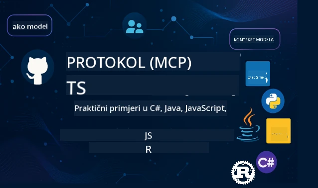

 

[](https://GitHub.com/microsoft/mcp-for-beginners/graphs/contributors)
[](https://GitHub.com/microsoft/mcp-for-beginners/issues)
[](https://GitHub.com/microsoft/mcp-for-beginners/pulls)
[](http://makeapullrequest.com)

[](https://GitHub.com/microsoft/mcp-for-beginners/watchers)
[](https://GitHub.com/microsoft/mcp-for-beginners/fork)
[](https://GitHub.com/microsoft/mcp-for-beginners/stargazers)


[](https://discord.gg/nTYy5BXMWG)

Slijedite ove korake da biste započeli s korištenjem ovih resursa:
1. **Forkajte repozitorij**: Kliknite [](https://GitHub.com/microsoft/mcp-for-beginners/fork)
2. **Klonirajte repozitorij**: `git clone https://github.com/microsoft/mcp-for-beginners.git`
3. **Pridružite se** [](https://discord.gg/nTYy5BXMWG)


### 🌐 Višejezična podrška

#### Podržano putem GitHub Action (Automatski i uvijek ažurirano)

<!-- CO-OP TRANSLATOR LANGUAGES TABLE START -->
[Arabic](../ar/README.md) | [Bengali](../bn/README.md) | [Bulgarian](../bg/README.md) | [Burmese (Myanmar)](../my/README.md) | [Chinese (Simplified)](../zh-CN/README.md) | [Chinese (Traditional, Hong Kong)](../zh-HK/README.md) | [Chinese (Traditional, Macau)](../zh-MO/README.md) | [Chinese (Traditional, Taiwan)](../zh-TW/README.md) | [Croatian](./README.md) | [Czech](../cs/README.md) | [Danish](../da/README.md) | [Dutch](../nl/README.md) | [Estonian](../et/README.md) | [Finnish](../fi/README.md) | [French](../fr/README.md) | [German](../de/README.md) | [Greek](../el/README.md) | [Hebrew](../he/README.md) | [Hindi](../hi/README.md) | [Hungarian](../hu/README.md) | [Indonesian](../id/README.md) | [Italian](../it/README.md) | [Japanese](../ja/README.md) | [Kannada](../kn/README.md) | [Korean](../ko/README.md) | [Lithuanian](../lt/README.md) | [Malay](../ms/README.md) | [Malayalam](../ml/README.md) | [Marathi](../mr/README.md) | [Nepali](../ne/README.md) | [Nigerian Pidgin](../pcm/README.md) | [Norwegian](../no/README.md) | [Persian (Farsi)](../fa/README.md) | [Polish](../pl/README.md) | [Portuguese (Brazil)](../pt-BR/README.md) | [Portuguese (Portugal)](../pt-PT/README.md) | [Punjabi (Gurmukhi)](../pa/README.md) | [Romanian](../ro/README.md) | [Russian](../ru/README.md) | [Serbian (Cyrillic)](../sr/README.md) | [Slovak](../sk/README.md) | [Slovenian](../sl/README.md) | [Spanish](../es/README.md) | [Swahili](../sw/README.md) | [Swedish](../sv/README.md) | [Tagalog (Filipino)](../tl/README.md) | [Tamil](../ta/README.md) | [Telugu](../te/README.md) | [Thai](../th/README.md) | [Turkish](../tr/README.md) | [Ukrainian](../uk/README.md) | [Urdu](../ur/README.md) | [Vietnamese](../vi/README.md)

> **Preferirate lokalno kloniranje?**

> Ovaj repozitorij uključuje preko 50 prijevoda na različite jezike što značajno povećava veličinu preuzimanja. Za kloniranje bez prijevoda, koristite sparse checkout:
> ```bash
> git clone --filter=blob:none --sparse https://github.com/microsoft/mcp-for-beginners.git
> cd mcp-for-beginners
> git sparse-checkout set --no-cone '/*' '!translations' '!translated_images'
> ```
> Ovo vam daje sve što vam treba za dovršetak tečaja uz mnogo brže preuzimanje.
<!-- CO-OP TRANSLATOR LANGUAGES TABLE END -->

# 🚀 Nastavni plan Model Context Protokola (MCP) za početnike

## **Naučite MCP kroz praktične primjere koda u C#, Java, JavaScript, Rust, Python i TypeScript**

## 🧠 Pregled nastavnog plana Model Context Protokola
Dobrodošli na svoje putovanje u Model Context Protocol! Ako ste se ikad pitali kako AI aplikacije komuniciraju s različitim alatima i uslugama, upravo ćete otkriti elegantno rješenje koje mijenja način na koji programeri grade inteligentne sustave.

Zamislite MCP kao univerzalni prevoditelj za AI aplikacije – baš kao što USB priključci omogućuju povezivanje bilo kojeg uređaja s vašim računalom, MCP omogućava AI modelima da se povežu s bilo kojim alatom ili uslugom na standardizirani način. Bilo da gradite svog prvog chatbota ili radite na složenim AI tijekovima rada, razumijevanje MCP-a dat će vam moć stvaranja sposobnijih i fleksibilnijih aplikacija.

Ovaj nastavni plan je osmišljen s pažnjom i strpljenjem za vaše učenje. Počinjemo s jednostavnim konceptima koje već razumijete i postupno gradimo vašu stručnost kroz praktične vježbe u vašem omiljenom programskom jeziku. Svaki korak uključuje jasna objašnjenja, praktične primjere i mnogo poticaja na putu.

Do kraja ovog putovanja imat ćete samopouzdanja za izradu vlastitih MCP servera, njihovu integraciju s popularnim AI platformama i razumjet ćete kako ova tehnologija preoblikuje budućnost razvoja AI. Krenimo zajedno na ovu uzbudljivu avanturu!

### Službena dokumentacija i specifikacije

Ovi resursi postaju vrijedniji kako rastete u razumijevanju, ali nemojte se osjećati pod pritiskom da odmah pročitate sve. Započnite s područjima koja vas najviše zanimaju!
- 📘 [MCP Dokumentacija](https://modelcontextprotocol.io/) – Ovo je vaš glavni izvor korak-po-korak vodiča i korisničkih uputa. Dokumentacija je pisana imajući na umu početnike, pružajući jasne primjere koje možete pratiti vlastitim tempom.
- 📜 [MCP Specifikacija](https://modelcontextprotocol.io/docs/) – Smatrajte ovo svojim opširnim priručnikom za referencu. Kako budete napredovali kroz nastavni plan, vraćat ćete se ovdje radi traženja specifičnih detalja i istraživanja naprednih značajki.
- 📜 [Izvorna MCP Specifikacija](https://modelcontextprotocol.io/specification/versioning) – Sadrži dodatne tehničke detalje koji mogu biti korisni za napredne implementacije. Tu je ako vam zatreba, ali nemojte brinuti o tome na početku.
- 🧑‍💻 [MCP GitHub Repozitorij](https://github.com/modelcontextprotocol) – Ovdje ćete pronaći SDK-ove, alate i primjere koda na više programskih jezika. To je poput riznice praktičnih primjera i komponenti spremnih za uporabu.
- 🌐 [MCP Zajednica](https://github.com/orgs/modelcontextprotocol/discussions) – Pridružite se drugim učenicima i iskusnim programerima u raspravama o MCP-u. To je poticajna zajednica gdje su pitanja dobrodošla i znanje se slobodno dijeli.
  
## Ciljevi učenja

Na kraju ovog nastavnog plana, osjećat ćete se samopouzdano i uzbuđeno zbog svojih novih sposobnosti. Evo što ćete postići:

• **Razumjeti osnove MCP-a**: Shvatit ćete što je Model Context Protocol i zašto mijenja način kako AI aplikacije surađuju, koristeći analogije i primjere koji su jasni.

• **Izraditi svoj prvi MCP server**: Stvorit ćete funkcionalni MCP server u svom odabranom programskom jeziku, krećući se od jednostavnih primjera do sve složenijih vještina.

• **Povezati AI modele s pravim alatima**: Naučit ćete kako premostiti jaz između AI modela i stvarnih usluga, dajući vašim aplikacijama moćne nove mogućnosti.

• **Implementirati najbolje sigurnosne prakse**: Razumjet ćete kako zadržati svoje MCP implementacije sigurnim i zaštićenim, čuvajući i aplikacije i korisnike.

• **Sigurno implementirati**: Znati ćete kako prenijeti svoje MCP projekte iz razvoja do produkcije, koristeći praktične strategije implementacije koje djeluju u stvarnom svijetu.

• **Pridružiti se MCP zajednici**: Postat ćete dio rastuće zajednice programera koji oblikuju budućnost razvoja AI aplikacija.

## Neophodno predznanje

Prije nego što zaronimo u specifičnosti MCP-a, osigurajmo da se dobro osjećate s nekim temeljim konceptima. Ne brinite ako niste stručnjak u ovim područjima – sve ćemo objasniti kako korakamo naprijed!

### Razumijevanje protokola (Temelj)

Zamislite protokol kao pravila za razgovor. Kad nazovete prijatelja, oboje znate reći "bok" na početku, naizmjenično govoriti i reći "zbogom" na kraju. Računalni programi trebaju slična pravila da bi učinkovito komunicirali.

MCP je protokol – skup dogovorenih pravila koja pomažu AI modelima i aplikacijama imati produktivne "razgovore" s alatima i uslugama. Baš kao što pravila razgovora olakšavaju ljudsku komunikaciju, MCP čini komunikaciju AI aplikacija mnogo pouzdanijom i snažnijom.

### Odnosi klijent-server (Kako programi surađuju)

Svakodnevno koristite odnose klijent-server! Kad koristite web preglednik (klijent) za posjet web stranici, povezujete se s web serverom koji vam šalje sadržaj stranice. Preglednik zna kako zatražiti informacije, a server zna kako odgovoriti.

U MCP-u imamo sličan odnos: AI modeli djeluju kao klijenti koji zahtijevaju informacije ili akcije, dok MCP serveri pružaju te mogućnosti. To je poput pomoćnika (servera) kojeg AI može zamoliti da izvrši određene zadatke.

### Zašto je standardizacija važna (Jednostavnija suradnja)

Zamislite da svaki proizvođač automobila koristi različite oblike dizel pumpi – trebali biste poseban adapter za svaki automobil! Standardizacija znači dogovoriti se oko zajedničkih pristupa kako bi stvari funkcionirale bez problema.

MCP osigurava tu standardizaciju za AI aplikacije. Umjesto da svaki AI model treba poseban kod za rad sa svakim alatom, MCP stvara univerzalni način komunikacije. To znači da programeri mogu izraditi alat jednom i koristiti ga s mnogo različitih AI sustava.

## 🧭 Pregled vašeg puta učenja

Vaše MCP putovanje pažljivo je strukturirano kako bi postupno gradili vaše samopouzdanje i vještine. Svaka faza uvodi nove koncepte dok jača ono što ste već naučili.

### 🌱 Faza temelja: Razumijevanje osnova (Moduli 0-2)

Ovdje počinje vaša avantura! Uvest ćemo vas u koncepte MCP-a koristeći poznate analogije i jednostavne primjere. Shvatit ćete što je MCP, zašto postoji i kako se uklapa u širi svijet razvoja AI.

• **Modul 0 - Uvod u MCP**: Počinjemo istražujući što je MCP i zašto je toliko važan za modernu AI aplikaciju. Vidjet ćete primjere MCP-a u stvarnom svijetu i razumjeti kako rješava uobičajene probleme s kojima se programeri suočavaju.

• **Modul 1 - Objašnjeni osnovni koncepti**: Ovdje ćete naučiti osnovne gradivne blokove MCP-a. Koristit ćemo mnogo analogija i vizualnih primjera kako bi ovi koncepti bili prirodni i razumljivi.

• **Modul 2 - Sigurnost u MCP-u**: Sigurnost može zvučati zastrašujuće, ali pokazat ćemo vam kako MCP uključuje ugrađene značajke sigurnosti i naučiti vas najboljim praksama koje štite vaše aplikacije od samog početka.

### 🔨 Faza izgradnje: Izrada vaših prvih implementacija (Modul 3)

Sada počinje prava zabava! Dobit ćete praktično iskustvo u izgradnji stvarnih MCP servera i klijenata. Ne brinite – krenut ćemo jednostavno i voditi vas kroz svaki korak.

Ovaj modul uključuje višestruke vodiče s praktičnim radom koji vam omogućuju vježbanje u vašem omiljenom programskom jeziku. Izradit ćete svoj prvi server, napraviti klijenta koji se povezuje s njim i čak se integrirati s popularnim alatima za razvoj poput VS Code.
Svaki vodič uključuje potpune primjere koda, savjete za otklanjanje poteškoća i objašnjenja zašto donosimo određene dizajnerske odluke. Na kraju ove faze imat ćete funkcionalne implementacije MCP-a na koje možete biti ponosni!

### 🚀 Faza rasta: Napredni koncepti i primjena u stvarnom svijetu (Moduli 4-5)

Nakon što savladate osnove, spremni ste istražiti sofisticiranije mogućnosti MCP-a. Obradit ćemo praktične strategije implementacije, tehnike otklanjanja pogrešaka i napredne teme poput integracije višemodalne AI.

Također ćete naučiti kako skalirati svoje MCP implementacije za produkcijsku upotrebu i integrirati se s cloud platformama poput Azure. Ovi moduli vas pripremaju za izgradnju MCP rješenja koja mogu udovoljiti zahtjevima stvarnog svijeta.

### 🌟 Faza majstorstva: Zajednica i specijalizacija (Moduli 6-11)

Završna faza usmjerena je na pridruživanje MCP zajednici i specijalizaciju u područjima koja vas najviše zanimaju. Naučit ćete kako doprinijeti open-source MCP projektima, implementirati napredne obrasce autentikacije i izgraditi sveobuhvatna rješenja integrirana s bazama podataka.

Modul 11 zaslužuje posebno spominjanje - to je potpuni praktični put učenja kroz 13 laboratorijskih vježbi koji vas uči kako izgraditi produkcijski spremne MCP poslužitelje s PostgreSQL integracijom. To je poput završnog projekta koji povezuje sve što ste naučili!

### 📚 Struktura cjelokupnog kurikuluma

| Modul | Tema | Opis | Link |
|--------|-------|-------------|------|
| **Moduli 1-3: Osnove** | | | |
| 00 | Uvod u MCP | Pregled Model Context Protocol i njegov značaj u AI procesima | [Pročitaj više](./00-Introduction/README.md) |
| 01 | Objašnjeni osnovni koncepti | Detaljno istraživanje osnovnih MCP koncepata | [Pročitaj više](./01-CoreConcepts/README.md) |
| 02 | Sigurnost u MCP | Sigurnosne prijetnje i najbolje prakse | [Pročitaj više](./02-Security/README.md) |
| 03 | Početak rada s MCP | Postavljanje okruženja, osnovni poslužitelji/klijenti, integracija | [Pročitaj više](./03-GettingStarted/README.md) |
| **Modul 3: Izgradnja prvog poslužitelja i klijenta** | | | |
| 3.1 | Prvi poslužitelj | Kreirajte svoj prvi MCP poslužitelj | [Vodič](./03-GettingStarted/01-first-server/README.md) |
| 3.2 | Prvi klijent | Razvijte osnovni MCP klijent | [Vodič](./03-GettingStarted/02-client/README.md) |
| 3.3 | Klijent s LLM-om | Integrirajte velike jezične modele | [Vodič](./03-GettingStarted/03-llm-client/README.md) |
| 3.4 | Integracija u VS Code | Koristite MCP poslužitelje u VS Code | [Vodič](./03-GettingStarted/04-vscode/README.md) |
| 3.5 | stdio poslužitelj | Kreirajte poslužitelje koristeći stdio transport | [Vodič](./03-GettingStarted/05-stdio-server/README.md) |
| 3.6 | HTTP streaming | Implementirajte streaming preko HTTP u MCP | [Vodič](./03-GettingStarted/06-http-streaming/README.md) |
| 3.7 | AI Toolkit | Koristite AI Toolkit s MCP-om | [Vodič](./03-GettingStarted/07-aitk/README.md) |
| 3.8 | Testiranje | Testirajte svoju MCP implementaciju poslužitelja | [Vodič](./03-GettingStarted/08-testing/README.md) |
| 3.9 | Deploy | Postavite MCP poslužitelje u produkciju | [Vodič](./03-GettingStarted/09-deployment/README.md) |
| 3.10 | Napredna uporaba poslužitelja | Koristite napredne poslužitelje za proširene funkcije i poboljšanu arhitekturu | [Vodič](./03-GettingStarted/10-advanced/README.md) |
| 3.11 | Jednostavna autentikacija | Poglavlje koje pokazuje autentikaciju od početka i RBAC | [Vodič](./03-GettingStarted/11-simple-auth/README.md) |
| **Moduli 4-5: Praktično & Napredno** | | | |
| 04 | Praktična implementacija | SDK-ovi, otklanjanje pogrešaka, testiranje, ponovno upotrebljivi predlošci | [Pročitaj više](./04-PracticalImplementation/README.md) |
| 05 | Napredne teme u MCP | Višemodalna AI, skaliranje, upotreba u poduzećima | [Pročitaj više](./05-AdvancedTopics/README.md) |
| 5.1 | Azure integracija | MCP integracija s Azureom | [Vodič](./05-AdvancedTopics/mcp-integration/README.md) |
| 5.2 | Višemodalnost | Rad s više modaliteta | [Vodič](./05-AdvancedTopics/mcp-multi-modality/README.md) |
| 5.3 | OAuth2 demo | Implementirajte OAuth2 autentikaciju | [Vodič](./05-AdvancedTopics/mcp-oauth2-demo/README.md) |
| 5.4 | Root konteksti | Razumijevanje i implementacija root konteksta | [Vodič](./05-AdvancedTopics/mcp-root-contexts/README.md) |
| 5.5 | Rutiranje | Strategije rutiranja u MCP-u | [Vodič](./05-AdvancedTopics/mcp-routing/README.md) |
| 5.6 | Uzorkovanje | Tehnike uzorkovanja u MCP-u | [Vodič](./05-AdvancedTopics/mcp-sampling/README.md) |
| 5.7 | Skaliranje | Skaliranje MCP implementacija | [Vodič](./05-AdvancedTopics/mcp-scaling/README.md) |
| 5.8 | Sigurnost | Napredne sigurnosne mjere | [Vodič](./05-AdvancedTopics/mcp-security/README.md) |
| 5.9 | Web pretraživanje | Implementirajte mogućnosti pretraživanja weba | [Vodič](./05-AdvancedTopics/web-search-mcp/README.md) |
| 5.10 | Realtime streaming | Izgradite funkcionalnost streaminga u stvarnom vremenu | [Vodič](./05-AdvancedTopics/mcp-realtimestreaming/README.md) |
| 5.11 | Realtime pretraživanje | Implementirajte pretraživanje u stvarnom vremenu | [Vodič](./05-AdvancedTopics/mcp-realtimesearch/README.md) |
| 5.12 | Entra ID autentikacija | Autentikacija s Microsoft Entra ID | [Vodič](./05-AdvancedTopics/mcp-security-entra/README.md) |
| 5.13 | Foundry integracija | Integracija s Azure AI Foundry | [Vodič](./05-AdvancedTopics/mcp-foundry-agent-integration/README.md) |
| 5.14 | Inženjering konteksta | Tehnike učinkovitog inženjeringa konteksta | [Vodič](./05-AdvancedTopics/mcp-contextengineering/README.md) |
| 5.15 | MCP prilagođeni transport | Implementacije prilagođenog transporta | [Vodič](./05-AdvancedTopics/mcp-transport/README.md) |
| **Moduli 6-10: Zajednica i najbolje prakse** | | | |
| 06 | Zajednički doprinosi | Kako doprinijeti MCP ekosustavu | [Vodič](./06-CommunityContributions/README.md) |
| 07 | Naučene lekcije iz ranog usvajanja | Priče o implementaciji u stvarnom svijetu | [Vodič](./07-LessonsFromEarlyAdoption/README.md) |
| 08 | Najbolje prakse za MCP | Performanse, otpornost na pogreške, izdržljivost | [Vodič](./08-BestPractices/README.md) |
| 09 | Studije slučaja MCP | Primjeri praktične implementacije | [Vodič](./09-CaseStudy/README.md) |
| 10 | Radionica uživo | Izgradnja MCP poslužitelja s AI Toolkitom | [Lab](./10-StreamliningAIWorkflowsBuildingAnMCPServerWithAIToolkit/README.md) |
| **Modul 11: MCP poslužitelj praktični laboratorij** | | | |
| 11 | Integracija MCP poslužitelja s bazom podataka | Sveobuhvatan put učenja kroz 13 laboratorijskih vježbi za PostgreSQL integraciju | [Laboratoriji](./11-MCPServerHandsOnLabs/README.md) |
| 11.1 | Uvod | Pregled MCP-a s integracijom baze podataka i slučaj analitike maloprodaje | [Lab 00](./11-MCPServerHandsOnLabs/00-Introduction/README.md) |
| 11.2 | Osnovna arhitektura | Razumijevanje arhitekture MCP poslužitelja, slojevi baze podataka i sigurnosni obrasci | [Lab 01](./11-MCPServerHandsOnLabs/01-Architecture/README.md) |
| 11.3 | Sigurnost i multi-tenancy | Row Level Security, autentikacija i pristup podacima za više korisnika | [Lab 02](./11-MCPServerHandsOnLabs/02-Security/README.md) |
| 11.4 | Postavljanje okruženja | Postavljanje razvojnih alata, Docker, Azure resursi | [Lab 03](./11-MCPServerHandsOnLabs/03-Setup/README.md) |
| 11.5 | Dizajn baze podataka | Postavljanje PostgreSQL, dizajn maloprodajnog shema i uzorci podataka | [Lab 04](./11-MCPServerHandsOnLabs/04-Database/README.md) |
| 11.6 | Implementacija MCP poslužitelja | Izgradnja FastMCP poslužitelja s integracijom baze podataka | [Lab 05](./11-MCPServerHandsOnLabs/05-MCP-Server/README.md) |
| 11.7 | Razvoj alata | Kreiranje alata za upite baze podataka i introspekciju sheme | [Lab 06](./11-MCPServerHandsOnLabs/06-Tools/README.md) |
| 11.8 | Semantičko pretraživanje | Implementacija vektorskih ugradnji s Azure OpenAI i pgvector | [Lab 07](./11-MCPServerHandsOnLabs/07-Semantic-Search/README.md) |
| 11.9 | Testiranje i otklanjanje pogrešaka | Strategije testiranja, alati za debug i pristupi validaciji | [Lab 08](./11-MCPServerHandsOnLabs/08-Testing/README.md) |
| 11.10 | Integracija s VS Code | Konfiguracija MCP integracije u VS Code i korištenje AI Chata | [Lab 09](./11-MCPServerHandsOnLabs/09-VS-Code/README.md) |
| 11.11 | Strategije implementacije | Docker deploy, Azure Container Apps i razmatranja o skaliranju | [Lab 10](./11-MCPServerHandsOnLabs/10-Deployment/README.md) |
| 11.12 | Praćenje | Application Insights, logiranje, nadzor performansi | [Lab 11](./11-MCPServerHandsOnLabs/11-Monitoring/README.md) |
| 11.13 | Najbolje prakse | Optimizacija performansi, sigurnosno učvršćivanje i savjeti za produkciju | [Lab 12](./11-MCPServerHandsOnLabs/12-Best-Practices/README.md) |

### 💻 Primjeri kodnih projekata

Jedan od najuzbudljivijih dijelova učenja MCP-a je vidjeti kako vaše vještine koda progresivno rastu. Dizajnirali smo naše primjere koda da počnu jednostavno i postaju sofisticiraniji kako vam razumijevanje produbljuje. Evo kako uvodimo koncepte - s kodom koji je lagan za shvatiti, a pokazuje stvarne MCP principe, razumjet ćete ne samo što kod radi, nego i zašto je strukturiran tako te kako se uklapa u veće MCP aplikacije.

#### Osnovni primjeri MCP kalkulatora

| Jezik | Opis | Link |
|----------|-------------|------|
| C# | Primjer MCP poslužitelja | [Pogledaj kod](./03-GettingStarted/samples/csharp/README.md) |
| Java | MCP kalkulator | [Pogledaj kod](./03-GettingStarted/samples/java/calculator/README.md) |
| JavaScript | MCP demo | [Pogledaj kod](./03-GettingStarted/samples/javascript/README.md) |
| Python | MCP poslužitelj | [Pogledaj kod](../../03-GettingStarted/samples/python/mcp_calculator_server.py) |
| TypeScript | MCP primjer | [Pogledaj kod](./03-GettingStarted/samples/typescript/README.md) |
| Rust | MCP primjer | [Pogledaj kod](./03-GettingStarted/samples/rust/README.md) |

#### Napredne MCP implementacije

| Jezik | Opis | Link |
|----------|-------------|------|
| C# | Napredni primjer | [Pogledaj kod](./04-PracticalImplementation/samples/csharp/README.md) |
| Java sa Springom | Primjer Container App | [Pogledaj kod](./04-PracticalImplementation/samples/java/containerapp/README.md) |
| JavaScript | Napredni primjer | [Pogledaj kod](./04-PracticalImplementation/samples/javascript/README.md) |
| Python | Složena implementacija | [Pogledaj kod](../../04-PracticalImplementation/samples/python/READMEmd) |
| TypeScript | Primjer Container | [Pogledaj kod](./04-PracticalImplementation/samples/typescript/README.md) |


## 🎯 Preduvjeti za učenje MCP-a

Da biste maksimalno iskoristili ovaj kurikulum, trebate imati:

- Osnovno znanje programiranja u barem jednom od sljedećih jezika: C#, Java, JavaScript, Python ili TypeScript
- Razumijevanje modela klijent-poslužitelj i API-ja
- Poznavanje REST i HTTP koncepata
- (Neobavezno) Pozadina u AI/ML konceptima

- Sudjelovanje u raspravama naše zajednice za podršku

## 📚 Vodič za učenje i resursi

Ovaj repozitorij uključuje nekoliko resursa koji će vam pomoći da se učinkovito snalazite i učite:

### Vodič za učenje

Dostupan je sveobuhvatan [Vodič za učenje](./study_guide.md) koji vam pomaže učinkovito upravljati ovim repozitorijem. Ova vizualna mapa kurikuluma pokazuje kako su sve teme povezane i daje smjernice kako koristiti primjere projekata. Posebno je koristan ako ste vizualni učenik koji voli vidjeti cjelokupnu sliku.

Vodič uključuje:
- Vizualnu mapu kurikuluma koja prikazuje sve obrađene teme
- Detaljnu podjelu svakog dijela repozitorija
- Upute kako koristiti primjere projekata
- Preporučene putove učenja za različite razine vještina
- Dodatne resurse koji dopunjuju vaš proces učenja

### Dnevnik promjena

Održavamo detaljan [Dnevnik promjena](./changelog.md) koji prati sve značajne izmjene kurikulumskih materijala, tako da možete biti u toku s najnovijim poboljšanjima i dodacima.
- Dodavanje novog sadržaja
- Strukturne promjene
- Poboljšanja značajki
- Ažuriranja dokumentacije

## 🛠️ Kako učinkovito koristiti ovaj kurikulum

Svaka lekcija u ovom vodiču uključuje:
1. Jasna objašnjenja MCP koncepata  
2. Primjeri koda uživo na više jezika  
3. Vježbe za izradu pravih MCP aplikacija  
4. Dodatni resursi za napredne učenike

## Sadržaj na zahtjev

### [MCP Dev Days srpanj 2025](https://developer.microsoft.com/en-us/reactor/series/S-1563/)
#### [➡️Pogledaj na zahtjev - MCP Dev Days](https://developer.microsoft.com/en-us/reactor/series/S-1563/)
Pripremite se za dva dana dubinskog tehničkog uvida, povezivanja zajednice i praktičnog učenja na MCP Dev Days, virtualnom događaju posvećenom Model Context Protocolu (MCP) — novom standardu koji povezuje AI modele i alate na kojima ovise.
MCP Dev Days možete pratiti registracijom na našoj stranici događaja: https://aka.ms/mcpdevdays. 

#### [Dan 1: Produktivnost MCP-a, razvojni alati i zajednica:](https://developer.microsoft.com/en-us/reactor/series/S-1563/)

Posvećen je osnaživanju programera za korištenje MCP-a u njihovom razvojnom tijeku i obilježavanju nevjerojatne MCP zajednice. Pridružit će nam se članovi zajednice i partneri poput Arcade, Block, Okta i Neon kako bi pokazali kako surađuju s Microsoftom na oblikovanju otvorenog, proširivog MCP ekosustava. Prikazi iz stvarnog svijeta kroz VS Code, Visual Studio, GitHub Copilot i popularne alate zajednice  
Praktični, kontekstualno vođeni razvojni tijekovi  
Sjednice i uvidi pod vodstvom zajednice  
Bilo da tek počinjete s MCP-om ili već radite na njemu, Dan 1 će postaviti temelje inspiracije i korisnih spoznaja.

#### [Dan 2: Izgradite MCP servere s povjerenjem](https://developer.microsoft.com/en-us/reactor/series/S-1563/)

Namijenjen je kreatorima MCP-a. Dubinski ćemo istražiti strategije provedbe i najbolje prakse za izradu MCP servera i integraciju MCP-a u vaše AI radne tokove.

#### Teme uključuju:

- Izrada MCP servera i integracija u iskustva agenata  
- Razvoj vođen uputama (prompt-driven)  
- Najbolje sigurnosne prakse  
- Korištenje gradivnih blokova poput Functions, ACA i API Management  
- Usklađivanje registara i alati (1P + 3P)

Ako ste programer, izrađivač alata ili strateg proizvoda AI-a, ovaj dan je prepun uvida potrebnih za izradu skalabilnih, sigurnih i budućih MCP rješenja.

### MCP Boot Camp kolovoz 2025
Naučite u intenzivnim video sesijama kako stvoriti MCP servere, integrirati ih s VS Code i profesionalno ih postaviti na Azure bazirano na sadržaju iz kurikuluma MCP za početnike. Steknite praktične vještine u tehnologiji koju već koriste velike tvrtke.

#### [➡️Pogledaj na zahtjev MCP Bootcamp | Engleski](https://developer.microsoft.com/en-us/reactor/series/s-1568/)
#### [➡️Pogledaj na zahtjev MCP Bootcamp | Brasil](https://developer.microsoft.com/en-us/reactor/series/S-1566/)
#### [➡️Pogledaj na zahtjev MCP Bootcamp | Španjolski](https://developer.microsoft.com/en-us/reactor/series/S-1567/)

### Učimo MCP s C# - serija tutorijala
Upoznajte Model Context Protocol (MCP), suvremeni okvir dizajniran za standardizaciju interakcija između AI modela i klijentskih aplikacija. Kroz ovaj prijateljski uvodni tečaj predstavit ćemo vam MCP i voditi vas kroz kreiranje vašeg prvog MCP servera.  
#### C#: [https://aka.ms/letslearnmcp-csharp](https://aka.ms/letslearnmcp-csharp)  
#### Java: [https://aka.ms/letslearnmcp-java](https://aka.ms/letslearnmcp-java)  
#### JavaScript: [https://aka.ms/letslearnmcp-javascript](https://aka.ms/letslearnmcp-javascript)  
#### Python: [https://aka.ms/letslearnmcp-python](https://aka.ms/letslearnmcp-python)

## 🎓 Vaše MCP putovanje počinje

Čestitamo! Upravo ste napravili prvi korak u uzbudljivoj avanturi koja će proširiti vaše programerske sposobnosti i povezati vas s vrhom AI razvoja.

### Što ste već postigli

Čitajući ovaj uvod, već ste započeli graditi temelje znanja o MCP-u. Razumijete što je MCP, zašto je važan i kako će vam ovaj kurikulum pomoći u vašem putu učenja. To je značajan uspjeh i početak vaše stručnosti u ovoj važnoj tehnologiji.

### Avantura koja je pred vama

Kako budete napredovali kroz module, zapamtite da je svaki stručnjak nekad bio početnik. Koncepti koji sada mogu izgledati složeno postat će druga priroda kako ih budete prakticirali i primjenjivali. Svaki mali korak vodi ka moćnim sposobnostima koje će vam služiti tijekom cijele karijere razvoja.

### Vaša mreža podrške

Pridružujete se zajednici učenika i stručnjaka koji su strastveni u vezi MCP-a i spremni pomoći drugima da uspiju. Bilo da zapnete na programerskom izazovu ili želite podijeliti proboj, zajednica je tu da podrži vaše putovanje.

Ako zapnete ili imate pitanja o izradi AI aplikacija, pridružite se drugim učenicima i iskusnim programerima u raspravama o MCP-u. To je podržavajuća zajednica gdje su pitanja dobrodošla, a znanje se slobodno dijeli.

[](https://discord.gg/nTYy5BXMWG)

Ako imate povratnu informaciju o proizvodu ili primijetite greške tijekom razvoja posjetite:

[](https://aka.ms/foundry/forum)

### Spremni za početak?

Vaša MCP avantura počinje sada! Počnite s Modulom 0 kako biste zaronili u vaše prve praktične MCP iskustva ili istražite uzorke projekata da vidite što ćete graditi. Zapamtite – svaki stručnjak je započeo točno tamo gdje ste sada i s pažnjom i praksom bit ćete iznenađeni što sve možete postići.

Dobrodošli u svijet razvoja Model Context Protocola. Zajedno ćemo izgraditi nešto nevjerojatno!

## 🤝 Doprinosi zajednici za učenje

Ovaj kurikulum jača doprinosima učenika poput vas! Bilo da ispravljate tipfelere, predlažete jasnija objašnjenja ili dodajete nove primjere, vaši doprinosi pomažu drugim početnicima da uspiju.

Hvala Microsoft Valued Professional-u [Shivam Goyal](https://www.linkedin.com/in/shivam2003/) na doprinosu uzoraka koda.

Proces doprinosa je osmišljen kao prijateljski i podržavajući. Većina doprinosa zahtijeva Contributor License Agreement (CLA), ali automatski alati vodit će vas kroz proces bez poteškoća.

## 📜 Otvoreno Izvorno Učenje

Cijeli ovaj kurikulum dostupan je pod MIT [LICENSE](../../LICENSE), što znači da ga možete slobodno koristiti, mijenjati i dijeliti. To podržava našu misiju da MCP znanje učinimo dostupnim svima programerima.

## 🤝 Upute za doprinose

Ovaj projekt poziva na doprinose i prijedloge. Većina doprinosa zahtijeva da se složite s Contributor License Agreement (CLA) kojim izjavljujete da imate pravo i doista pružate prava za korištenje vašeg doprinosa. Za detalje posjetite <https://cla.opensource.microsoft.com>.

Kada pošaljete pull request, CLA bot će automatski utvrditi trebate li dostaviti CLA i na odgovarajući način označiti PR (npr. status check, komentar). Jednostavno slijedite upute bota. To morate napraviti samo jednom za sve repozitorije koji koriste naš CLA.

Ovaj projekt je usvojio [Microsoft Open Source Code of Conduct](https://opensource.microsoft.com/codeofconduct/). Za više informacija pogledajte [Code of Conduct FAQ](https://opensource.microsoft.com/codeofconduct/faq/) ili kontaktirajte [opencode@microsoft.com](mailto:opencode@microsoft.com) za dodatna pitanja ili komentare.

---

*Spremni za početak svog MCP putovanja? Počnite s [Module 00 - Uvod u MCP](./00-Introduction/README.md) i zakoračite u svijet razvoja Model Context Protocola!*

## 🎒 Drugi tečajevi
Naš tim proizvodi i druge tečajeve! Pogledajte:

<!-- CO-OP TRANSLATOR OTHER COURSES START -->
### LangChain
[](https://aka.ms/langchain4j-for-beginners)
[](https://aka.ms/langchainjs-for-beginners?WT.mc_id=m365-94501-dwahlin)

---

### Azure / Edge / MCP / Agenti
[](https://github.com/microsoft/AZD-for-beginners?WT.mc_id=academic-105485-koreyst)
[](https://github.com/microsoft/edgeai-for-beginners?WT.mc_id=academic-105485-koreyst)
[](https://github.com/microsoft/mcp-for-beginners?WT.mc_id=academic-105485-koreyst)
[](https://github.com/microsoft/ai-agents-for-beginners?WT.mc_id=academic-105485-koreyst)

---

### Serija generativnog AI-a
[](https://github.com/microsoft/generative-ai-for-beginners?WT.mc_id=academic-105485-koreyst)
[-9333EA?style=for-the-badge&labelColor=E5E7EB&color=9333EA)](https://github.com/microsoft/Generative-AI-for-beginners-dotnet?WT.mc_id=academic-105485-koreyst)
[-C084FC?style=for-the-badge&labelColor=E5E7EB&color=C084FC)](https://github.com/microsoft/generative-ai-for-beginners-java?WT.mc_id=academic-105485-koreyst)
[-E879F9?style=for-the-badge&labelColor=E5E7EB&color=E879F9)](https://github.com/microsoft/generative-ai-with-javascript?WT.mc_id=academic-105485-koreyst)

---

### Osnovno učenje
[](https://aka.ms/ml-beginners?WT.mc_id=academic-105485-koreyst)
[](https://aka.ms/datascience-beginners?WT.mc_id=academic-105485-koreyst)
[](https://aka.ms/ai-beginners?WT.mc_id=academic-105485-koreyst)
[](https://github.com/microsoft/Security-101?WT.mc_id=academic-96948-sayoung)
[](https://aka.ms/webdev-beginners?WT.mc_id=academic-105485-koreyst)
[](https://aka.ms/iot-beginners?WT.mc_id=academic-105485-koreyst)
[](https://github.com/microsoft/xr-development-for-beginners?WT.mc_id=academic-105485-koreyst)

---
 
### Copilot serija
[](https://aka.ms/GitHubCopilotAI?WT.mc_id=academic-105485-koreyst)
[](https://github.com/microsoft/mastering-github-copilot-for-dotnet-csharp-developers?WT.mc_id=academic-105485-koreyst)
[](https://github.com/microsoft/CopilotAdventures?WT.mc_id=academic-105485-koreyst)
<!-- CO-OP TRANSLATOR OTHER COURSES END -->

---

<!-- CO-OP TRANSLATOR DISCLAIMER START -->
**Odricanje od odgovornosti**:
Ovaj je dokument preveden pomoću AI prevoditeljskog servisa [Co-op Translator](https://github.com/Azure/co-op-translator). Iako nastojimo biti što točniji, molimo imajte na umu da automatski prijevodi mogu sadržavati pogreške ili netočnosti. Izvorni dokument na izvornom jeziku treba smatrati autoritativnim izvorom. Za kritične informacije preporučuje se profesionalni ljudski prijevod. Ne preuzimamo odgovornost za bilo kakva nesporazumevanja ili kriva tumačenja koja proizlaze iz korištenja ovog prijevoda.
<!-- CO-OP TRANSLATOR DISCLAIMER END -->