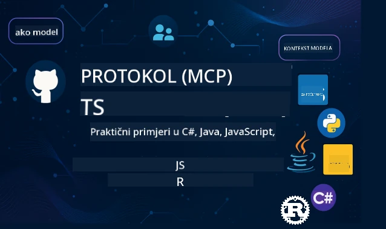

 

[](https://GitHub.com/microsoft/mcp-for-beginners/graphs/contributors)
[](https://GitHub.com/microsoft/mcp-for-beginners/issues)
[](https://GitHub.com/microsoft/mcp-for-beginners/pulls)
[](http://makeapullrequest.com)

[](https://GitHub.com/microsoft/mcp-for-beginners/watchers)
[](https://GitHub.com/microsoft/mcp-for-beginners/fork)
[](https://GitHub.com/microsoft/mcp-for-beginners/stargazers)


[](https://discord.gg/nTYy5BXMWG)

Slijedite ove korake kako biste započeli s korištenjem ovih resursa:
1. **Forkajte repozitorij**: Kliknite [](https://GitHub.com/microsoft/mcp-for-beginners/fork)
2. **Klonirajte repozitorij**:   `git clone https://github.com/microsoft/mcp-for-beginners.git`
3. **Pridružite se** [](https://discord.gg/nTYy5BXMWG)


### 🌐 Podrška za više jezika

#### Podržano putem GitHub akcije (Automatski i uvijek ažurirano)

<!-- CO-OP TRANSLATOR LANGUAGES TABLE START -->
[Arabski](../ar/README.md) | [Bengalski](../bn/README.md) | [Bugarski](../bg/README.md) | [Burmanski (Myanmar)](../my/README.md) | [Kineski (pojednostavljeni)](../zh-CN/README.md) | [Kineski (tradicionalni, Hong Kong)](../zh-HK/README.md) | [Kineski (tradicionalni, Makao)](../zh-MO/README.md) | [Kineski (tradicionalni, Tajvan)](../zh-TW/README.md) | [Hrvatski](./README.md) | [Češki](../cs/README.md) | [Danski](../da/README.md) | [Nizozemski](../nl/README.md) | [Estonski](../et/README.md) | [Finski](../fi/README.md) | [Francuski](../fr/README.md) | [Njemački](../de/README.md) | [Grčki](../el/README.md) | [Hebrejski](../he/README.md) | [Hindi](../hi/README.md) | [Mađarski](../hu/README.md) | [Indonezijski](../id/README.md) | [Talijanski](../it/README.md) | [Japanski](../ja/README.md) | [Kannada](../kn/README.md) | [Korejski](../ko/README.md) | [Litvanski](../lt/README.md) | [Malajski](../ms/README.md) | [Malajalamski](../ml/README.md) | [Maratski](../mr/README.md) | [Nepalski](../ne/README.md) | [Nigerijski pidžin](../pcm/README.md) | [Norveški](../no/README.md) | [Perzijski (Farsi)](../fa/README.md) | [Poljski](../pl/README.md) | [Portugalski (Brazil)](../pt-BR/README.md) | [Portugalski (Portugal)](../pt-PT/README.md) | [Punjabi (Gurmukhi)](../pa/README.md) | [Rumunjski](../ro/README.md) | [Ruski](../ru/README.md) | [Srpski (ćirilica)](../sr/README.md) | [Slovački](../sk/README.md) | [Slovenski](../sl/README.md) | [Španjolski](../es/README.md) | [Swahili](../sw/README.md) | [Švedski](../sv/README.md) | [Tagalog (Filipinski)](../tl/README.md) | [Tamilski](../ta/README.md) | [Telugu](../te/README.md) | [Tajlandski](../th/README.md) | [Turski](../tr/README.md) | [Ukrajinski](../uk/README.md) | [Urdu](../ur/README.md) | [Vijetnamski](../vi/README.md)

> **Radije klonirati lokalno?**
>
> Ovaj repozitorij sadrži 50+ prijevoda jezika što značajno povećava veličinu preuzimanja. Da biste klonirali bez prijevoda, koristite sparse checkout:
>
> **Bash / macOS / Linux:**
> ```bash
> git clone --filter=blob:none --sparse https://github.com/microsoft/mcp-for-beginners.git
> cd mcp-for-beginners
> git sparse-checkout set --no-cone '/*' '!translations' '!translated_images'
> ```
>
> **CMD (Windows):**
> ```cmd
> git clone --filter=blob:none --sparse https://github.com/microsoft/mcp-for-beginners.git
> cd mcp-for-beginners
> git sparse-checkout set --no-cone "/*" "!translations" "!translated_images"
> ```
>
> Ovo vam daje sve što vam treba za završetak tečaja s puno bržim preuzimanjem.
<!-- CO-OP TRANSLATOR LANGUAGES TABLE END -->

# 🚀 Kurikulum Model Context Protocol (MCP) za početnike

## **Naučite MCP s praktičnim primjerima koda u C#, Java, JavaScript, Rust, Python i TypeScript**

## 🧠 Pregled kurikuluma Model Context Protocol
Dobrodošli na svoje putovanje u Model Context Protocol! Ako ste se ikada pitali kako AI aplikacije komuniciraju s različitim alatima i uslugama, upravo ćete otkriti elegantno rješenje koje mijenja način na koji developeri grade inteligentne sustave.

Zamislite MCP kao univerzalnog prevoditelja za AI aplikacije - baš kao što USB priključci omogućuju povezivanje bilo kojeg uređaja s vašim računalom, MCP omogućuje AI modelima povezivanje s bilo kojim alatom ili uslugom na standardizirani način. Bilo da gradite svoj prvi chatbot ili radite na složenim AI tijekovima rada, razumijevanje MCP-a dat će vam moć za stvaranje sposobnijih i fleksibilnijih aplikacija.

Ovaj kurikulum je pažljivo osmišljen s obzirom na vaš proces učenja. Počet ćemo sa jednostavnim konceptima koje već razumijete i postupno graditi vaše vještine kroz praktičnu primjenu u vašem omiljenom programskom jeziku. Svaki korak uključuje jasna objašnjenja, praktične primjere i puno ohrabrenja kroz cijeli put.

Nakon završetka ovog putovanja, imat ćete samopouzdanje za izgradnju vlastitih MCP servera, njihovu integraciju s popularnim AI platformama i razumijevanje kako ova tehnologija preoblikuje budućnost razvoja AI-a. Započnimo zajedno ovu uzbudljivu avanturu!

### Službena dokumentacija i specifikacije

Ovaj kurikulum usklađen je s **MCP specifikacijom 2025-11-25** (najnovije stabilno izdanje). MCP specifikacija koristi verzioniranje temeljeno na datumu (format YYYY-MM-DD) kako bi osigurala jasno praćenje verzija protokola.

Ovi resursi postaju dragocjeniji kako vaše razumijevanje raste, ali nemojte se osjećati pod pritiskom da sve odmah pročitate. Počnite s područjima koja vas najviše zanimaju!
- 📘 [MCP dokumentacija](https://modelcontextprotocol.io/) – Ovo je vaš glavni izvor za korak-po-korak vodiče i korisničke priručnike. Dokumentacija je napisana s početnicima na umu, pružajući jasne primjere koje možete pratiti vlastitim tempom.
- 📜 [MCP specifikacija](https://modelcontextprotocol.io/specification/2025-11-25) – Smatrajte ovo vašim opširnim referentnim priručnikom. Kako budete napredovali kroz kurikulum, vraćat ćete se ovdje za provjeru specifičnih detalja i istraživanje naprednih značajki.
- 📜 [Verzioniranje MCP specifikacije](https://modelcontextprotocol.io/specification/versioning) – Sadrži informacije o povijesti verzija protokola i kako MCP koristi verzioniranje temeljeno na datumu (format YYYY-MM-DD).
- 🧑‍💻 [MCP GitHub repozitorij](https://github.com/modelcontextprotocol) – Ovdje ćete pronaći SDK-ove, alate i primjere koda na više programskih jezika. To je kao rudnik praktičnih primjera i komponenti spremnih za korištenje.
- 🌐 [MCP zajednica](https://github.com/orgs/modelcontextprotocol/discussions) – Pridružite se kolegama učenicima i iskusnim developerima u raspravama o MCP-u. To je podržavajuća zajednica gdje su pitanja dobrodošla, a znanje se slobodno dijeli.
  
## Ciljevi učenja

Do kraja ovog kurikuluma, osjećat ćete se samouvjereno i uzbuđeno zbog svojih novih sposobnosti. Evo što ćete postići:

• **Razumjeti osnove MCP-a**: Razumjet ćete što je Model Context Protocol i zašto mijenja način na koji AI aplikacije surađuju, koristeći analogije i primjere koji imaju smisla.

• **Izgraditi svoj prvi MCP server**: Stvorit ćete funkcionalni MCP server u željenom programskom jeziku, počevši od jednostavnih primjera i postepeno šireći svoje vještine.

• **Povezati AI modele s pravim alatima**: Naučit ćete kako premostiti jaz između AI modela i stvarnih usluga, dajući vašim aplikacijama moćne nove mogućnosti.

• **Implementirati najbolje sigurnosne prakse**: Razumjet ćete kako održati svoje MCP implementacije sigurnima, štiteći i svoje aplikacije i korisnike.

• **Pouzdano postaviti u produkciju**: Znati ćete kako prenijeti svoje MCP projekte iz razvoja u produkciju, s praktičnim strategijama implementacije koje funkcioniraju u stvarnom svijetu.

• **Pridružiti se MCP zajednici**: Postat ćete dio rastuće zajednice developera koji oblikuju budućnost razvoja AI aplikacija.

## Osnovno predznanje

Prije nego što se upustimo u specifičnosti MCP-a, osigurajmo da se osjećate ugodno s nekim osnovnim konceptima. Ne brinite ako niste stručnjak za ova područja - objasnit ćemo sve što trebate znati tijekom procesa!

### Razumijevanje protokola (Temelj)

Zamislite protokol kao pravila za razgovor. Kada nazovete prijatelja, oboje znate pozdraviti se s "bok", naizmjenično govoriti i pozdraviti s "doviđenja" kad završite. Računalni programi trebaju slična pravila za učinkovitu komunikaciju.

MCP je protokol - skup dogovorenih pravila koji pomažu AI modelima i aplikacijama imati produktivne "razgovore" s alatima i uslugama. Baš kao što pravila za razgovor čine ljudsku komunikaciju glađom, MCP čini komunikaciju AI aplikacija pouzdanijom i moćnijom.

### Odnosi klijent-server (Kako programi rade zajedno)

Već svakodnevno koristite odnose klijent-server! Kad koristite web preglednik (klijent) za posjet web stranici, povezujete se s web serverom koji vam šalje sadržaj stranice. Preglednik zna kako zatražiti informacije, a server zna kako odgovoriti.

U MCP-u imamo sličan odnos: AI modeli djeluju kao klijenti koji traže informacije ili akcije, dok MCP serveri pružaju te mogućnosti. To je poput korisnog pomoćnika (servera) kojeg AI može zamoliti za izvršavanje određenih zadataka.

### Zašto je standardizacija važna (Kako stvari funkcioniraju zajedno)

Zamislite da svaki proizvođač automobila koristi drugačiji oblik pumpe za gorivo - za svaki biste automobil trebali drugačiji adapter! Standardizacija znači dogovor o uobičajenim pristupima kako bi stvari glatko funkcionirale zajedno.

MCP osigurava tu standardizaciju za AI aplikacije. Umjesto da svaki AI model treba poseban kod za rad sa svakim alatom, MCP stvara univerzalan način njihove komunikacije. To znači da developeri mogu izraditi alat jednom, a da on funkcionira s mnogo različitih AI sustava.

## 🧭 Pregled vašeg puta učenja

Vaše MCP putovanje pažljivo je strukturirano kako bi gradilo vaše samopouzdanje i vještine postupno. Svaka faza uvodi nove koncepte, dok istovremeno učvršćuje ono što ste već naučili.

### 🌱 Faza osnove: Razumijevanje osnova (Moduli 0-2)

Ovdje počinje vaša avantura! Uvest ćemo vas u MCP koncepte koristeći poznate analogije i jednostavne primjere. Razumjet ćete što je MCP, zašto postoji i kako se uklapa u širi svijet razvoja AI-a.

• **Modul 0 - Uvod u MCP**: Počet ćemo istraživanjem što je MCP i zašto je toliko važan za suvremene AI aplikacije. Vidjet ćete stvarne primjere MCP primjene i razumjeti kako rješava uobičajene probleme s kojima se developeri susreću.

• **Modul 1 - Objašnjeni osnovni koncepti**: Ovdje ćete naučiti najvažnije gradivne blokove MCP-a. Koristit ćemo mnogo analogija i vizualnih primjera kako bismo osigurali da ti koncepti budu prirodni i razumljivi.

• **Modul 2 - Sigurnost u MCP-u**: Sigurnost može zvučati zastrašujuće, ali pokazat ćemo vam kako MCP uključuje ugrađene sigurnosne značajke i podučiti vas najboljim praksama koje štite vaše aplikacije od početka.

### 🔨 Faza izgradnje: Izrada vaših prvih implementacija (Modul 3)

Sada počinje prava zabava! Steći ćete praktično iskustvo u izgradnji stvarnih MCP servera i klijenata. Ne brinite - počinjemo jednostavno i vodit ćemo vas kroz svaki korak.
Ovaj modul uključuje više praktičnih vodiča koji vam omogućuju vježbanje u vašem omiljenom programskom jeziku. Stvorit ćete svoj prvi poslužitelj, izgraditi klijenta za povezivanje s njim, pa čak i integrirati se s popularnim alatima za razvoj poput VS Codea.

Svaki vodič uključuje kompletne primjere koda, savjete za rješavanje problema i objašnjenja zašto donosimo određene dizajnerske odluke. Do kraja ove faze imat ćete funkcionalne MCP implementacije na koje možete biti ponosni!

### 🚀 Faza razvoja: Napredni koncepti i primjena u stvarnom svijetu (Moduli 4-5)

Nakon što savladate osnove, spremni ste za istraživanje složenijih MCP značajki. Pokrit ćemo praktične strategije implementacije, tehnike otklanjanja pogrešaka i napredne teme poput integracije multimodalne umjetne inteligencije.

Također ćete naučiti kako skalirati vaše MCP implementacije za produkcijsku upotrebu i integrirati se s oblačnim platformama poput Azurea. Ovi moduli vas pripremaju za izgradnju MCP rješenja koja mogu odgovarati zahtjevima stvarnog svijeta.

### 🌟 Faza savladavanja: Zajednica i specijalizacija (Moduli 6-11)

Završna faza usredotočuje se na pridruživanje MCP zajednici i specijalizaciju u područjima koja vas najviše zanimaju. Naučit ćete kako doprinositi open-source MCP projektima, implementirati napredne obrasce autentifikacije i graditi sveobuhvatna rješenja integrirana s bazama podataka.

Modul 11 zaslužuje posebno spominjanje - to je kompletan put učenja kroz 13 praktičnih laboratorija koji vas uči kako graditi proizvodno spremne MCP poslužitelje s integracijom PostgreSQL-a. To je poput završnog projekta koji okuplja sve što ste naučili!

### 📚 Struktura cjelokupnog kurikuluma

| Modul | Tema | Opis | Poveznica |
|--------|-------|-------------|------|
| **Modul 0-3: Osnove** | | | |
| 00 | Uvod u MCP | Pregled Model Context Protokola i njegova važnost u AI cjevovodima | [Pročitaj više](./00-Introduction/README.md) |
| 01 | Objašnjeni osnovni koncepti | Dubinski pregled osnovnih MCP koncepata | [Pročitaj više](./01-CoreConcepts/README.md) |
| 02 | Sigurnost u MCP-u | Sigurnosne prijetnje i najbolje prakse | [Pročitaj više](./02-Security/README.md) |
| 03 | Početak rada s MCP-om | Postavljanje okruženja, osnovni poslužitelji/klijenti, integracija | [Pročitaj više](./03-GettingStarted/README.md) |
| **Modul 3: Izgradnja vašeg prvog poslužitelja i klijenta** | | | |
| 3.1 | Prvi poslužitelj | Stvorite svoj prvi MCP poslužitelj | [Vodič](./03-GettingStarted/01-first-server/README.md) |
| 3.2 | Prvi klijent | Razvijte osnovnog MCP klijenta | [Vodič](./03-GettingStarted/02-client/README.md) |
| 3.3 | Klijent s LLM-om | Integrirajte modele velikih jezika | [Vodič](./03-GettingStarted/03-llm-client/README.md) |
| 3.4 | Integracija VS Codea | Koristite MCP poslužitelje u VS Codeu | [Vodič](./03-GettingStarted/04-vscode/README.md) |
| 3.5 | stdio poslužitelj | Stvorite poslužitelje koristeći stdio transport | [Vodič](./03-GettingStarted/05-stdio-server/README.md) |
| 3.6 | HTTP streaming | Implementirajte HTTP streaming u MCP-u | [Vodič](./03-GettingStarted/06-http-streaming/README.md) |
| 3.7 | AI Toolkit | Koristite AI Toolkit s MCP-om | [Vodič](./03-GettingStarted/07-aitk/README.md) |
| 3.8 | Testiranje | Testirajte vašu MCP poslužiteljsku implementaciju | [Vodič](./03-GettingStarted/08-testing/README.md) |
| 3.9 | Implementacija | Postavite MCP poslužitelje u produkciju | [Vodič](./03-GettingStarted/09-deployment/README.md) |
| 3.10 | Napredna uporaba poslužitelja | Koristite napredne poslužitelje za naprednu funkcionalnost i bolju arhitekturu | [Vodič](./03-GettingStarted/10-advanced/README.md) |
| 3.11 | Jednostavna autentifikacija | Poglavlje koje prikazuje autentifikaciju od početka i RBAC | [Vodič](./03-GettingStarted/11-simple-auth/README.md) |
| 3.12 | MCP domaćini | Konfigurirajte Claude Desktop, Cursor, Cline i druge MCP domaćine | [Vodič](./03-GettingStarted/12-mcp-hosts/README.md) |
| 3.13 | MCP Inspektor | Otklonite pogreške i testirajte MCP poslužitelje alatom Inspektor | [Vodič](./03-GettingStarted/13-mcp-inspector/README.md) |
| 3.14 | Uzorkovanje | Koristite uzorkovanje za suradnju s klijentom | [Vodič](./03-GettingStarted/14-sampling/README.md) |
| 3.15 | MCP aplikacije | Izgradite MCP aplikacije | [Vodič](./03-GettingStarted/15-mcp-apps/README.md) |
| **Modul 4-5: Praktično & Napredno** | | | |
| 04 | Praktična implementacija | SDK-ovi, otklanjanje pogrešaka, testiranje, višekratno upotrebljive predloške upita | [Pročitaj više](./04-PracticalImplementation/README.md) |
| 4.1 | Stranicenje | Upravljanje velikim skupovima rezultata sa stranicenjem na temelju pokazivača | [Vodič](./04-PracticalImplementation/pagination/README.md) |
| 05 | Napredne teme u MCP-u | Multimodalna AI, skaliranje, enterprise upotreba | [Pročitaj više](./05-AdvancedTopics/README.md) |
| 5.1 | Azure integracija | MCP integracija s Azureom | [Vodič](./05-AdvancedTopics/mcp-integration/README.md) |
| 5.2 | Multimodalnost | Rad s više modaliteta | [Vodič](./05-AdvancedTopics/mcp-multi-modality/README.md) |
| 5.3 | OAuth2 demonstracija | Implementirajte OAuth2 autentifikaciju | [Vodič](./05-AdvancedTopics/mcp-oauth2-demo/README.md) |
| 5.4 | Root konteksti | Razumite i implementirajte root kontekste | [Vodič](./05-AdvancedTopics/mcp-root-contexts/README.md) |
| 5.5 | Usmjeravanje | Strategije usmjeravanja u MCP-u | [Vodič](./05-AdvancedTopics/mcp-routing/README.md) |
| 5.6 | Uzorkovanje | Tehnike uzorkovanja u MCP-u | [Vodič](./05-AdvancedTopics/mcp-sampling/README.md) |
| 5.7 | Skaliranje | Skalirajte MCP implementacije | [Vodič](./05-AdvancedTopics/mcp-scaling/README.md) |
| 5.8 | Sigurnost | Napredne sigurnosne razmatranja | [Vodič](./05-AdvancedTopics/mcp-security/README.md) |
| 5.9 | Pretraživanje weba | Implementirajte mogućnosti web pretraživanja | [Vodič](./05-AdvancedTopics/web-search-mcp/README.md) |
| 5.10 | Realtime streaming | Izgradite funkcionalnost realtime streaminga | [Vodič](./05-AdvancedTopics/mcp-realtimestreaming/README.md) |
| 5.11 | Realtime pretraživanje | Implementirajte realtime pretraživanje | [Vodič](./05-AdvancedTopics/mcp-realtimesearch/README.md) |
| 5.12 | Autentifikacija s Entra ID-om | Autentifikacija s Microsoft Entra ID-om | [Vodič](./05-AdvancedTopics/mcp-security-entra/README.md) |
| 5.13 | Integracija Foundry-ja | Integracija s Azure AI Foundry | [Vodič](./05-AdvancedTopics/mcp-foundry-agent-integration/README.md) |
| 5.14 | Inženjering konteksta | Tehnike za učinkoviti inženjering konteksta | [Vodič](./05-AdvancedTopics/mcp-contextengineering/README.md) |
| 5.15 | MCP prilagođeni transport | Implementacije prilagođenih transporta | [Vodič](./05-AdvancedTopics/mcp-transport/README.md) |
| 5.16 | Značajke protokola | Obavijesti o napretku, otkazivanje, predlošci resursa | [Vodič](./05-AdvancedTopics/mcp-protocol-features/README.md) |
| **Modul 6-10: Zajednica & Najbolje prakse** | | | |
| 06 | Doprinos zajednici | Kako doprinijeti MCP ekosustavu | [Vodič](./06-CommunityContributions/README.md) |
| 07 | Uvidi iz ranog usvajanja | Priče o implementacijama u stvarnom svijetu | [Vodič](./07-LessonsfromEarlyAdoption/README.md) |
| 08 | Najbolje prakse za MCP | Performanse, otpornost na greške, otpornost | [Vodič](./08-BestPractices/README.md) |
| 09 | MCP studije slučaja | Primjeri praktične implementacije | [Vodič](./09-CaseStudy/README.md) |
| 10 | Praktična radionica | Izgradnja MCP poslužitelja s AI Toolkitom | [Laboratorij](./10-StreamliningAIWorkflowsBuildingAnMCPServerWithAIToolkit/README.md) |
| **Modul 11: MCP Server praktični laboratorij** | | | |
| 11 | Integracija MCP poslužitelja s bazom podataka | Sveobuhvatan put učenja kroz 13 praktičnih laboratorija za integraciju s PostgreSQL-om | [Laboratoriji](./11-MCPServerHandsOnLabs/README.md) |
| 11.1 | Uvod | Pregled MCP-a s integracijom baze podataka i primjena u maloprodajnoj analitici | [Laboratorij 00](./11-MCPServerHandsOnLabs/00-Introduction/README.md) |
| 11.2 | Osnovna arhitektura | Razumijevanje MCP poslužiteljske arhitekture, slojeva baze podataka i sigurnosnih obrazaca | [Laboratorij 01](./11-MCPServerHandsOnLabs/01-Architecture/README.md) |
| 11.3 | Sigurnost & višekorisnički pristup | Sigurnost na razini reda, autentifikacija i pristup podacima za više korisnika | [Laboratorij 02](./11-MCPServerHandsOnLabs/02-Security/README.md) |
| 11.4 | Postavljanje okruženja | Postavljanje razvojnog okruženja, Dockera, Azure resursa | [Laboratorij 03](./11-MCPServerHandsOnLabs/03-Setup/README.md) |
| 11.5 | Dizajn baze podataka | Postavljanje PostgreSQL-a, dizajn sheme za maloprodaju i uzorci podataka | [Laboratorij 04](./11-MCPServerHandsOnLabs/04-Database/README.md) |
| 11.6 | Implementacija MCP poslužitelja | Izgradnja FastMCP poslužitelja s integracijom baze podataka | [Laboratorij 05](./11-MCPServerHandsOnLabs/05-MCP-Server/README.md) |
| 11.7 | Razvoj alata | Izrada alata za upite baze podataka i introspekcija sheme | [Laboratorij 06](./11-MCPServerHandsOnLabs/06-Tools/README.md) |
| 11.8 | Semantičko pretraživanje | Implementacija vektorskih ugradbi s Azure OpenAI i pgvectorom | [Laboratorij 07](./11-MCPServerHandsOnLabs/07-Semantic-Search/README.md) |
| 11.9 | Testiranje & otklanjanje pogrešaka | Strategije testiranja, alati za otklanjanje pogrešaka i pristupi validaciji | [Laboratorij 08](./11-MCPServerHandsOnLabs/08-Testing/README.md) |
| 11.10 | Integracija s VS Codeom | Konfiguriranje integracije MCP-a u VS Code i korištenje AI chata | [Laboratorij 09](./11-MCPServerHandsOnLabs/09-VS-Code/README.md) |
| 11.11 | Strategije implementacije | Docker implementacija, Azure Container Apps i razmatranja skaliranja | [Laboratorij 10](./11-MCPServerHandsOnLabs/10-Deployment/README.md) |
| 11.12 | Praćenje | Application Insights, bilježenje, praćenje performansi | [Laboratorij 11](./11-MCPServerHandsOnLabs/11-Monitoring/README.md) |
| 11.13 | Najbolje prakse | Optimizacija performansi, učvršćivanje sigurnosti i savjeti za produkciju | [Laboratorij 12](./11-MCPServerHandsOnLabs/12-Best-Practices/README.md) |

### 💻 Primjeri projektnih kodova

Jedan od najuzbudljivijih dijelova učenja MCP-a jest vidjeti kako vaše vještine kodiranja postupno rastu. Naše primjere koda dizajnirali smo tako da počinju jednostavno i postaju složeniji kako vaše razumijevanje napreduje. Evo kako uvodimo koncepte - s kodom koji je lako razumljiv, ali pokazuje prave principe MCP-a, shvatit ćete ne samo što taj kod radi, nego i zašto je strukturiran tako i kako se uklapa u veće MCP aplikacije.

#### Osnovni uzorci MCP kalkulatora

| Jezik | Opis | Poveznica |
|----------|-------------|------|
| C# | Primjer MCP poslužitelja | [Pogledaj kod](./03-GettingStarted/samples/csharp/README.md) |
| Java | MCP kalkulator | [Pogledaj kod](./03-GettingStarted/samples/java/calculator/README.md) |
| JavaScript | MCP demo | [Pogledaj kod](./03-GettingStarted/samples/javascript/README.md) |
| Python | MCP poslužitelj | [Pogledaj kod](../../03-GettingStarted/samples/python/mcp_calculator_server.py) |
| TypeScript | MCP primjer | [Pogledaj kod](./03-GettingStarted/samples/typescript/README.md) |
| Rust | MCP primjer | [Pogledaj kod](./03-GettingStarted/samples/rust/README.md) |

#### Napredne MCP implementacije

| Jezik | Opis | Poveznica |
|----------|-------------|------|
| C# | Napredni primjer | [Pogledaj kod](./04-PracticalImplementation/samples/csharp/README.md) |
| Java sa Springom | Primjer Container App | [Pogledaj kod](./04-PracticalImplementation/samples/java/containerapp/README.md) |
| JavaScript | Napredni primjer | [Pogledaj kod](./04-PracticalImplementation/samples/javascript/README.md) |
| Python | Složena implementacija | [Pogledaj kod](./04-PracticalImplementation/samples/python/README.md) |
| TypeScript | Primjer Containera | [Pogledaj kod](./04-PracticalImplementation/samples/typescript/README.md) |


## 🎯 Preduvjeti za učenje MCP-a

Da biste iz ovog kurikuluma izvukli maksimum, trebali biste imati:
- Osnovno znanje programiranja u barem jednom od sljedećih jezika: C#, Java, JavaScript, Python ili TypeScript  
- Razumijevanje modela klijent-poslužitelj i API-ja  
- Poznavanje REST i HTTP koncepata  
- (Opcionalno) Pozadina u AI/ML konceptima  

- Sudjelovanje u raspravama naše zajednice za podršku  

## 📚 Vodič za učenje i resursi  

Ovaj repozitorij uključuje nekoliko resursa koji će vam pomoći da učinkovito naučite i navigirate:

### Vodič za učenje  

Dostupan je sveobuhvatni [Vodič za učenje](./study_guide.md) koji vam pomaže u učinkovitom snalaženju po ovom repozitoriju. Ova vizualna karta kurikuluma pokazuje kako su svi teme povezane i pruža smjernice kako učinkovito koristiti primjere projekata. Posebno je koristan ako ste vizualni tip učenika koji voli vidjeti širu sliku.

Vodič uključuje:  
- Vizualnu kartu kurikuluma s prikazom svih obrađenih tema  
- Detaljnu podjelu svakog dijela repozitorija  
- Smjernice za korištenje primjera projekata  
- Preporučene putove učenja za različite razine vještina  
- Dodatne resurse koji dopunjuju vaše putovanje učenja  

### Dnevnik promjena  

Održavamo detaljan [Dnevnik promjena](./changelog.md) koji bilježi sve značajne nadogradnje kurikulumskih materijala, kako biste ostali u tijeku s najnovijim poboljšanjima i dodacima.  
- Dodavanje novog sadržaja  
- Strukturne promjene  
- Poboljšanja funkcionalnosti  
- Ažuriranja dokumentacije  

## 🛠️ Kako učinkovito koristiti ovaj kurikulum  

Svaka lekcija u ovom vodiču uključuje:  

1. Jasna objašnjenja MCP koncepata  
2. Primjere koda uživo u više programskih jezika  
3. Vježbe za izgradnju stvarnih MCP aplikacija  
4. Dodatne resurse za napredne učenike  

### Naučimo MCP s C# - serija tutorijala  
Upoznajmo Model Context Protocol (MCP), suvremeni okvir dizajniran za standardizaciju interakcija između AI modela i klijent aplikacija. Kroz ovu početnički prilagođenu seriju lekcija, upoznat ćemo vas s MCP-om i voditi vas kroz stvaranje vašeg prvog MCP poslužitelja.  
#### C#: [https://aka.ms/letslearnmcp-csharp](https://aka.ms/letslearnmcp-csharp)  
#### Java: [https://aka.ms/letslearnmcp-java](https://aka.ms/letslearnmcp-java)  
#### JavaScript: [https://aka.ms/letslearnmcp-javascript](https://aka.ms/letslearnmcp-javascript)  
#### Python: [https://aka.ms/letslearnmcp-python](https://aka.ms/letslearnmcp-python)  

## 🎓 Vaše MCP putovanje počinje  

Čestitamo! Upravo ste napravili prvi korak na uzbudljivom putovanju koje će proširiti vaše programske sposobnosti i povezati vas s vrhunskom AI razvojnom tehnologijom.

### Što ste već postigli  

Čitanjem ovog uvoda, već ste započeli graditi temelj svog znanja o MCP-u. Razumijete što je MCP, zašto je važan i kako vam ovaj kurikulum može pomoći u učenju. To je značajan uspjeh i početak vašeg stručnog znanja u ovoj važnoj tehnologiji.

### Avantura koja je pred vama  

Kako budete napredovali kroz module, imajte na umu da je svaki stručnjak nekoć bio početnik. Koncepti koji vam sada mogu djelovati složeno, postat će druga priroda dok ih budete vježbali i primjenjivali. Svaki mali korak gradi snažne sposobnosti koje će vam služiti tijekom cijele vaše karijere u razvoju.

### Vaša mreža podrške  

Pridružujete se zajednici učenika i stručnjaka koji su strastveni u vezi MCP-a i željni pomoći drugima da uspiju. Bilo da ste zapeli na nekom programerskom izazovu ili ste uzbuđeni podijeliti svoj napredak, zajednica je tu da podrži vaše putovanje.

Ako zapnete ili imate pitanja o izradi AI aplikacija, pridružite se raspravama s drugim učenicima i iskusnim programerima o MCP-u. To je podržavajuća zajednica u kojoj su pitanja dobrodošla, a znanje se slobodno dijeli.

[](https://discord.gg/nTYy5BXMWG)

Ako imate povratne informacije o proizvodu ili naiđete na greške tijekom izrade, posjetite:

[](https://aka.ms/foundry/forum)  

### Spremni za početak?  

Vaša MCP avantura započinje sada! Počnite s Modulom 0 kako biste se upustili u svoje prve praktične MCP iskustva, ili istražite primjere projekata da vidite što ćete graditi. Zapamtite – svaki stručnjak započeo je upravo tamo gdje ste vi sada, a uz strpljenje i praksu, bit ćete zapanjeni onim što možete postići.

Dobrodošli u svijet razvoja Model Context Protocola. Izgradimo nešto nevjerojatno zajedno!

## 🤝 Doprinos zajednici za učenje  

Ovaj kurikulum jača zahvaljujući doprinosima učenika poput vas! Bilo da ispravljate tipografsku pogrešku, predlažete jasnije objašnjenje ili dodajete novi primjer, vaši doprinosi pomažu drugim početnicima da uspiju.

Zahvaljujemo Microsoft Valued Professionalu [Shivam Goyal](https://www.linkedin.com/in/shivam2003/) za doprinos uzorcima koda.

Proces doprinosa dizajniran je da bude prijateljski i podržavajući. Većina doprinosa zahtijeva Contributor License Agreement (CLA), ali automatizirani alati će vas glatko voditi kroz proces.

## 📜 Otvoreno učenje open source  

Cijeli ovaj kurikulum dostupan je pod MIT [LICENCOM](../../LICENSE), što znači da ga možete slobodno koristiti, mijenjati i dijeliti. Ovo podržava našu misiju da znanje o MCP-u učinimo dostupnim programerima svugdje.

## 🤝 Smjernice za doprinose  

Ovaj projekt prihvaća doprinose i prijedloge. Većina doprinosa zahtijeva da se slažete s  
Contributor License Agreement (CLA) u kojem izjavljujete da imate pravo te nam ustupate prava korištenja svog doprinosa. Za detalje posjetite <https://cla.opensource.microsoft.com>.

Kad pošaljete zahtjev za povlačenje, CLA bot će automatski odrediti trebate li dostaviti CLA i označiti PR prikladno (npr. status provjere, komentar). Jednostavno slijedite upute bota. Ovo ćete trebati učiniti samo jednom za sve repozitorije koji koriste naš CLA.

Ovaj projekt je usvojio [Microsoft Open Source Code of Conduct](https://opensource.microsoft.com/codeofconduct/).  
Za više informacija pogledajte [Code of Conduct FAQ](https://opensource.microsoft.com/codeofconduct/faq/) ili  
kontaktirajte [opencode@microsoft.com](mailto:opencode@microsoft.com) za dodatna pitanja ili komentare.

---

*Spremni započeti svoje MCP putovanje? Počnite s [Modulom 00 - Uvod u MCP](./00-Introduction/README.md) i napravite prve korake u svijetu razvoja Model Context Protocola!*  

## 🎒 Ostali tečajevi  
Naš tim proizvodi i druge tečajeve! Pogledajte:  

<!-- CO-OP TRANSLATOR OTHER COURSES START -->  
### LangChain  
[](https://aka.ms/langchain4j-for-beginners)  
[](https://aka.ms/langchainjs-for-beginners?WT.mc_id=m365-94501-dwahlin)  
[](https://github.com/microsoft/langchain-for-beginners?WT.mc_id=m365-94501-dwahlin)  
---  

### Azure / Edge / MCP / Agenti  
[](https://github.com/microsoft/AZD-for-beginners?WT.mc_id=academic-105485-koreyst)  
[](https://github.com/microsoft/edgeai-for-beginners?WT.mc_id=academic-105485-koreyst)  
[](https://github.com/microsoft/mcp-for-beginners?WT.mc_id=academic-105485-koreyst)  
[](https://github.com/microsoft/ai-agents-for-beginners?WT.mc_id=academic-105485-koreyst)  

---  

### Serija Generativnog AI-a  
[](https://github.com/microsoft/generative-ai-for-beginners?WT.mc_id=academic-105485-koreyst)  
[-9333EA?style=for-the-badge&labelColor=E5E7EB&color=9333EA)](https://github.com/microsoft/Generative-AI-for-beginners-dotnet?WT.mc_id=academic-105485-koreyst)  
[-C084FC?style=for-the-badge&labelColor=E5E7EB&color=C084FC)](https://github.com/microsoft/generative-ai-for-beginners-java?WT.mc_id=academic-105485-koreyst)  
[-E879F9?style=for-the-badge&labelColor=E5E7EB&color=E879F9)](https://github.com/microsoft/generative-ai-with-javascript?WT.mc_id=academic-105485-koreyst)  

---  

### Osnove učenja  
[](https://aka.ms/ml-beginners?WT.mc_id=academic-105485-koreyst)  
[](https://aka.ms/datascience-beginners?WT.mc_id=academic-105485-koreyst)  
[](https://aka.ms/ai-beginners?WT.mc_id=academic-105485-koreyst)  
[](https://github.com/microsoft/Security-101?WT.mc_id=academic-96948-sayoung)  
[](https://aka.ms/webdev-beginners?WT.mc_id=academic-105485-koreyst)  
[](https://aka.ms/iot-beginners?WT.mc_id=academic-105485-koreyst)  
[](https://github.com/microsoft/xr-development-for-beginners?WT.mc_id=academic-105485-koreyst)  

---  

### Serija Copilot  

[](https://aka.ms/GitHubCopilotAI?WT.mc_id=academic-105485-koreyst)
[](https://github.com/microsoft/mastering-github-copilot-for-dotnet-csharp-developers?WT.mc_id=academic-105485-koreyst)
[](https://github.com/microsoft/CopilotAdventures?WT.mc_id=academic-105485-koreyst)
<!-- CO-OP TRANSLATOR OTHER COURSES END -->

---

<!-- CO-OP TRANSLATOR DISCLAIMER START -->
**Odricanje od odgovornosti**:
Ovaj dokument preveden je pomoću AI usluge prevođenja [Co-op Translator](https://github.com/Azure/co-op-translator). Iako težimo točnosti, imajte na umu da automatski prijevodi mogu sadržavati pogreške ili netočnosti. Izvorni dokument na njegovom izvornom jeziku treba smatrati autoritativnim izvorom. Za kritične informacije preporučuje se profesionalni ljudski prijevod. Nismo odgovorni za bilo kakva nerazumijevanja ili pogrešne interpretacije koje proizlaze iz korištenja ovog prijevoda.
<!-- CO-OP TRANSLATOR DISCLAIMER END -->