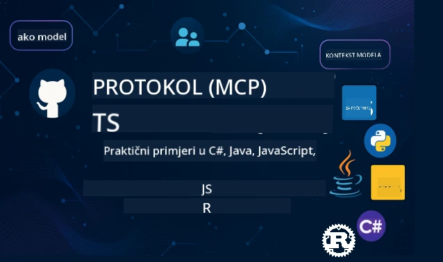

 

[](https://GitHub.com/microsoft/mcp-for-beginners/graphs/contributors)
[](https://GitHub.com/microsoft/mcp-for-beginners/issues)
[](https://GitHub.com/microsoft/mcp-for-beginners/pulls)
[](http://makeapullrequest.com)
[](https://mcptoplist.com/server/mcp.so%2Fmcp-for-beginners%2Fmicrosoft)

[](https://GitHub.com/microsoft/mcp-for-beginners/watchers)
[](https://GitHub.com/microsoft/mcp-for-beginners/fork)
[](https://GitHub.com/microsoft/mcp-for-beginners/stargazers)


[](https://discord.gg/nTYy5BXMWG)

Slijedite ove korake da biste započeli s korištenjem ovih resursa:
1. **Napravite fork spremišta**: Kliknite [](https://GitHub.com/microsoft/mcp-for-beginners/fork)
2. **Klone spremište**:   `git clone https://github.com/microsoft/mcp-for-beginners.git`
3. **Pridružite se** [](https://discord.gg/nTYy5BXMWG)


### 🌐 Podrška za više jezika

#### Podržano putem GitHub akcije (Automatski i uvijek ažurirano)

<!-- CO-OP TRANSLATOR LANGUAGES TABLE START -->
[Arabic](../ar/README.md) | [Bengali](../bn/README.md) | [Bulgarian](../bg/README.md) | [Burmese (Myanmar)](../my/README.md) | [Chinese (Simplified)](../zh-CN/README.md) | [Chinese (Traditional, Hong Kong)](../zh-HK/README.md) | [Chinese (Traditional, Macau)](../zh-MO/README.md) | [Chinese (Traditional, Taiwan)](../zh-TW/README.md) | [Croatian](./README.md) | [Czech](../cs/README.md) | [Danish](../da/README.md) | [Dutch](../nl/README.md) | [Estonian](../et/README.md) | [Finnish](../fi/README.md) | [French](../fr/README.md) | [German](../de/README.md) | [Greek](../el/README.md) | [Hebrew](../he/README.md) | [Hindi](../hi/README.md) | [Hungarian](../hu/README.md) | [Indonesian](../id/README.md) | [Italian](../it/README.md) | [Japanese](../ja/README.md) | [Kannada](../kn/README.md) | [Khmer](../km/README.md) | [Korean](../ko/README.md) | [Lithuanian](../lt/README.md) | [Malay](../ms/README.md) | [Malayalam](../ml/README.md) | [Marathi](../mr/README.md) | [Nepali](../ne/README.md) | [Nigerian Pidgin](../pcm/README.md) | [Norwegian](../no/README.md) | [Persian (Farsi)](../fa/README.md) | [Polish](../pl/README.md) | [Portuguese (Brazil)](../pt-BR/README.md) | [Portuguese (Portugal)](../pt-PT/README.md) | [Punjabi (Gurmukhi)](../pa/README.md) | [Romanian](../ro/README.md) | [Russian](../ru/README.md) | [Serbian (Cyrillic)](../sr/README.md) | [Slovak](../sk/README.md) | [Slovenian](../sl/README.md) | [Spanish](../es/README.md) | [Swahili](../sw/README.md) | [Swedish](../sv/README.md) | [Tagalog (Filipino)](../tl/README.md) | [Tamil](../ta/README.md) | [Telugu](../te/README.md) | [Thai](../th/README.md) | [Turkish](../tr/README.md) | [Ukrainian](../uk/README.md) | [Urdu](../ur/README.md) | [Vietnamese](../vi/README.md)

> **Preferirate li klonirati lokalno?**
>
> Ovo spremište uključuje prijevode na više od 50 jezika, što značajno povećava veličinu preuzimanja. Za kloniranje bez prijevoda, koristite sparse checkout:
>
> **Bash / macOS / Linux:**
> ```bash
> git clone --filter=blob:none --sparse https://github.com/microsoft/mcp-for-beginners.git
> cd mcp-for-beginners
> git sparse-checkout set --no-cone '/*' '!translations' '!translated_images'
> ```
>
> **CMD (Windows):**
> ```cmd
> git clone --filter=blob:none --sparse https://github.com/microsoft/mcp-for-beginners.git
> cd mcp-for-beginners
> git sparse-checkout set --no-cone "/*" "!translations" "!translated_images"
> ```
>
> Ovo vam daje sve što vam treba za dovršetak tečaja s mnogo bržim preuzimanjem.
<!-- CO-OP TRANSLATOR LANGUAGES TABLE END -->

# 🚀 Kurikulum za Model Context Protocol (MCP) za početnike

## **Naučite MCP s praktičnim primjerima koda u C#, Java, JavaScript, Rust, Python i TypeScript**

## 🧠 Pregled Kurikuluma Model Context Protocol
Dobrodošli na vaše putovanje u Model Context Protocol! Ako ste se ikada pitali kako AI aplikacije komuniciraju s različitim alatima i uslugama, upravo ćete otkriti elegantno rješenje koje mijenja način na koji programeri grade inteligentne sustave.

Zamislite MCP kao univerzalni prevoditelj za AI aplikacije - baš kao što USB priključci omogućavaju povezivanje bilo kojeg uređaja s vašim računalom, MCP omogućuje AI modelima da se povežu s bilo kojim alatom ili uslugom na standardizirani način. Bilo da izrađujete svoj prvi chatbot ili radite na složenim AI tijekovima rada, razumijevanje MCP dat će vam moć za stvaranje sposobnijih i fleksibilnijih aplikacija.

Ovaj kurikulum je dizajniran s pažnjom i strpljenjem za vaše učenje. Počinjemo s jednostavnim konceptima koje već razumijete i postupno gradimo vaše znanje kroz praktičnu primjenu u vašem omiljenom programskom jeziku. Svaki korak uključuje jasna objašnjenja, praktične primjere i puno ohrabrenja tijekom puta.

Do kraja ovog putovanja imat ćete samopouzdanje izgraditi vlastite MCP servere, integrirati ih s popularnim AI platformama i razumjeti kako ova tehnologija mijenja budućnost razvoja AI. Krenimo zajedno na ovu uzbudljivu avanturu!

### Službena dokumentacija i specifikacije

Ovaj kurikulum je usklađen s **MCP Specification 2025-11-25** (najnovije stabilno izdanje). MCP specifikacija koristi verzioniranje temeljeno na datumu (format YYYY-MM-DD) kako bi se osiguralo jasno praćenje verzija protokola.

> **U budućnosti:** kandidat za izdanje sljedeće verzije specifikacije, **2026-07-28**, planiran je za isporuku 28. srpnja 2026. godine. Ova verzija čini protokol bezstanjskim na razini prijenosa, formalizira okvir za ekstenzije (MCP aplikacije, zadaci), pojačava autorizaciju i ukida Roots, Sampling i Logging. Pogledajte [What's Changing in MCP: The 2026-07-28 Release Candidate](./01-CoreConcepts/mcp-2026-07-28-release-candidate.md) za detaljni pregled.

Ovi resursi postaju još vrijedniji kako vaše razumijevanje raste, ali nemojte se osjećati pod pritiskom da odmah pročitate sve. Počnite s područjima koja vas najviše zanimaju!
- 📘 [MCP Dokumentacija](https://modelcontextprotocol.io/) – Ovo je vaš primarni izvor za korak-po-korak vodiče i korisničke upute. Dokumentacija je napisana imajući na umu početnike, pružajući jasne primjere koje možete pratiti vlastitim tempom.
- 📜 [MCP Specifikacija](https://modelcontextprotocol.io/specification/2025-11-25) – Smatrajte ovo vašim sveobuhvatnim priručnikom. Kako budete prolazili kroz kurikulum, vraćat ćete se ovdje da potražite pojedinosti i istražite napredne značajke.
- 📜 [MCP Verzije specifikacije](https://modelcontextprotocol.io/specification/versioning) – Sadrži informacije o povijesti verzija protokola i kako MCP koristi verzioniranje temeljeno na datumu (format YYYY-MM-DD).
- 🧑‍💻 [MCP GitHub Spremište](https://github.com/modelcontextprotocol) – Ovdje ćete pronaći SDK-ove, alate i primjere koda u više programskih jezika. To je poput riznice praktičnih primjera i komponenti spremnih za upotrebu.
- 🌐 [MCP Zajednica](https://github.com/orgs/modelcontextprotocol/discussions) – Pridružite se drugim učenicima i iskusnim programerima u raspravama o MCP. To je podržavajuća zajednica gdje su pitanja dobrodošla, a znanje slobodno dijeljeno.
  
## Ciljevi učenja

Do kraja ovog kurikuluma osjećat ćete se samopouzdano i uzbuđeno zbog svojih novih sposobnosti. Evo što ćete postići:

• **Razumjeti osnove MCP-a**: Shvatit ćete što je Model Context Protocol i zašto mijenja način na koji AI aplikacije surađuju, koristeći analogije i primjere koji imaju smisla.

• **Izgraditi svoj prvi MCP server**: Stvorit ćete radni MCP server u svom omiljenom programskom jeziku, počevši s jednostavnim primjerima i postupno razvijajući svoje vještine.

• **Povezati AI modele s pravim alatima**: Naučit ćete kako premostiti jaz između AI modela i stvarnih usluga, dajući vašim aplikacijama moćne nove mogućnosti.

• **Implementirati najbolje sigurnosne prakse**: Razumjet ćete kako održati svoje MCP implementacije sigurnima i zaštićenima, štiteći i svoje aplikacije i korisnike.

• **Sigurno implementirati**: Znate kako svoje MCP projekte dovesti od razvoja do produkcije, s praktičnim strategijama implementacije koje djeluju u stvarnom svijetu.

• **Pridružiti se MCP zajednici**: Postat ćete dio rastuće zajednice programera koji oblikuju budućnost razvoja AI aplikacija.

## Osnovne Osnove

Prije nego što zaronimo u detalje MCP-a, pobrinimo se da se osjećate ugodno s nekim osnovnim konceptima. Ne brinite ako niste stručnjak u ovim područjima - objasnit ćemo vam sve što trebate znati tijekom puta!

### Razumijevanje protokola (Osnova)

ProtokoL zamislite kao pravila za razgovor. Kad nazovete prijatelja, oboje znate reći "bok" kad se javite, naizmjence govoriti i reći "doviđenja" kad završite. Računalni programi trebaju slična pravila da bi učinkovito komunicirali.

MCP je protokol - skup dogovorenih pravila koja pomažu AI modelima i aplikacijama da vode produktivne "razgovore" s alatima i uslugama. Baš kao što pravila razgovora olakšavaju ljudsku komunikaciju, tako MCP čini komunikaciju AI aplikacija pouzdanijom i snažnijom.

### Odnosi klijent-server (Kako programi surađuju)

Već svaki dan koristite odnose klijent-server! Kad koristite web preglednik (klijenta) za posjet web stranici, povezujete se s web serverom koji vam šalje sadržaj stranice. Preglednik zna kako tražiti informacije, a server zna kako odgovoriti.

U MCP-u imamo sličan odnos: AI modeli djeluju kao klijenti koji traže informacije ili radnje, dok MCP serveri pružaju te mogućnosti. To je kao da imate korisnog asistenta (server) kojeg AI može zamoliti da obavi određene zadatke.

### Zašto je standardizacija važna (Kako stvari funkcioniraju zajedno)

Zamislite da svaki proizvođač automobila koristi drugačiji oblik pumpe za gorivo - za svaki auto trebali biste drugačiji adapter! Standardizacija znači dogovor oko zajedničkih pristupa kako bi stvari radile zajedno bez problema.

MCP pruža ovu standardizaciju za AI aplikacije. Umjesto da svaki AI model treba poseban kod za suradnju s svakim alatom, MCP stvara univerzalni način komunikacije. To znači da programeri mogu izraditi alate jednom i imati ih kompatibilne sa mnogim različitim AI sustavima.

## 🧭 Pregled vašeg puta učenja

Vaše MCP putovanje je pažljivo strukturirano da postupno gradi vaše samopouzdanje i vještine. Svaka faza uvodi nove koncepte, a istovremeno učvršćuje ono što ste već naučili.

### 🌱 Faza osnove: Razumijevanje osnova (Moduli 0-2)

Ovdje počinje vaša avantura! Predstavit ćemo vam MCP koncepte koristeći poznate analogije i jednostavne primjere. Razumjet ćete što je MCP, zašto postoji i kako se uklapa u širi svijet razvoja AI.


• **Modul 0 - Uvod u MCP**: Počet ćemo istraživanjem što je MCP i zašto je toliko važan za moderne AI aplikacije. Vidjet ćete primjere MCP-a u stvarnom svijetu i razumjet ćete kako rješava uobičajene probleme s kojima se programeri susreću.

• **Modul 1 - Objašnjeni osnovni pojmovi**: Ovdje ćete naučiti ključne gradivne blokove MCP-a. Koristit ćemo mnogo analogija i vizualnih primjera kako bismo osigurali da vam ovi koncepti budu prirodni i razumljivi.

• **Modul 2 - Sigurnost u MCP-u**: Sigurnost možda zvuči zastrašujuće, ali pokazat ćemo vam kako MCP uključuje ugrađene sigurnosne značajke i naučiti vas najboljim praksama koje štite vaše aplikacije od samog početka.

### 🔨 Faza izgradnje: Izrada vaših prvih implementacija (Modul 3)

Sada počinje prava zabava! Dobit ćete praktično iskustvo u izgradnji stvarnih MCP servera i klijenata. Ne brinite - počet ćemo jednostavno i vodit ćemo vas kroz svaki korak.

Ovaj modul uključuje više praktičnih vodiča koji vam omogućuju vježbanje u vašem omiljenom programskom jeziku. Izradit ćete svoj prvi server, izgraditi klijenta za povezivanje s njim, pa čak i integrirati se s popularnim razvojnim alatima poput VS Codea.

Svaki vodič uključuje potpune primjere koda, savjete za rješavanje problema i objašnjenja zašto donosimo određene dizajnerske odluke. Na kraju ove faze imat ćete radne MCP implementacije na koje možete biti ponosni!

### 🚀 Faza rasta: Napredni koncepti i primjena u stvarnom svijetu (Moduli 4-5)

Kad savladate osnove, spremni ste istražiti sofisticiranije značajke MCP-a. Obuhvatit ćemo praktične strategije implementacije, tehnike otklanjanja pogrešaka i napredne teme poput integracije više-modalnog AI-ja.

Također ćete naučiti kako skalirati svoje MCP implementacije za produkcijsku upotrebu i integrirati se s cloud platformama poput Azurea. Ovi moduli pripremaju vas za izgradnju MCP rješenja koja mogu podnijeti zahtjeve stvarnog svijeta.

### 🌟 Faza savladavanja: Zajednica i specijalizacija (Moduli 6-11)

Završna faza fokusira se na pridruživanje MCP zajednici i specijalizaciju u područjima koja vas najviše zanimaju. Naučit ćete kako doprinositi open-source MCP projektima, implementirati napredne obrasce autentifikacije i graditi sveobuhvatna rješenja integrirana s bazama podataka.

Modul 11 zaslužuje posebnu pažnju - riječ je o kompletnoj 13-laboratorijskoj praktičnoj učionici koja vas uči izgradnji produkcijski spremnih MCP servera s integracijom PostgreSQL-a. Kao završni projekt koji spaja sve što ste naučili!

### 📚 Potpuna struktura kurikuluma

| Modul | Tema | Opis | Poveznica |
|--------|-------|-------------|------|
| **Modul 0-3: Osnove** | | | |
| 00 | Uvod u MCP | Pregled Model Context Protocola i njegov značaj u AI procesima | [Pročitaj više](./00-Introduction/README.md) |
| 01 | Objašnjeni osnovni pojmovi | Detaljno istraživanje ključnih MCP pojmova | [Pročitaj više](./01-CoreConcepts/README.md) |
| 1.1 | Što se mijenja u MCP-u (2026-07-28 RC) | Stateless protokol, okvir za proširenja i odustajanja od značajki u sljedećoj verziji specifikacije | [Vodič](./01-CoreConcepts/mcp-2026-07-28-release-candidate.md) |
| 02 | Sigurnost u MCP-u | Sigurnosne prijetnje i najbolje prakse | [Pročitaj više](./02-Security/README.md) |
| 03 | Početak rada s MCP-om | Postavljanje okruženja, osnovni serveri/klijenti, integracija | [Pročitaj više](./03-GettingStarted/README.md) |
| **Modul 3: Izrada vašeg prvog servera i klijenta** | | | |
| 3.1 | Prvi server | Izradite svoj prvi MCP server | [Vodič](./03-GettingStarted/01-first-server/README.md) |
| 3.2 | Prvi klijent | Razvijte osnovnog MCP klijenta | [Vodič](./03-GettingStarted/02-client/README.md) |
| 3.3 | Klijent s LLM | Integrirajte velike jezične modele | [Vodič](./03-GettingStarted/03-llm-client/README.md) |
| 3.4 | Integracija u VS Code | Koristite MCP servere u VS Code-u | [Vodič](./03-GettingStarted/04-vscode/README.md) |
| 3.5 | stdio server | Izradite servere koristeći stdio transport | [Vodič](./03-GettingStarted/05-stdio-server/README.md) |
| 3.6 | HTTP streaming | Implementirajte HTTP streaming u MCP-u | [Vodič](./03-GettingStarted/06-http-streaming/README.md) |
| 3.7 | Microsoft Foundry Toolkit | Koristite Microsoft Foundry Toolkit s MCP-om | [Vodič](./03-GettingStarted/07-aitk/README.md) |
| 3.8 | Testiranje | Testirajte svoju MCP server implementaciju | [Vodič](./03-GettingStarted/08-testing/README.md) |
| 3.9 | Implementacija | Postavite MCP servere u produkciju | [Vodič](./03-GettingStarted/09-deployment/README.md) |
| 3.10 | Napredno korištenje servera | Koristite napredne servere za napredne značajke i poboljšanu arhitekturu | [Vodič](./03-GettingStarted/10-advanced/README.md) |
| 3.11 | Jednostavna autentifikacija | Poglavlje koje prikazuje autentifikaciju od početka i RBAC | [Vodič](./03-GettingStarted/11-simple-auth/README.md) |
| 3.12 | MCP hostovi | Konfigurirajte Claude Desktop, Cursor, Cline i druge MCP hostove | [Vodič](./03-GettingStarted/12-mcp-hosts/README.md) |
| 3.13 | MCP Inspector | Otklanjajte pogreške i testirajte MCP servere s alatom Inspector | [Vodič](./03-GettingStarted/13-mcp-inspector/README.md) |
| 3.14 | Uzorkovanje | Koristite uzorkovanje za suradnju s klijentom | [Vodič](./03-GettingStarted/14-sampling/README.md) |
| 3.15 | MCP aplikacije | Izradite MCP aplikacije | [Vodič](./03-GettingStarted/15-mcp-apps/README.md) |
| **Modul 4-5: Praktično i napredno** | | | |
| 04 | Praktična implementacija | SDK-ovi, otklanjanje pogrešaka, testiranje, ponovljivih predložaka za upite | [Pročitaj više](./04-PracticalImplementation/README.md) |
| 4.1 | Paginacija | Rukovanje velikim skupovima rezultata pomoću paginacije s kursorom | [Vodič](./04-PracticalImplementation/pagination/README.md) |
| 05 | Napredne teme u MCP-u | Multi-modalni AI, skaliranje, uporaba u poduzećima | [Pročitaj više](./05-AdvancedTopics/README.md) |
| 5.1 | Integracija s Azureom | MCP integracija s Azureom | [Vodič](./05-AdvancedTopics/mcp-integration/README.md) |
| 5.2 | Multi-modalnost | Rad s više modaliteta | [Vodič](./05-AdvancedTopics/mcp-multi-modality/README.md) |
| 5.3 | OAuth2 demo | Implementacija OAuth2 autentifikacije | [Vodič](./05-AdvancedTopics/mcp-oauth2-demo/README.md) |
| 5.4 | Root konteksti | Razumijevanje i implementacija root konteksta | [Vodič](./05-AdvancedTopics/mcp-root-contexts/README.md) |
| 5.5 | Routing | MCP strategije usmjeravanja | [Vodič](./05-AdvancedTopics/mcp-routing/README.md) |
| 5.6 | Uzorkovanje | Tehnike uzorkovanja u MCP-u | [Vodič](./05-AdvancedTopics/mcp-sampling/README.md) |
| 5.7 | Skaliranje | Skaliranje MCP implementacija | [Vodič](./05-AdvancedTopics/mcp-scaling/README.md) |
| 5.8 | Sigurnost | Napredne sigurnosne razmatranja | [Vodič](./05-AdvancedTopics/mcp-security/README.md) |
| 5.9 | Pretraživanje weba | Implementacija mogućnosti pretraživanja weba | [Vodič](./05-AdvancedTopics/web-search-mcp/README.md) |
| 5.10 | Streaming u stvarnom vremenu | Izgradnja funkcionalnosti streaminga u stvarnom vremenu | [Vodič](./05-AdvancedTopics/mcp-realtimestreaming/README.md) |
| 5.11 | Pretraživanje u stvarnom vremenu | Implementacija pretraživanja u stvarnom vremenu | [Vodič](./05-AdvancedTopics/mcp-realtimesearch/README.md) |
| 5.12 | Autentifikacija s Entra ID | Autentifikacija s Microsoft Entra ID-om | [Vodič](./05-AdvancedTopics/mcp-security-entra/README.md) |
| 5.13 | Integracija s Foundryjem | Integracija s Microsoft Foundry | [Vodič](./05-AdvancedTopics/mcp-foundry-agent-integration/README.md) |
| 5.14 | Inženjering konteksta | Tehnike za učinkovito upravljanje kontekstom | [Vodič](./05-AdvancedTopics/mcp-contextengineering/README.md) |
| 5.15 | Prilagođeni MCP transport | Implementacije prilagođenog transporta | [Vodič](./05-AdvancedTopics/mcp-transport/README.md) |
| 5.16 | Značajke protokola | Obavijesti o napretku, otkazivanje, predlošci resursa | [Vodič](./05-AdvancedTopics/mcp-protocol-features/README.md) |
| 5.17 | Protivničko multi-agentno rezoniranje | Dva agenta raspravljaju suprotne strane koristeći zajedničke MCP alate, ocjenjuje sudac-agent | [Vodič](./05-AdvancedTopics/mcp-adversarial-agents/README.md) |
| **Modul 6-10: Zajednica i najbolje prakse** | | | |
| 06 | Doprinosi zajednice | Kako doprinijeti MCP ekosustavu | [Vodič](./06-CommunityContributions/README.md) |
| 07 | Uvidi iz ranog prihvaćanja | Priče o implementacijama iz stvarnog svijeta | [Vodič](./07-LessonsfromEarlyAdoption/README.md) |
| 08 | Najbolje prakse za MCP | Izvedba, podnošenje pogrešaka, otpornost | [Vodič](./08-BestPractices/README.md) |
| 09 | Studije slučaja MCP-a | Primjeri praktične implementacije | [Vodič](./09-CaseStudy/README.md) |
| 10 | Praktična radionica | Izgradnja MCP servera s Microsoft Foundry Toolkitom | [Laboratorij](./10-StreamliningAIWorkflowsBuildingAnMCPServerWithAIToolkit/README.md) |
| **Modul 11: MCP Server praktični laboratorij** | | | |
| 11 | MCP Server integracija baze podataka | Sveobuhvatan 13-laboratorijski praktični put s integracijom PostgreSQL-a | [Laboratoriji](./11-MCPServerHandsOnLabs/README.md) |
| 11.1 | Uvod | Pregled MCP-a s integracijom baze podataka i slučaj upotrebe maloprodajne analitike | [Laboratorij 00](./11-MCPServerHandsOnLabs/00-Introduction/README.md) |
| 11.2 | Jezgra arhitekture | Razumijevanje arhitekture MCP servera, slojeva baze podataka i sigurnosnih obrazaca | [Laboratorij 01](./11-MCPServerHandsOnLabs/01-Architecture/README.md) |
| 11.3 | Sigurnost i višekorisnički pristup | Sigurnost na razini retka, autentifikacija i pristup podacima s više korisnika | [Laboratorij 02](./11-MCPServerHandsOnLabs/02-Security/README.md) |
| 11.4 | Postavljanje okruženja | Postavljanje razvojnog okruženja, Docker, Azure resursi | [Laboratorij 03](./11-MCPServerHandsOnLabs/03-Setup/README.md) |
| 11.5 | Dizajn baze podataka | Postavljanje PostgreSQL-a, dizajn maloprodajnih shema i uzorak podataka | [Laboratorij 04](./11-MCPServerHandsOnLabs/04-Database/README.md) |
| 11.6 | Implementacija MCP servera | Izrada FastMCP servera s integracijom baze podataka | [Laboratorij 05](./11-MCPServerHandsOnLabs/05-MCP-Server/README.md) |
| 11.7 | Razvoj alata | Izrada alata za upite baze podataka i introspektiju sheme | [Laboratorij 06](./11-MCPServerHandsOnLabs/06-Tools/README.md) |
| 11.8 | Semantičko pretraživanje | Implementacija vektorskih ugradnji uz Azure OpenAI i pgvector | [Laboratorij 07](./11-MCPServerHandsOnLabs/07-Semantic-Search/README.md) |
| 11.9 | Testiranje i otklanjanje pogrešaka | Strategije testiranja, alati za otklanjanje pogrešaka i pristupi provjeri | [Laboratorij 08](./11-MCPServerHandsOnLabs/08-Testing/README.md) |
| 11.10 | Integracija VS Codea | Konfiguriranje MCP integracije u VS Code i korištenje AI četa | [Laboratorij 09](./11-MCPServerHandsOnLabs/09-VS-Code/README.md) |
| 11.11 | Strategije implementacije | Implementacija s Dockerom, Azure Container Apps i razmatranja skaliranja | [Laboratorij 10](./11-MCPServerHandsOnLabs/10-Deployment/README.md) |
| 11.12 | Praćenje | Application Insights, evidentiranje, praćenje izvedbe | [Laboratorij 11](./11-MCPServerHandsOnLabs/11-Monitoring/README.md) |
| 11.13 | Najbolje prakse | Optimizacija izvedbe, ucvršćivanje sigurnosti i savjeti za produkciju | [Laboratorij 12](./11-MCPServerHandsOnLabs/12-Best-Practices/README.md) |
| **Modul 12: MCP alati** | | | |
| 12.1 | Alati | Korištenje MCP-a u aplikaciji Copilot | [ Vodič ](./12-tooling/README.md) |

### 💻 Primjeri projekata koda

Jedan od najuzbudljivijih dijelova učenja MCP-a je vidjeti kako se vaše vještine kodiranja postupno razvijaju. Dizajnirali smo naše primjere koda da počinju jednostavno i postaju sofisticiraniji kako se vaše razumijevanje produbljuje. Evo kako uvodimo koncepte - s kodom koji je jednostavan za razumjeti, ali demonstrira stvarne MCP principe, razumjet ćete ne samo što taj kod radi, već i zašto je strukturiran na taj način i kako se uklapa u veće MCP aplikacije.

#### Osnovni primjeri MCP kalkulatora

| Jezik | Opis | Poveznica |
|----------|-------------|------|

| C# | MCP Primjer poslužitelja | [Pogledaj kod](./03-GettingStarted/samples/csharp/README.md) |
| Java | MCP Kalkulator | [Pogledaj kod](./03-GettingStarted/samples/java/calculator/README.md) |
| JavaScript | MCP Demo | [Pogledaj kod](./03-GettingStarted/samples/javascript/README.md) |
| Python | MCP Poslužitelj | [Pogledaj kod](../../03-GettingStarted/samples/python/mcp_calculator_server.py) |
| TypeScript | MCP Primjer | [Pogledaj kod](./03-GettingStarted/samples/typescript/README.md) |
| Rust | MCP Primjer | [Pogledaj kod](./03-GettingStarted/samples/rust/README.md) |

#### Napredne MCP implementacije

| Jezik | Opis | Poveznica |
|----------|-------------|------|
| C# | Napredni primjer | [Pogledaj kod](./04-PracticalImplementation/samples/csharp/README.md) |
| Java sa Spring | Primjer kontejnerske aplikacije | [Pogledaj kod](./04-PracticalImplementation/samples/java/containerapp/README.md) |
| JavaScript | Napredni primjer | [Pogledaj kod](./04-PracticalImplementation/samples/javascript/README.md) |
| Python | Složena implementacija | [Pogledaj kod](./04-PracticalImplementation/samples/python/README.md) |
| TypeScript | Primjer kontejnera | [Pogledaj kod](./04-PracticalImplementation/samples/typescript/README.md) |


## 🎯 Preduvjeti za učenje MCP-a

Da biste izvukli maksimum iz ovog kurikuluma, trebali biste imati:

- Osnovno znanje programiranja u barem jednom od sljedećih jezika: C#, Java, JavaScript, Python ili TypeScript
- Razumijevanje modela klijent-poslužitelj i API-ja
- Poznavanje REST i HTTP koncepata
- (Opcionalno) Pozadinu u AI/ML konceptima

- Sudjelovanje u našim zajedničkim raspravama radi podrške

## 📚 Vodič za učenje i resursi

Ovaj repozitorij sadrži nekoliko resursa koji će vam pomoći da učinkovito učite i snalazite se:

### Vodič za učenje

Dostupan je sveobuhvatan [Vodič za učenje](./study_guide.md) koji vam pomaže da učinkovito koristite ovaj repozitorij. Ova vizualna karta kurikuluma pokazuje kako su sve teme povezane i pruža smjernice kako učinkovito koristiti primjere projekata. Posebno je koristan ako ste vizualni učenik koji voli vidjeti cjelokupnu sliku.

Vodič uključuje:
- Vizualnu mapu kurikuluma koja prikazuje sve obuhvaćene teme
- Detaljan pregled svakog dijela repozitorija
- Upute kako koristiti primjere projekata
- Preporučene putanje učenja za različite razine znanja
- Dodatne resurse za nadopunu vašeg putovanja učenjem

### Dnevnici promjena

Održavamo detaljan [Dnevnik promjena](./changelog.md) koji prati sve važne nadopune kurikulumskih materijala, tako da možete biti u tijeku s najnovijim poboljšanjima i dodacima.
- Dodavanje novog sadržaja
- Strukturne promjene
- Poboljšanja značajki
- Ažuriranja dokumentacije

## 🛠️ Kako učinkovito koristiti ovaj kurikulum

Svaka lekcija u ovom vodiču uključuje:

1. Jasna objašnjenja MCP koncepata  
2. Primjere koda uživo na više jezika  
3. Vježbe za izgradnju stvarnih MCP aplikacija  
4. Dodatne resurse za naprednije učenike

### Učimo MCP s C# - serija vodiča
Naučimo o Model Context Protocolu (MCP), vrhunskoj platformi dizajniranoj za standardizaciju interakcija između AI modela i klijentskih aplikacija. Kroz ovaj početnički vodič uvest ćemo vas u MCP i voditi vas kroz kreiranje vašeg prvog MCP poslužitelja.
#### C#: [https://aka.ms/letslearnmcp-csharp](https://aka.ms/letslearnmcp-csharp)
#### Java: [https://aka.ms/letslearnmcp-java](https://aka.ms/letslearnmcp-java)
#### JavaScript: [https://aka.ms/letslearnmcp-javascript](https://aka.ms/letslearnmcp-javascript)
#### Python: [https://aka.ms/letslearnmcp-python](https://aka.ms/letslearnmcp-python)

## 🎓 Vaše MCP putovanje počinje

Čestitamo! Upravo ste napravili prvi korak u uzbudljivom putovanju koje će proširiti vaše programske sposobnosti i povezati vas s najnovijim dostignućima u razvoju AI-ja.

### Što ste već postigli

Čitanjem ovog uvoda već ste počeli graditi svoje znanje o MCP-u. Razumijete što je MCP, zašto je važan i kako će vam ovaj kurikulum pomoći u procesu učenja. To je značajna prekretnica i početak vašeg stručnog znanja u ovoj važnoj tehnologiji.

### Avantura koja je pred vama

Kako budete napredovali kroz module, zapamtite da je svaki stručnjak nekada bio početnik. Koncepti koji vam sad mogu djelovati složeno, s praksom i primjenom postat će vam prirodni. Svaki mali korak gradi moćne sposobnosti koje će vam služiti kroz čitavu karijeru u razvoju.

### Vaša mreža podrške

Pridružujete se zajednici učenika i stručnjaka koji su strastveni oko MCP-a i spremni pomoći drugima da uspiju. Bilo da ste zapeli na izazovu kodiranja ili želite podijeliti svoj napredak, zajednica je tu da podrži vaše putovanje.

Ako zapnete ili imate pitanja o izradi AI aplikacija, pridružite se kolegama učenicima i iskusnim developerima u raspravama o MCP-u. To je podržavajuća zajednica gdje su pitanja dobrodošla, a znanje se slobodno dijeli.

[](https://discord.gg/nTYy5BXMWG)

Ako imate povratne informacije o proizvodu ili pronađete pogreške tijekom izrade, posjetite:

[](https://aka.ms/foundry/forum)

### Spremni za početak?

Vaša MCP avantura počinje sada! Započnite s Modulom 0 kako biste se upoznali s prvim praktičnim iskustvima MCP-a ili istražite primjere projekata da vidite što ćete graditi. Zapamtite - svaki stručnjak je započeo baš tamo gdje ste sada, i uz strpljenje i praksu, oduševit će vas što sve možete postići.

Dobrodošli u svijet razvoja Model Context Protocola. Izgradimo nešto nevjerojatno zajedno!

## 🤝 Doprinos zajednici za učenje

Ovaj kurikulum postaje jači zahvaljujući doprinosima učenika poput vas! Bilo da ispravljate tipfeler, predlažete jasnije objašnjenje ili dodajete novi primjer, vaši doprinosi pomažu drugim početnicima da uspiju.

Zahvaljujemo Microsoftu cijenjenom stručnjaku [Shivam Goyal](https://www.linkedin.com/in/shivam2003/) na doprinosu primjerima koda.

Proces doprinosa je osmišljen da bude dobrodošao i podržavajući. Većina doprinosa zahtijeva Ugovor o licenci suradnika (CLA), ali automatizirani alati će vas glatko provesti kroz proces.

## 📜 Učenje otvorenog koda

Cijeli ovaj kurikulum dostupan je pod MIT [LICENCOM](../../LICENSE), što znači da ga možete slobodno koristiti, modificirati i dijeliti. Time podržavamo našu misiju da znanje o MCP-u učinimo dostupnim developerima širom svijeta.
## 🤝 Smjernice za doprinos

Ovaj projekt pozdravlja doprinose i prijedloge. Većina doprinosa zahtijeva da se složite s
Ugovorom o licenci suradnika (CLA) u kojem izjavljujete da imate pravo, i doista dajete,
prava na korištenje vašeg doprinosa. Za detalje posjetite <https://cla.opensource.microsoft.com>.

Kada podnesete zahtjev za povlačenje (pull request), CLA bot će automatski utvrditi trebate li pružiti
CLA i odgovarajuće označiti PR (npr. provjera statusa, komentar). Samo slijedite upute
koje daje bot. Ovo ćete trebati napraviti samo jednom za sve repozitorije koji koriste naš CLA.

Ovaj projekt je usvojio [Microsoft Open Source Code of Conduct](https://opensource.microsoft.com/codeofconduct/).
Za više informacija pogledajte [Često postavljana pitanja o Kodeksu ponašanja](https://opensource.microsoft.com/codeofconduct/faq/) ili
kontaktirajte [opencode@microsoft.com](mailto:opencode@microsoft.com) za dodatna pitanja ili komentare.

---

*Spremni za početak svog MCP putovanja? Započnite s [Modul 00 - Uvod u MCP](./00-Introduction/README.md) i napravite prve korake u svijetu razvoja Model Context Protocola!*


## 🎒 Ostali tečajevi
Naš tim priprema i druge tečajeve! Pogledajte:

<!-- CO-OP TRANSLATOR OTHER COURSES START -->
### LangChain
[](https://aka.ms/langchain4j-for-beginners)
[](https://aka.ms/langchainjs-for-beginners?WT.mc_id=m365-94501-dwahlin)
[](https://github.com/microsoft/langchain-for-beginners?WT.mc_id=m365-94501-dwahlin)
---

### Azure / Edge / MCP / Agenti
[](https://github.com/microsoft/AZD-for-beginners?WT.mc_id=academic-105485-koreyst)
[](https://github.com/microsoft/edgeai-for-beginners?WT.mc_id=academic-105485-koreyst)
[](https://github.com/microsoft/mcp-for-beginners?WT.mc_id=academic-105485-koreyst)
[](https://github.com/microsoft/ai-agents-for-beginners?WT.mc_id=academic-105485-koreyst)

---
 
### Serija Generativnog AI
[](https://github.com/microsoft/generative-ai-for-beginners?WT.mc_id=academic-105485-koreyst)
[-9333EA?style=for-the-badge&labelColor=E5E7EB&color=9333EA)](https://github.com/microsoft/Generative-AI-for-beginners-dotnet?WT.mc_id=academic-105485-koreyst)
[-C084FC?style=for-the-badge&labelColor=E5E7EB&color=C084FC)](https://github.com/microsoft/generative-ai-for-beginners-java?WT.mc_id=academic-105485-koreyst)
[-E879F9?style=for-the-badge&labelColor=E5E7EB&color=E879F9)](https://github.com/microsoft/generative-ai-with-javascript?WT.mc_id=academic-105485-koreyst)

---
 
### Osnovno učenje
[](https://aka.ms/ml-beginners?WT.mc_id=academic-105485-koreyst)
[](https://aka.ms/datascience-beginners?WT.mc_id=academic-105485-koreyst)
[](https://aka.ms/ai-beginners?WT.mc_id=academic-105485-koreyst)

[](https://github.com/microsoft/Security-101?WT.mc_id=academic-96948-sayoung)
[](https://aka.ms/webdev-beginners?WT.mc_id=academic-105485-koreyst)
[](https://aka.ms/iot-beginners?WT.mc_id=academic-105485-koreyst)
[](https://github.com/microsoft/xr-development-for-beginners?WT.mc_id=academic-105485-koreyst)

---
 
### Serija Copilot
[](https://aka.ms/GitHubCopilotAI?WT.mc_id=academic-105485-koreyst)
[](https://github.com/microsoft/mastering-github-copilot-for-dotnet-csharp-developers?WT.mc_id=academic-105485-koreyst)
[](https://github.com/microsoft/CopilotAdventures?WT.mc_id=academic-105485-koreyst)
<!-- CO-OP TRANSLATOR OTHER COURSES END -->

---

<!-- CO-OP TRANSLATOR DISCLAIMER START -->
**Napomena**:
Ovaj dokument je preveden korištenjem AI prevoditeljskog servisa [Co-op Translator](https://github.com/Azure/co-op-translator). Iako težimo točnosti, imajte na umu da automatski prijevodi mogu sadržavati greške ili netočnosti. Izvorni dokument na izvornom jeziku treba smatrati autoritativnim izvorom. Za važne informacije preporuča se profesionalni ljudski prijevod. Nismo odgovorni za bilo kakva nesporazumevanja ili pogrešne interpretacije koje proizlaze iz korištenja ovog prijevoda.
<!-- CO-OP TRANSLATOR DISCLAIMER END -->