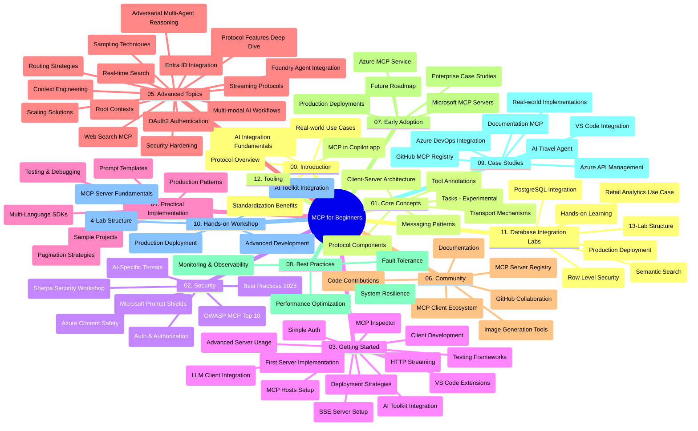

# Protokol konteksta modela (MCP) za početnike - Vodič za učenje

Ovaj vodič za učenje pruža pregled strukture i sadržaja repozitorija za kurikulum "Protokol konteksta modela (MCP) za početnike". Koristite ovaj vodič za učinkovito snalaženje u repozitoriju i maksimalno iskorištavanje dostupnih resursa.

## Pregled repozitorija

Protokol konteksta modela (MCP) je standardizirani okvir za interakcije između AI modela i klijentskih aplikacija. Izvorno stvoren od strane Anthropic-a, MCP sada održava šira MCP zajednica kroz službenu GitHub organizaciju. Ovaj repozitorij pruža sveobuhvatan kurikulum s praktičnim primjerima koda u C#, Java, JavaScript, Python i TypeScript, namijenjen AI programerima, arhitektima sustava i softverskim inženjerima.

## Vizualna karta kurikuluma

## Struktura repozitorija

Repozitorij je organiziran u dvanaest glavnih sekcija, od kojih se svaka fokusira na različite aspekte MCP-a:

1. **Uvod (00-Introduction/)**
   - Pregled Protokola konteksta modela
   - Zašto je standardizacija važna u AI procesima
   - Praktične primjene i koristi

2. **Osnovni pojmovi (01-CoreConcepts/)**
   - Klijent-poslužitelj arhitektura
   - Ključne komponente protokola
   - Obrasci slanja poruka u MCP-u
   - Trenutna specifikacija: [Što je promijenjeno u MCP-u: specifikacija 2026-07-28](./01-CoreConcepts/mcp-2026-07-28.md) — bezdržavni protokolarni jezgra, okviri za proširenja te ukidanja korijena/sampling/logiranja

3. **Sigurnost (02-Security/)**
   - Sigurnosne prijetnje u sustavima temeljenim na MCP-u
   - Najbolje prakse za osiguranje implementacija
   - Strategije autentifikacije i autorizacije
   - Praktični [primjer autorizacije CIMD i DCR](./02-Security/samples/cimd-dcr-auth/README.md)
   - **Sveobuhvatna dokumentacija sigurnosti**:
     - Najbolje sigurnosne prakse MCP-a
     - Vodič za implementaciju Azure Content Safety
     - Kontrole i tehnike sigurnosti MCP-a
     - Brzi pregled najboljih praksi MCP-a
   - **Ključne teme sigurnosti**:
     - Napadi ubrizgavanja naredbi i trovanje alata
     - Otimačina sesije i problemi zbunjenog zastupnika
     - Ranljivosti prijenosa tokena
     - Prekomjerna dopuštenja i kontrola pristupa
     - Sigurnost opskrbnog lanca za AI komponente
     - Integracija Microsoft Prompt Shields

4. **Početak rada (03-GettingStarted/)**
   - Postavljanje okoline i konfiguracija
   - Izrada osnovnih MCP poslužitelja i klijenata
   - Integracija s postojećim aplikacijama
   - Sadrži sekcije za:
     - Prvu implementaciju poslužitelja
     - Razvoj klijenata
     - Integracija LLM klijenta
     - Integracija s VS Code
     - Poslužitelj poslanih događaja (SSE)
     - Napredna uporaba poslužitelja
     - HTTP streaming
     - Integracija AI Toolkit-a
     - Strategije testiranja
     - Smjernice za implementaciju

5. **Praktična implementacija (04-PracticalImplementation/)**
   - Korištenje SDK-a u različitim programskim jezicima
   - Tehnike otklanjanja pogrešaka, testiranja i validacije
   - Izrada ponovo iskoristivih predložaka promptova i tijekova rada
   - Primjeri projekata s implementacijama

6. **Napredne teme (05-AdvancedTopics/)**
   - Tehnike inženjeringa konteksta
   - Integracija Foundry agenta
   - Višemodalni AI tijekovi rada
   - Demonstracije OAuth2 autentifikacije
   - Mogućnosti pretraživanja u stvarnom vremenu
   - Streaming u stvarnom vremenu
   - Implementacija korijenskih konteksta
   - Strategije usmjeravanja
   - Tehnike uzorkovanja
   - Pristupi skaliranju
   - Sigurnosni aspekti
   - Integracija sigurnosti Entra ID-a
   - Integracija web pretraživanja
   - Protivničko multi-agentno rezoniranje (obrasci debate)

7. **Doprinosi zajednice (06-CommunityContributions/)**
   - Kako pridonijeti kodom i dokumentacijom
   - Suradnja putem GitHuba
   - Unapređenja i povratne informacije potaknute zajednicom
   - Korištenje raznih MCP klijenata (Claude Desktop, Cline, VSCode)
   - Rad s popularnim MCP poslužiteljima uključujući generiranje slika

8. **Lekcije iz rane primjene (07-LessonsfromEarlyAdoption/)**
   - Implementacije iz stvarnog svijeta i priče o uspjehu
   - Izgradnja i implementacija rješenja temeljenih na MCP-u
   - Trendovi i buduća karta puta
   - **Vodič za Microsoft MCP poslužitelje**: Sveobuhvatan vodič za 10 Microsoft MCP poslužitelja spremnih za produkciju, uključujući:
     - Microsoft Learn Docs MCP poslužitelj
     - Azure MCP poslužitelj (15+ specijaliziranih konektora)
     - GitHub MCP poslužitelj
     - Azure DevOps MCP poslužitelj
     - MarkItDown MCP poslužitelj
     - SQL Server MCP poslužitelj
     - Playwright MCP poslužitelj
     - Dev Box MCP poslužitelj
     - Microsoft Foundry MCP poslužitelj
     - Microsoft 365 Agents Toolkit MCP poslužitelj

9. **Najbolje prakse (08-BestPractices/)**
   - Podešavanje performansi i optimizacija
   - Dizajniranje otpornog MCP sustava
   - Strategije testiranja i otpornosti

10. **Studije slučaja (09-CaseStudy/)**
    - **Sedam sveobuhvatnih studija slučaja** koje pokazuju svestranost MCP-a u različitim scenarijima:
    - **Azure AI Travel Agents**: Orkestracija više agenata s Azure OpenAI i AI pretraživanjem
    - **Integracija Azure DevOps-a**: Automatizacija tokova rada s ažuriranjima podataka s YouTubea
    - **Prikupljanje dokumenata u stvarnom vremenu**: Python konzolni klijent s HTTP streamingom
    - **Interaktivni generator plana učenja**: Chainlit web aplikacija s konverzacijskom AI
    - **Dokumentacija unutar uređivača**: Integracija VS Codea s GitHub Copilot tijekovima rada
    - **Upravljanje Azure API-jem**: Enterprise integracija API-ja s kreiranjem MCP poslužitelja
    - **GitHub MCP registar**: Razvoj ekosustava i platforma za agentsku integraciju
    - Primjeri implementacija obuhvaćaju enterprise integraciju, produktivnost programera i razvoj ekosustava

11. **Praktične radionice (10-StreamliningAIWorkflowsBuildingAnMCPServerWithAIToolkit/)**
    - Sveznajuće praktične radionice koje povezuju MCP s AI Toolkitom
    - Izrada inteligentnih aplikacija koje povezuju AI modele s alatima iz stvarnog svijeta
    - Praktični moduli koji pokrivaju osnove, razvoj prilagođenih poslužitelja i strategije produkcijske implementacije
    - **Struktura laboratorija**:
      - Laboratorij 1: Osnove MCP poslužitelja
      - Laboratorij 2: Napredni razvoj MCP poslužitelja
      - Laboratorij 3: Integracija AI Toolkita
      - Laboratorij 4: Produkcijska implementacija i skaliranje
    - Pristup učenju kroz laboratorije s uputama korak po korak

12. **Laboratoriji integracije baze podataka MCP poslužitelja (11-MCPServerHandsOnLabs/)**
    - **Sveobuhvatni put učenja kroz 13 laboratorija** za izgradnju MCP poslužitelja spremnih za produkciju s PostgreSQL integracijom
    - **Primjena analitike trgovine u stvarnom svijetu** koristeći Zava Retail slučaj
    - **Enterprise obrasci** uključujući sigurnost na razini retka (RLS), semantičko pretraživanje i višekorisnički pristup podacima
    - **Potpuna struktura laboratorija**:
      - **Laboratoriji 00-03: Osnove** - Uvod, arhitektura, sigurnost, postavljanje okoline
      - **Laboratoriji 04-06: Izgradnja MCP poslužitelja** - Dizajn baze podataka, implementacija MCP poslužitelja, razvoj alata
      - **Laboratoriji 07-09: Napredne značajke** - Semantičko pretraživanje, testiranje i otklanjanje pogrešaka, integracija s VS Codeom
      - **Laboratoriji 10-12: Produkcija i najbolje prakse** - Implementacija, nadzor, optimizacija
    - **Obuhvaćene tehnologije**: FastMCP okvir, PostgreSQL, Azure OpenAI, Azure Container Apps, Application Insights
    - **Ishodi učenja**: MCP poslužitelji spremni za produkciju, obrasci integracije baze podataka, AI podržana analitika, sigurnost na razini poduzeća

13. **Alati (12-tooling/)**
    - Naučite kako koristiti MCP u Copilot aplikaciji i drugim alatima

## Dodatni resursi

Repozitorij uključuje prateće resurse:

- **Mapa s slikama**: Sadrži dijagrame i ilustracije korištene kroz cijeli kurikulum
- **Prijevodi**: Podrška za više jezika s automatiziranim prijevodima dokumentacije
- **Službeni MCP resursi**:
  - [MCP dokumentacija](https://modelcontextprotocol.io/)
  - [MCP specifikacija](https://modelcontextprotocol.io/specification/2026-07-28/)
  - [MCP GitHub repozitorij](https://github.com/modelcontextprotocol)

## Kako koristiti ovaj repozitorij

1. **Sekvencijalno učenje**: Slijedite poglavlja redom (00 do 11) za strukturirano učenje.
2. **Fokus na programski jezik**: Ako ste zainteresirani za određeni programski jezik, istražite direktorije uzoraka za implementacije u vašem preferiranom jeziku.
3. **Praktična implementacija**: Počnite sa sekcijom "Početak rada" kako biste postavili okruženje i kreirali svoj prvi MCP poslužitelj i klijenta.
4. **Napredno istraživanje**: Kad savladate osnove, zaronite u napredne teme za širenje znanja.
5. **Angažman u zajednici**: Pridružite se MCP zajednici putem GitHub diskusija i Discord kanala kako biste se povezali s stručnjacima i kolegama programerima.

## MCP klijenti i alati

Kurikulum pokriva razne MCP klijente i alate:

1. **Službeni klijenti**:
   - Visual Studio Code
   - MCP u Visual Studio Codeu
   - Claude Desktop
   - Claude u VSCode-u
   - Claude API

2. **Klijenti zajednice**:
   - Cline (terminalski baziran)
   - Cursor (uređivač koda)
   - ChatMCP
   - Windsurf

3. **Alati za upravljanje MCP-om**:
   - MCP CLI
   - MCP Manager
   - MCP Linker
   - MCP Router

## Popularni MCP poslužitelji

Repozitorij uvodi razne MCP poslužitelje, uključujući:

1. **Službeni Microsoft MCP poslužitelji**:
   - Microsoft Learn Docs MCP poslužitelj
   - Azure MCP poslužitelj (15+ specijaliziranih konektora)
   - GitHub MCP poslužitelj
   - Azure DevOps MCP poslužitelj
   - MarkItDown MCP poslužitelj
   - SQL Server MCP poslužitelj
   - Playwright MCP poslužitelj
   - Dev Box MCP poslužitelj
   - Microsoft Foundry MCP poslužitelj
   - Microsoft 365 Agents Toolkit MCP poslužitelj

2. **Službeni referentni poslužitelji**:
   - Datotečni sustav
   - Fetch
   - Memory
   - Sekvencijalno razmišljanje

3. **Generiranje slika**:
   - Azure OpenAI DALL-E 3
   - Stable Diffusion WebUI
   - Replicate

4. **Razvojni alati**:
   - Git MCP
   - Kontrola terminala
   - Asistent za kod

5. **Specijalizirani poslužitelji**:
   - Salesforce
   - Microsoft Teams
   - Jira & Confluence

## Doprinosi

Ovaj repozitorij pozdravlja doprinose zajednice. Pogledajte sekciju Doprinosi zajednice za upute kako učinkovito pridonijeti MCP ekosustavu.

----

*Ovaj vodič za učenje posljednji put je ažuriran 9. rujna 2026. godine. Odražava MCP
Specifikaciju `2026-07-28`, trenutno revidirani protokol. Neki praktični
primjeri ostaju eksplicitno verzionirani na `2025-11-25` dok njihovi SDK-i i alati
usvajaju bezdržavne protokolarne API-je.*

---

<!-- CO-OP TRANSLATOR DISCLAIMER START -->
**Napomena**:
Ovaj dokument je preveden korištenjem AI prevoditeljskog servisa [Co-op Translator](https://github.com/Azure/co-op-translator). Iako težimo točnosti, imajte na umu da automatski prijevodi mogu sadržavati greške ili netočnosti. Izvorni dokument na izvornom jeziku treba smatrati autoritativnim izvorom. Za važne informacije preporuča se profesionalni ljudski prijevod. Nismo odgovorni za bilo kakva nesporazumevanja ili pogrešne interpretacije koje proizlaze iz korištenja ovog prijevoda.
<!-- CO-OP TRANSLATOR DISCLAIMER END -->