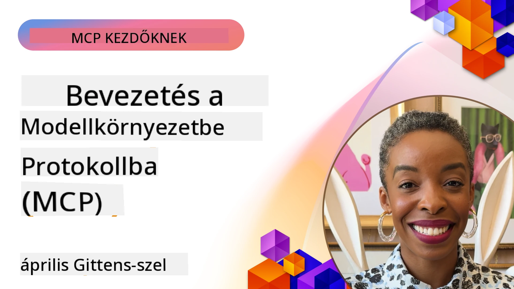
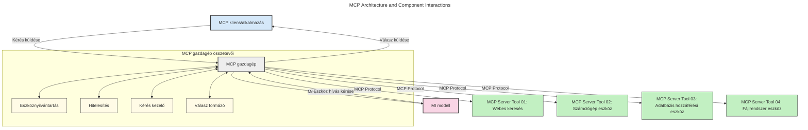
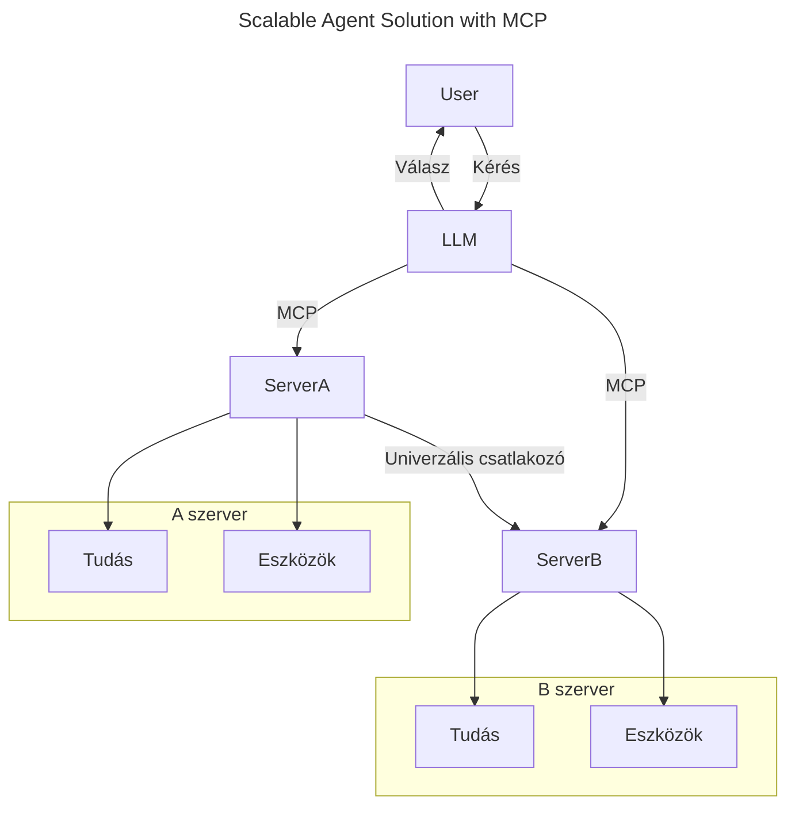
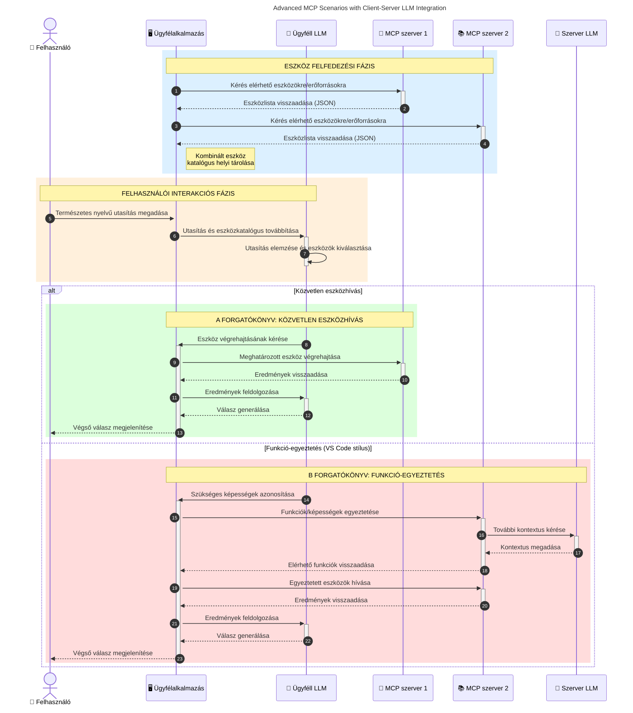

# A Model Context Protocol (MCP) bemutatása: Miért fontos a skálázható AI-alkalmazásokhoz

_(Kattints a fenti képre a tanóra videójának megtekintéséhez)_

A generatív AI-alkalmazások nagy előrelépést jelentenek, mivel gyakran lehetővé teszik a felhasználó számára, hogy természetes nyelvű parancsokat használva lépjen interakcióba az alkalmazással. Azonban ahogy egyre több időt és erőforrást fektetnek ezekbe az alkalmazásokba, biztosítani szeretnéd, hogy a funkciók és erőforrások könnyen integrálhatók legyenek oly módon, hogy egyszerű legyen bővíteni, az alkalmazás több modell egyidejű használatát is tudja kezelni, valamint a különféle modellbeli finomságokat kezelni tudja. Röviden, a generatív AI-alkalmazások építése egyszerűen indul, de ahogy nőnek és összetettebbé válnak, szükség van egy architektúra meghatározására, és valószínűleg egy szabványra kell támaszkodni annak érdekében, hogy az alkalmazások következetesen legyenek felépítve. Ekkor lép közbe az MCP, hogy rendezetten szervezze a dolgokat és biztosítson egy szabványt.

---

## **🔍 Mi az a Model Context Protocol (MCP)?**

A **Model Context Protocol (MCP)** egy **nyílt, szabványosított interfész**, amely lehetővé teszi a nagy nyelvi modellek (LLM-ek) számára, hogy zökkenőmentesen kommunikáljanak külső eszközökkel, API-kkal és adatforrásokkal. Egy következetes architektúrát biztosít, amely növeli az AI modellek funkcionalitását a tanítási adatokon túl, lehetővé téve az intelligensebb, skálázhatóbb és érzékenyebb AI rendszerek létrehozását.

---

## **🎯 Miért fontos az AI területén a szabványosítás**

Ahogy a generatív AI alkalmazások egyre összetettebbekké válnak, létfontosságú szabványokat alkalmazni, amelyek biztosítják a **skálázhatóságot, bővíthetőséget, fenntarthatóságot** és **elkerülik a szolgáltatóhoz való túlságos kötődést**. Az MCP ezekre az igényekre ad választ, az alábbi módon:

- Egyesíti a modell-eszköz integrációkat
- Csökkenti az törékeny, egyszeri egyedi megoldásokat
- Lehetővé teszi, hogy több különböző gyártó modellje egy ökoszisztémán belül együttműködjön

**Megjegyzés:** Bár az MCP nyílt szabványnak tekinti magát, nincs tervben, hogy bármely meglévő szabványosító testület, például az IEEE, IETF, W3C, ISO vagy bármely más szabványosító testület által szabványosítsák.

---

## **📚 Tanulási célok**

A cikk végére képes leszel:

- Meghatározni a **Model Context Protocol (MCP)** fogalmát és használati eseteit
- Megérteni, hogyan szabványosítja az MCP a modell és az eszköz közötti kommunikációt
- Azonosítani az MCP architektúra fő komponenseit
- Megvizsgálni az MCP valós alkalmazásait vállalati és fejlesztői környezetben

---

## **💡 Miért forradalmi a Model Context Protocol (MCP)**

### **🔗 Az MCP megoldja az AI interakciók széttagoltságát**

Az MCP előtt a modellek és eszközök integrációja az alábbiakat igényelte:

- Egyedi kódolást minden egyes eszköz-modell pároshoz
- Nem szabványos API-kat minden gyártó részére
- Gyakori megszakításokat a frissítések miatt
- Rossz skálázhatóságot több eszköz esetén

### **✅ Az MCP szabványosítás előnyei**

| **Előny**                | **Leírás**                                                                    |
|--------------------------|------------------------------------------------------------------------------|
| Interoperabilitás         | Az LLM-ek zökkenőmentesen működnek különböző gyártók eszközeivel             |
| Egységesség               | Egységes viselkedés platformok és eszközök között                            |
| Újrahasznosíthatóság     | Egyszer épített eszközök több projektben és rendszerben is használhatók      |
| Gyorsított fejlesztés     | Csökkenti a fejlesztési időt szabványos, plug-and-play interfészek alkalmazásával |

---

## **🧱 MCP architektúra áttekintése magas szinten**

Az MCP egy **kliens-szerver modellt** követ, ahol:

- **MCP Hostok** futtatják az AI modelleket  
- **MCP Kliensek** kezdeményeznek kéréseket  
- **MCP Szerverek** szolgáltatják a kontextust, az eszközöket és a képességeket  

### **Fő komponensek:**

- **Erőforrások** – Statikus vagy dinamikus adatok a modellek számára  
- **Promptok** – Előre definiált munkafolyamatok vezérelt generáláshoz  
- **Eszközök** – Végrehajtható funkciók, mint például keresés, számítások  
- **Mintavétel** – Ügynöki viselkedés rekurzív interakciók révén (elavult az
    MCP `2026-07-28`-től; új implementációk közvetlenül egy LLM
    szolgáltatóval integrálódjanak)  
- **Kikérés** – Szerver által kezdeményezett felhasználói bemeneti kérések  
- **Gyökerek** – Információs fájlrendszer-helyek, melyek a szerverhez kapcsolódnak  
    (elavult az MCP `2026-07-28`-től; előnyben részesített eszközparaméterek, erőforrás URI-k vagy
    szerver konfiguráció)  

### **Protokoll architektúra:**

Az MCP két rétegű architektúrát használ:
- **Adat réteg**: JSON-RPC 2.0 üzenetek, kérésenkénti metaadatok, felfedezés és
    protokoll primitívek  
- **Szállítási réteg**: stdio helyi alfolyamatokhoz és Streamable HTTP távoli szerverekhez.
    A Streamable HTTP használhat SSE keretezést az adatfolyam válaszokhoz,
    de a régebbi HTTP+SSE szállítás elavult.  

---

## Hogyan működnek az MCP szerverek

Az MCP szerverek a következő módon működnek:

- **Kérések folyamata**:
    1. Egy kérést egy végfelhasználó vagy annak nevében eljáró szoftver indít.
    2. Az **MCP kliens** elküldi a kérést egy **MCP hosztnak**, amely kezeli az AI modell futtatókörnyezetét.
    3. Az **AI modell** megkapja a felhasználói promptot, és kérheti külső eszközök vagy adatok elérését egy vagy több eszközhíváson keresztül.
    4. Az **MCP hoszt**, nem magának a modellnek, kommunikál a megfelelő **MCP szerver(ek)kel** a szabványos protokoll használatával.
- **MCP hoszt funkciói**:
    - **Eszközregiszter**: Karbantartja az elérhető eszközök és képességek katalógusát.
    - **Hitelesítés**: Ellenőrzi az eszközhozzáférés jogosultságait.
    - **Kéréskezelő**: Feldolgozza a modellből érkező eszközkéréseket.
    - **Válaszformázó**: Olyan formátumba rendezi az eszközök kimenetét, amit a modell ért meg.
- **MCP szerver futtatás**:
    - Az **MCP hoszt** az eszközhívásokat egy vagy több **MCP szerverhez** irányítja, melyek specializált funkciókat kínálnak (például keresés, számítások, adatbázis-lekérdezések).
    - Az **MCP szerverek** végrehajtják a respective műveleteket és eredményt adnak vissza az **MCP hosztnak**, egységes formátumban.
    - Az **MCP hoszt** formázza és továbbítja ezeket az eredményeket az **AI modellnek**.
- **Válasz lezárása**:
    - Az **AI modell** beépíti az eszközök kimenetét a végső válaszba.
    - Az **MCP hoszt** visszaküldi a választ az **MCP kliensnek**, amely azt továbbítja a végfelhasználónak vagy a hívó szoftvernek.
    

## 👨‍💻 Hogyan építsünk MCP szervert (példákkal)

Az MCP szerverek lehetővé teszik az LLM képességeinek bővítését adat és funkcionalitás biztosításával.

Kész kipróbálni? Íme nyelv- és/vagy stack-specifikus SDK-k, példákkal egyszerű MCP szerverek létrehozására különböző nyelveken/stackeken:

- **Python SDK**: https://github.com/modelcontextprotocol/python-sdk

- **TypeScript SDK**: https://github.com/modelcontextprotocol/typescript-sdk

- **Java SDK**: https://github.com/modelcontextprotocol/java-sdk

- **C#/.NET SDK**: https://github.com/modelcontextprotocol/csharp-sdk

## 🌍 Az MCP valós használati esetei

Az MCP széles skáláját teszi lehetővé az alkalmazásoknak az AI képességek bővítésével:

| **Alkalmazás**                | **Leírás**                                                                |
|------------------------------|----------------------------------------------------------------------------|
| Vállalati adat integráció    | LLM-ek összekapcsolása adatbázisokkal, CRM-ekkel vagy belső eszközökkel     |
| Ügynöki AI rendszerek        | Autonóm ügynökök engedélyezése eszközhozzáféréssel és döntéshozó munkafolyamatokkal |
| Többmodalitású alkalmazások  | Szöveg, kép és hang eszközök kombinálása egyetlen egységes AI alkalmazáson belül |
| Valós idejű adat integráció  | Élő adatok bevitele AI interakciókba a pontosabb, aktuális válaszok érdekében |

### 🧠 MCP = Egyetemes szabvány az AI interakciókhoz

A Model Context Protocol (MCP) egyetemes szabványként működik az AI interakciók számára, olyan módon, ahogy az USB-C szabványosította az eszközök fizikai csatlakozását. Az AI világában az MCP következetes interfészt biztosít, amely lehetővé teszi a modellek (kliens) zökkenőmentes integrációját külső eszközökkel és adatforrásokat szolgáltatókkal (szerverek). Ez megszünteti az egyes API-k vagy adatforrások számára szükséges különféle, egyedi protokollok szükségességét.

Az MCP alatt az MCP-kompatibilis eszköz (amelyet MCP szervernek neveznek) egy egységes szabványt követ. Ezek a szerverek felsorolhatják, milyen eszközöket vagy műveleteket kínálnak, és végrehajthatják azokat, amikor egy AI ügynök kéri őket. Az MCP-t támogató AI ügynök platformok képesek felfedezni a szerverek elérhető eszközeit és ezen szabványos protokollon keresztül meghívni őket.

### 💡 Elősegíti a tudáshoz való hozzáférést

Az eszközök kínálata mellett az MCP megkönnyíti a tudáshoz való hozzáférést is. Lehetővé teszi, hogy az alkalmazások kontextust biztosítsanak a nagy nyelvi modelleknek különféle adatforrások összekapcsolásával. Például egy MCP szerver képviselheti egy cég dokumentumtárát, lehetővé téve az ügynökök számára, hogy igény szerint lekérjenek releváns információkat. Egy másik szerver pedig specifikus műveletek végrehajtásáért felel, mint például e-mailek küldése vagy rekordok frissítése. Az ügynök szempontjából ezek egyszerűen eszközök, amelyek közül néhány adatokat (tudás kontextust) ad vissza, míg mások műveleteket hajtanak végre. Az MCP hatékonyan kezeli mindkettőt.

Egy ügynök, amely egy MCP szerverhez csatlakozik, automatikusan megtanulja a szerver elérhető képességeit és hozzáférhető adatait standard formátumon keresztül. Ez a szabványosítás dinamikus eszköz elérhetőséget tesz lehetővé. Például, ha egy új MCP szervert adnak az ügynök rendszeréhez, annak funkciói azonnal használhatók lesznek anélkül, hogy az ügynök utasításait tovább kellene szabni.

Ez a gördülékeny integráció összhangban van a következő ábrán látható folyamattal, ahol a szerverek mind eszközöket, mind tudást biztosítanak, ezzel biztosítva a zökkenőmentes együttműködést a rendszerek között. 

### 👉 Példa: Skálázható ügynök megoldás

Az Universal Connector lehetővé teszi, hogy az MCP szerverek kommunikáljanak és megosszák képességeiket egymással, így a ServerA átadhat feladatokat a ServerB-nek vagy hozzáférhet annak eszközeihez és tudásához. Ez az eszközök és adatok federációját jelenti a szerverek között, támogatva ezzel a skálázható és moduláris ügynök architektúrákat. Mivel az MCP szabványosítja az eszközök kitettségét, az ügynökök dinamikusan felfedezhetik és irányíthatják a kéréseket a szerverek között kódolt integrációk nélkül.

Eszköz- és tudás federáció: Eszközök és adatok elérhetők a szerverek között, lehetővé téve a skálázhatóbb és modulárisabb ügynök architektúrákat.

### 🔄 Fejlett MCP forgatókönyvek kliensoldali LLM integrációval

Az alap MCP architektúrán túlmenően léteznek fejlett forgatókönyvek, ahol mind kliens, mind szerver tartalmaz LLM-eket, lehetővé téve kifinomultabb interakciókat. A következő ábrán a **Kliens alkalmazás** lehet például egy fejlesztői környezet (IDE), amely számos MCP eszközt kínál az LLM számára:

## 🔐 Az MCP gyakorlati előnyei

Íme az MCP használatának gyakorlati előnyei:

- **Frissesség**: A modellek elérhetnek naprakész információkat a tanítási adatokon túl  
- **Képességbővítés**: A modellek kihasználhatják a speciális eszközöket olyan feladatokhoz, amelyekre nem voltak tanítva  
- **Csökkentett tévesztések**: Külső adatforrások biztosítanak tényalapú megalapozottságot  
- **Adatvédelem**: Az érzékeny adatok biztonságos környezetben maradhatnak a promptok beágyazása helyett  

## 📌 Főbb tanulságok

Az MCP használatának főbb tanulságai:

- Az **MCP** szabványosítja az AI modellek eszközökkel és adatokkal való interakcióját  
- Elősegíti a **bővíthetőséget, következetességet és interoperabilitást**  
- Az MCP segít **csökkenteni a fejlesztési időt, növelni a megbízhatóságot és bővíteni a modell képességeit**  
- A kliens-szerver architektúra **lehetővé teszi a rugalmas, bővíthető AI alkalmazásokat**  

## 🧠 Gyakorlat

Gondolj egy AI alkalmazásra, amelynek a fejlesztése érdekel.

- Milyen **külső eszközök vagy adatok** növelhetnék a képességeit?  
- Hogyan tehetné az MCP az integrációt **egyszerűbbé és megbízhatóbbá**?  

## További források

- [MCP GitHub tárhely](https://github.com/modelcontextprotocol)

## Mi következik

Következő: [1. fejezet: Alapfogalmak](../01-CoreConcepts/README.md)

---

<!-- CO-OP TRANSLATOR DISCLAIMER START -->
**Jogi nyilatkozat**:
Ez a dokumentum az AI fordítási szolgáltatás, a [Co-op Translator](https://github.com/Azure/co-op-translator) segítségével készült. Bár az pontosságra törekszünk, kérjük, vegye figyelembe, hogy az automatikus fordítások hibákat vagy pontatlanságokat tartalmazhatnak. Az eredeti dokumentum az anyanyelvén tekintendő hiteles forrásnak. Fontos információk esetén professzionális emberi fordítást javasolunk. Nem vállalunk felelősséget semmilyen félreértésért vagy téves értelmezésért, amely ebből a fordításból ered.
<!-- CO-OP TRANSLATOR DISCLAIMER END -->