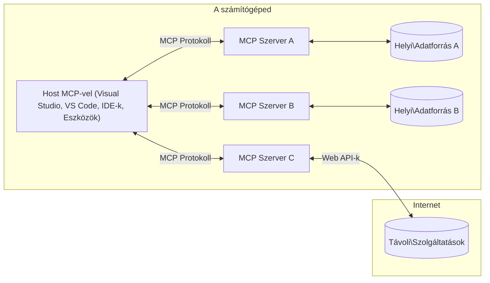

# MCP Alapfogalmak: A Model Context Protocol Mesteri Használata az AI Integrációhoz

[](https://youtu.be/earDzWGtE84)

_(Kattints a fenti képre a lecke videójának megtekintéséhez)_

A [Model Context Protocol (MCP)](https://github.com/modelcontextprotocol) egy erőteljes, szabványosított keretrendszer, amely optimalizálja a kommunikációt a Nagy Nyelvi Modellek (LLM-ek) és külső eszközök, alkalmazások, valamint adatforrások között.  
Ez az útmutató végigvezet az MCP alapfogalmain. Megismerheted a kliens-szerver architektúrát, a lényeges összetevőket, a kommunikáció mechanizmusait és a megvalósítás legjobb gyakorlatait.

- **Explicit Felhasználói Hozzájárulás**: Minden adat-hozzáférés és művelet végrehajtása előtt explicit felhasználói jóváhagyás szükséges. A felhasználóknak világosan érteniük kell, hogy milyen adatokhoz férnek hozzá és milyen műveletek történnek, részletes engedélyezési és jogosultsági kontrollal.

- **Adatvédelmi Védelem**: A felhasználói adatok csak explicit hozzájárulással kerülnek megosztásra, és az egész interakciós életciklus alatt erős hozzáférés-ellenőrzéssel kell védeni őket. A megvalósításoknak meg kell akadályozniuk az illetéktelen adatátvitelt és szigorú adatvédelmi határokat kell fenntartaniuk.

- **Eszközvégrehajtás Biztonsága**: Minden eszköz meghívásához explicit felhasználói hozzájárulás szükséges, amely világosan ismerteti az eszköz funkcióját, paramétereit és lehetséges hatásait. Erős biztonsági határoknak kell megakadályozniuk a nem szándékolt, veszélyes vagy rosszindulatú eszközvégrehajtást.

- **Transzport Réteg Biztonság**: Minden kommunikációs csatornának megfelelő titkosítást és hitelesítési mechanizmusokat kell használnia. A távoli kapcsolatoknak biztonságos transzport protokollokat és megfelelő hitelesítő adatkezelést kell alkalmazniuk.

#### Megvalósítási Irányelvek:

- **Engedélykezelés**: Finomhangolt engedélyrendszerek megvalósítása, amelyek lehetővé teszik a felhasználók számára, hogy szabályozzák, mely szerverekhez, eszközökhöz és erőforrásokhoz férhetnek hozzá  
- **Hitelesítés és Jogosultságkezelés**: Biztonságos hitelesítési módszerek (OAuth, API kulcsok) használata megfelelő tokenkezeléssel és lejárattal  
- **Bemenet Érvényesítés**: Minden paraméter és adatbevitel érvényesítése a meghatározott sémák szerint az injekciós támadások megelőzésére  
- **Audit Naplózás**: Minden művelet átfogó naplózása a biztonsági megfigyelés és megfelelőség érdekében

## Áttekintés

Ez a lecke bemutatja a Model Context Protocol (MCP) ökoszisztéma alapvető architektúráját és összetevőit. Megismerheted a kliens-szerver architektúrát, a kulcsfontosságú elemeket és a kommunikációs mechanizmusokat, amelyek az MCP interakciókat működtetik.

## Fő Tanulási Célok

A lecke végére képes leszel:

- Megérteni az MCP kliens-szerver architektúrát.  
- Azonosítani a Hostok, Kliensek és Szerverek szerepét és felelősségeit.  
- Elemezni az MCP rugalmas integrációs rétegének alapvető jellemzőit.  
- Megérteni, hogyan áramlik az információ az MCP ökoszisztémában.  
- Gyakorlati betekintést nyerni .NET, Java, Python és JavaScript kódpéldákon keresztül.

## MCP Architektúra: Mélyebb Áttekintés

Az MCP ökoszisztéma kliens-szerver modellre épül. Ez a moduláris struktúra lehetővé teszi, hogy az AI alkalmazások hatékonyan kommunikáljanak eszközökkel, adatbázisokkal, API-kkal és kontextuális erőforrásokkal. Nézzük meg ezt az architektúrát alapvető összetevőire bontva.

Az MCP alapvetően kliens-szerver architektúrát követ, ahol egy host alkalmazás több szerverhez is csatlakozhat:


- **MCP Hostok**: Olyan programok, mint a VSCode, Claude Desktop, IDE-k vagy AI eszközök, amelyek MCP-n keresztül szeretnének adatokat elérni  
- **MCP Kliensek**: Protokoll kliensek, amelyek 1:1 kapcsolatot tartanak fenn a szerverekkel  
- **MCP Szerverek**: Könnyűsúlyú programok, amelyek a szabványos Model Context Protocolon keresztül specifikus képességeket tesznek elérhetővé  
- **Helyi Adatforrások**: A számítógéped fájljai, adatbázisai és szolgáltatásai, amelyekhez az MCP szerverek biztonságosan hozzáférhetnek  
- **Távoli Szolgáltatások**: Interneten elérhető külső rendszerek, amelyekhez az MCP szerverek API-kon keresztül csatlakozhatnak.

Az MCP Protokoll egy folyamatosan fejlődő szabvány, amely dátum alapú verziózást használ (ÉÉÉÉ-HH-NN formátumban). A jelenlegi protokoll verzió **2025-11-25**. A legfrissebb frissítéseket a [protokoll specifikációban](https://modelcontextprotocol.io/specification/2025-11-25/) találod.

### 1. Hostok

A Model Context Protocol (MCP) esetében a **Hostok** azok az AI alkalmazások, amelyek az elsődleges felületet biztosítják a felhasználók számára a protokollal való interakcióhoz. A Hostok koordinálják és kezelik a kapcsolatokat több MCP szerverrel azáltal, hogy dedikált MCP klienseket hoznak létre minden szerverkapcsolathoz. Host példák:

- **AI Alkalmazások**: Claude Desktop, Visual Studio Code, Claude Code  
- **Fejlesztői Környezetek**: IDE-k és kódszerkesztők MCP integrációval  
- **Egyedi Alkalmazások**: Célzott AI ügynökök és eszközök

A **Hostok** olyan alkalmazások, amelyek koordinálják az AI modellekkel való interakciókat. Ők:

- **AI Modellek Orkesztrálása**: LLM-ek futtatása vagy velük való interakció a válaszok generálásához és AI munkafolyamatok koordinálásához  
- **Kliens Kapcsolatok Kezelése**: Minden MCP szerverkapcsolathoz egy MCP kliens létrehozása és fenntartása  
- **Felhasználói Felület Irányítása**: A beszélgetés folyamatának, felhasználói interakciók és válaszmegjelenítés kezelését  
- **Biztonság Betartatása**: Jogosultságok, biztonsági korlátok és hitelesítés kezelése  
- **Felhasználói Hozzájárulás Kezelése**: Felhasználói jóváhagyás kezelése adatmegosztáshoz és eszközvégrehajtáshoz

### 2. Kliensek

A **Kliensek** alapvető összetevők, amelyek dedikált egy-egy kapcsolatot tartanak fenn a Hostok és az MCP szerverek között. Minden MCP kliens a Host által jön létre, hogy egy adott MCP szerverhez csatlakozzon, biztosítva a szervezett és biztonságos kommunikációs csatornákat. Több kliens lehetővé teszi, hogy a Host egyszerre több szerverhez kapcsolódjon.

A **Kliensek** a host alkalmazáson belüli kapcsolódó komponensek. Ők:

- **Protokoll Kommunikáció**: JSON-RPC 2.0 kérések küldése a szervereknek promptokkal és utasításokkal  
- **Képesség Egyeztetés**: A támogatott funkciók és protokoll verziók egyeztetése a szerverekkel az inicializáció során  
- **Eszközvégrehajtás**: Eszközvégrehajtási kérések kezelése a modellektől és válaszok feldolgozása  
- **Valós Idejű Frissítések**: Értesítések és valós idejű frissítések kezelése a szerverektől  
- **Válaszfeldolgozás**: A szerver válaszainak feldolgozása és formázása a felhasználók számára történő megjelenítéshez

### 3. Szerverek

A **Szerverek** olyan programok, amelyek kontextust, eszközöket és képességeket biztosítanak az MCP kliensek számára. Futhatnak helyileg (ugyanazon a gépen, mint a Host) vagy távolról (külső platformokon), és felelősek a kliens kérések kezeléséért és strukturált válaszok biztosításáért. A szerverek specifikus funkciókat tesznek elérhetővé a szabványos Model Context Protocolon keresztül.

A **Szerverek** szolgáltatások, amelyek kontextust és képességeket nyújtanak. Ők:

- **Funkció Regisztráció**: Elérhető primitívek (erőforrások, promptok, eszközök) regisztrálása és elérhetővé tétele a kliensek számára  
- **Kérés Feldolgozás**: Eszközhívások, erőforrás kérések és prompt kérések fogadása és végrehajtása a kliensektől  
- **Kontextus Biztosítása**: Kontextuális információk és adatok szolgáltatása a modell válaszok javításához  
- **Állapotkezelés**: Munkamenet állapotának fenntartása és állapotfüggő interakciók kezelése szükség esetén  
- **Valós Idejű Értesítések**: Értesítések küldése a képességváltozásokról és frissítésekről a kapcsolódó klienseknek

A szervereket bárki fejlesztheti, hogy kiterjessze a modell képességeit speciális funkciókkal, és támogatják a helyi és távoli telepítési forgatókönyveket is.

### 4. Szerver Primitívek

A Model Context Protocol (MCP) szerverei három alapvető **primitívet** biztosítanak, amelyek meghatározzák a gazdag interakciók alapvető építőköveit a kliensek, hostok és nyelvi modellek között. Ezek a primitívek specifikálják a protokollon keresztül elérhető kontextuális információk és műveletek típusait.

Az MCP szerverek bármilyen kombinációban képesek kitenni a következő három alapvető primitívet:

#### Erőforrások

Az **Erőforrások** adatforrások, amelyek kontextuális információt szolgáltatnak az AI alkalmazások számára. Statikus vagy dinamikus tartalmat képviselnek, amelyek javítják a modell megértését és döntéshozatalát:

- **Kontextuális Adatok**: Strukturált információk és kontextus az AI modell számára  
- **Tudásbázisok**: Dokumentum tárak, cikkek, kézikönyvek és kutatási anyagok  
- **Helyi Adatforrások**: Fájlok, adatbázisok és helyi rendszerinformációk  
- **Külső Adatok**: API válaszok, webszolgáltatások és távoli rendszeradatok  
- **Dinamikus Tartalom**: Valós idejű adatok, amelyek külső feltételek alapján frissülnek

Az erőforrásokat URI-k azonosítják, és támogatják a felfedezést a `resources/list` és az elérést a `resources/read` metódusokon keresztül:

```text
file://documents/project-spec.md
database://production/users/schema
api://weather/current
```

#### Promptok

A **Promptok** újrahasználható sablonok, amelyek segítenek strukturálni a nyelvi modellekkel való interakciókat. Szabványosított interakciós mintákat és sablonos munkafolyamatokat biztosítanak:

- **Sablonalapú Interakciók**: Előre strukturált üzenetek és beszélgetésindítók  
- **Munkafolyamat Sablonok**: Szabványosított szekvenciák gyakori feladatokhoz és interakciókhoz  
- **Few-shot Példák**: Példákon alapuló sablonok a modell utasításához  
- **Rendszer Promptok**: Alapvető promptok, amelyek meghatározzák a modell viselkedését és kontextusát  
- **Dinamikus Sablonok**: Paraméterezett promptok, amelyek alkalmazkodnak specifikus kontextusokhoz

A promptok támogatják a változóhelyettesítést, felfedezhetők a `prompts/list` és lekérhetők a `prompts/get` metódusokon keresztül:

```markdown
Generate a {{task_type}} for {{product}} targeting {{audience}} with the following requirements: {{requirements}}
```

#### Eszközök

Az **Eszközök** végrehajtható funkciók, amelyeket az AI modellek meghívhatnak specifikus műveletek végrehajtására. Az MCP ökoszisztéma "igéi", amelyek lehetővé teszik a modellek számára a külső rendszerekkel való interakciót:

- **Végrehajtható Funkciók**: Elkülönült műveletek, amelyeket a modellek specifikus paraméterekkel hívhatnak meg  
- **Külső Rendszer Integráció**: API hívások, adatbázis lekérdezések, fájlműveletek, számítások  
- **Egyedi Azonosító**: Minden eszköznek egyedi neve, leírása és paraméter sémája van  
- **Strukturált Bemenet/Kimenet**: Az eszközök validált paramétereket fogadnak és strukturált, típusos válaszokat adnak vissza  
- **Műveleti Képességek**: Lehetővé teszik a modellek számára, hogy valós világ műveleteket hajtsanak végre és élő adatokat szerezzenek

Az eszközök JSON Sémával vannak definiálva a paraméterek érvényesítéséhez, felfedezhetők a `tools/list` és végrehajthatók a `tools/call` metódusokon keresztül:

```typescript
server.tool(
  "search_products", 
  {
    query: z.string().describe("Search query for products"),
    category: z.string().optional().describe("Product category filter"),
    max_results: z.number().default(10).describe("Maximum results to return")
  }, 
  async (params) => {
    // Hajtsa végre a keresést, és adja vissza a strukturált eredményeket
    return await productService.search(params);
  }
);
```

## Kliens Primitívek

A Model Context Protocol (MCP) esetében a **kliensek** olyan primitíveket tehetnek elérhetővé, amelyek lehetővé teszik a szerverek számára, hogy további képességeket kérjenek a host alkalmazástól. Ezek a kliens oldali primitívek gazdagabb, interaktívabb szerver megvalósításokat tesznek lehetővé, amelyek hozzáférhetnek az AI modell képességeihez és a felhasználói interakciókhoz.

### Mintavételezés

A **Mintavételezés** lehetővé teszi a szerverek számára, hogy nyelvi modell kiegészítéseket kérjenek a kliens AI alkalmazásától. Ez a primitív lehetővé teszi, hogy a szerverek LLM képességekhez férjenek hozzá anélkül, hogy saját modell függőségeket ágyaznának be:

- **Modelltől Független Hozzáférés**: A szerverek kéréseket küldhetnek kiegészítésekre anélkül, hogy LLM SDK-kat vagy modell hozzáférést kezelnének  
- **Szerver Általi AI Indítás**: Lehetővé teszi, hogy a szerverek autonóm módon generáljanak tartalmat a kliens AI modelljével  
- **Rekurzív LLM Interakciók**: Támogatja az összetett forgatókönyveket, ahol a szerverek AI segítséget igényelnek feldolgozáshoz  
- **Dinamikus Tartalom Generálás**: Lehetővé teszi a szerverek számára, hogy kontextuális válaszokat hozzanak létre a host modelljével

A mintavételezés a `sampling/complete` metóduson keresztül indul, ahol a szerverek kiegészítési kéréseket küldenek a klienseknek.

### Információkérés

Az **Információkérés** lehetővé teszi a szerverek számára, hogy további információt vagy megerősítést kérjenek a felhasználóktól a kliens felületen keresztül:

- **Felhasználói Bemenet Kérések**: A szerverek további információt kérhetnek, amikor az eszközvégrehajtáshoz szükséges  
- **Megerősítő Párbeszédek**: Felhasználói jóváhagyás kérése érzékeny vagy hatásos műveletekhez  
- **Interaktív Munkafolyamatok**: Lehetővé teszi a szerverek számára, hogy lépésről lépésre felhasználói interakciókat hozzanak létre  
- **Dinamikus Paramétergyűjtés**: Hiányzó vagy opcionális paraméterek begyűjtése az eszközvégrehajtás során

Az információkérés a `elicitation/request` metódussal történik, amely a kliens felületén gyűjti be a felhasználói bemenetet.

### Naplózás

A **Naplózás** lehetővé teszi a szerverek számára, hogy strukturált naplóüzeneteket küldjenek a klienseknek hibakeresés, megfigyelés és működési átláthatóság céljából:

- **Hibakeresési Támogatás**: Lehetővé teszi a szerverek számára, hogy részletes végrehajtási naplókat biztosítsanak a hibák elhárításához  
- **Működési Megfigyelés**: Állapotfrissítések és teljesítménymutatók küldése a klienseknek  
- **Hibajelentés**: Részletes hiba kontextus és diagnosztikai információk biztosítása  
- **Audit Nyomvonalak**: Átfogó naplók létrehozása a szerver műveletekről és döntésekről

A naplóüzenetek a kliensekhez kerülnek, hogy átláthatóságot biztosítsanak a szerver műveletekben és megkönnyítsék a hibakeresést.

## Információáramlás az MCP-ben

A Model Context Protocol (MCP) strukturált információáramlást definiál a hostok, kliensek, szerverek és modellek között. Ennek az áramlásnak a megértése segít tisztázni, hogyan dolgozzák fel a felhasználói kéréseket, és hogyan integrálódnak a külső eszközök és adatok a modell válaszaiba.

- **A Host Indítja a Kapcsolatot**  
  A host alkalmazás (például egy IDE vagy csevegőfelület) kapcsolatot létesít egy MCP szerverrel, általában STDIO, WebSocket vagy más támogatott transzporton keresztül.

- **Képesség Egyeztetés**  
  A kliens (a hostba ágyazva) és a szerver információt cserélnek a támogatott funkcióikról, eszközeikről, erőforrásaikról és protokoll verzióikról. Ez biztosítja, hogy mindkét fél értse, milyen képességek állnak rendelkezésre az adott munkamenethez.

- **Felhasználói Kérés**  
  A felhasználó interakcióba lép a hosttal (például promptot vagy parancsot ad meg). A host összegyűjti ezt a bemenetet és továbbítja a kliensnek feldolgozásra.

- **Erőforrás vagy Eszköz Használata**  
  - A kliens további kontextust vagy erőforrásokat kérhet a szervertől (például fájlokat, adatbázis bejegyzéseket vagy tudásbázis cikkeket), hogy gazdagítsa a modell megértését.  
  - Ha a modell úgy ítéli meg, hogy eszközre van szükség (például adat lekéréséhez, számítás végrehajtásához vagy API híváshoz), a kliens eszköz meghívási kérést küld a szervernek, megadva az eszköz nevét és paramétereit.

- **Szerver Végrehajtás**  
  A szerver megkapja az erőforrás vagy eszköz kérést, végrehajtja a szükséges műveleteket (például függvény futtatása, adatbázis lekérdezés vagy fájl lekérése), és strukturált formában visszaküldi az eredményeket a kliensnek.

- **Válaszgenerálás**  
  A kliens integrálja a szerver válaszait (erőforrás adatok, eszköz kimenetek stb.) a folyamatban lévő modell interakcióba. A modell ezt az információt használja egy átfogó és kontextuálisan releváns válasz generálásához.

- **Eredmény Bemutatása**  
  A host megkapja a kliens végső kimenetét, és bemutatja a felhasználónak, gyakran tartalmazva a modell által generált szöveget és az eszközvégrehajtás vagy erőforrás lekérdezés eredményeit.

Ez az áramlás lehetővé teszi, hogy az MCP fejlett, interaktív és kontextusérzékeny AI alkalmazásokat támogasson azáltal, hogy zökkenőmentesen kapcsolja össze a modelleket külső eszközökkel és adatforrásokkal.

## Protokoll Architektúra és Rétegek

Az MCP két különálló architekturális rétegből áll, amelyek együttműködnek egy teljes kommunikációs keretrendszer biztosításához:

### Adat Réteg

Az **Adat Réteg** valósítja meg az MCP protokoll magját, amelynek alapja a **JSON-RPC 2.0**. Ez a réteg definiálja az üzenetszerkezetet, szemantikát és az interakciós mintákat:

#### Alapvető Összetevők:

- **JSON-RPC 2.0 Protokoll**: Minden kommunikáció szabványosított JSON-RPC 2.0 üzenetformátumot használ metódushívásokhoz, válaszokhoz és értesítésekhez
- **Életciklus-kezelés**: Kezeli a kapcsolat inicializálását, a képességek egyeztetését és a munkamenet lezárását az ügyfelek és a szerverek között  
- **Szerver primitívek**: Lehetővé teszi a szerverek számára, hogy alapvető funkciókat biztosítsanak eszközök, erőforrások és promptok segítségével  
- **Ügyfél primitívek**: Lehetővé teszi a szerverek számára, hogy mintavételezést kérjenek LLM-ektől, felhasználói bemenetet kérjenek, és naplóüzeneteket küldjenek  
- **Valós idejű értesítések**: Támogatja az aszinkron értesítéseket dinamikus frissítésekhez pollozás nélkül  

#### Főbb jellemzők:

- **Protokoll verzió egyeztetés**: Dátum alapú verziókezelést használ (ÉÉÉÉ-HH-NN) a kompatibilitás biztosítására  
- **Képesség felfedezés**: Az ügyfelek és a szerverek az inicializálás során cserélik az általuk támogatott funkciók információit  
- **Állapotfüggő munkamenetek**: Több interakción át megőrzi a kapcsolat állapotát a kontextus folytonossága érdekében  

### Szállítási réteg

A **Szállítási réteg** kezeli a kommunikációs csatornákat, az üzenetek keretezését és az autentikációt az MCP résztvevők között:

#### Támogatott szállítási mechanizmusok:

1. **STDIO szállítás**:  
   - Szabványos bemenet/kimenet áramokat használ közvetlen folyamatkommunikációhoz  
   - Optimális helyi folyamatokhoz ugyanazon a gépen, hálózati terhelés nélkül  
   - Gyakran használják helyi MCP szerver implementációkhoz  

2. **Streamelhető HTTP szállítás**:  
   - HTTP POST-ot használ ügyfél-szerver üzenetekhez  
   - Opcionális Server-Sent Events (SSE) a szerver-ügyfél streaminghez  
   - Lehetővé teszi távoli szerverekkel való kommunikációt hálózatokon keresztül  
   - Támogatja a szabványos HTTP autentikációt (bearer tokenek, API kulcsok, egyedi fejlécek)  
   - Az MCP az OAuth használatát javasolja biztonságos token alapú hitelesítéshez  

#### Szállítási absztrakció:

A szállítási réteg elrejti a kommunikáció részleteit az adat réteg elől, lehetővé téve ugyanazon JSON-RPC 2.0 üzenetformátum használatát minden szállítási mechanizmus esetén. Ez az absztrakció lehetővé teszi az alkalmazások számára, hogy zökkenőmentesen váltsanak helyi és távoli szerverek között.

### Biztonsági megfontolások

Az MCP implementációknak több kritikus biztonsági elvet kell betartaniuk a biztonságos, megbízható és védett interakciók érdekében a protokoll minden műveletében:

- **Felhasználói beleegyezés és kontroll**: A felhasználóknak kifejezett beleegyezést kell adniuk, mielőtt bármilyen adatot elérnének vagy műveletet végeznének. Világos kontrollal kell rendelkezniük arról, hogy milyen adatokat osztanak meg és mely műveletek engedélyezettek, amit intuitív felhasználói felületek támogatnak az aktivitások áttekintéséhez és jóváhagyásához.

- **Adatvédelem**: A felhasználói adatokat csak kifejezett beleegyezéssel szabad megosztani, és megfelelő hozzáférés-ellenőrzéssel kell védeni. Az MCP implementációknak meg kell akadályozniuk az illetéktelen adatátvitelt, és biztosítaniuk kell az adatvédelem fenntartását minden interakció során.

- **Eszközbiztonság**: Mielőtt bármilyen eszközt meghívnának, kifejezett felhasználói beleegyezés szükséges. A felhasználóknak világosan érteniük kell az egyes eszközök működését, és szigorú biztonsági határokat kell érvényesíteni a nem kívánt vagy veszélyes eszközhasználat megakadályozására.

Ezeknek a biztonsági elveknek a betartásával az MCP biztosítja a felhasználói bizalmat, adatvédelmet és biztonságot a protokoll minden interakciója során, miközben lehetővé teszi a hatékony AI integrációkat.

## Kódpéldák: Kulcsfontosságú összetevők

Az alábbiakban több népszerű programozási nyelven találhatók kódpéldák, amelyek bemutatják, hogyan lehet megvalósítani az MCP szerver kulcsfontosságú összetevőit és eszközeit.

### .NET példa: Egyszerű MCP szerver létrehozása eszközökkel

Itt egy gyakorlati .NET kódpélda, amely bemutatja, hogyan lehet egyszerű MCP szervert létrehozni egyedi eszközökkel. Ez a példa megmutatja, hogyan definiáljunk és regisztráljunk eszközöket, kezeljük a kéréseket, és csatlakoztassuk a szervert a Model Context Protocol segítségével.

```csharp
using System;
using System.Threading.Tasks;
using ModelContextProtocol.Server;
using ModelContextProtocol.Server.Transport;
using ModelContextProtocol.Server.Tools;

public class WeatherServer
{
    public static async Task Main(string[] args)
    {
        // Create an MCP server
        var server = new McpServer(
            name: "Weather MCP Server",
            version: "1.0.0"
        );
        
        // Register our custom weather tool
        server.AddTool<string, WeatherData>("weatherTool", 
            description: "Gets current weather for a location",
            execute: async (location) => {
                // Call weather API (simplified)
                var weatherData = await GetWeatherDataAsync(location);
                return weatherData;
            });
        
        // Connect the server using stdio transport
        var transport = new StdioServerTransport();
        await server.ConnectAsync(transport);
        
        Console.WriteLine("Weather MCP Server started");
        
        // Keep the server running until process is terminated
        await Task.Delay(-1);
    }
    
    private static async Task<WeatherData> GetWeatherDataAsync(string location)
    {
        // This would normally call a weather API
        // Simplified for demonstration
        await Task.Delay(100); // Simulate API call
        return new WeatherData { 
            Temperature = 72.5,
            Conditions = "Sunny",
            Location = location
        };
    }
}

public class WeatherData
{
    public double Temperature { get; set; }
    public string Conditions { get; set; }
    public string Location { get; set; }
}
```

### Java példa: MCP szerver összetevők

Ez a példa ugyanazt az MCP szervert és eszközregisztrációt mutatja be, mint a fenti .NET példa, de Java nyelven megvalósítva.

```java
import io.modelcontextprotocol.server.McpServer;
import io.modelcontextprotocol.server.McpToolDefinition;
import io.modelcontextprotocol.server.transport.StdioServerTransport;
import io.modelcontextprotocol.server.tool.ToolExecutionContext;
import io.modelcontextprotocol.server.tool.ToolResponse;

public class WeatherMcpServer {
    public static void main(String[] args) throws Exception {
        // MCP szerver létrehozása
        McpServer server = McpServer.builder()
            .name("Weather MCP Server")
            .version("1.0.0")
            .build();
            
        // Időjárás eszköz regisztrálása
        server.registerTool(McpToolDefinition.builder("weatherTool")
            .description("Gets current weather for a location")
            .parameter("location", String.class)
            .execute((ToolExecutionContext ctx) -> {
                String location = ctx.getParameter("location", String.class);
                
                // Időjárási adatok lekérése (egyszerűsített)
                WeatherData data = getWeatherData(location);
                
                // Formázott válasz visszaadása
                return ToolResponse.content(
                    String.format("Temperature: %.1f°F, Conditions: %s, Location: %s", 
                    data.getTemperature(), 
                    data.getConditions(), 
                    data.getLocation())
                );
            })
            .build());
        
        // A szerver csatlakoztatása stdio transzporttal
        try (StdioServerTransport transport = new StdioServerTransport()) {
            server.connect(transport);
            System.out.println("Weather MCP Server started");
            // A szerver futtatása a folyamat leállításáig
            Thread.currentThread().join();
        }
    }
    
    private static WeatherData getWeatherData(String location) {
        // A megvalósítás egy időjárás API-t hívna meg
        // Egyszerűsítve a példa kedvéért
        return new WeatherData(72.5, "Sunny", location);
    }
}

class WeatherData {
    private double temperature;
    private String conditions;
    private String location;
    
    public WeatherData(double temperature, String conditions, String location) {
        this.temperature = temperature;
        this.conditions = conditions;
        this.location = location;
    }
    
    public double getTemperature() {
        return temperature;
    }
    
    public String getConditions() {
        return conditions;
    }
    
    public String getLocation() {
        return location;
    }
}
```

### Python példa: MCP szerver építése

Ez a példa a fastmcp-t használja, ezért kérjük, először telepítse azt:

```python
pip install fastmcp
```
Kódminta:

```python
#!/usr/bin/env python3
import asyncio
from fastmcp import FastMCP
from fastmcp.transports.stdio import serve_stdio

# FastMCP szerver létrehozása
mcp = FastMCP(
    name="Weather MCP Server",
    version="1.0.0"
)

@mcp.tool()
def get_weather(location: str) -> dict:
    """Gets current weather for a location."""
    return {
        "temperature": 72.5,
        "conditions": "Sunny",
        "location": location
    }

# Alternatív megközelítés osztály használatával
class WeatherTools:
    @mcp.tool()
    def forecast(self, location: str, days: int = 1) -> dict:
        """Gets weather forecast for a location for the specified number of days."""
        return {
            "location": location,
            "forecast": [
                {"day": i+1, "temperature": 70 + i, "conditions": "Partly Cloudy"}
                for i in range(days)
            ]
        }

# Osztály eszközök regisztrálása
weather_tools = WeatherTools()

# A szerver indítása
if __name__ == "__main__":
    asyncio.run(serve_stdio(mcp))
```

### JavaScript példa: MCP szerver létrehozása

Ez a példa bemutatja, hogyan lehet MCP szervert létrehozni JavaScript-ben, és hogyan lehet két időjárással kapcsolatos eszközt regisztrálni.

```javascript
// Az hivatalos Model Context Protocol SDK használata
import { McpServer } from "@modelcontextprotocol/sdk/server/mcp.js";
import { StdioServerTransport } from "@modelcontextprotocol/sdk/server/stdio.js";
import { z } from "zod"; // Paraméterellenőrzéshez

// MCP szerver létrehozása
const server = new McpServer({
  name: "Weather MCP Server",
  version: "1.0.0"
});

// Egy időjárás eszköz definiálása
server.tool(
  "weatherTool",
  {
    location: z.string().describe("The location to get weather for")
  },
  async ({ location }) => {
    // Ez normál esetben egy időjárás API-t hívna meg
    // Egyszerűsítve a bemutató kedvéért
    const weatherData = await getWeatherData(location);
    
    return {
      content: [
        { 
          type: "text", 
          text: `Temperature: ${weatherData.temperature}°F, Conditions: ${weatherData.conditions}, Location: ${weatherData.location}` 
        }
      ]
    };
  }
);

// Egy előrejelző eszköz definiálása
server.tool(
  "forecastTool",
  {
    location: z.string(),
    days: z.number().default(3).describe("Number of days for forecast")
  },
  async ({ location, days }) => {
    // Ez normál esetben egy időjárás API-t hívna meg
    // Egyszerűsítve a bemutató kedvéért
    const forecast = await getForecastData(location, days);
    
    return {
      content: [
        { 
          type: "text", 
          text: `${days}-day forecast for ${location}: ${JSON.stringify(forecast)}` 
        }
      ]
    };
  }
);

// Segédfüggvények
async function getWeatherData(location) {
  // API hívás szimulálása
  return {
    temperature: 72.5,
    conditions: "Sunny",
    location: location
  };
}

async function getForecastData(location, days) {
  // API hívás szimulálása
  return Array.from({ length: days }, (_, i) => ({
    day: i + 1,
    temperature: 70 + Math.floor(Math.random() * 10),
    conditions: i % 2 === 0 ? "Sunny" : "Partly Cloudy"
  }));
}

// A szerver csatlakoztatása stdio transzporttal
const transport = new StdioServerTransport();
server.connect(transport).catch(console.error);

console.log("Weather MCP Server started");
```
  
Ez a JavaScript példa megmutatja, hogyan lehet MCP ügyfelet létrehozni, amely csatlakozik egy szerverhez, promptot küld, és feldolgozza a választ, beleértve az esetlegesen végrehajtott eszközhívásokat is.

## Biztonság és jogosultságkezelés

Az MCP több beépített koncepciót és mechanizmust tartalmaz a biztonság és jogosultságkezelés kezelésére a protokoll egészében:

1. **Eszköz jogosultságkezelés**:  
   Az ügyfelek megadhatják, hogy egy modell mely eszközöket használhatja egy munkamenet során. Ez biztosítja, hogy csak kifejezetten engedélyezett eszközök legyenek elérhetők, csökkentve a nem kívánt vagy veszélyes műveletek kockázatát. A jogosultságok dinamikusan konfigurálhatók a felhasználói preferenciák, szervezeti szabályzatok vagy az interakció kontextusa alapján.

2. **Hitelesítés**:  
   A szerverek megkövetelhetik a hitelesítést az eszközök, erőforrások vagy érzékeny műveletek eléréséhez. Ez magában foglalhat API kulcsokat, OAuth tokeneket vagy más hitelesítési sémákat. A megfelelő hitelesítés biztosítja, hogy csak megbízható ügyfelek és felhasználók hívhassák meg a szerveroldali képességeket.

3. **Érvényesítés**:  
   Minden eszköz meghívásához paraméterellenőrzés történik. Minden eszköz definiálja a várt típusokat, formátumokat és korlátokat a paramétereihez, és a szerver ennek megfelelően ellenőrzi a bejövő kéréseket. Ez megakadályozza a hibás vagy rosszindulatú bemenetek eljutását az eszköz implementációkhoz, és segít fenntartani a műveletek integritását.

4. **Korlátozás (Rate limiting)**:  
   Az erőforrások visszaélésszerű használatának megakadályozása és a tisztességes használat biztosítása érdekében az MCP szerverek korlátozhatják az eszközhívások és erőforrás-hozzáférések gyakoriságát. A korlátozások alkalmazhatók felhasználónként, munkamenetenként vagy globálisan, és segítenek megvédeni a szolgáltatást a szolgáltatásmegtagadásos támadásoktól vagy túlzott erőforrás-felhasználástól.

Ezeknek a mechanizmusoknak a kombinálásával az MCP biztonságos alapot nyújt a nyelvi modellek külső eszközökkel és adatforrásokkal való integrációjához, miközben finomhangolt kontrollt biztosít a felhasználók és fejlesztők számára a hozzáférés és használat felett.

## Protokoll üzenetek és kommunikációs folyamat

Az MCP kommunikáció strukturált **JSON-RPC 2.0** üzeneteket használ a világos és megbízható interakciók elősegítésére a hosztok, ügyfelek és szerverek között. A protokoll különböző művelettípusokra specifikus üzenetmintákat definiál:

### Alapvető üzenettípusok:

#### **Inicializációs üzenetek**
- **`initialize` kérés**: Kapcsolat létrehozása és a protokoll verzió, képességek egyeztetése  
- **`initialize` válasz**: A támogatott funkciók és szerver információk megerősítése  
- **`notifications/initialized`**: Jelzi, hogy az inicializáció befejeződött és a munkamenet készen áll  

#### **Felfedezési üzenetek**
- **`tools/list` kérés**: Elérhető eszközök felfedezése a szerverről  
- **`resources/list` kérés**: Elérhető erőforrások (adatforrások) listázása  
- **`prompts/list` kérés**: Elérhető prompt sablonok lekérése  

#### **Végrehajtási üzenetek**  
- **`tools/call` kérés**: Egy adott eszköz végrehajtása megadott paraméterekkel  
- **`resources/read` kérés**: Egy adott erőforrás tartalmának lekérése  
- **`prompts/get` kérés**: Prompt sablon lekérése opcionális paraméterekkel  

#### **Ügyféloldali üzenetek**
- **`sampling/complete` kérés**: A szerver LLM kiegészítést kér az ügyféltől  
- **`elicitation/request`**: A szerver felhasználói bemenetet kér az ügyfél felületén keresztül  
- **Naplózási üzenetek**: A szerver strukturált naplóüzeneteket küld az ügyfélnek  

#### **Értesítési üzenetek**
- **`notifications/tools/list_changed`**: A szerver értesíti az ügyfelet az eszközök változásáról  
- **`notifications/resources/list_changed`**: A szerver értesíti az ügyfelet az erőforrások változásáról  
- **`notifications/prompts/list_changed`**: A szerver értesíti az ügyfelet a promptok változásáról  

### Üzenetszerkezet:

Minden MCP üzenet a JSON-RPC 2.0 formátumot követi:  
- **Kérés üzenetek**: Tartalmazzák az `id`-t, `method`-ot és opcionális `params`-t  
- **Válasz üzenetek**: Tartalmazzák az `id`-t és vagy `result`-ot, vagy `error`-t  
- **Értesítési üzenetek**: Tartalmazzák a `method`-ot és opcionális `params`-t (nincs `id` és válasz nem várható)  

Ez a strukturált kommunikáció megbízható, nyomon követhető és bővíthető interakciókat biztosít, támogatva fejlett forgatókönyveket, mint a valós idejű frissítések, eszközláncolás és robusztus hibakezelés.

## Főbb tanulságok

- **Architektúra**: Az MCP kliens-szerver architektúrát használ, ahol a hosztok több klienskapcsolatot kezelnek szerverekhez  
- **Résztvevők**: Az ökoszisztéma hosztokat (AI alkalmazások), ügyfeleket (protokoll csatlakozók) és szervereket (képesség szolgáltatók) tartalmaz  
- **Szállítási mechanizmusok**: Kommunikáció támogatja az STDIO-t (helyi) és a streamelhető HTTP-t opcionális SSE-vel (távoli)  
- **Alapvető primitívek**: A szerverek eszközöket (végrehajtható funkciók), erőforrásokat (adatforrások) és promptokat (sablonok) tesznek elérhetővé  
- **Ügyfél primitívek**: A szerverek mintavételezést (LLM kiegészítések), felkérést (felhasználói bemenet) és naplózást kérhetnek az ügyfelektől  
- **Protokoll alapja**: JSON-RPC 2.0 alapú, dátum alapú verziókezeléssel (aktuális: 2025-11-25)  
- **Valós idejű képességek**: Támogatja az értesítéseket dinamikus frissítésekhez és valós idejű szinkronizációhoz  
- **Biztonság elsődlegessége**: Kifejezett felhasználói beleegyezés, adatvédelem és biztonságos szállítás alapkövetelmények  

## Gyakorlat

Tervezzen egy egyszerű MCP eszközt, amely hasznos lenne az Ön területén. Határozza meg:  
1. Az eszköz nevét  
2. Milyen paramétereket fogad el  
3. Milyen kimenetet ad vissza  
4. Hogyan használhatná egy modell ezt az eszközt a felhasználói problémák megoldására  

---

## Mi következik

Következő: [2. fejezet: Biztonság](../02-Security/README.md)

---

<!-- CO-OP TRANSLATOR DISCLAIMER START -->
**Jogi nyilatkozat**:
Ezt a dokumentumot az AI fordító szolgáltatás, a [Co-op Translator](https://github.com/Azure/co-op-translator) segítségével fordítottuk le. Bár a pontosságra törekszünk, kérjük, vegye figyelembe, hogy az automatikus fordítások hibákat vagy pontatlanságokat tartalmazhatnak. Az eredeti dokumentum az anyanyelvén tekintendő hiteles forrásnak. Fontos információk esetén professzionális emberi fordítást javaslunk. Nem vállalunk felelősséget a fordítás használatából eredő félreértésekért vagy félreértelmezésekért.
<!-- CO-OP TRANSLATOR DISCLAIMER END -->