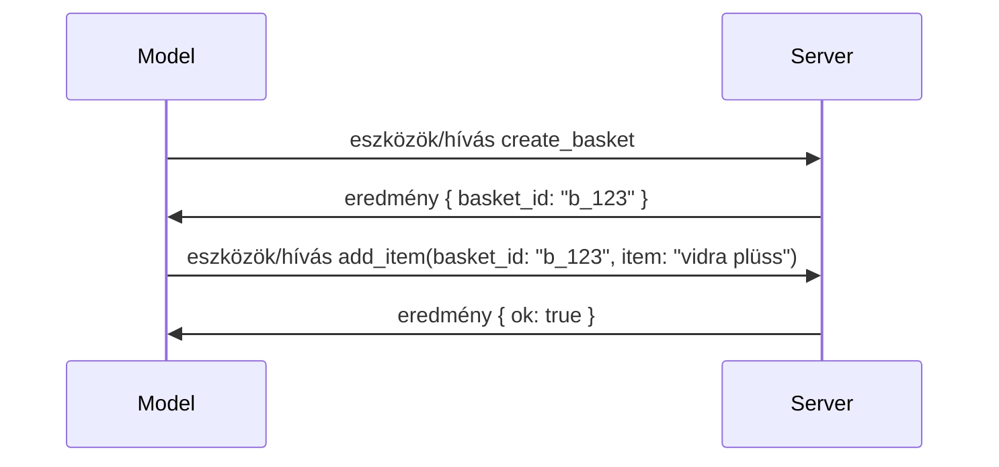

# Mi változott az MCP-ben: A 2026-07-28 Specifikáció

> **Állapot:** Végleges. Az MCP Specifikáció `2026-07-28` 2026. július 28-án jelent meg
> és ez a jelenlegi protokoll revízió. Ez a lecke az utolsó
> specifikációt írja le. Néhány tananyagelem továbbra is kifejezetten a
> `2025-11-25` verzióhoz kötött, mert azok SDK-i még nem vették át az új állapotmentes API-t;
> ezeket a példákat örökölt kompatibilitási útmutatásként kezeljük.

## Áttekintés

A `2026-07-28` az MCP legnagyobb revíziója a bevezetése óta. Hat
Specifikáció Bővítési Javaslat (SEP) eltávolítja a protokoll szintű munkameneteket, és
állapotmentessé teszi az MCP-t a szállítási rétegen, a kiterjesztések első osztályú,
verziózott mechanizmussá válnak, és több korábban ebben a tananyagban tárgyalt funkció
(Gyökerek, Mintavétel, Naplózás) egy új életciklus-szabályozás alatt elavulttá válik. Ez a
lecke összefoglalja, mi változott, miért fontos, és mit jelent a
`2025-11-25` verzióval írt kódok számára.

Forrás: [The 2026-07-28 MCP Specification Release Candidate](https://blog.modelcontextprotocol.io/posts/2026-07-28-release-candidate/) (Model Context Protocol Blog, David Soria Parra és Den Delimarsky).

## Tanulási célok

A lecke végére képes leszel:

- Elmagyarázni, miért tér át az MCP egy állapotmentes protokollmag használatára, és milyen problémát old ez meg a horizontálisan skálázott telepítések esetében.
- Leírni, hogyan kerül sor az `initialize`/`initialized` kézfogás és az `Mcp-Session-Id` fejléc lecserélésére.
- Azonosítani az új `Mcp-Method` és `Mcp-Name` fejléceket, valamint a `ttlMs`/`cacheScope` gyorsítótárazási metaadatokat.
- Felismerni a Kiterjesztések keretrendszert és a kiadással érkező két kiterjesztést: MCP Apps és Tasks.
- Összefoglalni az engedélyezési szigorításokat és a Dinamikus Ügyfél Regisztráció
  elavulását.
- Azonosítani, mely alapvető funkciók (Gyökerek, Mintavétel, Naplózás) váltak elavulttá, és hogy mit jelent ez a gyakorlatban.
- Elmagyarázni a Full JSON Schema 2020-12 változást az eszköz `inputSchema`/`outputSchema` tekintetében.

## Egy állapotmentes protokoll

A fő változás: az MCP a protokoll szinten állapotmentessé válik.

### Előtte (2025-11-25): a munkamenetek egyetlen szerver példányhoz kötnek

Egy eszköz hívása Streamable HTTP-n keresztül egy `initialize` kézfogással kezdődik. A szerver válaszként küld egy `Mcp-Session-Id` fejlécet, amelyet minden utána következő kérésnek hordoznia kell:

```http
POST /mcp HTTP/1.1
Mcp-Session-Id: 1868a90c-3a3f-4f5b
Content-Type: application/json

{"jsonrpc":"2.0","id":2,"method":"tools/call",
 "params":{"name":"search","arguments":{"q":"otters"}}}
```

Mivel a munkamenet ahhoz a szerver példányhoz kötött, amely kiadta, a horizontálisan skálázott telepítésekhez **ragadós útvonalválasztás** szükséges a terheléselosztónál, valamint **megosztott munkamenet-tároló** az összes példány között.

### Utána (2026-07-28): minden kérés önmagában teljes

```http
POST /mcp HTTP/1.1
MCP-Protocol-Version: 2026-07-28
Mcp-Method: tools/call
Mcp-Name: search
Content-Type: application/json

{"jsonrpc":"2.0","id":1,"method":"tools/call",
 "params":{"name":"search","arguments":{"q":"otters"},
           "_meta":{"io.modelcontextprotocol/protocolVersion":"2026-07-28",
                    "io.modelcontextprotocol/clientInfo":{"name":"my-app","version":"1.0"},
                    "io.modelcontextprotocol/clientCapabilities":{}}}}
```

Bármelyik szerver példány képes kezelni ezt a kérést. Főbb változások:

- **Az `initialize`/`initialized` kézfogás eltávolításra kerül** ([SEP-2575](https://github.com/modelcontextprotocol/modelcontextprotocol/pull/2575)). A protokoll verzió, kliens információ és a kliens képességek minden kérés `_meta` részében jelennek meg. Egy új `server/discover` metódus lehetővé teszi, hogy a kliens előre lekérje a szerver képességeit, amikor szüksége van rájuk.

- **Az `Mcp-Session-Id` fejléc és a protokolls szintű munkamenet eltávolításra került** ([SEP-2567](https://github.com/modelcontextprotocol/modelcontextprotocol/pull/2567)). Sticky routing és megosztott munkamenet-tárolók már nem szükségesek a protokolls rétegben.

### Állapotmentes protokoll, állapotfüggő alkalmazások

A protokoll szintű munkamenet eltávolítása nem jelenti azt, hogy a szervered nem lehet állapotfüggő. Az ajánlott minta ugyanaz, amit a HTTP API-k mindig is használtak: hozz létre egy explicit hivatkozást (például egy `basket_id`, egy `browser_id`) egy eszköz hívásából, és a modell adja vissza ezt a hivatkozást későbbi hívásoknál, mint egy szokásos argumentumot.



Ezáltal az állapot a modell számára látható és értelmezhető lesz, ahelyett, hogy a szállítási metaadatokban lenne elrejtve, és bármely szerver-példány kezelheti a hívást.

### Szerver-ügyfél kérések, átszervezve

Egy állapotmentes protokollnak továbbra is kell egy mód arra, hogy a szerver közvetlenül kérjen valamit az ügyféltől a hívás közben (például egy kikérdezési felületet):

- **A szerver által kezdeményezett kéréseket csak akkor lehet kiadni, miközben a szerver aktívan dolgozik egy kliens kérésén** ([SEP-2260](https://github.com/modelcontextprotocol/modelcontextprotocol/pull/2260)) – korábban javaslat, most kötelező. Soha nem kezdeményeződik váratlanul kérés a felhasználó felé.
- **Többletkörös kérés-válasz műveletek (Multi Round-Trip Requests)** ([SEP-2322](https://github.com/modelcontextprotocol/modelcontextprotocol/pull/2322)) váltják fel az SSE adatfolyam nyitva tartását. Ehelyett a szerver egy `InputRequiredResult`-et ad vissza:

  ```json
  {
    "resultType": "input_required",
    "inputRequests": {
      "confirm": {
        "type": "elicitation",
        "message": "Delete 3 files?",
        "schema": { "type": "boolean" }
      }
    },
    "requestState": "eyJzdGVwIjoxLCJmaWxlcyI6WyJhIiwiYiIsImMiXX0="
  }
  ```

  Az ügyfél összegyűjti a válaszokat és újra kiadja az eredeti hívást az `inputResponses`-szel együtt, valamint a visszahangoztatott `requestState`-tel. Bármely szerver-példány felveheti az ismételés kezelését, mert minden szükséges adat megvan a csomagban.

### Útvonalazható, cache-elhető, nyomon követhető

Három kisebb változás teszi könnyebbé az állapotmentes forgalom működtetését:

- **`Mcp-Method` és `Mcp-Name` fejléc szükséges Streamable HTTP-n** ([SEP-2243](https://github.com/modelcontextprotocol/modelcontextprotocol/pull/2243)), hogy terheléselosztók, átjárók és sebességkorlátozók az operációra tudjanak irányítani a JSON törzs vizsgálata nélkül. A szerver elutasítja azokat a kéréseket, ahol a fejlécek és a törzs nem egyezik.
- **A `tools/list` és erőforrás olvasási eredmények `ttlMs` és `cacheScope` kulcsokat hordoznak** ([SEP-2549](https://github.com/modelcontextprotocol/modelcontextprotocol/pull/2549)), az HTTP `Cache-Control` mintájára. Az ügyfelek tudják, hogy meddig friss a lista eredmény, és biztonságos-e megosztani több felhasználó között, anélkül, hogy hosszú életű SSE adatfolyamra lenne szükség a változások követéséhez.
- **A W3C Trace Context továbbítása a `_meta` alatt dokumentált** ([SEP-414](https://github.com/modelcontextprotocol/modelcontextprotocol/pull/414)), javítva a `traceparent`, `tracestate` és `baggage` kulcsneveket, hogy egy elosztott trace követni tudjon egy hívást a kliens SDK, az MCP szerver és a downstream rendszerek között egy [OpenTelemetry](https://opentelemetry.io/)-kompatibilis háttérrendszerben.

## Kiterjesztések elsőrangúvá válnak

Kiterjesztések informálisan már léteztek a `2025-11-25`-ben. [SEP-2133](https://github.com/modelcontextprotocol/modelcontextprotocol/pull/2133) formalizálja őket:

- A kiterjesztéseket fordított DNS azonosítókkal jelölik.
- Ezeket a kliens és szerver képességein lévő `extensions` térképen keresztül tárgyalják le.

- Saját `ext-*` tárházaikban élnek, ahol átruházott karbantartók vannak, és a fő specifikációtól függetlenül verziózzák őket.
- Egy új Extensions Track a SEP folyamatban lehetőséget ad arra, hogy az eksperimentálisból hivatalossá váljanak.

Ez a kiadás két hivatalos kiterjesztést tartalmaz.


### MCP Alkalmazások: szerver-oldalon renderelt felhasználói felületek

A [MCP Alkalmazások](https://blog.modelcontextprotocol.io/posts/2026-01-26-mcp-apps/) ([SEP-1865](https://github.com/modelcontextprotocol/modelcontextprotocol/pull/1865)) lehetővé teszi a szerverek számára, hogy interaktív HTML felületeket szállítsanak, amelyeket a hosztok egy sandboxolt iframe-ben renderelnek. Az eszközök előre deklarálják a felhasználói felület sablonjaikat, így a hosztok előre lekérhetik, gyorsítótárazhatják és biztonsági ellenőrzésnek vethetik alá őket, mielőtt bármi futna. Ezt már lefedtük az alapoknál a [15. Lecke: MCP Alkalmazások](../03-GettingStarted/15-mcp-apps/README.md)-ban — az Extensions keretrendszer alatt az MCP Alkalmazások most hivatalosan is kiterjesztés, nem pedig kísérleti alapfunkció.

### Feladatok kiterjesztéssé lépnek elő

A feladatok kísérleti alapfunkcióként jelentek meg `2025-11-25`-én. A gyakorlat használata elegendő átalakítást mutatott ahhoz, hogy a helyes otthonuk egy kiterjesztés legyen: a [Tasks extension](https://github.com/modelcontextprotocol/modelcontextprotocol/pull/2663) átalakítja az életciklust a stateless modell körül — a szerver képes a `tools/call` hívásra egy feladatkezelőt válaszul adni, és a kliens továbbvezérli azt `tasks/get`, `tasks/update`, és `tasks/cancel` segítségével. A feladat létrehozása szerver-irányított: a kliens hirdeti a kiterjesztést, és a szerver dönt arról, mikor kell egy hívást feladatként futtatni. A `tasks/list` teljesen eltávolításra került, mert biztonságosan nem határozható meg munkamenetek nélkül.

> **Átállási megjegyzés:** ha implementáltad a kísérleti `2025-11-25` Feladatok API-t, akkor át kell térned az új kiterjesztés életciklusra — ez nem visszafelé kompatibilis.

## Jogosultságok megerősítése

Több SEP megerősíti a
[jogosultság specifikációját](https://modelcontextprotocol.io/specification/2026-07-28/basic/authorization),
hogy jobban igazodjon a valós OAuth 2.0 / OpenID Connect telepítésekhez:

| SEP | Változás |
|---|---|
| [SEP-2468](https://github.com/modelcontextprotocol/modelcontextprotocol/pull/2468) | A kliensnek validálnia kell az `iss` paramétert az engedélyezési válaszokon az [RFC 9207](https://www.rfc-editor.org/rfc/rfc9207) szerint, így mérsékelve az MCP együgyfél-többszerver mintázatában gyakori mix-up támadásokat. Egy jövőbeli verzió megköveteli a válaszok elutasítását, ha hiányzik az `iss`. |
| [SEP-837](https://github.com/modelcontextprotocol/modelcontextprotocol/pull/837) | Csak kompatibilitási célból a Dinamikus Kliens Regisztráció kliensek deklarálják az OpenID Connect `application_type`-ját, elkerülve az asztali és CLI kliensek helytelen `"web"` alapértelmezett beállítását. |
| [SEP-2352](https://github.com/modelcontextprotocol/modelcontextprotocol/pull/2352) | Csak kompatibilitási célból a regisztrált hitelesítő adatok kötődnek a kibocsátó jogosultság-szerver `issuer`-éhez; a kliensek újra regisztrálnak, ha egy erőforrás migrál. |
| [SEP-2207](https://github.com/modelcontextprotocol/modelcontextprotocol/pull/2207) | Dokumentálja, hogyan kell frissítő tokeneket kérni OpenID Connect-stílusú jogosultsági szerverektől. |
| [SEP-2350](https://github.com/modelcontextprotocol/modelcontextprotocol/pull/2350) | Tisztázza a jogosultság lépcsőzetes növelésének során felhalmozódó skópokat. |
| [SEP-2351](https://github.com/modelcontextprotocol/modelcontextprotocol/pull/2351) | Tisztázza a `.well-known` felfedezési végződést. |

Ha MCP-hez fejlesztesz jogosultság-szervert, add meg az `iss`-t az
engedélyezési válaszokon, és kövesd a végleges jogosultság specifikációt. Lásd
a [02-Security](../02-Security/README.md) dokumentációt a megvalósítási útmutatóért.

A Dinamikus Kliens Regisztráció elérhető a kompatibilitás miatt, de `2026-07-28`-tól
elavult. Az új implementációknak a Client ID Metadata
dokumentumokat kell használniuk.

## Elavult funkciók

Az új
[funkció életciklus politikája](https://github.com/modelcontextprotocol/modelcontextprotocol/pull/2577)
szerint a Gyökerek, Mintavétel, Naplózás és Dinamikus Kliens Regisztráció **elavulttá vált**:

| Funkció | Ajánlott helyettesítés |
|---|---|
| Gyökerek | Eszközparaméterek, erőforrás URI-k vagy szerverkonfiguráció |
| Mintavétel | Közvetlen integráció az LLM szolgáltató API-kkal |
| Naplózás | `stderr` az stdio átviteli módokhoz; OpenTelemetry strukturált megfigyelhetőséghez |
| Dinamikus Kliens Regisztráció | Client ID Metadata Dokumentumok |

Ezek a funkciók `2026-07-28`-ig kompatibilitási okból maradnak. Jogosultak
eltávolításra az első azon dátum vagy azutáni szabványos felülvizsgálat során, amely 2027. július 28-án vagy azt követően jelenik meg;
a tényleges eltávolítás később is megtörténhet. Az új implementációknak az
előző helyettesítő mintákat kell használniuk.

## Teljes JSON Schema 2020-12 az Eszközökhöz

Az eszközök `inputSchema` és `outputSchema` mostantól teljes [JSON Schema 2020-12](https://json-schema.org/draft/2020-12) ([SEP-2106](https://github.com/modelcontextprotocol/modelcontextprotocol/pull/2106)):

- A bemeneti sémák megtartják a `type: "object"` gyökérkorlátozást, de most lehetővé teszik a kompozíciót (`oneOf`, `anyOf`, `allOf`), feltételeket és hivatkozásokat (`$ref`, `$defs`).
- A kimeneti sémákra nincsen korlátozás, és a `structuredContent` bármilyen JSON érték lehet, nem csak objektum.
- A megvalósítások automatikusan nem dereferálhatják a külső `$ref` URI-kat, és korlátozniuk kell a séma mélységet és validálási időt (ez egy szolgáltatás megtagadásos támadást figyelembe vevő szempont, ha szerver-oldalon validálod a sémákat).

Külön, a hiányzó erőforrásra vonatkozó hibakód az MCP-specifikus `-32002` helyett a JSON-RPC szabványos `-32602`-re (Érvénytelen paraméterek) változik ([SEP-2164](https://github.com/modelcontextprotocol/modelcontextprotocol/pull/2164)). Ha a kliensed a konkrét `-32002` értékre illeszkedik, frissítened kell.

## Hogyan fejlődik innen a protokoll

Ez a kiadás tartalmaz törő változásokat, amelyeket az MCP karbantartói nem kívánnak a jövőben általánossá tenni. Három irányítási SEP a megismétlődés megakadályozására törekszik:

- A **funkció életciklus politika** minden funkciónak aktív → elavult → eltávolított útvonalat ad, legalább tizenkét hónappal az elavulás és az első lehetséges eltávolítás között.
- Az **Extensions keretrendszer** lehetővé teszi, hogy új képességek opcióként engedélyezhető kiterjesztésként szálljanak le és stabilizálódjanak ott, mielőtt (ha valaha) a mag specifikációba kerülnének.
- Egy Standards Track SEP nem érheti el a végleges státuszt, amíg egy megfelelő forgatókönyv nem landol a [conformance suite](https://github.com/modelcontextprotocol/conformance) csomagban ([SEP-2484](https://github.com/modelcontextprotocol/modelcontextprotocol/pull/2484)) — ugyanabban a csomagban, amelyet az [SDK szint rendszer](https://github.com/modelcontextprotocol/modelcontextprotocol/pull/1777) használ az hivatalos SDK-k értékeléséhez.

## Kiadási ütemterv és validáció

- A kiadásra jelölt verzió 2026. május 21-én lezárult.
- A végleges specifikáció 2026. július 28-án jelent meg.

- Az SDK támogatás elmaradhat a specifikációtól. Ellenőrizze a
  [SDK dokumentációt](https://modelcontextprotocol.io/docs/sdk) és az SDK
  kiadási megjegyzéseit, mielőtt példát migrálna.
- Kövesse nyomon a végleges változásokat a
  [2026-07-28 specifikációban](https://modelcontextprotocol.io/specification/2026-07-28/)
  és annak
  [változásnaplójában](https://modelcontextprotocol.io/specification/2026-07-28/changelog).

## Mit Jelent Ez A Tananyag Számára

A tananyag az `2025-11-25` példákról a jelenlegi
`2026-07-28` specifikációra áll át. Konkrétan:

- **Az ülések és az `initialize` kézfogás** az `2025-11-25`-öt explicit módon célzó példákban
  elavult viselkedést jelentenek. A `2026-07-28` protokoll ezeket a
  fentebb említett állapotmentes kérés modellre cseréli.
- **Mintavételezés és Gyökerek** továbbra is elérhetőek a kompatibilitás miatt, de elavultak.
  Az új tervezéseknek a fent felsorolt helyettesítő mintákat kell használniuk.
- **A kísérleti Feladatok funkció**, ha használtad, át kell állítani a Feladatok kiterjesztés új életciklusára.
- **Az MCP alkalmazások** ([15. lecke](../03-GettingStarted/15-mcp-apps/README.md)) gyakorlatilag érintetlenek; egyszerűen csak a formális Kiterjesztések keretrendszer alá kerülnek.

## További Erőforrások

- [MCP Specifikáció 2026-07-28](https://modelcontextprotocol.io/specification/2026-07-28/)
- [2026-07-28 Változásnapló](https://modelcontextprotocol.io/specification/2026-07-28/changelog)
- [A 2026-07-28 MCP Specifikáció Kiadási Kandidátusa (történeti blogbejegyzés)](https://blog.modelcontextprotocol.io/posts/2026-07-28-release-candidate/)
- [Az MCP Átvitel Jövője](https://blog.modelcontextprotocol.io/posts/2025-12-19-mcp-transport-future/)
- [SEP Irányelvek](https://modelcontextprotocol.io/community/sep-guidelines)
- [MCP SDK Szint Rendszer](https://modelcontextprotocol.io/docs/sdk)

## Következő Lépések

Térjen vissza a [Alapfogalmakhoz](./README.md) vagy folytassa a
[Biztonság](../02-Security/README.md) oldalon a jelenlegi `2026-07-28` iránymutatások alkalmazására.

---

<!-- CO-OP TRANSLATOR DISCLAIMER START -->
**Jogi nyilatkozat**:
Ez a dokumentum az AI fordítási szolgáltatás, a [Co-op Translator](https://github.com/Azure/co-op-translator) segítségével készült. Bár az pontosságra törekszünk, kérjük, vegye figyelembe, hogy az automatikus fordítások hibákat vagy pontatlanságokat tartalmazhatnak. Az eredeti dokumentum az anyanyelvén tekintendő hiteles forrásnak. Fontos információk esetén professzionális emberi fordítást javasolunk. Nem vállalunk felelősséget semmilyen félreértésért vagy téves értelmezésért, amely ebből a fordításból ered.
<!-- CO-OP TRANSLATOR DISCLAIMER END -->