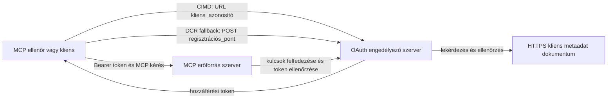

# CIMD és DCR jogosultságkezelési minta

Ez a TypeScript minta összehasonlítja azt a két módot, ahogyan egy OAuth kliens identitást szerezhet
mielőtt hozzáférne egy védett MCP szerverhez:

- **Client ID Metadata dokumentumok (CIMD)** stabil HTTPS URL-t használnak, mint
  `client_id`. Ez az előnyben részesített mechanizmus azon kliensek és jogosultság-
  szerverek számára, amelyek között nincs előzetes kapcsolat.
- **Dinamikus kliensregisztráció (DCR)** a jogosultságszerverhez fordul, hogy
  futásidőben hozzon létre egy átlátszatlan kliensazonosítót. Az MCP `2026-07-28` csak 
  visszafelé kompatibilitás céljából tartja meg a DCR-t.

A minta a stabil MCP TypeScript SDK v2-t és az állapotmentes
MCP `2026-07-28` kérései modellt használja. Egy külső OAuth 2.1/OpenID
Connect jogosultságszerverrel működik, mint például az Auth0. Az MCP szerver egy erőforrás-
szerver: hozzáférési tokeneket hitelesít, de nem hitelesíti a felhasználókat és nem bocsát ki
tokeneket.

## Tanulási célok

A minta elkészítésével képes leszel:

- Megmagyarázni, miért előnyösebb a CIMD a DCR-nél az új MCP kliensek esetében.
- Érvényes CIMD dokumentumot közzétenni egy nyilvános natív kliens számára.
- Beállítani egy MCP erőforrás szervert az OAuth felfedezéshez és JWT érvényesítéshez.
- Gyakorolni a CIMD és DCR használatát ugyanazzal az MCP és jogosultságszerverrel.
- Érvényesíteni egy OAuth scope-ot egy MCP eszközön belül.
- Meghatározni, mely felelősségek tartoznak a klienshez, az erőforrás szerverhez és
  a jogosultságszerverhez.

## Architektúra



A jogosultságszerver választja ki és érvényesíti a regisztrációs mechanizmust.
Az MCP szerver csak az eredményként kapott ellenőrzött `client_id` állítást látja. Egy HTTPS URL
útvonallal azonosítja a CIMD-et. Egy átlátszatlan azonosító nem elegendő a DCR bizonyításához, mert egy
előre regisztrált kliens is használhat átlátszatlan azonosítót; az opcionális
`DCR_CLIENT_ID_PREFIX` beállítás szolgáltatóspecifikus demo tippet ad.

## Regisztrációs prioritás

Az MCP kliensek, amelyek minden mechanizmust támogatnak, a következő sorrendet kövessék:

1. Használd az előre regisztrált kliensinformációkat, ha már elérhetőek.
2. Használd a CIMD-et, amikor a jogosultságszerver hirdeti,
   hogy `client_id_metadata_document_supported: true`.
3. Csak tartalék megoldásként használd a DCR-t, amikor a szerver hirdeti a
   `registration_endpoint` végpontot.
4. Kérdezd meg a felhasználót előre regisztrált kliensinformációkról, ha a fentiek közül egyik sem áll rendelkezésre.


## Projekt felépítés

```text
src/
  config.ts          Environment validation
  dcr.ts             DCR compatibility request
  mcp.ts             MCP tools and scope checks
  oauth.ts           Authorization metadata and JWT verification
  register-dcr.ts    DCR command-line helper
  registration.ts    CIMD document and mechanism classification
  server.ts          Express, OAuth discovery, and MCP endpoint
test/
  dcr.test.ts
  oauth.test.ts
  registration.test.ts
  server.test.ts
```

## Előfeltételek

- Node.js 20.6 vagy újabb. A szkriptek használják a `--env-file` és `--import` opciókat.
- Egy OAuth 2.1/OpenID Connect jogosultságszerver, amely támogatja:
  - Authorization code flow S256 PKCE-vel.
  - OAuth Protected Resource Metadata és Resource Indicators.
  - JWT hozzáférési tokeneket és JWKS végpontot.
  - CIMD-t, plusz DCR-t, ha szeretnéd összehasonlítani a régi megoldást.
- MCP Inspektor vagy más MCP `2026-07-28` kliens.
- Egy nyilvános HTTPS URL a CIMD dokumentumnak. Fejlesztési alagút alkalmas
  a laborhoz; élesben stabil domain használata ajánlott.

## Telepítés és tesztelés

```bash
npm install
npm run build
npm test
```

A tizenkét teszt helyi kulcsokat és hamisított HTTP végpontokat használ. Nincs szükség jogosultságszerver fiókra.
Ellenőrzik:

- A CIMD dokumentum alakját és URL-korlátozásait.
- Őszinte osztályozását URL és átlátszatlan kliensazonosítóknak.
- DCR kérés és válasz kezelését.
- Biztonságtalan nem loopback DCR végpontok elutasítását.
- JWT aláírás, kibocsátó, közönség, lejárat, kliens azonosító és scope érvényesítését.
- Belső folyamatban futó MCP `2026-07-28` hívás a `registration-info`-ra.

## Jogosultságszerver konfigurálása

A pontos vezérlőnevek szolgáltatónként eltérőek. Állítsd be a következő képességeket:

1. Hozz létre egy API-t vagy erőforrás szervert, amelynek azonosítója pontosan megegyezik az MCP
   URL-jével, beleértve az `/mcp` útvonalat, például `http://127.0.0.1:3001/mcp`.
2. Használj RS256 hozzáférési tokeneket, és tartalmazzon `client_id` vagy `azp` állítást.
3. Add hozzá a `tool:greet` engedélyt vagy scope-ot.
4. Engedélyezd az authorization code flow-t S256 PKCE-vel nyilvános natív klienseknek.
5. Engedélyezd a Client ID Metadata dokumentumokat.
6. Csak az összehasonlításhoz, engedélyezd a Dinamikus kliensregisztrációt.
7. Biztosítsd, hogy a jogosultságszerver metaadatai a következőket hirdessék:
   - `issuer`
   - `authorization_endpoint`
   - `token_endpoint`
   - `jwks_uri`
   - `client_id_metadata_document_supported: true`
   - `registration_endpoint`, ha a DCR engedélyezett

### Auth0 példa

Auth0 esetén engedélyezd a Client ID Metadata dokumentum regisztrációját, az OIDC Dinamikus
Alkalmazás Regisztrációt és az erőforrás paraméter kompatibilitást. Hozz létre egy API-t,
amelynek azonosítója pontosan az MCP URL, és add hozzá a `tool:greet` engedélyt.
Engedélyezd a teszt felhasználónak és harmadik fél klienseknek az engedély kérelmezését.

A szolgáltató irányítópultjai és funkciói idővel változnak. Ellenőrizd
a szolgáltató dokumentációját a beállítások használata előtt a laboron kívül.

## Minta konfigurálása

Hozd létre a `.env` fájlt a mintából:

```powershell
Copy-Item .env.example .env
```

Bash-kompatibilis shellekben:

```bash
cp .env.example .env
```

Állítsd be ezeket az értékeket:

```dotenv
MCP_SERVER_URL=http://127.0.0.1:3001/mcp
AUTHORIZATION_SERVER_ISSUER=https://your-tenant.example.com/
AUTHORIZATION_SERVER_METADATA_URL=https://your-tenant.example.com/.well-known/openid-configuration
CLIENT_METADATA_URL=https://your-public-host.example.com/client-metadata.json
OAUTH_REDIRECT_URIS=http://127.0.0.1:6274/oauth/callback
DCR_CLIENT_ID_PREFIX=tpc_
```

Fontos részletek:

- Az `AUTHORIZATION_SERVER_ISSUER` pontosan meg kell egyezzen a jogosultságszerver metaadataiban
  felfedezett `issuer` értékkel, beleértve a lezáró perjelet is, ha van.
- Az `MCP_SERVER_URL` meg kell egyezzen a hozzáférési token célközönségével.
- A `CLIENT_METADATA_URL` HTTPS-t kell használjon, nem lehet gyökérút, és nyilvános URL-nek kell lennie,
  amely szolgálja a metaadat útvonalat. Lekérdezési string és fragmensek nem engedélyezettek,
  hogy az útvonal és a `client_id` azonos maradjon.
- Az `OAUTH_REDIRECT_URIS` egy vesszővel elválasztott engedélyezett lista. Az alapértelmezett az MCP
  Inspektor loopback callback-je.
- A `DCR_CLIENT_ID_PREFIX` opcionális és szolgáltatóspecifikus. Hagyd üresen, ha a
  szolgáltatódnak nincs megbízható DCR előtagja.

## CIMD dokumentum közzététele

Indíts alagutat, amely a nyilvános HTTPS eredetet továbbítja a `127.0.0.1:3001` címre.
Állítsd a `CLIENT_METADATA_URL` értékét erre az eredetre plusz `/client-metadata.json`, majd futtasd:

```bash
npm run build
npm start
```

Ellenőrizd mindkét felfedezési dokumentumot:

```bash
curl http://127.0.0.1:3001/health
curl http://127.0.0.1:3001/client-metadata.json
curl http://127.0.0.1:3001/.well-known/oauth-protected-resource/mcp
```

A nyilvános HTTPS metaadat URL által visszaadott `client_id` byte-pontosan
egyezzen meg ezzel az URL-lel. A jogosultságszervernek ellenőriznie kell a dokumentumot és
annak átirányítási URI-ját a token kiadása előtt.

> [!NOTE]
> A minta egyetlen folyamatban hosztolja a kliens dokumentumot és az MCP erőforrás szervert,
> hogy a labor kicsi maradjon. Éles környezetben az MCP kliens birtokolja és hosztolja
> a CIMD dokumentumát függetlenül az erőforrás szervertől.

## CIMD és DCR összehasonlítása

Indítsd el az MCP Inspektort:

```bash
npx @modelcontextprotocol/inspector
```

Használj Streamable HTTP protokollt, és csatlakozz a `http://127.0.0.1:3001/mcp` címhez.

### CIMD (preferált)


1. Adja meg a nyilvános `CLIENT_METADATA_URL`-t, mint az OAuth Ügyfélazonosítót.
2. Kérje a `tool:greet`-et, valamint a szolgáltatójától igényelt azonosítási jogosultságokat.
3. Fejezze be a bejelentkezést és az elfogadást.
4. Hívja meg a `registration-info`-t. Ez visszajelzi a `mechanism: "cimd"` értéket.
5. Hívja meg a `greet`-et a jogosultság érvényesítésének ellenőrzéséhez.

### DCR (Kompatibilitási tartalék)

1. Törölje az Inspector mentett OAuth állapotát.
2. Az OAuth Ügyfélazonosítót hagyja üresen, hogy az Inspector használhassa a bejelentett
   `registration_endpoint`-et.
3. Fejezze be a bejelentkezést és az elfogadást.
4. Hívja meg a `registration-info`-t.
5. Ha a `DCR_CLIENT_ID_PREFIX` megegyezik a szolgáltató által generált azonosítókkal, az eszköz
   `mechanism: "dcr"` értéket jelez; különben helyesen a
   `opaque-client-id`-t jelenti.

A regisztrációs kérelmet közvetlenül is bemutathatja:

```bash
npm run build
npm run register:dcr
```

A segédprogram kiírja a visszakapott ügyfélazonosítót, de soha nem írja ki az ügyfél titkát.
Bármely visszakapott titkot tekintsen érzékeny adatnak, és tárolja megfelelő titoktárolóban.

## Eszközök

| Eszköz | Szükséges jogosultság | Cél |
| --- | --- | --- |
| `registration-info` | Ellenőrzött ügyfél | Jelentse az ügyfélazonosító típust |
| `greet` | `tool:greet` | Mutassa be az eszközspecifikus engedélyezést |

## Biztonsági megjegyzések

- Ellenőrizze a JWT aláírásokat az engedélyező szerver JWKS végpontján keresztül.
- Követelje meg a pontos kibocsátó és közönség egyezést.
- Követelje meg a lejárati és ügyfélazonosító állításokat.
- Soha ne fogadjon el tokeneket, amelyeket más erőforrásra bocsátottak ki.
- Soha ne továbbítsa az MCP tokent lefelé irányuló API-khoz.
- Tartsa a DCR hitelesítő adatokat a kibocsátóhoz kötve, aki azokat létrehozta.
- Ellenőrizze a CIMD átirányítási URI-kat pontos egyezéssel.
- Alkalmazzon SSRF kontrollokat, amikor az engedélyező szerver CIMD URL-eket kér.
- Fejlesztési környezeten kívüli engedélyezéshez és metaadat végpontokhoz használjon HTTPS-t.

- Ne következtesse ki a DCR-t átlátszatlan ügyfélazonosítóból, hacsak a szolgáltató nem dokumentál
  megbízható azonosító konvenciót.

## Hivatkozások

- [MCP engedélyezési specifikáció](https://modelcontextprotocol.io/specification/2026-07-28/basic/authorization)
- [MCP ügyfélregisztráció](https://modelcontextprotocol.io/specification/2026-07-28/basic/authorization/client-registration)
- [MCP biztonsági legjobb gyakorlatok](https://modelcontextprotocol.io/specification/2026-07-28/basic/security_best_practices)
- [MCP TypeScript SDK v2 engedélyezési útmutató](https://ts.sdk.modelcontextprotocol.io/v2/serving/authorization)
- [OAuth Dinamikus Ügyfélregisztráció (RFC 7591)](https://datatracker.ietf.org/doc/html/rfc7591)
- [OAuth Ügyfélazonosító Metaadat dokumentum tervezet](https://datatracker.ietf.org/doc/html/draft-ietf-oauth-client-id-metadata-document-00)

## Elismerés

A párhuzamos oktatási megközelítés a
[Sambego/auth0-xmcp-cimd](https://github.com/Sambego/auth0-xmcp-cimd) ihlette. Ez a
minta egy eredeti, szolgáltató-független megvalósítás, amely az MCP TypeScript SDK v2 hivatalos
verziójával készült ehhez a tananyaghoz.

---

<!-- CO-OP TRANSLATOR DISCLAIMER START -->
**Jogi nyilatkozat**:
Ez a dokumentum az AI fordítási szolgáltatás, a [Co-op Translator](https://github.com/Azure/co-op-translator) segítségével készült. Bár az pontosságra törekszünk, kérjük, vegye figyelembe, hogy az automatikus fordítások hibákat vagy pontatlanságokat tartalmazhatnak. Az eredeti dokumentum az anyanyelvén tekintendő hiteles forrásnak. Fontos információk esetén professzionális emberi fordítást javasolunk. Nem vállalunk felelősséget semmilyen félreértésért vagy téves értelmezésért, amely ebből a fordításból ered.
<!-- CO-OP TRANSLATOR DISCLAIMER END -->