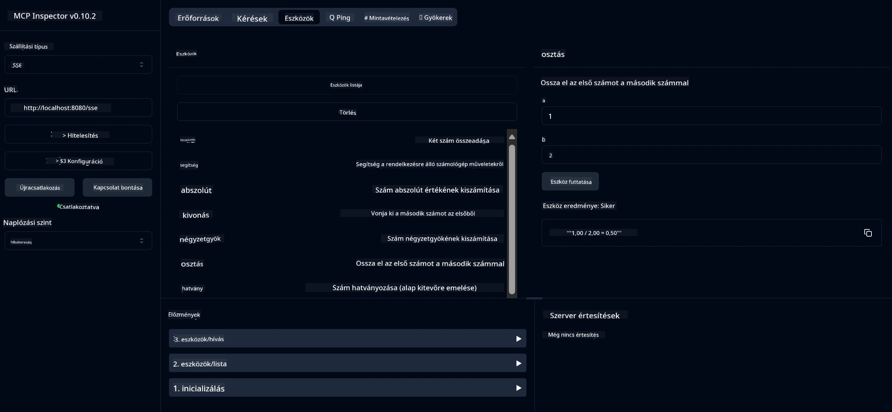

# Alapvető Számológép MCP Szolgáltatás

> [!NOTE]
> Ez a Java megoldás a régi HTTP+SSE szállítást használja, és a MCP `2025-11-25` verzióval kompatibilis SDK-ra céloz.
> Megőrizve a tanfolyami kódhoz való illesztés érdekében;
> új távoli szervereknek a `2026-07-28` Streamable HTTP támogatást kell használniuk.

Ez a szolgáltatás alapvető számológép műveleteket nyújt a Model Context Protocol (MCP) segítségével, Spring Boot WebFlux szállítással. Egyszerű példaként készült kezdőknek, akik az MCP megvalósításokat tanulják.

További információkért lásd az [MCP Server Boot Starter](https://docs.spring.io/spring-ai/reference/api/mcp/mcp-server-boot-starter-docs.html) referencia dokumentációt.


## A szolgáltatás használata

A szolgáltatás a következő API végpontokat kínálja az MCP protokollon keresztül:

- `add(a, b)`: Két szám összeadása
- `subtract(a, b)`: Kivonja a második számot az elsőből
- `multiply(a, b)`: Két szám összeszorzása
- `divide(a, b)`: Az első szám elosztása a másodikkal (nulla ellenőrzéssel)
- `power(base, exponent)`: Egy szám hatványozása
- `squareRoot(number)`: Négyzetgyök számítása (negatív szám ellenőrzéssel)
- `modulus(a, b)`: Maradék számítása osztáskor
- `absolute(number)`: Abszolút érték számítása

## Függőségek

A projekthez a következő főbb függőségek szükségesek:

```xml
<dependency>
    <groupId>org.springframework.ai</groupId>
    <artifactId>spring-ai-starter-mcp-server-webflux</artifactId>
</dependency>
```

## A projekt építése

A projekt építése Maven segítségével:
```bash
./mvnw clean install -DskipTests
```

## A szerver indítása

### Java használata

```bash
java -jar target/calculator-server-0.0.1-SNAPSHOT.jar
```

### MCP Inspector használata

Az MCP Inspector egy hasznos eszköz az MCP szolgáltatásokkal való interakcióhoz. Ennek a számológép szolgáltatásnak a használatához:

1. **Telepítse és indítsa el az MCP Inspectort** egy új terminál ablakban:
   ```bash
   npx @modelcontextprotocol/inspector
   ```

2. **Lépjen be a webes felületre** az alkalmazás által megjelenített URL-re kattintva (általában http://localhost:6274)

3. **Állítsa be a kapcsolatot**:
   - A szállítás típusát állítsa "SSE"-re
   - URL-ként adja meg a futó szerver SSE végpontját: `http://localhost:8080/sse`
   - Kattintson a "Kapcsolódás"-ra

4. **Használja az eszközöket**:
   - Kattintson az "Eszközök listázása"-ra a rendelkezésre álló számológép műveletek megtekintéséhez
   - Válasszon eszközt, majd kattintson a "Eszköz futtatása"-ra egy művelet végrehajtásához



---

<!-- CO-OP TRANSLATOR DISCLAIMER START -->
**Jogi nyilatkozat**:
Ez a dokumentum az AI fordítási szolgáltatás, a [Co-op Translator](https://github.com/Azure/co-op-translator) segítségével készült. Bár az pontosságra törekszünk, kérjük, vegye figyelembe, hogy az automatikus fordítások hibákat vagy pontatlanságokat tartalmazhatnak. Az eredeti dokumentum az anyanyelvén tekintendő hiteles forrásnak. Fontos információk esetén professzionális emberi fordítást javasolunk. Nem vállalunk felelősséget semmilyen félreértésért vagy téves értelmezésért, amely ebből a fordításból ered.
<!-- CO-OP TRANSLATOR DISCLAIMER END -->