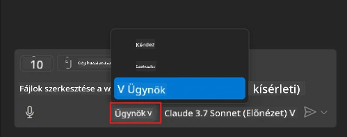
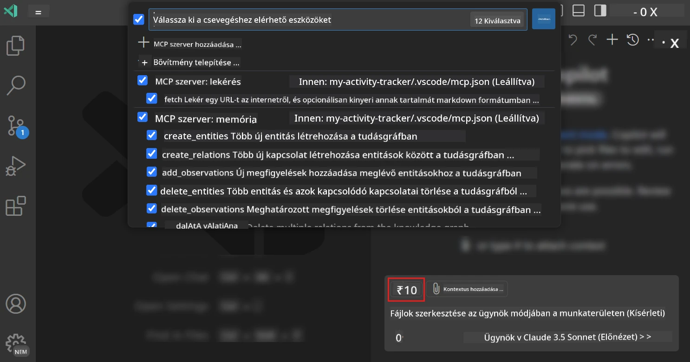
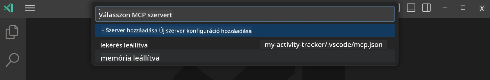
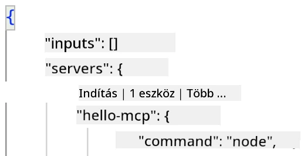
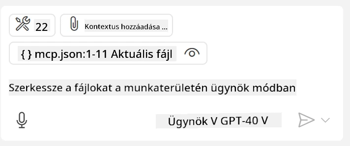
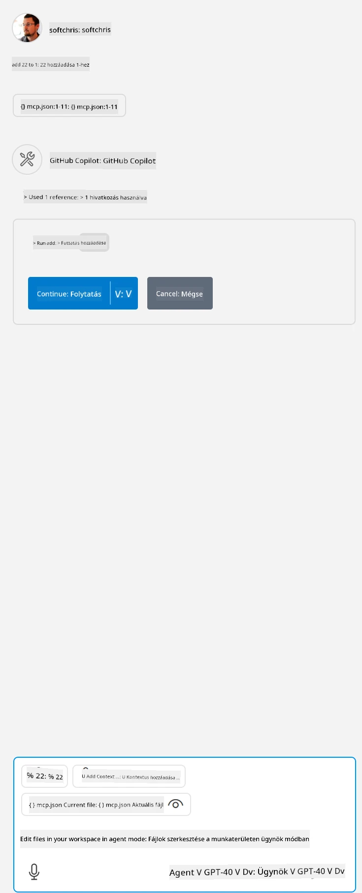

# Egy szerver használata a GitHub Copilot Agent módból

A Visual Studio Code és a GitHub Copilot képesek ügyfélként működni és fogyasztani egy MCP Szervert. Ön talán megkérdezheti, miért is szeretnénk ezt? Nos, ez azt jelenti, hogy az MCP Szerver bármilyen funkcióját mostantól az IDE-ből is használhatja. Képzelje el például, hogy hozzáadja a GitHub MCP szerverét, amely lehetővé teszi, hogy a GitHubot parancsszó hozzárendelésekkel vezérelje, ahelyett, hogy a terminálban konkrét parancsokat gépelne. Vagy képzeljen el bármit, ami általánosságban javíthatja a fejlesztői élményt, mindez természetes nyelvű vezérlés alatt. Most már látja, hogy ez mekkora előny, ugye?

## Áttekintés

Ez a lecke bemutatja, hogyan használható a Visual Studio Code és a GitHub Copilot Agent módja ügyfélként az MCP Szerverhez.

## Tanulási célok

A lecke végére képes lesz:

- MCP Szervert használni a Visual Studio Code-on keresztül.
- Képességeket futtatni, például eszközöket kezelni a GitHub Copilot segítségével.
- Beállítani a Visual Studio Code-ot az MCP Szerver keresésére és kezelésére.

## Használat

Kétféleképpen vezérelheti az MCP szerverét:

- Felhasználói felületen, ezt később ebben a fejezetben részletezzük.
- Terminálon keresztül, lehetséges a `code` végrehajtható használatával a terminálból is vezérelni:

  Ahhoz, hogy MCP szervert adjon hozzá a felhasználói profiljához, használja a --add-mcp parancssori opciót, és adja meg a JSON szerverkonfigurációt a következő formátumban: {\"name\":\"server-name\",\"command\":...}.

  ```
  code --add-mcp "{\"name\":\"my-server\",\"command\": \"uvx\",\"args\": [\"mcp-server-fetch\"]}"
  ```

### Képernyőképek





Beszéljünk részletesebben a vizuális felület használatáról a következő szakaszokban.

## Megközelítés

Íme, hogyan kell ezt magas szinten megközelíteni:

- Konfigurálni egy fájlt az MCP Szerver megtalálásához.
- Elindítani / csatlakozni a szerverhez, hogy listázza a képességeit.
- Használni a képességeket a GitHub Copilot Chat felületen keresztül.

Remek, most, hogy értjük a folyamatot, próbáljunk meg egy MCP Szervert használni Visual Studio Code-on egy gyakorlat keretében.

## Gyakorlat: Egy szerver használata

Ebben a gyakorlatban beállítjuk a Visual Studio Code-ot, hogy megtalálja az MCP szerverét, így az használható a GitHub Copilot Chat interfészen keresztül.

### -0- Előzetes lépés, MCP Szerver felfedezés engedélyezése

Előfordulhat, hogy engedélyezni kell az MCP Szerverek felfedezését.

1. Lépjen a `File -> Preferences -> Settings` menüpontra a Visual Studio Code-ban.

1. Keressen rá a "MCP" kifejezésre, és engedélyezze a `chat.mcp.discovery.enabled` beállítást a settings.json fájlban.

### -1- Konfigurációs fájl létrehozása

Kezdje azzal, hogy létrehoz egy konfigurációs fájlt a projekt gyökerében, szüksége lesz egy MCP.json nevű fájlra, amelyet a .vscode mappába kell helyezni. Így nézzen ki:

```text
.vscode
|-- mcp.json
```

Ezután nézzük meg, hogyan adhatunk hozzá szerver bejegyzést.

### -2- Szerver konfigurálása

Adja hozzá a következő tartalmat az *mcp.json* fájlhoz:

```json
{
    "inputs": [],
    "servers": {
       "hello-mcp": {
           "command": "node",
           "args": [
               "build/index.js"
           ]
       }
    }
}
```

A fenti egyszerű példában, hogyan indítsunk egy Node.js-ben írt szervert; más futtatókörnyezeteknél adja meg a megfelelő indító parancsot `command` és `args` segítségével.

### -3- A szerver indítása

Miután hozzáadta a bejegyzést, indítsa el a szervert:

1. Keresse meg a bejegyzést az *mcp.json* fájlban, és győződjön meg arról, hogy megtalálja a "play" ikont:

    

1. Kattintson a "play" ikonra, ekkor a GitHub Copilot Chat eszköz ikonja meg fogja jeleníteni az elérhető eszközök számát. Ha erre az ikonra kattint, egy regisztrált eszközök listáját fogja látni. Ki/bejelölhet minden eszközt attól függően, hogy szeretné-e, hogy a GitHub Copilot használja őket kontextusként:

  

1. Egy eszköz futtatásához írjon egy olyan utasítást, ami megfelel valamelyik eszköz leírásának, például egy ilyen promptot: "add 22 to 1":

  

  Válaszként 23-at kell kapnia.

## Feladat

Próbáljon meg egy szerver bejegyzést hozzáadni az *mcp.json* fájlhoz, és győződjön meg arról, hogy el tudja indítani/leállítani a szervert. Ellenőrizze, hogy a GitHub Copilot Chat interfészen keresztül tud-e kommunikálni a szervere eszközeivel.

## Megoldás

[Megoldás](./solution/README.md)

## Főbb tanulságok

A fejezet fő tanulságai a következők:

- A Visual Studio Code kiváló ügyfél, amely lehetővé teszi több MCP Szerver és azok eszközeinek használatát.
- A GitHub Copilot Chat felület az, amelyen keresztül a szerverekkel interakcióba lép.
- A felhasználótól kérhetünk be bemeneti adatokat, például API-kulcsokat, amelyeket át lehet adni az MCP Szervernek a szerver bejegyzés konfigurálásakor az *mcp.json* fájlban.

## Minták

- [Java Kalkulátor](../samples/java/calculator/README.md)
- [.Net Kalkulátor](../../../../03-GettingStarted/samples/csharp)
- [JavaScript Kalkulátor](../samples/javascript/README.md)
- [TypeScript Kalkulátor](../samples/typescript/README.md)
- [Python Kalkulátor](../../../../03-GettingStarted/samples/python)

## További források

- [Visual Studio dokumentáció](https://code.visualstudio.com/docs/copilot/chat/mcp-servers)

## Mi a következő lépés

- Következő: [Egy stdio Szerver létrehozása](../05-stdio-server/README.md)

---

<!-- CO-OP TRANSLATOR DISCLAIMER START -->
**Jogi nyilatkozat**:
Ez a dokumentum az AI fordítási szolgáltatás, a [Co-op Translator](https://github.com/Azure/co-op-translator) segítségével készült. Bár az pontosságra törekszünk, kérjük, vegye figyelembe, hogy az automatikus fordítások hibákat vagy pontatlanságokat tartalmazhatnak. Az eredeti dokumentum az anyanyelvén tekintendő hiteles forrásnak. Fontos információk esetén professzionális emberi fordítást javasolunk. Nem vállalunk felelősséget semmilyen félreértésért vagy téves értelmezésért, amely ebből a fordításból ered.
<!-- CO-OP TRANSLATOR DISCLAIMER END -->