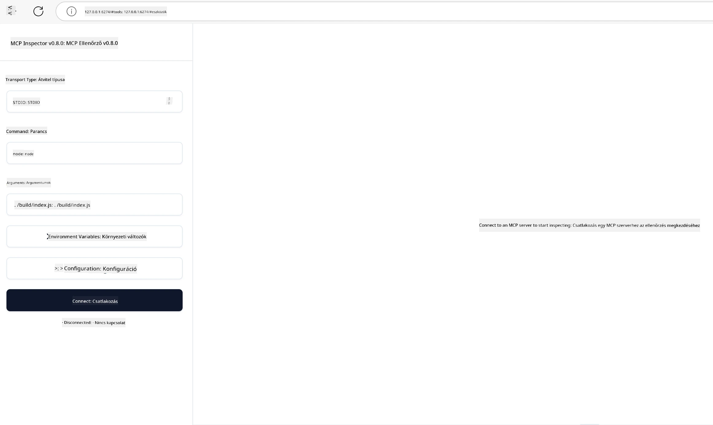

## Tesztelés és Hibakeresés

Mielőtt elkezdenéd tesztelni MCP szerveredet, fontos megérteni a rendelkezésre álló eszközöket és a hibakeresés legjobb gyakorlatait. A hatékony tesztelés biztosítja, hogy a szerver a várakozásoknak megfelelően működjön, és segít gyorsan azonosítani és megoldani a problémákat. A következő fejezet az MCP implementációd ellenőrzéséhez ajánlott megközelítéseket ismerteti.

## Áttekintés

Ez a lecke bemutatja, hogyan válasszunk megfelelő tesztelési megközelítést és a leghatékonyabb tesztelő eszközt.

## Tanulási célok

A lecke végére képes leszel:

- Leírni különböző tesztelési megközelítéseket.
- Különböző eszközöket használni a kód hatékony tesztelésére.

## MCP szerverek tesztelése

Az MCP eszközöket biztosít a szerverek teszteléséhez és hibakereséséhez:

- **MCP Inspector**: Egy parancssori eszköz, amely futtatható CLI eszközként vagy vizuális eszközként.
- **Manuális tesztelés**: Használhatsz olyan eszközt, mint a curl webes kérések futtatásához, de bármilyen HTTP-t futtatni képes eszköz megfelel.
- **Egységtesztelés**: Lehetőség van a kedvenc tesztelési keretrendszered használatára is mind szerver-, mind kliensfunkciók teszteléséhez.

### MCP Inspector használata

Ezt az eszközt korábbi leckékben már bemutattuk, de most egy általános áttekintést adunk róla. Ez egy Node.js-ben készült eszköz, amelyet az `npx` futtatható fájlon keresztül használhatsz, amely ideiglenesen letölti és telepíti magát az eszközt, majd a futtatás befejeztével törli azt.

A [MCP Inspector](https://github.com/modelcontextprotocol/inspector) ezekben segít:

- **Szerver képességek felfedezése**: Automatikusan észleli az elérhető erőforrásokat, eszközöket és parancsokat
- **Eszköz futtatásának tesztelése**: Különböző paraméterek kipróbálása és válaszok valós idejű megtekintése
- **Szerver metaadatainak megtekintése**: A szerver információk, sémák és konfigurációk vizsgálata

Az eszköz tipikus futtatása így néz ki:

```bash
npx @modelcontextprotocol/inspector node build/index.js
```

A fenti parancs elindít egy MCP-t és annak vizuális felületét, valamint egy helyi webes felületet nyit meg a böngésződben. Olyan irányítópultot fogsz látni, amelyen a regisztrált MCP szervereid, azok elérhető eszközei, erőforrásai és parancsai jelennek meg. A felület lehetővé teszi az eszköz futtatásának interaktív tesztelését, a szerver metaadatainak ellenőrzését és a válaszok valós idejű megtekintését, megkönnyítve az MCP szerver implementációk ellenőrzését és hibakeresését.

Így nézhet ki: 

Az eszközt CLI módban is futtathatod, ekkor a `--cli` paramétert kell hozzáadnod. Íme egy példa az eszköz CLI módban történő futtatására, amely felsorolja a szerveren elérhető eszközöket:

```sh
npx @modelcontextprotocol/inspector --cli node build/index.js --method tools/list
```

### Manuális tesztelés

Az inspector eszköz szerverképességek tesztelésére való futtatása mellett egy másik hasonló megközelítés egy HTTP-képes kliens futtatása, mint például a curl.

Curl segítségével közvetlenül HTTP-kérésekkel tesztelheted az MCP szervereket:

```bash
# Példa: Teszt szerver metaadatok
curl http://localhost:3000/v1/metadata

# Példa: Eszköz végrehajtása
curl -X POST http://localhost:3000/v1/tools/execute \
  -H "Content-Type: application/json" \
  -d '{"name": "calculator", "parameters": {"expression": "2+2"}}'
```

A fenti curl használatából látható, hogy egy POST kéréssel egy eszközt hívsz meg, amelyhez a payload az eszköz nevét és paramétereit tartalmazza. Használd azt a megközelítést, amelyik neked a legjobban megfelel. A CLI eszközök általában gyorsabbak, és könnyen szkriptelhetőek, ami hasznos lehet CI/CD környezetben.

### Egységtesztelés

Készíts egységteszteket az eszközeidhez és erőforrásaidhoz, hogy biztosítsd a várakozások szerinti működést. Íme egy példa tesztkód:

```python
import pytest

from mcp.server.fastmcp import FastMCP
from mcp.shared.memory import (
    create_connected_server_and_client_session as create_session,
)

# Jelöld meg az egész modult aszinkron tesztekhez
pytestmark = pytest.mark.anyio


async def test_list_tools_cursor_parameter():
    """Test that the cursor parameter is accepted for list_tools.

    Note: FastMCP doesn't currently implement pagination, so this test
    only verifies that the cursor parameter is accepted by the client.
    """

 server = FastMCP("test")

    # Készíts néhány teszteszközt
    @server.tool(name="test_tool_1")
    async def test_tool_1() -> str:
        """First test tool"""
        return "Result 1"

    @server.tool(name="test_tool_2")
    async def test_tool_2() -> str:
        """Second test tool"""
        return "Result 2"

    async with create_session(server._mcp_server) as client_session:
        # Teszt kurzor paraméter nélkül (kihagyva)
        result1 = await client_session.list_tools()
        assert len(result1.tools) == 2

        # Teszt kurzor=None értékkel
        result2 = await client_session.list_tools(cursor=None)
        assert len(result2.tools) == 2

        # Teszt kurzorral stringként
        result3 = await client_session.list_tools(cursor="some_cursor_value")
        assert len(result3.tools) == 2

        # Teszt üres string kurzorral
        result4 = await client_session.list_tools(cursor="")
        assert len(result4.tools) == 2
    
```

A fenti kód a következőket teszi:

- A pytest keretrendszert használja, amely lehetővé teszi, hogy funkcióként hozz létre teszteket és assert állításokat használj.
- Létrehoz egy MCP szervert két különböző eszközzel.
- Az `assert` állítással ellenőrzi, hogy bizonyos feltételek teljesülnek-e.

Tekintsd meg a [teljes fájlt itt](https://github.com/modelcontextprotocol/python-sdk/blob/main/tests/client/test_list_methods_cursor.py)

Az említett fájl alapján a saját szerveredet is letesztelheted, hogy a képességek a megfelelő módon jönnek-e létre.

Minden nagyobb SDK-nak hasonló tesztelési szekciója van, így alkalmazkodhatsz a választott futtatási környezethez.

## Példák

- [Java Számológép](../samples/java/calculator/README.md)
- [.Net Számológép](../../../../03-GettingStarted/samples/csharp)
- [JavaScript Számológép](../samples/javascript/README.md)
- [TypeScript Számológép](../samples/typescript/README.md)
- [Python Számológép](../../../../03-GettingStarted/samples/python)

## További források

- [Python SDK](https://github.com/modelcontextprotocol/python-sdk)

## Mi következik

- Következő: [Telepítés](../09-deployment/README.md)

---

<!-- CO-OP TRANSLATOR DISCLAIMER START -->
**Jogi nyilatkozat**:
Ez a dokumentum az AI fordítószolgáltatás [Co-op Translator](https://github.com/Azure/co-op-translator) használatával készült. Bár igyekszünk a pontosságra, kérjük, vegye figyelembe, hogy az automatikus fordítások hibákat vagy pontatlanságokat tartalmazhatnak. Az eredeti, anyanyelvű dokumentum tekintendő hiteles forrásnak. Fontos információk esetén szakmai, emberi fordítást javaslunk. Nem vállalunk felelősséget a fordítás használatából eredő félreértésekért vagy téves értelmezésekért.
<!-- CO-OP TRANSLATOR DISCLAIMER END -->