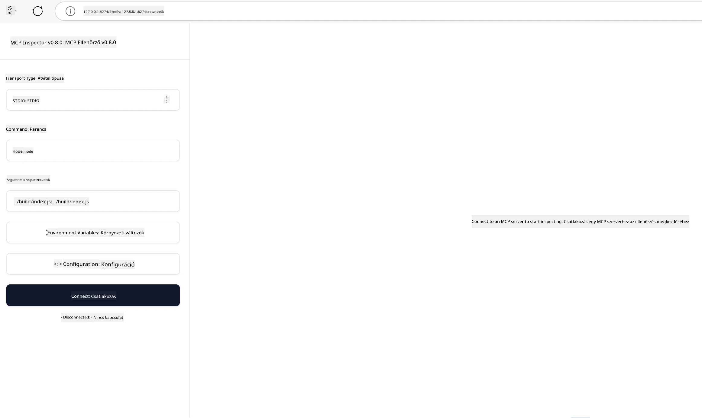

## Tesztelés és hibakeresés

Mielőtt elkezdenéd tesztelni MCP szerveredet, fontos megérteni a rendelkezésre álló eszközöket és a hibakeresés legjobb gyakorlatait. A hatékony tesztelés biztosítja, hogy a szerver a várt módon működjön, és segít gyorsan azonosítani és megoldani a problémákat. A következő rész ajánlott megközelítéseket ismertet az MCP implementációd érvényesítéséhez.

## Áttekintés

Ez a lecke azt tárgyalja, hogyan válaszd ki a megfelelő tesztelési megközelítést és a leghatékonyabb tesztelési eszközt.

## Tanulási célok

A lecke végére képes leszel:

- Leírni különféle tesztelési megközelítéseket.
- Különböző eszközöket használni kódod hatékony tesztelésére.


## MCP szerverek tesztelése

Az MCP eszközöket biztosít a szervereid teszteléséhez és hibakereséséhez:

- **MCP Inspector**: Parancssori eszköz, amely futtatható CLI-ként és vizuális eszközként is.
- **Kézi tesztelés**: Használhatsz olyan eszközt, mint a curl webes kérések futtatásához, vagy bármilyen HTTP-t futtató eszközt.
- **Egységtesztelés**: Lehetőséged van kedvenc tesztelési keretrendszered használatára mind a szerver, mind az ügyfél funkcióinak teszteléséhez.

### MCP Inspector használata

Ezt az eszközt korábbi leckékben már ismertettük, de most nézzük meg magasabb szinten. Egy Node.js-ben készült eszköz, amelyet az `npx` végrehajtható állomány segítségével használhatsz. Ez az eszköz ideiglenesen letölti és telepíti az eszközt, majd a futás befejezése után takarít maga után.

A [MCP Inspector](https://github.com/modelcontextprotocol/inspector) segít neked:

- **Szerver képességek felfedezése**: Automatikusan felismeri a rendelkezésre álló erőforrásokat, eszközöket és promptokat
- **Eszköz végrehajtás tesztelése**: Különböző paraméterek kipróbálása, válaszok valós idejű megtekintése
- **Szerver metaadatainak megtekintése**: A szerver információinak, sémáinak és konfigurációinak vizsgálata

Az eszköz tipikus futtatása így néz ki:

```bash
npx @modelcontextprotocol/inspector node build/index.js
```

A fenti parancs elindít egy MCP-t és annak vizuális felületét, és megnyit egy helyi webes felületet a böngésződben. Egy irányítópultot fogsz látni, amely megjeleníti a regisztrált MCP szervereket, azok elérhető eszközeit, erőforrásait és promptjait. Ez a felület lehetővé teszi az eszköz végrehajtásának interaktív tesztelését, a szerver metaadatainak megvizsgálását és a valós idejű válaszok megtekintését, megkönnyítve ezzel MCP szerver implementációid érvényesítését és hibakeresését.

Így nézhet ki: 

Ezt az eszközt CLI módban is futtathatod, ekkor add hozzá a `--cli` attribútumot. Íme egy példa az eszköz "CLI" módban való futtatására, ami felsorolja a szerveren található összes eszközt:

```sh
npx @modelcontextprotocol/inspector --cli node build/index.js --method tools/list
```

### Kézi tesztelés

Az inspector eszköz futtatásán kívül egy hasonló megközelítés az HTTP használatára képes kliens futtatása, például a curl.

Curl használatával közvetlenül HTTP kérésekkel tesztelheted az MCP szervereket:

```bash
# Példa: Teszt szerver metaadatok
curl http://localhost:3000/v1/metadata

# Példa: Szerszám végrehajtása
curl -X POST http://localhost:3000/v1/tools/execute \
  -H "Content-Type: application/json" \
  -d '{"name": "calculator", "parameters": {"expression": "2+2"}}'
```

Ahogy a fenti curl példa mutatja, egy POST kérést használsz egy eszköz meghívására, amelynek használt betöltete (payload) az eszköz nevét és paramétereit tartalmazza. Használd azt a megközelítést, amely számodra leginkább megfelel. A CLI eszközök általában gyorsabbak használni és könnyebben szkriptelhetők, ami hasznos lehet CI/CD környezetben.

### Egységtesztelés

Készíts egységteszteket az eszközeidhez és erőforrásaidhoz, hogy biztosítsd a helyes működést. Íme egy példa tesztkód.

```python
import pytest

from mcp.server.fastmcp import FastMCP
from mcp.shared.memory import (
    create_connected_server_and_client_session as create_session,
)

# Az egész modult megjelölni aszinkron tesztekhez
pytestmark = pytest.mark.anyio


async def test_list_tools_cursor_parameter():
    """Test that the cursor parameter is accepted for list_tools.

    Note: FastMCP doesn't currently implement pagination, so this test
    only verifies that the cursor parameter is accepted by the client.
    """

 server = FastMCP("test")

    # Készíts néhány teszteszközt
    @server.tool(name="test_tool_1")
    async def test_tool_1() -> str:
        """First test tool"""
        return "Result 1"

    @server.tool(name="test_tool_2")
    async def test_tool_2() -> str:
        """Second test tool"""
        return "Result 2"

    async with create_session(server._mcp_server) as client_session:
        # Teszt kurzor paraméter nélkül (kihagyva)
        result1 = await client_session.list_tools()
        assert len(result1.tools) == 2

        # Teszt kurzor=None értékkel
        result2 = await client_session.list_tools(cursor=None)
        assert len(result2.tools) == 2

        # Teszt kurzor stringként
        result3 = await client_session.list_tools(cursor="some_cursor_value")
        assert len(result3.tools) == 2

        # Teszt üres string kurzorral
        result4 = await client_session.list_tools(cursor="")
        assert len(result4.tools) == 2
    
```

A fent bemutatott kód a következőket teszi:

- Használja a pytest keretrendszert, amely lehetővé teszi, hogy a teszteket függvényekként készítsd el és assert állításokat használj.
- Létrehoz egy MCP szervert két különböző eszközzel.
- Az `assert` utasítással ellenőrzi, hogy bizonyos feltételek teljesülnek.

Nézd meg a [teljes fájlt itt](https://github.com/modelcontextprotocol/python-sdk/blob/main/tests/client/test_list_methods_cursor.py)

A fenti fájl alapján tesztelheted saját szerveredet, hogy megbizonyosodj arról, a képességek a tervek szerint jönnek létre.

Minden főbb SDK hasonló teszt részekkel rendelkezik, így alkalmazkodni tudsz a választott futtatási környezethez.

## Példák 

- [Java Számológép](../samples/java/calculator/README.md)
- [.Net Számológép](../../../../03-GettingStarted/samples/csharp)
- [JavaScript Számológép](../samples/javascript/README.md)
- [TypeScript Számológép](../samples/typescript/README.md)
- [Python Számológép](../../../../03-GettingStarted/samples/python) 

## Kiegészítő források

- [Python SDK](https://github.com/modelcontextprotocol/python-sdk)

## Mi következik

- Következő: [Telepítés](../09-deployment/README.md)

---

<!-- CO-OP TRANSLATOR DISCLAIMER START -->
**Jogi nyilatkozat**:
Ez a dokumentum az AI fordítási szolgáltatás, a [Co-op Translator](https://github.com/Azure/co-op-translator) segítségével készült. Bár az pontosságra törekszünk, kérjük, vegye figyelembe, hogy az automatikus fordítások hibákat vagy pontatlanságokat tartalmazhatnak. Az eredeti dokumentum az anyanyelvén tekintendő hiteles forrásnak. Fontos információk esetén professzionális emberi fordítást javasolunk. Nem vállalunk felelősséget semmilyen félreértésért vagy téves értelmezésért, amely ebből a fordításból ered.
<!-- CO-OP TRANSLATOR DISCLAIMER END -->