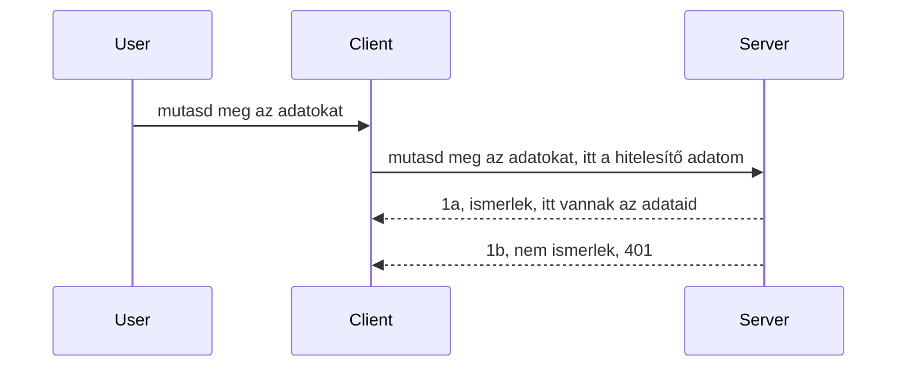

# Egyszerű hitelesítés

Az MCP SDK-k támogatják az OAuth 2.1 használatát, ami valljuk be, egy meglehetősen összetett folyamat, amely olyan fogalmakat foglal magába, mint hitelesítési szerver, erőforrás-szerver, hitelesítő adatok küldése, kód beszerzése, a kód beváltása hordozó tokenre, amíg végül el nem érjük az erőforrás adatokat. Ha nincs tapasztalatod az OAuth használatában, amely egy nagyszerű dolog megvalósítani, érdemes kezdeni valamilyen alapfokú hitelesítéssel, és fokozatosan építkezni egyre jobb biztonság felé. Emiatt létezik ez a fejezet, hogy felkészítsen a haladóbb hitelesítésre.

## Hitelesítés, mit értünk ez alatt?

A hitelesítés a hitelesítés és az engedélyezés rövidítése. A lényeg az, hogy két dolgot kell tennünk:

- **Hitelesítés**, ami annak a folyamata, hogy kiderítsük, beengedjük-e az illetőt a házunkba, hogy jogosult "itt" lenni, vagyis hozzáférhet-e erőforrás-szerverünkhöz, ahol az MCP Server funkciók működnek.
- **Engedélyezés**, ennek célja, hogy megtudjuk, egy felhasználónak hozzáférnie kell-e a konkrét erőforrásokhoz, amelyeket kér, például ezekhez a megrendelésekhez vagy termékekhez, vagy például megengedjük-e, hogy csak olvassa a tartalmat, de ne törölhesse azt.

## Hitelesítő adatok: hogyan közöljük a rendszerrel, kik vagyunk

Nos, a legtöbb webfejlesztő úgy gondolkodik, hogy hitelesítő adatot kell szolgáltatnia a szervernek, általában egy titkos kulcsot, amely megmondja, hogy beengedhetők-e "Hitelesítés". Ez a hitelesítő adat általában egy base64 kódolt felhasználónév és jelszó, vagy egy API kulcs, amely egyedi az adott felhasználóra.

Ezt általában egy "Authorization" nevű fejlécen keresztül küldik, így:

```json
{ "Authorization": "secret123" }
```

Ezt általában alap-hitelesítésnek nevezik. A folyamat összességében így működik:


Most, hogy megértettük a folyamatot, hogyan valósítjuk meg? Nos, a legtöbb webszerver támogat egy middleware fogalmat, egy kódrészt, amely a kérés részeként fut, ellenőrzi a hitelesítő adatokat, és ha azok érvényesek, átengedi a kérést. Ha a kérés nem tartalmaz érvényes hitelesítő adatokat, akkor hitelesítési hiba történik. Nézzük meg, hogyan valósítható ez meg:

**Python**

```python
class AuthMiddleware(BaseHTTPMiddleware):
    async def dispatch(self, request, call_next):

        has_header = request.headers.get("Authorization")
        if not has_header:
            print("-> Missing Authorization header!")
            return Response(status_code=401, content="Unauthorized")

        if not valid_token(has_header):
            print("-> Invalid token!")
            return Response(status_code=403, content="Forbidden")

        print("Valid token, proceeding...")
       
        response = await call_next(request)
        # adj hozzá bármilyen ügyfél fejlécet vagy változtass valahogy a válaszon
        return response


starlette_app.add_middleware(CustomHeaderMiddleware)
```

Itt:

- Létrehoztunk egy `AuthMiddleware` nevű middleware-t, melynek `dispatch` metódusát a webszerver hívja meg.
- Hozzáadtuk a middleware-t a webszerverhez:

    ```python
    starlette_app.add_middleware(AuthMiddleware)
    ```

- Írtunk egy ellenőrző logikát, amely ellenőrzi, hogy van-e Authorization fejléc és az elküldött titok érvényes-e:

    ```python
    has_header = request.headers.get("Authorization")
    if not has_header:
        print("-> Missing Authorization header!")
        return Response(status_code=401, content="Unauthorized")

    if not valid_token(has_header):
        print("-> Invalid token!")
        return Response(status_code=403, content="Forbidden")
    ```

    Ha a titok jelen van és érvényes, akkor átengedjük a kérést a `call_next` hívásával, és visszaadjuk a választ.

    ```python
    response = await call_next(request)
    # adj hozzá bármilyen ügyfél fejlécet vagy változtass valahogy a válaszon
    return response
    ```

A működés lényege, hogy ha egy webkérés érkezik a szerver felé, a middleware meghívódik, és implementációjától függően vagy átengedi a kérést, vagy visszaküld egy hibát, amely azt jelzi, hogy az ügyfél nem jogosult a folytatásra.

**TypeScript**

Itt egy middleware-t hozunk létre az Express népszerű keretrendszerrel, amely elfogja a kérelmet, mielőtt elérné az MCP Server-t. A kód így néz ki:

```typescript
function isValid(secret) {
    return secret === "secret123";
}

app.use((req, res, next) => {
    // 1. Van jelen autorizációs fejléc?
    if(!req.headers["Authorization"]) {
        res.status(401).send('Unauthorized');
    }
    
    let token = req.headers["Authorization"];

    // 2. Ellenőrizze az érvényességet.
    if(!isValid(token)) {
        res.status(403).send('Forbidden');
    }

   
    console.log('Middleware executed');
    // 3. Továbbítja a kérést a kérésfeldolgozási folyamat következő lépéséhez.
    next();
});
```

Ebben a kódban:

1. Ellenőrizzük, hogy az Authorization fejléc létezik-e, ha nem, akkor 401 hibát küldünk.
2. Biztosítjuk, hogy a hitelesítő adat vagy token érvényes legyen, különben 403 hibát küldünk.
3. Végül továbbengedjük a kérést a feldolgozó csővezetéken, és visszaadjuk a kért erőforrást.

## Gyakorlat: Hitelesítés megvalósítása

Vegyük a tudásunkat és próbáljuk megvalósítani. Itt a terv:

Szerver

- Hozzunk létre egy webszervert és egy MCP példányt.
- Készítsünk middleware-t a szerverhez.

Ügyfél

- Küldjön webkérést, hitelesítő adattal a fejlécben.

### -1- Webszerver és MCP példány létrehozása

Első lépésként létre kell hozni a webszerver és MCP Szerver példányt.

**Python**

Itt létrehozunk egy MCP szerver példányt, starlette web appot, és az uvicorn segítségével üzemeltetjük.

```python
# MCP szerver létrehozása

app = FastMCP(
    name="MCP Resource Server",
    instructions="Resource Server that validates tokens via Authorization Server introspection",
    host=settings["host"],
    port=settings["port"],
    debug=True
)

# starlette webalkalmazás létrehozása
starlette_app = app.streamable_http_app()

# alkalmazás szolgáltatása uvicorn segítségével
async def run(starlette_app):
    import uvicorn
    config = uvicorn.Config(
            starlette_app,
            host=app.settings.host,
            port=app.settings.port,
            log_level=app.settings.log_level.lower(),
        )
    server = uvicorn.Server(config)
    await server.serve()

run(starlette_app)
```

Ebben a kódban:

- Létrehozzuk az MCP Server-t.
- Az MCP Serverből konstruáljuk a starlette web appot `app.streamable_http_app()`.
- Végül uvicorn segítségével futtatjuk a szervert `server.serve()`.

**TypeScript**

Itt létrehozunk egy MCP Server példányt.

```typescript
const server = new McpServer({
      name: "example-server",
      version: "1.0.0"
    });

    // ... szerver erőforrások, eszközök és parancsok beállítása ...
```

Az MCP Server létrehozását a POST /mcp útvonal definiálásán belül kell elvégeznünk, tehát vegyük a fentieket és helyezzük át így:

```typescript
import express from "express";
import { randomUUID } from "node:crypto";
import { McpServer } from "@modelcontextprotocol/sdk/server/mcp.js";
import { StreamableHTTPServerTransport } from "@modelcontextprotocol/sdk/server/streamableHttp.js";
import { isInitializeRequest } from "@modelcontextprotocol/sdk/types.js"

const app = express();
app.use(express.json());

// Térkép a szállítások tárolására munkamenet azonosító alapján
const transports: { [sessionId: string]: StreamableHTTPServerTransport } = {};

// POST kérések kezelése kliens-szerver kommunikációhoz
app.post('/mcp', async (req, res) => {
  // Ellenőrizze a meglévő munkamenet-azonosítót
  const sessionId = req.headers['mcp-session-id'] as string | undefined;
  let transport: StreamableHTTPServerTransport;

  if (sessionId && transports[sessionId]) {
    // Létező szállítás újrafelhasználása
    transport = transports[sessionId];
  } else if (!sessionId && isInitializeRequest(req.body)) {
    // Új inicializációs kérés
    transport = new StreamableHTTPServerTransport({
      sessionIdGenerator: () => randomUUID(),
      onsessioninitialized: (sessionId) => {
        // Szállítás tárolása munkamenet-azonosító szerint
        transports[sessionId] = transport;
      },
      // A DNS-újrakötés elleni védelem alapértelmezetten ki van kapcsolva a visszafelé kompatibilitás érdekében. Ha ezt a szervert
      // helyileg futtatja, győződjön meg róla, hogy beállítja:
      // enableDnsRebindingProtection: true,
      // allowedHosts: ['127.0.0.1'],
    });

    // Szállítás törlése záráskor
    transport.onclose = () => {
      if (transport.sessionId) {
        delete transports[transport.sessionId];
      }
    };
    const server = new McpServer({
      name: "example-server",
      version: "1.0.0"
    });

    // ... szerver erőforrások, eszközök és késztetések beállítása ...

    // Kapcsolódás az MCP szerverhez
    await server.connect(transport);
  } else {
    // Érvénytelen kérés
    res.status(400).json({
      jsonrpc: '2.0',
      error: {
        code: -32000,
        message: 'Bad Request: No valid session ID provided',
      },
      id: null,
    });
    return;
  }

  // Kérés kezelése
  await transport.handleRequest(req, res, req.body);
});

// Újrahasználható kezelő GET és DELETE kérésekhez
const handleSessionRequest = async (req: express.Request, res: express.Response) => {
  const sessionId = req.headers['mcp-session-id'] as string | undefined;
  if (!sessionId || !transports[sessionId]) {
    res.status(400).send('Invalid or missing session ID');
    return;
  }
  
  const transport = transports[sessionId];
  await transport.handleRequest(req, res);
};

// GET kérések kezelése szerver-kliens értesítésekhez SSE-n keresztül
app.get('/mcp', handleSessionRequest);

// DELETE kérések kezelése munkamenet megszüntetéséhez
app.delete('/mcp', handleSessionRequest);

app.listen(3000);
```

Látható, hogy az MCP Server létrehozása az `app.post("/mcp")`-n belülre került.

Folytassuk a következő lépéssel, middleware létrehozása, hogy tudjuk ellenőrizni a beérkező hitelesítő adatot.

### -2- Middleware megvalósítása a szerverhez

Most jön a middleware rész. Itt egy olyan middleware-t fogunk létrehozni, amely megkeresi az `Authorization` fejlécben található hitelesítő adatot, ellenőrzi azt, és ha elfogadható, akkor a kérés folytatódik (pl. eszközök listázása, erőforrás olvasása vagy bármely MCP funkció, amit a kliens kért).

**Python**

A middleware létrehozásához egy `BaseHTTPMiddleware` osztályból öröklődő osztályt kell készítenünk. Két fontos rész van:

- A `request`, amelyből a fejlécet olvassuk.
- A `call_next`, amit akkor kell meghívni, ha elfogadjuk a hitelesítő adatot.

Először kezeljük az esetet, ha hiányzik az `Authorization` fejléc:

```python
has_header = request.headers.get("Authorization")

# nincs fejléc, sikertelen 401-gyel, egyébként továbblép.
if not has_header:
    print("-> Missing Authorization header!")
    return Response(status_code=401, content="Unauthorized")
```

Itt 401 nem engedélyezett üzenetet küldünk vissza, mert a kliens nem sikeresen hitelesített.

Ha megvan a hitelesítő adat, ellenőrizzük az érvényességét így:

```python
 if not valid_token(has_header):
    print("-> Invalid token!")
    return Response(status_code=403, content="Forbidden")
```

Látható, hogy itt 403 Tiltott üzenetet küldünk. Nézzük meg az egész middleware-t, amely a fentieket megvalósítja:

```python
class AuthMiddleware(BaseHTTPMiddleware):
    async def dispatch(self, request, call_next):

        has_header = request.headers.get("Authorization")
        if not has_header:
            print("-> Missing Authorization header!")
            return Response(status_code=401, content="Unauthorized")

        if not valid_token(has_header):
            print("-> Invalid token!")
            return Response(status_code=403, content="Forbidden")

        print("Valid token, proceeding...")
        print(f"-> Received {request.method} {request.url}")
        response = await call_next(request)
        response.headers['Custom'] = 'Example'
        return response

```

Remek, de mi a helyzet a `valid_token` függvénnyel? Itt van lentebb:

```python
# NE használd éles környezetben - fejleszd tovább !!
def valid_token(token: str) -> bool:
    # távolítsd el a "Bearer " előtagot
    if token.startswith("Bearer "):
        token = token[7:]
        return token == "secret-token"
    return False
```

Nyilván ez fejlesztésre szorul.

FONTOS: Soha ne tárolj ilyen titkokat kódban. Ideális esetben az összehasonlításhoz használt értéket adatforrásból vagy egy identitás szolgáltatótól (IDP) kell lekérni, vagy még jobb, ha az IDP végzi el a validációt.

**TypeScript**

Express-ben a megvalósításhoz a `use` metódust kell hívni, amely middleware funkciókat vesz fel.

Tennünk kell:

- A kérés objektumon ellenőrizni a `Authorization` fejlécben továbbított hitelesítő adatot.
- Validálni az adatot, és ha az érvényes, a kérést továbbengedni, és a kliens MCP kérése végrehajtódik (pl. eszközök listázása, erőforrás olvasása, vagy bármely MCP funkció).

Itt ellenőrizzük, hogy az `Authorization` fejléc létezik-e, és ha nem, megállítjuk a kérést:

```typescript
if(!req.headers["authorization"]) {
    res.status(401).send('Unauthorized');
    return;
}
```

Ha a fejléc nincs elküldve, 401 hibát kapsz.

Ezután ellenőrizzük, hogy a hitelesítő adat érvényes-e, ha nem, ismét megállítjuk a kérést, de más hibaüzenettel:

```typescript
if(!isValid(token)) {
    res.status(403).send('Forbidden');
    return;
} 
```

Itt már 403-at kapunk.

Íme a teljes kód:

```typescript
app.use((req, res, next) => {
    console.log('Request received:', req.method, req.url, req.headers);
    console.log('Headers:', req.headers["authorization"]);
    if(!req.headers["authorization"]) {
        res.status(401).send('Unauthorized');
        return;
    }
    
    let token = req.headers["authorization"];

    if(!isValid(token)) {
        res.status(403).send('Forbidden');
        return;
    }  

    console.log('Middleware executed');
    next();
});
```

Beállítottuk a webszervert, hogy elfogadjon egy middleware-t az ügyféltől érkező hitelesítő adat ellenőrzésére. És mi az ügyfél oldalon?

### -3- Webkérés küldése hitelesítő adattal a fejlécben

Biztosítani kell, hogy az ügyfél a fejlécen keresztül küldje a hitelesítő adatot. Mivel MCP ügyfelet használunk ehhez, nézzük meg, hogyan történik ez.

**Python**

Az ügyfél számára így kell egy fejlécet küldeni a hitelesítő adatunkkal:

```python
# NE kódold be keményen az értéket, legfeljebb környezeti változóban vagy biztonságosabb tárolóban legyen
token = "secret-token"

async with streamablehttp_client(
        url = f"http://localhost:{port}/mcp",
        headers = {"Authorization": f"Bearer {token}"}
    ) as (
        read_stream,
        write_stream,
        session_callback,
    ):
        async with ClientSession(
            read_stream,
            write_stream
        ) as session:
            await session.initialize()
      
            # TEENDŐ, mit szeretnél, hogy a kliens csináljon, pl. eszközök listázása, eszközök hívása stb.
```

Látható, hogy a `headers` tulajdonságot így töltjük fel: ` headers = {"Authorization": f"Bearer {token}"}`.

**TypeScript**

Ezt két lépésben oldhatjuk meg:

1. Létrehozzuk a konfigurációs objektumot hitelesítő adatunkkal.
2. Átadjuk ezt a konfigurációs objektumot a transzportnak.

```typescript

// NE kódold be keményen az értéket, ahogy itt látható. Legalább legyen környezeti változóként, és használj valami ilyesmit, mint a dotenv (fejlesztői módban).
let token = "secret123"

// definiálj egy kliens szállítási opció objektumot
let options: StreamableHTTPClientTransportOptions = {
  sessionId: sessionId,
  requestInit: {
    headers: {
      "Authorization": "secret123"
    }
  }
};

// add át az opciók objektumot a szállításnak
async function main() {
   const transport = new StreamableHTTPClientTransport(
      new URL(serverUrl),
      options
   );
```

Láttad, hogy létre kellett hozni egy `options` objektumot, s ebben helyezzük el a fejléceket a `requestInit` tulajdonság alatt.

FONTOS: Hogyan javíthatunk ezen tovább? A jelenlegi megvalósításnak van néhány problémája. Egyrészt hitelesítő adatot így továbbítani elég kockázatos, hacsak nincs legalább HTTPS. Még ekkor is, a hitelesítő adat ellopható, ezért olyan rendszer kell, ahol könnyen vissza lehet vonni a tokent, illetve további ellenőrzéseket tehetünk, például honnan érkezik a kérés, túlságosan gyakori-e (bot-szerű viselkedés), röviden rengeteg aggály merül fel.

Azért el kell mondani, hogy nagyon egyszerű API-k esetében, ahol nem akarjuk, hogy bárki hívhassa API-nkat hitelesítés nélkül, a mostani megoldás jó kiindulás.

Ezt szem előtt tartva próbáljuk meg kicsit megerősíteni a biztonságot egy szabványos formátum, például JSON Web Token (JWT vagy "JOT") használatával.

## JSON Web Tokenek, JWT

Tehát, próbálunk javítani az egyszerű hitelesítő adat továbbításon. Milyen azonnali előnyeink származnak a JWT alkalmazásából?

- **Biztonsági fejlesztések**. Alap hitelesítésnél a felhasználónevet és jelszót base64 kódolt tokenként (vagy API kulcsként) ismételten küldöd, ami növeli a kockázatot. JWT-vel elküldöd a felhasználónevet és jelszót, kapsz egy tokent cserébe, amely időhöz kötött, azaz lejár. A JWT lehetővé teszi a finomhangolt hozzáférés-vezérlést szerepek, tartományok, jogosultságok alapján.
- **Állapottalanság és skálázhatóság**. A JWT-k önmagukban hordozzák az összes felhasználói információt, így nincs szükség szerver oldali munkamenet tárolásra. A token helyben is validálható.
- **Interoperabilitás és federáció**. A JWT központi szerepet tölt be az Open ID Connect-ben, és ismert identitásszolgáltatókkal együtt használják, mint Entra ID, Google Identity vagy Auth0. Ezek lehetővé teszik az egypontos bejelentkezést és sok mást, ami vállalati szintű megoldás.
- **Modularitás és rugalmasság**. JWT-k használhatók API Gateway-ekkel, mint Azure API Management, NGINX és mások. Támogatja az egyéni hitelesítési forgatókönyveket és szerver-szolgáltatás kommunikációkat, beleértve az általi képviseletet és delegációt.
- **Teljesítmény és gyorsítótárazás**. A JWT-k dekódolás után gyorsítótárazhatók, ami csökkenti az elemzés szükségességét. Ez különösen a magas forgalmú alkalmazásoknál növeli az áteresztőképességet és csökkenti az infrastruktúra terhelését.
- **Haladó funkciók**. Támogatja az introspektív ellenőrzést (érvényesség szerveren), és a visszavonást (token érvénytelenítése).

Ezen előnyök birtokában lássuk, hogyan emelhetjük magasabb szintre az implementációnkat.

## Alap hitelesítés JWT-re cserélése

Tehát az átfogó változtatások:

- **JWT token előállítás megtanulása**, és elküldésének előkészítése kliensből szervernek.
- **JWT token validálása**, és ha érvényes, engedélyezni a kliens hozzáférését az erőforráshoz.
- **Biztonságos token tárolás**. Hogyan tároljuk ezt a tokent.
- **Útvonalak védelme**. Meg kell védenünk az útvonalakat, illetve az MCP specifikus funkciókat.
- **Frissítő tokenek hozzáadása**. Győződjünk meg róla, hogy rövid élettartamú tokeneket hozunk létre, valamint hosszabb élettartamú frissítő tokeneket, amelyekkel új token szerezhető, ha lejárnak. Biztosítani kell frissítő végpontot és forgatási stratégiát.

### -1- JWT token létrehozása

Elsőként, egy JWT token a következő részekből áll:

- **fejléc**, a algoritmus és token típus
- **tartalom (payload)**, állítások, mint pl. sub (a felhasználó vagy entitás, amelyet a token képvisel, auth esetben tipikusan az azonosító), exp (lejárati idő), szerep (pl. role)
- **aláírás** titkos vagy privát kulccsal aláírva.

Ehhez elő kell állítanunk a fejlécet, a tartalmat és az enkódolt tokent.

**Python**

```python

import jwt
import jwt
from jwt.exceptions import ExpiredSignatureError, InvalidTokenError
import datetime

# Titkos kulcs a JWT aláírásához
secret_key = 'your-secret-key'

header = {
    "alg": "HS256",
    "typ": "JWT"
}

# a felhasználói információ, az állításai és lejárati ideje
payload = {
    "sub": "1234567890",               # Tárgy (felhasználói azonosító)
    "name": "User Userson",                # Egyéni állítás
    "admin": True,                     # Egyéni állítás
    "iat": datetime.datetime.utcnow(),# Kiadva ekkor
    "exp": datetime.datetime.utcnow() + datetime.timedelta(hours=1)  # Lejárat
}

# kódold át
encoded_jwt = jwt.encode(payload, secret_key, algorithm="HS256", headers=header)
```

A fenti kódban:

- Definiáltunk egy fejlécet HS256 algoritmussal és a típust JWT-re állítottuk.
- Összeállítottunk egy tartalmat, amely tartalmaz egy tárgyat vagy felhasználói azonosítót, felhasználónevet, szerepet, mikor adták ki és mikor jár le, ezzel megvalósítva az időhöz kötöttséget.

**TypeScript**

Itt szükségünk lesz néhány függőségre, amelyek segítenek a JWT token létrehozásában.

Függőségek

```sh

npm install jsonwebtoken
npm install --save-dev @types/jsonwebtoken
```

Most, hogy ez megvan, készítsük el a fejlécet, tartalmat, és ezen keresztül az enkódolt tokent.

```typescript
import jwt from 'jsonwebtoken';

const secretKey = 'your-secret-key'; // Használj környezeti változókat éles környezetben

// Definiáld a teheradatot
const payload = {
  sub: '1234567890',
  name: 'User usersson',
  admin: true,
  iat: Math.floor(Date.now() / 1000), // Kiadva
  exp: Math.floor(Date.now() / 1000) + 60 * 60 // 1 órán belül lejár
};

// Definiáld a fejlécet (opcionális, a jsonwebtoken alapértelmezést állít be)
const header = {
  alg: 'HS256',
  typ: 'JWT'
};

// Hozd létre a tokent
const token = jwt.sign(payload, secretKey, {
  algorithm: 'HS256',
  header: header
});

console.log('JWT:', token);
```

Ez a token:

HS256-tal aláírva
1 óráig érvényes
Tartalmazza az állításokat, mint sub, name, admin, iat és exp.

### -2- Token validálása

A token érvényességét is ellenőrizni kell, ezt szerver oldalon kell elvégezni, hogy biztos legyünk, amit a kliens küld, az valóban érvényes. Sok ellenőrzés szükséges, struktúra, érvényesség vizsgálata mellett ajánlott további ellenőrzéseket is végezni, például hogy a felhasználó létezik-e a rendszerünkben stb.

A token validálásához előbb dekódolni kell, hogy olvashassuk, majd ellenőrzéseket végezzünk:

**Python**

```python

# Dekódolja és ellenőrzi a JWT-t
try:
    decoded = jwt.decode(token, secret_key, algorithms=["HS256"])
    print("✅ Token is valid.")
    print("Decoded claims:")
    for key, value in decoded.items():
        print(f"  {key}: {value}")
except ExpiredSignatureError:
    print("❌ Token has expired.")
except InvalidTokenError as e:
    print(f"❌ Invalid token: {e}")

```

Ebben a kódban a `jwt.decode` hívást használjuk, a token, a titkos kulcs és az algoritmus argumentumként adva. Látható, hogy try-catch konstrukciót használunk, mert hibás validáció esetén kivételt dob a könyvtár.

**TypeScript**

Itt a `jwt.verify` meghívásával kapunk dekódolt tokent, amit tovább elemezhetünk. Ha ez a hívás hibát ad, akkor a token szerkezete hibás vagy érvénytelen.

```typescript

try {
  const decoded = jwt.verify(token, secretKey);
  console.log('Decoded Payload:', decoded);
} catch (err) {
  console.error('Token verification failed:', err);
}
```

MEGJEGYZÉS: ahogy korábban is említettük, további ellenőrzéseket is végeznünk kell, hogy a token valóban azt a felhasználót jelöli, akihez tartozik, és az jogosultságai megfelelők.

Most nézzük meg a szerepalapú hozzáférés-vezérlést, más néven RBAC-ot.
## Szerepalapú hozzáférés-vezérlés hozzáadása

Az elképzelés az, hogy kifejezzük, hogy a különböző szerepek különböző jogosultságokkal rendelkeznek. Például feltételezzük, hogy egy adminisztrátor mindent megtehet, egy normál felhasználó olvashat/írhat, míg egy vendég csak olvashat. Ezért itt vannak a lehetséges jogosultsági szintek:

- Admin.Write 
- User.Read
- Guest.Read

Nézzük meg, hogyan valósíthatunk meg ilyen vezérlést middleware segítségével. Middleware-ek hozzáadhatók útvonalanként, valamint minden útvonalra is.

**Python**

```python
from starlette.middleware.base import BaseHTTPMiddleware
from starlette.responses import JSONResponse
import jwt

# NE hagyd a titkot a kódban, ez csak bemutató célokra szolgál. Olvasd be egy biztonságos helyről.
SECRET_KEY = "your-secret-key" # tedd ezt környezeti változóba
REQUIRED_PERMISSION = "User.Read"

class JWTPermissionMiddleware(BaseHTTPMiddleware):
    async def dispatch(self, request, call_next):
        auth_header = request.headers.get("Authorization")
        if not auth_header or not auth_header.startswith("Bearer "):
            return JSONResponse({"error": "Missing or invalid Authorization header"}, status_code=401)

        token = auth_header.split(" ")[1]
        try:
            decoded = jwt.decode(token, SECRET_KEY, algorithms=["HS256"])
        except jwt.ExpiredSignatureError:
            return JSONResponse({"error": "Token expired"}, status_code=401)
        except jwt.InvalidTokenError:
            return JSONResponse({"error": "Invalid token"}, status_code=401)

        permissions = decoded.get("permissions", [])
        if REQUIRED_PERMISSION not in permissions:
            return JSONResponse({"error": "Permission denied"}, status_code=403)

        request.state.user = decoded
        return await call_next(request)


```

Néhány különböző módja van a middleware hozzáadásának, például az alábbi módon:

```python

# 1. lehetőség: köztes szoftver hozzáadása a starlette alkalmazás építése közben
middleware = [
    Middleware(JWTPermissionMiddleware)
]

app = Starlette(routes=routes, middleware=middleware)

# 2. lehetőség: köztes szoftver hozzáadása, miután a starlette alkalmazás már felépült
starlette_app.add_middleware(JWTPermissionMiddleware)

# 3. lehetőség: köztes szoftver hozzáadása útvonalanként
routes = [
    Route(
        "/mcp",
        endpoint=..., # kezelő
        middleware=[Middleware(JWTPermissionMiddleware)]
    )
]
```

**TypeScript**

Használhatjuk az `app.use`-t és egy middleware-t, amely minden kéréshez lefut.

```typescript
app.use((req, res, next) => {
    console.log('Request received:', req.method, req.url, req.headers);
    console.log('Headers:', req.headers["authorization"]);

    // 1. Ellenőrizze, hogy az autorizációs fejlécet elküldték-e

    if(!req.headers["authorization"]) {
        res.status(401).send('Unauthorized');
        return;
    }
    
    let token = req.headers["authorization"];

    // 2. Ellenőrizze, hogy az érvényes a token
    if(!isValid(token)) {
        res.status(403).send('Forbidden');
        return;
    }  

    // 3. Ellenőrizze, hogy a token felhasználó létezik-e a rendszerünkben
    if(!isExistingUser(token)) {
        res.status(403).send('Forbidden');
        console.log("User does not exist");
        return;
    }
    console.log("User exists");

    // 4. Ellenőrizze, hogy a tokennek megvannak-e a megfelelő jogosultságai
    if(!hasScopes(token, ["User.Read"])){
        res.status(403).send('Forbidden - insufficient scopes');
    }

    console.log("User has required scopes");

    console.log('Middleware executed');
    next();
});

```

Sok dolgot engedhetünk meg a middleware-ünknek, és sok dolgot KELL is hogy megtegyen, nevezetesen:

1. Ellenőrizze, hogy az authorization header jelen van-e
2. Ellenőrizze, hogy a token érvényes-e, meghívjuk az `isValid` metódust, amelyet írtunk, és amely ellenőrzi a JWT token integritását és érvényességét.
3. Ellenőrizze, hogy a felhasználó létezik-e a rendszerünkben, ezt ellenőriznünk kell.

   ```typescript
    // felhasználók az adatbázisban
   const users = [
     "user1",
     "User usersson",
   ]

   function isExistingUser(token) {
     let decodedToken = verifyToken(token);

     // TODO, ellenőrizze, hogy a felhasználó létezik-e az adatbázisban
     return users.includes(decodedToken?.name || "");
   }
   ```

   Fent létrehoztunk egy nagyon egyszerű `users` listát, ami természetesen adatbázisban kéne legyen.

4. Továbbá ellenőriznünk kell, hogy a token rendelkezik-e a megfelelő jogosultságokkal.

   ```typescript
   if(!hasScopes(token, ["User.Read"])){
        res.status(403).send('Forbidden - insufficient scopes');
   }
   ```

   A fenti middleware kódban azt ellenőrizzük, hogy a token tartalmazza-e a User.Read jogosultságot, ha nem, akkor 403 hibát küldünk. Alább látható a `hasScopes` segédmetódus.

   ```typescript
   function hasScopes(scope: string, requiredScopes: string[]) {
     let decodedToken = verifyToken(scope);
    return requiredScopes.every(scope => decodedToken?.scopes.includes(scope));
  }
   ```

Have a think which additional checks you should be doing, but these are the absolute minimum of checks you should be doing.

Using Express as a web framework is a common choice. There are helpers library when you use JWT so you can write less code.

- `express-jwt`, helper library that provides a middleware that helps decode your token.
- `express-jwt-permissions`, this provides a middleware `guard` that helps check if a certain permission is on the token.

Here's what these libraries can look like when used:

```typescript
const express = require('express');
const jwt = require('express-jwt');
const guard = require('express-jwt-permissions')();

const app = express();
const secretKey = 'your-secret-key'; // put this in env variable

// Decode JWT and attach to req.user
app.use(jwt({ secret: secretKey, algorithms: ['HS256'] }));

// Check for User.Read permission
app.use(guard.check('User.Read'));

// multiple permissions
// app.use(guard.check(['User.Read', 'Admin.Access']));

app.get('/protected', (req, res) => {
  res.json({ message: `Welcome ${req.user.name}` });
});

// Error handler
app.use((err, req, res, next) => {
  if (err.code === 'permission_denied') {
    return res.status(403).send('Forbidden');
  }
  next(err);
});

```

Most, hogy láttad, hogyan használható a middleware az autentikációhoz és az autorizációhoz, mi a helyzet az MCP-vel, megváltoztatja-e az, ahogy az authot csináljuk? Nézzük meg a következő részben.

### -3- RBAC hozzáadása MCP-hez

Eddig láttad, hogyan adhatsz RBAC-t middleware-en keresztül, azonban MCP esetén nincs egyszerű mód arra, hogy funkciónkénti RBAC-t adjunk hozzá, tehát mit csinálunk? Egyszerűen csak ilyesmi kódot kell hozzáadnunk, amely ellenőrzi, hogy az adott kliens jogosult-e egy adott eszköz hívására:

Néhányféle lehetőséged van arra, hogyan valósítsd meg a funkciónkénti RBAC-t, íme néhány:

- Adj egy ellenőrzést minden eszközhöz, erőforráshoz, prompthoz, ahol szükséges a jogosultsági szint ellenőrzése.

   **python**

   ```python
   @tool()
   def delete_product(id: int):
      try:
          check_permissions(role="Admin.Write", request)
      catch:
        pass # az ügyfél jogosultságellenőrzése sikertelen, dobjon jogosultsági hibát
   ```

   **typescript**

   ```typescript
   server.registerTool(
    "delete-product",
    {
      title: Delete a product",
      description: "Deletes a product",
      inputSchema: { id: z.number() }
    },
    async ({ id }) => {
      
      try {
        checkPermissions("Admin.Write", request);
        // teendő, küldd el az azonosítót a productService-nek és a távoli belépésnek
      } catch(Exception e) {
        console.log("Authorization error, you're not allowed");  
      }

      return {
        content: [{ type: "text", text: `Deletected product with id ${id}` }]
      };
    }
   );
   ```


- Használj fejlett szerver megközelítést és kérés kezelőket, így minimalizálhatod, hány helyen kell ellenőrzést végezni.

   **Python**

   ```python
   
   tool_permission = {
      "create_product": ["User.Write", "Admin.Write"],
      "delete_product": ["Admin.Write"]
   }

   def has_permission(user_permissions, required_permissions) -> bool:
      # user_permissions: a felhasználó jogosultságainak listája
      # required_permissions: az eszközhöz szükséges jogosultságok listája
      return any(perm in user_permissions for perm in required_permissions)

   @server.call_tool()
   async def handle_call_tool(
     name: str, arguments: dict[str, str] | None
   ) -> list[types.TextContent]:
    # Feltételezzük, hogy a request.user.permissions a felhasználó jogosultságainak listája
     user_permissions = request.user.permissions
     required_permissions = tool_permission.get(name, [])
     if not has_permission(user_permissions, required_permissions):
        # Hibát dob "Nincs jogosultsága a(z) {name} eszköz hívásához"
        raise Exception(f"You don't have permission to call tool {name}")
     # folytatás és eszköz hívása
     # ...
   ```   
   

   **TypeScript**

   ```typescript
   function hasPermission(userPermissions: string[], requiredPermissions: string[]): boolean {
       if (!Array.isArray(userPermissions) || !Array.isArray(requiredPermissions)) return false;
       // Igaz értéket ad vissza, ha a felhasználónak legalább egy szükséges jogosultsága van
       
       return requiredPermissions.some(perm => userPermissions.includes(perm));
   }
  
   server.setRequestHandler(CallToolRequestSchema, async (request) => {
      const { params: { name } } = request;
  
      let permissions = request.user.permissions;
  
      if (!hasPermission(permissions, toolPermissions[name])) {
         return new Error(`You don't have permission to call ${name}`);
      }
  
      // folytasd..
   });
   ```

   Megjegyzés, biztosítanod kell, hogy a middleware hozzárendeljen egy dekódolt tokent a kérés `user` property-jéhez, hogy a fenti kód egyszerű legyen.

### Összefoglalva

Most, hogy megvitattuk, hogyan adjunk támogatást az RBAC-hoz általánosságban és különösen MCP esetében, itt az ideje, hogy megpróbáld saját magad megvalósítani a biztonságot, hogy megbizonyosodj arról, hogy megértetted az előtted bemutatott fogalmakat.

## Feladat 1: Építs egy mcp szervert és mcp klienst alapvető autentikációval

Itt alkalmazhatod azt, amit megtanultál a hitelesítő adatok fejléceken keresztüli küldéséről.

## Megoldás 1

[Solution 1](./code/basic/README.md)

## Feladat 2: Fejleszd tovább az 1. feladat megoldását JWT használatával

Vedd az első megoldást, de most fejlesszük tovább.

Basic Auth helyett használjunk JWT-t.

## Megoldás 2

[Solution 2](./solution/jwt-solution/README.md)

## Kihívás

Add hozzá a funkciónkénti RBAC-t, ahogy a "RBAC hozzáadása MCP-hez" szakaszban leírtuk.

## Összegzés

Remélhetőleg sokat tanultál ebben a fejezetben, a teljes biztonság hiányától indulva, az alapbiztonságon át, a JWT-ig és hogy ez hogyan adható hozzá MCP-hez.

Egy szilárd alapot építettünk egyedi JWT-kkel, de ahogy skálázódunk, egy szabványos identitásmodell felé haladunk. Egy IdP, például az Entra vagy Keycloak alkalmazásával átháríthatjuk a token kiállítását, érvényesítését és életciklus-kezelését egy megbízható platformra — így mi az alkalmazás logikájára és a felhasználói élményre koncentrálhatunk.

Ehhez van egy fejlettebb [fejezetünk az Entráról](../../05-AdvancedTopics/mcp-security-entra/README.md)

## Mi következik

- Következő: [MCP hosztok beállítása](../12-mcp-hosts/README.md)

---

<!-- CO-OP TRANSLATOR DISCLAIMER START -->
**Lemondás**:
Ez a dokumentum az AI fordító szolgáltatás [Co-op Translator](https://github.com/Azure/co-op-translator) segítségével készült. Bár pontos fordításra törekszünk, kérjük, vegye figyelembe, hogy az automatikus fordítások hibákat vagy pontatlanságokat tartalmazhatnak. Az eredeti dokumentum az anyanyelvén tekintendő hiteles forrásnak. Fontos információk esetén szakmai, emberi fordítást javasolunk. Nem vállalunk felelősséget a fordítás használatából eredő félreértésekért vagy értelmezési hibákért.
<!-- CO-OP TRANSLATOR DISCLAIMER END -->