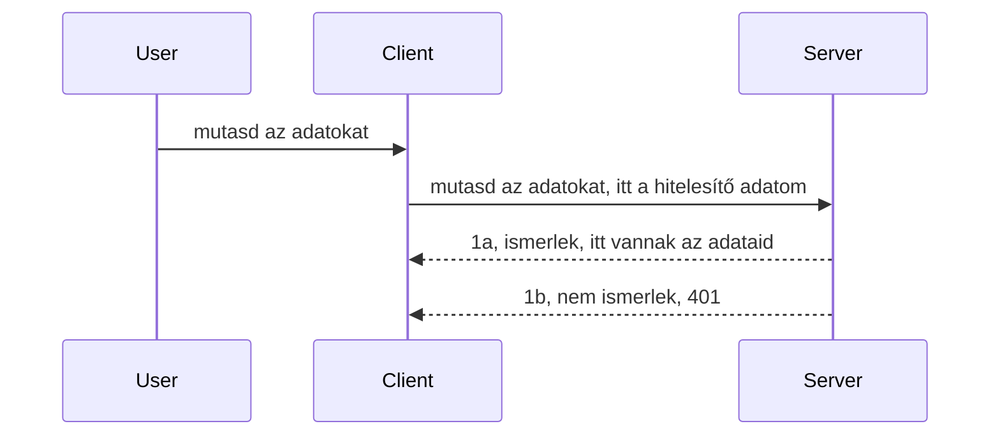

# Egyszerű hitelesítés

Az MCP SDK-k támogatják az OAuth 2.1 használatát, amely, ha őszinték vagyunk, egy eléggé bonyolult folyamat, amely olyan fogalmakat foglal magába, mint az hitelesítési szerver, erőforrás szerver, hitelesítő adatok beküldése, kód megszerzése, a kód cseréje egy hordozó tokenre, míg végül hozzáférhetünk az erőforrásaink adataihoz. Ha nem vagyunk hozzászokva az OAuth-hoz, amely egy remek dolog, amit érdemes megvalósítani, akkor jó ötlet kezdeni egy alap szintű hitelesítéssel, és fokozatosan fejleszteni egyre jobb biztonság felé. Ezért létezik ez a fejezet, hogy felkészítsen a haladóbb hitelesítésre.

## Hitelesítés, mit jelent ez?

A hitelesítés a hitelesítés és az engedélyezés rövidítése. Az a lényeg, hogy két dolgot kell tennünk:

- **Hitelesítés**, ami annak a folyamatát jelenti, amikor kiderítjük, hogy engedélyezzük-e, hogy valaki belépjen a házunkba, vagyis hogy jogosult "itt lenni", vagyis hozzáférni az erőforrás szerverünkhöz, ahol az MCP szerver funkciói vannak.
- **Engedélyezés**, az a folyamat, amikor kiderítjük, hogy egy felhasználónak hozzáférése legyen-e az adott erőforrásokhoz, amiket kér, például ezekhez a rendelésekhez vagy termékekhez, vagy hogy csak olvasási jogosultsága van, de törölni nem engedélyezett az adott példában.

## Hitelesítő adatok: hogyan mondjuk meg a rendszernek, hogy kik vagyunk

Nos, a legtöbb webfejlesztő úgy gondolkodik, hogy egy hitelesítő adatot kell szolgáltatnia a szervernek, általában egy titkot, ami megmondja, hogy engedélyezve vannak-e "Hitelesítés". Ez a hitelesítő adat általában egy base64 kódolt felhasználónév és jelszó vagy egy API kulcs, ami egyedi módon azonosít egy adott felhasználót.

Ez azt jelenti, hogy egy fejlécben, az "Authorization" fejlécen keresztül küldjük el, így:

```json
{ "Authorization": "secret123" }
```

Ezt általában alap hitelesítésnek nevezik. A teljes folyamat pedig így működik:


```mermaid
sequenceDiagram
   participant User
   participant Client
   participant Server

   User->>Client: mutasd az adatokat
   Client->>Server: mutasd az adatokat, itt a hitelesítő adatom
   Server-->>Client: 1a, ismerlek, itt vannak az adataid
   Server-->>Client: 1b, nem ismerlek, 401 
```

Most, hogy megértettük a folyamatot működés szempontjából, hogyan valósítjuk ezt meg? Nos, a legtöbb webszerver rendelkezik egy middleware nevű fogalommal, ami egy olyan kódrész, ami a kérés részeként fut, ellenőrzi a hitelesítő adatokat, és ha érvényesek, akkor engedi átengedni a kérést. Ha a kérés nem tartalmaz érvényes hitelesítő adatokat, akkor hitelesítési hibát kapunk. Lássuk, hogy ezt hogyan lehet megvalósítani:

**Python**

```python
class AuthMiddleware(BaseHTTPMiddleware):
    async def dispatch(self, request, call_next):

        has_header = request.headers.get("Authorization")
        if not has_header:
            print("-> Missing Authorization header!")
            return Response(status_code=401, content="Unauthorized")

        if not valid_token(has_header):
            print("-> Invalid token!")
            return Response(status_code=403, content="Forbidden")

        print("Valid token, proceeding...")
       
        response = await call_next(request)
        # adj hozzá bármilyen ügyfél fejlécet, vagy változtass a válaszon valamilyen módon
        return response


starlette_app.add_middleware(CustomHeaderMiddleware)
```

Itt a következőket tettük:

- Létrehoztunk egy middleware-t `AuthMiddleware` néven, amelynek a `dispatch` metódusa fut a webszerver által.
- Hozzáadtuk a middleware-t a webszerverhez:

    ```python
    starlette_app.add_middleware(AuthMiddleware)
    ```

- Megírtuk az ellenőrző logikát, amely megvizsgálja, hogy az Authorization fejléc jelen van-e és a küldött titok érvényes-e:

    ```python
    has_header = request.headers.get("Authorization")
    if not has_header:
        print("-> Missing Authorization header!")
        return Response(status_code=401, content="Unauthorized")

    if not valid_token(has_header):
        print("-> Invalid token!")
        return Response(status_code=403, content="Forbidden")
    ```

    ha a titok jelen van és érvényes, akkor engedélyezzük a kérés áthaladását a `call_next` meghívásával és visszaadjuk a választ.

    ```python
    response = await call_next(request)
    # adj hozzá bármilyen egyéni fejlécet vagy változtass valahogy a válaszon
    return response
    ```

A működés lényege, hogy amikor egy webkérés érkezik a szerverhez, a middleware fut, és az implementációjától függően vagy átengedi a kérést, vagy hibát ad vissza, amely azt jelzi, hogy a kliensnek nincs engedélye a továbblépésre.

**TypeScript**

Itt egy middleware-t hozunk létre a népszerű Express keretrendszerrel, amely megállítja a kérést, mielőtt az eléri az MCP szervert. Íme a kód ehhez:

```typescript
function isValid(secret) {
    return secret === "secret123";
}

app.use((req, res, next) => {
    // 1. Authorization fejléc jelen van?
    if(!req.headers["Authorization"]) {
        res.status(401).send('Unauthorized');
    }
    
    let token = req.headers["Authorization"];

    // 2. Érvényesség ellenőrzése.
    if(!isValid(token)) {
        res.status(403).send('Forbidden');
    }

   
    console.log('Middleware executed');
    // 3. Átadja a kérést a kérési folyamat következő lépésének.
    next();
});
```

Ebben a kódban:

1. Először megnézzük, hogy az Authorization fejléc jelen van-e, ha nincs, 401-es hibát küldünk.
2. Ellenőrizzük a hitelesítő adat vagy tokent, hogy érvényes-e, ha nem, 403-as hibát küldünk.
3. Végül továbbengedjük a kérést a kérés feldolgozási láncban és visszaküldjük a kért erőforrást.

## Gyakorlat: Implementáld a hitelesítést


Vegyük a tudásunkat, és próbáljuk megvalósítani. Íme a terv:

Szerver

- Hozzunk létre egy webszervert és egy MCP példányt.
- Valósítsunk meg egy middleware-t a szerverhez.

Kliens 

- Küldjünk webes kérést, hitelesítő adatokkal, fejlécen keresztül.

### -1- Hozzuk létre a webszervert és az MCP példányt

> [!WARNING]
> Az alábbi TypeScript példa az MCP `2025-11-25` kiadására célzott. Követi a transzportokat
> `mcp-session-id` alapján, és nem a jelenlegi `2026-07-28` transzport példa. Az MCP
> `2026-07-28` eltávolította az `initialize` kézfogást és a protokoll session ID-t; új
> implementációk önálló kéréseket használnak. Lásd
> [Mi változott az MCP-ben: A 2026-07-28 specifikáció](../../01-CoreConcepts/mcp-2026-07-28.md).

Első lépésként létre kell hoznunk a webszerver példányt és az MCP szervert.

**Python**

Itt létrehozunk egy MCP szerver példányt, létrehozunk egy starlette web alkalmazást, és azt uvicorn-nal hosztoljuk.

```python
# MCP szerver létrehozása

app = FastMCP(
    name="MCP Resource Server",
    instructions="Resource Server that validates tokens via Authorization Server introspection",
    host=settings["host"],
    port=settings["port"],
    debug=True
)

# starlette webalkalmazás létrehozása
starlette_app = app.streamable_http_app()

# az alkalmazás kiszolgálása uvicorn segítségével
async def run(starlette_app):
    import uvicorn
    config = uvicorn.Config(
            starlette_app,
            host=app.settings.host,
            port=app.settings.port,
            log_level=app.settings.log_level.lower(),
        )
    server = uvicorn.Server(config)
    await server.serve()

run(starlette_app)
```

Ebben a kódban:

- Létrehozzuk az MCP szervert.
- A starlette web alkalmazást az MCP szerverből építjük fel, `app.streamable_http_app()`.
- Az uvicorn használatával hosztoljuk és szolgáltatjuk az alkalmazást `server.serve()`.

**TypeScript**

Itt létrehozunk egy MCP Server példányt.

```typescript
const server = new McpServer({
      name: "example-server",
      version: "1.0.0"
    });

    // ... kiszolgáló erőforrások, eszközök és kérések beállítása ...
```

Ennek az MCP szerver létrehozásnak a POST /mcp route definícióban kell történnie, ezért vegyük az előző kódot és helyezzük át így:

```typescript
import express from "express";
import { randomUUID } from "node:crypto";
import { McpServer } from "@modelcontextprotocol/sdk/server/mcp.js";
import { StreamableHTTPServerTransport } from "@modelcontextprotocol/sdk/server/streamableHttp.js";
import { isInitializeRequest } from "@modelcontextprotocol/sdk/types.js"

const app = express();
app.use(express.json());

// Térkép a szállítások tárolására munkamenetazonosító szerint
const transports: { [sessionId: string]: StreamableHTTPServerTransport } = {};

// POST kérések kezelése kliens-szerver kommunikációhoz
app.post('/mcp', async (req, res) => {
  // Ellenőrizze a meglévő munkamenetazonosítót
  const sessionId = req.headers['mcp-session-id'] as string | undefined;
  let transport: StreamableHTTPServerTransport;

  if (sessionId && transports[sessionId]) {
    // Meglévő szállítás újrahasznosítása
    transport = transports[sessionId];
  } else if (!sessionId && isInitializeRequest(req.body)) {
    // Új inicializációs kérés
    transport = new StreamableHTTPServerTransport({
      sessionIdGenerator: () => randomUUID(),
      onsessioninitialized: (sessionId) => {
        // Tárolja a szállítást munkamenetazonosító szerint
        transports[sessionId] = transport;
      },
      // A DNS újracsatolás elleni védelem alapértelmezés szerint ki van kapcsolva a visszamenőleges kompatibilitás érdekében. Ha ezt a szervert
      // helyileg futtatja, győződjön meg róla, hogy beállítja:
      // enableDnsRebindingProtection: true,
      // allowedHosts: ['127.0.0.1'],
    });

    // Tisztítsa meg a szállítást lezáráskor
    transport.onclose = () => {
      if (transport.sessionId) {
        delete transports[transport.sessionId];
      }
    };
    const server = new McpServer({
      name: "example-server",
      version: "1.0.0"
    });

    // ... szerver erőforrások, eszközök és felszólítások beállítása ...

    // Csatlakozás az MCP szerverhez
    await server.connect(transport);
  } else {
    // Érvénytelen kérés
    res.status(400).json({
      jsonrpc: '2.0',
      error: {
        code: -32000,
        message: 'Bad Request: No valid session ID provided',
      },
      id: null,
    });
    return;
  }

  // Kérés kezelése
  await transport.handleRequest(req, res, req.body);
});

// Újrahasználható kezelő GET és DELETE kérésekhez
const handleSessionRequest = async (req: express.Request, res: express.Response) => {
  const sessionId = req.headers['mcp-session-id'] as string | undefined;
  if (!sessionId || !transports[sessionId]) {
    res.status(400).send('Invalid or missing session ID');
    return;
  }
  
  const transport = transports[sessionId];
  await transport.handleRequest(req, res);
};

// GET kérések kezelése szerver-kliens értesítésekhez SSE-n keresztül
app.get('/mcp', handleSessionRequest);

// DELETE kérések kezelése munkamenet lezárásához
app.delete('/mcp', handleSessionRequest);

app.listen(3000);
```

Most látható, hogy az MCP szerver létrehozása átkerült az `app.post("/mcp")` belsejébe.

Térjünk rá a következő lépésre, a middleware létrehozására, hogy érvényesíthessük a bejövő hitelesítő adatot.

### -2- Middleware megvalósítása a szerverhez

Most jön a middleware rész. Itt létrehozunk egy middleware-t, amely megkeresi az `Authorization` fejlécben lévő hitelesítő adatot, és érvényesíti azt. Ha elfogadható, a kérés továbbhaladhat, hogy elvégezze a szükséges műveletet (pl. eszközök listázása, egy erőforrás lekérése vagy bármilyen MCP funkció, amit a kliens kért).

**Python**

A middleware létrehozásához egy `BaseHTTPMiddleware`-ből származó osztályt kell készíteni. Két fontos elem van:

- A kérés `request`, amiből a fejlécek információját olvassuk.
- `call_next` a callback, amit hívnunk kell, ha a kliens hozott egy elfogadható hitelesítő adatot.

Először kezelni kell azt az esetet, ha az `Authorization` fejléc hiányzik:

```python
has_header = request.headers.get("Authorization")

# fejléc nem található, 401-es hibával álljon le, egyébként lépjen tovább.
if not has_header:
    print("-> Missing Authorization header!")
    return Response(status_code=401, content="Unauthorized")
```

Itt 401 unauthorized (nem engedélyezett) üzenetet küldünk, mert a kliens nem sikeres azonosítást produkált.

Ha a hitelesítő adat meg lett adva, akkor ellenőriznünk kell annak érvényességét így:

```python
 if not valid_token(has_header):
    print("-> Invalid token!")
    return Response(status_code=403, content="Forbidden")
```

Megfigyelhetjük, hogy 403 forbidden (tiltott) üzenetet küldünk. Lássuk az egész middleware-t, amely mindent megvalósít, amit fent említettünk:

```python
class AuthMiddleware(BaseHTTPMiddleware):
    async def dispatch(self, request, call_next):

        has_header = request.headers.get("Authorization")
        if not has_header:
            print("-> Missing Authorization header!")
            return Response(status_code=401, content="Unauthorized")

        if not valid_token(has_header):
            print("-> Invalid token!")
            return Response(status_code=403, content="Forbidden")

        print("Valid token, proceeding...")
        print(f"-> Received {request.method} {request.url}")
        response = await call_next(request)
        response.headers['Custom'] = 'Example'
        return response

```

Nagyszerű, de mi a helyzet a `valid_token` függvénnyel? Íme az alábbi:

```python
# NE használd éles környezetben - fejleszd tovább !!
def valid_token(token: str) -> bool:
    # távolítsd el a "Bearer " előtagot
    if token.startswith("Bearer "):
        token = token[7:]
        return token == "secret-token"
    return False
```

Nyilvánvalóan ez még javítható.

FONTOS: Soha ne tartalmazzon titkos adatokat a kód ilyen formában. Ideális esetben az összehasonlítandó értéket adatforrásból vagy egy IDP-től (azonosítási szolgáltató) kell lekérni, vagy még jobb, ha az IDP végzi az érvényesítést.

**TypeScript**


Ennek Expresszel történő megvalósításához a `use` metódust kell hívnunk, amely middleware függvényeket fogad.


Szükségünk van arra, hogy:

- Interakció a request változóval az átadott hitelesítő adat ellenőrzése érdekében az `Authorization` tulajdonságban.
- Ellenőrizzük a hitelesítő adatot, és ha az érvényes, engedjük, hogy a kérés folytatódjon, és a kliens MCP kérése tegye, amit kell (pl. eszközök listázása, erőforrás olvasása vagy bármely más MCP-vel kapcsolatos feladat).

Itt azt ellenőrizzük, hogy jelen van-e az `Authorization` fejléc, és ha nem, megállítjuk a kérés továbbhaladását:

```typescript
if(!req.headers["authorization"]) {
    res.status(401).send('Unauthorized');
    return;
}
```

Ha a fejlécet egyáltalán nem küldik el, akkor 401-es választ kap.

Ezután ellenőrizzük, hogy a hitelesítő adat érvényes-e, ha nem, ismét megállítjuk a kérést, de egy kicsit más üzenettel:

```typescript
if(!isValid(token)) {
    res.status(403).send('Forbidden');
    return;
} 
```

Figyeld meg, hogy most 403-as hibát kapsz.

Itt a teljes kód:

```typescript
app.use((req, res, next) => {
    console.log('Request received:', req.method, req.url, req.headers);
    console.log('Headers:', req.headers["authorization"]);
    if(!req.headers["authorization"]) {
        res.status(401).send('Unauthorized');
        return;
    }
    
    let token = req.headers["authorization"];

    if(!isValid(token)) {
        res.status(403).send('Forbidden');
        return;
    }  

    console.log('Middleware executed');
    next();
});
```

Beállítottuk a webszervert, hogy elfogadjon egy middleware-t a kliens által remélhetőleg elküldött hitelesítő adat ellenőrzésére. De mi a helyzet magával a klienssel?

### -3- Küldjünk webkérést hitelesítő adattal a fejlécen keresztül

Biztosítanunk kell, hogy a kliens a fejlécen keresztül továbbítsa a hitelesítő adatot. Mivel MCP klienst fogunk használni ehhez, ki kell derítenünk, hogyan történik ez.

**Python**

A kliens esetében így kell egy fejlécet átadnunk a hitelesítő adatunkkal:

```python
# NE kódold be keményen az értéket, legalább egy környezeti változóban vagy biztonságosabb tárolóban legyen
token = "secret-token"

async with streamablehttp_client(
        url = f"http://localhost:{port}/mcp",
        headers = {"Authorization": f"Bearer {token}"}
    ) as (
        read_stream,
        write_stream,
        session_callback,
    ):
        async with ClientSession(
            read_stream,
            write_stream
        ) as session:
            await session.initialize()
      
            # TODO, amit a kliensben el akarsz végeztetni, pl. eszközök listázása, eszközök hívása stb.
```

Figyeld meg, hogyan töltjük fel a `headers` tulajdonságot úgy, hogy ` headers = {"Authorization": f"Bearer {token}"}`.

**TypeScript**

Ezt két lépésben oldhatjuk meg:

1. Kitöltünk egy konfigurációs objektumot a hitelesítő adatunkkal.
2. A konfigurációs objektumot átadjuk a transportnak.

```typescript

// NE kódold be keményen az értéket, mint itt látható. Legalább legyen környezeti változóként, és használj valami olyasmit, mint a dotenv (fejlesztési módban).
let token = "secret123"

// definiálj egy kliens átvitel opció objektumot
let options: StreamableHTTPClientTransportOptions = {
  sessionId: sessionId,
  requestInit: {
    headers: {
      "Authorization": "secret123"
    }
  }
};

// add át az opció objektumot az átvitelnek
async function main() {
   const transport = new StreamableHTTPClientTransport(
      new URL(serverUrl),
      options
   );
```

Itt látod fent, hogy létre kellett hoznunk egy `options` objektumot, és a headerjeinket a `requestInit` tulajdonság alá kellett helyeznünk.

FONTOS: Hogyan javíthatjuk ezt innen? Nos, a jelenlegi megvalósításnak vannak problémái. Először is, ilyen módon hitelesítő adatot továbbítani elég kockázatos, hacsak nem használunk legalább HTTPS-t. Még akkor is, a hitelesítő adat ellopható, ezért olyan rendszerre van szükség, ahol könnyen visszavonhatod a tokent, és további ellenőrzéseket adhatsz hozzá, például hogy honnan érkezik a kérés, túl gyakran zajlik-e a kérés (bot-szerű viselkedés), röviden, számos aggály merül fel.

Azt azért el kell mondani, hogy nagyon egyszerű API-knál, ahol nem akarod, hogy bárki hitelesítés nélkül hívhassa az API-dat, amit itt látunk, az jó kiindulási alap.

Ezzel együtt próbáljuk meg egy kicsit megerősíteni a biztonságot egy szabványosított formátummal, mint a JSON Web Token, más nevén JWT vagy „JOT” tokenekkel.

## JSON Web Tokenek, JWT

Tehát, megpróbáljuk fejleszteni a dolgokat a nagyon egyszerű hitelesítő adatok küldéséről. Mik az azonnali előnyök, ha átállunk JWT-re?

- **Biztonsági fejlesztések**. Alapvető hitelesítésnél a felhasználónevet és jelszót base64 kódolt tokenként vagy API kulcsként küldöd újra és újra, ami növeli a kockázatot. JWT esetén elküldöd a felhasználónevet és jelszót, amiért cserébe kapsz egy tokent, és időhöz kötött, vagyis lejár. A JWT lehetővé teszi az aprólékos hozzáférés-vezérlést szerepek, hatáskörök és jogosultságok alapján.
- **Állapotmentesség és skálázhatóság**. A JWT-k önállóak, tartalmaznak minden felhasználói információt, és nem szükséges szerveroldali munkamenet-tárolás. A token helyileg is validálható.
- **Interoperabilitás és egyesülés**. A JWT központi eleme az Open ID Connectnek és ismert identitásszolgáltatókkal használatos, mint az Entra ID, Google Identity és Auth0. Lehetővé teszik az egységes bejelentkezést és még sok mást, ami vállalati szintűvé teszi.
- **Modularitás és rugalmasság**. A JWT-k API Gateway-ekkel is használhatók, például Azure API Management, NGINX és mások. Támogatják a felhasználói hitelesítési forgatókönyveket és a szerver-szerver közötti kommunikációt, beleértve az álcázást és meghatalmazást.
- **Teljesítmény és gyorsítótárazás**. A JWT-k dekódolás után gyorsítótárazhatók, ami csökkenti a feldolgozás szükségességét. Ez különösen hasznos nagy forgalmú alkalmazásoknál, mert javítja az áteresztőképességet és csökkenti az infrastruktúrára nehezedő terhelést.
- **Fejlett funkciók**. Támogatja az introspektiót (érvényesség ellenőrzése szerveren) és a visszavonást (token érvénytelenítése).

Ezekkel az előnyökkel nézzük meg, hogyan vihetjük a megvalósításunkat a következő szintre.

## Alapvető hitelesítés átalakítása JWT-re

Tehát a nagy vonalakban szükséges változtatások:

- **Tanuljuk meg egy JWT token felépítését** és készüljön el arra, hogy kliensről szerverre küldhető legyen.
- **Érvényesítsük a JWT tokent**, és ha érvényes, engedjük hozzáférni a kliensnek az erőforrásainkat.
- **Biztonságos token tárolás**. Hogyan tároljuk ezt a tokent.
- **Védjük az útvonalakat**. Meg kell védenünk az útvonalakat, esetünkben MCP speciális funkcióit is.
- **Frissítő tokenek hozzáadása**. Biztosítani kell, hogy rövid élettartamú tokeneket készítsünk, de hosszú élettartamú frissítő tokeneket is, melyekkel új tokent szerezhetünk lejárat esetén. Emellett legyen frissítő végpont és forgatási stratégia.

### -1- JWT token létrehozása

Először is, egy JWT token a következő részekből áll:

- **fejléc**, használt algoritmus és token típusa.
- **terhelés (payload)**, állítások, mint sub (a token által képviselt felhasználó vagy entitás. Hitelesítési esetben általában felhasználóazonosító), exp (lejárati idő), role (szerepkör)
- **aláírás**, titkos vagy privát kulccsal aláírva.

Ehhez össze kell állítanunk a fejlécet, terhelést, és az ezekből létrejövő kódolt tokent.

**Python**

```python

import jwt
import jwt
from jwt.exceptions import ExpiredSignatureError, InvalidTokenError
import datetime

# Titkos kulcs a JWT aláírásához
secret_key = 'your-secret-key'

header = {
    "alg": "HS256",
    "typ": "JWT"
}

# a felhasználói adatokat, az állításokat és a lejárati időt
payload = {
    "sub": "1234567890",               # Tárgy (felhasználó azonosító)
    "name": "User Userson",                # Egyedi állítás
    "admin": True,                     # Egyedi állítás
    "iat": datetime.datetime.utcnow(),# Kibocsátás időpontja
    "exp": datetime.datetime.utcnow() + datetime.timedelta(hours=1)  # Lejárat
}

# kódold le azt
encoded_jwt = jwt.encode(payload, secret_key, algorithm="HS256", headers=header)
```

A fenti kódban:

- Meghatároztunk egy fejlécet HS256 algoritmussal és JWT típussal.
- Összeállítottunk egy terhelést, amely tartalmaz egy subjectet vagy felhasználóazonosítót, egy felhasználónevet, egy szerepkört, kiadási időt és lejárati időt, így megvalósítva az időhöz kötöttséget, amit korábban említettünk.

**TypeScript**

Itt szükségünk lesz néhány függőségre, amelyek segítenek a JWT token konstrukciójában.

Függőségek

```sh

npm install jsonwebtoken
npm install --save-dev @types/jsonwebtoken
```

Most, hogy ezek megvannak, készítsük el a fejlécet, terhelést, és ezen keresztül a kódolt tokent.

```typescript
import jwt from 'jsonwebtoken';

const secretKey = 'your-secret-key'; // Használjon környezeti változókat éles környezetben

// Határozza meg a hasznos terhet
const payload = {
  sub: '1234567890',
  name: 'User usersson',
  admin: true,
  iat: Math.floor(Date.now() / 1000), // Kibocsátás ideje
  exp: Math.floor(Date.now() / 1000) + 60 * 60 // Lejár 1 óra múlva
};

// Határozza meg a fejlécet (opcionális, a jsonwebtoken alapértelmezéseket állít be)
const header = {
  alg: 'HS256',
  typ: 'JWT'
};

// Hozza létre a tokent
const token = jwt.sign(payload, secretKey, {
  algorithm: 'HS256',
  header: header
});

console.log('JWT:', token);
```

Ez a token:

HS256-tal aláírva
1 órán keresztül érvényes
Tartalmaz állításokat, mint sub, name, admin, iat, és exp.

### -2- Token érvényesítése

Szintén szükségünk lesz a token érvényesítésére, ezt a szerveren kell megtennünk, hogy meggyőződjünk róla, amit a kliens küld, tényleg érvényes. Számos ellenőrzést el kell végezni, a struktúrájától kezdve a valós érvényességéig. Emellett javasolt további ellenőrzéseket is hozzáadni, például hogy a felhasználó szerepel-e a rendszerben és még sok mást.

A token érvényesítéséhez dekódolnunk kell, hogy el tudjuk olvasni, majd elkezdjük ellenőrizni az érvényességet:

**Python**

```python

# A JWT dekódolása és ellenőrzése
try:
    decoded = jwt.decode(token, secret_key, algorithms=["HS256"])
    print("✅ Token is valid.")
    print("Decoded claims:")
    for key, value in decoded.items():
        print(f"  {key}: {value}")
except ExpiredSignatureError:
    print("❌ Token has expired.")
except InvalidTokenError as e:
    print(f"❌ Invalid token: {e}")

```


Ebben a kódban a `jwt.decode`-et hívjuk meg a tokennel, a titkos kulccsal és a választott algoritmussal bemenetként. Figyeljük meg, hogy try-catch szerkezetet használunk, mivel egy sikertelen érvényesítés hiba kiváltásához vezet.

**TypeScript**

Itt a `jwt.verify`-t kell hívnunk, hogy megkapjuk a token dekódolt változatát, amit tovább elemezhetünk. Ha ez a hívás sikertelen, az azt jelenti, hogy a token szerkezete helytelen vagy már nem érvényes.

```typescript

try {
  const decoded = jwt.verify(token, secretKey);
  console.log('Decoded Payload:', decoded);
} catch (err) {
  console.error('Token verification failed:', err);
}
```

MEGJEGYZÉS: ahogy korábban említettük, további ellenőrzéseket kell végeznünk annak biztosítására, hogy ez a token egy felhasználóra mutasson a rendszerünkben, és hogy a felhasználónak valóban megvan a megfelelő jogosultsága.

Ezután nézzük meg a szerepalapú hozzáférés-vezérlést, más néven RBAC-ot.

## Szerepalapú hozzáférés-vezérlés hozzáadása

Az ötlet az, hogy kifejezzük: különböző szerepek különböző jogosultságokkal rendelkeznek. Például feltételezzük, hogy egy admin mindent megtehet, egy normál felhasználó olvasási/írási jogokkal rendelkezik, és egy vendég csak olvashat. Így néhány lehetséges jogosultsági szint:

- Admin.Write
- User.Read
- Guest.Read

Nézzük meg, hogyan valósíthatunk meg ilyen kontrollt köztes szoftverrel (middleware). A middleware-ket útvonalanként, valamint az összes útvonalra is hozzáadhatjuk.

**Python**

```python
from starlette.middleware.base import BaseHTTPMiddleware
from starlette.responses import JSONResponse
import jwt

# NE tárold a titkot a kódban, ez csak bemutató célokat szolgál. Olvasd be egy biztonságos helyről.
SECRET_KEY = "your-secret-key" # tedd környezeti változóba
REQUIRED_PERMISSION = "User.Read"

class JWTPermissionMiddleware(BaseHTTPMiddleware):
    async def dispatch(self, request, call_next):
        auth_header = request.headers.get("Authorization")
        if not auth_header or not auth_header.startswith("Bearer "):
            return JSONResponse({"error": "Missing or invalid Authorization header"}, status_code=401)

        token = auth_header.split(" ")[1]
        try:
            decoded = jwt.decode(token, SECRET_KEY, algorithms=["HS256"])
        except jwt.ExpiredSignatureError:
            return JSONResponse({"error": "Token expired"}, status_code=401)
        except jwt.InvalidTokenError:
            return JSONResponse({"error": "Invalid token"}, status_code=401)

        permissions = decoded.get("permissions", [])
        if REQUIRED_PERMISSION not in permissions:
            return JSONResponse({"error": "Permission denied"}, status_code=403)

        request.state.user = decoded
        return await call_next(request)


```

Többféle módon is hozzáadhatjuk a middleware-t, például az alábbiak szerint:

```python

# 1. lehetőség: middleware hozzáadása a starlette alkalmazás építése közben
middleware = [
    Middleware(JWTPermissionMiddleware)
]

app = Starlette(routes=routes, middleware=middleware)

# 2. lehetőség: middleware hozzáadása miután a starlette alkalmazás már felépült
starlette_app.add_middleware(JWTPermissionMiddleware)

# 3. lehetőség: middleware hozzáadása útvonalanként
routes = [
    Route(
        "/mcp",
        endpoint=..., # kezelő
        middleware=[Middleware(JWTPermissionMiddleware)]
    )
]
```

**TypeScript**

Használhatjuk az `app.use`-t és egy köztes szoftvert, amely minden kéréshez lefut.

```typescript
app.use((req, res, next) => {
    console.log('Request received:', req.method, req.url, req.headers);
    console.log('Headers:', req.headers["authorization"]);

    // 1. Ellenőrizze, hogy az engedélyezési fejléc elküldésre került-e

    if(!req.headers["authorization"]) {
        res.status(401).send('Unauthorized');
        return;
    }
    
    let token = req.headers["authorization"];

    // 2. Ellenőrizze, hogy a token érvényes-e
    if(!isValid(token)) {
        res.status(403).send('Forbidden');
        return;
    }  

    // 3. Ellenőrizze, hogy a token felhasználója létezik-e a rendszerünkben
    if(!isExistingUser(token)) {
        res.status(403).send('Forbidden');
        console.log("User does not exist");
        return;
    }
    console.log("User exists");

    // 4. Ellenőrizze, hogy a token rendelkezik-e a megfelelő jogosultságokkal
    if(!hasScopes(token, ["User.Read"])){
        res.status(403).send('Forbidden - insufficient scopes');
    }

    console.log("User has required scopes");

    console.log('Middleware executed');
    next();
});

```

Számos dolgot elvégezhetünk a middleware-rel, és amit a middleware-nek KELL csinálnia, nevezetesen:

1. Ellenőrizze, hogy az authorization header jelen van-e
2. Ellenőrizze, hogy a token érvényes-e, meghívjuk az `isValid` metódust, amit mi írtunk, ami ellenőrzi a JWT token integritását és érvényességét.
3. Ellenőrizze, hogy a felhasználó létezik-e a rendszerünkben, ezt ellenőriznünk kell.

   ```typescript
    // felhasználók az adatbázisban
   const users = [
     "user1",
     "User usersson",
   ]

   function isExistingUser(token) {
     let decodedToken = verifyToken(token);

     // TODO, ellenőrizd, hogy a felhasználó létezik-e az adatbázisban
     return users.includes(decodedToken?.name || "");
   }
   ```

   Fent egy nagyon egyszerű `users` listát hoztunk létre, ami nyilvánvalóan egy adatbázisban kell legyen.

4. Ezen felül ellenőriznünk kell, hogy a token rendelkezik-e a megfelelő jogosultságokkal.

   ```typescript
   if(!hasScopes(token, ["User.Read"])){
        res.status(403).send('Forbidden - insufficient scopes');
   }
   ```

   A fenti kódban a middleware-ből azt ellenőrizzük, hogy a token tartalmazza-e a User.Read jogosultságot, ha nem, 403-as hibát küldünk. Lent látható a `hasScopes` segédfüggvény.

   ```typescript
   function hasScopes(scope: string, requiredScopes: string[]) {
     let decodedToken = verifyToken(scope);
    return requiredScopes.every(scope => decodedToken?.scopes.includes(scope));
  }
   ```

Have a think which additional checks you should be doing, but these are the absolute minimum of checks you should be doing.

Using Express as a web framework is a common choice. There are helpers library when you use JWT so you can write less code.

- `express-jwt`, helper library that provides a middleware that helps decode your token.
- `express-jwt-permissions`, this provides a middleware `guard` that helps check if a certain permission is on the token.

Here's what these libraries can look like when used:

```typescript
const express = require('express');
const jwt = require('express-jwt');
const guard = require('express-jwt-permissions')();

const app = express();
const secretKey = 'your-secret-key'; // put this in env variable

// Decode JWT and attach to req.user
app.use(jwt({ secret: secretKey, algorithms: ['HS256'] }));

// Check for User.Read permission
app.use(guard.check('User.Read'));

// multiple permissions
// app.use(guard.check(['User.Read', 'Admin.Access']));

app.get('/protected', (req, res) => {
  res.json({ message: `Welcome ${req.user.name}` });
});

// Error handler
app.use((err, req, res, next) => {
  if (err.code === 'permission_denied') {
    return res.status(403).send('Forbidden');
  }
  next(err);
});

```

Most, hogy láttuk, hogyan lehet a middleware-t egyszerre használni hitelesítésre és jogosultságkezelésre, mi a helyzet az MCP-vel, vajon megváltoztatja-e a hitelesítést? Nézzük meg a következő részben.

### -3- RBAC hozzáadása MCP-hez

Eddig láttuk, hogyan lehet RBAC-ot hozzáadni middleware-en keresztül, azonban az MCP esetében nincs egyszerű mód arra, hogy minden MCP funkcióhoz külön RBAC-ot adjunk, tehát mit tehetünk? Egyszerűen olyan kódot kell hozzáadnunk, ami ebben az esetben ellenőrzi, hogy az ügyfél jogosult-e egy adott eszköz meghívására:

Néhány különböző lehetőség van arra, hogyan valósítsuk meg funkciónként az RBAC-ot, íme néhány:

- Ellenőrzést hozzáadni minden eszközhöz, erőforráshoz, prompthoz, ahol meg kell nézni a jogosultsági szintet.

   **python**

   ```python
   @tool()
   def delete_product(id: int):
      try:
          check_permissions(role="Admin.Write", request)
      catch:
        pass # az ügyfél nem felelt meg az engedélyezésnek, engedélyezési hibát dobjon
   ```

   **typescript**

   ```typescript
   server.registerTool(
    "delete-product",
    {
      title: Delete a product",
      description: "Deletes a product",
      inputSchema: { id: z.number() }
    },
    async ({ id }) => {
      
      try {
        checkPermissions("Admin.Write", request);
        // teendő, küldje el az azonosítót a productService-nek és a távoli bejegyzésnek
      } catch(Exception e) {
        console.log("Authorization error, you're not allowed");  
      }

      return {
        content: [{ type: "text", text: `Deletected product with id ${id}` }]
      };
    }
   );
   ```


- Haladóbb szerver megközelítést és kéréskezelőket használni, hogy minimális legyen azon helyek száma, ahol ellenőrzést kell végezni.

   **Python**

   ```python
   
   tool_permission = {
      "create_product": ["User.Write", "Admin.Write"],
      "delete_product": ["Admin.Write"]
   }

   def has_permission(user_permissions, required_permissions) -> bool:
      # user_permissions: a felhasználó jogosultságainak listája
      # required_permissions: az eszközhöz szükséges jogosultságok listája
      return any(perm in user_permissions for perm in required_permissions)

   @server.call_tool()
   async def handle_call_tool(
     name: str, arguments: dict[str, str] | None
   ) -> list[types.TextContent]:
    # Tegyük fel, hogy a request.user.permissions a felhasználó jogosultságainak listája
     user_permissions = request.user.permissions
     required_permissions = tool_permission.get(name, [])
     if not has_permission(user_permissions, required_permissions):
        # Dobjon hibát "Nincs jogosultságod a(z) {name} eszköz hívásához"
        raise Exception(f"You don't have permission to call tool {name}")
     # folytassa és hívja meg az eszközt
     # ...
   ```   
   

   **TypeScript**

   ```typescript
   function hasPermission(userPermissions: string[], requiredPermissions: string[]): boolean {
       if (!Array.isArray(userPermissions) || !Array.isArray(requiredPermissions)) return false;
       // Igaz értéket ad vissza, ha a felhasználónak legalább egy szükséges engedélye van
       
       return requiredPermissions.some(perm => userPermissions.includes(perm));
   }
  
   server.setRequestHandler(CallToolRequestSchema, async (request) => {
      const { params: { name } } = request;
  
      let permissions = request.user.permissions;
  
      if (!hasPermission(permissions, toolPermissions[name])) {
         return new Error(`You don't have permission to call ${name}`);
      }
  
      // folytasd..
   });
   ```

   Megjegyzés: biztosítani kell, hogy a middleware hozzárendelje a dekódolt tokent a kérés user tulajdonságához, hogy a fenti kód egyszerűbb legyen.

### Összegzés

Most, hogy átbeszéltük, hogyan lehet általánosan és különösen MCP-hez RBAC támogatást hozzáadni, itt az ideje megpróbálni saját magad megvalósítani a biztonságot, hogy megbizonyosodj arról, érted a bemutatott fogalmakat.

## Feladat 1: Építs egy MCP szervert és MCP klienst alapvető hitelesítéssel

Itt felhasználod, amit a hitelesítő adatok fejlécekben történő küldéséről tanultál.

## Megoldás 1

[Solution 1](./code/basic/README.md)

## Feladat 2: Frissítsd az 1. feladat megoldását, hogy JWT-t használjon

Vedd az első megoldást, de ezúttal fejlesszük tovább.

A Basic Auth helyett használjunk JWT-t.

## Megoldás 2

[Solution 2](./solution/jwt-solution/README.md)

## Kihívás

Add hozzá a funkciónkénti RBAC-ot, amit az "Add RBAC to MCP" szakaszban ismertettünk.

## Összefoglaló

Remélhetőleg sokat tanultál ebben a fejezetben, a nulla biztonságtól a alapbiztonságon át a JWT-ig és annak MCP-be történő beillesztéséig.

Szilárd alapot építettünk egyedi JWT-kel, de ahogy skálázódunk, egy szabványosított identitásmodell felé mozdulunk el. Egy olyan IdP, mint az Entra vagy a Keycloak alkalmazása lehetővé teszi, hogy a token kibocsátást, érvényesítést és életciklus-kezelést egy megbízható platformra bízzuk — szabadon koncentrálhatunk az alkalmazás logikájára és a felhasználói élményre.

Ehhez van egy fejlettebb [fejezetünk az Entráról](../../05-AdvancedTopics/mcp-security-entra/README.md)

## Mi következik

- Következő: [MCP hosztok beállítása](../12-mcp-hosts/README.md)

---

<!-- CO-OP TRANSLATOR DISCLAIMER START -->
**Jogi nyilatkozat**:
Ez a dokumentum az AI fordítási szolgáltatás, a [Co-op Translator](https://github.com/Azure/co-op-translator) segítségével készült. Bár az pontosságra törekszünk, kérjük, vegye figyelembe, hogy az automatikus fordítások hibákat vagy pontatlanságokat tartalmazhatnak. Az eredeti dokumentum az anyanyelvén tekintendő hiteles forrásnak. Fontos információk esetén professzionális emberi fordítást javasolunk. Nem vállalunk felelősséget semmilyen félreértésért vagy téves értelmezésért, amely ebből a fordításból ered.
<!-- CO-OP TRANSLATOR DISCLAIMER END -->