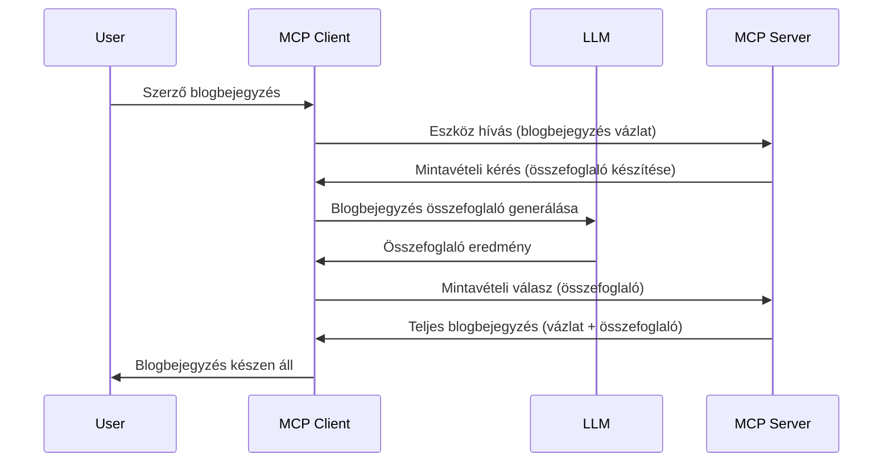

> [!WARNING]
> A Sampling elavult az MCP `2026-07-28` verziójában. Ez a lecke megmaradt
> örökölt megvalósításokhoz. Az új szerverek közvetlenül egy LLM
> szolgáltató API-jával kell integrálódjanak.

# Sampling – a funkciók delegálása a kliensnek

> A Sampling továbbra is része a `2026-07-28` specifikációnak a kompatibilitás érdekében, és
> elérhető eltávolításra a 2027. július 28-a utáni első felülvizsgálat során.
> A leckében szereplő példák használhatnak `2025-11-25` SDK API-kat.
> Lásd [Mi változott az MCP-ben: a 2026-07-28 specifikáció](../../01-CoreConcepts/mcp-2026-07-28.md).

Örökölt megvalósításokban a Sampling lehetővé teszi, hogy egy MCP szerver LLM segítséget kérjen,
amelyet a kliens kezel. Új megvalósítások esetén közvetlenül a választott LLM szolgáltatót
kell meghívni.

Nézzünk néhány használati esetet és hogy hogyan építhető meg egy sampling-et használó megoldás.

## Áttekintés

Ebben a leckében arra koncentrálunk, mikor és hol használjuk a Samplinget, és hogyan konfiguráljuk.

## Tanulási célok

Ebben a fejezetben:

- Elmagyarázzuk, mi a Sampling és mikor érdemes használni.
- Megmutatjuk, hogyan konfiguráljuk a Samplinget MCP-ben.
- Bemutatunk példákat a Sampling használatára.

## Mi az a Sampling és miért használjuk?

A Sampling egy fejlett funkció, ami a következő módon működik:



### Sampling kérés

Rendben, most, hogy egy átfogó képet kaptunk egy hiteles helyzetről, beszéljünk a szerver által a kliensnek küldött sampling kérésről. Egy ilyen kérés JSON-RPC formátumban így nézhet ki:

```json
{
  "jsonrpc": "2.0",
  "id": 1,
  "method": "sampling/createMessage",
  "params": {
    "messages": [
      {
        "role": "user",
        "content": {
          "type": "text",
          "text": "Create a blog post summary of the following blog post: <BLOG POST>"
        }
      }
    ],
    "modelPreferences": {
      "hints": [
        {
          "name": "claude-3-sonnet"
        }
      ],
      "intelligencePriority": 0.8,
      "speedPriority": 0.5
    },
    "systemPrompt": "You are a helpful assistant.",
    "maxTokens": 100
  }
}
```

Érdemes kiemelni néhány dolgot:

- A Prompt, a content -> text alatt, az az utasítás az LLM számára, hogy összegezze a blogbejegyzés tartalmát.

- **modelPreferences**: Ez a rész tényleg csak egy preferencia, egy ajánlás, milyen konfigurációt használjunk az LLM-mel. A felhasználó eldöntheti, hogy követi-e ezeket az ajánlásokat vagy módosítja őket. Ebben az esetben ajánlások vannak a használandó modellre, illetve a sebesség és intelligencia prioritására.
- **systemPrompt**: ez a normál rendszer prompt, amely személyiséget ad az LLM-nek és útmutató instrukciókat tartalmaz.
- **maxTokens**: ez egy másik tulajdonság, ami megadja, hány token használata ajánlott ehhez a feladathoz.

### Sampling válasz

Ez a válasz az, amit az MCP kliens végül visszaküld az MCP szervernek, és a kliens LLM hívásának eredménye, megvárja azt, majd összeállítja ezt az üzenetet. Úgy nézhet ki JSON-RPC formátumban:

```json
{
  "jsonrpc": "2.0",
  "id": 1,
  "result": {
    "role": "assistant",
    "content": {
      "type": "text",
      "text": "Here's your abstract <ABSTRACT>"
    },
    "model": "gpt-5",
    "stopReason": "endTurn"
  }
}
```

Nézd meg, hogy a válasz a blogbejegyzés összefoglalója, ahogy kértük. Az is figyelemre méltó, hogy a használt `model` nem az, amit kértünk, hanem a "gpt-5" a "claude-3-sonnet" helyett. Ez szemlélteti, hogy a felhasználó megváltoztathatja, mit szeretne használni, és hogy a sampling kérés csak egy ajánlás.

Oké, most, hogy értjük a fő folyamatot és azt a hasznos feladatot, amire érdemes használni: "blogbejegyzés készítés + összefoglaló", nézzük, mit kell tennünk, hogy működjön.

### Üzenettípusok

A Sampling üzenetek nem csak szövegre korlátozódnak, hanem képeket és hangot is küldhetsz. Így néz ki a JSON-RPC eltérése:

**Szöveg**

```json
{
  "type": "text",
  "text": "The message content"
}
```

**Kép tartalom**

```json
{
  "type": "image",
  "data": "base64-encoded-image-data",
  "mimeType": "image/jpeg"
}
```

**Hang tartalom**

```json
{
  "type": "audio",
  "data": "base64-encoded-audio-data",
  "mimeType": "audio/wav"
}
```

> MEGJEGYZÉS: A jelenlegi státusz és migrációs iránymutatás miatt lásd a
> [elavult Sampling dokumentációt](https://modelcontextprotocol.io/specification/2026-07-28/client/sampling).

## Hogyan konfiguráljuk a Samplinget a kliensben

> Megjegyzés: ha csak szervert építesz, itt nincs sok teendőd.

A kliensben a következő funkciót kell így megadni:

```json
{
  "capabilities": {
    "sampling": {}
  }
}
```

Ezt azután a kiválasztott kliens fogja felvenni, amikor inicializálódik a szerverrel.

## Példa Sampling működésre – Blogbejegyzés készítése

Kódoljunk együtt egy sampling szervert, a következőt kell megvalósítanunk:

1. Hozz létre egy eszközt a szerveren.
1. Az eszköz készítsen sampling kérést.
1. Az eszköz várja meg a kliens sampling kérésére érkező választ.
1. Ezután az eszköz eredményt produkáljon.

Nézzük a kódot lépésről lépésre:

### -1- Hozzuk létre az eszközt

**python**

```python
@mcp.tool()
async def create_blog(title: str, content: str, ctx: Context[ServerSession, None]) -> str:
    """Create a blog post and generate a summary"""

```

### -2- Készíts sampling kérést

Egészítsd ki az eszközt a következő kóddal:

**python**

```python
post = BlogPost(
        id=len(posts) + 1,
        title=title,
        content=content,
        abstract=""
    )

prompt = f"Create an abstract of the following blog post: title: {title} and draft: {content} "

result = await ctx.session.create_message(
        messages=[
            SamplingMessage(
                role="user",
                content=TextContent(type="text", text=prompt),
            )
        ],
        max_tokens=100,
)

```

### -3- Várjunk a válaszra és adjuk vissza

**python**

```python
post.abstract = result.content.text

posts.append(post)

# adja vissza a teljes terméket
return json.dumps({
    "id": post.title,
    "abstract": post.abstract
})
```

### -4- Teljes kód

**python**

```python
from starlette.applications import Starlette
from starlette.routing import Mount, Host

from mcp.server.fastmcp import Context, FastMCP

from mcp.server.session import ServerSession
from mcp.types import SamplingMessage, TextContent

import json


from uuid import uuid4
from typing import List
from pydantic import BaseModel


mcp = FastMCP("Blog post generator")

# app = FastAPI()

posts = []

class BlogPost(BaseModel):
    id: int
    title: str
    content: str
    abstract: str

posts: List[BlogPost] = []

@mcp.tool()
async def create_blog(title: str, content: str, ctx: Context[ServerSession, None]) -> str:
    """Create a blog post and generate a summary"""

    post = BlogPost(
        id=len(posts) + 1,
        title=title,
        content=content,
        abstract=""
    )

    prompt = f"Create an abstract of the following blog post: title: {title} and draft: {content} "

    result = await ctx.session.create_message(
        messages=[
            SamplingMessage(
                role="user",
                content=TextContent(type="text", text=prompt),
            )
        ],
        max_tokens=100,
    )

    post.abstract = result.content.text

    posts.append(post)

    # adja vissza a teljes blogbejegyzést
    return json.dumps({
        "id": post.title,
        "abstract": post.abstract
    })

if __name__ == "__main__":
    print("Starting server...")
    # mcp.futtatás()
    mcp.run(transport="streamable-http")

# futtassa az alkalmazást a következővel: python server.py
```

### -5- Tesztelés Visual Studio Code-ban

A Visual Studio Code-ban a teszteléshez tedd a következőt:

1. Indítsd el a szervert a terminálban
1. Add hozzá a *mcp.json*-hoz (és ellenőrizd, hogy elindult), valami ilyesmi módon:

   ```json
   "servers": {
      "blog-server": {
        "type": "http",
        "url": "http://localhost:8000/mcp"
      }
   }
   ```

1. Írj egy promptot:

   ```text
   create a blog post named "Where Python comes from", the content is "Python is actually named after Monty Python Flying Circus"
   ```

1. Engedélyezd a samplinget. Amikor először teszteled, egy plusz párbeszédablak fog megjelenni, amit el kell fogadnod, majd megjelenik a normál dialógus, ami az eszköz futtatását kéri.

1. Vizsgáld meg az eredményeket. Láthatod az eredményeket szépen megjelenítve a GitHub Copilot Chat-ben, de a nyers JSON választ is meg tudod nézni.

**Bónusz**. A Visual Studio Code eszközei jól támogatják a samplinget. A telepített szerver Sampling hozzáférését így konfigurálhatod:

1. Navigálj a bővítmény szekcióba.
1. Válaszd ki a fogaskerék ikont a telepített szerverednél a "MCP SERVERS - INSTALLED" részben.
1. Válaszd a "Configure Model Access" opciót, itt megadhatod, mely modelleket használhatja a GitHub Copilot sampling végzéshez. Itt láthatod az utóbbi sampling kérelmeket is a "Show Sampling requests" kiválasztásával.

## Feladat

Ebben a feladatban egy kicsit eltérő Samplinget építesz, nevezetesen egy sampling integrációt, amely termékleírás generálást támogat. Íme a szcenáriód:

**Szcenárió**: Egy e-kereskedelmi back office munkatárs segítséget kér, mert túl sok idő termékleírásokat generálni. Ezért építesz egy megoldást, ahol meghívhatsz egy "create_product" eszközt "title" és "keywords" argumentumokkal, ami egy teljes terméket állít elő, beleértve egy "description" mezőt, amelyet a kliens LLM-je tölt ki.

TIP: Használd, amit korábban tanultál, hogy megépítsd ezt a szervert és az eszközét sampling kérés használatával.

## Megoldás

[Megoldás](./solution/README.md)

## Főbb tanulságok

A Sampling egy erőteljes funkció, amely lehetővé teszi, hogy a szerver delegálja a feladatokat a kliensnek, ha LLM segítségére van szüksége.

## Mi következik

- [4. fejezet – Gyakorlati megvalósítás](../../04-PracticalImplementation/README.md)

---

<!-- CO-OP TRANSLATOR DISCLAIMER START -->
**Jogi nyilatkozat**:
Ez a dokumentum az AI fordítási szolgáltatás, a [Co-op Translator](https://github.com/Azure/co-op-translator) segítségével készült. Bár az pontosságra törekszünk, kérjük, vegye figyelembe, hogy az automatikus fordítások hibákat vagy pontatlanságokat tartalmazhatnak. Az eredeti dokumentum az anyanyelvén tekintendő hiteles forrásnak. Fontos információk esetén professzionális emberi fordítást javasolunk. Nem vállalunk felelősséget semmilyen félreértésért vagy téves értelmezésért, amely ebből a fordításból ered.
<!-- CO-OP TRANSLATOR DISCLAIMER END -->