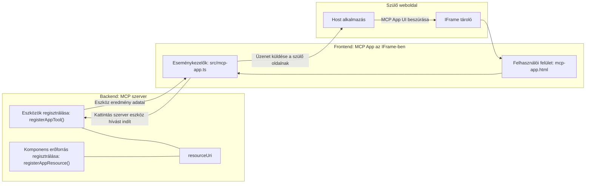
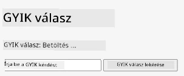
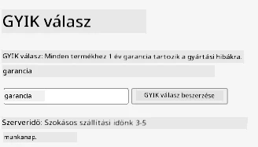
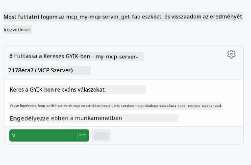
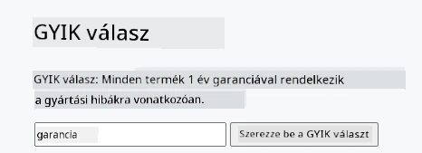

# MCP Apps

A MCP Apps egy új paradigma az MCP-ben. Az ötlet az, hogy nem csak adatokat küldesz vissza egy eszközhívás eredményeként, hanem információkat is arról, hogy ezzel az információval hogyan kell interakcióba lépni. Ez azt jelenti, hogy az eszköz eredményei most már tartalmazhatnak UI-információkat is. Miért is akarnánk ezt? Nos, gondolj arra, hogyan csinálod ma a dolgokat. Valószínűleg az MCP Server eredményeit valamilyen frontend mögé helyezed, amit neked kell megírni és karbantartani. Néha ez pont az, amit szeretnél, de néha nagyszerű lenne, ha csak behozhatnál egy önálló információs szeletet, amely mindent tartalmaz adatoktól a felhasználói felületig.

## Áttekintés

Ez a lecke gyakorlati útmutatást ad a MCP Apps-ról, arról, hogyan kezdj hozzá, és hogyan integráld meglévő webalkalmazásaidba. A MCP Apps egy nagyon új kiegészítés az MCP Standard-hoz.

## Tanulási célok

A lecke végére képes leszel:

- Elmagyarázni, mik azok a MCP Apps.
- Tudni, mikor érdemes MCP Apps-t használni.
- Saját MCP Apps-et építeni és integrálni.

## MCP Apps - hogyan működik

A MCP Apps ötlete, hogy egy választ adj, ami lényegében egy komponens, amit meg kell jeleníteni. Egy ilyen komponens tartalmazhat vizuális elemeket és interaktivitást is, például gombkattintásokat, felhasználói beviteleket és még sok mást. Kezdjük a szerver oldallal és MCP Serverünkkel. Egy MCP App komponens létrehozásához szükség van egy eszközre, de egyben az alkalmazás erőforrásra is. Ezeket a két részt egy resourceUri kapcsolja össze.

Íme egy példa. Próbáljuk meg szemléltetni, mi vesz részt és mely részek mit csinálnak:

```text
server.ts -- responsible for registering tools and the component as a UI component
src/
  mcp-app.ts -- wiring up event handlers
mcp-app.html -- the user interface
```

Ez a vizuál a komponens létrehozásának architektúráját és logikáját mutatja.


Próbáljuk meg leírni a következőként a backend és frontend felelősségeket.

### A backend

Két dolgot kell itt megvalósítani:

- Regisztrálni az eszközöket, amikkel interakcióba akarunk lépni.
- Meghatározni a komponenst.

**Az eszköz regisztrálása**

```typescript
registerAppTool(
    server,
    "get-time",
    {
      title: "Get Time",
      description: "Returns the current server time.",
      inputSchema: {},
      _meta: { ui: { resourceUri } }, // Összekapcsolja ezt az eszközt a felhasználói felület erőforrásával
    },
    async () => {
      const time = new Date().toISOString();
      return { content: [{ type: "text", text: time }] };
    },
  );

```

A fenti kód a viselkedést írja le, ahol egy `get-time` névre hallgató eszközt tesz elérhetővé. Nem vesz fel bemenetet, de a jelenlegi időt adja vissza. Lehetőségünk van `inputSchema` megadására olyan eszközöknél, ahol szükséges a felhasználói adatbevitel elfogadása.

**A komponens regisztrálása**

Ugyanebben a fájlban regisztrálnunk kell a komponenst is:

```typescript
const resourceUri = "ui://get-time/mcp-app.html";

// Regisztrálja az erőforrást, amely visszaadja a UI-hoz csomagolt HTML/JavaScript-et.
registerAppResource(
  server,
  resourceUri,
  resourceUri,
  { mimeType: RESOURCE_MIME_TYPE },
  async () => {
    const html = await fs.readFile(path.join(DIST_DIR, "mcp-app.html"), "utf-8");

    return {
    contents: [
        { uri: resourceUri, mimeType: RESOURCE_MIME_TYPE, text: html },
    ],
    };
  },
);
```

Figyeld meg, hogyan említjük a `resourceUri`-t, hogy összekössük a komponenst az eszközeivel. Érdekes még a callback, ahol betöltjük az UI fájlt, és visszaadjuk a komponenst.

### A komponens frontendje

Ahogy a backendnél, itt is két rész van:

- Egy frontend tiszta HTML-ben írva.
- Kód, ami kezeli az eseményeket és azok hatása, például eszközök hívása vagy üzenetküldés a szülő ablaknak.

**Felhasználói felület**

Nézzük meg a felhasználói felületet.

```html
<!-- mcp-app.html -->
<!DOCTYPE html>
<html lang="en">
  <head>
    <meta charset="UTF-8" />
    <title>Get Time App</title>
  </head>
  <body>
    <p>
      <strong>Server Time:</strong> <code id="server-time">Loading...</code>
    </p>
    <button id="get-time-btn">Get Server Time</button>
    <script type="module" src="/src/mcp-app.ts"></script>
  </body>
</html>
```

**Események összekötése**

Az utolsó rész az események összekötése. Ez azt jelenti, hogy meghatározzuk, mely részeknek az UI-ban kell eseménykezelőnek lenniük, és mit kell tenni, ha esemény történik:

```typescript
// mcp-app.ts

import { App } from "@modelcontextprotocol/ext-apps";

// Elem hivatkozások lekérése
const serverTimeEl = document.getElementById("server-time")!;
const getTimeBtn = document.getElementById("get-time-btn")!;

// App példány létrehozása
const app = new App({ name: "Get Time App", version: "1.0.0" });

// Eszköz eredmények kezelése a szerverről. Állítsd be az `app.connect()` meghívása
// előtt, hogy elkerüld az első eszköz eredményének elvesztését.
app.ontoolresult = (result) => {
  const time = result.content?.find((c) => c.type === "text")?.text;
  serverTimeEl.textContent = time ?? "[ERROR]";
};

// Gomb kattintás bekötése
getTimeBtn.addEventListener("click", async () => {
  // Az `app.callServerTool()` lehetővé teszi, hogy a felhasználói felület friss adatokat kérjen a szervertől
  const result = await app.callServerTool({ name: "get-time", arguments: {} });
  const time = result.content?.find((c) => c.type === "text")?.text;
  serverTimeEl.textContent = time ?? "[ERROR]";
});

// Kapcsolódás a hoszthoz
app.connect();
```

Ahogy a fenti kódból látszik, ez az elem a DOM elemek eseményhez kötésére szolgáló szokásos kód. Érdemes kiemelni a `callServerTool` hívást, ami a backenden egy eszközt hív meg.

## Felhasználói bevitel kezelése

Eddig láttunk egy komponenst, aminek van egy gombja, ami kattintásra eszközt hív meg. Nézzük meg, tudunk-e több UI elemet, például egy bemeneti mezőt hozzáadni, és tudunk-e argumentumokat küldeni eszköznek. Készítsünk egy FAQ funkciót. Így kell működnie:

- Legyen egy gomb és egy bemeneti elem, ahol a felhasználó beírhat egy kulcsszót kereséshez például "Shipping" (Szállítás). Ez egy olyan backendes eszközt hív meg, amely a FAQ adatban keres.
- Egy eszköz, ami támogatja a fent említett FAQ keresést.

Először adjuk hozzá a szükséges támogatást a backendhez:

```typescript
const faq: { [key: string]: string } = {
    "shipping": "Our standard shipping time is 3-5 business days.",
    "return policy": "You can return any item within 30 days of purchase.",
    "warranty": "All products come with a 1-year warranty covering manufacturing defects.",
  }

registerAppTool(
    server,
    "get-faq",
    {
      title: "Search FAQ",
      description: "Searches the FAQ for relevant answers.",
      inputSchema: zod.object({
        query: zod.string().default("shipping"),
      }),
      _meta: { ui: { resourceUri: faqResourceUri } }, // Kapcsolja össze ezt az eszközt a felhasználói felület erőforrásával
    },
    async ({ query }) => {
      const answer: string = faq[query.toLowerCase()] || "Sorry, I don't have an answer for that.";
      return { content: [{ type: "text", text: answer }] };
    },
  );
```

Amit itt látunk, az a `inputSchema` feltöltése egy `zod` sémával így:

```typescript
inputSchema: zod.object({
  query: zod.string().default("shipping"),
})
```

A fenti sémában megjelöljük, hogy egy `query` nevű bemeneti paraméterünk van, ami opcionális, és alapértelmezett értéke "shipping".

Rendben, nézzük meg a *mcp-app.html* fájlt, hogy milyen UI elemeket kell létrehoznunk ehhez:

```html
<div class="faq">
    <h1>FAQ response</h1>
    <p>FAQ Response: <code id="faq-response">Loading...</code></p>
    <input type="text" id="faq-query" placeholder="Enter FAQ query" />
    <button id="get-faq-btn">Get FAQ Response</button>
  </div>
```

Kiváló, most van egy bemeneti elemünk és gombunk. Menjünk a *mcp-app.ts*-hez, hogy összekössük az eseményeket:

```typescript
const getFaqBtn = document.getElementById("get-faq-btn")!;
const faqQueryInput = document.getElementById("faq-query") as HTMLInputElement;

getFaqBtn.addEventListener("click", async () => {
  const query = faqQueryInput.value;
  const result = await app.callServerTool({ name: "get-faq", arguments: { query } });
  const faq = result.content?.find((c) => c.type === "text")?.text;
  faqResponseEl.textContent = faq ?? "[ERROR]";
});
```

A fenti kódban:

- Referenciákat hozunk létre az érdekes UI elemekhez.
- Gombkattintást kezelünk, hogy a bemeneti elem értékét kiolvassuk, és meghívjuk az `app.callServerTool()`-t `name` és `arguments` paraméterekkel, ahol az utóbbi a `query` értékát adja tovább.

Ami valójában történik, amikor a `callServerTool`-t hívod, hogy az üzenetet küld a szülőablaknak, és az meghívja az MCP Servert.

### Próbáld ki

Ha ezt kipróbáljuk, a következőket kell látnunk:



és itt látható, amikor olyan bemenettel próbáljuk, mint "warranty" (garancia)



Ennek a kódnak a futtatásához látogass el a [Code section](./code/README.md) oldalra.

## Tesztelés Visual Studio Code-ban

A Visual Studio Code remek támogatást nyújt MCP Apps-hez, és valószínűleg ez az egyik legkönnyebb módja az MCP Apps tesztelésének. A Visual Studio Code használatához adj hozzá egy szerver bejegyzést a *mcp.json* fájlba így:

```json
"my-mcp-server-7178eca7": {
    "url": "http://localhost:3001/mcp",
    "type": "http"
  }
```

Ezután indítsd el a szervert, és képes leszel kommunikálni az MVP App-pel a Chat ablakon keresztül, feltéve, hogy telepítve van a GitHub Copilot.

Ezt például egy prompt beküldésével indíthatod, például "#get-faq":



És pont úgy, ahogy böngészőben futattad, ugyanígy jeleníti meg:



## Feladat

Készíts egy kő-papír-olló játékot. Ennek a következőkből kell állnia:

UI:

- egy legördülő lista választási lehetőségekkel
- egy gomb a választás elküldésére
- egy címke, ami mutatja, ki mit választott és ki nyert

Szerver:

- legyen egy kő-papír-olló eszköz, ami fogadja a "choice" bemenetet. Emellett kell generálnia a gép választását és meg kell határoznia a győztest.

## Megoldás

[Solution](./assignment/README.md)

## Összefoglalás

Megismertük ezt az új MCP Apps paradigmát. Ez egy új szemléletmód, amely lehetővé teszi, hogy az MCP Serverek ne csak az adatokról, hanem arról is véleményt alkossanak, hogy az adatokat hogyan kell bemutatni.

Továbbá megtanultuk, hogy ezek az MCP Apps iframe-be vannak beágyazva, és hogy az MCP Serverekkel való kommunikáció üzenetet küld a szülő webalkalmazásnak. Több könyvtár is létezik sima JavaScript-hez, React-hez és más technológiákhoz, amelyek megkönnyítik ezt a kommunikációt.

## Fontos tanulságok

Amit megtanultál:

- A MCP Apps egy új szabvány, ami hasznos lehet, amikor egyszerre akarsz adatokat és UI funkciókat szállítani.
- Ezek az alkalmazások biztonsági okokból iframe-ben futnak.

## Mi következik

- [Chapter 4](../../04-PracticalImplementation/README.md)

---

<!-- CO-OP TRANSLATOR DISCLAIMER START -->
**Kizáró nyilatkozat**:  
Ez a dokumentum a [Co-op Translator](https://github.com/Azure/co-op-translator) AI fordítószolgáltatás segítségével készült. Bár a pontosságra törekszünk, kérjük, vegye figyelembe, hogy az automatikus fordítások tartalmazhatnak hibákat vagy pontatlanságokat. Az eredeti dokumentum anyanyelvű változata tekintendő hivatalos forrásnak. Fontos információk esetén professzionális emberi fordítást javaslunk. Nem vállalunk felelősséget az ebből az automatikus fordításból eredő félreértésekért vagy téves értelmezésekért.
<!-- CO-OP TRANSLATOR DISCLAIMER END -->