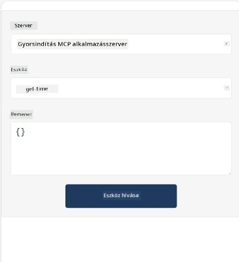
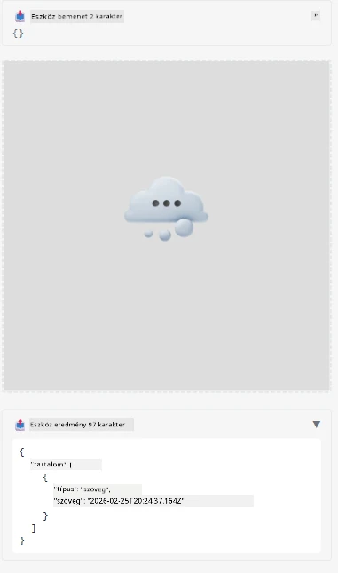

Itt egy példa az MCP App használatára

## Telepítés

1. Navigálj az *mcp-app* mappába
1. Futtasd az `npm install` parancsot, ezzel telepíted a frontend és backend függőségeket

Ellenőrizd, hogy a backend sikeresen fordul az alábbi paranccsal:

```sh
npx tsc --noEmit
```

Ha minden rendben van, nem lesz kimenet.

## Backend futtatása

> Ez egy kicsit több munkát igényel Windows gépen, mivel az MCP Apps megoldás a `concurrently` könyvtárat használja, aminek helyettesítését meg kell találni. Itt van a szóban forgó sor a *package.json*-ban az MCP App esetében:

    ```json
    "start": "concurrently \"cross-env NODE_ENV=development INPUT=mcp-app.html vite build --watch\" \"tsx watch main.ts\""
    ```

Ennek az alkalmazásnak két része van, egy backend és egy host rész.

Indítsd el a backendet az alábbi paranccsal:

```sh
npm start
```

Ennek el kell indítania a backendet a `http://localhost:3001/mcp` címen.

> Megjegyzés: ha Codespace-ban vagy, be kell állítanod a port láthatóságát nyilvánosra. Ellenőrizd, hogy eléred-e az végpontot böngészőből a https://<Codespace neve>.app.github.dev/mcp címen

## Választás -1- Az app tesztelése Visual Studio Code-ban

A megoldás Visual Studio Code-ban való teszteléséhez tedd a következőt:

- Adj hozzá egy szerver bejegyzést a `mcp.json`-hez így:

    ```json
    {
        "servers": {
            "my-mcp-server-7178eca7": {
                "url": "http://localhost:3001/mcp",
                "type": "http"
            }
        },
        "inputs": []
    }
    ```

1. Kattints az *mcp.json* "start" gombjára
1. Győződj meg róla, hogy nyitva van egy chat ablak és írd be, hogy `get-faq`, ennek eredménye így fog kinézni:

    

## Választás -2- Az app tesztelése host segítségével

A <https://github.com/modelcontextprotocol/ext-apps> repó több különböző hostot tartalmaz, amit használhatsz MVP Appjaid tesztelésére.

Itt két különböző lehetőséget mutatunk be:

### Helyi gép

- Navigálj az *ext-apps* mappába miután klónoztad a repót.

- Telepítsd a függőségeket

   ```sh
   npm install
   ```

- Egy külön terminál ablakban navigálj az *ext-apps/examples/basic-host* mappába

    > Ha Codespace-ben vagy, akkor a serve.ts 27. sorában cseréld le a http://localhost:3001/mcp címet a Codespace URL-edre a backendhez, például https://psychic-xylophone-657rpjgvxpc5g64-3001.app.github.dev/mcp

- Indítsd el a hostot:

    ```sh
    npm start
    ```

    Ez összekapcsolja a hostot a back-enddel, és így kell kinéznie az app futtatásának:

    

### Codespace

Néhány plusz lépés kell, hogy egy Codespace környezet működjön. Ha hostot akarsz használni Codespace-en keresztül:

- Nézd meg az *ext-apps* mappát, és navigálj a *examples/basic-host* alá.
- Futtasd az `npm install`-t a függőségek telepítéséhez
- Futtasd az `npm start`-ot a host indításához.

## Teszteld az alkalmazást

Próbáld ki az alkalmazást az alábbi módon:

- Válaszd az "Call Tool" gombot és az eredmények a következők lesznek:

    

Nagyszerű, minden működik.

---

<!-- CO-OP TRANSLATOR DISCLAIMER START -->
**Kiadási nyilatkozat**:
Ezt a dokumentumot az AI fordító szolgáltatás [Co-op Translator](https://github.com/Azure/co-op-translator) segítségével fordítottuk le. Bár igyekszünk pontos fordítást biztosítani, kérjük, vegye figyelembe, hogy az automatikus fordítások hibákat vagy pontatlanságokat tartalmazhatnak. Az eredeti dokumentum anyanyelvű változata tekintendő hiteles forrásnak. Fontos információk esetén javasolt professzionális emberi fordítást igénybe venni. Nem vállalunk felelősséget a fordítás használatából eredő félreértésekért vagy téves értelmezésekért.
<!-- CO-OP TRANSLATOR DISCLAIMER END -->