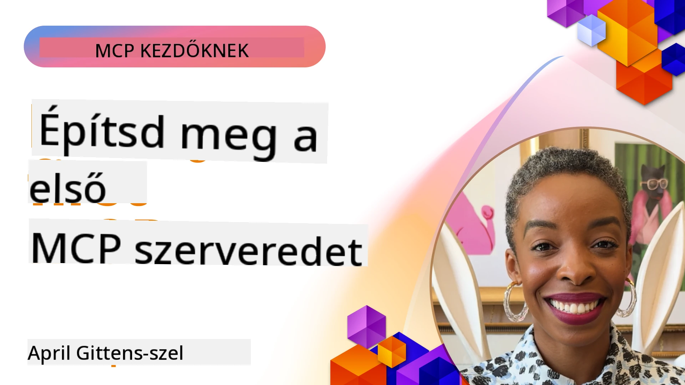

## Első lépések  

_(Kattints a fenti képre a leckéhez készült videó megtekintéséhez)_

Ez a rész több leckéből áll:

- **1 Az első szervered**, ebben az első leckében megtanulod, hogyan készítsd el az első szervered, és hogyan vizsgáld meg az inspector eszközzel, ami értékes módja a szerver tesztelésének és hibakeresésének, [a leckéhez](01-first-server/README.md)

- **2 Ügyfél**, ebben a leckében megtanulod, hogyan írj olyan ügyfelet, ami csatlakozni tud a szerveredhez, [a leckéhez](02-client/README.md)

- **3 Ügyfél LLM-mel**, egy még jobb módja az ügyfél írásának, ha egy LLM-et hozzáadsz, hogy "tárgyalni" tudjon a szervereddel arról, mit tegyen, [a leckéhez](03-llm-client/README.md)

- **4 Egy GitHub Copilot Agent üzemmódú szerver fogyasztása Visual Studio Code-ban**. Itt megnézzük, hogyan futtathatjuk az MCP szerverünket a Visual Studio Code-ból, [a leckéhez](04-vscode/README.md)

- **5 stdio Transzport Szerver** A stdio transzport a javasolt szabványos helyi MCP szerver-ügyfél kommunikációhoz, biztosítva a biztonságos alfolyamat alapú kommunikációt beépített folyamat izolációval [a leckéhez](05-stdio-server/README.md)

- **6 HTTP Streaming MCP-vel (Streamelhető HTTP)**. Ismerd meg a modern HTTP streaming transzportot (az MCP specifikáció szerint a javasolt megoldás távoli MCP szerverekhez [MCP Specification 2025-11-25](https://spec.modelcontextprotocol.io/specification/2025-11-25/basic/transports/#streamable-http)), a haladás értesítéseit, és hogyan valósíts meg skálázható, valós idejű MCP szervereket és ügyfeleket a Streamelhető HTTP segítségével. [a leckéhez](06-http-streaming/README.md)

- **7 Az AI Toolkit használata VSCode-hoz**, hogy fogyaszd és teszteld MCP ügyfeleid és szervereid [a leckéhez](07-aitk/README.md)

- **8 Tesztelés**. Itt különösen arra fókuszálunk, hogyan tesztelhetjük szerverünket és ügyfelünket különböző módokon, [a leckéhez](08-testing/README.md)

- **9 Telepítés**. Ez a fejezet az MCP megoldásaid különböző telepítési módjait tárgyalja, [a leckéhez](09-deployment/README.md)

- **10 Haladó szerverhasználat**. Ez a fejezet a szerver haladó használatát ismerteti, [a leckéhez](./10-advanced/README.md)

- **11 Hitelesítés**. Ebben a fejezetben megtanulhatod, hogyan adj egyszerű hitelesítést, az Alap hitelesítéstől a JWT és RBAC használatáig. Célszerű itt kezdeni, majd továbblépni a 5. fejezet Haladó témáihoz, és további biztonsági szilárdítást végezni a 2. fejezet ajánlásai alapján, [a leckéhez](./11-simple-auth/README.md)

- **12 MCP Hostok**. Konfiguráld és használd a népszerű MCP host klienseket, köztük Claude Desktop, Cursor, Cline, és Windsurf. Ismerd meg a transzport típusokat és a hibakeresést, [a leckéhez](./12-mcp-hosts/README.md)

- **13 MCP Inspector**. Hibakeress és teszteld MCP szervereidet interaktívan az MCP Inspector eszközzel. Tanulj meg hibakereső eszközöket, erőforrásokat és protokoll üzeneteket, [a leckéhez](./13-mcp-inspector/README.md)

- **14 Mintavételezés**. Készíts MCP szervereket, melyek együttműködnek MCP ügyfelekkel LLM-hez kapcsolódó feladatokon. [a leckéhez](./14-sampling/README.md)

- **15 MCP Alkalmazások**. Építs MCP szervereket, amelyek UI utasítással is válaszolnak, [a leckéhez](./15-mcp-apps/README.md)

A Model Context Protocol (MCP) egy nyílt protokoll, amely szabványosítja, hogy az alkalmazások hogyan szolgáltatnak kontextust az LLM-eknek. Gondolj az MCP-re úgy, mint egy USB-C portra az AI alkalmazások számára – szabványosított módot ad arra, hogy AI modelleket különböző adatforrásokhoz és eszközökhöz csatlakoztassunk.

## Tanulási célok

A lecke végére képes leszel:

- MCP fejlesztői környezetek beállítása C#, Java, Python, TypeScript és JavaScript nyelveken
- Alap MCP szerverek építése egyedi funkciókkal (erőforrások, promptok és eszközök)
- Host alkalmazások létrehozása, amelyek csatlakoznak MCP szerverekhez
- MCP megvalósítások tesztelése és hibakeresése
- A gyakori beállítási problémák és megoldásaik ismerete
- MCP megvalósítások csatlakoztatása népszerű LLM szolgáltatásokhoz

## Az MCP környezeted beállítása

Mielőtt nekilátsz az MCP használatának, fontos előkészíteni a fejlesztői környezetedet, és megérteni az alapvető munkafolyamatot. Ez a rész végigvezet az első beállítási lépéseken, hogy zökkenőmentesen indulj MCP-vel.

### Előfeltételek

Mielőtt belevágnál az MCP fejlesztésbe, győződj meg róla, hogy rendelkezel:

- **Fejlesztői környezet**: az általad választott nyelvhez (C#, Java, Python, TypeScript vagy JavaScript)
- **IDE/szerkesztő**: Visual Studio, Visual Studio Code, IntelliJ, Eclipse, PyCharm, vagy bármilyen modern kódszerkesztő
- **Csomagkezelők**: NuGet, Maven/Gradle, pip vagy npm/yarn
- **API kulcsok**: bármely AI szolgáltatáshoz, amelyeket használni tervezel a host alkalmazásokban

### Hivatalos SDK-k

A következő fejezetekben olyan megoldásokat látsz majd, amelyek Python, TypeScript, Java és .NET használatával készültek. Itt vannak az összes hivatalosan támogatott SDK-k.

Az MCP hivatalos SDK-kat biztosít több nyelvhez (összhangban a [MCP Specification 2025-11-25](https://spec.modelcontextprotocol.io/specification/2025-11-25/) dokumentummal):
- [C# SDK](https://github.com/modelcontextprotocol/csharp-sdk) - Microsoft-szal együttműködésben karbantartva
- [Java SDK](https://github.com/modelcontextprotocol/java-sdk) - Spring AI-vel együttműködésben karbantartva
- [TypeScript SDK](https://github.com/modelcontextprotocol/typescript-sdk) - A hivatalos TypeScript implementáció
- [Python SDK](https://github.com/modelcontextprotocol/python-sdk) - A hivatalos Python implementáció (FastMCP)
- [Kotlin SDK](https://github.com/modelcontextprotocol/kotlin-sdk) - A hivatalos Kotlin implementáció
- [Swift SDK](https://github.com/modelcontextprotocol/swift-sdk) - Loopwork AI-vel együttműködésben karbantartva
- [Rust SDK](https://github.com/modelcontextprotocol/rust-sdk) - A hivatalos Rust implementáció
- [Go SDK](https://github.com/modelcontextprotocol/go-sdk) - A hivatalos Go implementáció

## Főbb tanulságok

- Az MCP fejlesztői környezet beállítása egyszerű nyelvspecifikus SDK-k segítségével
- Az MCP szerverek építése során eszközöket kell létrehozni és regisztrálni jól definiált sémákkal
- Az MCP ügyfelek kapcsolódnak a szerverekhez és modellekhez a bővített képességek érdekében
- A tesztelés és hibakeresés elengedhetetlen a megbízható MCP megvalósításokhoz
- A telepítési lehetőségek helyi fejlesztéstől felhő alapú megoldásokig terjednek

## Gyakorlás

Van egy mintakészletünk, amely kiegészíti az összes fejezetben látott gyakorlatokat. Ezen felül minden fejezetnek megvannak a saját gyakorlatai és feladatai.

- [Java Kalkulátor](./samples/java/calculator/README.md)
- [.Net Kalkulátor](../../../03-GettingStarted/samples/csharp)
- [JavaScript Kalkulátor](./samples/javascript/README.md)
- [TypeScript Kalkulátor](./samples/typescript/README.md)
- [Python Kalkulátor](../../../03-GettingStarted/samples/python)

## További források

- [Agentek építése a Model Context Protocol segítségével Azure-on](https://learn.microsoft.com/azure/developer/ai/intro-agents-mcp)
- [Távoli MCP Azure Container Apps használatával (Node.js/TypeScript/JavaScript)](https://learn.microsoft.com/samples/azure-samples/mcp-container-ts/mcp-container-ts/)
- [.NET OpenAI MCP Agent](https://learn.microsoft.com/samples/azure-samples/openai-mcp-agent-dotnet/openai-mcp-agent-dotnet/)

## Mi következik

Kezdd az első leckével: [Az első MCP szervered létrehozása](01-first-server/README.md)

Miután befejezted ezt a modult, folytasd: [4. modul: Gyakorlati megvalósítás](../04-PracticalImplementation/README.md)

---

<!-- CO-OP TRANSLATOR DISCLAIMER START -->
**Jogi nyilatkozat**:
Ez a dokumentum az AI fordító szolgáltatás [Co-op Translator](https://github.com/Azure/co-op-translator) segítségével készült. Bár pontos fordításra törekszünk, kérjük, vegye figyelembe, hogy az automatikus fordítások hibákat vagy pontatlanságokat tartalmazhatnak. Az eredeti dokumentum a saját nyelvén tekintendő hiteles forrásnak. Kritikus információk esetén javasolt szakmai, emberi fordítás igénybevétele. Nem vállalunk felelősséget az ebből a fordításból eredő félreértésekért vagy téves értelmezésekért.
<!-- CO-OP TRANSLATOR DISCLAIMER END -->