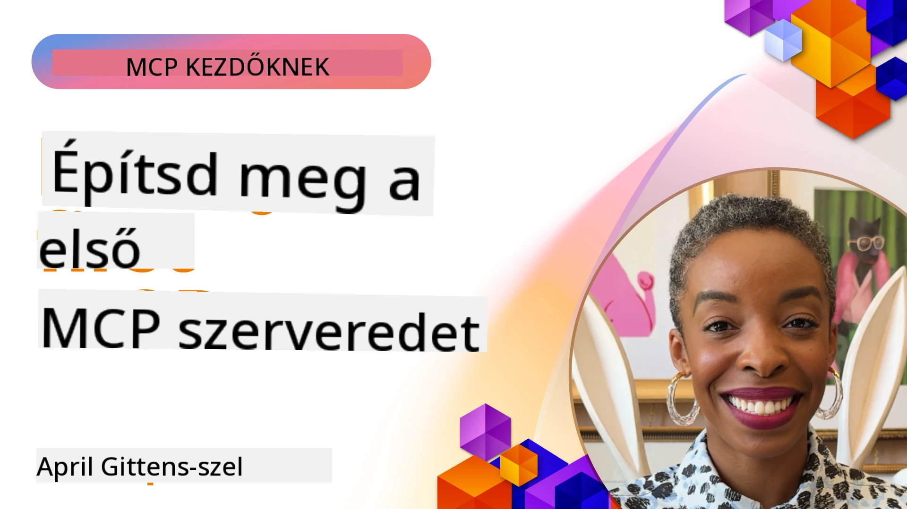

## Kezdés  

_(Kattints a fenti képre az óra anyagának megtekintéséhez)_

Ez a szakasz több leckéből áll:

- **1 Az első szervered**, ebben az első leckében megtanulod, hogyan hozz létre egy első szervert és hogyan vizsgáld meg az inspector eszközzel, amely egy értékes módja a szerver tesztelésének és hibakeresésének, [a leckéhez](01-first-server/README.md)

- **2 Ügyfél**, ebben a leckében megtanulod, hogyan írj olyan ügyfelet, amely csatlakozni tud a szerveredhez, [a leckéhez](02-client/README.md)

- **3 Ügyfél LLM-mel**, még jobb módja az ügyfélírásnak, ha hozzáadsz egy LLM-et, így "tárgyalhat" a szervereddel a teendőkről, [a leckéhez](03-llm-client/README.md)

- **4 Egy szerver GitHub Copilot Agent üzemmódjának használata Visual Studio Code-ban**. Itt azt nézzük meg, hogyan futtathatjuk az MCP szerverünket Visual Studio Code-ból, [a leckéhez](04-vscode/README.md)

- **5 stdio Szállítási szerver** a stdio szállítás a helyi MCP szerver-ügyfél kommunikáció ajánlott szabványa, biztonságos alfolyamat-alapú kommunikációt nyújt beépített folyamat elszigeteltséggel [a leckéhez](05-stdio-server/README.md)

- **6 HTTP Streaming MCP-vel (Streamable HTTP)**. Ismerkedj meg a szabványos
	távoli szállítással az [MCP Specification 2026-07-28](https://modelcontextprotocol.io/specification/2026-07-28/basic/transports/streamable-http) dokumentumban,
	valamint a leckében megtartott régebbi munkamenetalapú megvalósítással.
	[a leckéhez](06-http-streaming/README.md)

- **7 AI Toolkit használata VSCode-ban** az MCP ügyfelek és szerverek fogyasztásához és teszteléséhez [a leckéhez](07-aitk/README.md)

- **8 Tesztelés**. Itt különösen arra koncentrálunk, hogyan lehet különböző módokon tesztelni szerverünket és ügyfelünket, [a leckéhez](08-testing/README.md)

- **9 Telepítés**. Ez a fejezet különféle MCP megoldások telepítési módjait tárgyalja, [a leckéhez](09-deployment/README.md)

- **10 Haladó szerver használat**. Ez a fejezet a haladó szerverhasználatot fedi le, [a leckéhez](./10-advanced/README.md)

- **11 Hitelesítés**. Ez a fejezet egyszerű hitelesítés hozzáadásáról szól, az alapvető hitelesítéstől (Basic Auth) a JWT és RBAC használatáig. Ajánlott itt kezdeni, majd áttérni a haladó témákra az 5. fejezetben és további biztonsági megerősítéseket végrehajtani a 2. fejezet ajánlásai szerint, [a leckéhez](./11-simple-auth/README.md)

- **12 MCP hosztok**. Konfigurálj és használj népszerű MCP hoszt kliens programokat, mint Claude Desktop, Cursor, Cline és Windsurf. Ismerd meg a szállítási típusokat és hibakeresést, [a leckéhez](./12-mcp-hosts/README.md)

- **13 MCP Inspector**. Interaktívan hibakeresheted és tesztelheted MCP szervereidet az MCP Inspector eszközzel. Tanulj meg eszközöket, erőforrásokat és protokollüzeneteket hibakeresni, [a leckéhez](./13-mcp-inspector/README.md)

- **14 Mintavételezés**. Ismerd meg a „legacy” Mintavételezési prímítívet a `2025-11-25` protokollból, és
	tervezz át új megoldásokat a közvetlen LLM szolgáltató integrációra. A mintavételezés
	elavult az MCP `2026-07-28` verziójában. [a leckéhez](./14-sampling/README.md)

- **15 MCP alkalmazások**. Építs MCP szervereket, amelyek UI utasításokat is válaszolnak, [a leckéhez](./15-mcp-apps/README.md)

A Model Context Protocol (MCP) egy nyílt protokoll, amely szabványosítja, hogyan biztosítanak az alkalmazások kontextust LLM-ek számára. Gondolj az MCP-re úgy, mint egy USB-C portra az AI alkalmazások számára – szabványos módot nyújt AI modellek különböző adatforrásokhoz és eszközökhöz való csatlakoztatására.

## Tanulási célok

A lecke végére képes leszel:

- MCP fejlesztési környezetek beállítása C#, Java, Python, TypeScript és JavaScript nyelveken
- Egyszerű MCP szerverek építése és telepítése egyedi funkciókkal (erőforrások, promptok, eszközök)
- Házigazda alkalmazások létrehozása, amelyek MCP szerverekhez kapcsolódnak
- MCP megvalósítások tesztelése és hibakeresése
- A gyakori beállítási kihívások megértése és megoldásaik
- MCP implementációk kapcsolódása népszerű LLM szolgáltatásokhoz

## Az MCP környezeted beállítása

Mielőtt elkezdenél dolgozni az MCP-vel, fontos előkészíteni a fejlesztési környezetedet és megérteni az alapvető munkafolyamatot. Ez a szakasz végigvezet az első beállítási lépéseken, hogy gördülékeny legyen az MCP használatának kezdete.

### Előfeltételek

Mielőtt belevágsz az MCP fejlesztésébe, győződj meg róla, hogy rendelkezel:

- **Fejlesztői környezet**: a választott nyelvhez (C#, Java, Python, TypeScript vagy JavaScript)
- **IDE/Szerkesztő**: Visual Studio, Visual Studio Code, IntelliJ, Eclipse, PyCharm vagy bármely modern kódszerkesztő
- **Csomagkezelők**: NuGet, Maven/Gradle, pip vagy npm/yarn
- **API kulcsok**: bármely AI szolgáltatáshoz, amelyet a házigazda alkalmazásaidban használsz

### Hivatalos SDK-k

A következő fejezetekben Python, TypeScript,
Java és .NET nyelven készített megoldásokat láthatsz. Íme a hivatalos SDK-k.

Az MCP `2026-07-28` SDK támogatás nyelvenként külön-külön jelenik meg.
Mielőtt példát futtatnál, ellenőrizd a csomag verzióját és az SDK kiadási megjegyzéseit
a támogatott protokoll verziókhoz. Lásd a
[hivatalos SDK listát](https://modelcontextprotocol.io/docs/sdk):
- [C# SDK](https://github.com/modelcontextprotocol/csharp-sdk) - Microsoft-szel együttműködésben karbantartva
- [Java SDK](https://github.com/modelcontextprotocol/java-sdk) - Spring AI-val együttműködésben karbantartva
- [TypeScript SDK](https://github.com/modelcontextprotocol/typescript-sdk) - Hivatalos TypeScript implementáció
- [Python SDK](https://github.com/modelcontextprotocol/python-sdk) - Hivatalos Python implementáció (FastMCP)
- [Kotlin SDK](https://github.com/modelcontextprotocol/kotlin-sdk) - Hivatalos Kotlin implementáció
- [Swift SDK](https://github.com/modelcontextprotocol/swift-sdk) - Loopwork AI-val együttműködésben karbantartva
- [Rust SDK](https://github.com/modelcontextprotocol/rust-sdk) - Hivatalos Rust implementáció
- [Go SDK](https://github.com/modelcontextprotocol/go-sdk) - Hivatalos Go implementáció

## Főbb tanulságok

- MCP fejlesztési környezet beállítása egyszerű a nyelvspecifikus SDK-kkal
- MCP szerverek építése eszközök létrehozását és regisztrálását jelenti egyértelmű sémákkal
- MCP ügyfelek csatlakoznak szerverekhez és modellekhez, hogy kibővített lehetőségeket használjanak ki
- A tesztelés és hibakeresés elengedhetetlen a megbízható MCP megvalósításokhoz
- A telepítési lehetőségek a helyi fejlesztéstől a felhő alapú megoldásokig terjednek

## Gyakorlás

Van egy mintakészletünk, amely kiegészíti az ebben a szakaszban található összes fejezet gyakorlatát. Ezenkívül minden fejezetnek megvannak a saját gyakorlatai és feladatai.

- [Java Számológép](./samples/java/calculator/README.md)
- [.NET Számológép](../../../03-GettingStarted/samples/csharp)
- [JavaScript Számológép](./samples/javascript/README.md)
- [TypeScript Számológép](./samples/typescript/README.md)
- [Python Számológép](../../../03-GettingStarted/samples/python)

## További források

- [Build Agents using Model Context Protocol on Azure](https://learn.microsoft.com/azure/developer/ai/intro-agents-mcp)
- [Remote MCP with Azure Container Apps (Node.js/TypeScript/JavaScript)](https://learn.microsoft.com/samples/azure-samples/mcp-container-ts/mcp-container-ts/)
- [.NET OpenAI MCP Agent](https://learn.microsoft.com/samples/azure-samples/openai-mcp-agent-dotnet/openai-mcp-agent-dotnet/)

## Mi a következő lépés

Kezdje az első leckével: [Az első MCP szerver létrehozása](01-first-server/README.md)

Miután befejezte ezt a modult, folytassa a következővel: [4. modul: Gyakorlati megvalósítás](../04-PracticalImplementation/README.md)

---

<!-- CO-OP TRANSLATOR DISCLAIMER START -->
**Jogi nyilatkozat**:
Ez a dokumentum az AI fordítási szolgáltatás, a [Co-op Translator](https://github.com/Azure/co-op-translator) segítségével készült. Bár az pontosságra törekszünk, kérjük, vegye figyelembe, hogy az automatikus fordítások hibákat vagy pontatlanságokat tartalmazhatnak. Az eredeti dokumentum az anyanyelvén tekintendő hiteles forrásnak. Fontos információk esetén professzionális emberi fordítást javasolunk. Nem vállalunk felelősséget semmilyen félreértésért vagy téves értelmezésért, amely ebből a fordításból ered.
<!-- CO-OP TRANSLATOR DISCLAIMER END -->