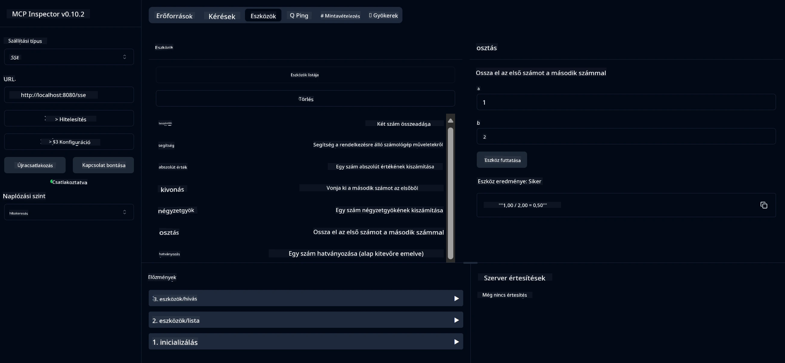

# Alap Számológép MCP Szolgáltatás

> [!NOTE]
> Ez a minta a régi HTTP+SSE szállítást használja, és egy MCP `2025-11-25` kompatibilis SDK-t céloz meg.
> Az új távoli szervereknek a `2026-07-28` Streamable HTTP támogatást kell használniuk.


- SSE (Server-Sent Events) támogatást
- Automatikus eszközregisztráció Spring AI `@Tool` annotációval
- Alap számológép funkciók:
  - Összeadás, kivonás, szorzás, osztás
  - Hatványozás és négyzetgyök
  - Maradékos osztás és abszolút érték
  - Segítség funkció az műveletek leírásához


   - Két szám összeadása
   - Egy szám kivonása egy másikból
   - Két szám szorzása
   - Egy szám osztása egy másikkal (nullával való osztás ellenőrzéssel)


   - Hatványozás (alap hatványra emelése)
   - Négyzetgyök számítás (negatív szám ellenőrzéssel)
   - Maradékos osztás számítása
   - Abszolút érték számítása


   - Beépített segítség funkció, amely megmagyarázza az összes elérhető műveletet


- `subtract(a, b)`: A második szám kivonása az elsőből
- `multiply(a, b)`: Két szám szorzása
- `divide(a, b)`: Az első szám osztása a másodikkal (nulla ellenőrzéssel)
- `power(base, exponent)`: Szám hatványozása
- `squareRoot(number)`: Négyzetgyök számítása (negatív szám ellenőrzéssel)
- `modulus(a, b)`: Osztás utáni maradék számítása
- `absolute(number)`: Abszolút érték számítása
- `help()`: Információ kérés az elérhető műveletekről


   
   A GitHub AI modellek (például phi-4) használatához személyes hozzáférési token szükséges:


   
   b. Kattints az "Új token generálása" → "Új token generálása (klasszikus)" opcióra
   
   c. Adj a tokennek egy leíró nevet
   
   d. Válaszd ki a következő jogosultságokat:
      - `repo` (Teljes hozzáférés privát tárolókhoz)
      - `read:org` (Olvasási jog szervezethez és csapathoz, szervezeti projektek olvasása)
      - `gist` (Gist létrehozása)


      - `user:email` (Felhasználói email címek elérése (csak olvasható))
   
   e. Kattintson a "Generate token" gombra, és másolja ki az új tokenjét
   
   f. Állítsa be környezeti változóként:
      
      Windows esetén:
      ```
      set GITHUB_TOKEN=your-github-token
      ```
      
      macOS/Linux esetén:
      ```bash
      export GITHUB_TOKEN=your-github-token
      ```

   g. Tartós beállításhoz adja hozzá a rendszerbeállításokon keresztül a környezeti változókhoz

2. Adja hozzá a LangChain4j GitHub függőséget a projektjéhez (már benne van a pom.xml-ben):
   ```xml
   <dependency>
       <groupId>dev.langchain4j</groupId>
       <artifactId>langchain4j-github</artifactId>
       <version>${langchain4j.version}</version>
   </dependency>
   ```

3. Győződjön meg róla, hogy a számológép szerver fut a `localhost:8080` címen

### A LangChain4j kliens futtatása

Ez a példa bemutatja:
- Kapcsolódás a számológép MCP szerverhez SSE protokollon keresztül
- LangChain4j használata egy chat bot létrehozásához, amely kihasználja a számológép műveleteit
- Integráció GitHub AI modellekkel (jelenleg a phi-4 modell használata)

A kliens a következő példakérdéseket küldi a működés bemutatására:
1. Két szám összegének kiszámítása
2. Egy szám négyzetgyökének meghatározása
3. Súgó információk lekérése az elérhető számológép műveletekről

Futtassa a példát, és ellenőrizze a konzol kimenetet, hogy lássa, hogyan használja az AI modell a számológép eszközöket a kérdések megválaszolásához.

### GitHub modell konfiguráció

A LangChain4j kliens a GitHub phi-4 modelljét használja a következő beállításokkal:

```java
ChatLanguageModel model = GitHubChatModel.builder()
    .apiKey(System.getenv("GITHUB_TOKEN"))
    .timeout(Duration.ofSeconds(60))
    .modelName("phi-4")
    .logRequests(true)
    .logResponses(true)
    .build();
```

Különböző GitHub modellek használatához egyszerűen változtassa meg a `modelName` paramétert egy másik támogatott modellre (pl. "claude-3-haiku-20240307", "llama-3-70b-8192" stb.).

## Függőségek

A projekthez a következő kulcsfüggőségek szükségesek:

```xml
<!-- For MCP Server -->
<dependency>
    <groupId>org.springframework.ai</groupId>
    <artifactId>spring-ai-starter-mcp-server-webflux</artifactId>
</dependency>

<!-- For LangChain4j integration -->
<dependency>
    <groupId>dev.langchain4j</groupId>
    <artifactId>langchain4j-mcp</artifactId>
    <version>${langchain4j.version}</version>
</dependency>

<!-- For GitHub models support -->
<dependency>
    <groupId>dev.langchain4j</groupId>
    <artifactId>langchain4j-github</artifactId>
    <version>${langchain4j.version}</version>
</dependency>
```

## A projekt építése

Építse meg a projektet Maven segítségével:
```bash
./mvnw clean install -DskipTests
```

## A szerver futtatása

### Java használatával

```bash
java -jar target/calculator-server-0.0.1-SNAPSHOT.jar
```

### MCP Inspector használata

Az MCP Inspector egy hasznos eszköz az MCP szolgáltatásokkal való interakcióhoz. A számológép szolgáltatás használatához:

1. **Telepítse és indítsa el az MCP Inspectort** egy új terminál ablakban:
   ```bash
   npx @modelcontextprotocol/inspector
   ```

2. **Nyissa meg a webes felületet** az alkalmazás által megjelenített URL-re kattintva (általában http://localhost:6274)

3. **Konfigurálja a kapcsolatot**:
   - Állítsa be a szállítás típusát "SSE"-re
   - Állítsa be az URL-t a futó szerver SSE végpontjára: `http://localhost:8080/sse`
   - Kattintson a "Connect" gombra

4. **Használja az eszközöket**:
   - Kattintson a "List Tools"-ra az elérhető számológép műveletek megtekintéséhez
   - Válasszon eszközt és kattintson a "Run Tool"-ra egy művelet végrehajtásához



### Docker használata

A projekt tartalmaz egy Dockerfile-t a konténeres telepítéshez:

1. **Építse meg a Docker képet**:
   ```bash
   docker build -t calculator-mcp-service .
   ```

2. **Futtassa a Docker konténert**:
   ```bash
   docker run -p 8080:8080 calculator-mcp-service
   ```

Ez a következőket teszi:
- Többlépcsős Docker képet épít Maven 3.9.9 és Eclipse Temurin 24 JDK használatával
- Optimalizált konténer képet hoz létre
- A szolgáltatást a 8080-as porton teszi elérhetővé
- Elindítja az MCP számológép szolgáltatást a konténeren belül

A konténer futása után elérheti a szolgáltatást a `http://localhost:8080` címen.

## Hibakeresés

### Gyakori problémák a GitHub tokennel kapcsolatban


1. **Token jogosultsági problémák**: Ha 403 Forbidden hibát kap, ellenőrizze, hogy a tokenje a feltételeknek megfelelő jogosultságokkal rendelkezik-e.

2. **Token nem található**: Ha a "No API key found" hibát kapja, győződjön meg arról, hogy a GITHUB_TOKEN környezeti változó megfelelően be van állítva.

3. **Korlátozások (Rate Limiting)**: A GitHub API-nak van korlátozása. Ha korlátozási hibával találkozik (429-es státuszkód), várjon néhány percet, majd próbálkozzon újra.

4. **Token lejárata**: A GitHub tokenek lejárhatnak. Ha azonosítási hibákat kap egy idő után, generáljon új tokent, és frissítse a környezeti változót.

Ha további segítségre van szüksége, nézze meg a [LangChain4j dokumentációját](https://github.com/langchain4j/langchain4j) vagy a [GitHub API dokumentációját](https://docs.github.com/en/rest).

---

<!-- CO-OP TRANSLATOR DISCLAIMER START -->
**Jogi nyilatkozat**:
Ez a dokumentum az AI fordítási szolgáltatás, a [Co-op Translator](https://github.com/Azure/co-op-translator) segítségével készült. Bár az pontosságra törekszünk, kérjük, vegye figyelembe, hogy az automatikus fordítások hibákat vagy pontatlanságokat tartalmazhatnak. Az eredeti dokumentum az anyanyelvén tekintendő hiteles forrásnak. Fontos információk esetén professzionális emberi fordítást javasolunk. Nem vállalunk felelősséget semmilyen félreértésért vagy téves értelmezésért, amely ebből a fordításból ered.
<!-- CO-OP TRANSLATOR DISCLAIMER END -->