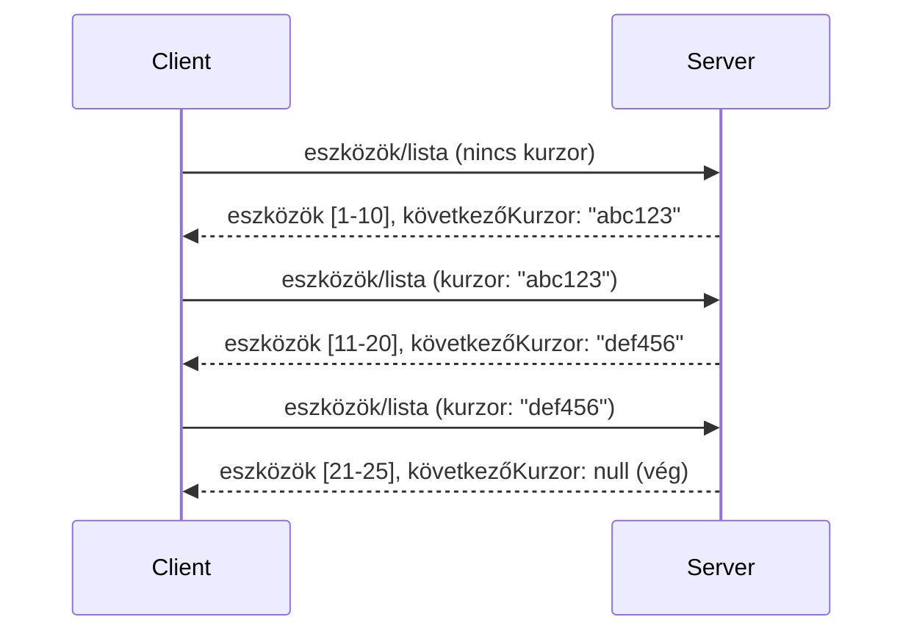

# Lapozás és nagy eredményhalmazok az MCP-ben

Amikor az MCP szervered nagy adatbázisokkal dolgozik – akár több ezer fájl, adatbázis rekord vagy keresési eredmény listázásáról van szó – a lapozásra van szükség a memória hatékony kezelése és a gyors felhasználói élmény biztosítása érdekében. Ez az útmutató bemutatja, hogyan kell megvalósítani és használni a lapozást az MCP-ben.

## Miért fontos a lapozás

Lapozás nélkül a nagy válaszok okozhatják:

- **Memória kimerülése** - Egyszerre több millió rekord betöltése
- **Lassú válaszidők** - A felhasználók várnak, amíg az összes adat betöltődik
- **Időtúllépési hibák** - A kérések meghaladják az időkorlátot
- **Gyenge AI teljesítmény** - A nagyméretű szövegkörnyezet nehézséget okoz az LLM-eknek

Az MCP **kurzor alapú lapozást** használ a megbízható, konzisztens lapozáshoz az eredményhalmazokon keresztül.

---

## Hogyan működik az MCP lapozás

### A kurzor fogalma

Egy **kurzor** egy átlátszatlan szöveg, amely jelzi a helyedet egy eredményhalmazban. Olyan, mint egy könyvjelző egy hosszú könyvben.



### Lapozás az MCP metódusaiban

Ezek az MCP metódusok támogatják a lapozást:

| Metódus | Visszatérési érték | Kurzor támogatás |
|--------|--------------------|------------------|
| `tools/list` | Eszköz definíciók | ✅ |
| `resources/list` | Erőforrás definíciók | ✅ |
| `prompts/list` | Prompt definíciók | ✅ |
| `resources/templates/list` | Erőforrás sablonok | ✅ |

---

## Szerver oldali megvalósítás

### Python (FastMCP)

```python
from mcp.server import Server
from mcp.types import Tool, ListToolsResult
import math

app = Server("paginated-server")

# Szimulált nagy adatállomány
ALL_TOOLS = [
    Tool(name=f"tool_{i}", description=f"Tool number {i}", inputSchema={})
    for i in range(100)
]

PAGE_SIZE = 10

@app.list_tools()
async def list_tools(cursor: str | None = None) -> ListToolsResult:
    """List tools with pagination support."""
    
    # Dekódolja a kurzort a kezdőindex lekéréséhez
    start_index = 0
    if cursor:
        try:
            start_index = int(cursor)
        except ValueError:
            start_index = 0
    
    # Az eredmények oldalának lekérése
    end_index = min(start_index + PAGE_SIZE, len(ALL_TOOLS))
    page_tools = ALL_TOOLS[start_index:end_index]
    
    # Következő kurzor kiszámítása
    next_cursor = None
    if end_index < len(ALL_TOOLS):
        next_cursor = str(end_index)
    
    return ListToolsResult(
        tools=page_tools,
        nextCursor=next_cursor
    )
```

### TypeScript

```typescript
import { Server } from "@modelcontextprotocol/sdk/server/index.js";
import { ListToolsResultSchema } from "@modelcontextprotocol/sdk/types.js";

const server = new Server({
  name: "paginated-server",
  version: "1.0.0"
});

// Szimulált nagy adatállomány
const ALL_TOOLS = Array.from({ length: 100 }, (_, i) => ({
  name: `tool_${i}`,
  description: `Tool number ${i}`,
  inputSchema: { type: "object", properties: {} }
}));

const PAGE_SIZE = 10;

server.setRequestHandler(ListToolsResultSchema, async (request) => {
  // Kurzor dekódolása
  let startIndex = 0;
  if (request.params?.cursor) {
    startIndex = parseInt(request.params.cursor, 10) || 0;
  }
  
  // Eredmények oldalának lekérése
  const endIndex = Math.min(startIndex + PAGE_SIZE, ALL_TOOLS.length);
  const pageTools = ALL_TOOLS.slice(startIndex, endIndex);
  
  // Következő kurzor kiszámítása
  const nextCursor = endIndex < ALL_TOOLS.length ? String(endIndex) : undefined;
  
  return {
    tools: pageTools,
    nextCursor
  };
});
```

### Java (Spring MCP)

```java
@Service
public class PaginatedToolService {
    
    private static final int PAGE_SIZE = 10;
    private final List<Tool> allTools;
    
    public PaginatedToolService() {
        // Nagy adathalmaz inicializálása
        this.allTools = IntStream.range(0, 100)
            .mapToObj(i -> new Tool("tool_" + i, "Tool number " + i, Map.of()))
            .collect(Collectors.toList());
    }
    
    @McpMethod("tools/list")
    public ListToolsResult listTools(@Param("cursor") String cursor) {
        // Mutató dekódolása
        int startIndex = 0;
        if (cursor != null && !cursor.isEmpty()) {
            try {
                startIndex = Integer.parseInt(cursor);
            } catch (NumberFormatException e) {
                startIndex = 0;
            }
        }
        
        // Eredmények oldalának lekérése
        int endIndex = Math.min(startIndex + PAGE_SIZE, allTools.size());
        List<Tool> pageTools = allTools.subList(startIndex, endIndex);
        
        // Következő mutató kiszámítása
        String nextCursor = endIndex < allTools.size() ? String.valueOf(endIndex) : null;
        
        return new ListToolsResult(pageTools, nextCursor);
    }
}
```

---

## Kliens oldali megvalósítás

### Python kliens

```python
from mcp import ClientSession

async def get_all_tools(session: ClientSession) -> list:
    """Fetch all tools using pagination."""
    all_tools = []
    cursor = None
    
    while True:
        result = await session.list_tools(cursor=cursor)
        all_tools.extend(result.tools)
        
        if result.nextCursor is None:
            break
        cursor = result.nextCursor
    
    return all_tools

# Használat
async with client_session as session:
    tools = await get_all_tools(session)
    print(f"Found {len(tools)} tools")
```

### TypeScript kliens

```typescript
import { Client } from "@modelcontextprotocol/sdk/client/index.js";

async function getAllTools(client: Client): Promise<Tool[]> {
  const allTools: Tool[] = [];
  let cursor: string | undefined = undefined;
  
  do {
    const result = await client.listTools({ cursor });
    allTools.push(...result.tools);
    cursor = result.nextCursor;
  } while (cursor);
  
  return allTools;
}

// Használat
const tools = await getAllTools(client);
console.log(`Found ${tools.length} tools`);
```

### Lusta betöltési minta

Nagyon nagy adatbázisok esetén töltsd be az oldalakat igény szerint:

```python
class PaginatedToolIterator:
    """Lazily iterate through paginated tools."""
    
    def __init__(self, session: ClientSession):
        self.session = session
        self.cursor = None
        self.buffer = []
        self.exhausted = False
    
    async def __anext__(self):
        # Visszatérés a pufferből, ha elérhető
        if self.buffer:
            return self.buffer.pop(0)
        
        # Ellenőrizze, hogy elfogytak-e az összes oldal
        if self.exhausted:
            raise StopAsyncIteration
        
        # Következő oldal lekérése
        result = await self.session.list_tools(cursor=self.cursor)
        self.buffer = list(result.tools)
        self.cursor = result.nextCursor
        
        if self.cursor is None:
            self.exhausted = True
        
        if not self.buffer:
            raise StopAsyncIteration
        
        return self.buffer.pop(0)
    
    def __aiter__(self):
        return self

# Használat - memóriahatékony nagy adatkészletekhez
async for tool in PaginatedToolIterator(session):
    process_tool(tool)
```

---

## Lapozás erőforrásoknál

Az erőforrások gyakran igénylik a lapozást könyvtárak vagy nagy adatbázisok esetén:

```python
from mcp.server import Server
from mcp.types import Resource, ListResourcesResult
import os

app = Server("file-server")

@app.list_resources()
async def list_resources(cursor: str | None = None) -> ListResourcesResult:
    """List files in directory with pagination."""
    
    directory = "/data/files"
    all_files = sorted(os.listdir(directory))
    
    # Dekódolja az kurzort (fájl index)
    start_index = int(cursor) if cursor else 0
    page_size = 20
    end_index = min(start_index + page_size, len(all_files))
    
    # Erőforrás lista létrehozása ehhez az oldalhoz
    resources = []
    for filename in all_files[start_index:end_index]:
        filepath = os.path.join(directory, filename)
        resources.append(Resource(
            uri=f"file://{filepath}",
            name=filename,
            mimeType="application/octet-stream"
        ))
    
    # Számolja ki a következő kurzort
    next_cursor = str(end_index) if end_index < len(all_files) else None
    
    return ListResourcesResult(
        resources=resources,
        nextCursor=next_cursor
    )
```

---

## Kurzor tervezési stratégiák

### 1. stratégia: Index alapú (Egyszerű)

```python
# A kurzor csak az index
cursor = "50"  # Indítás az 50. elemtől
```

**Előnyök:** Egyszerű, állapot nélküli
**Hátrányok:** Az eredmények elmozdulhatnak, ha elemeket adnak hozzá vagy távolítanak el

### 2. stratégia: Azonosító alapú (Stabil)

```python
# A kurzor az utoljára látott azonosító
cursor = "item_abc123"  # Kezdje e tétel után
```

**Előnyök:** Stabil akkor is, ha változnak az elemek
**Hátrányok:** Rendezett azonosítókat igényel

### 3. stratégia: Kódolt állapot (Komplex)

```python
import base64
import json

def encode_cursor(state: dict) -> str:
    return base64.b64encode(json.dumps(state).encode()).decode()

def decode_cursor(cursor: str) -> dict:
    return json.loads(base64.b64decode(cursor).decode())

# A kurzor több állapotmezőt tartalmaz
cursor = encode_cursor({
    "offset": 50,
    "filter": "active",
    "sort": "name"
})
```

**Előnyök:** Összetett állapot kódolható
**Hátrányok:** Komplexebb, nagyobb kurzor stringek

---

## Legjobb gyakorlatok

### 1. Válassz megfelelő oldal méreteket

```python
# Vegyük figyelembe az adatméretet
PAGE_SIZE_SMALL_ITEMS = 100   # Egyszerű metaadatok
PAGE_SIZE_MEDIUM_ITEMS = 20   # Gazdagabb objektumok
PAGE_SIZE_LARGE_ITEMS = 5     # Összetett tartalom
```

### 2. Kezeld a hibás kurzorokat elegánsan

```python
@app.list_tools()
async def list_tools(cursor: str | None = None) -> ListToolsResult:
    try:
        start_index = int(cursor) if cursor else 0
        if start_index < 0 or start_index >= len(ALL_TOOLS):
            start_index = 0  # Visszaállítás a kezdethez
    except (ValueError, TypeError):
        start_index = 0  # Érvénytelen kurzor, kezdjük elölről
    # ...
```

### 3. Tartalmazza az összesített számot (opcionális)

```python
return ListToolsResult(
    tools=page_tools,
    nextCursor=next_cursor,
    # Néhány megvalósítás tartalmaz összesítést a felhasználói felület előrehaladásához
    _meta={"total": len(ALL_TOOLS)}
)
```

### 4. Teszteld a szélsőséges eseteket

```python
async def test_pagination():
    # Üres eredményhalmaz
    result = await session.list_tools()
    assert result.tools == []
    assert result.nextCursor is None
    
    # Egyetlen oldal
    result = await session.list_tools()
    assert len(result.tools) <= PAGE_SIZE
    
    # Érvénytelen kurzor
    result = await session.list_tools(cursor="invalid")
    assert result.tools  # Az első oldalt kell visszaadnia
```

---

## Gyakori hibák

### ❌ Az összes eredményt visszaadni, majd kliens oldalon lapozni

```python
# ROSSZ: Minden betöltése a memóriába
@app.list_tools()
async def list_tools() -> ListToolsResult:
    all_tools = load_all_tools()  # 1 millió eszköz!
    return ListToolsResult(tools=all_tools)
```

### ✅ Lapozz az adatforrásnál

```python
# JÓ: Csak a szükségeseket tölti be
@app.list_tools()
async def list_tools(cursor: str | None = None) -> ListToolsResult:
    offset = int(cursor) if cursor else 0
    tools = await db.query_tools(offset=offset, limit=PAGE_SIZE)
    return ListToolsResult(tools=tools, nextCursor=...)
```

---

## Mi következik

- [Module 5.14 - Kontextelemzés](../../05-AdvancedTopics/mcp-contextengineering/README.md)
- [Module 8 - Legjobb gyakorlatok](../../08-BestPractices/README.md)
- [3.8 - Az MCP szerver tesztelése](../../03-GettingStarted/08-testing/README.md)

---

## További források

- [MCP specifikáció - Lapozás](https://modelcontextprotocol.io/specification/2026-07-28/)
- [Kurzor alapú lapozás magyarázat](https://slack.engineering/evolving-api-pagination-at-slack/)
- [Python SDK lapozási tesztek](https://github.com/modelcontextprotocol/python-sdk/blob/main/tests/client/test_list_methods_cursor.py)

---

<!-- CO-OP TRANSLATOR DISCLAIMER START -->
**Jogi nyilatkozat**:
Ez a dokumentum az AI fordítási szolgáltatás, a [Co-op Translator](https://github.com/Azure/co-op-translator) segítségével készült. Bár az pontosságra törekszünk, kérjük, vegye figyelembe, hogy az automatikus fordítások hibákat vagy pontatlanságokat tartalmazhatnak. Az eredeti dokumentum az anyanyelvén tekintendő hiteles forrásnak. Fontos információk esetén professzionális emberi fordítást javasolunk. Nem vállalunk felelősséget semmilyen félreértésért vagy téves értelmezésért, amely ebből a fordításból ered.
<!-- CO-OP TRANSLATOR DISCLAIMER END -->