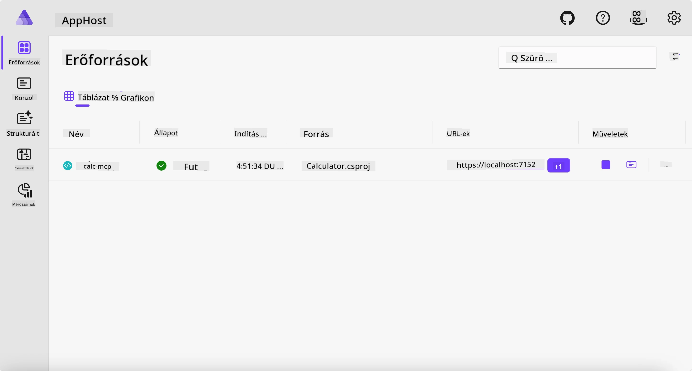
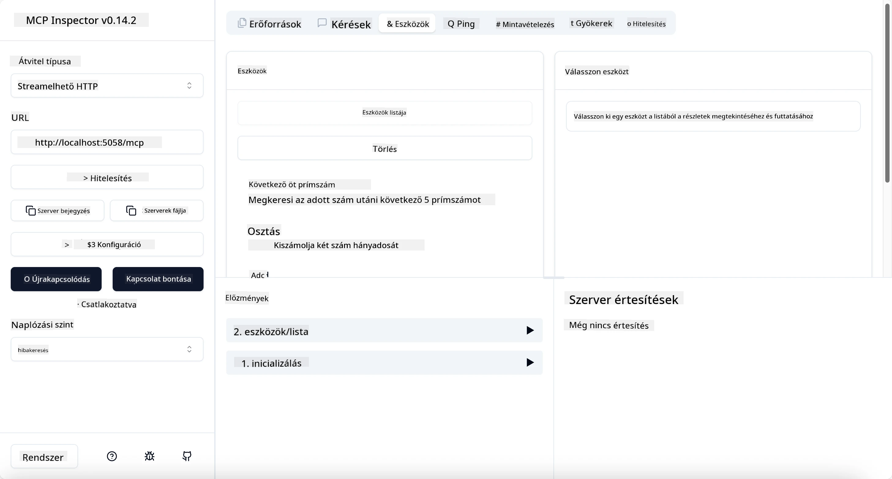
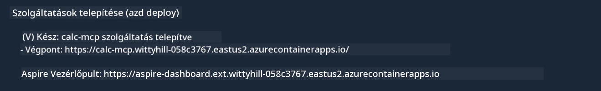

# Minta

Az előző példa bemutatja, hogyan használjunk helyi .NET projektet a `stdio` típussal. És hogyan futtassuk a szervert helyileg egy konténerben. Ez sok helyzetben jó megoldás. Azonban hasznos lehet, ha a szerver távolról fut, például egy felhői környezetben. Itt jön képbe a `http` típus.

Ha megnézzük a megoldást a `04-PracticalImplementation` mappában, sokkal összetettebbnek tűnhet, mint az előző. De valójában nem az. Ha alaposan megnézzük a `src/Calculator` projektet, azt látjuk, hogy főként ugyanaz a kód, mint az előző példában. Az egyetlen különbség, hogy egy másik könyvtárat, a `ModelContextProtocol.AspNetCore`-t használjuk az HTTP kérések kezelésére. És megváltoztatjuk az `IsPrime` metódust, hogy privát legyen, csak azért, hogy megmutassuk, lehetnek privát metódusok is a kódban. A többi kód ugyanaz, mint korábban.

A többi projekt az [Aspire](https://aspire.dev/get-started/what-is-aspire/)-től származik. Az Aspire jelenléte a megoldásban javítja a fejlesztői élményt fejlesztés és tesztelés közben, és segít az észlelésben. A szerver futtatásához nem kötelező, de jó gyakorlat, ha benne van a megoldásban.

## Indítsd el a szervert helyileg

1. A VS Code-ból (a C# DevKit bővítménnyel) navigálj a `04-PracticalImplementation/samples/csharp` könyvtárba.
1. Futtasd a következő parancsot a szerver elindításához:

   ```bash
    dotnet watch run --project ./src/AppHost
   ```

1. Amikor egy böngésző megnyitja az Aspire műszerfalat, jegyezd meg az `http` URL címet. Valami ilyesminek kell lennie: `http://localhost:5058/`.

   

## Teszteld a Streamable HTTP-t az MCP Inspectorral

Ha Node.js 22.7.5 vagy újabb van telepítve, használhatod az MCP Inspectort a szerver teszteléséhez.

Indítsd el a szervert, és futtasd a következő parancsot egy terminálban:

```bash
npx @modelcontextprotocol/inspector http://localhost:5058
```



- Válaszd ki a `Streamable HTTP` transport típust.
- Az URL mezőbe írd be a korábban jegyzett szerver URL-jét, és told fel az `/mcp`-t. Az URL-nek `http`-nek kell lennie (nem `https`), valami hasonló: `http://localhost:5058/mcp`.
- Kattints a Connect gombra.

Az Inspector jó abban, hogy jól láthatóvá teszi, mi történik.

- Próbáld ki, hogy listázod a rendelkezésre álló eszközöket
- Próbálj ki néhányat, ugyanúgy működnek, mint korábban.

## Teszteld az MCP szervert GitHub Copilot Chattel a VS Code-ban

Ahhoz, hogy a Streamable HTTP transportot használd a GitHub Copilot Chattel, módosítsd a korábban létrehozott `calc-mcp` szerver konfigurációját a következőre:

```jsonc
// .vscode/mcp.json
{
  "servers": {
    "calc-mcp": {
      "type": "http",
      "url": "http://localhost:5058/mcp"
    }
  }
}
```

Csinálj néhány tesztet:

- Kérj "3 prímszámot 6780 után". Látni fogod, hogy a Copilot használni fogja az új `NextFivePrimeNumbers` eszközöket, és csak az első 3 prímszámot adja vissza.
- Kérj "7 prímszámot 111 után", hogy lásd, mi történik.
- Kérd, hogy "Johnnak 24 cukorkája van, és mindet szét akarja osztani a 3 gyereke között. Hány cukorkája lesz mindegyik gyereknek?", hogy lásd, mi történik.

## Telepítsd a szervert az Azure-ra

Telepítsük a szervert az Azure-ba, hogy többen használhassák.

Egy terminálból navigálj a `04-PracticalImplementation/samples/csharp` mappába, és futtasd a következő parancsot:

```bash
azd up
```

Amint a telepítés befejeződik, a következőhöz hasonló üzenetet kell látnod:



Vedd fel az URL-t, és használd az MCP Inspectorban és a GitHub Copilot Chatben.

```jsonc
// .vscode/mcp.json
{
  "servers": {
    "calc-mcp": {
      "type": "http",
      "url": "https://calc-mcp.gentleriver-3977fbcf.australiaeast.azurecontainerapps.io/mcp"
    }
  }
}
```

## Mi következik?

Kipróbáltunk különböző transport típusokat és tesztelő eszközöket. Telepítettük az MCP szervert az Azure-ra is. De mi van, ha a szervernek hozzá kell férnie privát erőforrásokhoz? Például adatbázishoz vagy privát API-hoz? A következő fejezetben megnézzük, hogyan javíthatjuk a szerverünk biztonságát.

---

<!-- CO-OP TRANSLATOR DISCLAIMER START -->
**Jogi nyilatkozat**:
Ez a dokumentum az AI fordítási szolgáltatás, a [Co-op Translator](https://github.com/Azure/co-op-translator) segítségével készült. Bár az pontosságra törekszünk, kérjük, vegye figyelembe, hogy az automatikus fordítások hibákat vagy pontatlanságokat tartalmazhatnak. Az eredeti dokumentum az anyanyelvén tekintendő hiteles forrásnak. Fontos információk esetén professzionális emberi fordítást javasolunk. Nem vállalunk felelősséget semmilyen félreértésért vagy téves értelmezésért, amely ebből a fordításból ered.
<!-- CO-OP TRANSLATOR DISCLAIMER END -->