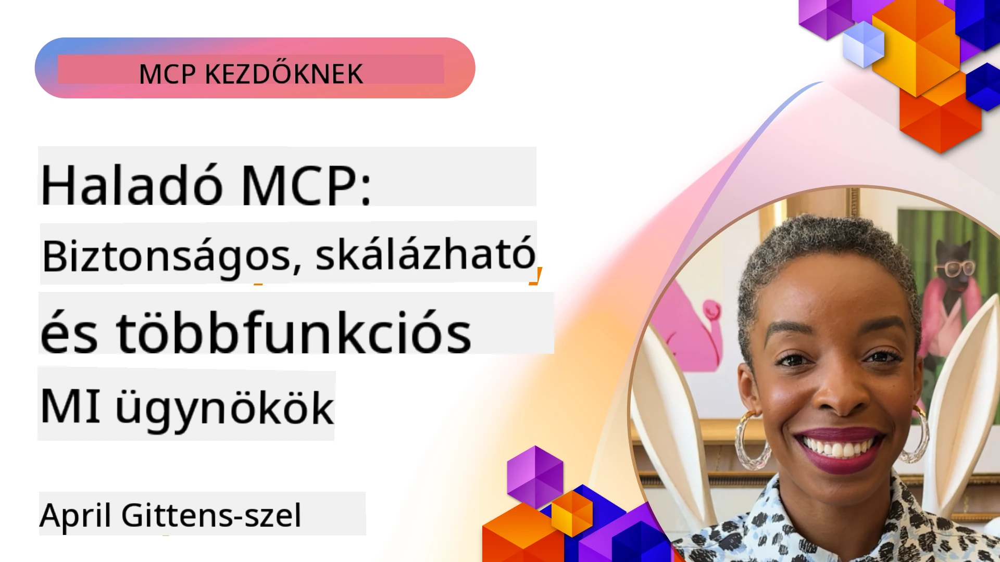

# Fejlett témák az MCP-ben

_(Kattintson a fenti képre a tanóra videójának megtekintéséhez)_

Ez a fejezet az Model Context Protocol (MCP) megvalósításának számos fejlett témáját öleli fel, beleértve a többmodalitású integrációt, a skálázhatóságot, a biztonsági legjobb gyakorlatokat és a vállalati integrációt. Ezek a témák kulcsfontosságúak a robusztus és éles környezetbe alkalmas MCP alkalmazások építéséhez, amelyek megfelelnek a modern AI rendszerek követelményeinek.

## Áttekintés

Ez a tanóra az Model Context Protocol megvalósításának fejlett koncepcióit vizsgálja, különös tekintettel a többmodalitású integrációra, a skálázhatóságra, a biztonsági legjobb gyakorlatokra és a vállalati integrációra. Ezek a témák elengedhetetlenek a termelési szintű MCP alkalmazások létrehozásához, amelyek képesek kezelni az összetett követelményeket vállalati környezetekben.

> **Jelenlegi specifikációs megjegyzés:** Az MCP `2026-07-28` elavulttá teszi a Gyökér és
> Mintavételezés primitíveket, amelyeket az 5.4 és 5.6. leckék tárgyalnak. Emellett az
> kísérleti Feladatok funkciót, amely a Protokoll funkciókban (5.16) szerepel, áthelyezi egy
> dedikált Feladatok kiterjesztéshez. Ezeket a leckéket megőrizték a régebbi
> `2025-11-25` implementációkhoz, és migrációs útmutatót tartalmaznak. Lásd
> [Mi változott az MCP-ben: A 2026-07-28 specifikáció](../01-CoreConcepts/mcp-2026-07-28.md).

## Tanulási célok

A tanóra végére képes lesz:

- Többmodalitású képességek megvalósítása az MCP keretrendszerekben
- Skálázható MCP architektúrák tervezése nagy igényű helyzetekhez
- Biztonsági legjobb gyakorlatok alkalmazása az MCP biztonsági elveinek megfelelően
- MCP integrálása vállalati AI rendszerekkel és keretrendszerekkel
- Teljesítmény és megbízhatóság optimalizálása éles környezetben

## Leckék és mintaprojektek

| Link | Cím | Leírás |
|------|-------|-------------|
| [5.1 Integration with Azure](./mcp-integration/README.md) | Integráció Azure-ral | Tanulja meg, hogyan integrálja MCP szerverét Azure-on |
| [5.2 Multi modal sample](./mcp-multi-modality/README.md) | MCP többmodalitású minták | Minták hang, kép és többmodalitású válaszokhoz |
| [5.3 MCP OAuth2 sample](../../../05-AdvancedTopics/mcp-oauth2-demo) | MCP OAuth2 bemutató | Minimális Spring Boot alkalmazás, amely bemutatja az OAuth2-t MCP-vel, mind mint engedélyező, mind mint erőforrás szerver. Bemutatja a biztonságos token kiadást, védett végpontokat, Azure Container Apps telepítést és API Menedzsment integrációt. |
| [5.4 Root Contexts](./mcp-root-contexts/README.md) | Gyökér kontextusok | Tanulja meg a régi `2025-11-25` Gyökér primitívet és az aktuális migrációs lehetőségeket (elavult a `2026-07-28` szerint) |
| [5.5 Routing](./mcp-routing/README.md) | Csomagküldés | Tanulja meg a különböző csomagküldési típusokat |
| [5.6 Sampling](./mcp-sampling/README.md) | Mintavételezés | Tanulja meg a régi `2025-11-25` Mintavételezés primitívet és az aktuális migrációs lehetőségeket (elavult a `2026-07-28` szerint) |
| [5.7 Scaling](./mcp-scaling/README.md) | Skálázás | Ismerje meg a skálázás fogalmát |
| [5.8 Security](./mcp-security/README.md) | Biztonság | Biztosítsa MCP szerverét |
| [5.9 Web Search sample](./web-search-mcp/README.md) | Web keresés MCP | Python MCP szerver és kliens, amely integrál a SerpAPI-val valós idejű web, hír, termék kereséshez és kérdés-válaszhoz. Bemutatja a többeszközös összehangolást, külső API integrációt és a robusztus hibakezelést. |
| [5.10 Realtime Streaming](./mcp-realtimestreaming/README.md) | Streaming | A valós idejű adatfolyam elengedhetetlen a mai adatközpontú világban, ahol a vállalkozásoknak és alkalmazásoknak azonnali hozzáférésre van szükségük az információkhoz, hogy időben döntéseket hozzanak.|
| [5.11 Realtime Web Search](./mcp-realtimesearch/README.md) | Web keresés | Valós idejű webkeresés – hogyan alakítja át az MCP a valós idejű webkeresést azáltal, hogy szabványosított megközelítést nyújt a kontextuskezeléshez AI modellek, keresőmotorok és alkalmazások között.| 
| [5.12  Entra ID Authentication for Model Context Protocol Servers](./mcp-security-entra/README.md) | Entra ID hitelesítés | A Microsoft Entra ID robusztus, felhőalapú identitás- és hozzáféréskezelési megoldást kínál, amely biztosítja, hogy csak jogosult felhasználók és alkalmazások léphessenek kapcsolatba MCP szerverével.|
| [5.13 Microsoft Foundry Agent Integration](./mcp-foundry-agent-integration/README.md) | Microsoft Foundry integráció | Tanulja meg, hogyan integrálja az MCP szervereket a Microsoft Foundry ügynökökkel, lehetővé téve az erőteljes eszköz-összehangolást és vállalati AI képességeket szabványosított külső adatforrás csatlakozásokkal.|
| [5.14 Context Engineering](./mcp-contextengineering/README.md) | Kontextus mérnökség | A kontextus mérnökségi technikák jövőbeli lehetőségei MCP szerverekhez, beleértve a kontextus optimalizálást, dinamikus kontextuskezelést, és hatékony prompt tervezési stratégiákat az MCP keretrendszerekben.|
| [5.15 MCP Custom Transport](./mcp-transport/README.md) | Egyedi adatátvitel | Tanulja meg, hogyan valósítson meg egyéni adatátviteli mechanizmusokat speciális MCP kommunikációs helyzetekhez.|
| [5.16 Protocol Features Deep Dive](./mcp-protocol-features/README.md) | Protokoll funkciók | Sajátítsa el a fejlett protokoll funkciókat, beleértve az előrehaladási értesítéseket, kérés visszavonást, erőforrás sablonokat és hibakezelési mintákat.|
| [5.17 Adversarial Multi-Agent Reasoning](./mcp-adversarial-agents/README.md) | Ellenséges ügynökök | Használjon két olyan ügynököt, akik ellentétes álláspontot képviselnek, és megosztanak egy MCP eszközkészletet, hogy kiszűrjék a hamis eredményeket, megjelenítsék a szélsőséges eseteket, és jobban kalibrált kimeneteket hozzanak létre strukturált vitán keresztül.|

> **Történelmi `2025-11-25` megjegyzés:** az a revízió bevezette a kísérleti
> Feladatokat, és kibővítette a protokoll néhány funkcióját. A `2026-07-28` verzióban a Feladatok
> hivatalos kiterjesztésbe kerültek, és a Gyökér elavulttá vált. Ne használja a
> `2025-11-25` funkció állapotot aktuális útmutatásként; lásd a
> [2026-07-28 változásnaplót](https://modelcontextprotocol.io/specification/2026-07-28/changelog).

## További hivatkozások

A legfrissebb információkért a fejlett MCP témákról, kérjük, tekintse meg:
- [MCP dokumentáció](https://modelcontextprotocol.io/)
- [MCP specifikáció (2026-07-28)](https://modelcontextprotocol.io/specification/2026-07-28/)
- [GitHub tárhely](https://github.com/modelcontextprotocol)
- [OWASP MCP Top 10](https://microsoft.github.io/mcp-azure-security-guide/mcp/) - Biztonsági kockázatok és kivédésük
- [MCP Biztonsági Csúcstalálkozó Műhely (Sherpa)](https://azure-samples.github.io/sherpa/) - Gyakorlati biztonsági képzés

## Főbb tanulságok

- A többmodalitású MCP megvalósítások kibővítik a mesterséges intelligencia képességeit a szövegfeldolgozáson túl
- A skálázhatóság elengedhetetlen a vállalati telepítésekhez, és vízszintes és függőleges skálázással érhető el
- Átfogó biztonsági intézkedések védik az adatokat és biztosítják a megfelelő hozzáférés-szabályozást
- A vállalati integráció olyan platformokkal, mint az Azure OpenAI és a Microsoft AI Foundry, fokozza az MCP képességeit
- Az előrehaladott MCP megvalósítások optimalizált architektúrákból és gondos erőforrás-kezelésből profitálnak

## Gyakorlat

Tervezzen egy vállalati szintű MCP megvalósítást egy konkrét felhasználási esetre:

1. Határozza meg a többmodalitású követelményeket az adott felhasználási esethez
2. Vázolja fel a biztonsági kontrollokat az érzékeny adatok védelmére
3. Tervezzen egy skálázható architektúrát, amely képes kezelni a változó terhelést
4. Tervezze meg az integrációs pontokat a vállalati MI rendszerekkel
5. Dokumentálja a potenciális teljesítménybeli szűk keresztmetszeteket és a mérséklési stratégiákat

## További források

- [Azure OpenAI dokumentáció](https://learn.microsoft.com/en-us/azure/ai-services/openai/)
- [Microsoft AI Foundry dokumentáció](https://learn.microsoft.com/en-us/ai-services/)

---

## Mi következik

Fedezze fel a modul leckéit az alábbi kezdőponttól: [5.1 MCP Integration](./mcp-integration/README.md)

Miután befejezte ezt a modult, folytassa a következővel: [6. modul: Közösségi hozzájárulások](../06-CommunityContributions/README.md)

---

<!-- CO-OP TRANSLATOR DISCLAIMER START -->
**Jogi nyilatkozat**:
Ez a dokumentum az AI fordítási szolgáltatás, a [Co-op Translator](https://github.com/Azure/co-op-translator) segítségével készült. Bár az pontosságra törekszünk, kérjük, vegye figyelembe, hogy az automatikus fordítások hibákat vagy pontatlanságokat tartalmazhatnak. Az eredeti dokumentum az anyanyelvén tekintendő hiteles forrásnak. Fontos információk esetén professzionális emberi fordítást javasolunk. Nem vállalunk felelősséget semmilyen félreértésért vagy téves értelmezésért, amely ebből a fordításból ered.
<!-- CO-OP TRANSLATOR DISCLAIMER END -->