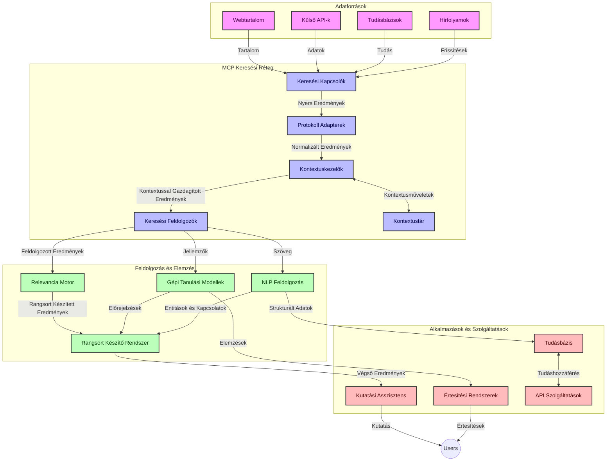
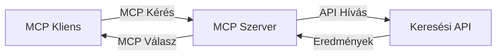
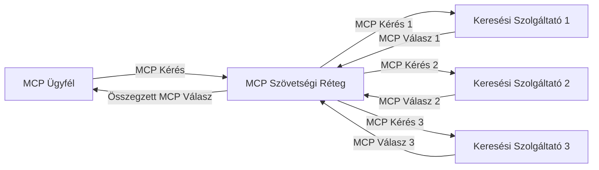
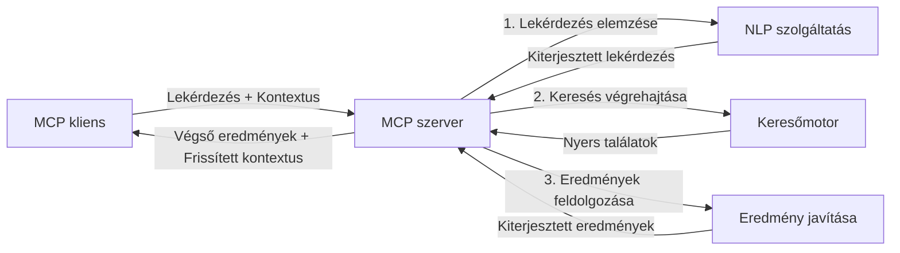

# Modell Kontext Protokoll valós idejű webes kereséshez

## Áttekintés

A valós idejű webes keresés elengedhetetlené vált a mai információközpontú környezetben, ahol az alkalmazásoknak azonnali hozzáférésre van szükségük a naprakész információkhoz az interneten keresztül, hogy releváns és időben megfelelő válaszokat adhassanak. A Modell Kontext Protokoll (MCP) jelentős előrelépést képvisel ezen valós idejű keresési folyamatok optimalizálásában, növelve a keresés hatékonyságát, megőrizve a kontextuális integritást, és javítva az általános rendszer teljesítményét.

Ez a modul bemutatja, hogyan alakítja át az MCP a valós idejű webes keresést úgy, hogy egységes megközelítést kínál a kontextuskezeléshez az MI-modellek, keresőmotorok és alkalmazások között.

### Amit megtanulsz

Ebben az átfogó útmutatóban megismerheted:

- Hogyan teremt az MCP zökkenőmentes kapcsolatot az MI-modellek és a valós idejű webes keresési képességek között
- Az MCP-vel hatékony és skálázható keresési megoldások megvalósításának építészeti mintáit
- Technikákat a keresési kontextus megőrzésére több lekérdezés és interakció során
- Gyakorlati kódmegvalósításokat Pythonban és JavaScriptben különböző keresési forgatókönyvekhez
- Módszereket a relevancia, frissesség és teljesítmény egyensúlyának megteremtésére MCP-alapú keresőrendszerekben

## Bevezetés a valós idejű webes keresésbe

A valós idejű webes keresés egy olyan technológiai megközelítés, amely lehetővé teszi a webes információk folyamatos lekérdezését, feldolgozását és elemzését, miközben azok közzéteszik vagy frissítik az adatokat, lehetővé téve a rendszerek számára, hogy friss és releváns információkat szolgáltassanak minimális késleltetéssel. Ellentétben a hagyományos kereső rendszerekkel, amelyek indexelt, akár órákkal vagy napokkal ezelőtti adatokon alapulnak, a valós idejű keresés élő adatokat használ a webről, így az eredmények a jelenlegi online tartalom állapotát tükrözik.

### A valós idejű webes keresés alapfogalmai:

- **Folyamatos lekérdezés feldolgozás**: A keresési lekérdezéseket folyamatosan frissülő adatforrások ellen dolgozzák fel
- **Frissesség előtérbe helyezése**: A rendszerek a friss információkat részesítik előnyben
- **Relevancia és frissesség egyensúlyozása**: A relevancia és a frissesség egyensúlyának fenntartása
- **Skálázható architektúra**: A rendszereknek képesnek kell lenniük változó lekérdezési terhelések és adatmennyiségek kezelésére
- **Kontextuális megértés**: A felhasználói kontextus folyamatos megőrzése keresési iterációk során elengedhetetlen a értelmes eredményekhez
- **Dinamikus lekérdezés újraformálás**: A lekérdezések adaptív módosítása a kontextus és az előző eredmények alapján
- **Többforrású integráció**: Eredmények kombinálása több keresőszolgáltatótól és webes forrásból
- **Szemantikus megértés**: Lekérdezések és tartalmak jelentés-alapú feldolgozása, nem csak kulcsszavak alapján
- **Valós idejű rangsorolás**: Az eredmények rangsorolásának folyamatos igazítása új információk érkezésekor

### A Modell Kontext Protokoll és a valós idejű webes keresés

A Modell Kontext Protokoll (MCP) több kritikus kihívást kezel a valós idejű webes keresési környezetekben:

1. **Keresési kontextus megőrzése**: Az MCP szabványosítja, hogyan tartják fenn a kontextust az elosztott keresési komponensek között, biztosítva, hogy az MI-modellek és feldolgozó egységek hozzáférjenek a releváns lekérdezési történelemhez és felhasználói preferenciákhoz.

2. **Hatékony lekérdezéskezelés**: Struktúrált mechanizmusokat kínálva a kontextus átvitelére, az MCP csökkenti a kontextus ismétlésének többletterhét minden keresési iterációban.

3. **Interoperabilitás**: Az MCP közös nyelvet teremt a kontextus-megosztáshoz különféle keresési technológiák és MI-modellek között, lehetővé téve rugalmasabb és bővíthetőbb architektúrák létrehozását.

4. **Keresésre optimalizált kontextus**: Az MCP megvalósítások priorizálhatják, mely kontextuselemek a leghatékonyabb kereséshez a legrelevánsabbak, optimalizálva a teljesítményt és a pontosságot.

5. **Adaptív keresési feldolgozás**: Az MCP segítségével a keresőrendszerek dinamikusan igazíthatják a feldolgozást a felhasználói igények és az információs környezet változásai alapján.

A modern alkalmazásokban, a híroldal aggregálástól a kutatási asszisztensekig, az MCP és a webes keresési technológiák integrációja intelligensebb, kontextus-érzékeny keresést tesz lehetővé, amely egyre relevánsabb eredményeket tud nyújtani a felhasználói interakciók folyamán.

## Tanulási célok

A lecke végére képes leszel:

- Megérteni a valós idejű webes keresés alapjait és a modern alkalmazásokban lévő kihívásait
- Elmagyarázni, hogyan fejleszti a Modell Kontext Protokoll (MCP) a valós idejű webes keresési képességeket
- Megvalósítani MCP-alapú keresési megoldásokat népszerű keretrendszerek és API-k használatával
- Megtervezni és telepíteni skálázható, nagy teljesítményű keresési architektúrákat MCP-vel
- Alkalmazni az MCP fogalmait különböző felhasználási esetekben, beleértve a szemantikus keresést, kutatási segítséget és MI-vel támogatott böngészést
- Értékelni az MCP-alapú keresési technológiák feltörekvő trendjeit és jövőbeli innovációit
- Fejleszteni kontextus-érzékeny keresőrendszereket, amelyek tanulnak a felhasználói interakciókból
- Integrálni a webes keresési képességeket MI-asszisztensekbe szabványosított MCP protokollok segítségével
- Létrehozni többfázisú keresési folyamatokat, amelyek fokozatosan finomítják az eredményeket a kontextus alapján
- Optimalizálni a keresési teljesítményt, miközben megőrzöd a teljes kontextus-észlelést

### Definíció és jelentőség

A valós idejű webes keresés a webes információk folyamatos lekérdezését, lekérését és szolgáltatását jelenti minimális késleltetéssel. Ellentétben a hagyományos keresőmotorokkal, amelyek időszakosan pásztázzák és indexelik az internetet, a valós idejű keresés célja, hogy az információ akkor váljon elérhetővé, amikor megjelenik, biztosítva az azonnali hozzáférést a legfrissebb tartalomhoz.

A valós idejű webes keresés fő jellemzői:

- **Frissesség**: A legújabb tartalom és frissítések előtérbe helyezése
- **Folyamatos feldolgozás**: Az új információk állandó figyelése
- **Lekérdezés adaptációja**: Keresési lekérdezések finomítása a kontextus és visszajelzések alapján
- **Azonnali szolgáltatás**: A keresési eredmények minimális késedelemmel történő szolgáltatása
- **Kontextus megőrzése**: Korábbi lekérdezésekre alapozva a relevancia javítása érdekében

### Kihívások a hagyományos webes keresésben

A hagyományos webes keresési megközelítések számos korlátozással szembesülnek valós idejű forgatókönyvekben:

1. **Kontextus töredezettség**: Nehézség a keresési kontextus fenntartásában több lekérdezés alatt
2. **Információ frissessége**: A legfrissebb információk elérésének és prioritásának kihívásai
3. **Integrációs bonyodalmak**: Interoperabilitási problémák a kereső rendszerek és alkalmazások között
4. **Késleltetési problémák**: Az átfogó keresés és a válaszidő egyensúlyozása
5. **Relevancia hangolás**: A pontosság és relevancia biztosítása a frissesség priorizálása mellett

## Modell Kontext Protokoll (MCP) megértése kereséshez

### Mi az MCP keresési kontextusban?

A Modell Kontext Protokoll (MCP) egy szabványosított kommunikációs protokoll, amely hatékony interakciót tesz lehetővé MI-modellek és alkalmazások között. Valós idejű webes keresés kontextusában az MCP egy keretet nyújt:

- A keresési kontextus megőrzésére a lekérdezési sorozatok során
- A keresési lekérdezés és eredményformátumok szabványosítására
- A keresési paraméterek és eredmények továbbításának optimalizálására
- Az MI-modellek és keresőmotorok közötti kommunikáció fejlesztésére

### Alapvető összetevők és architektúra

Az MCP valós idejű webes kereséshez több fő összetevőből áll:

1. **Lekérdezés-kontekstus kezelők**: Kezelik és fenntartják a keresési kontextust több lekérdezés során
2. **Keresési feldolgozók**: Kontextus-érzékeny technikákat alkalmazva dolgozzák fel a bejövő keresési kéréseket
3. **Protokoll adapterek**: Különböző kereső API-k közötti átalakítás, miközben megőrzik a kontextust
4. **Kontextustár**: Hatékony tárolás és visszakeresés a keresési előzményekhez és preferenciákhoz
5. **Keresési kapcsolók**: Kapcsolódás különböző keresőmotorokhoz és webes API-khoz



### Hogyan fejleszti az MCP a valós idejű webes keresést

Az MCP a hagyományos webes keresés kihívásait így kezeli:

- **Kontextuális folytonosság**: Fenntartja a lekérdezések közötti kapcsolatokat az egész keresési munkamenet során
- **Optimalizált továbbítás**: Csökkenti a keresési paraméterek redundanciáját intelligens kontextuskezeléssel
- **Szabványosított interfészek**: Egységes API-kat biztosít a keresési komponensek számára
- **Csökkentett késleltetés**: Minimalizálja a feldolgozási többletterhet a hatékony kontextuskezelés által
- **Fokozott relevancia**: Javítja a keresés relevanciáját azáltal, hogy megőrzi a felhasználói szándékot több lekérdezés során

## Integráció és megvalósítás

A valós idejű webes kereső rendszerek gondos építészeti tervezést és megvalósítást igényelnek a teljesítmény és a kontextuális integritás fenntartásához. A Modell Kontext Protokoll egységes megközelítést kínál az MI-modellek és kereső technológiák integrálására, lehetővé téve fejlettebb, kontextus-érzékeny keresési folyamatok kialakítását.

### Az MCP integráció áttekintése a keresési architektúrákban

Az MCP megvalósítása valós idejű webes keresési környezetben több kulcsfontosságú szempontot igényel:

1. **Keresési kontextus szerializációja**: Az MCP hatékony mechanizmusokat kínál a kontextuális információk keresési kérésben történő kódolására, biztosítva, hogy a lényeges kontextus végigkövesse a lekérdezést a feldolgozási láncon. Ez magában foglal szabványosított szerializációs formátumokat, melyek optimalizáltak a kereséshez kapcsolódó metaadatok számára.

2. **Állapotmegőrző keresési feldolgozás**: Az MCP lehetővé teszi az intelligensebb állapottartó feldolgozást úgy, hogy a keresési iterációk során konzisztens kontextusábrázolást tart fenn. Ez különösen értékes többfázisú keresési folyamatoknál, ahol a kontextus finomítása javítja az eredményeket.

3. **Lekérdezésbővítés és finomítás**: MCP megvalósítások elősegíthetik a kifinomult lekérdezésbővítést és finomítást az összegyűjtött kontextus alapján, lehetővé téve a keresési munkamenet előrehaladtával egyre relevánsabb eredményeket.

4. **Eredmények gyorsítótárazása és priorizálása**: A kontextuskezelés szabványosításával az MCP segít az eredmények gyorsítótárazásának és priorizálásának kezelésében, lehetővé téve a komponenseknek, hogy az alakuló keresési kontextus alapján alkalmazkodjanak.

5. **Keresési összefoglalás és aggregáció**: Az MCP támogatja a komplexebb keresések összefoglalását több háttérrendszer között, strukturált kontextusábrázolást nyújtva, ezzel lehetővé téve az eredmények tartalmasabb összegzését különböző forrásokból.

Az MCP különböző keresési technológiákban történő megvalósítása egységes megközelítést teremt a kontextuskezeléshez, csökkentve az egyedi integrációs kód szükségességét, miközben növeli a rendszer képességét, hogy a keresési lekérdezések fejlődése során is megőrizze a jelentőségteljes kontextust.

### MCP különböző webes keresési megvalósításokban

Ezek a példák követik a jelenlegi MCP specifikációt, amely egy JSON-RPC alapú protokollra összpontosít, elkülönült szállítási mechanizmusokkal. A kód bemutatja, hogyan valósítható meg egyedi keresési integráció miközben teljes kompatibilitást tart fenn az MCP protokollal.


<details>
<summary>Python megvalósítás általános keresési API-val</summary>

```python
import asyncio
import json
import aiohttp
from typing import Dict, Any, Optional, List
from contextlib import asynccontextmanager
from collections.abc import AsyncIterator

# Szabványos MCP könyvtárak importálása
from mcp.client.session import ClientSession
from mcp.client.streamable_http import streamablehttp_client
from mcp.types import TextContent, CreateMessageRequestParams, CreateMessageResult
from mcp.server.fastmcp import FastMCP

# Gyors MCP szerver létrehozása webes kereséshez
search_server = FastMCP("WebSearch")

# Osztály a webes keresési műveletek kezelésére
class WebSearchHandler:
    def __init__(self, api_endpoint: str, api_key: str):
        self.api_endpoint = api_endpoint
        self.api_key = api_key
        self.session = None
        
    async def initialize(self):
        """Initialize the HTTP session"""
        self.session = aiohttp.ClientSession(
            headers={"Authorization": f"Bearer {self.api_key}"}
        )
    
    async def close(self):
        """Close the HTTP session"""
        if self.session:
            await self.session.close()
            
    async def perform_search(self, query: str, max_results: int = 5, 
                           include_domains: List[str] = None, 
                           exclude_domains: List[str] = None,
                           time_period: str = "any") -> Dict[str, Any]:
        """Perform web search using the search API"""
        # Keresési paraméterek összeállítása
        search_params = {
            "q": query,
            "limit": max_results,
            "time": time_period
        }
        
        if include_domains:
            search_params["site"] = ",".join(include_domains)
            
        if exclude_domains:
            search_params["exclude_site"] = ",".join(exclude_domains)
        
        # Keresési kérés végrehajtása
        try:
            async with self.session.get(
                self.api_endpoint,
                params=search_params
            ) as response:
                if response.status != 200:
                    error_text = await response.text()
                    raise Exception(f"Search API error: {response.status} - {error_text}")
                
                search_data = await response.json()
                
                # API-specifikus válasz átalakítása szabványos formátumba
                results = []
                for item in search_data.get("results", []):
                    results.append({
                        "title": item.get("title", ""),
                        "url": item.get("url", ""),
                        "snippet": item.get("snippet", ""),
                        "date": item.get("published_date", ""),
                        "source": item.get("source", "")
                    })
                
                return {
                    "query": query,
                    "totalResults": len(results),
                    "results": results
                }
        except Exception as e:
            print(f"Search API request error: {e}")
            raise

# A keresés kezelő inicializálása
search_handler = WebSearchHandler(
    api_endpoint="https://api.search-service.example/search",
    api_key="your-api-key-here"
)

# Élettartam beállítása a keresés kezelő kezeléséhez
@asyncio.asynccontextmanager
async def app_lifespan(server: FastMCP):
    """Manage application lifecycle"""
    await search_handler.initialize()
    try:
        yield {"search_handler": search_handler}
    finally:
        await search_handler.close()

# Élettartam beállítása a szerverhez
search_server = FastMCP("WebSearch", lifespan=app_lifespan)

# Webes kereső eszköz regisztrálása
@search_server.tool()
async def web_search(query: str, max_results: int = 5, 
                   include_domains: List[str] = None,
                   exclude_domains: List[str] = None,
                   time_period: str = "any") -> Dict[str, Any]:
    """
    Search the web for information
    
    Args:
        query: The search query
        max_results: Maximum number of results to return (default: 5)
        include_domains: List of domains to include in search results
        exclude_domains: List of domains to exclude from search results
        time_period: Time period for results ("day", "week", "month", "any")
        
    Returns:
        Dictionary containing search results
    """
    ctx = search_server.get_context()
    search_handler = ctx.request_context.lifespan_context["search_handler"]
    
    results = await search_handler.perform_search(
        query=query,
        max_results=max_results,
        include_domains=include_domains,
        exclude_domains=exclude_domains,
        time_period=time_period
    )
    
    return results

# Példa kliens használatára
async def client_example():
    # Kapcsolódás a kereső szerverhez Streamable HTTP szállítással
    async with streamablehttp_client("http://localhost:8000/mcp") as (read, write, _):
        async with ClientSession(read, write) as session:
            # A kapcsolat inicializálása
            await session.initialize()
            
            # A web_search eszköz meghívása
            search_results = await session.call_tool(
                "web_search", 
                {
                    "query": "latest developments in AI and Model Context Protocol",
                    "max_results": 5,
                    "time_period": "day",
                    "include_domains": ["github.com", "microsoft.com"]
                }
            )
            
            print(f"Search results: {search_results}")

# Szerver futtatási példa
if __name__ == "__main__":
    # A szerver futtatása Streamable HTTP szállítással
    search_server.run(transport="streamable-http")
```
</details> 

<details>
<summary>JavaScript megvalósítás böngésző-alapú kereséssel</summary>


```javascript
// MCP szerver megvalósítás webes kereséshez
import { McpServer, ResourceTemplate } from '@modelcontextprotocol/sdk/server/mcp.js';
import { StreamableHTTPServerTransport } from '@modelcontextprotocol/sdk/server/streamableHttp.js';
import { z } from 'zod';

// MCP szerver létrehozása webes kereséshez
const searchServer = new McpServer({
    name: "BrowserSearch",
    description: "A server that provides web search capabilities"
});

// Keresési szolgáltatás osztály
class SearchService {
    constructor(searchApiUrl, apiKey) {
        this.searchApiUrl = searchApiUrl;
        this.apiKey = apiKey;
    }

    async performSearch(parameters) {
        const {
            query = '',
            maxResults = 5,
            includeDomains = [],
            excludeDomains = [],
            timePeriod = 'any'
        } = parameters;
        
        // Keresési URL összeállítása paraméterekkel
        const url = new URL(this.searchApiUrl);
        url.searchParams.append('q', query);
        url.searchParams.append('limit', maxResults);
        url.searchParams.append('time', timePeriod);
        
        if (includeDomains.length > 0) {
            url.searchParams.append('site', includeDomains.join(','));
        }
        
        if (excludeDomains.length > 0) {
            url.searchParams.append('exclude_site', excludeDomains.join(','));
        }
        
        try {
            const response = await fetch(url.toString(), {
                method: 'GET',
                headers: {
                    'Authorization': `Bearer ${this.apiKey}`,
                    'Content-Type': 'application/json'
                }
            });
            
            if (!response.ok) {
                const errorText = await response.text();
                throw new Error(`Search API error: ${response.status} - ${errorText}`);
            }
            
            const searchData = await response.json();
            
            // API-specifikus válasz átalakítása szabványos formátumba
            const results = searchData.results?.map(item => ({
                title: item.title || '',
                url: item.url || '',
                snippet: item.snippet || '',
                date: item.published_date || '',
                source: item.source || ''
            })) || [];
            
            return {
                query,
                totalResults: results.length,
                results
            };
        } catch (error) {
            console.error('Search API request error:', error);
            throw error;
        }
    }
}

// A keresési szolgáltatás inicializálása
const searchService = new SearchService(
    'https://api.search-service.example/search',
    'your-api-key-here'
);

// Kontextus szolgáltató beállítása a szerverhez
searchServer.setContextProvider(() => {
    return {
        searchService
    };
});

// Webes kereső eszköz regisztrálása
searchServer.tool({
    name: 'web_search',
    description: 'Search the web for information',
    parameters: {
        type: 'object',
        properties: {
            query: {
                type: 'string',
                description: 'The search query'
            },
            maxResults: {
                type: 'integer',
                description: 'Maximum number of results to return',
                default: 5
            },
            includeDomains: {
                type: 'array',
                items: { type: 'string' },
                description: 'List of domains to include in search results'
            },
            excludeDomains: {
                type: 'array',
                items: { type: 'string' },
                description: 'List of domains to exclude from search results'
            },
            timePeriod: {
                type: 'string',
                description: 'Time period for results',
                enum: ['day', 'week', 'month', 'any'],
                default: 'any'
            }
        },
        required: ['query']
    },
    handler: async (params, context) => {
        const { searchService } = context;
        return await searchService.performSearch(params);
    }
});

// Példa klienskód a kereső szerverhez való csatlakozáshoz
import { Client } from '@modelcontextprotocol/sdk/client/index.js';
import { StreamableHTTPClientTransport } from '@modelcontextprotocol/sdk/client/streamableHttp.js';

async function connectToSearchServer() {
    // Csatlakozás a kereső szerverhez
    const transport = new StreamableHTTPClientTransport(
        new URL('http://localhost:8000/mcp')
    );
    
    const client = new Client({
        name: 'search-client',
        version: '1.0.0'
    });
    
    await client.connect(transport);
    
    // A kereső eszköz végrehajtása
    const searchResults = await client.callTool({
        name: 'web_search',
        arguments: {
            query: 'Model Context Protocol implementation examples',
            maxResults: 10,
            timePeriod: 'week',
            includeDomains: ['github.com', 'docs.microsoft.com']
        }
    });
    
    console.log('Search results:', searchResults);
    
    // Takarítás
    await client.disconnect();
}

// A szerver indítása
const transport = new StreamableHTTPServerTransport();
await searchServer.connect(transport);
console.log('Search server running at http://localhost:8000/mcp');

// Egy külön folyamatban vagy a szerver indítása után
// connectToSearchServer().catch(console.error);
```
</details> 


## Kódpéldák felelősségkizárás

> **Fontos megjegyzés**: Az alábbi kódpéldák a Modell Kontext Protokoll (MCP) és a webes keresési funkció integrációját mutatják be. Bár követik az hivatalos MCP SDK-k mintáit és szerkezeteit, oktatási célból egyszerűsítettek.
> 
> Ezek a példák bemutatják:
> 
> 1. **Python megvalósítás**: Egy FastMCP szerver megvalósítás, amely webes kereső eszközt biztosít, és külső kereső API-hoz kapcsolódik. Ez a példa bemutatja a megfelelő élettartam-kezelést, a kontextuskezelést és az eszköz megvalósítást az [hivatalos MCP Python SDK](https://github.com/modelcontextprotocol/python-sdk) mintáit követve. A szerver a javasolt Streamable HTTP szállítást használja, amely felváltotta a korábbi SSE szállítást a termelési környezetekben.
> 
> 2. **JavaScript megvalósítás**: Egy TypeScript/JavaScript megvalósítás a FastMCP mintát használva az [hivatalos MCP TypeScript SDK](https://github.com/modelcontextprotocol/typescript-sdk) alapján, keresőszerver létrehozásához megfelelő eszköz-definíciókkal és klienskapcsolatokkal. Követi a legfrissebb javasolt mintákat a munkamenet-kezelés és kontextus-megőrzés terén.
> 
> Ezek a példák további hibakezelést, hitelesítést és specifikus API integrációs kódot igényelnének a termelési használathoz. A bemutatott kereső API végpontok (`https://api.search-service.example/search`) helykitöltők, amelyeket tényleges keresőszolgáltatói végpontokra kell cserélni.
> 
> A teljes megvalósítási részletekért és a legfrissebb megközelítésekért tekintsd meg az [hivatalos MCP specifikációt](https://modelcontextprotocol.io/specification/2026-07-28/)
> és az SDK dokumentációt.


## Alapfogalmak

### A Modell Kontext Protokoll (MCP) keretrendszer

Alapvetően a Modell Kontext Protokoll egységes módszert biztosít az MI-modellek, alkalmazások és szolgáltatások számára a kontextus cseréjéhez. A valós idejű webes keresésben ez a keretrendszer nélkülözhetetlen a koherens, többfordulós keresési élmények létrehozásához. Fő összetevők:

1. **Kliens-szerver architektúra**: Az MCP tiszta szétválasztást hoz létre a keresési kliens (kérést küldők) és a keresési szerver (szolgáltatók) között, rugalmas telepítési modelleket engedélyezve.

2. **JSON-RPC kommunikáció**: A protokoll JSON-RPC-t használ üzenet-cserére, így kompatibilis a webes technológiákkal és könnyen megvalósítható különböző platformokon.

3. **Kontextuskezelés**: Az MCP strukturált módszereket határoz meg a keresési kontextus fenntartására, frissítésére és hasznosítására több interakció során.

4. **Eszközdefiníciók**: Keresési képességek szabványosított eszközökként jelennek meg jól definiált paraméterekkel és visszatérési értékekkel.

5. **Streaming támogatás**: A protokoll támogatja az eredmények folyamatos továbbítását, ami létfontosságú a valós idejű keresésnél, ahol az eredmények fokozatosan érkeznek.

### Webes keresési integrációs minták

Az MCP webes kereséssel való integrálásakor több minta figyelhető meg:

#### 1. Közvetlen keresőszolgáltató integráció



Ebben a mintában az MCP szerver közvetlenül kommunikál egy vagy több kereső API-val, az MCP kéréseket API-specifikus hívásokká alakítva, és az eredményeket MCP válaszokká formázva.

#### 2. Szövetséges keresés kontextus megőrzéssel



Ez a minta elosztja a keresési lekérdezéseket több MCP-kompatibilis keresőszolgáltató között, amelyek egyenként specializálódhatnak különböző tartalomtípusokra vagy keresési képességekre, miközben egységes kontextust tart fenn.

#### 3. Kontextusalapú keresési lánc



Ebben a mintában a keresési folyamat több szakaszra oszlik, ahol a kontextus lépésenként gazdagodik, fokozatosan egyre relevánsabb eredményekhez vezetve.

### Keresési kontextus összetevők

MCP-alapú webes keresésben a kontextus általában magában foglalja:

- **Lekérdezéstörténet**: A munkamenet korábbi keresési lekérdezései
- **Felhasználói preferenciák**: Nyelv, régió, biztonságos keresési beállítások
- **Interakciós előzmények**: Mely eredményekre kattintottak, az eredményeken eltöltött idő
- **Keresési paraméterek**: Szűrők, rendezési sorrendek és egyéb keresési módosítók
- **Témaspecifikus tudás**: A keresés szempontjából releváns szakterületi kontextus
- **Időbeli kontextus**: Időalapú relevancia tényezők
- **Forrás preferenciák**: Megbízható vagy előnyben részesített információforrások

## Felhasználási esetek és alkalmazások

### Kutatás és információgyűjtés

Az MCP javítja a kutatási munkafolyamatokat:

- Megőrzi a kutatási kontextust a keresési munkamenetek során
- Lehetővé teszi a kifinomultabb és kontextuálisan releváns lekérdezéseket
- Támogatja a többforrású keresési összefoglalást
- Segíti az ismeretkinyerést a keresési eredményekből

### Valós idejű hírek és trendfigyelés

Az MCP-alapú keresés előnyöket kínál a hírek figyelésében:

- Közel valós idejű felfedezés megjelenő hírtémákból
- Kontextuális szűrés a releváns információk számára
- Téma- és entitáskövetés több forrásban
- Személyre szabott hírértesítések a felhasználói kontextus alapján

### MI-vel támogatott böngészés és kutatás

Az MCP új lehetőségeket teremt az MI-vel támogatott böngészéshez:

- Kontextuális keresési javaslatok a jelenlegi böngészői tevékenység alapján
- Zökkenőmentes integráció webes kereséssel LLM-alapú asszisztensekkel
- Többfordulós keresési finomítás megőrzött kontextussal
- Fejlettebb tényellenőrzés és információhitelesítés

## Jövőbeli trendek és innovációk

### MCP fejlődése a webes keresésben

Előretekintve várható, hogy az MCP fejlődni fog az alábbiak kezelésére:


- **Multimodális Keresés**: Szöveg, kép, hang és videó keresés integrálása a megőrzött kontextussal
- **Decentralizált Keresés**: Elosztott és szövetségi keresési ökoszisztémák támogatása
- **Keresési Adatvédelem**: Kontextus-érzékeny adatvédelmi keresési mechanizmusok
- **Lekérdezés Értelmezése**: Mély szemantikai elemzés a természetes nyelvű keresési lekérdezésekhez

### A technológia lehetséges fejlődései

Az új technológiák, amelyek alakítani fogják a MCP keresés jövőjét:

1. **Neurális Keresési Architektúrák**: Beágyazáson alapuló kereső rendszerek, amelyek az MCP-hez vannak optimalizálva
2. **Személyre szabott Keresési Kontextus**: Egyéni felhasználói keresési minták tanulása idővel
3. **Tudásgráf Integráció**: Kontextus-alapú keresés domain-specifikus tudásgráfok által kiegészítve
4. **Kereszt-modal Kontextus**: Kontextus megőrzése különböző keresési modalitások között

## Gyakorlati Feladatok

### 1. feladat: Egyszerű MCP keresési folyamat beállítása

Ebben a feladatban megtanulod, hogyan kell:
- Egy alap MCP keresési környezet konfigurálása
- Kontextuskezelők implementálása webes kereséshez
- A kontextus megőrzésének tesztelése és ellenőrzése több keresési iteráción keresztül

### 2. feladat: Kutatási asszisztens építése MCP kereséssel

Hozz létre egy teljes alkalmazást, amely:
- Természetes nyelvű kutatási kérdések feldolgozása
- Kontextus-érzékeny webes kereséseket végez
- Információt szintetizál több forrásból
- Rendezett kutatási eredményeket mutat be

### 3. feladat: Többforrású keresési szövetség megvalósítása MCP-vel

Haladó feladat, amely lefedi:
- Kontextus-alapú lekérdezés-kiosztás több keresőmotor felé
- Eredmény rangsorolás és összevonás
- Keresési eredmények kontextuális duplikációmentesítése
- Forrás-specifikus metaadatok kezelése

## További források

- [Model Context Protocol Specification](https://modelcontextprotocol.io/specification/2026-07-28/) - Az MCP hivatalos specifikációja és részletes protokoll dokumentáció
- [Model Context Protocol Documentation](https://modelcontextprotocol.io/) - Részletes oktatóanyagok és megvalósítási útmutatók
- [MCP Python SDK](https://github.com/modelcontextprotocol/python-sdk) - Az MCP protokoll hivatalos Python implementációja
- [MCP TypeScript SDK](https://github.com/modelcontextprotocol/typescript-sdk) - Az MCP protokoll hivatalos TypeScript implementációja
- [MCP Reference Servers](https://github.com/modelcontextprotocol/servers) - MCP kiszolgálók referencia implementációi
- [Bing Web Search API Documentation](https://learn.microsoft.com/en-us/bing/search-apis/bing-web-search/overview) - A Microsoft webes keresési API-ja
- [Google Custom Search JSON API](https://developers.google.com/custom-search/v1/overview) - A Google programozható keresőmotorja
- [SerpAPI Documentation](https://serpapi.com/search-api) - Keresőmotor eredményoldal API
- [Meilisearch Documentation](https://www.meilisearch.com/docs) - Nyílt forráskódú keresőmotor
- [Elasticsearch Documentation](https://www.elastic.co/guide/index.html) - Elosztott keresési és elemzőmotor
- [LangChain Documentation](https://python.langchain.com/docs/get_started/introduction) - Alkalmazásfejlesztés nagynyelvű modellekkel

## Tanulási eredmények

E modul elvégzése után képes leszel:

- Megérteni a valós idejű webes keresés alapjait és kihívásait
- Elmagyarázni, hogyan növeli a Model Context Protocol (MCP) a valós idejű webes keresés képességeit
- MCP-alapú keresési megoldások megvalósítása népszerű keretrendszerek és API-k használatával
- Skálázható, nagy teljesítményű keresési architektúrák tervezése és bevezetése MCP-vel
- MCP koncepciók alkalmazása különféle felhasználási esetekben, beleértve a szemantikus keresést, kutatási asszisztenciát és AI-vel támogatott böngészést
- Értékelni az MCP-alapú keresési technológiák feltörekvő trendjeit és jövőbeli újításait


### Bizalom és biztonság szempontjai

MCP-alapú webes keresési megoldások megvalósításakor emlékezz ezekre a fontos elvekre az MCP specifikációból:

1. **Felhasználói beleegyezés és ellenőrzés**: A felhasználóknak kifejezetten bele kell egyezniük és érteniük kell minden adat-hozzáférést és műveletet. Ez különösen fontos a webes keresési megvalósításoknál, amelyek külső adatforrásokhoz férhetnek hozzá.

2. **Adatvédelem**: Biztosítani kell a keresési lekérdezések és eredmények megfelelő kezelését, különösen ha érzékeny információkat tartalmazhatnak. Megfelelő hozzáférés-ellenőrzést kell bevezetni a felhasználói adatok védelmére.

3. **Eszközbiztonság**: Keresési eszközök esetén megfelelő jogosultságkezelést és érvényesítést kell végrehajtani, mivel ezek potenciális biztonsági kockázatot jelentenek önkényes kódvégrehajtás által. Az eszközök viselkedésének leírásait csak akkor szabad megbízhatónak tekinteni, ha azokat egy megbízható szervertől kaptuk.

4. **Egyértelmű dokumentáció**: Nyújts világos dokumentációt az MCP-alapú keresési megoldás képességeiről, korlátairól és biztonsági szempontjairól, az MCP specifikáció megvalósítási irányelvei szerint.

5. **Robusztus beleegyezési folyamatok**: Építs robusztus beleegyezési és jogosultságkezelési folyamatokat, amelyek világosan elmagyarázzák, mit csinál minden eszköz, mielőtt engedélyeznéd a használatát, különösen az olyan eszközöknél, amelyek külső webes forrásokkal lépnek kapcsolatba.

Az MCP biztonsági és bizalom szempontjaira vonatkozó teljes részletekért lásd a
[hivatalos dokumentációt](https://modelcontextprotocol.io/specification/2026-07-28/basic/security_best_practices).

## Mi következik

- [5.12 Entra ID hitelesítés Model Context Protocol szerverekhez](../mcp-security-entra/README.md)

---

<!-- CO-OP TRANSLATOR DISCLAIMER START -->
**Jogi nyilatkozat**:
Ez a dokumentum az AI fordítási szolgáltatás, a [Co-op Translator](https://github.com/Azure/co-op-translator) segítségével készült. Bár az pontosságra törekszünk, kérjük, vegye figyelembe, hogy az automatikus fordítások hibákat vagy pontatlanságokat tartalmazhatnak. Az eredeti dokumentum az anyanyelvén tekintendő hiteles forrásnak. Fontos információk esetén professzionális emberi fordítást javasolunk. Nem vállalunk felelősséget semmilyen félreértésért vagy téves értelmezésért, amely ebből a fordításból ered.
<!-- CO-OP TRANSLATOR DISCLAIMER END -->