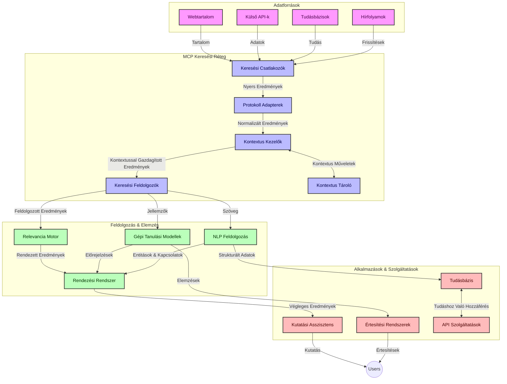
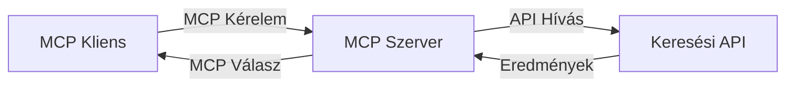
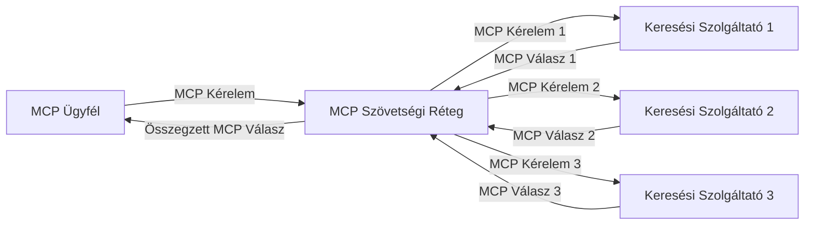
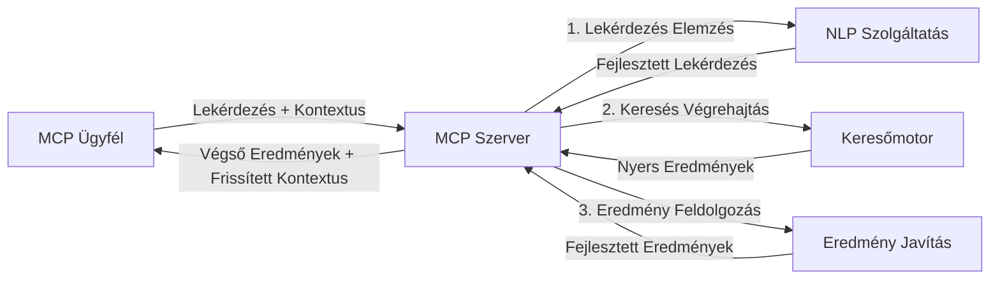

# Modell Kontex Protocol az Élő Webes Kereséshez

## Áttekintés

Az élő webes keresés napjaink információvezérelt környezetében elengedhetetlen, ahol az alkalmazásoknak azonnali hozzáférésre van szükségük a naprakész információkhoz az interneten keresztül, hogy releváns és időben megfelelő válaszokat nyújtsanak. A Modell Kontex Protocol (MCP) jelentős előrelépést képvisel ezen élő keresési folyamatok optimalizálásában, növelve a keresés hatékonyságát, megőrizve a kontextuális integritást, és javítva az általános rendszer teljesítményét.

Ez a modul azt vizsgálja, hogyan alakítja át az MCP az élő webes keresést úgy, hogy szabványosított megközelítést biztosít a kontextus kezelésében AI modellek, keresőmotorok és alkalmazások között.

### Mit Fogsz Megtanulni

Ebben az átfogó útmutatóban felfedezheted:

- Hogyan teremt az MCP zökkenőmentes hidat az AI modellek és az élő webes keresési képességek között
- Architektúrális minták a hatékony és méretezhető keresési megoldások MCP-vel történő megvalósításához
- Technikák a keresési kontextus több lekérdezés és interakció során történő megőrzésére
- Gyakorlati kódpéldák Pythonban és JavaScriptben különböző keresési forgatókönyvekhez
- Módszerek a relevancia, aktualitás és teljesítmény egyensúlyának fenntartására MCP-alapú keresőrendszerekben

## Bevezetés az Élő Webes Keresésbe

Az élő webes keresés egy technológiai megközelítés, amely lehetővé teszi a webalapú információk folyamatos lekérdezését, feldolgozását és elemzését, amint azok megjelennek vagy frissülnek, így a rendszerek friss és releváns információkat tudnak szolgáltatni minimális késleltetéssel. Ellentétben a hagyományos keresőrendszerekkel, amelyek indexált, akár órákkal vagy napokkal régebbi adatokat használnak, az élő keresés az internet élő adatait dolgozza fel, olyan betekintéseket és információkat nyújtva, amelyek az online tartalom aktuális állapotát tükrözik.

### Az Élő Webes Keresés Alapvető Fogalmai:

- **Folyamatos Lekérdezés Feldolgozás**: A keresési lekérdezések állandóan frissülő adatforrások alapján kerülnek feldolgozásra
- **Akutalizáltság Prioritása**: A rendszerek úgy vannak tervezve, hogy elsőbbséget adjanak a friss információnak
- **Relevancia Egyensúlyozás**: A relevancia és aktualitás közötti egyensúly fenntartása
- **Méretezhető Architektúra**: A rendszereknek képesnek kell lenniük kezelni a változó lekérdezési terheléseket és adattömegeket
- **Kontextuális Megértés**: A felhasználói kontextus megőrzése a keresési iterációk során alapvető a jelentős eredményekhez
- **Dinamikus Lekérdezés Átalakítás**: A lekérdezések adaptív módosítása a kontextus és az előző eredmények alapján
- **Több Forrás Integráció**: Eredmények kombinálása több keresőszolgáltató és webforrás anyagaiból
- **Szemantikus Megértés**: A lekérdezések és tartalom feldolgozása a jelentés alapján, nem pusztán kulcsszavak szerint
- **Élő Rangsorolás**: Az eredmények rangsorolásának folyamatos módosítása, ahogy új információ érkezik

### A Modell Kontex Protocol és az Élő Webes Keresés

A Modell Kontex Protocol (MCP) számos kritikus kihívást kezel az élő webes keresési környezetekben:

1. **Keresési Kontextus Megőrzés**: Az MCP szabványosítja a kontextus fenntartását az elosztott keresési összetevők között, biztosítva, hogy az AI modellek és a feldolgozó egységek hozzáférjenek a releváns lekérdezési előzményekhez és felhasználói preferenciákhoz.

2. **Hatékony Lekérdezés Kezelés**: Strukturált mechanizmusokat biztosítva a kontextus továbbítására, az MCP csökkenti annak overhead-jét, hogy a kontextust minden keresési iterációban ismételni kelljen.

3. **Interoperabilitás**: Az MCP közös nyelvet teremt a kontextus megosztására különféle keresőtechnológiák és AI modellek között, lehetővé téve a rugalmasabb és bővíthetőbb architektúrákat.

4. **Keresésre Optimalizált Kontextus**: Az MCP implementációk priorizálhatják, hogy mely kontextus elemek a leghatékonyabbak a keresés szempontjából, optimalizálva a teljesítményt és a pontosságot.

5. **Adaptív Keresési Feldolgozás**: Az MCP megfelelő kontextuskezelésével a keresőrendszerek dinamikusan állíthatják be a feldolgozást a változó felhasználói igények és információs környezet alapján.

A modern alkalmazásokban, az újság aggregációtól a kutatási asszisztensekig, az MCP integrációja a webes kereső technológiákkal intelligensebb, kontextus-érzékeny keresést tesz lehetővé, amely a felhasználói interakciók folytatásával egyre relevánsabb eredményeket nyújt.

## Tanulási Célok

A lecke végére képes leszel:

- Megérteni az élő webes keresés alapjait és kihívásait a modern alkalmazásokban
- Elmagyarázni, hogyan javítja a Modell Kontex Protocol (MCP) az élő webes keresési képességeket
- Megvalósítani MCP-alapú keresési megoldásokat népszerű keretrendszerek és API-k használatával
- Tervezni és telepíteni méretezhető, nagy teljesítményű keresési architektúrákat MCP-vel
- Alkalmazni az MCP fogalmait különböző felhasználási esetekhez, beleértve a szemantikus keresést, kutatási asszisztenciát és AI-támogatott böngészést
- Értékelni az MCP-alapú kereső technológiák feltörekvő trendjeit és jövőbeli innovációit
- Fejleszteni kontextus-érzékeny keresőrendszereket, amelyek tanulnak a felhasználói interakciókból
- Integrálni a webes keresési képességeket AI asszisztensekbe szabványosított MCP protokollokon keresztül
- Létrehozni többlépcsős kereső pipeline-okat, amelyek kontextus alapján fokozatosan finomítják az eredményeket
- Optimalizálni a keresési teljesítményt úgy, hogy közben átfogó kontextus tudatosságot tart fenn

### Definíció és Jelentőség

Az élő webes keresés folyamatos lekérdezést, keresést és webes információk minimális késleltetésű továbbítását jelenti. Ellentétben a hagyományos keresőmotorokkal, amelyek időszakosan feltérképezik és indexelik a webet, az élő keresés célja, hogy az információk megjelenésük pillanatában legyenek elérhetők, lehetővé téve azonnali hozzáférést a legfrissebb tartalomhoz.

Az élő webes keresés kulcsjellemzői:

- **Frissesség**: Az új tartalom és frissítések prioritása
- **Folyamatos Feldolgozás**: Állandó új információk figyelése
- **Lekérdezés Adaptáció**: A keresési lekérdezések finomítása kontextus és visszacsatolás alapján
- **Azonnali Szolgáltatás**: Keresési eredmények nyújtása minimális késéssel
- **Kontextus Megőrzése**: A korábbi lekérdezéseken alapuló relevancia javítása

### Kihívások a Hagyományos Webes Keresésben

A hagyományos webes keresési megközelítések számos korláttal szembesülnek, ha élő környezetben alkalmazzák őket:

1. **Kontextus Tördelés**: Nehézségek a keresési kontextus fenntartásában több lekérdezésen keresztül
2. **Információ Frissessége**: A legfrissebb információk elérésének és priorizálásának kihívásai
3. **Integrációs Bonyolultság**: Közös működés problémái keresőrendszerek és alkalmazások között
4. **Késleltetési Problémák**: A átfogó keresés és a válaszidő követelmények egyensúlya
5. **Relevancia Finomhangolás**: Pontosság és relevancia biztosítása az aktualitás prioritásával együtt

## A Modell Kontex Protocol (MCP) Megértése a Kereséshez

### Mi az MCP a Keresési Kontextusban?

A Modell Kontex Protocol (MCP) egy szabványosított kommunikációs protokoll, amelyet az AI modellek és alkalmazások közötti hatékony interakciók elősegítésére terveztek. Az élő webes keresés kontextusában az MCP egy keretrendszert biztosít:

- A keresési kontextus megőrzésére a lekérdezési sorozatok során
- A keresési lekérdezési és eredményformátumok szabványosítására
- A keresési paraméterek és eredmények továbbításának optimalizálására
- Az AI modell és a keresőmotor közötti kommunikáció javítására

### Fő Komponensek és Architektúra

Az MCP architektúrája élő webes kereséshez több kulcsfontosságú elemből áll:

1. **Lekérdezés Kontextus Kezelők**: Keresési kontextus kezelése és fenntartása több lekérdezésen keresztül
2. **Keresési Feldolgozók**: Kontextus-érzékeny technikákkal dolgozzák fel a beérkező keresési kérelmeket
3. **Protokoll Adapterek**: Különböző kereső API-k közti átváltás miközben megőrzik a kontextust
4. **Kontextus Tároló**: Hatékonyan tárolja és lekéri a keresési előzményeket és preferenciákat
5. **Keresési Kapcsolók**: Különféle keresőmotorokhoz és web API-khoz való kapcsolódás



### Hogyan Javítja az MCP az Élő Webes Keresést

Az MCP a hagyományos webes keresési kihívásokat így kezeli:

- **Kontextuális Folytonosság**: A lekérdezések közti kapcsolatok fenntartása az egész keresési munkamenetben
- **Optimalizált Továbbítás**: A keresési paraméterek redundanciájának csökkentése intelligens kontextuskezeléssel
- **Szabványosított Felületek**: Egységes API-k biztosítása a keresési összetevők részére
- **Csökkentett Késleltetés**: Feldolgozási overhead minimalizálása hatékony kontextuskezelés révén
- **Javított Relevancia**: A keresési relevancia növelése a felhasználói szándék megőrzésével több lekérdezés során

## Integráció és Megvalósítás

Az élő webes keresőrendszerek gondos architekturális tervezést és megvalósítást igényelnek a teljesítmény és a kontextuális integritás fenntartásához. A Modell Kontex Protocol szabványos megközelítést kínál az AI modellek és keresőtechnológiák integrálására, lehetővé téve kifinomultabb, kontextus-érzékeny keresési folyamatokat.

### Az MCP Integráció Áttekintése a Keresési Architektúrákban

Az MCP megvalósítása élő webes keresési környezetekben több szempontot foglal magában:

1. **Keresési Kontextus Szerializálás**: Az MCP hatékony mechanizmusokat biztosít a kontextuális információk kódolására a keresési kérelmekben, biztosítva, hogy az alapvető kontextus a lekérdezés folyamatán végigkövesse azt. Ez tartalmaz szabványos szerializációs formátumokat, optimalizáltakat a kereséshez kapcsolódó metaadatok számára.

2. **Állapotmegőrző Keresési Feldolgozás**: Az MCP intelligensebb állapotmegőrző feldolgozást tesz lehetővé a kontextus konzisztens reprezentációjának fenntartásával a keresési iterációk során. Ez különösen értékes a többlépcsős keresési pipeline-ok esetében, ahol a kontextus finomítása javítja az eredményeket.

3. **Lekérdezés Bővítés és Finomítás**: Az MCP implementációk lehetővé teszik a kifinomult lekérdezés-bővítést és finomítást az összegyűjtött kontextus alapján, biztosítva egyre relevánsabb eredményeket a keresési munkamenet előrehaladtával.

4. **Eredmény Gyorsítótárazás és Prioritizálás**: A kontextuskezelés szabványosításával az MCP segíti az eredmények gyorsítótárazásának és prioritizálásának menedzselését, lehetővé téve az összetevők számára az alkalmazkodást az alakuló keresési kontextus alapján.

5. **Keresési Föderáció és Aggregáció**: Az MCP elősegíti a keresések összetettebb föderációját több háttérszolgáltató között, strukturált reprezentációkat biztosítva a keresési kontextusról, lehetővé téve az eredmények értelmes agregációját különböző forrásokból.

Az MCP megvalósítása különböző keresőtechnológiák között egységes megközelítést teremt a kontextuskezelésre, csökkentve az egyedi integrációs kódok szükségességét, miközben növeli a rendszer képességét a jelentős kontextus megőrzésére a keresési lekérdezések fejlődése során.

### MCP Különféle Webes Keresési Megvalósításokban

Ezek a példák a jelenlegi MCP specifikáción alapulnak, amely egy JSON-RPC alapú protokollra és megkülönböztetett szállítási mechanizmusokra fókuszál. A kód bemutatja, hogyan valósítható meg egyedi keresési integrációk, miközben teljes kompatibilitást tart fenn az MCP protokollal.


<details>
<summary>Python megvalósítás generikus kereső API-val</summary>

```python
import asyncio
import json
import aiohttp
from typing import Dict, Any, Optional, List
from contextlib import asynccontextmanager
from collections.abc import AsyncIterator

# Szabványos MCP könyvtárak importálása
from mcp.client.session import ClientSession
from mcp.client.streamable_http import streamablehttp_client
from mcp.types import TextContent, CreateMessageRequestParams, CreateMessageResult
from mcp.server.fastmcp import FastMCP

# GyorsMCP szerver létrehozása webes kereséshez
search_server = FastMCP("WebSearch")

# Webes keresési műveletek kezelésére szolgáló osztály
class WebSearchHandler:
    def __init__(self, api_endpoint: str, api_key: str):
        self.api_endpoint = api_endpoint
        self.api_key = api_key
        self.session = None
        
    async def initialize(self):
        """Initialize the HTTP session"""
        self.session = aiohttp.ClientSession(
            headers={"Authorization": f"Bearer {self.api_key}"}
        )
    
    async def close(self):
        """Close the HTTP session"""
        if self.session:
            await self.session.close()
            
    async def perform_search(self, query: str, max_results: int = 5, 
                           include_domains: List[str] = None, 
                           exclude_domains: List[str] = None,
                           time_period: str = "any") -> Dict[str, Any]:
        """Perform web search using the search API"""
        # Keresési paraméterek összeállítása
        search_params = {
            "q": query,
            "limit": max_results,
            "time": time_period
        }
        
        if include_domains:
            search_params["site"] = ",".join(include_domains)
            
        if exclude_domains:
            search_params["exclude_site"] = ",".join(exclude_domains)
        
        # Keresési kérés végrehajtása
        try:
            async with self.session.get(
                self.api_endpoint,
                params=search_params
            ) as response:
                if response.status != 200:
                    error_text = await response.text()
                    raise Exception(f"Search API error: {response.status} - {error_text}")
                
                search_data = await response.json()
                
                # API-specifikus válasz átalakítása szabványos formátummá
                results = []
                for item in search_data.get("results", []):
                    results.append({
                        "title": item.get("title", ""),
                        "url": item.get("url", ""),
                        "snippet": item.get("snippet", ""),
                        "date": item.get("published_date", ""),
                        "source": item.get("source", "")
                    })
                
                return {
                    "query": query,
                    "totalResults": len(results),
                    "results": results
                }
        except Exception as e:
            print(f"Search API request error: {e}")
            raise

# Kereséskezelő inicializálása
search_handler = WebSearchHandler(
    api_endpoint="https://api.search-service.example/search",
    api_key="your-api-key-here"
)

# Élettartam beállítása a kereséskezelő kezeléséhez
@asyncio.asynccontextmanager
async def app_lifespan(server: FastMCP):
    """Manage application lifecycle"""
    await search_handler.initialize()
    try:
        yield {"search_handler": search_handler}
    finally:
        await search_handler.close()

# Szerver élettartamának beállítása
search_server = FastMCP("WebSearch", lifespan=app_lifespan)

# Webes kereső eszköz regisztrálása
@search_server.tool()
async def web_search(query: str, max_results: int = 5, 
                   include_domains: List[str] = None,
                   exclude_domains: List[str] = None,
                   time_period: str = "any") -> Dict[str, Any]:
    """
    Search the web for information
    
    Args:
        query: The search query
        max_results: Maximum number of results to return (default: 5)
        include_domains: List of domains to include in search results
        exclude_domains: List of domains to exclude from search results
        time_period: Time period for results ("day", "week", "month", "any")
        
    Returns:
        Dictionary containing search results
    """
    ctx = search_server.get_context()
    search_handler = ctx.request_context.lifespan_context["search_handler"]
    
    results = await search_handler.perform_search(
        query=query,
        max_results=max_results,
        include_domains=include_domains,
        exclude_domains=exclude_domains,
        time_period=time_period
    )
    
    return results

# Példa kliens használatra
async def client_example():
    # Kapcsolódás a keresőszerverhez Streamable HTTP átvitel segítségével
    async with streamablehttp_client("http://localhost:8000/mcp") as (read, write, _):
        async with ClientSession(read, write) as session:
            # Kapcsolat inicializálása
            await session.initialize()
            
            # A web_search eszköz meghívása
            search_results = await session.call_tool(
                "web_search", 
                {
                    "query": "latest developments in AI and Model Context Protocol",
                    "max_results": 5,
                    "time_period": "day",
                    "include_domains": ["github.com", "microsoft.com"]
                }
            )
            
            print(f"Search results: {search_results}")

# Szerver futtatási példa
if __name__ == "__main__":
    # Szerver futtatása Streamable HTTP átvitel segítségével
    search_server.run(transport="streamable-http")
```
</details> 

<details>
<summary>JavaScript megvalósítás böngészőalapú kereséssel</summary>


```javascript
// MCP szerver megvalósítása webes kereséshez
import { McpServer, ResourceTemplate } from '@modelcontextprotocol/sdk/server/mcp.js';
import { StreamableHTTPServerTransport } from '@modelcontextprotocol/sdk/server/streamableHttp.js';
import { z } from 'zod';

// MCP szerver létrehozása webes kereséshez
const searchServer = new McpServer({
    name: "BrowserSearch",
    description: "A server that provides web search capabilities"
});

// Keresési szolgáltatás osztály
class SearchService {
    constructor(searchApiUrl, apiKey) {
        this.searchApiUrl = searchApiUrl;
        this.apiKey = apiKey;
    }

    async performSearch(parameters) {
        const {
            query = '',
            maxResults = 5,
            includeDomains = [],
            excludeDomains = [],
            timePeriod = 'any'
        } = parameters;
        
        // Keresési URL összeállítása paraméterekkel
        const url = new URL(this.searchApiUrl);
        url.searchParams.append('q', query);
        url.searchParams.append('limit', maxResults);
        url.searchParams.append('time', timePeriod);
        
        if (includeDomains.length > 0) {
            url.searchParams.append('site', includeDomains.join(','));
        }
        
        if (excludeDomains.length > 0) {
            url.searchParams.append('exclude_site', excludeDomains.join(','));
        }
        
        try {
            const response = await fetch(url.toString(), {
                method: 'GET',
                headers: {
                    'Authorization': `Bearer ${this.apiKey}`,
                    'Content-Type': 'application/json'
                }
            });
            
            if (!response.ok) {
                const errorText = await response.text();
                throw new Error(`Search API error: ${response.status} - ${errorText}`);
            }
            
            const searchData = await response.json();
            
            // API-specifikus válasz átalakítása szabványos formátumba
            const results = searchData.results?.map(item => ({
                title: item.title || '',
                url: item.url || '',
                snippet: item.snippet || '',
                date: item.published_date || '',
                source: item.source || ''
            })) || [];
            
            return {
                query,
                totalResults: results.length,
                results
            };
        } catch (error) {
            console.error('Search API request error:', error);
            throw error;
        }
    }
}

// Keresési szolgáltatás inicializálása
const searchService = new SearchService(
    'https://api.search-service.example/search',
    'your-api-key-here'
);

// Kontextus szolgáltató beállítása a szerverhez
searchServer.setContextProvider(() => {
    return {
        searchService
    };
});

// Webes kereső eszköz regisztrálása
searchServer.tool({
    name: 'web_search',
    description: 'Search the web for information',
    parameters: {
        type: 'object',
        properties: {
            query: {
                type: 'string',
                description: 'The search query'
            },
            maxResults: {
                type: 'integer',
                description: 'Maximum number of results to return',
                default: 5
            },
            includeDomains: {
                type: 'array',
                items: { type: 'string' },
                description: 'List of domains to include in search results'
            },
            excludeDomains: {
                type: 'array',
                items: { type: 'string' },
                description: 'List of domains to exclude from search results'
            },
            timePeriod: {
                type: 'string',
                description: 'Time period for results',
                enum: ['day', 'week', 'month', 'any'],
                default: 'any'
            }
        },
        required: ['query']
    },
    handler: async (params, context) => {
        const { searchService } = context;
        return await searchService.performSearch(params);
    }
});

// Példa klienskód a kereső szerverhez való kapcsolódáshoz
import { Client } from '@modelcontextprotocol/sdk/client/index.js';
import { StreamableHTTPClientTransport } from '@modelcontextprotocol/sdk/client/streamableHttp.js';

async function connectToSearchServer() {
    // Kapcsolódás a kereső szerverhez
    const transport = new StreamableHTTPClientTransport(
        new URL('http://localhost:8000/mcp')
    );
    
    const client = new Client({
        name: 'search-client',
        version: '1.0.0'
    });
    
    await client.connect(transport);
    
    // Kereső eszköz végrehajtása
    const searchResults = await client.callTool({
        name: 'web_search',
        arguments: {
            query: 'Model Context Protocol implementation examples',
            maxResults: 10,
            timePeriod: 'week',
            includeDomains: ['github.com', 'docs.microsoft.com']
        }
    });
    
    console.log('Search results:', searchResults);
    
    // Takarítás
    await client.disconnect();
}

// Szerver indítása
const transport = new StreamableHTTPServerTransport();
await searchServer.connect(transport);
console.log('Search server running at http://localhost:8000/mcp');

// Egy külön folyamatban vagy a szerver indítása után
// connectToSearchServer().catch(console.error);
```
</details> 


## Kódpéldák Jogi Nyilatkozata

> **Fontos Megjegyzés**: Az alábbi kódpéldák bemutatják a Modell Kontex Protocol (MCP) integrálását webes keresési funkciókkal. Bár követik az hivatalos MCP SDK-k mintáit és szerkezeteit, oktatási célokra egyszerűsítettek.
> 
> Ezek a példák magukban foglalják:
> 
> 1. **Python Megvalósítás**: Egy FastMCP szerver megvalósítást, amely webes keresési eszközt biztosít és csatlakozik egy külső kereső API-hoz. Ez a példa bemutatja a megfelelő élettartam kezelést, kontextuskezelést és eszköz implementációt, az [hivatalos MCP Python SDK](https://github.com/modelcontextprotocol/python-sdk) mintái szerint. A szerver a javasolt Streamable HTTP szállítást használja, amely leváltotta a régebbi SSE szállítást a termelési környezetekben.
> 
> 2. **JavaScript Megvalósítás**: Egy TypeScript/JavaScript implementáció a FastMCP mintájára, az [hivatalos MCP TypeScript SDK](https://github.com/modelcontextprotocol/typescript-sdk) alapján, amely egy kereső szervert hoz létre megfelelő eszköz definíciókkal és kliens kapcsolatokkal. Követi a legfrissebb javasolt mintákat a munkamenet-kezelés és kontextus megőrzés terén.
> 
> Ezek a példák további hibakezelést, hitelesítést és specifikus API integrációs kódot igényelnének éles használathoz. A bemutatott kereső API végpontok (`https://api.search-service.example/search`) helykitöltők, melyeket tényleges keresőszolgáltató végpontokra kellene cserélni.
> 
> A teljes megvalósítási részletekért és a legfrissebb megközelítésekért kérjük, tekintsd meg az [hivatalos MCP specifikációt](https://spec.modelcontextprotocol.io/) és az SDK dokumentációt.

## Alapfogalmak

### A Modell Kontex Protocol (MCP) Keretrendszer

Alapvetően a Modell Kontextus Protocol szabványosított módot biztosít AI modellek, alkalmazások és szolgáltatások számára a kontextus cseréjére. Az élő webes keresésben ez a keret alapvető a koherens, többszörös körös keresési élmények létrehozásához. A fő komponensek közé tartozik:

1. **Kliens-Szerver Architektúra**: Az MCP világos elkülönítést teremt a keresési kliensek (kérvényezők) és a kereső szerverek (szolgáltatók) között, rugalmas telepítési modellek engedélyezésével.

2. **JSON-RPC Kommunikáció**: A protokoll JSON-RPC-n keresztül küldi az üzeneteket, így kompatibilis a webes technológiákkal és könnyen megvalósítható különböző platformokon.

3. **Kontextuskezelés**: Az MCP strukturált módszereket definiál a keresési kontextus fenntartására, frissítésére és hasznosítására több interakció során.

4. **Eszköz Definíciók**: A keresési képességek szabványosított eszközökként válnak elérhetővé, jól definiált paraméterekkel és visszatérési értékekkel.

5. **Streaming Támogatás**: A protokoll támogatja az eredmények streamelését, ami elengedhetetlen az élő keresésnél, ahol az eredmények fokozatosan érkeznek.

### Webes Keresési Integrációs Minták

Az MCP webes kereséssel történő integrálásakor több minta is megjelenik:

#### 1. Direkt Keresőszolgáltató Integráció



Ebben a mintában az MCP szerver közvetlenül interfészel egy vagy több kereső API-val, MCP kéréseket API-specifikus hívásokká alakítva át, és az eredményeket MCP válaszokká formázva.

#### 2. Federált Keresés Kontextus Megőrzéssel



Ez a minta a keresési lekérdezéseket több, MCP-kompatibilis keresőszolgáltató között osztja szét, mindegyik potenciálisan a tartalom vagy keresési képesség különböző típusaira szakosodva, miközben egységes kontextust tart fenn.

#### 3. Kontextusban Gazdagított Keresési Lánc



Ebben a mintában a keresési folyamat több szakaszra oszlik, a kontextus minden lépésben gazdagodik, ami egyre relevánsabb eredményekhez vezet.

### Keresési Kontextus Komponensek

Az MCP-alapú webes keresésben a kontextus általában tartalmazza:

- **Lekérdezési Előzmények**: A munkamenet korábbi keresési lekérdezései
- **Felhasználói Preferenciák**: Nyelv, régió, biztonságos keresési beállítások
- **Interakciós Előzmények**: Mely eredményeket kattintották meg, mennyi időt töltöttek az eredményeken
- **Keresési Paraméterek**: Szűrők, rendezési sorrendek és egyéb keresési módosítók
- **Tárgyi Tudás**: A keresés szempontjából releváns témaspecifikus kontextus
- **Időbeli Kontextus**: Időalapú relevanciaszempontok
- **Forrás Preferenciák**: Megbízható vagy preferált információforrások

## Használati Esetek és Alkalmazások

### Kutatás és Információgyűjtés

Az MCP javítja a kutatási munkafolyamatokat azáltal, hogy:

- Megőrzi a kutatási kontextust a keresési munkameneteken keresztül
- Lehetővé teszi a kifinomultabb és kontextusban relevánsabb lekérdezéseket
- Támogatja a többforrásos keresési föderációt
- Elősegíti a tudás kinyerést a keresési eredményekből

### Élő Hírek és Trendfigyelés

Az MCP-alapú keresés előnyöket kínál a hírek monitorozásában:

- Közel valós idejű felderítése a felbukkanó híreknek
- Kontextus alapú releváns információk szűrése
- Témák és entitások követése több forrás között
- Személyre szabott hírriasztások a felhasználói kontextus alapján

### AI-Támogatott Böngészés és Kutatás

Az MCP új lehetőségeket teremt AI-támogatott böngészésre:

- Kontextus alapú keresési javaslatok a jelenlegi böngészési tevékenység alapján
- Zökkenőmentes integráció a webes keresés és LLM-alapú asszisztensek között
- Többszörös körös keresési finomítás megőrzött kontextussal
- Fejlettebb tényellenőrzés és információ ellenőrzés

## Jövőbeli Trendek és Innovációk

### Az MCP Evolúciója a Webes Keresésben

Előre tekintve, várhatóan az MCP továbbfejlődik, hogy kezelje:


- **Multimodális Keresés**: Szöveg, kép, hang és videó keresés integrálása megőrzött kontextussal
- **Decentralizált Keresés**: Elosztott és szövetségi keresési ökoszisztémák támogatása
- **Keresési Adatvédelem**: Kontextus-érzékeny adatvédelmi mechanizmusok a keresés során
- **Lekérdezés Értelmezés**: Mély szemantikai elemzés a természetes nyelvű keresési lekérdezésekhez

### Potenciális Technológiai Fejlesztések

Az MCP-k keresés jövőjét alakító újonnan megjelenő technológiák:

1. **Neuronális Keresési Architektúrák**: Beágyazás-alapú keresési rendszerek, amelyek MCP-re optimalizáltak
2. **Személyre szabott Keresési Kontextus**: Egyéni felhasználói keresési minták tanulása idővel
3. **Tudásgráf Integráció**: Kontextus-alapú keresés specifikus tudásgráfokkal kiegészítve
4. **Kereszt-modális Kontextus**: Kontextus megtartása különböző keresési módok között

## Gyakorlati Feladatok

### 1. Gyakorlat: Alap MCP keresési csővezeték beállítása

Ebben a gyakorlatban megtanulod, hogyan:
- Alap MCP keresési környezetet konfigurálj
- Kontextus-kezelőket valósíts meg webes kereséshez
- Teszteld és validáld a kontextus megőrzését keresési iterációk során

### 2. Gyakorlat: Kutatási asszisztens építése MCP kereséssel

Készíts egy teljes alkalmazást, amely:
- Feldolgozza a természetes nyelvű kutatási kérdéseket
- Kontextus-érzékeny webes kereséseket végez
- Több forrásból származó információkat szintetizál
- Rendszerezett kutatási eredményeket mutat be

### 3. Gyakorlat: Több-forrású keresési szövetség megvalósítása MCP-vel

Haladó gyakorlat, amely lefedi:
- Kontextus-érzékeny lekérdezés továbbítást több keresőmotorhoz
- Eredmények rangsorolását és aggregálását
- Kontextuális duplikációmentesítést a keresési eredmények között
- Forrásspecifikus metaadatok kezelését

## További Források

- [Model Context Protocol Specification](https://spec.modelcontextprotocol.io/) - Hivatalos MCP specifikáció és részletes protokoll dokumentáció
- [Model Context Protocol Dokumentáció](https://modelcontextprotocol.io/) - Részletes oktatóanyagok és megvalósítási útmutatók
- [MCP Python SDK](https://github.com/modelcontextprotocol/python-sdk) - MCP protokoll hivatalos Python megvalósítása
- [MCP TypeScript SDK](https://github.com/modelcontextprotocol/typescript-sdk) - MCP protokoll hivatalos TypeScript megvalósítása
- [MCP Referencia Szerverek](https://github.com/modelcontextprotocol/servers) - MCP szerverek referencia implementációi
- [Bing Web Search API Dokumentáció](https://learn.microsoft.com/en-us/bing/search-apis/bing-web-search/overview) - A Microsoft webes kereső API-ja
- [Google Custom Search JSON API](https://developers.google.com/custom-search/v1/overview) - A Google testreszabható keresőmotorja
- [SerpAPI Dokumentáció](https://serpapi.com/search-api) - Keresőmotor eredményoldal API
- [Meilisearch Dokumentáció](https://www.meilisearch.com/docs) - Nyílt forráskódú keresőmotor
- [Elasticsearch Dokumentáció](https://www.elastic.co/guide/index.html) - Elosztott keresési és analitikai motor
- [LangChain Dokumentáció](https://python.langchain.com/docs/get_started/introduction) - Alkalmazások építése LLM-ekkel

## Tanulási Eredmények

A modul elvégzése után képes leszel:

- Megérteni a valós idejű webes keresés alapjait és kihívásait
- Elmagyarázni, hogyan javítja a Model Context Protocol (MCP) a valós idejű webes keresést
- MCP-alapú keresési megoldásokat megvalósítani népszerű keretrendszerek és API-k segítségével
- Skálázható, nagy teljesítményű keresési architektúrákat tervezni és telepíteni MCP-vel
- MCP koncepciókat alkalmazni különféle esetekben, például szemantikai keresés, kutatási asszisztencia, és MI-vel támogatott böngészés során
- Értékelni a felmerülő trendeket és jövőbeni innovációkat az MCP-alapú keresési technológiákban


### Bizalom és Biztonság Megfontolások

Az MCP-alapú webes keresési megoldások megvalósításakor tartsd szem előtt a MCP specifikáció fontos alapelveit:

1. **Felhasználói Hozzájárulás és Ellenőrzés**: A felhasználóknak kifejezetten bele kell egyezniük, és meg kell érteniük minden adat-hozzáférést és műveletet. Ez különösen fontos a külső adatforrásokat elérő webes keresési megvalósítások esetén.

2. **Adatvédelem**: Biztosítani kell a keresési lekérdezések és eredmények megfelelő kezelését, különösen, ha érzékeny információkat tartalmazhatnak. Megfelelő hozzáférés-vezérlést kell alkalmazni felhasználói adatok védelmére.

3. **Eszközbiztonság**: Megfelelő jogosultság-ellenőrzést és validációt kell bevezetni a keresőeszközöknél, mert ezek potenciális biztonsági kockázatot jelentenek tetszőleges kód végrehajtásán keresztül. Az eszközök viselkedésének leírásait nem szabad megbízhatónak tekinteni, kivéve, ha azokat megbízható szerver szolgáltatja.

4. **Átlátható Dokumentáció**: Biztosíts világos dokumentációt az MCP-alapú keresési megvalósítás képességeiről, korlátairól és biztonsági megfontolásairól, az MCP specifikáció megvalósítási útmutatóit követve.

5. **Robusztus Hozzájárulási Folyamatok**: Építs ki erős hozzájárulási és engedélyezési folyamatokat, amelyek egyértelműen elmagyarázzák, mit csinál az adott eszköz, mielőtt engedélyeznéd a használatát, különösen az olyan eszközöknél, amelyek külső webes erőforrásokkal lépnek kapcsolatba.

A MCP biztonságára és bizalmi megfontolásaira vonatkozó teljes részletekért tekintsd meg a [hivatalos dokumentációt](https://modelcontextprotocol.io/specification/2025-11-25/basic/security_best_practices).

## Mi következik ezután

- [5.12 Entra ID hitelesítés Model Context Protocol szerverekhez](../mcp-security-entra/README.md)

---

<!-- CO-OP TRANSLATOR DISCLAIMER START -->
**Jogi nyilatkozat**:
Ez a dokumentum az AI fordítási szolgáltatás, a [Co-op Translator](https://github.com/Azure/co-op-translator) segítségével készült. Bár az pontosságra törekszünk, kérjük, vegye figyelembe, hogy az automatikus fordítások hibákat vagy pontatlanságokat tartalmazhatnak. Az eredeti dokumentum az anyanyelvén tekintendő hiteles forrásnak. Fontos információk esetén professzionális emberi fordítást javasolunk. Nem vállalunk felelősséget semmilyen félreértésért vagy téves értelmezésért, amely ebből a fordításból ered.
<!-- CO-OP TRANSLATOR DISCLAIMER END -->